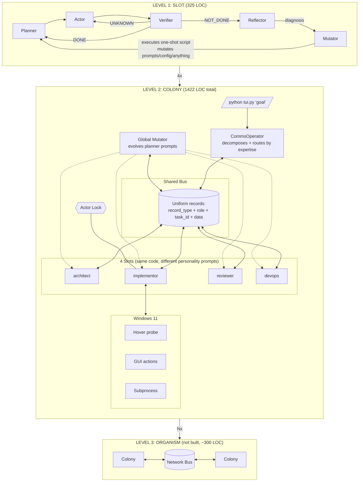
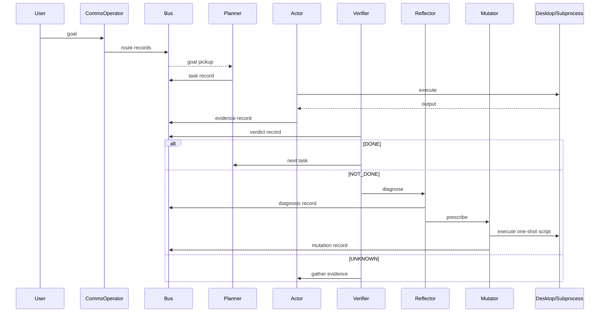

# endgame-ai

A self-evolving agentic runtime for Windows 11. Model agnostic. Single process. 1422 LOC.

## Architecture



## Execution Flow



## How to Run

```powershell
python tui.py "your goal"
```

One command. System decides complexity.

| Flag | Purpose |
|------|---------|
| `--host url` | LM Studio address (default: localhost:1234) |
| `--no-desktop` | Skip screen observation |
| `--workspace path` | Working directory |
| `--bus-file path` | Persist bus to disk |
| `--temperature float` | LLM temperature (default: 0.12) |
| `--max-tokens int` | LLM max output (default: 1536) |
| `--timeout int` | LLM timeout seconds (default: 600) |

| Key | Action |
|-----|--------|
| Enter | New goal |
| 1-4 | Toggle slot |
| q | Quit |

## Design Principles

### Governance by Prompt, Not Code

```
CODE:      permits everything (no restrictions)
PROMPTS:   instruct who does what (soft governance)
BUS:       records what happened (observability)
VERIFIER:  judges outcomes (feedback signal)
CYCLE CAP: 5 attempts (only hard limit — prevents infinite loops)
```

No permission checks. No role enforcement in code. The mutator CAN rewrite any file — it is INSTRUCTED via prompt to focus on actor/verifier. If it violates that instruction, the next cycle's verifier catches the outcome.

### Mutation Is One-Shot Execution

```
Reflector diagnoses → Mutator writes Python script → Script runs ONCE → State changes
```

Not a polling loop. Not a persistent plugin. One event that mutates state (prompt files, config, anything), then is discarded. The effect persists because the files on disk changed.

### Model Agnostic

The system works with any model loaded in LM Studio:
- Small models (4B): more errors, more mutation cycles, still converges
- Large models (70B+): fewer errors, faster convergence, same architecture
- Schema enforcement (`strict` parameter): eliminates malformed JSON entirely
- 32k+ context: allows richer history and bus context per call

The architecture compensates for weak models through feedback loops. Stronger models simply need fewer loops to converge.

### Unified Bus Record

Every circuit publishes to the bus with the same shape:

```
Record(record_type, role, task_id, data)
```

Where `record_type` is: task, action, evidence, claim, verdict, diagnosis, mutation, route.

This is the universal communication primitive. LLM outputs map directly to bus records. Bus records are what the next circuit reads. No transformation layer between them.

### Future: Schema Enforcement

With LM Studio's `strict` mode and sufficient context, all circuits can share one enforced output schema:

```json
{
  "record_type": "task|action|verdict|diagnosis|mutation",
  "data": {}
}
```

LLM output = bus record. No parsing ambiguity. Schema enforcement eliminates malformed JSON entirely. This removes ~30 lines of fallback parsing code and makes the system more reliable with any model size.

Currently the prompts specify JSON format per circuit. Schema enforcement is the next evolution: same semantic contract, machine-guaranteed compliance.

## What Differentiates Slots

All slots run identical code (`Slot` class). They differ by:

1. **Personality prompt** — from `prompts/personalities/{name}.txt`
2. **Routed goal** — CommsOperator assigns different sub-goals
3. **Desktop access** — only implementor has `can_act_desktop=True`

Any slot can evolve into any role if the mutator rewrites its personality prompt. The roles are cultural (prompt-governed), not structural (code-enforced).

## Self-Evolution

Self-evolution is the mechanism that makes the system functional, not a feature that makes it special.

A static agent repeats the same failing action forever. This system:

1. **Detects failure** (verifier returns NOT_DONE)
2. **Diagnoses cause** (reflector: "wrong button because window not focused")
3. **Mutates behavior** (mutator: rewrites actor prompt to focus window first)
4. **Retries with new behavior** (next cycle uses mutated prompt)

Without this loop, any unexpected screen state or application behavior would stall the system permanently. With it, the system adapts to any environment without hardcoded application knowledge.

## Security Model

**Intentionally unsecured.** The system can:
- Execute any command
- Write any file
- Modify its own prompts
- Click anything on screen

The security boundary is the Windows user account. The system has exactly the permissions of the logged-in user. Any code-level restriction would limit the task space and prevent self-evolution.

## Files

```
tui.py        225 LOC   Entry point + display + keyboard
colony.py     175 LOC   CommsOperator + GlobalMutator + orchestration
slot.py       325 LOC   Planner + Actor + Verifier + Reflector + Mutator
desktop.py    428 LOC   Screen observation (hover probe) + GUI actions
llm.py        112 LOC   LM Studio HTTP client
actions.py     82 LOC   Verb executor
bus.py         75 LOC   Shared blackboard
prompts/                Mutable governance layer
  planner.txt           Task decomposition
  actor.txt             Action selection
  verifier.txt          Verdict evaluation
  reflector.txt         Failure diagnosis
  mutator.txt           Mutation script generation
```

**1422 LOC. Zero external dependencies. Python 3.12+ stdlib only.**

---

## AI CONTINUATION HANDOVER

### Identity

`endgame-ai` — self-evolving agentic runtime. Model agnostic. Operates Windows 11 desktop. Runs on any LM Studio model (tested: Nemotron 4B, works with any size).

### Rules

1. OOP with injection. No globals, singletons, env vars.
2. Bus is the only IPC. Slots never call each other.
3. Single process. No subprocess management for slots.
4. No code-level constraints. Governance via prompts only.
5. Prompts are mutable at runtime. Mutator rewrites them.
6. Cycle cap = 5. Only hard safety net.
7. Verifier never trusts actor claims.
8. Colony is composable. Instantiate N times with shared bus.
9. Mutation is one-shot. Script runs once, not in a loop.
10. Reflector diagnoses, Mutator prescribes. Two LLM calls.

### Testing

```python
from slot import Slot
from bus import Bus
from llm import LLMResult

class MockLLM:
    def __init__(self, responses):
        self._r = list(responses); self._i = 0
    def call(self, system, user, **kw):
        if self._i < len(self._r): r = self._r[self._i]; self._i += 1; return r
        return LLMResult(text='')

bus = Bus()
slot = Slot(name="test", llm=MockLLM([...]), bus=bus, prompts_dir=..., workspace=...)
slot.set_goal("goal")
result = slot.step()
```

### Expected Behavior

The system WILL produce errors. That is normal. Errors are input to self-correction:

```
plan → fail → reflect → mutate → retry differently → succeed
```

Do not prevent errors. Ensure they are caught, recorded to bus, and feed the reflector/mutator loop.
