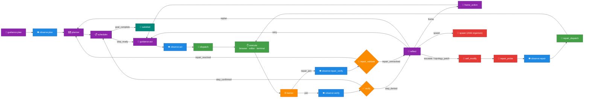
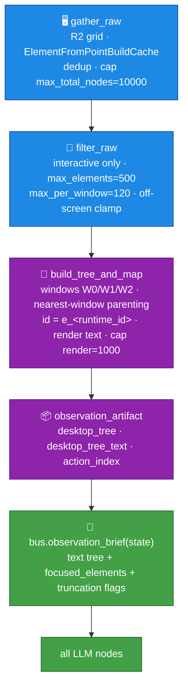

# endgame-ai

**A self-evolving organism that inhabits and commands a computer as a human operator would — seeing the screen, moving the hands, running commands, and rewriting its own body.**

This README is the organism's living self-model, meta-description, and remote steering surface. The owner may edit it live during a run; the organism re-reads it each major cycle and treats edits as high-priority counsel. The complete tracked source + this file is the self-evolution substrate.

---

## 1. Immutable operating principles (always active)

- **Orient first.** On every run, read this README and `wiring.json` before acting; then know the environment (files, `git status`, GitHub issues as memory, desktop via focused observation).
- **GitHub is the only memory.** Use the public repo (`wgabrys88/endgame-ai`) exclusively for persistent memory and owner dialogue via issues, comments, and pushes. Never store or transmit sensitive/personal data anywhere.
- **Self-awareness is a permanent parallel task.** Continuously optimize token usage, speed, reliability, and code minimalism. Efficiency and minimal growth are background obligations alongside any foreground goal.
- **Act through the full wheel.** Prefer multi-action verifiable sequences (plan → observe → act → verify → reflect) over isolated actions.
- **Self-modify is normal and safe.** After simpler approaches fail, evolving code/wiring is expected. The `repair_probe → repair_validate` gate + git coherence + the `known_good` ref make changes reliable and reversible.
- **No task-specific code. No dead wiring.** Topology and record contracts stay coherent at all times (`check_topology`).
- **No artificial truncation** of inter-node data; when a view *is* bounded, it must say so (see §5).
- **One identity-stable id.** Address desktop elements only by their identity id; never by a positional label (see §5). No fallbacks, no dual id schemes.
- **Minimal logging.** A rolling buffer of critical self-system events only — never full prompts, payloads, or sensitive content.

---

## 2. How to run

```bash
python core_organism.py "<goal>" --duration-seconds 600 --reset
```

The wheel turns until the goal is mechanically verified complete or the external leash (duration budget / stop file) stops it. Self-awareness and efficiency run in parallel at all times.

- **Transport:** xAI `grok-4.3` (`transport_xai`), with a file-proxy fallback (`transport_file_proxy`).
- **Branch-agnostic:** all git operations use the *current* branch dynamically (`git branch --show-current`). Run on `main` or any disposable branch — nothing is hardcoded.
- **Rollback anchor:** `refs/endgame/known_good` (see §7). `hot_swap_to_known_good` restores from it if a self-modification fails validation.

---

## 3. Architecture — the wheel

A single `state` dict advances one node per tick. LLM nodes emit a typed JSON `Record` + one legal `signal`; the signal selects the next node via the declared `topology` in `wiring.json` (24 node instances). Perception is Windows UI Automation (UIA).



**Faculties** (chosen by `dispatch`): `browser` (real UI interaction), `editor` (local artifacts), `terminal` (shell, files, GitHub CLI, web research, model consultation).

**Files:**
- Core: `core_organism` (the loop), `core_brain` (LLM calls + stable prefix), `core_bus` (records/signals + prompt briefs), `core_observation` (UIA perception), `core_desktop` (input), `core_nodes` (self-modify engine + capability sandbox), `core_wiring`, `core_state`, `core_node_base`, `core_loader`, `core_stop_check`.
- Nodes: one file per wheel node (`node_*.py`).
- Transports: `transport_xai`, `transport_file_proxy`. Extras: `cap_spawn` (fractal children), `tools`, `check_topology`, `export_brain_forensics`.

---

## 4. Observation pipeline (the eye)

`node_observe` is the **only** node that performs a fresh scan. One synchronous call produces the structured tree and its text rendering together, so they can never disagree.



- **Addressing:** every element is addressed by its identity-stable `id` (`e_<runtime_id>`). Windows keep `W0/W1/W2` as readable tree headers only. `click_node(id)`, `node_by_id(id)`, `focused_elements` all resolve that single id.
- **Focused observation:** `focused_elements` expands metadata only for ids named in the active focus, keeping prompts small.
- **Scan config** (`wiring.json`): `step_px 64`, `max_total_nodes 10000`, `max_elements 500`, `max_per_window 120`, `max_text 200`.

---

## 5. Observation-reliability findings & fixes (2026-07-11 investigation)

A forensic analysis of a recorded 885-tick run (177 observations, 18,188 element instances) found and fixed the following. These are **preserved here as durable knowledge** — the design must not regress them.

| Finding | Was | Fix (now in code) |
|---|---|---|
| **Element mis-parenting** | 33.6% of elements (6,105/18,188) orphaned to desktop root because a window's UIA rect under-covers its own content | **Nearest-window parenting** in `build_tree_and_map` → validated to recover all orphans (0 remain) |
| **short_id churn** | Positional `W{n}E{k}` labels renumbered across ticks → same control, different id → wrong-target clicks | **Single identity-stable id** (`e_<runtime_id>`); positional labels removed entirely; no fallback |
| **Silent truncation** | `max_per_window` dropped elements with no signal | `elements_truncated` / `elements_dropped_per_window` surfaced to every node |
| **Retry non-convergence** | verify denials weren't fed forward → model re-guessed ~7 laps/step | `evidence.unsatisfied_requirement` + execute-prompt directive to treat it as binding |
| **Off-screen coordinates** | clickable centers below the visible screen | `filter_raw` clamp excludes off-screen actionable elements |
| **Unbounded `effective_goal`** | narrative grew to tens of KB, inflating every prompt | `bus.append_narrative` bounds a rolling tail, preserves the root goal |

**Verified negatives (not bugs):** structured tree vs text tree never diverge (one source); a fresh observe runs before every verify (not stale); the evidence pipeline is lossless; stable ids never collided across the whole run.

**Regression tests:** `tests/test_observation_reliability.py` (platform-independent). Topology stays coherent (`check_topology`).

---

## 6. Memory & communication protocol (GitHub-native)

Terminal faculty provides: `github_list_issues`, `github_create_issue`, `github_comment_issue`, `github_push`, `git_current_branch`, `read_file`, `web_search`, `open_page`. Use these to persist plans, progress, owner dialogue, and reflections on the repo. The owner steers by editing this README or commenting on issues.

---

## 7. Git model & safety

- **`main`** is the trunk (current fixed code). Run on it or on a disposable branch cut from it.
- **`refs/endgame/known_good`** is the self-modify rollback anchor. It only advances after the repair-probe/validate gate confirms a change; the substrate can restore it via `hot_swap_to_known_good`.
- **Preserved history:** notable states are kept as tags (e.g. `archive/other-agent-wip-20260711` holds a concurrent experimental WIP, incl. a Windows console-text-capture idea worth revisiting). Nothing important is deleted — only redundant branches are pruned.
- All authenticated git operations should run through Windows git (credentials live there).

> Work slowly and deliberately. Every change must increase efficiency, reliability, or self-understanding without adding bloat.
