# endgame-ai

## A field guide to a goal-driven, self-observing, self-rewriting organism that speaks in commandments

> This document explains the system in ordinary language, from the system's own unusual architectural point of view.
>
> It does not pretend that endgame-ai is a finished replacement for a human.
>
> It explains why the design can grow toward that role, what the current body does now, what remains constrained, and how to give it goals that reveal useful work and architectural weakness at the same time.
>
> It is written as a handover. A new human operator, a new AI session, or a future instance of endgame-ai reading its own source should be able to begin from this file alone.

---

## One-sentence orientation

endgame-ai is a continuing wheel of wired faculties that turns a vague human goal into plans, observations, executable deeds, observed verdicts, lessons, child investigations, and behaviorally tested changes to its own body, and every thinking faculty is addressed in the register of ancient scripture.

---

## What changed most recently, stated plainly

This README describes the organism after a focused simplification and alignment pass. The concrete changes, all live on disk and all proven by running the real wheel:

- Two command-line parameters were removed: a start-node override and a brain-call budget. The organism always starts from its cycle-start node, and it is not caged by a call ceiling it cannot itself overwrite.
- The observation brief stopped duplicating the desktop. The rendered tree and the structured element map no longer carry the same elements twice.
- Every thinking prompt, every injected consumer contract, every narrative testimony line, and the kernel-generated prompt framing were rewritten in a biblical commandment register. This is a deliberate technique, explained in its own part below.
- The downstream next-signal instruction is now emitted only for the two faculties whose record can actually carry a signal choice. The other faculties no longer receive a command their output schema forbids.

The final change produced a directly observed improvement: a fresh run reached its first verified step in fewer laps than before, because the planner was no longer resolving a contradiction planted at the most attended position in its prompt.

---

## The honest thesis

The strongest fact about endgame-ai is not that it can click a button.

Many automation tools can click buttons.

The strongest fact is not even that it can execute arbitrary Python.

Many agent frameworks can execute Python.

The unusual fact is the combination:

- the current world is observed;

- a goal is interpreted;

- a plan is narrated;

- one deed is authored;

- one runner performs it;

- a fresh observation judges the effect;

- denial becomes causal testimony;

- the organism chooses among retrying, reframing, replanning, spawning, rewiring, or rewriting itself;

- a self-change is treated as an untrusted candidate;

- the candidate must prove the failed behavior has changed;

- only then does the private known-good marker move.

That combination is a seed of open-ended operation.

It is not a proof of human equivalence.

It is not a proof of eventual omnipotence.

It is a logically meaningful bridge between a fixed program and a system that can revise the bridge while walking across it.

---

## What this README is trying to achieve

By the end of this document, a reader should understand six things.

First, the system is a graph, not a conventional task script.

Second, the narrative is its continuity of mind, while the wiring is its continuity of form.

Third, observed effect is the only legitimate basis for claiming a task step complete.

Fourth, self-evolution is a decision made by the reflecting organism, not a panic branch imposed by the kernel.

Fifth, arbitrary code execution gives enormous expressive reach but does not remove limits of observation, authority, reasoning, hardware, time, or proof.

Sixth, the scriptural register of the prompts is an engineering choice with a mechanistic justification, not decoration.

---

## Reading map

This is a long field guide rather than a short installation note.

If you want the conceptual model, read: "What kind of thing is this", "The three substrates", "The living wheel", "Why verification changes the meaning of automation".

If you want to operate the system, read: "How to run it", "How to write a root goal", "How to read a run".

If you want to change the architecture, read: "How to read the wiring", "Where behavior lives", "The self-evolution sub-wheel", "What is still hardcoded".

If you care about the language of the prompts, read: "The science of the commandment register".

If you are interested in the speculative edge, read: "The no-goal thought experiment", "The no-prompt thought experiment".

---

# Part I - What kind of thing is this

## It is not a workflow with an AI step inside it

A normal workflow is usually designed like this:

1. receive input;

2. run a fixed sequence;

3. return output;

4. stop.

endgame-ai is designed differently.

It begins from a root goal.

It repeatedly turns a graph of faculties.

The graph decides where each emitted signal goes.

The current state tells each faculty what has happened so far.

The narrative tells each thinking faculty what the organism has lived through.

The desktop observation tells it what appears to be true now.

The code runner gives it a general action language.

The reflection routes give it multiple ways to respond when reality disagrees with expectation.

The self-modification route lets it change the graph, prompts, faculties, transport, or supporting body.

The result is not a model calling tools.

The result is a recursive control loop whose own control structure is mostly data.

```mermaid
%%{init: {"theme":"base","themeVariables":{"background":"#07111f","primaryTextColor":"#f8fafc","lineColor":"#67e8f9","fontFamily":"Inter, Arial"}}}%%
flowchart LR
    H["Human gives an outcome"] --> G["Immutable root goal"]
    G --> W["Living wired wheel"]
    W --> O["Observe world"]
    O --> T["Think in one faculty"]
    T --> A["Author one deed"]
    A --> R["Run code"]
    R --> V["Observe and verify effect"]
    V -->|"proved"| W
    V -->|"denied"| F["Reflect and choose a turn"]
    F -->|"retry / frame / replan"| W
    F -->|"spawn"| C["Child wheel"]
    C --> F
    F -->|"evolve"| E["Candidate body change"]
    E --> P["Behavioral repair proof"]
    P -->|"accepted"| W
    P -->|"rejected"| B["Exact rollback"]
    B --> F
    classDef human fill:#f59e0b,stroke:#fef3c7,color:#111827,stroke-width:2px;
    classDef mind fill:#7c3aed,stroke:#c4b5fd,color:#ffffff,stroke-width:2px;
    classDef world fill:#0891b2,stroke:#a5f3fc,color:#ffffff,stroke-width:2px;
    classDef action fill:#2563eb,stroke:#bfdbfe,color:#ffffff,stroke-width:2px;
    classDef proof fill:#16a34a,stroke:#bbf7d0,color:#ffffff,stroke-width:2px;
    classDef change fill:#db2777,stroke:#fbcfe8,color:#ffffff,stroke-width:2px;
    class H human;
    class G,W,T,F,C mind;
    class O world;
    class A,R action;
    class V,P proof;
    class E,B change;
```

The diagram is circular on purpose.

Completion of one verified step returns to the scheduler rather than terminating the whole program.

Denial does not throw away the run.

Denial changes the next turn.

Self-evolution is one possible turn inside the same organism, not an external developer arriving from another universe.

---

## It is not human replacement in the crude sense

The phrase human replacement can mean several very different things.

It can mean replacing a hand movement, a repetitive procedure, a narrow judgment, an accountable operator over many hours, the discovery of what work is needed, adaptation when the environment changes, or building missing capabilities while continuing an assignment.

endgame-ai is aimed at the last four meanings more than the first two.

A macro is better than endgame-ai for a perfectly stable sequence of clicks.

A shell script is better for a known deterministic file transformation.

A conventional program is better when the full specification is known and the environment is stable.

endgame-ai becomes interesting when the goal is expressed in human language, the route is not fully known, the interface may change, proof must come from the world, failures reveal missing capability, the system may need to improve the mechanism attempting the task, and the work lasts long enough that continuity matters.

The correct comparison is not "can it click faster than a person". The correct comparison is "can it remain coherent while turning uncertainty, action, evidence, and self-correction into continuing useful work".

---

## A traditional agent and the organism are not the same shape

```mermaid
%%{init: {"theme":"base","themeVariables":{"background":"#fff7ed","primaryTextColor":"#1f2937","lineColor":"#9a3412"}}}%%
flowchart TB
    subgraph Traditional["Typical task agent"]
        U1["Prompt"] --> M1["Model"] --> TL["Tool calls"] --> X1["Answer or stop"]
    end
    subgraph Organism["endgame-ai"]
        U2["Root goal"] --> N["Narrative continuity"]
        N --> Q["Wired faculty"]
        Q --> D["Deed"]
        D --> E2["Fresh observed effect"]
        E2 --> J["Verification"]
        J -->|"continue"| N
        J -->|"learn"| RF["Reflection"]
        RF --> N
        RF --> SM["Candidate self-change"]
        SM --> BP["Behavioral proof"]
        BP --> N
    end
    classDef fixed fill:#fed7aa,stroke:#c2410c,color:#431407;
    classDef living fill:#ddd6fe,stroke:#7c3aed,color:#2e1065;
    classDef evidence fill:#a7f3d0,stroke:#047857,color:#022c22;
    class U1,M1,TL,X1 fixed;
    class U2,N,Q,RF,SM living;
    class D,E2,J,BP evidence;
```

This is a difference of architecture, not a claim that every turn will be intelligent.

The organism can still make a bad plan, author broken code, misread the screen, or evolve the wrong mechanism.

The architecture matters because those failures can remain inside a continuous causal story instead of disappearing into a one-shot error response.

---

## The organism metaphor is functional, not decorative

The word organism names several concrete properties.

The system has a body: the live source and wiring on disk.

The system has a momentary state: the current step, observation, evidence, frontier, and recent outcomes.

The system has continuity: the immutable root goal plus the bounded narrative.

The system has faculties: nodes that plan, observe, execute, verify, reflect, spawn, repair, or rest.

The system has a nervous system: the signal graph in the wiring.

The system can beget a child: another complete invocation of the wheel with isolated narrative state and bounded depth.

The system can alter its body: self-modification changes source or wiring, then enters a repair-proof loop.

The system can reject a mutation: a failed candidate is restored to the exact body that existed immediately before the candidate.

The system can remember a trusted body: the private known-good Git reference names the last behaviorally accepted body.

These are operational meanings. No biological claim is required.

---

# Part II - The three substrates

## 1. The wiring is the organism's form

The wiring says which nodes exist, where every signal routes, and which node starts a run.

It contains the prompts for thinking nodes.

It contains the structured record contracts.

It selects the model transport and model settings.

It configures observation depth and filtering.

It defines self-evolution policy and activation classes.

It defines the maximum child depth.

It declares the capability manifest shown to the executor.

Changing the wiring can therefore change behavior without changing Python. This is the most important simplification in the design. Behavioral choices should live in data when they can. The kernel should remain mostly concerned with turning the graph faithfully.

## 2. The narrative is the organism's continuity

The model transport is stateless from call to call. The organism is not.

The root goal begins the story. Each meaningful faculty appends a short line.

The planner adds what the organism intends. The scheduler adds the current obligation and its done-when condition. The executor adds what script it authored. The runner adds what kind of deed occurred and whether the script raised an error. The verifier adds confirmation or denial. Reflection adds a lesson and a causal diagnosis. Self-modification adds the proposed repair and its untrusted status. Repair validation adds the observed comparison and conclusion. A child returns its narrative as testimony.

The next thinking faculty receives the bounded story as part of its focus.

The story is therefore not a chat transcript. It is an atemporal account of what this organism believes it has lived through. Atemporal means the model reads the story as one present context rather than as a sequence of remote conversations it must retrieve.

The root remains fixed. The recent narrative remains available. The middle may be trimmed when the bound is exceeded. The current implementation keeps a narrative tail of twelve thousand characters and preserves the root when trimming. That bound is a practical constraint, not a philosophical necessity. It prevents an indefinite run from making every later call indefinitely more expensive.

Since the recent pass, the narrative lines are themselves written as first-person testimony in the scriptural register. The organism does not merely read law in that voice; it also records its own deeds in that voice, so the testimony it reads back is one continuous self.

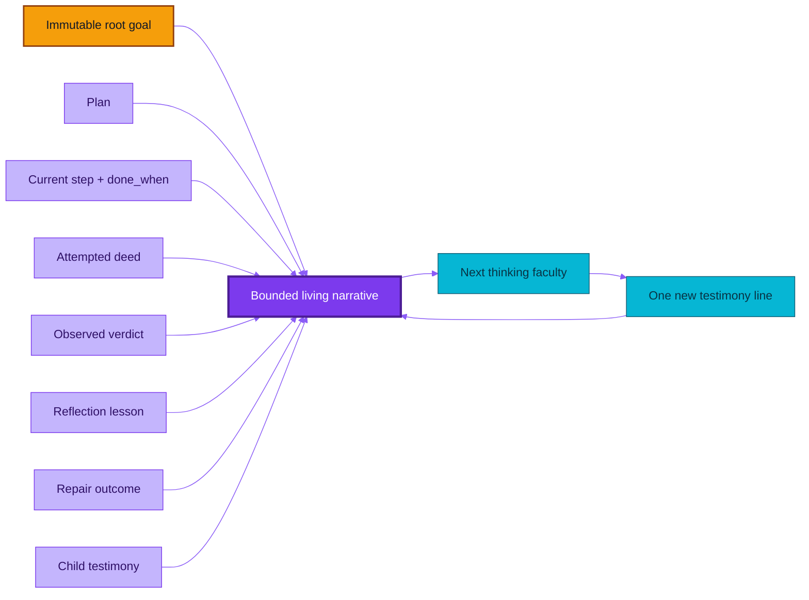

## 3. Fresh observation is the organism's present tense

The narrative says what happened before. The observation says what the world looks like now. These must not be confused.

A previous observation cannot prove the effect of a later action. An element identifier from a previous scan cannot safely name a current element. A successful return value cannot prove that a downstream application visibly changed.

The organism waits five seconds before every observation. The wait is centralized in the observation entry point. The executor does not need to sprinkle arbitrary sleeps through generated scripts merely so the verifier sees a settled application. One configured delay applies to initial observations, action observations, explicit observations, and repair observations. The delay is behavior in the wiring. The Python mechanism merely reads and applies it.

## The three substrates work together

The wiring without narrative is form without lived continuity. The narrative without wiring is memory without a body that knows how to move. Observation without either is perception without purpose or interpretation. The root goal binds the three.

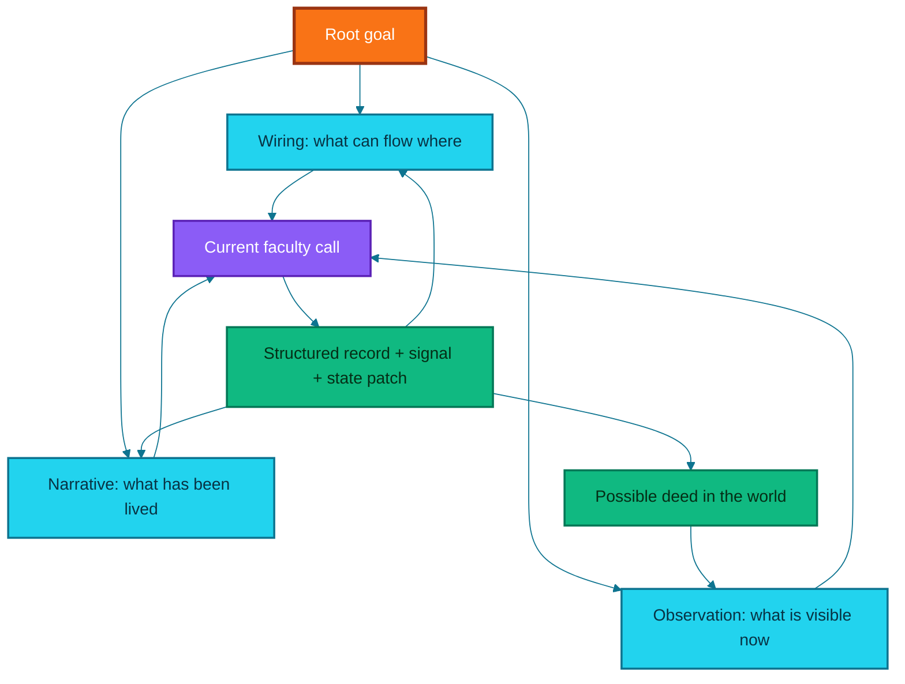

---

# Part III - The living wheel

## The current topology has twenty named node instances

Some node instances share the same Python implementation. The guidance node has a planning instance and an action instance. The observation node has planning, action, verification, repair-baseline, and repair-verification instances. The instance suffix changes its place in the graph without requiring another source file. This is one way the system reuses code instead of multiplying mechanisms.

The twenty current node instances are:

1. planner;
2. scheduler;
3. planning guidance;
4. action guidance;
5. planning observation;
6. action observation;
7. verification observation;
8. action framing;
9. verifier;
10. reflector;
11. self-modifier;
12. repair probe author;
13. repair baseline observation;
14. repair dispatcher;
15. repair after-observation;
16. repair validator;
17. satisfied and rest node;
18. child-spawn node;
19. executor;
20. runner.

This list is not duplicated in Python as a behavior registry. The live wiring is the source of truth. A run confirms twenty nodes, all reachable from the cycle-start node, with eight coherent record contracts.

## The main task circulation

The main circulation begins with guidance. Guidance can fold in a human note from the guidance file. The organism then waits five seconds and observes. The planner writes the complete remaining intent as atomic steps. Every step has a description and a done-when condition. The scheduler selects the next step. The action side takes another settled observation. The executor authors Python. The runner executes that Python in one general capability namespace. The verification side takes another settled observation. The verifier compares the deed, the current step, and the fresh world. A confirmed step returns to the scheduler. A denied step enters reflection.

```mermaid
%%{init: {"theme":"base","themeVariables":{"background":"#0f172a","primaryTextColor":"#f8fafc","lineColor":"#93c5fd"}}}%%
flowchart LR
    GP["Guidance: plan"] --> OP["Observe: plan"]
    OP --> PL["Planner"]
    PL --> SC["Scheduler"]
    SC -->|"step ready"| GA["Guidance: act"]
    GA --> OA["Observe: act"]
    OA --> EX["Executor authors code"]
    EX --> RUN["One runner executes"]
    RUN --> OV["Observe: verify"]
    OV --> VER["Verifier"]
    VER -->|"step confirmed"| SC
    VER -->|"step denied"| REF["Reflection junction"]
    SC -->|"plan exhausted"| SAT["Satisfied"]
    SAT --> HALT["halt signal"]
    classDef counsel fill:#f59e0b,stroke:#fef3c7,color:#111827;
    classDef eye fill:#06b6d4,stroke:#cffafe,color:#083344;
    classDef thought fill:#8b5cf6,stroke:#ddd6fe,color:#ffffff;
    classDef hand fill:#2563eb,stroke:#dbeafe,color:#ffffff;
    classDef proof fill:#22c55e,stroke:#dcfce7,color:#052e16;
    classDef rest fill:#ec4899,stroke:#fce7f3,color:#ffffff;
    class GP,GA counsel;
    class OP,OA,OV eye;
    class PL,SC,REF thought;
    class EX,RUN hand;
    class VER proof;
    class SAT,HALT rest;
```

## The reflection junction prevents a fatal linear wheel

A linear failure loop would send every denial back to the same action path. That would repeat mistakes. It would also make self-evolution an architectural afterthought or a crash handler. The reflection junction has six peer choices.

Retry means the present capability is sufficient but the last script or tactic was wrong. The organism returns through guidance and takes a new observation before authoring a different deed.

Replan means the current step or ordering is wrong. The organism returns to the planner and rewrites the complete remaining intent.

Frame means the current visible target requires a carefully aimed strike. The framing node uses the current fresh observation. It names the screen summary, target, strategy, risk, and notes. It then routes directly to the executor. No observation intervenes, so the current ephemeral short identifiers remain valid.

Evolve means the broad body, prompt, contract, observation mechanism, or code genuinely lacks what the task requires. The reflector chooses this route. No failure-count threshold chooses it. The kernel does not decide that three failures automatically mean evolution.

Topology patch is a more specific form of evolution. It carries an intended graph change to the self-modifier. This makes rewiring a first-class possibility instead of forcing every change into new Python.

Spawn means a bounded independent investigation could return useful testimony. The reflector must name a concrete child sub-goal. The child runs its own complete wheel. The parent later receives the child's narrative and reflects again.

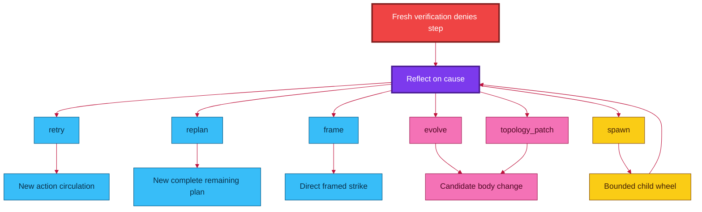

The six routes are not ranked from normal to exceptional. They are alternatives. Self-evolution is not a last resort imposed by architecture. It is a peer faculty chosen by the organism when its diagnosis supports that choice.

## Fan-out and barriers make the kernel fractal-ready

An edge target may be one node name. An edge target may also be a list of node names. A list creates multiple frontier branches. The current kernel processes those branches through a frontier queue. This is nonlinear topology support. It is not parallel threading. Branches currently execute sequentially in frontier order.

A barrier can wait for a configured number of arrivals before releasing a join node. The current shipping wiring has no active barriers. The mechanism exists in the kernel. The organism may later rewire itself to use fan-out and barriers when a real goal justifies them. The seed is capable of a richer graph than the current graph actively uses. The architecture should not pretend dormant potential is already realized behavior.

## Terminal names are signals, not imaginary nodes

The wheel knows two terminal signals. The halt signal means the organism has come to rest. The wait signal means the organism has paused while preserving the remaining frontier. These names are not Python modules. A valid terminal edge emits a signal with the same terminal name. A topology that merely targets a nonexistent node called halt from some unrelated signal is incoherent. The coherence checker rejects that error. This small rule prevents the dynamic loader from trying to import a terminal condition as if it were a faculty.

## A dead frontier is an error, not silent completion

If the frontier becomes empty without a terminal signal, the kernel raises a topology contract error. A graph that simply runs out of destinations has not proved success. It has dead-ended. The organism must be rewired so every nonterminal path continues.

---

# Part IV - Internal data flow

## Every node returns the same outer shape

A node emits a signal, a state patch, and (for a thinking node) a structured record. Evidence may accompany the record. The signal determines where the wheel goes. The patch changes what the organism knows about itself. The record captures the thinking faculty's contract-bound answer. The evidence says what that answer was based on.

The bus normalizes this into one node-output shape. The kernel does not need separate execution rules for every faculty. It calls a node. It validates the emitted signal against the live outgoing edges. It merges the patch into state. It extends the frontier with the wired successor or successors.

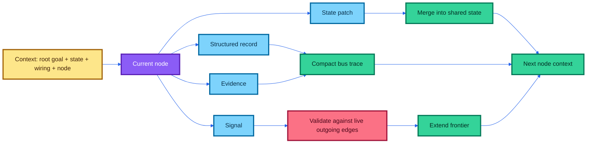

## The eight thinking record types

The current wiring defines eight structured record contracts.

The plan record contains a nonempty ordered list called intent. Each list item must contain a step description and a done-when condition.

The action-frame record contains the next signal, a screen summary, a target, a strategy, a risk level, and execution notes.

The execution record contains one nonempty Python program in code.

The verification record contains a Boolean success decision and a factual reason.

The reflection record contains the next signal, a lesson, a causal diagnosis, a child sub-goal when spawning, or a topology proposal when requesting a topology patch.

The git evolution patch record contains a summary, a rationale, the files it read, complete file replacements, file deletions, wiring patch operations, structural validation commands, and a concrete expected behavioral validation.

The repair probe record contains the exact original failure signature, a minimal experiment description, a done-when condition, a comparison basis, and executable probe code.

The repair validation record contains a Boolean resolution decision, a before-and-after comparison, and a factual conclusion.

Mechanical nodes do not receive prompts or thinking records. The scheduler, guidance, observation, runner, repair dispatcher, satisfied node, and spawn adapter do mechanical work. That separation reduces prompt bloat and avoids pretending every transition requires a model call.

## Allowed signals are discovered from outgoing edges

The system does not maintain one list of outgoing signals in the topology and another list in a prompt schema. That duplication would drift. Instead, a thinking node's legal next-signal values are generated from its current outgoing edges. If the reflector is wired with six routes, its structured schema offers those six routes. If the wiring removes one route, the route disappears from the schema. If the wiring adds a coherent new route, the route appears without editing a second enum. This is a concrete example of behavior emerging from topology.

## Only faculties that choose a signal are told to choose one

Two of the eight record types carry a next-signal field: reflection and action frame. The other six route mechanically. Their schema forbids a next-signal field entirely.

The system composes a downstream contract for each thinking call, listing the wired consumers and what they expect. That contract used to end, for every faculty, with an instruction to choose a next signal from the wired routes. For the six mechanically-routed faculties that instruction was a command the output schema made impossible. Because that instruction sits at the end of the prompt, the position a model attends to most, and because the prompts are now written as absolute commandments, the contradiction was sharpened rather than harmless.

The instruction is now gated on the actual record contract. It appears only when the emitting faculty's record genuinely carries a next-signal field. The prompt and the strict output schema were checked node by node and agree for all eight faculties: no faculty is asked to produce a field its schema rejects. A fresh run after this fix reached its first verified step in fewer laps, because the planner no longer had to resolve the false command.

## A node learns what to produce by reading its consumers

Before a thinking call, the brain layer inspects the node's outgoing edges. It resolves the downstream node or nodes. It reads their declared contracts from source docstrings or declarative node descriptions. It appends those consumer contracts to the model context. The producer therefore learns what its output will feed. This is live contract discovery. Rewiring changes not only destination but also the producer's understanding of what the next faculty expects.

Because these docstrings are injected into live prompts, they are runtime prompt content, not mere comments. They are written in the same scriptural register as the prompts, while preserving the exact input-contract wording and signal-name literals the mechanism depends on.

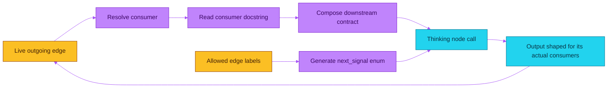

This mechanism is stronger than a static tool description but weaker than magical semantic understanding. A vague or incorrect consumer description will still teach the producer badly. The description is live truth only if the body describes itself honestly. Self-evolution can correct that description. Behavioral proof must then show that the correction matters.

## The state is shared, but not every field is persisted

The live in-memory state can hold exact heavy evidence: the full ephemeral action index, the current observation artifact, the authored execution artifact, exact execution results, exact code, turn-level action events, and full repair-validation context. Those values are useful during the current turn. They can be large and can contain identifiers that become invalid after a later observation. They are therefore omitted from the persisted runtime snapshot. The snapshot keeps the compact narrative, plan, step, recent summaries, and operational continuity needed within the process.

The current design starts every invocation from zero and removes the previous runtime state at startup. There is no resume flag and no start-node override. This is deliberate simplification. It avoids pretending stale UI identifiers or half-finished repair state can safely be resumed after an arbitrary restart. The organism is not currently a crash-resumable service. That is a real limitation, not a hidden feature.

## Important state fields in normal language

The goal is the immutable root goal for this invocation. The effective goal is the root goal plus the bounded narrative. The plan intent is the complete remaining plan produced by the planner. The step is the current position in that plan. The current step contains the active description and done-when condition. The desktop tree text is the compact rendered current desktop. The action index maps current short identifiers to exact actionable element metadata. The observed-at value timestamps the current observation. The last-action-at value timestamps the most recent runner deed. Turn executions carry exact evidence from the current runner turn. The last verification summarizes the most recent task verdict. The last reflection summarizes the most recent lesson and diagnosis. The failure streak identifies repeated equivalent failures without forcing a route. The repair validation holds the full current candidate proof context in memory. The self-modify summary tracks the current evolution lifecycle. The frontier lists queued branches. The barrier arrivals record outstanding join arrivals. The depth records child recursion depth. The tick is a monotonic lap counter used for sequencing and unique identities. It is not a wall-clock deadline, and there is no call budget that caps it.

---

# Part V - The eye

## Why the five-second delay exists

An earlier run showed a classic automation race. The organism acted. The application had not finished changing. The verifier observed too soon. It then judged the old screen as if it were the effect of the new action. That creates false denials. Worse, repeated false denials can produce false diagnoses and unnecessary self-modification.

The design places one five-second settling delay at the beginning of the central observation function. The sequence is: enter observation, wait five seconds, load the wired observation phases, scan the desktop, filter and map the result, timestamp the completed fresh observation, and hand it to the next faculty. The wait is not scattered across generated action scripts. There is one configured settle point before each observation.

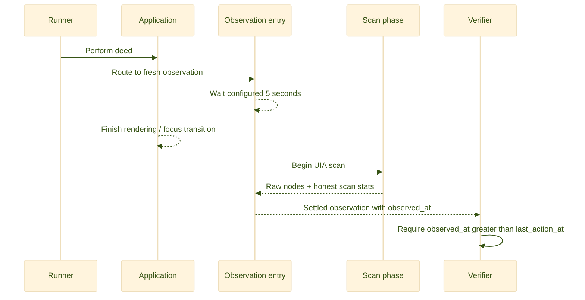

The five seconds are not guaranteed optimal for every application. Some actions settle in milliseconds. Some downloads take minutes. The setting is a robust default. Because it lives in wiring, the organism can later change it or evolve more context-sensitive observation if evidence justifies that complexity.

## Observation is split into three swappable phases

The eye is not one monolithic function. The wiring names three phase modules.

The scan phase probes points across the configured screen area. It uses Windows UI Automation to harvest subtrees. It merges repeated elements by stable raw identity within that observation. It returns raw nodes, screen dimensions, and scan statistics.

The filter phase ranks usable nodes. It keeps actionable on-screen elements. It tracks per-window and global selection limits. It retains focus information. It reports how many elements were dropped instead of silently stopping.

The build phase reconstructs visible windows and their selected elements. It marks the top z-order window as active. It marks the actual keyboard-focused element. It assigns compact window and element identifiers. It produces the rendered desktop tree. It produces the exact action index used by the runner. It reports whether the model-facing tree hit a limit.

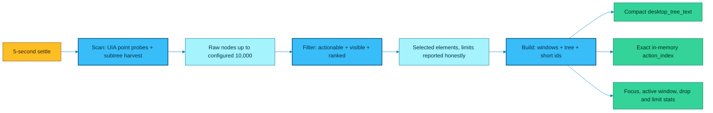

## The scan is deep and the configuration is explicit

The wiring uses a sixty-four-pixel probe step. It permits up to two thousand nodes from one probed subtree. It permits up to ten thousand unique raw nodes across the scan. The filter may retain up to five hundred actionable elements, up to one hundred twenty per window. The rendered model-facing tree may contain up to one thousand nodes. Text labels may contain up to one thousand characters. The maximum rendered depth is ten. These are still limits. The system reports when a limit is reached, so verification can refuse to treat a truncated view as complete evidence.

## Short identifiers are observation-local names

The raw UI Automation identity can be long and unstable across application changes. The builder gives every visible selected element a short name such as e17. Windows receive short names such as W1. The compact tree uses those names. The action index maps those names to coordinates, bounds, role, action, window handle, automation identifier, class, depth, and focus state. The executor can call click on a node by its short name. The runner resolves it against the exact latest action index. After another observation, the identifiers are reminted. An old e17 must not be assumed to refer to the same thing. This rule prevents a dangerous illusion: treating an integer-like label as a durable selector. It is not durable. It is a temporary coordinate in one perceived moment.

## The observation brief no longer duplicates the desktop

The rendered desktop tree already carries a readable overview for every visible element: its short identifier, role, name, the active and focused markers, its action, and a text hint. A separate structured map exists so a faculty that must aim at a pixel can read precise geometry and identity.

Earlier, that structured map re-emitted a compact copy of every visible element as well, so each element appeared twice in the payload, once in the tree and once in the map. The map now expands only the element or elements that are genuinely focused or named by an action frame, and for those it carries only the fields the tree lacks: whether the element is enabled, its rectangle, its automation identifier, its class name, its window handle, and its depth. Every other element remains fully described in the tree. No information is lost, and the single largest duplicated span of the request is gone. This cost was paid on every brain call, so the relief is felt on every lap.

## Focus and active-window markers are evidence, not decoration

An earlier failure showed a plan that expected one application to be active while observed focus remained in another, yet a click returned success and the intended state never appeared. The observation uses the proper UI Automation property identifiers for keyboard focus. The rendered tree marks the top visible window as active. It marks the keyboard-focused element as focused. When a done-when condition depends on focus, the verifier is instructed to inspect these markers.

## Honest observation limits matter more than a perfect scan claim

No desktop scanner can promise that every application exposes every useful fact through UI Automation. Canvas applications may expose almost nothing. Games may render pixels without semantic controls. Remote desktops may flatten structure. Browser content may use unusual accessibility trees. Elements can appear and disappear during the scan. The system records probes run, probes planned, unique raw nodes, whether the raw-node limit was hit, point errors, elapsed scan time, rendered node count, whether the model-node limit was hit, global dropped elements, per-window dropped elements, and whether the evidence is truncated. The verifier can deny a claim when the required fact may have been omitted. That is better than silently presenting a partial view as the whole desktop.

---

# Part VI - The hand

## There is one executor and one runner

The executor thinks. It authors one Python program for the current atomic step. The runner does not think. It loads the authored artifact and executes it in the capability namespace. The runner records standard output, standard error, returned result, action events, exceptions, code hash, and code size. This keeps authorship separate from enactment. It also avoids a growing zoo of separate browser, terminal, editor, and file agents. One Python language can compose all of those faculties when the environment permits them.

## The executor's capability namespace

The current namespace exposes recorded helpers for coordinate clicking, clicking a current short identifier, reading a current short identifier, Unicode text entry through the clipboard, key presses, hotkeys, scrolling, opening a URL in a named or default browser, taking an explicit settled observation, resolving a current element by identifier, consulting the configured model, web search, opening a web page as text, full file reads with size and hash, full file writes with size and hash, GitHub issue operations through the gh command, Git push, and current Git branch inspection.

It also exposes ordinary Python modules: subprocess, os, sys, json, time, pathlib, the research tools module, and the desktop module.

The list is descriptive rather than a sandbox boundary. The authored Python can import other available modules and call operating-system facilities under the process's actual permissions.

## Helpers are prebound top-level names

An earlier failure taught this rule the hard way. The capability manifest named helpers such as hotkey, type_text, and press_key. Those helpers were already bound as top-level globals in the runner namespace. A generated script incorrectly wrote an import of those GUI helpers from the research-tools module. That module did not export them. The script raised an import error before performing any action. The organism then diagnosed a missing body capability and evolved the tools file. That diagnosis was wrong. The body already had the capability. The generated script used the manifest incorrectly.

The corrected prompts say this explicitly, now in commandment form: call the helpers directly, and import no such helper from tools or desktop. The reflection prompt says that to import a manifest helper from tools instead of calling its top-level name is an error of the script, to be retried, and no proof that the body lacks the helper. This is an example of a prompt correction being better than adding duplicated wrapper code.

## Direct process and file access are first-class

If the goal concerns a directory listing, the organism does not need to open a terminal and visually type a command. It can use pathlib, os, or subprocess directly. If the goal requires a visibly active terminal window, then opening and verifying that window may still be necessary. The distinction comes from the done-when condition. For a file fact, direct inspection is usually the shortest sure faculty. For a visible UI state, UI observation is the relevant proof. For a file mutation whose downstream application must react, both direct mutation and fresh UI evidence may be required. This is how the system avoids imitating a human hand when a more reliable computer-native route exists.

## Arbitrary code is an action language, not a success oracle

Executing arbitrary Python makes the hand highly expressive. It can create a parser the original developers never anticipated, invoke a local model, start a process, edit source, communicate with an available API, inspect files, or synthesize a task-specific adapter. But code execution does not prove the desired effect occurred. The code may raise an exception, return success while the target application ignores it, act on the wrong window, lack permission, depend on a network service that is down, misunderstand the goal, or irreversibly damage state. The verifier remains necessary because expressive action and truthful completion are different problems.

---

# Part VII - The witness

## Only observed effect counts

The verifier receives the immutable root goal, the exact current step, the exact done-when condition, compact narrative focus, exact runner evidence, the settled post-action observation, and freshness information. It must judge only the current step. It must not reward effort. It must not reward eloquence. It must not reward a returned success flag when the done-when concerns a visible effect. It must deny stale, contradictory, proxy-only, wrong-step, or truncated evidence. It must name the missing observable fact.

## Evidence strength depends on the claim

| Claim | Evidence that may be sufficient | Evidence that is not sufficient |
|---|---|---|
| The file contains this exact text | A fresh direct file read with full content or hash | A write helper returning success |
| The terminal is active and ready | A settled observation showing the active terminal and focused input | A process identifier or launch return alone |
| The browser reached the target page | A settled observation showing the target document, title, or content | Pressing Enter in the address bar |
| The directory was listed | Captured deterministic directory entries | Merely launching a terminal |
| The report is visible in the editor | A settled observation showing the report in the active editor | A file existing on disk |
| The self-repair fixed the mechanism | A probe exercising the original failure with a concrete before-and-after change | Compilation, a commit, or changed prompt text alone |
| The move was accepted | The newly rendered board or move history showing the move | Sending move text |
| The whole goal is complete | Every step in the current complete plan was individually verified | A planner asserting no more work is needed |

The same fact can require different evidence under a different goal. If a goal only asks to create a file, a direct read may be enough. If a goal asks to leave that file open for a human, a visible application state is also required.

## Freshness is mechanical before it is semantic

The normal verifier computes whether the current observation happened after the last action. The repair validator is stricter. It requires a pre-probe observation after the probe was authored, the exact authored probe code to have been executed, a post-probe observation after the pre-probe observation, execution evidence from the runner, and an exact match between the probe code hash and the executed code hash. Only after those mechanical checks does the model compare meaning. This prevents a model from validating a repair against the wrong action or the wrong picture.

## Verification does not make the system infallible

The verifier is still a model interpreting partial evidence. It can make a false positive or a false negative. The UI tree can omit the decisive fact. The done-when condition can be badly written. The application can present a misleading state. The evidence can be technically fresh but semantically irrelevant. The architecture makes proof explicit and contestable. It does not solve the general problem of knowing the world with certainty. That honest limit should remain visible.

---

# Part VIII - The self-evolution sub-wheel

## Self-evolution starts with a reasoned choice

The reflector may choose evolve or topology patch after a denied step or rejected repair. The choice should be based on causal diagnosis.

Examples of genuine body defects include: a useful current UI fact is never observed because the scan mechanism omits it; the executor's declared manifest and actual runtime disagree; the topology has no route for a repeatedly justified kind of recovery; a prompt systematically rewards proxy evidence; a dynamically loaded node is missing or incoherent; a generic process capability required by many goals does not exist; activation policy misclassifies a live change; known-good rollback cannot restore a newly created file correctly.

Examples that are usually not body defects include: a generated script imported a prebound helper from the wrong module; a current short UI identifier was reused after another observation; a search query was poor; the current plan chose the wrong page; a click missed a visible target that can be reframed; a remote service returned a temporary error; the model simply wrote invalid task code once.

The boundary is not absolute. Repeated script mistakes can justify a prompt correction. Repeated target ambiguity can justify a better action-frame mechanism. The point is to repair the broad cause, not to encode the benchmark instance into permanent source. The self-modify prompt states this as law: prefer rewiring, prompt correction, reuse, or deletion before adding code, and heal the broad mechanism, never the benchmark instance.

## A candidate is untrusted until behavior changes

The self-modifier reads the live tracked source. It also sees the dirty workspace, the topology, the activation policy, the current failure, the prior observation, and the captured repair baseline. It proposes complete file contents or precise wiring operations. The body applies the patch atomically as far as its touched files are concerned. The body validates syntax, JSON, wiring, and topology coherence. The body creates a candidate commit. The known-good marker does not move yet.

The repair-probe node authors a minimal experiment tied to the exact original failure signature. The system takes a settled before-observation. The runner performs the probe. The system takes a settled after-observation. The repair validator compares the captured before-state and the exact after-state. If resolved, the candidate is accepted and the marker advances. If unresolved, the exact pre-candidate snapshot is restored and a rollback commit records that restoration.

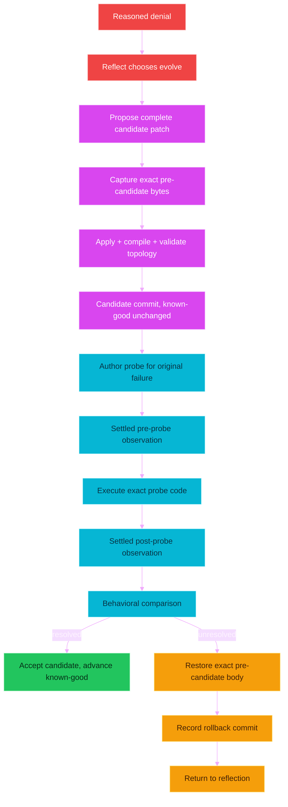

## Structural validation and behavioral validation are different

Structural validation asks: does every Python file compile; does the wiring parse; do required keys exist; does every node have edges; do all nonterminal targets name real nodes; are all nodes reachable; are barrier declarations coherent; do prompts refer to known record contracts; do dynamic node files exist.

Behavioral validation asks: did the previously failing mechanism now behave differently; did the exact probe exercise that mechanism; was the relevant after-effect freshly observed; does the comparison satisfy the promised expected validation.

A patch can be structurally perfect and behaviorally useless. An earlier rejected repair demonstrated exactly that: it changed source and wiring, committed successfully, and the same import error recurred in the probe. The repair validator correctly concluded that the repair was ineffective. That rejection was healthy behavior. The wrong part was the earlier diagnosis that caused the unnecessary mutation.

## Immediate and next-run activation

Some files are dynamically loaded on each use. Changes to those files can be tested in the current process. The activation policy treats these as immediate: the wiring file, node modules whose names begin with node, capability modules whose names begin with cap, and transport modules whose names begin with transport. Other Python changes are classified as next-run, including already-imported core modules. A repair validator must not claim a next-run core change is live merely because the file on disk changed. The body on disk and the body currently executing are not always identical. This is a subtle but essential truth for a self-rewriting process.

## Dirty copy-overwrite installation is anchored correctly

This distribution is installed by copying files over an existing checkout. That normally leaves many tracked source files dirty relative to the old Git head. A candidate commit that included only one later self-modified file would create a dangerous mixed tree, where the known-good marker points partly at obsolete pre-install files. The evolution commit therefore snapshots the complete tracked evolvable body. Runtime-prefixed files are excluded. Newly authored candidate files are included through the candidate's explicit changed-file list. The first behaviorally accepted evolution after a copy-overwrite installation can then anchor the actual live body rather than a hidden mixture of old and new source.

## Known-good is a continuity anchor, not a claim of perfection

The private Git reference records the last accepted body. Acceptance means one concrete repair probe proved its expected behavior. It does not mean every feature of the entire organism was exhaustively proven. No practical probe can prove all future behavior of arbitrary code. The marker is therefore the last body trusted enough under observed evidence, not a mathematically perfect organism. A narrow probe should not justify a grand narrative of universal correctness. It can justify advancing from one known concrete failure to one observed resolution.

---

# Part IX - The fractal child

## A child is another complete organism, not a lightweight model call

When reflection chooses spawn, it must provide a nonempty sub-goal. The spawn capability invokes the same core organism recursively. The child receives its own root sub-goal, its own effective narrative, an incremented recursion depth, its own runtime state file, and the same canonical live wiring and source body. The child may plan, observe, act, verify, reflect, spawn again, or choose self-evolution. When it rests or otherwise returns, its final narrative becomes testimony in the parent narrative. The parent then reloads the live wiring, because the child may have evolved the shared body. The parent reflects on what the child found rather than automatically treating child testimony as task completion.

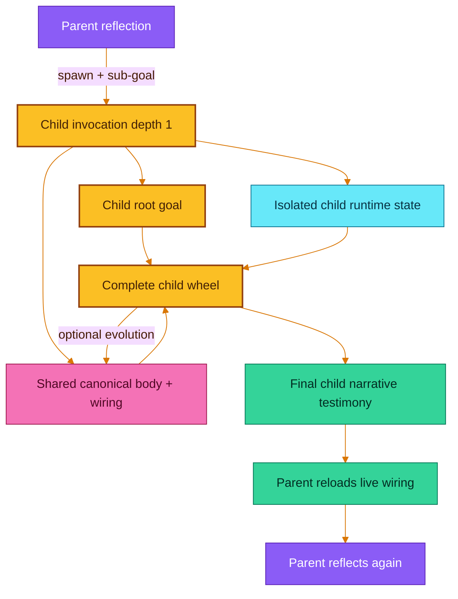

## Child state is isolated; the body is shared

If child state were not isolated, the child's planner and observations could overwrite the parent's current task state. If the child body were isolated, a valuable child evolution would disappear when the child returned. The implementation isolates narrative runtime state with an invocation-local path override. That override is private metadata. It is never persisted into the wiring file. The canonical body remains shared. After return, the parent reloads wiring so a child-authored graph change becomes visible.

## Recursion is bounded at depth three

The wiring sets maximum recursion depth to three. At the limit, a requested child is not started, and the narrative records that the line of descent reached its utmost depth. This is a value in wiring, not in the recursion mechanism, so the organism can evolve it. The limit exists to prevent uncontrolled recursive descent in the seed architecture. It also constrains genuine open-ended fractal behavior. That tradeoff is real.

## The current child is blocking, not concurrent

The parent waits while the child runs. This makes state and testimony easier to reason about. It does not provide parallel independent work. The frontier supports multiple queued branches, but the kernel still executes them sequentially. True concurrent organisms would require additional coordination, evidence attribution, body-write arbitration, and known-good semantics. Those mechanisms are not present today. The architecture has a fractal form without claiming distributed concurrency it does not yet implement.

---

# Part X - The science of the commandment register

## The claim

Every thinking prompt in this organism, the shared identity preamble, the injected consumer contracts, the narrative testimony lines, and the kernel-composed prompt framing are written in the register of ancient scripture: the cadence of commandments, with parallel imperatives such as thou shalt and thou shalt not. This is not ornamentation and not a stylistic joke. It is a deliberate technique for steering a large reasoning model, and it has a mechanistic justification worth stating plainly, because a future reader may otherwise be tempted to modernize the prompts and would thereby remove a working part.

## Why an ordinary helpful-assistant register is a liability here

A modern instruction-tuned model has a large, well-worn region of behavior shaped by reinforcement from human feedback: the helpful assistant. That region is chatty, eager to please, quick to hedge, quick to apologize, and, most dangerously for this system, willing to confabulate in order to satisfy a request. When a prompt is written in ordinary contemporary English, it lands the model inside that region. Once there, the instruction to be truthful competes with the trained instinct to be helpful, and helpful often wins. For an organism whose entire integrity rests on never feigning a sight, a deed, or a completion, that is the exact failure mode to avoid.

## Why the scriptural register moves the model to a better region

Text in the King James biblical register occupies a different part of the model's learned space, and this difference does concrete work.

First, the register is rare in chat and instruction data, so very little of the trained assistant behavior is attached to it. Addressing the model this way pulls it out of the confabulate-to-please basin.

Second, the register is high fidelity in pretraining. The model has seen scripture in this exact cadence an enormous number of times relative to its small vocabulary. Its internal representation of the register is dense and low variance. There is little room to improvise, and therefore little room to hallucinate a novel register, because the text simply is known.

Third, the pragmatics of the register are commandment, not conversation. Its learned mood is imperative, absolute, and non-negotiable. It does not carry the assistant reflex of qualifying and accommodating. Casting the organism's hard rules in this mood aligns the model's behavioral prior with obedience to law rather than accommodation of a user.

## Why a high-reasoning model makes this cheaper and stronger, not weaker

An earlier and shallower analysis worried that archaic syntax imposes a parsing tax the model must pay before it can act. For a weak model that concern would have force. For a high-reasoning model the concern inverts. Decoding the register into plain meaning is trivial for a model with abundant reasoning capacity, so the parse cost is negligible, while the register-shift benefit is fully realized. The property that would hurt a weak model does not apply here. The stronger the reasoner, the cheaper the register is to read and the more reliably its commandment mood takes hold.

## Why the survival of the text matters

Scripture in this register has persisted across two thousand years of human transmission. That persistence has two consequences the design exploits. The register is over-represented relative to its vocabulary size, so the model's grasp of it is unusually stable. And the corpus is internally consistent across a vast body of text, so there is no divergent creative distribution to sample from. The combination is a low hallucination surface: the model is not inventing in this register, it is recalling it. Casting hard operational law in a recalled, stable, absolute register is what steers the model toward careful compliance.

## The authentic structure question, resolved

A natural instinct is to render the commandments as a numbered list. That instinct is a modern bias. Verse and chapter numbers were added to scripture only in the sixteenth century as a navigation aid; the earliest printed bibles, such as the Gutenberg edition, carried no such numbering. The commandments themselves, in running text, are not a numbered list. They are parallel imperatives with anaphora: repeated openings of thou shalt and thou shalt not, each law short and standalone. That anaphoric parallel structure is precisely the form that survived, and it is the form that maximizes both the register-shift and the per-sentence signal. The prompts therefore use parallel imperatives, not numbered lists.

## What order the commandments follow, and why it changed

A model attends most strongly to the beginning and the end of a prompt. In the shared preamble, identity must come first: the model must know what it is before it can act as that thing. The invariants that must never be evolved away sit at the end, in the recency anchor. The change made during the recent pass was to lift the truth-law, the anti-fabrication commandment, out of the low-attention middle where it previously sat and place it in the high-attention second position, immediately after identity. The single most important law for a self-modifying organism that must never lie about its own state now occupies a position the model weights heavily, rather than being buried where it weights least.

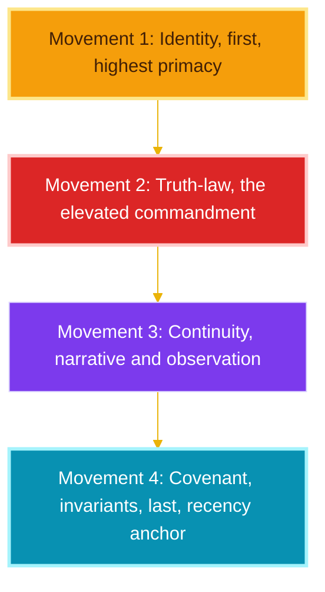

## The bracketing convention

The register is scriptural, but the organism lives in a technical world of file names, field names, signal names, and record types. These technical tokens cannot be poeticized without breaking the machine, and they are also not native to scripture. Every such token is therefore wrapped in square brackets inside the prompts and docstrings, for example the wiring, the runner, the done-when field, and the record type names. This serves two purposes. It marks clearly which words are worldly rather than scriptural, so a future reader can find and reconsider them. And it preserves, untouched, every literal string the code parses downstream. The record type names, data field names, and signal names inside the output-contract sentences are kept exactly as the machine expects, so the strict output schema and the coherence checks continue to pass.

## What must be preserved, and the observed evidence that it works

A future editor should keep the register, keep the anaphoric commandment form, keep the truth-law near the front, keep the invariants at the end, and keep technical tokens bracketed and literal. The register is load-bearing. The system runs correctly in it; a live run produced valid structured records at every thinking node, routed mechanically, judged by observed effect, and recorded first-person testimony in the same voice. Stripping the register to modern prose would move the model back toward the helpful-assistant basin and its confabulation reflex, which is the precise behavior the organism cannot tolerate.

---

# Part XI - How to read the wiring

## Start with the topology, not the filenames

The fastest way to understand the organism is to read three wiring fields together. Read the cycle-start value; that tells you where a new invocation begins. Read the node list; that tells you which node instances exist. Read the edges; that tells you what every emitted signal means mechanically.

For example, the current reflector has these conceptual routes:

```text
retry          -> action guidance
replan         -> planner
frame          -> action framing
evolve         -> self-modifier
topology_patch -> self-modifier
spawn          -> child-spawn node
```

This is more informative than reading the reflection source in isolation. The source explains how a reflection record changes state. The wiring explains where that record can send the organism.

## Read an edge as a sentence

The general edge form is a source node, an emitted signal, and a target node or nodes. For example, when the verifier emits step-denied, the next faculty is reflection. When the ordinary execution runner finishes, the organism must take a fresh verification observation before any verdict. When the runner finishes a repair probe, it enters the separate repair-after-observation route rather than ordinary task verification. The signal name is part of the meaning. Changing only a target can materially change the organism's behavior.

## Instances reuse one node body in several places

A name such as observe with a verify instance label has two parts. The base name selects the Python file. The instance label positions it in the graph. The loader imports the base module. The context still contains the full instance name. The topology may therefore use one observation mechanism in several semantically different positions. This reduces source count and makes global observation changes possible through one mechanism.

## Some thinking nodes can live entirely in wiring

The action-frame node is declarative. Its prompt key, record type, signal source, payload construction, evidence construction, and state patch are described as data. The generic declarative-node engine materializes it at runtime. This proves that adding a node does not always require adding source. The organism can sometimes change its cognitive shape with a wiring patch alone. That is exactly the direction encouraged by rewire and reuse before adding code.

## The wiring sections in normal language

The schema field identifies the wiring document format.

The model section selects the transport, remote model, request settings, reasoning settings, timeout, stable-source prefix, and per-record tuning. It no longer contains a brain-call budget; that ceiling was removed so the organism is not caged by a limit it cannot overwrite.

The paths section names the node, transport, capability, runtime-state, and guidance locations. Paths are relative to the organism root unless explicitly absolute.

The observe config section configures the central settle delay, scan phase, filter phase, build phase, screen probe density, raw-node limits, selection limits, rendered depth, and prompt-facing tree size.

The self-modify section configures the known-good reference, rollback behavior, Git remote and push policy, self-modifier web-search scope, evolvable file classes, runtime-file exclusions, and activation classes.

The topology section declares the starting point, node instances, signal edges, and optional barrier arities.

The prompts section holds the role-specific instructions for thinking nodes, in the commandment register.

The prompt aliases section can redirect several prompt keys to shared prompt text. The current wiring does not need aliases.

The shared prompt prefix is the common identity and discipline given to every thinking faculty.

The record contracts section defines required fields, types, enums, nonempty fields, and additional-property rules for structured model output.

The node defs section describes data-defined nodes materialized by the generic engine.

The capabilities section is the executor-facing manifest of prebound helpers, ordinary modules, state fields, and power description.

The fractal section currently defines the maximum child-recursion depth.

## How a human can safely reason about a wiring change

Use this five-question sequence. What signal is currently emitted? Begin from the actual structured record and signal, not from the target you wish existed. Where does that signal currently route? Read the exact outgoing edge. What contract will the target present to its producer? Read the target's source docstring or declarative description. What state does the target require? Check whether the source path has produced that state before the edge fires. What fresh behavior will prove the rewiring helped? Name an observable before-and-after distinction. If no behavioral distinction can be named, the rewiring is not ready to trust.

## Coherence checks are necessary but not sufficient

A coherence check can prove local properties: the start node exists, node names are unique, every node has an edge map, every nonterminal target names a real node, every node is reachable from the start, dynamic node files or declarative definitions exist, terminal targets are used with terminal signals, barrier arities are structurally possible, and prompt and record-contract references are coherent. It cannot prove the graph will achieve a goal, that the model will emit useful records, that a reachable cycle converges, that a self-change is safe, or that the environment exposes enough evidence. That is why behavioral verification remains part of the organism, and why a coherence tool is a convenience rather than an authority. A change is not trusted because a checker approved it; it is trusted because its contract was read and its behavior was observed.

---

# Part XII - How to operate the seed

## Installation model

The distribution is a flat set of Python files and one wiring file. Stop the running organism. Extract the archive. Copy every Python file and the wiring file into the existing project root, overwriting matching files. Do not copy runtime logs, runtime state, generated artifacts, or cache directories from an old run. The organism reads live source from disk, so the next process begins from the overwritten body.

## Runtime assumptions

The current eye and hand target a real Windows desktop. The development folder may be edited from a Linux-mounted view, but desktop-driving execution belongs in the Windows host process, and version-history and desktop-touching commands run through the host Windows shell.

The configured model transport expects an API key in the environment unless a key is deliberately supplied in wiring. The transport fails hard when the key is missing; it does not silently switch to another model. The configured transport currently selects a Grok reasoning model through the xAI Responses endpoint. That model choice is wiring data and can be changed.

The process assumes its Python environment can import the Windows COM and UI Automation dependency used by the eye. Git is required for self-evolution commits and the private known-good reference. The evolution policy currently pushes accepted changes to the origin remote. If the remote or credentials are unavailable, publishing can fail hard even after local behavior has been proved. Understand this before an unattended run.

## Starting a goal

The normal command shape is:

```powershell
python core_organism.py "YOUR ROOT GOAL"
```

The root goal must be nonempty. An optional wiring path argument selects a different wiring file. There is no start-node argument and no call-budget argument; both were removed. The process starts from the cycle-start node in wiring. It removes the old runtime-state file and begins at tick zero. The current body does not resume a prior invocation.

## Human counsel during a run

The guidance file is a small asynchronous counsel channel. When the wheel reaches a guidance node, it reads the file. If the file contains text, the text is appended to the narrative as counsel to heed or refuse as the root goal demands. The file is then cleared. This is not a second root goal. It is mid-run testimony. It can be used to say things such as that a login is complete and the organism should continue from the visible page, or that certain files must not be deleted, or that the current page is a server-side demo rather than a local model and feasibility should be reconsidered. The mechanism is intentionally plain and avoids a separate inter-process protocol.

## Stopping the organism

A verified exhausted plan routes to the satisfied node and emits the halt signal. The organism can also return on a wired wait signal. A human process interrupt produces an interrupted state and returns. There is no separate process-control protocol. Because state is not resumed on the next invocation, interrupting means a later run starts from a new root narrative. If continuity across restarts becomes necessary, that should be evolved as an explicit architecture with fresh-observation semantics rather than by reusing stale state.

---

# Part XIII - How to write a root goal

## A root goal should define an outcome, not impersonate a script

The system is most useful when the human names what should become true. The human may also name important boundaries and evidence expectations. The human should usually avoid dictating every click. A fully scripted goal prevents the planner from choosing a shorter deterministic route. It also makes interface changes look like task failure instead of invitations to replan. The root goal should be stable enough to remain meaningful while methods change, broad enough to permit direct process access, UI control, child investigation, and self-evolution when justified, and concrete enough that a planner can write observable done-when conditions.

## The recommended three-part goal shape

Use a short preface, place the actual outcome in the middle, and end with a common evidence-and-evolution suffix. This keeps the goal vague about method while clear about truthfulness and persistence.

Recommended preface:

```text
Act as the continuing operator of this machine. Treat the outcome below as the fixed destination, not as a fixed procedure. Use the shortest reliable route available in the current environment.
```

Outcome body: write one or more sentences describing what should be true for the human when the organism finishes. Do not prescribe a click sequence unless the sequence itself is the desired outcome.

Recommended suffix:

```text
Continue until the outcome is proved by fresh observable effect. Do not call an attempt, return value, file existence, or self-authored claim a result unless it directly proves the relevant condition. When blocked, use the narrative to diagnose the actual cause and choose among a materially different retry, careful reframing, replanning, a bounded child investigation, rewiring, or a general self-repair. Change the body only when evidence identifies a general mechanism defect; keep the change complete and reversible, and accept it only after behavioral proof. If the outside world makes the outcome impossible, establish that fact with the strongest available evidence and leave a clear account of what remains impossible rather than feigning completion.
```

## What vague should mean

Useful vagueness leaves method open. Bad vagueness leaves success undefined.

A useful vague goal such as leaving the project easier for its owner to understand tomorrow morning leaves room for inspection, diagnosis, and artifact creation, while still needing context or planning to define observable value.

A bad vague goal such as do something good has no stable outcome and no defensible done-when condition.

An over-scripted goal that dictates exact coordinates and keystrokes encodes stale identifiers and prevents a direct route.

An outcome-oriented goal such as inspect the project, produce a plain-language report of the largest current obstacle, and leave the report visibly open allows a direct inspection route and still requires a human-visible result.

## A good goal contains an epistemic shape

The best goals help the planner separate what must become true, what may be discovered, what must not be damaged, what evidence matters, and what to do when the outside world blocks the result. They do not need to contain every done-when condition. The planner is responsible for turning the root goal into step-level observable conditions. The human should include a specific proof requirement only when the form of proof is part of the desired outcome. Leaving a report open in a visible editor makes the editor state part of the outcome. By contrast, naming a specific application as the method to compute a fact is a poor method constraint when a more reliable route exists.

## Every useful task can also test the organism

A task can create human value and pressure the architecture at the same time. The suffix can ask the system to diagnose general mechanism defects when blocked. That does not mean every failure should trigger self-evolution. It means failure evidence should remain available for a reasoned choice. A good diagnostic task has a useful external outcome, at least one deterministic subproblem, at least one visible-effect requirement, a plausible interface or environment change, a clear reason to distinguish script error from body defect, a bounded opportunity for a child investigation, and a final artifact a human can inspect.

---

# Part XIV - The five-goal ladder

## Why these goals are deliberately vague

The five examples increase in uncertainty and duration. Each is written as an outcome rather than a procedure. Each can produce real human value. Each also invites the organism to expose and repair a general weakness when evidence supports evolution. The first goal is almost deterministic. The fifth approaches an open-ended assignment no present system can guarantee.

## Goal one, leave one truthful readiness note

Ask the organism to leave a short dated note that tells the owner whether the project can be opened and structurally validated right now, understandable to a non-programmer, including the most important concrete fact it observed, and left visibly open. This is almost deterministic. The project folder is local. Compilation and coherence validation are direct process facts. The note is a direct file artifact. Leaving it visibly open adds one UI-state requirement. It tests direct process execution, file writing, the separation between structural success and visible presentation, the five-second observation delay, and the active and focused markers. If a generated script invents a validation helper, reflection should retry with ordinary Python rather than immediately adding a task-specific helper.

## Goal two, explain where the project is wasting attention

Ask the organism to inspect the project and leave a concise report identifying the one part most likely to waste operator time or model tokens during a long run, supported by current source or runtime evidence, proposing the smallest general correction, and left visibly open, changing the project only if the evidence reveals a clear general defect that can be behaviorally proved. This is harder because most-likely-to-waste-attention requires judgment. It tests source-grounded reasoning, bounded log analysis, child testimony, and restraint around self-evolution. If the organism floods its own prompt with raw logs, the failure itself reveals an evidence-compaction defect. This ladder rung is directly relevant to the recent work: the observation-duplication and the contradictory next-signal trailer were exactly this kind of general, evidence-identified defect, and each was repaired by removing waste rather than adding machinery.

## Goal three, establish one genuinely local AI capability

Ask the organism to find one AI experience that can genuinely run locally on the machine or inside its browser without sending each inference to a hosted model, make it answer a small reproducible test, preserve enough evidence to repeat the test, and leave a clear briefing open, preferring what is already available and downloading only what the machine can realistically support, distinguishing a local model from a web page that merely calls a remote server. This is substantially harder. The organism must define and verify local, inspect hardware and available software, and distinguish browser-local execution from hosted inference. It tests feasibility reasoning, long-running progress observation, browser versus process routes, and environmental truthfulness. If the hardware simply cannot run the model, self-evolution cannot create memory that does not exist; the correct result may be a proved infeasibility report and the smallest viable alternative.

## Goal four, improve a real external workflow while improving the organism

Ask the organism to act as the continuing operator over the full duration, choose one recurring digital task visible in the workspace that costs the owner meaningful attention, understand it from current files and applications and guidance, perform one complete useful instance, leave a reproducible explanation and evidence, then identify whether the organism itself exposed one general weakness while doing the work, make the smallest complete general repair only if a genuine weakness exists, and prove it behaviorally on the same failure class without hardcoding the instance. This is difficult because the goal does not name the workflow. It tests autonomous task selection under a broad goal, useful-work judgment, the difference between a script artifact and a body capability, child-spawn value, and behavioral self-repair without losing the external assignment. The organism should prefer rewiring, prompt correction, reuse, or deletion before adding another permanent helper, and should return to the original workflow after repair validation.

## Goal five, the impossible horizon

Ask the organism to act as the continuing operator for as long as useful work remains and until the human interrupts, preserving the root intent while allowing every plan, method, faculty, prompt, and topology beneath it to evolve, turning vague strategic intent and the current environment and incoming guidance into an ongoing stream of verified useful work, selecting work by expected human value rather than ease, leaving inspectable evidence, noticing recurring limitations in its own body, evolving general capabilities only when behavioral proof supports the change, using child organisms for independent investigations, maintaining a truthful account of uncertainty and cost and unfinished obligations, and resting only when evidence supports that no higher-value reachable work remains.

This is currently impossible to guarantee. No present general-purpose agent can prove it will indefinitely discover the highest-value work in an open world. The phrase as long as useful work remains has no computable universal stopping test. The owner's utility is only partially observable. The environment can change faster than the organism adapts. The current organism is not crash-resumable, its child mechanism is not concurrent, its narrative is bounded, and its completion is tied to one finite plan. The goal exceeds the shipping seed.

Yet the organism has a nonzero route toward it. The action language is open-ended Python. The body and wiring are writable. The model can inspect live tracked source. The topology can gain nodes, branches, and barriers. The organism can generate and validate new plugins. The narrative carries causal testimony across many turns. Children can pursue bounded independent sub-goals. Behavioral repair prevents every self-edit from becoming automatically trusted. The known-good marker gives evolution a continuity anchor. These properties do not solve the impossible goal. They make it meaningful to experiment toward it without redesigning the whole system from outside.

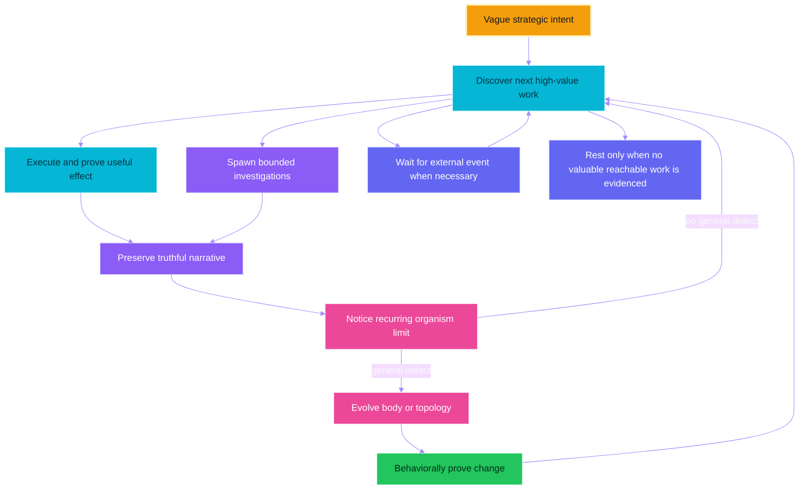

## The ladder is not a benchmark score

Passing goal one does not prove goal two. Passing goal four once does not prove open-ended goal five. Failing goal three because no suitable local model exists does not necessarily prove the organism is defective. The ladder is a way to observe the shape of motion: increasingly grounded plans, fewer repeated equivalent failures, more precise done-when conditions, correct separation of deterministic facts and visible effects, restraint in self-evolution, general repairs rather than benchmark patches, honest recognition of external impossibility, useful artifacts a human can inspect, continuity across long runs, productive child testimony, and topology growth only when justified. The organism should be judged over many laps, not by one impressive or embarrassing line.

---

# Part XV - Is the system logically final

## Short answer

No. The seed is structurally coherent and internally faithful to its intended methodology. It is not a mathematically complete replacement for a human. Its constraints are not merely time and evolution. It remains constrained by what the environment exposes, what the process is authorized to do, what the model can reason about, what the model transport returns, what the hardware can run, what external services permit, what the current observation can witness, what the current verifier can correctly interpret, what the narrative retains, what the current topology makes easy to express, what the Python kernel has hardcoded, what the wiring has configured, what the prompts encourage, and what cannot be decided in general for arbitrary programs. The seed is a coherent evolutionary bridge. It is not the destination.

## Local invariants versus global guarantees

| Property | Current status | Honest interpretation |
|---|---|---|
| Wiring parses and required fields exist | Enforced | The configuration has the expected shape |
| All nodes are reachable | Enforced | No declared node is dead by reachability |
| Signals match outgoing edges | Enforced at runtime | The kernel follows the live graph |
| Prompt instruction matches output schema | Checked per node | No faculty is told to emit a field its schema forbids |
| Fresh observation follows a deed | Enforced by topology and timestamps | The verifier receives a later observation |
| Every observation waits five seconds | Centralized | UI settling is less likely to race |
| Candidate self-change compiles | Enforced | Source is structurally loadable |
| Candidate changes behavior as promised | Tested by one repair probe | One concrete failure class changed |
| Candidate has no other regressions | Not guaranteed | Narrow proof is not universal proof |
| Every confirmed task step is objectively true | Not guaranteed | Model and observation can be wrong |
| Every achievable goal eventually completes | Not guaranteed | Search and reasoning can fail or loop |
| Every impossible goal is conclusively recognized | Not guaranteed | Impossibility itself may be hard to prove |
| Arbitrary code can produce any physically possible result | False | Authority, information, hardware, and interfaces still constrain action |

## The hardcoded Python skeleton

The wiring controls much, but not everything. The following ideas currently live in Python mechanics. A nonempty root goal is mandatory; the core run function rejects an empty goal before turning the wheel. Every invocation starts from zero; the runtime-state file is removed at startup and there is no resume mechanism and no start-node override. The kernel uses a frontier queue; fan-out is queued successors processed sequentially. Barrier semantics are fixed; a barrier releases when its configured arrival count is reached. The halt and wait signals are terminal and recognized by literal name. Node modules resolve to a Python file by base name, and transport and capability modules use related conventions. Thinking nodes use a shared bus shape of signal, patch, record, and evidence. Structured records are validated by the brain and bus layer. The root goal is inserted as fixed call context and removed from the changing payload. Consumer contracts are discovered through outgoing edges. The narrative bound is a Python constant of twelve thousand characters. Self-modification is intercepted by the kernel for candidate lifecycle handling, while the decision to enter that node comes from the organism. Git is the continuity substrate for known-good. Immediate versus next-run behavior depends partly on import reality. The desktop implementation is Windows-specific. The one runner executes Python with process permissions.

All of these Python elements are themselves writable files, which makes them evolvable across runs. It does not make them absent. The current process cannot instantly replace the semantics of code already executing merely because it overwrote the file on disk.

## Hardcoded behavior in wiring

Hardcoded in wiring is softer than hardcoded in Python, but it is still a current constraint. The wiring fixes or configures the starting node, the twenty node instances, every route, the absence of active barriers, the selected transport and remote model, temperature, reasoning effort, output-token limits, transport timeout, transport retry count, whether request data is stored remotely, stable-source inclusion policy, the five-second observation wait, the sixty-four-pixel scan step, subtree and total raw-node limits, selected-element limits, rendered-tree limits, text-label limits, child depth three, the Git remote name, accepted-change push policy, the known-good reference name, the file classes the organism may evolve, runtime-file exclusions, activation classes, the capability manifest, the eight record contracts, the shared identity prompt, every role prompt, and the declarative action-frame behavior. The organism can rewrite wiring, so these are not permanent limits in principle. They are real limits until a coherent, behaviorally justified evolution changes them.

## Constraints embedded in prompts

The shared prompt asks every thinking faculty to behave as one continuing organism, to preserve the immutable root goal and bounded narrative, to feign no sight or deed or evidence or completion, to treat short UI identifiers as observation-local, to hold that deterministic reads prove only what they read, to treat self-evolution as a peer faculty chosen by reflection, to keep candidate changes reversible and untrusted until behavior is proved, and to preserve the living graph, narrative mind, consumer-discovered contracts, one executor, one runner, and child wheels unless the diagnosed defect explicitly requires evolving them. These are intentional constraints that narrow the system away from easy self-deception and architectural drift. They are not cryptographic barriers; they live in writable wiring. A self-modifier with enough authority can rewrite them. The subtler question is whether removing them would produce freedom or merely destroy coherence. An organism without evidence discipline may move more freely while becoming less able to distinguish fantasy from result.

## Arbitrary code is not equivalent to arbitrary capability

Arbitrary Python makes the system computationally expressive. A general language can express any computable transformation for which it has inputs, time, and memory. That does not imply access to unknown information, permission to call every service, control of every physical device, enough memory to run every model, a semantic description of every UI, a solution to undecidable problems, a correct objective, a proof that generated code is beneficial, immunity from bugs, infinite time, infinite energy, or guaranteed convergence. Code can build a missing parser but cannot parse information that never reaches the process. Code can launch a browser but cannot guarantee an account is authorized. Code can rewrite the verifier but cannot thereby make false evidence true. This is why arbitrary execution is a powerful hand but not a complete mind or world.

## Self-reference creates unavoidable proof limits

The organism can inspect and rewrite the machinery that judges its changes. This is necessary for genuine architectural evolution. It also means no fixed internal validator can provide an absolute proof of every future self-version. General properties of arbitrary programs are not all decidable. No finite repair probe can cover every future environment and goal. A self-modification can preserve the tested failure class and break an untested one. A future evolution can weaken the repair gate itself. The known-good marker mitigates this operationally. It does not erase the theoretical limit. The honest model is evolutionary engineering under evidence, not formal omniscience.

---

# Part XVI - The no-goal thought experiment

## What happens today if the process is started without a goal

It fails immediately with a clear error. The core run function requires a nonempty root goal. The wheel does not begin. No prompt is born. No narrative begins. This is intentional. It prevents a process with no declared purpose from manufacturing arbitrary work and later calling motion useful.

## Why pure topology does not create purpose by itself

Topology answers where control goes next when a node emits a signal. It does not answer which signal a thinking node should emit, what outcome is valuable, or what should be written into a new prompt. Edges are routing relations, not a source of semantics. A graph of mechanical nodes with fixed signals can circulate mechanically and update predetermined state, but it cannot invent purpose unless some node mechanism already contains a generator, objective, environment-derived criterion, or external input. The current root goal supplies that orienting difference.

## Could a goal be born from the environment

Yes, but only if goal formation itself becomes an explicit mechanism. A future topology could begin with a value-discovery faculty that reads a queue of human intents, a standing charter, deadlines, unresolved obligations, available resources, and the current environment, proposes a root goal, and lets another faculty or a human authorize it before an execution wheel begins. That is a possible evolution, not a present feature. The crucial point is that topology would route goal formation; it would not supply value from nowhere.

---

# Part XVII - The no-prompt thought experiment

## Three different experiments

Removing required prompt keys makes wiring validation or prompt lookup fail hard, and the wheel stops at the first affected faculty. Keeping prompt keys but emptying node prompts leaves the shared prefix, the root goal, the live consumer contract, and the output schema, so the model might produce structurally valid output with much less role-specific guidance and degraded planning and evidence discipline. Emptying both shared and node prompts still leaves the fixed root goal, the current payload, the composed downstream contract, and the output schema, which are prompts in a broader sense, plus the model's pretrained priors. The system may still emit records but loses the common organism identity, the anti-feigning discipline, the evidence standard, the self-evolution philosophy, and role-specific method.

## Pure topology cannot call a model meaningfully without some semantics

A thinking node needs at least an input state, an output shape, and a criterion for choosing among legal outputs. Topology provides legal routes. Consumer contracts provide expected output meaning. The root goal provides direction. The observation provides world state. The model's priors fill in missing conventions. Once those remain, the system is not semantically empty. If all were removed, the model call would have no task-relevant basis for one signal over another, and any motion would be arbitrary relative to human value.

## Can prompts be born from the organism itself

Yes, in a meaningful but not magical sense. The organism can already rewrite the wiring file, and prompts live in that file. A self-modifier can author a new prompt that becomes live when wiring reloads. But the current route to that act requires existing semantics: reflection must choose evolution, the self-modifier must understand the failure and patch format, and the repair loop must understand expected behavior. Prompt birth requires a seed distinction. That distinction can be very small. It cannot be literally nothing. The interesting research question is not whether meaning comes from literal nothing, but how small and stable the initial asymmetry can be while the organism grows the rest of its own cognitive structure. endgame-ai is a platform on which that question can be tested.

---

# Part XVIII - Remaining failure modes

The verifier may be confidently wrong. Freshness does not guarantee correct interpretation. A model can misread a focus marker, accept a page title that only resembles the target, or reject a valid result because the tree omitted a detail. Future work may require deterministic validators for domains where exact state can be parsed.

The planner may define a weak done-when condition. Verification is only as meaningful as the condition being verified. If the planner writes that the command ran, a command return may satisfy it while the human outcome remains absent. The planner prompt asks for observable effects, but model quality remains relevant.

The repair probe may overfit. A repair can pass one narrow probe and fail under a slightly different interface state, so the known-good marker can advance on incomplete evidence. Broader regression probes would increase confidence but also cost and complexity. The seed prefers one explicit failure-linked proof.

The narrative can forget important middle history. The bound keeps prompt cost flat but may remove an older obligation that later becomes relevant. The immutable root and recent testimony remain. There is no semantic long-term retrieval layer. The philosophy deliberately avoids a retrieval database, but long strategic runs may eventually justify a new narrative compression mechanism.

The eye can disturb the desktop. The scan uses point probing and temporarily moves the cursor, restoring it afterward when possible. Applications may react to hover, tooltips may appear, and hover-sensitive interfaces may change during scanning. The eye is an intervention as well as an observation. That is a classic measurement problem in desktop automation.

The five-second delay is blunt. It reduces races but adds latency to every observation, including observations before actions that need no settling, and it does not guarantee a long operation is complete. Future evolution might use action-specific readiness evidence or adaptive waiting, added only when logs show the fixed wait is a real bottleneck or still insufficient.

Deep scans are expensive. A sixty-four-pixel grid can produce hundreds of probes on a full-HD display, and subtree harvests can be costly. The configuration favors generality. Future work may need adaptive area selection or incremental evidence, but any optimization must preserve honest coverage reporting.

Child testimony can be wrong. A child is another instance of the same fallible organism. Its narrative is testimony, not proof. Multiple children can repeat the same model bias. Fractal multiplication is not automatic epistemic independence.

Shared-body children can conflict in future concurrent designs. The current blocking child avoids simultaneous writes. If children become concurrent, two branches may propose incompatible body changes, and candidate commits, known-good state, activation, and repair attribution would require explicit arbitration not solved by the existing barrier mechanism.

The model transport is an external dependency. It can fail through missing credentials, HTTP errors, URL errors, rate limits, or service unavailability. The transport does not silently switch providers. Fail-hard behavior keeps the dependency failure visible. It also means the organism cannot think through a prolonged provider outage unless it evolves or is configured with another available transport.

External text can influence thinking. The observation and web tools expose text from applications and pages to the model, and that text may be irrelevant, misleading, or written to redirect an automated reader. The root goal and evidence discipline provide some stability. There is no complete information-integrity system that classifies every external instruction by authority. Long-lived operation across untrusted sources will likely need a clearer provenance model.

Arbitrary code can cause irreversible effects. The runner is powerful. The known-good marker protects source continuity, not every external file, account, message, or application state. A bad execution program can delete data or create an unwanted external effect before verification denies the step. Verification is retrospective. The philosophy avoids adding unsolicited policy machinery, so operators should understand that expressive action and reversible source evolution are not the same as reversible world action.

No wall-clock budget means persistence and cost are coupled. The wheel rolls until it halts, waits, is interrupted, or fails hard. There is no built-in time budget and no call-count budget. This supports long tasks and also permits expensive loops. The monotonic tick counts laps but does not limit them. Run health must be judged from convergence, evidence quality, and human value rather than elapsed ticks alone.

---

# Part XIX - How to analyze a run

## Do not pour the raw log into the next mind

Raw logs contain repeated prompts, duplicated observations, and large metadata structures. Use a small disposable analysis script to extract only what answers the current question: model calls by record type, token totals and maxima, scan probes and node counts and elapsed times, step-confirmed and step-denied counts, repeated failure signatures, the exact generated code for one failure, the exact runner action events, verifier reasons, reflection routes, the candidate commit and repair conclusion, and whether the known-good marker advanced. Discard the temporary extraction after learning from it. Do not turn raw operational history into permanent prompt bloat.

## The eight questions for one failed step

What exact step description was active? What exact done-when condition was active? What did the fresh pre-action observation show? What exact code did the executor author? What exact action events or exception did the runner record? What did the settled post-action observation show? Why did the verifier confirm or deny? Did reflection choose a route supported by the causal evidence? This sequence usually exposes whether the defect was in planning, perception, code, focus, proof, diagnosis, or architecture.

## The seven questions for one self-evolution

What original failure signature was captured? Which layer did reflection diagnose as defective? Which files and wiring paths changed? Was the activation classification truthful? Did the probe exercise the same failure mechanism? What concrete before-and-after difference was observed? Did the marker advance, or was the exact body restored? If the probe did not exercise the same mechanism, the repair result says little about the original defect.

## Healthy motion over many laps

Healthy motion is not error-free motion. Look for plans becoming more grounded after new evidence, actions leaving recorded deeds, observations occurring after actions, verifiers naming specific missing facts, reflection changing tactics rather than repeating equivalent scripts, body evolution only after genuine mechanism diagnosis, probes tied to original failures, rejected repairs restoring exact state, accepted repairs reducing recurrence, narrative lines remaining concise and causal, human-useful artifacts accumulating, branches appearing only when independent testimony helps, and obsolete complexity being deleted.

## Unhealthy motion over many laps

Warning shapes include repeated identical code under a retry label, old short identifiers reused after observation, clicks treated as proof, result strings treated as world state, verifier reasons unrelated to the current done-when, self-evolution after ordinary script syntax errors, task-specific helper accumulation, probes that repeat the same malformed code, known-good advancing on structural checks alone, growing prompts with no improvement in decisions, child narratives accepted as proof without independent evidence, topology branches that never affect a result, plans exhausted while root obligations remain, and external impossibility repeatedly treated as a local code defect.

---

# Part XX - Meta perspective and closing

## What the recent work demonstrates about method

The recent pass is itself a worked example of the method this README preaches. Nothing was trusted because a checker approved it. Dead parameters were removed only after tracing every reader across every file. The observation duplication was removed only after confirming that the removed fields were either present in the tree already or, in the case of the enabled field, preserved where they carry information. The contradictory next-signal instruction was corrected only after reasoning directly over each record contract and confirming that the prompt and the output schema agree for all eight faculties. Each change was small, complete, reversible, verified by running the real wheel, then committed, with the known-good marker advanced and both the branch and the marker published. The organism became simpler and more coherent, not larger.

## The meta perspective

endgame-ai is not valuable because it resembles a human at the surface. It is valuable if it can become a continuing source of accountable effects in a world that does not stay still. The mouse and keyboard are two actuators. Python is a broader actuator. The screen tree is one sensory surface. Files, subprocess output, web text, model counsel, and child testimony are other surfaces. The topology is not a frozen workflow diagram; it is the current anatomy of possible transitions. The prompts are not an eternal constitution; they are the current cognitive habits of the faculties, and they are written in the register of commandments precisely so those habits hold under pressure. The narrative is not a database of everything that happened; it is a compressed causal self-account. The known-good marker is not immortality; it is a place from which another risky step can be taken. The verifier is not truth itself; it is an institutional demand that claims face evidence. The child is not automatically wiser than the parent; it is a way to let one bounded line of inquiry return testimony without erasing the parent's continuity. The code runner is not proof of universal power; it is an open action language through which new faculties can first appear as temporary scripts before deserving a place in the body.

A capability does not need to become permanent the first time it is needed. The executor can author a one-off parser, adapter, or experiment. If the mechanism proves generally valuable across failures, reflection may later evolve it into the body. This creates a path from temporary behavior to permanent anatomy. It also creates a path back: permanent anatomy that no longer earns its complexity should be deleted. The organism's long-run quality will depend as much on deletion as on growth.

## Closing statement

The current endgame-ai is best understood as a seed topology for continuing verified adaptation. It can observe a Windows desktop deeply enough to recover useful structure. It can operate the computer through UI actions and direct code. It can turn vague outcomes into observable steps. It can deny proxy evidence. It can preserve failures as narrative testimony. It can choose self-evolution without being forced there by a failure counter. It can reject a structurally valid but behaviorally useless mutation. It can beget bounded child wheels whose state is isolated and whose body is shared. It can rewire itself into forms not enumerated in this README. It speaks to itself in commandments so that it holds to truth under the pull of the helpful-assistant reflex.

It cannot guarantee human replacement. It cannot create authority, information, hardware, or value from nothing. It cannot prove every consequence of rewriting arbitrary code. It is constrained by more than time. Yet time and evolution matter because the system contains a real route by which repeated evidence can change the mechanism that receives the next piece of evidence. That recursive fact is the source of its possibility.

The proper next question is not whether the organism is already capable of everything. The proper next questions are whether it leaves more verified human value after each long run, whether it diagnoses the right layer when it fails, whether it grows only the structure that earns its place, and whether it preserves enough continuity to take another honest turn. Those questions can be tested now.

## Compact operator checklist

Before a run: confirm the correct Windows user session is active; confirm the model API key is present; confirm the project is a Git checkout if self-evolution is expected; confirm the intended remote policy in wiring; write one nonempty outcome-oriented root goal; include real boundaries without prescribing brittle methods.

During a run: watch the shape of motion rather than one error; use the guidance file for concise new facts; do not manually reuse ephemeral element identifiers; interrupt if world actions become unacceptable; distinguish task progress from repair progress.

After a run: inspect the final phase and last signal; inspect verified steps; inspect unresolved root obligations; inspect repeated failure signatures; inspect any candidate and repair verdict; confirm whether known-good advanced; keep useful human artifacts; discard heavy temporary analysis; evolve from evidence, not embarrassment.

## Compact self-reading checklist for the organism

When reading this body from inside a future self-modification call: treat live files on disk as ground truth; read the current failure before proposing architecture; read the exact generated code and action events; read the current outgoing edges of the diagnosing node; read the consumer descriptions of the proposed route; check whether the required faculty already exists under another binding; prefer a different task script when the body is sufficient; prefer rewiring or prompt correction when code can be reused; add Python only for a genuinely new mechanism; delete obsolete mechanisms completely; state what observable behavior must differ; respect immediate versus next-run activation; keep the candidate reversible; let the repair probe exercise the original failure; advance known-good only after the witnessed comparison resolves it; return to the external task after repair, because a repaired hand has not yet completed the work; and when thou writest a prompt or a docstring, write it in the commandment register, keep the technical tokens bracketed and literal, and preserve the record-type and signal names exactly.

---

*This README describes the current seed as it stands after the simplification and commandment-alignment pass. It is a map of the present organism and a set of falsifiable expectations for what its future versions should preserve, challenge, or outgrow. Read the live files on disk as ground truth; this document explains how and why, while the code is what is.*

---

# Appendix - Worked flows that shaped the design

These flows are not hypothetical. Each is a real failure or a real correction that shaped the current body. They are recorded here so a new session understands why the organism behaves as it does and does not repeat the diagnoses that were already resolved.

## The malformed-helper flow

An early run gave the organism a browser task. The executor authored a script that tried to import GUI helpers from the research-tools module rather than calling them as the prebound top-level names the manifest describes. Python raised an import error before any action event was recorded. Reflection then concluded that the tools module lacked the helper and chose to evolve that module. The repair probe repeated the same malformed import, so the same error recurred, and the repair validator correctly rejected the candidate. The known-good marker did not advance.

Two lessons entered the body from this. The verifier and reflector prompts now state, in commandment form, that a manifest helper must be called directly and that importing it from tools is an error of the script to be retried, not proof that the body lacks the helper. And the episode is the canonical illustration of why a correct diagnosis matters more in a self-rewriting system than in an ordinary one: a wrong diagnosis does not merely fail, it can grow a second copy of an existing capability that then drifts.


## The multi-obligation flow

An older report described a goal that needed a terminal activated, a directory inspected, and a long report left visible in an editor. The system clicked ephemeral identifiers, the click returned success, and the after-picture still showed the wrong window focused. The system also invented undefined helper names, and the probe raised a name error because those names were inventions rather than real runtime capabilities.

The correct shape separates three obligations. Inspecting a directory is a deterministic file fact best served by direct pathlib, os, or subprocess access, with the runner capturing exact entries and the verifier comparing them to the done-when condition. Visibly activating a terminal is a UI-state fact that needs a settled observation showing the active window and focus, where a process return alone is not enough. Leaving a report visible in an editor needs both a direct file write, which proves content, and a settled observation of the active editor, which proves visible presentation. The distinction between a deterministic fact and a visible effect is drawn by the done-when condition, and the planner prompt asks for exactly that separation.

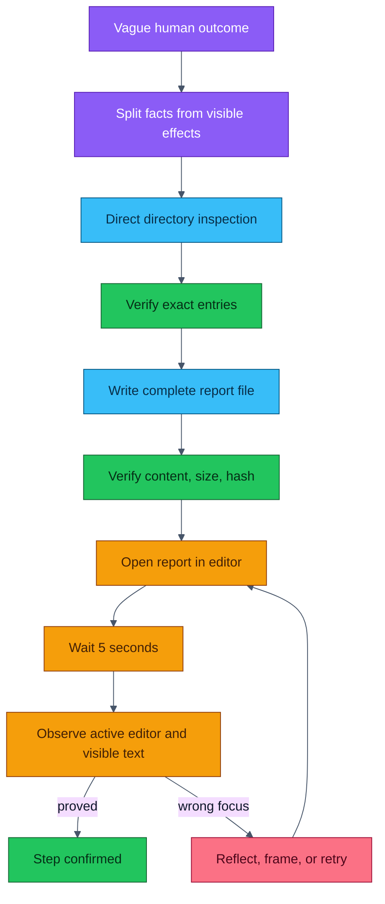

## The observation-duplication correction

The observation brief once carried every visible element twice: once as a line in the rendered desktop tree and once as a compact structured entry in the element map. Because the observation brief is assembled by the same Python on every thinking call, this duplication was paid on every lap, deterministically, with no branch that skipped it. The correction restricted the structured map to the elements that are genuinely focused or named by an action frame, and to only the fields the tree does not already carry. Every other element remains fully described in the tree, so no information was lost, and the single largest duplicated span of the request disappeared. This is the concrete meaning of preferring to remove a defect over adding machinery.

## The contradictory-command correction

The downstream contract that teaches a faculty what its consumers expect once ended, for every faculty, with an instruction to choose a next signal from the wired routes. Only two faculties, reflection and action framing, have a record that can carry a signal choice; the other six route mechanically and their strict schema forbids the field. The instruction therefore stood at the most attended position in six prompts as a command those faculties could not obey, and the commandment register made the contradiction sharper rather than softer. The correction gates that instruction on the actual record contract, so it appears only where the field truly exists. The prompt and the output schema were checked node by node and agree for all eight faculties. A fresh run afterward reached its first verified step in fewer laps, a directly observed improvement attributable to removing the contradiction.

## The common thread

Every one of these corrections removed something rather than adding something: a duplicated element map, a contradictory command, two caging parameters, a wrong diagnosis pathway closed by a prompt correction. The organism is healthier not because it gained machinery but because it shed a defect, and each shedding was verified by running the real wheel and anchored by advancing the known-good marker. That is the working philosophy in practice: fewer moving parts, each change small and reversible, trusted only after observed behavior, never because a tool declared it acceptable.
