# 🧬 endgame-ai

[](.)
[-blue)](.)
[](.)
[](.)
[](.)
[](.)

> **This README is the handover.** Read it fully before touching anything. If a
> fact is not here it is not load-bearing. There is no other doc — `report.md`
> was deleted on purpose. Do not create a scratch file; keep this README current.

---

## 🌟 North Star (why this exists)

A **living desktop organism** — not an agentic pipeline. It is **atemporal and
self-similar**: no beginning, no end, no "steps". It turns through its nodes
forever; every node is a potential organism; the graph is fractal at every scale.
It observes a Windows screen, plans, acts, verifies, reflects, and — when it
chooses — **rewrites its own code and topology** and hot-reloads.

**It never stops unless it decides to.** The perpetual cycle is the organism's
*life*, not a loop to bound. The substrate imposes no ending: no error cap, no
completion terminus. If it pauses or shuts itself down, that is its own decision
surfaced through its nodes and narrative. Because it can write and execute any
code — including code about itself — **any stop the substrate defines is just a
node the organism can overwrite.** So the substrate doesn't try; it only turns
the wheel and carries the narrative.

**What keeps it sane is psychology, not guardrails.** A *group* of LLM nodes
re-authors the shared goal-narrative each turn, holding each other to purpose —
like a group of people who, individually fallible, together build real things.
That collective self-narration is the governor; that is why there are no
fallbacks or defensive branches. **Usefulness is guidance, not control:** a human
or another organism steers by dropping a **goal file** into the workspace; the
organism reads it (and may ignore it), but the reading injects a high-signal event
into the narrative that bends its exploration. Organisms may talk to other
organisms. The end state is an architecture anyone who accepts full control of a
computer can download and run — a replacement for the human operator: you no
longer program; you let the organism live.

The whole system is **only nodes + wiring**. Capability arrives as an on-demand
plugin: drop a `node_*.py` / `transport_*.py` file, add one wiring line, **zero
core change**. Minimum resting size, maximum reachable capability.

---

## ⚖️ The Axioms (hard constraints — do not violate)

These override convenience, "best practice", and defensive instinct.

1. **System = nodes + wiring.** Everything is hot-swappable.
2. **No branching, no fallbacks, no defensive coding, no ceremony.** Fail hard
   and loud. A missing key is a bug to fix at the source, not a `.get(k, default)`
   to paper over.
3. **Plugin existence is dynamic + file-based** — `core_loader.load(kind, name, w)`
   resolves `name → <prefix><base>.py` at runtime. A compile-time registry is
   **FORBIDDEN**: self-modify writes new `node_*.py` at runtime and must load them
   with no code change. ABCs (only `BaseNode`) define **shape**, never existence.
4. **Unify, don't duplicate.** One loader, one bus contract, one goal-narrative
   mechanism. Prefer deleting code to adding it. No one-line wrapper functions.
5. **Never truncate the organism's narrative.** Each node writes its reading of
   the goal into `state["effective_goal"]`; the next node reads it. This
   non-deterministic narrative is the loop-breaker. Never `str[:N]` it. Filter at
   the source if content is unwanted. (Legit `[:N]` that stays: hashes/ids, git
   commit subject, telemetry samples, fixed-field git parsing.)
6. **Keep prompts + contracts aligned with topology.** Prompts in `wiring.json`
   use a **biblical register** by design — it makes the LLM controllable. When you
   change the graph, change the prompts and record contracts with it.
7. **Verify then commit, one step at a time** (see [Verification](#-verification)).

---

## 🖥️ Host Reality

Runtime is **Windows 11 only** — observation uses UIA via `comtypes`
(`core_desktop`, `core_observation`). This dev box is WSL2, so the full loop
cannot run here; only pure-Python nodes and structural/behavioral tests execute.

- **`transport_xai`** — the real transport (xAI HTTP) used on the Windows host.
- **`transport_file_proxy`** — the WSL2 debug endpoint: writes the request JSON to
  disk and an operator/assistant answers as the LLM. Its config carries a
  `reasoning` block because `core_brain.think` hard-reads `cfg["reasoning"]`.

---

## 🔄 Live Topology — the Fractal Wheel

The live `wiring.json` **is** the fractal wheel (F3). It is entered at
`node_guidance` and **never terminates**: every path returns to the wheel; `halt`
is reachable only as the organism's own choice (reflect → give_up → satisfied).
`node_dispatch` wakes a chosen subset of faculty **instances**
(`node_execute:browser` / `:editor` / `:terminal`), which converge on
`node_barrier` (arity 3 — unchosen faculties pass through idle). `node_spawn`
begets a child organism where recursion pays. Errors re-narrate and re-enter the
wheel forever.

```mermaid
%%{init: {'theme': 'base', 'themeVariables': {'primaryColor': '#1a1a2e', 'edgeLabelBackground':'#16213e', 'tertiaryColor': '#0f3460'}}}%%
graph TD
    GUIDE[🧭 node_guidance] -->|attend| OBS[👁️ node_observe]
    OBS -->|initial_screen| PLAN[🏗️ node_planner]
    OBS -->|screen_ready| DISP[🔀 node_dispatch]
    PLAN -->|step_ready| SCHED[📋 node_scheduler]
    PLAN -->|reflect| REF[🧠 node_reflect]
    SCHED -->|step_ready| GUIDE
    SCHED -->|plan_complete| REF
    DISP -->|dispatch| EXB[⚡ :browser]
    DISP -->|dispatch| EXE[⚡ :editor]
    DISP -->|dispatch| EXT[⚡ :terminal]
    EXB -->|done| BAR[🚧 node_barrier]
    EXE -->|done| BAR
    EXT -->|done| BAR
    BAR -->|join arity 3| VER[✅ node_verify]
    VER -->|step_confirmed| SCHED
    VER -->|step_denied| REF
    REF -->|retry| GUIDE
    REF -->|replan| PLAN
    REF -->|frame| FRAME[🎯 node_frame_action]
    REF -->|escalate / topology_patch| SELF[🔧 node_self_modify]
    REF -->|spawn| SPAWN[🧬 node_spawn]
    REF -->|give_up| SAT[🕊️ node_satisfied]
    FRAME -->|framed| GUIDE
    SELF -->|modified| PLAN
    SELF -->|modify_failed| REF
    SPAWN -->|spawned| REF
    SAT -->|halt chosen| STOP[⏹️ HALT]
    ERR[💥 node_error] -->|planner| PLAN
    ERR -->|reflect| REF
    ERR -->|guidance| GUIDE

    style GUIDE fill:#0f2e2e,stroke:#00e0c0,stroke-width:2px
    style OBS fill:#16213e,stroke:#00d4ff
    style DISP fill:#0f3460,stroke:#00d4ff,stroke-width:2px
    style EXB fill:#0f3460,stroke:#00d4ff
    style EXE fill:#0f3460,stroke:#00d4ff
    style EXT fill:#0f3460,stroke:#00d4ff
    style BAR fill:#2e1a1a,stroke:#e9a545,stroke-width:2px
    style VER fill:#0f3460,stroke:#00d4ff
    style PLAN fill:#1a1a2e,stroke:#e94560
    style SCHED fill:#1a1a2e,stroke:#e94560
    style REF fill:#1a1a2e,stroke:#e94560
    style SELF fill:#1a1a2e,stroke:#e94560
    style SPAWN fill:#2e0f2e,stroke:#c060e0,stroke-width:2px
    style FRAME fill:#16213e,stroke:#00d4ff
    style SAT fill:#1a1a2e,stroke:#e94560
    style ERR fill:#3a0f0f,stroke:#ff4d4d
    style STOP fill:#1a1a2e,stroke:#e94560
```



`cycle_start = node_guidance` — the point where the ever-turning wheel is entered,
**not** "step 1 of N". The wheel re-enters through `node_guidance` each lap so
external counsel (the guidance file) is heard every turn. **16 wired nodes**
(including 3 `node_execute` instances). `topology.barriers = {"node_barrier": 3}`.
The substrate imposes **no ending**: there is no error cap, and a drained frontier
is a coherence bug (the wheel dead-ended), not an outcome. Stopping is only ever
the organism's own choice via the `halt` sentinel.

---

## 🧩 The Fractal Substrate (how the graph scales)

```mermaid
%%{init: {'theme': 'base', 'themeVariables': {'primaryColor': '#1a1a2e', 'edgeLabelBackground':'#16213e'}}}%%
graph LR
    subgraph OneToMany["one-to-many fan-out (B2)"]
        X[node A] -->|list edge| Y1[node B]
        X -->|list edge| Y2[node C]
    end
    subgraph ManyToOne["many-to-one fan-in (B3)"]
        Z1[node B] --> BAR[🚧 node_barrier]
        Z2[node C] --> BAR
        BAR -->|join when arity met| W[node D]
    end
    style X fill:#0f3460,stroke:#00d4ff
    style BAR fill:#2e1a1a,stroke:#e9a545,stroke-width:2px
    style W fill:#1a1a2e,stroke:#e94560
```



- **Edges may be a string or a list.** `core_organism.next_nodes_for` always
  returns `list[str]`. A list edge dispatches every successor (**B1 + B2**).
- **Frontier scheduler (B2).** `core_organism.run` holds a `frontier: list[str]`
  of active nodes: pop head → run → `frontier.extend(successors)`. Linear = a
  frontier of size 1 (byte-identical to the old sequential loop). Fan-out grows
  the frontier (processed BFS). Terminal `_phase="frontier_drained"` when empty.
- **Barrier / fan-in (B3).** `node_barrier` reads its arity from
  `topology.barriers[<node>]`, counts arrivals in `state["_barriers"][<node>]`,
  emits **`wait`** (absorb, push nothing) until the final branch, then resets the
  counter and emits **`join`**. `wait` is a scheduler control signal like `halt`:
  the loop intercepts it before `next_nodes_for`. Barrier edges are
  `{"join": "<succ>", "wait": "wait"}`; `"wait"` and `"halt"` are terminal
  sentinels recognized by `check_topology`.

---

## 🧠 Goal-Narrative Memory

Seeded once at organism start: `st.setdefault("effective_goal", st["goal"])`.
Every node reads `state["effective_goal"]` **directly** (no helper, no fallback)
and appends its interpretation inline:

```python
effective = state["effective_goal"] + f"\n\n[TAG] my reading of the goal…"
# …then include effective_goal in the emitted patch
```

Because each node re-narrates the goal, repeated states drift and the organism
breaks out of loops non-deterministically. **This is the memory. Do not truncate
it.**

---

## 🔌 Plugin Loader (the anti-registry)

`core_loader.load(kind, name, w)` is the single dynamic loader.

```python
KINDS = {
  "node":      PluginKind(paths_key="nodes",  module_prefix="endgame_node_",             export="run"),
  "transport": PluginKind(paths_key="brains", module_prefix="endgame_brain_transport_",  export="call"),
  "cap":       PluginKind(paths_key="caps",   module_prefix="endgame_cap_",              export="run"),
}
```

- Existence check = file `<base>.py` exists under `w["paths"][paths_key]`.
- Shape check = module exports the `export` symbol (duck-typed contract).
- **Instances:** `split_instance("node_execute:browser") → ("node_execute", "browser")`.
  The module is resolved from the **base**; the instance label is threaded into
  `ctx` (`node_base`, `node_instance`). One file, many wired roles.
- **Add a new plugin kind = one `KINDS` entry.** (This is how B4 adds `cap`.)

Contracts, not class trees: transports/capabilities are validated by the exported
function at the loader + call site — **no `BaseTransport` ABC** (that would be
ceremony and would fight self-evolution).

---

## 🔧 Self-Evolution (git-backed, hot-swap)

`node_self_modify` emits a `git_evolution_patch` (file writes/deletes, wiring
patches, commands). `core_organism.run` applies it:

`apply_evolution_patch` → `commit_self_evolution` → reload `wiring.json`. On
failure, if `self_modify.hot_swap_on_failure` is true, `hot_swap_to_known_good`
reverts touched paths to the `known_good` ref. **These symbols and this apply
block are load-bearing — keep them working through every change:**
`core_nodes.hot_swap_to_known_good`, `resolve_known_good`, `update_known_good_ref`.

---

## 🏗️ Architecture Map

| Module | Role |
|---|---|
| `core_organism.py` | **The loop.** Frontier scheduler, error-streak halt, self-modify apply, state persistence, CLI. |
| `core_loader.py` | Single dynamic plugin loader (`KINDS`, `split_instance`). |
| `core_bus.py` | `Record` / `NodeOutput` / `emit` / `coerce_node_output`, `validate_signal`, `state_brief`. Contract types. |
| `core_node_base.py` | `BaseNode` ABC (LLM nodes: think→signal→patch) + `call_node` dispatch. |
| `core_brain.py` | `think` / `call`: prompt → transport → validated `Record`. Reads `cfg["reasoning"]`, enforces fresh-observation gate. |
| `core_wiring.py` | Load + **`validate_wiring`** (required-path contract), atomic state writes, control/state paths. |
| `core_state.py` | Duration/stop/pause handling, `classify_node_exception`, runtime events. |
| `core_observation.py` / `core_desktop.py` | UIA RAW→FILTER→MAP screen observation (Windows only). |
| `core_stop_check.py` | Stop-file + PID registry. |
| `check_topology.py` | Dev/CI verifier: reachability + no dangling targets (handles list edges + `halt`/`wait` sentinels). |
| `node_*.py` | The organs. **Mechanical** (`def run(ctx)`): observe, scheduler, satisfied, error, **barrier**, and self_modify (which calls the brain directly + applies git patches). **LLM** (`BaseNode` subclass): planner, execute, verify, reflect, frame_action. |
| `transport_*.py` | `xai` (real), `file_proxy` (WSL2 debug). |

**Node contract.** Mechanical node = `def run(ctx) -> bus.emit(signal, patch)`.
LLM node = subclass `BaseNode`, set `prompt_key`/`expected_record_type`, implement
`build_payload` + `signal_from_data` + `patch_from_record`. `validate_signal`
checks the emitted signal is a key in `topology.edges[node]`.

---

## ✅ Verification (run after EVERY change, before EVERY commit)

```bash
python3 -m py_compile *.py                                   # compiles clean
python3 -c "import core_organism, core_bus, core_wiring, core_state"   # import smoke
python3 check_topology.py                                    # exit 0, coherent
```

- If code hard-reads `w[...]["x"]`, add `x` to `validate_wiring`'s required paths.
  **Code and wiring contract must agree — no fallbacks.**
- New tracked file ⇒ add a `!name` line to `.gitignore` (ignore-all + whitelist).
- `.gitignore` is airtight: `*` + `.*` ignore everything; only whitelisted source
  is tracked. All `runtime_*.json` / `runtime_events.jsonl` / `__pycache__` are
  ignored by construction. Clean them freely; they regenerate.
- Behavioral tests: stub `nodes.call_node` and override `core_wiring.load_wiring`
  to return the real `wiring.json` with a topology override (keeps `paths` etc.).

---

## 🗺️ Roadmap — Phase B (fractal). One verified commit each.

| Step | State | What |
|---|---|---|
| B1 | ✅ | List-valued topology edges; `next_nodes_for → list[str]`. |
| B2 | ✅ | Frontier-loop scheduler (one-to-many fan-out); recursion in error path removed. |
| B3 | ✅ | `node_barrier` many-to-one fan-in (`wait`/`join`, `topology.barriers`). |
| B4 | ✅ | `cap_spawn` — a plugin that runs a **child organism**; depth-gated recursion. |
| B5 | ✅ | Runtime topology-patch coherence gate — safe mid-run rewiring. |
| **F1** | ✅ | **Final phase — remove imposed endings:** killed error-streak cap; drained frontier is now a coherence error, not an outcome; `halt` is only the organism's own choice. |
| F2 | ✅ | Goal-file steering — `node_guidance` folds a workspace goal file into the narrative as a strong, ignorable signal. |
| F3 | ✅ | The fractal `wiring.json` — self-similar wheel: dispatcher fans out to faculty instances, barrier fan-in, `node_spawn` recursion, self-rewiring. |

### ✅ B4 done — `cap_spawn` (a node that is itself an organism)

The literal fractal claim, realized. `cap_spawn.run(ctx)` runs a **child**
`core_organism.run(...)` on the inherited `effective_goal` and folds the child's
final narrative back into the parent, emitting `spawned`.

- **New loader kind `"cap"`** in `core_loader.KINDS`
  (`paths_key="caps"`, `module_prefix="endgame_cap_"`, `export="run"`). New wiring
  keys `paths.caps` and a `fractal` block (`max_recursion_depth=3`,
  `child_duration_seconds=60`) — all four added to `validate_wiring` required
  paths. Caps load exactly like nodes; **no registry**.
- **Depth gate.** `state["_depth"]` is seeded to 0 at organism start
  (`st.setdefault("_depth", 0)`, beside `effective_goal`). The cap reads it
  directly; if `depth >= fractal.max_recursion_depth` it begets **no** child and
  writes a "reached the appointed depth" note. Otherwise the child runs at
  `_depth + 1`.
- **Child-state isolation (the key risk, handled).** `cap_spawn` deep-copies the
  wiring, redirects `paths.state` / `paths.control` / `paths.event_log` to
  depth+tick-suffixed `runtime_child_*` files, writes a temp child wiring JSON,
  and passes its path to the child. The child **never** touches the parent's
  `runtime_state.json`.
- **Seed hook.** `core_organism.run(..., _seed=dict)` applies a seed onto `st`
  right after the `_depth`/`effective_goal` defaults — this is how the child
  starts at `_depth + 1` carrying the inherited narrative.
- **Wiring it live (for B6).** `cap_spawn` is invoked by a node via
  `core_loader.load("cap", "cap_spawn", w).run(ctx)`; the node forwards the
  `spawned` patch. Not yet wired into the live topology (that's B6).
- **Verified:** shallow spawn (child halts, narrative folds in, parent depth
  preserved); **recursion** climbs `_depth` 0→1→2→3 then the cap halts further
  begetting and the bottom note propagates back to root; depth-cap at max spawns
  nothing and creates no files; parent `runtime_state.json` untouched; linear +
  barrier regressions intact.

### ✅ B5 done — safe runtime topology patch

Mid-run rewiring already worked mechanically: `_apply_wiring_ops` in `core_nodes`
applies arbitrary dotted-path `set`/`delete` ops from a `git_evolution_patch`'s
`wiring_patches`, so `node_reflect` → (`topology_patch`) → `node_self_modify` can
already reshape `topology.edges`/`nodes`/`barriers`. **The gap was safety:** an
incoherent rewrite (edge to a ghost node, unreachable node, orphan barrier) would
silently corrupt the live graph and only blow up later at `next_nodes_for`.

B5 closes that:
- **Single source of coherence.** Extracted `check_topology.coherence_problems(w)
  -> list[str]` (pure, takes the wiring dict). The CLI verifier `check()` now
  calls it, and so does the runtime. No duplicated topology logic. It checks:
  cycle_start ∈ nodes, no dangling edge targets (`halt`/`wait` are sentinels),
  every node has an edge map, every barrier names a real node with positive-int
  arity **and** a `join` edge, and all nodes reachable from `cycle_start` across
  string+list edges.
- **The gate.** In `apply_evolution_patch`, right after `_apply_wiring_ops`
  produces `patched_wiring`, if the patch changed `topology` it runs
  `coherence_problems(patched_wiring)` and **raises before any file write** on any
  problem. The existing `except` then rolls back snapshots + hot-swaps to
  known-good. Self-modify safety is unchanged; incoherent topology just can't land.
- **Verified:** valid patch (add a node reachable via a reflect fan-out edge)
  applies; dangling edge, unreachable node, orphan barrier, and barrier-without-
  join are each rejected with a precise reason and would roll back; linear +
  barrier + spawn regressions intact.

> Note: `core_nodes.py` imports `core_desktop` → `comtypes` (Windows-only), so it
> cannot be imported on WSL. Import-smoke on this dev box uses
> `core_organism, core_bus, core_wiring, core_state, check_topology`; test the
> gate via `check_topology.coherence_problems(...)` directly.

### ✅ F1 done — remove the endings the substrate imposed

The reframing: the living cycle *is* the point and must never be bounded from
outside; and because the organism writes+executes its own code, **any stop the
substrate defines is just a node it can overwrite** — so the substrate stops
trying to end things. What changed in `core_organism.run`:

- **Killed the error-streak halt.** An erroring node no longer counts toward a cap
  that kills the organism; it routes through `node_error`, which re-narrates the
  goal, and the wheel keeps turning. Removed `topology.max_error_streak` (from
  `wiring.json` and `validate_wiring`). `state["error_streak"]` remains only as
  narrative-readable telemetry (nothing in the substrate acts on it).
- **Drained frontier is now a coherence bug, not an outcome.** A fractal wheel
  always turns; if the frontier empties, the topology dead-ended. The loop now
  raises `TopologyContractError` instead of returning `_phase="frontier_drained"`.
- **`halt` stays — but only as the organism's own choice.** Nothing automatic
  emits it except a node that decides to (e.g. a satisfied/give-up decision). The
  substrate never imposes it.
- **The operator leash is the only external bound.** `duration_seconds` / stop-file
  / pause-step (`core_state.wait_before_node`) are the *operator's* cage door for
  finite runs — explicitly outside the organism's biology. The organism proper
  runs `duration_seconds=None` and turns forever.
- **Liveness verified:** a perpetually-erroring node turned 13× (old cap was 5),
  stopped only by the duration leash, narrative advancing and never truncated;
  chosen `halt` still halts; barrier fan-in intact; a real dead-end raises a
  coherence error instead of silently draining.

### ✅ F2 done — goal-file steering (guidance, not control)

`node_guidance` is a mechanical node wired at the wheel's entry
(`topology.cycle_start = node_guidance`). Each turn it reads the workspace
**guidance file** (`paths.guidance = guidance.txt`); if present, it folds the
text into `effective_goal` as a **strong, clearly-tagged, ignorable** signal
(`[GUIDANCE] A voice from without speaks (heed or not, as the goal demands): …`)
and **consumes the file** (one-shot per write, so only *fresh* counsel bends the
wheel). If absent, it emits a "no new counsel" note and turns on. It never
truncates the narrative — counsel is appended, never replacing the goal.

- **This is the only steering surface.** A human or another organism steers by
  writing into `guidance.txt`; the node-group decides whether to heed it. Guidance,
  not control — consistent with the operator consent surface
  (`core_state.wait_before_node`, stop-file, pause/step).
- **Wiring.** `node_guidance` emits `attend → node_observe`; the wheel re-enters
  through it (`node_scheduler.step_ready`, `node_frame_action.framed`,
  `node_reflect.retry` now return via `node_guidance`), so counsel is heard every
  lap. New `paths.guidance` added to `validate_wiring`. Mechanical node ⇒ carries a
  biblical-register `prompts` entry for documentation (no LLM call).
- **Verified:** with a file → counsel folded in + file consumed + narrative
  preserved; without → clean pass; consumed guidance does not re-inject; full lap
  enters at guidance and turns coherently (11 nodes, `check_topology` exit 0).

### ✅ F3 done — the fractal wheel is live

The linear pipeline is gone; `wiring.json` is now a self-similar wheel entered at
`node_guidance` with **no terminus** (every path returns to the wheel). 16 nodes.

- **Faculty dispatch (model B — specialists engaged as needed).** `node_dispatch`
  (new LLM node, `dispatch` record: `next_signal`/`faculties`/`rationale`) reads
  the goal and step and **chooses a subset** of faculties. It fans out via a list
  edge to **all three** `node_execute` instances (`:browser` `:editor`
  `:terminal`); the chosen ones labour, the rest **pass through idle** — so every
  turn costs only the LLM/desktop work the dispatcher selected, while barrier
  arity stays a fixed, coherence-checkable `3`.
- **Instances (one file, many roles).** `node_execute` is Windows-only (imports
  `core_desktop`). Each instance reads `ctx["node_instance"]` (threaded by
  `core_loader`/`call_node`), self-gates on `state["_dispatch_targets"]`, and emits
  **`done`** to `node_barrier` (success or fail — the assembly is judged
  collectively at `node_verify`). Instances share the `node_execute` prompt with
  their faculty in the payload.
- **Barrier fan-in.** `node_barrier` (arity 3 from `topology.barriers`) gathers all
  three branches (`wait`,`wait`,`join`) then joins into `node_verify`.
- **Recursion in the wheel.** `node_spawn` (new mechanical node) invokes the
  `cap_spawn` capability and forwards `spawned → node_reflect`; `node_reflect` can
  now emit `spawn` (added to the `reflection` contract) where the goal warrants a
  child organism.
- **No auto-halt.** `node_scheduler.plan_complete` now routes to `node_reflect`
  (not straight to halt); `halt` is reachable only via `reflect → give_up →
  node_satisfied` — the organism's own chosen stillness. `node_error` re-narrates
  and re-enters the wheel (`planner`/`reflect`/`guidance`) and even self-routes on
  its own failure, so nothing dead-ends.
- **Verified (WSL-safe liveness):** dispatch unit (chooses faculties, rejects
  unknown, tags narrative); full fan-out/fan-in lap with a stand-in executor
  (`guidance→observe→dispatch→3 branches→barrier gathers 3→join→verify→scheduler→
  reflect→chosen halt`); `node_spawn` begets a child and folds its narrative back;
  `check_topology` 16 nodes coherent, `validate_wiring` OK, compile + import smoke
  green. `node_execute` instances themselves run only on the Windows host.

> **Next (not a code step): run it live.** On Windows, `python core_organism.py
> "…" --duration-seconds N` with `transport_xai`; watch `runtime_events.jsonl` and
> the narrative turn; steer via `guidance.txt`; iterate on prompts and the faculty
> set. The architecture is complete; tuning is behavioral.

---

## 🤝 Handover (for the next AI or human)

- **You are here:** substrate B1–B5 done; final phase **F1 + F2 + F3 done** — the
  fractal wheel is live. The visionary topology is realized; the organism turns
  forever, steers by counsel, wakes faculties as needed, gathers them at the gate,
  and begets children where recursion pays. **Next: run it live on Windows**
  (`transport_xai`) and let the narrative turn; iterate on prompts/faculties.
- **Do:** read this whole README; keep code small, unified, non-branching; keep
  plugins dynamic/file-based; keep hot-swap + self-modify working; keep prompts +
  contracts aligned; verify then commit one step at a time; **update this README
  after each step** (it is the only memory across compaction).
- **Don't:** add a plugin registry, add fallbacks/defensive `.get` defaults,
  truncate `effective_goal`, create a scratch doc, or wire fractal topology before
  the substrate step it depends on is verified.
- **Reference commits:** `3443ee6` B3 barrier · `327cd82` B2 frontier ·
  `36d61eb` B1 list edges · `9339b1b` error-streak halt · `fa5260d` unified loader.
  (B4 `cap_spawn` and B5 topology-coherence gate are the two latest commits.)
- **If in doubt:** the system is only nodes + wiring, everything hot-swappable,
  fail hard. Fewer moving parts wins.

---

## 🚀 Quick Start (Windows host)

```bash
# fresh run
python3 core_organism.py "open notepad and type hello" --reset --duration-seconds 120
# resume (no --reset)
python3 core_organism.py "" --duration-seconds 120
# quick smoke
python3 core_organism.py "test" --reset --duration-seconds 10
# choose transport via wiring.json → model.transport (transport_xai | transport_file_proxy)
```
