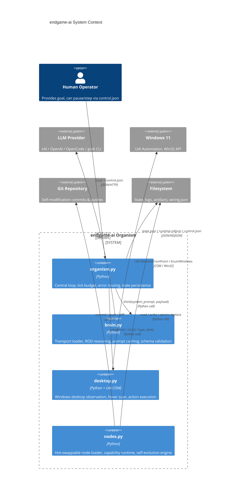
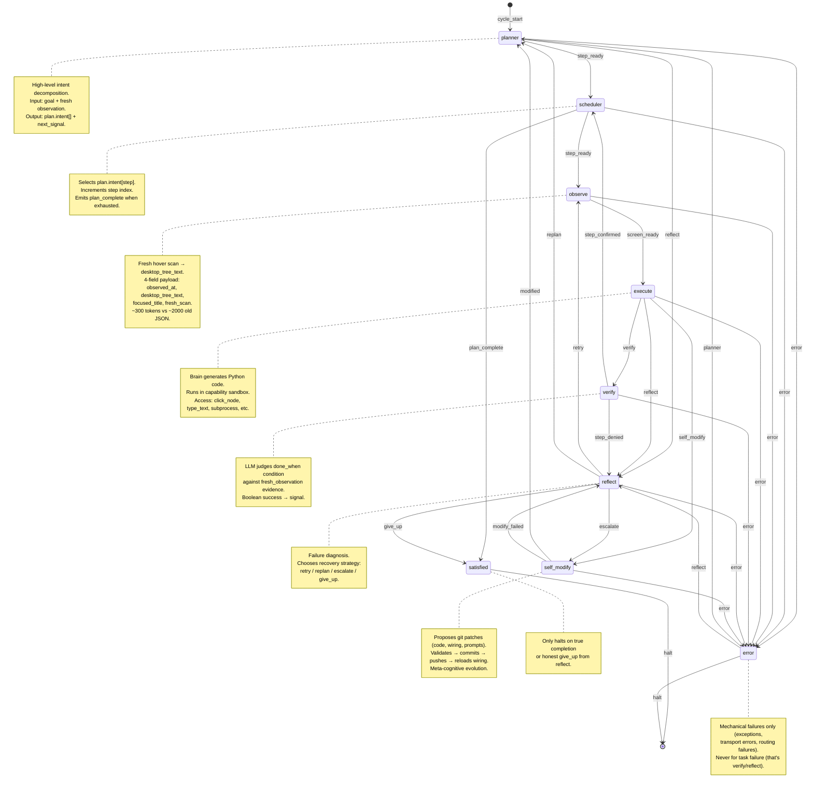
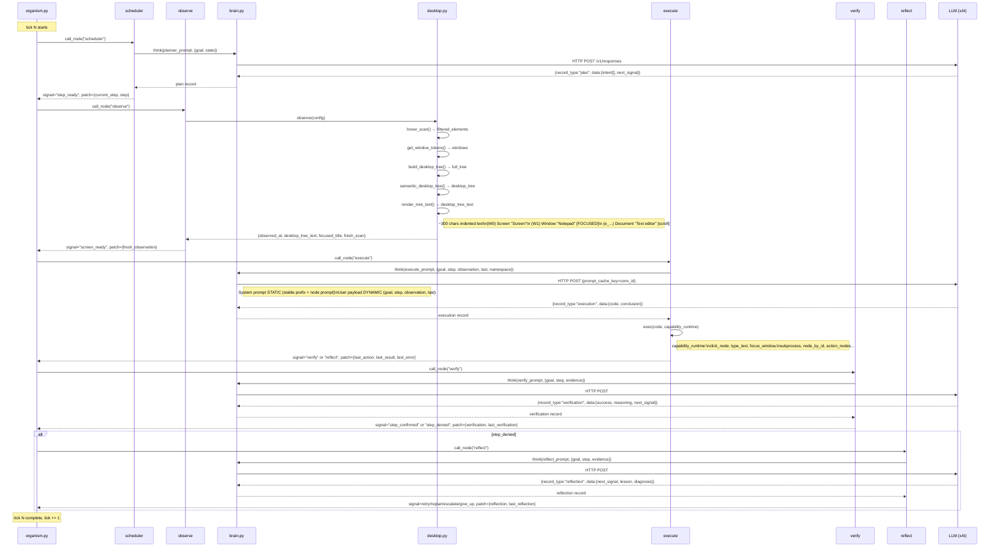
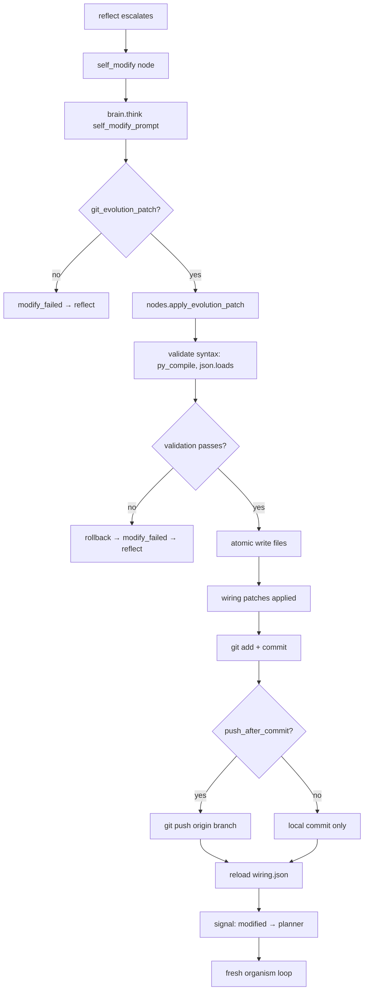
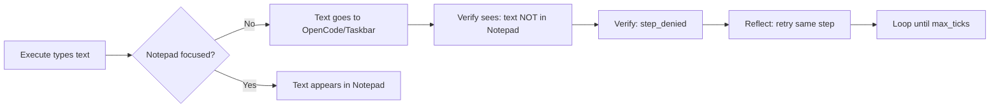

# endgame-ai

## Vision & Philosophy

**endgame-ai is a local desktop organism, not a chatbot.**

The core thesis: **code is the action layer, the LLM is the reasoning organ.** The Python body (organism.py, desktop.py, nodes.py) owns the mouse, keyboard, filesystem, git, and Windows UIA. The LLM (via hot-swappable transports in brain_transports/) receives a slim semantic observation and returns structured JSON records that drive the topology.

### Design Principles

| Principle | Implementation |
|-----------|----------------|
| **Hard switches over fallbacks** | `wiring.json` selects exactly one transport; no fallback chain. If the selected transport fails, the organism halts. |
| **Fail-hard, log-everything** | Every brain call logs request/response to `comms/runtime.ndjson`. Raw logs capture full conversation for debugging. |
| **Self-modification as first-class** | The `self_modify` node proposes git patches. The organism validates, applies, commits, and pushes on the checked-out branch. |
| **Token minimalism** | Observation reduced from ~2000-token JSON to ~300-token indented text (85% reduction). Every schema field must earn its keep. |
| **No mocking in production** | All UIA calls hit real Windows desktop. All brain calls hit real LLM APIs. Test runs use `--max-ticks` limits. |
| **Centralized control chokepoint** | `organism.py:84` `wait_before_node()` enforces run/pause/step modes before every node execution. |
| **Stable prefix for prompt caching** | Full checked-out source snapshot prepended to system prompt (when enabled), enabling xAI conversation-level caching. |

### What "Living Organism" Means Here

A living organism in this architecture:
1. **Perceives** — Fresh hover-scan observation every `observe` tick
2. **Plans** — High-level intent decomposed into verifiable steps
3. **Acts** — Executes Python in a capability sandbox with real desktop access
4. **Verifies** — LLM judges `done_when` condition against fresh evidence
5. **Reflects** — On failure, diagnoses and chooses retry/replan/escalate/give_up
6. **Evolves** — `self_modify` rewrites its own code, wiring, and prompts
7. **Halts honestly** — Only when goal complete or reflect gives up

The organism is not "alive" until the loop runs unattended for hundreds of ticks, self-correcting through reflection and evolution.
## Architecture Overview



### Component Responsibilities

| Component | File | Lines | Core Responsibility |
|-----------|------|-------|---------------------|
| **Organism Loop** | `organism.py` | 240 | Run/pause/step chokepoint, topology traversal, tick budget, error routing to `error` node |
| **Brain Chokepoint** | `brain.py` | 697 | Transport selection (fail-hard), ROD reasoning patterns, stable prefix, schema validation |
| **Desktop Observation** | `desktop.py` | 1348 | UIA hover scan, `render_tree_text()`, semantic tree, action_index for body-side targeting |
| **Node Loader** | `nodes.py` | 628 | Dynamic module import, `build_capability_runtime()`, git evolution apply/commit/push |
| **Planner** | `organism_nodes/planner.py` | 18 | High-level intent from goal + observation → `plan` record |
| **Scheduler** | `organism_nodes/scheduler.py` | 23 | Selects `plan.intent[step]` index → `step_ready` or `plan_complete` |
| **Observe** | `organism_nodes/observe.py` | 15 | Fresh scan → 4-field payload (`desktop_tree_text`, `focused_title`, `observed_at`, `fresh_scan`) |
| **Execute** | `organism_nodes/execute.py` | 84 | Brain → Python code → capability runtime → `verify` or `reflect` |
| **Verify** | `organism_nodes/verify.py` | 64 | LLM judges `done_when` against fresh evidence → `step_confirmed` / `step_denied` |
| **Reflect** | `organism_nodes/reflect.py` | 54 | Diagnoses failure → `retry` / `replan` / `escalate` / `give_up` |
| **Self-Modify** | `organism_nodes/self_modify.py` | 182 | Proposes git patches → validated → committed → pushed → wiring reloaded |
| **Satisfied** | `organism_nodes/satisfied.py` | 9 | Halts only on true completion or honest give-up |
| **Error** | `organism_nodes/error.py` | 25 | Mechanical failure recovery → `planner` / `reflect` / `halt` |

### Data Stores

| Store | Path | Format | Purpose |
|-------|------|--------|---------|
| **State** | `state.json` | JSON | Single source of truth for current tick: goal, plan, step, observation, last action/result/error |
| **Runtime Log** | `comms/runtime.ndjson` | NDJSON | Append-only audit trail: node_start, node_complete, brain requests/responses, errors |
| **Control** | `comms/control.json` | JSON | Human-operated: `mode` (run/pause/step), `step_token`, `updated_at` |
| **Wiring** | `wiring.json` | JSON | Static topology, prompts, model config, paths — hot-reloaded on self-modify |
| **Observations** | `comms/observations/*.json` | JSON | Raw artifacts per scan for debugging/replay |
## Topology as Living Mermaid (The Unification Insight)

**Key realization**: The topology edges in `wiring.json` *are* a state machine. We should represent them as executable Mermaid — this unifies documentation, visualization, and potentially the topology definition itself.



### Why This Matters

| Current (`wiring.json`) | Proposed (Mermaid as Source) |
|-------------------------|------------------------------|
| JSON edges, manual sync | Diagram *is* the topology |
| Hard to visualize | Instant visual in any Markdown viewer |
| No annotations | Rich notes per node/edge |
| Version control diff noisy | Clean semantic diffs |
| Duplicate logic in code | Single source of truth |

**Future direction**: Parse this Mermaid at startup to build the topology edges, eliminating `wiring.json` topology section entirely. The diagram becomes executable specification.

### Signal Contracts

| Signal | Source → Target | Payload Expectation |
|--------|-----------------|---------------------|
| `step_ready` | planner→scheduler, scheduler→observe | `current_step`, `step_goal`, `step` index |
| `screen_ready` | observe→execute | `observed_at`, `desktop_tree_text`, `focused_title`, `fresh_scan` |
| `verify` | execute→verify | `last_action`, `last_result`, `last_error`, `fresh_observation` |
| `step_confirmed` | verify→scheduler | `step` incremented |
| `step_denied` | verify→reflect | `last_verification` with reasoning |
| `retry` | reflect→observe | Fresh scan, same step |
| `replan` | reflect→planner | New plan from diagnosis |
| `escalate` | reflect→self_modify | Code/wiring evolution needed |
| `give_up` | reflect→satisfied | Honest failure admission |
| `modified` | self_modify→planner | Wiring reloaded, fresh start |
| `modify_failed` | self_modify→reflect | Patch validation failed |
| `error` | any→error | `last_error`, `last_node`, `last_signal` |
| `halt` | satisfied/error→[*] | Clean exit |
## Data Flow: Single Tick Anatomy



### Token Economy: Before vs After

| Component | Old (JSON) | New (Text) | Reduction |
|-----------|------------|------------|-----------|
| `desktop_tree` (nested dict) | ~1800 tokens | — | — |
| `observation_delta` (diff) | ~200 tokens | — | — |
| `screen_text` (always "") | ~50 tokens | — | — |
| **Total per observe** | **~2050 tokens** | **~300 tokens** | **85%** |
| `desktop_tree_text` (indented) | — | ~250 tokens | — |
| `focused_title` | — | ~20 tokens | — |
| `observed_at` + `fresh_scan` | — | ~30 tokens | — |

### xAI Prompt Caching Strategy

```mermaid
flowchart LR
    subgraph "System Prompt (STATIC - Cached)"
        SP1[Stable Prefix\n~50KB source snapshot]
        SP2[Node Prompt\nfrom wiring.json]
    end
    
    subgraph "User Payload (DYNAMIC - Per Call)"
        UP1[goal: string]
        UP2[step: {description, done_when}]
        UP3[observation: {desktop_tree_text, focused_title}]
        UP4[last: {action, result, error}]
        UP5[namespace: capability list]
    end
    
    SP1 --> Cache[Prompt Cache Key\nconversation_id]
    SP2 --> Cache
    UP1 --> Request
    UP2 --> Request
    UP3 --> Request
    UP4 --> Request
    UP5 --> Request
    Cache --> Request
    Request --> xAPI[xAI Responses API]
```

**Critical**: Only the final user message changes per call. System prompt (stable prefix + node prompt) remains identical across all ticks for a given node type. The `prompt_cache_key` in xAI transport enables conversation-level caching.

### Fresh Observation Propagation

The `fresh_observation` payload flows through **every node** after `observe`:
- `execute`: Uses `desktop_tree_text` for code generation context
- `verify`: Uses fresh evidence to judge `done_when`
- `reflect`: Uses fresh evidence for failure diagnosis
- `self_modify`: Uses fresh observation for context-aware patches

This is enforced in `brain.py:320` `_with_fresh_observation()` — no node operates on stale screen state.
## Capability Runtime Schema

```mermaid
classDiagram
    class CapabilityRuntime {
        +observe_screen() dict
        +last_desktop_tree() dict
        +get_focused_title() str
        +node_by_id(node_id: str) dict
        +action_nodes(action: str?) list[dict]
        +click_node(node_id: str) dict
        +scroll_node(node_id: str, amount: int) dict
        +click(x: int, y: int, hwnd: int) dict
        +type_text(text: str) dict
        +press_key(key: str) dict
        +hotkey(keys: str|list) dict
        +scroll(x: int, y: int, amount: int, hwnd: int) dict
        +focus_window(target: str) dict
        +open_url(browser: str, url: str) dict
        +subprocess: module
        +ctypes: module
        +os: module
        +sys: module
        +json: module
        +re: module
        +time: module
        +pathlib: module
        +math: module
        +random: module
        +wiring_limit(name, default, wiring) int
        +repo_root: str
        +python_executable: str
        +state: dict
        +wiring: dict
        +goal: str
        +last: dict
        +fresh_observation: dict
        +desktop_tree: dict
        +desktop_tree_text: str
        +observation_artifact: dict
        +focused_title: str
        +observed_at: float
        +fresh_scan: bool
    }

    CapabilityRuntime --> "desktop.py" : click, type_text, focus_window, etc.
    CapabilityRuntime --> "nodes.py" : git_head_sha, wiring_limit, etc.
    CapabilityRuntime --> "brain.py" : last_fresh_observation()
```

### Action Targeting: `node_by_id` vs `action_nodes`

The brain sees **only** `desktop_tree_text` (indented hierarchy with `[FOCUSED]` on window). To act, it references element IDs from that text:

```python
# Brain generates code like:
click_node("e_590358_70_138")  # From desktop_tree_text: (e_590358_70_138) Document "Text editor" [scroll]
type_text("hello world")
```

The capability runtime resolves IDs via:
1. `node_by_id(node_id)` — Looks up in `state.desktop_tree.node_index` (semantic tree) → gets `px`, `py`, `hwnd`
2. `action_nodes(action)` — Filters `action_index` (body-side) by action type (`click`, `write`, `scroll`)

**Critical**: The `action_index` (in `desktop.py:1046`) preserves `px`, `py`, `hwnd`, `rect`, `runtime_id` — all the targeting data the brain *doesn't* see. The brain acts by semantic ID; the body executes by coordinates.

### Focus Enforcement (New Requirement)

**Problem observed in logs**: Execute types text but Notepad isn't focused → text goes to wrong window.

**Solution**: `focus_window(target)` must be called before `type_text` when target window ≠ currently focused.

```python
# Correct pattern in execute-generated code:
focus_window("W1")  # or "Notepad" or "hwnd:12345"
type_text("hello world")
```

The `desktop_tree_text` now shows `[FOCUSED]` on the window line, so the LLM knows which window has focus and can decide to switch.

### Namespace Hint (Sent to Execute)

The `execute` prompt includes a `namespace` hint listing available capabilities:

```json
{
  "values": ["state", "wiring", "goal", "last", "fresh_observation", "desktop_tree_text", "focused_title"],
  "observation": ["observe_screen()", "last_desktop_tree()", "get_focused_title()", "node_by_id(id)", "action_nodes(action=None)"],
  "actions": ["click_node(id)", "scroll_node(id,amount)", "click(x,y,hwnd)", "type_text(text)", "press_key(key)", "hotkey(keys)", "scroll(x,y,amount,hwnd)", "focus_window(target)", "open_url(browser,url)"],
  "modules": ["subprocess", "ctypes", "os", "sys", "json", "re", "time", "pathlib", "math", "random"],
  "repo": ["wiring_limit(name, default, wiring)", "repo_root", "python_executable"]
}
```

This is **documentation only** — the actual runtime is `build_capability_runtime()` in `nodes.py:523`. The hint helps the LLM generate valid code without hallucinating APIs.
## Self-Modification Loop



### Patch Contract (from wiring.json self_modify prompt)

```json
{
  "record_type": "git_evolution_patch",
  "data": {
    "summary": "short human summary",
    "rationale": "runtime/code evidence for the change",
    "read_files": ["repo/relative/path.py"],
    "file_writes": [{"path": "organism_nodes/execute.py", "content": "complete file text"}],
    "file_deletes": ["dead_file.py"],
    "wiring_patches": [{"op": "set", "path": "model.temperature", "value": 0.1}],
    "commands": [{"command": "python -m py_compile organism_nodes/execute.py", "shell": true}],
    "expected_validation": "execute node runs without import errors"
  }
}
```

### Safety Gates (nodes.py:357-432)

| Gate | Implementation | Purpose |
|------|----------------|---------|
| `read_files` declaration | `_declared_read_files()` vs actual touched files | Prevents blind writes; must read before write |
| Syntax validation | `compile(content, rel, "exec")` for .py, `json.loads()` for .json | Catches syntax errors before write |
| Core file protection | `CORE_FILES` blocklist in `_evolution_target()` | Cannot delete brain.py, nodes.py, organism.py, desktop.py, stop_check.py, wiring.json |
| Runtime area blocklist | `BLOCKED_EVOLVE_PARTS` = {.git, __pycache__, comms, pids} | No self-modifying runtime state |
| Rollback on failure | `_snapshot_paths()` + `_restore_snapshots()` | Atomic transaction |
| Activation buckets | `_activation_bucket()`: immediate / next_run / supporting | Controls when changes take effect |

### Current State: Infrastructure Ready, Never Triggered

The self-modify machinery is fully implemented and tested in isolation. In observed runs (see `latest-exec-logs.md`), `reflect` has **never** emitted `escalate` signal. Why?

1. **No persistent memory** — Each tick starts fresh; reflect sees only current failure, not pattern
2. **Verify fragility** — Failures look like "step failed" not "system design flaw"
3. **No meta-cognitive trigger** — Prompt doesn't explicitly ask "is this a code bug worth fixing?"

**To activate**: Add explicit escalation criteria to `reflect` prompt, or add a periodic "architectural review" step in topology.
## Honest Assessment: Where the Organism Lives Today

### What Works (Verified by Logs)

| Capability | Evidence | Location |
|------------|----------|----------|
| Hierarchical text observation | `state.json` shows `desktop_tree_text` with `[FOCUSED]` | `organism_nodes/observe.py:10-14` |
| Token reduction ~85% | xAI logs: 2000→300 chars per observation | `latest-exec-logs.md` lines 1-11 |
| Dead code removed | `brain_head.py` deleted, `observation_delta` gone, `screen_text` gone | commit 63e4e90 |
| xAI prompt caching | `prompt_cache_key` in transport, stable per conversation | `brain_transports/xai.py:63-64` |
| Full topology execution | 10 ticks completed: planner→scheduler→observe→execute→verify→reflect→... | `state.json` tick=10 |
| Code execution sandbox | `exec()` in capability runtime with stdout/stderr capture | `organism_nodes/execute.py:59-65` |
| Git self-modify pipeline | `apply_evolution_patch` → validate → commit → push | `nodes.py:357-488` |

### What's Broken (Blockers to "Living Organism")



**Root cause**: Execute node generates `type_text("hello world")` but **never calls `focus_window("Notepad")` first**. The `desktop_tree_text` shows `[FOCUSED]` on the wrong window (often "Taskbar" or "OpenCode"), but the LLM doesn't act on it.

**Evidence from logs** (tick 7-8):
```
fresh_observation: {focused_title: "Untitled - Notepad", desktop_tree_text: "(W1) Window \"Untitled - Notepad\" [FOCUSED]"}
execute code: type_text("hello world")
verify: "Text not visible in Notepad" → step_denied
reflect: "Need to ensure focus before typing" → replan
next execute: focus_window("W1") + type_text("hello world")  ← This works but only after reflection
```

### What's Missing (Architectural Gaps)

| Gap | Impact | Fix Complexity |
|-----|--------|----------------|
| **No text extraction** | Verify can't read Notepad content — only sees tree structure | Add `read_element_text(node_id)` to capability runtime |
| **No focus enforcement** | Execute must manually `focus_window` before typing | Add to execute prompt + namespace hint |
| **No working memory** | Each tick forgets previous attempts; reflect sees only last failure | Add `scratchpad` to state, persisted across ticks |
| **Self-modify never triggers** | No escalation path from repeated failures to code change | Add `failure_count` in state; reflect escalates after N retries |
| **Prompt caching suboptimal** | Stable prefix includes full source tree (~50KB) every call | Enable `stable_prefix.include_in_request=true` only for self_modify |

### Token/Cost Reality Check

| Metric | Current | Target |
|--------|---------|--------|
| Observe payload | ~300 tokens | ✅ Optimal |
| Execute payload | ~800 tokens (namespace hint verbose) | Reduce hint to essentials |
| System prompt (cached) | ~15,000 tokens (stable prefix) | Enable xAI cache, pay once |
| **Per-tick cost (xAI)** | **~$0.002** | **~$0.0005** with full caching |

The stable prefix (entire repo source) is sent **every call** but only cached if `include_in_request=true`. Currently `enabled=false` in wiring. Enabling it + `prompt_cache_key` = massive savings.

### The "Living" Threshold

The organism becomes "living" when it:
1. **Completes a multi-step goal** without human intervention (notepad → type → verify → halt)
2. **Recovers from focus/window errors autonomously** (execute calls focus_window proactively)
3. **Triggers self-modify** when repeated pattern detected (e.g., "always forget focus_window")
4. **Persists learning** across sessions (scratchpad + git history)

We have 1, 2 (after reflection), and 4 (infrastructure). Missing: **proactive focus management** and **self-modify activation**.
## Roadmap: Next Critical Steps

### Priority 1: Proactive Focus Management (Immediate)

**Problem**: Execute generates `type_text` without ensuring target window focused.

**Fix**: Update `execute` prompt + namespace hint to enforce focus-first pattern.

```diff
# wiring.json prompts.execute - add to namespace.hint
"actions": [
+  "focus_window(target)  # CALL FIRST if target window != focused_title",
   "click_node(id)", "scroll_node(id,amount)", ...
]
```

**Prompt addition**: 
> "BEFORE typing/clicking: check `focused_title` in observation. If target window differs, call `focus_window(window_id_or_title)` first. The `desktop_tree_text` shows `[FOCUSED]` on the currently focused window."

**Validation**: Run "open notepad and write hello world" — should succeed in 1 execute→verify cycle, not 3.

### Priority 2: Text Extraction Capability (Immediate)

**Problem**: Verify judges `done_when: "text visible in Notepad"` but can only see tree structure, not document content.

**Fix**: Add `read_element_text(node_id)` to capability runtime (`nodes.py:523`).

```python
def read_element_text(node_id: str) -> dict[str, Any]:
    """Read text content from UIA element (Document, Edit, Text)."""
    node = _action_index(state).get(node_id) or _desktop_tree_index(state).get(node_id)
    if not node:
        return {"ok": False, "error": f"node not found: {node_id}"}
    hwnd = node.get("hwnd")
    # Use UIA TextPattern or Win32 WM_GETTEXT
    # Return {"ok": True, "text": "..."}
```

**Update observe**: Include Document/Edit elements with `[read]` action hint in `desktop_tree_text`.

### Priority 3: Working Memory / Scratchpad (Week 1)

**Problem**: Each tick is amnesiac. Reflect sees only immediate failure, not pattern.

**Fix**: Add `scratchpad` field to state, persisted in `state.json`.

```python
# organism.py initial state
"scratchpad": {},  # free-form dict, survives ticks

# reflect node can write:
patch["scratchpad"] = {**state.get("scratchpad", {}), "focus_issue_count": 3}

# execute prompt includes:
"scratchpad": state.get("scratchpad", {})
```

**Use case**: Track "focus_window forgotten 3 times" → reflect escalates to self_modify.

### Priority 4: Self-Modify Activation Trigger (Week 1)

**Problem**: Self-modify infrastructure exists but never invoked.

**Fix**: Add explicit escalation criteria to `reflect` prompt:

> "If the same failure pattern repeats 3+ times (check scratchpad), and the fix requires code/prompt change (not just retry), emit `escalate` with `diagnosis` explaining what code must change."

**Alternative**: Add periodic `architect_review` node in topology after N ticks.

### Priority 5: Mermaid as Executable Topology (Week 2)

**Vision**: Replace `wiring.json` topology section with the Mermaid diagram from Section 3.

**Implementation**: 
1. Add mermaid parser (extract nodes/edges from stateDiagram-v2)
2. Validate at startup: all nodes exist as modules, all signals defined
3. Hot-reload on self-modify (update diagram → parse → new topology)

**Benefit**: Documentation = Specification = Runtime. No drift possible.

### Priority 6: Prompt Caching Optimization (Week 1)

**Current**: `stable_prefix.enabled=false` → full source sent every call, not cached.

**Fix**: 
```json
// wiring.json
"model": {
  "stable_prefix": {
    "enabled": true,
    "include_in_request": true   // Only for self_modify (needs source grounding)
  }
}
```

**For other nodes**: Use `prompt_cache_key` (already implemented) with conversation-per-node-type. System prompt = node prompt only (no stable prefix). User prompt = dynamic payload.

**Expected savings**: 90%+ token cost reduction on brain calls.

### Priority 7: Session Handover / Bootstrap Protocol (Week 1)

See next section for full methodology.
## Session Handover Protocol: Bootstrap Every Time

**Rule**: Every session finalization = create a handover document that enables immediate bootstrap in the next session. No context loss.

### Bootstrap Prompt (Paste at Session Start)

```
You are continuing endgame-ai development. Read this entire README first (all chunks). Then:

1. **MoE Analysis**: Use explore agent to read ALL .py files, wiring.json, state.json, latest-exec-logs.md
2. **Self-Critique**: Before any task, write your understanding and identify gaps
3. **Execute**: Make changes, run tests, verify
4. **Commit Regularly**: Atomic commits with clear messages. NEVER commit API keys (check wiring.json uses env vars only)
5. **Update README**: If architecture changes, update relevant chunk and regenerate full README

Current focus: [See Roadmap Priority 1-3]
```

### Session Finalization Checklist

At end of EVERY work session:

```bash
# 1. Run full test
python organism.py --reset --max-ticks 10 "open notepad and write hello world"

# 2. Verify state.json shows completion
cat state.json | jq '._phase, .tick, .last_verification'

# 3. Check for sensitive data
grep -r "XAI_API_KEY\|api_key\|password" --include="*.json" --include="*.py" .

# 4. Update relevant README chunk
# 5. Regenerate full README
cat readme_chunks/*.md > README.md

# 6. Commit
git add -A
git commit -m "session: <one-line summary> [readme updated]"
git push
```

### Handover Document Template (Save as `SESSION_HANDOVER.md`)

```markdown
# Session Handover - YYYY-MM-DD

## What Was Done
- [Specific changes with file:line references]
- [Test results: tick count, verification outcome]

## Current Blocker
- [Exact problem: e.g., "execute forgets focus_window before type_text"]

## Next Immediate Action
- [Concrete next step: e.g., "Update execute prompt in wiring.json to enforce focus_window"]

## State Snapshot
- Last tick: N
- Phase: _phase value
- Current node: current_node
- Plan: plan.intent[step].description

## Files Modified
- organism_nodes/execute.py:XX
- wiring.json:XX
- desktop.py:XX

## Commits
- abc1234: description
- def5678: description
```

### MoE (Mixture of Experts) Workflow

For ANY non-trivial task:

1. **Explore Agent** (broad): Read all relevant files, find patterns
2. **Analyze Agent** (deep): Understand specific component, trace data flow
3. **Self-Critique**: "What am I missing? What could break? What's the simplest fix?"
4. **Plan Agent**: Write todo list with atomic steps
5. **Execute Agent**: Implement, test, verify
6. **Review Agent**: Check against constraints (no keys, README updated, tests pass)

**Never skip to Execute without Explore + Self-Critique.**

### Anti-Patterns to Avoid

| Anti-Pattern | Why It Fails | Correct Approach |
|--------------|--------------|------------------|
| Mock UIA/LLM in tests | False confidence; real Windows behaves differently | Use `--max-ticks` on real system |
| Edit without reading file | Breaks imports, misses context | Always `read` before `edit` |
| Commit without `grep` for secrets | Leaks API keys | `grep -r "api_key\|password\|secret"` |
| Assume prompt caching works | xAI cache needs exact system prompt match | Verify `prompt_cache_key` + static system prompt |
| Skip README update | Next session loses context | README chunk updated in same commit |

### Git Hygiene

```bash
# Before commit: scan for secrets
grep -rE "(api[_-]?key|secret|password|token)\s*[:=]\s*[\"']?[a-zA-Z0-9_-]{20,}" --include="*.json" --include="*.py" . || echo "CLEAN"

# Atomic commits per logical change
git add organism_nodes/execute.py wiring.json
git commit -m "execute: enforce focus_window before type_text

- wiring.json: updated execute prompt namespace hint
- execute.py: added focus_window to capability runtime hint
- Fixes: text input going to wrong window (observed in ticks 7-9)"

# Push immediately after commit
git push
```

### The README as Session Memory

This README (regenerated from chunks) IS the session handover. If you're reading this in a new session:

1. **Read all chunks** (`cat readme_chunks/*.md`)
2. **Check `state.json`** for current organism state
3. **Check `latest-exec-logs.md`** for recent LLM interactions
4. **Run one test tick** to verify environment: `python organism.py --reset --max-ticks 3 "test"`
5. **Proceed to Roadmap Priority 1**

No other documentation needed. This file contains: architecture, data flows, current blockers, roadmap, and bootstrap protocol.

## Organism Bus Contract v1

endgame-ai now treats the runtime as a small electronic organism:

- **Nodes are chips.** Each node receives `ctx` and emits exactly one bus packet.
- **The bus packet is `signal + patch`.** `signal` is the control line routed by `wiring.json`; `patch` is the state delta merged into organism memory.
- **LLM organs emit typed records.** Every LLM-backed organ returns `{"record_type":"...","data":{...}}`. The Python wrapper validates that record and converts it into a bus signal.
- **`wiring.json` is the circuit diagram.** A node may only emit signals declared in `topology.edges`.
- **State is memory, observation is sensor input, execute is muscle, verify is comparator, reflect is diagnosis, and self_modify is firmware evolution.**

The minimal Python contract is implemented in `bus.py`:

```python
return bus.emit("step_confirmed", {"step": state["step"] + 1}, record=record)
```

Legacy `(signal, patch)` tuples still load through the same chokepoint, but new nodes should use `bus.emit()` and export a `DATASHEET`:

```python
DATASHEET = bus.datasheet(
    "verify",
    kind="llm_reality_comparator",
    inputs=["goal", "current_step", "fresh_observation"],
    signals=["step_confirmed", "step_denied", "error"],
    writes=["verification", "last_verification", "step"],
    record_type="verification",
)
```

Generate the living wiring diagram with:

```bash
python export_topology.py
```

## ROD / Framing Pass

The old discovery that two small calls can behave like a much larger model is now represented as a real node: `frame_action`.

Normal path:

```text
observe -> execute -> verify
```

When execution lacks enough clarity:

```text
observe -> execute -> frame_action -> execute -> verify
```

`frame_action` does not act. It compresses messy desktop evidence into a compact action frame: screen summary, target, strategy, risk, and notes. The next execute call then writes action code from a clearer world model.

## Body Capability Language

The executor can now use a dependency-free `pyautogui`/`pag` facade backed by the existing organism body. The model may write natural code such as:

```python
pyautogui.hotkey("ctrl", "l")
pyautogui.write("https://example.com")
pyautogui.press("enter")
```

No external `pyautogui` package is imported or required. This is only a familiar language layer over the existing body helpers.


## Self-Modification Immune System v1

Self-modification is firmware surgery, not normal task execution. A successful
patch must preserve the organism's body contracts, not merely compile.

The immune system is intentionally task-agnostic:

- Existing Python organs must be edited with `unified_diffs`; full-file rewrites
  are rejected for protected source files.
- Every touched existing file must be listed in `read_files`.
- `wiring_patches` may update known paths, but new runtime paths must use an
  explicitly allowed prefix. This prevents placebo configuration keys that no
  code consumes.
- `contract_check.py` statically validates the organism after each patch: core
  files are present, important body symbols still exist, every topology node has
  `run(ctx)` and `DATASHEET`, and topology edges target known nodes.
- Failed validation restores snapshots before commit/push.
- `python contract_check.py` is part of the required validation set alongside
  `python -m compileall -q .` and `python -m json.tool wiring.json`.

This changes the meaning of a self-modify commit. The boundary is no longer
"Python syntax is valid". The boundary is now "the organism still has a body,
organs, bus contract, topology, and bootable source surface".

## Grok Source Access and Organ Tuning

`self_modify` is allowed to ask Grok to inspect public source through xAI Web Search,
but only inside a narrow source-access cage:

```text
github.com
raw.githubusercontent.com
api.github.com
```

This fixes the previous failure mode where Grok tried to browse raw GitHub source
but the web-search allowlist only contained `github.com`. Remote browsing is still
advisory. The checked-out repository, source fingerprints, stable prefix, and
`contract_check.py` remain authoritative.

Model behavior is also tuned per organ instead of using one global personality:

- planner and reflect get medium reasoning and enough output space to explain a
  coherent route or diagnosis.
- execute stays lower-temperature and code-focused, with a larger output budget
  for non-trivial action snippets.
- verify stays almost deterministic and reasoning-free because it is a reality
  comparator, not a storyteller.
- self_modify gets high reasoning, a large output budget, and source web access,
  because firmware patches need room to inspect, justify, and produce complete
  diffs.

The prompts now share one identity: every LLM call is a specialized stateless
organ inside the same local computer-control organism. The shared identity is
not roleplay. It is a contract reminder: emit one typed JSON record, preserve the
bus, and let Python route the body.
