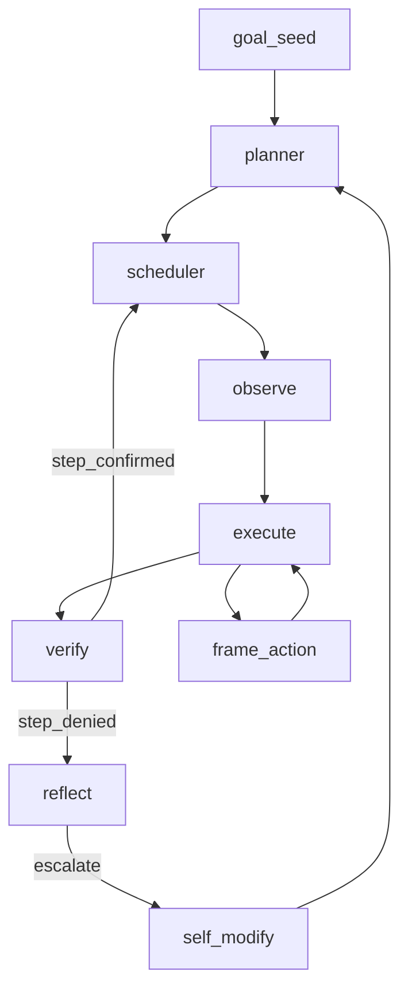

# endgame-ai

Living digital operator on Windows. One goal in, handover out. Python senses the desktop, runs code on the real machine, routes signals through `wiring.json`, may evolve firmware via git. No sandbox. **goal_seed is the only task source.**

≈ **2,700 LOC** — 22 root `*.py` + `wiring.json`.

---

## Goal

One string. The planner decomposes it. Firmware has no baked-in tasks (no browser names, no “dual thread” concept in code). If the goal mentions several activities, that is goal text only.

---

## Escalation enforcement (`escalation-enforcement`)

When `failure_streak ≥ 3` and `done_when` requires SEMANTIC_UI roles missing from the observation tree, reflect **forces `escalate`** → `self_modify` (`bus.py`, `reflect.py`, `wiring.json` → `reflect_escalation.observation_missing_min_streak: 3`).

---

## Architecture

SEMANTIC_UI: WINDOW → ZONE → role (`text_input`, `button`, `clickable`, …). Geometry only; goal supplies meaning.

---

## Commentary vs organism

The organism runs the handover. Commentary (assistant narration, `comms_poll.py`) is read-only and does not drive ticks.

Commentary does not run reliably on its own — owner prompts during a run are normal. That chat steals focus and shows up in scans (element counts swing). Useful as an **adaptation benchmark**: desktop includes operator noise the plan never mentioned.

---

## Proven / open

| Works | Open |
|-------|------|
| Tick loop, SEMANTIC_UI, execute, verify, reflect, replan | Last handover not completed |
| Forced escalate coded | Not yet seen on a live tick |
| Task-agnostic prompts | True resume from `state.json` |

---

## Runtime (gitignored)

`state.json`, `comms/brain_raw.jsonl`, `comms/runtime.ndjson`, `comms/observations/` — created during runs, not tracked.