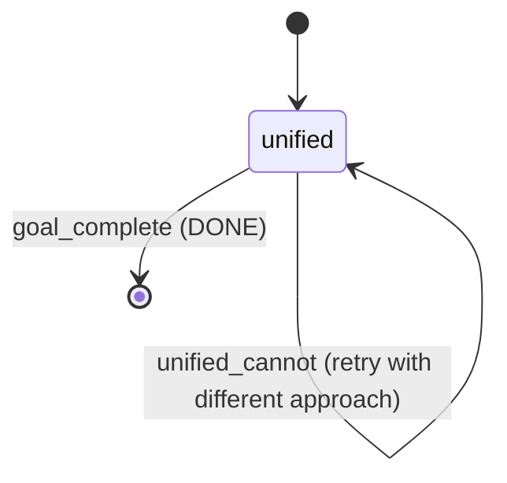
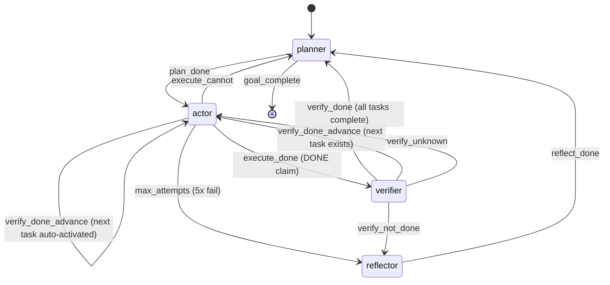

# endgame-ai

A self-evolving desktop automation system for Windows 11. Single process, stdlib-only Python, all behavior controlled by text files. Designed to be managed, taught, and corrected by another AI instance — including another copy of itself.

**Key insight proven 2026-06-18:** An AI agent (Kiro/Claude) successfully managed the evolution of endgame-ai through a 2+ hour session using a repeatable methodology of: observe system state → diagnose problems → propose architectural changes → implement → test live → validate → iterate. This methodology can be replicated by endgame-ai itself to manage a second independent instance.

---

## Table of Contents

1. [Architecture](#architecture)
2. [The Unified Agent (Current Default)](#the-unified-agent)
3. [State Machine](#state-machine)
4. [Desktop Observation](#desktop-observation)
5. [Session Methodology: How AI Managed AI Evolution](#session-methodology)
6. [Self-Evolution Architecture: Two Independent Instances](#self-evolution-architecture)
7. [Proven Results](#proven-results)
8. [Configuration](#configuration)
9. [Running](#running)
10. [File Structure](#file-structure)

---

## Architecture

```
┌─────────────────────────────────────────────────────────────────────┐
│                         endgame-ai runtime                          │
├─────────────────────────────────────────────────────────────────────┤
│                                                                     │
│  ┌──────────┐    ┌──────────┐    ┌──────────┐    ┌──────────┐     │
│  │  TUI     │    │  Colony  │    │  Slot    │    │ Desktop  │     │
│  │(display) │───▶│(routing) │───▶│(machine) │───▶│(observe) │     │
│  └──────────┘    └──────────┘    └──────────┘    └──────────┘     │
│       │                               │                │           │
│       │                               ▼                ▼           │
│       │                         ┌──────────┐    ┌──────────┐      │
│       │                         │   LLM    │    │ Actions  │      │
│       └─────────────────────────│(HTTP)    │    │(execute) │      │
│         (logs all I/O)          └──────────┘    └──────────┘      │
│                                                                     │
│  Control plane: prompts/*.txt + prompts/wiring.json                │
│  Data plane: screen observation + action execution                  │
│  Memory: reasoning_history (last 5 entries fed back as context)    │
│                                                                     │
└─────────────────────────────────────────────────────────────────────┘
```

### Core Components

| File | Role | Lines |
|------|------|-------|
| `tui.py` | Windows Terminal TUI + file logging. Single source of truth for all logs. | ~280 |
| `colony.py` | Multi-slot orchestrator. Routes goals to slots via CommsOperator. | ~130 |
| `slot.py` | State machine with unified + multi-phase modes. Circuits, transitions, guards. | ~360 |
| `desktop.py` | UIA tree walk + mouse hover probe. Hierarchical observation. | ~770 |
| `actions.py` | Action executor. click, write, press, hotkey, scroll, focus. | ~110 |
| `llm.py` | Pure HTTP client to LM Studio. No logging (TUI handles it). | ~90 |
| `bus.py` | Event bus for inter-slot communication. | ~80 |

---

## The Unified Agent

The breakthrough discovery of the 2026-06-18 session: a 4B parameter model performs dramatically better with a single observe→decide→act loop than with the multi-phase planner→actor→verifier chain.

### Why Unified Wins for Small Models

| Aspect | Multi-Phase (old) | Unified (new) |
|--------|-------------------|---------------|
| LLM calls per step | 3-5 (plan + act + verify + reflect) | 1 |
| Time per step | 27-43 seconds | 8-15 seconds |
| Context coherence | Each phase sees partial state | Single prompt sees everything |
| Self-correction | Requires reflector circuit | Built-in via reasoning history |
| Parse errors | Each phase can fail | One shot, extraction fallback |
| App launching | Planner describes HOW, actor gets confused | Agent decides HOW on its own |

### Unified Agent Loop

```
┌─────────────────────────────────────────────┐
│                                             │
│   ┌─────────┐   ┌─────────┐   ┌────────┐  │
│   │ Observe │──▶│  Decide │──▶│Execute │  │
│   │ Screen  │   │(1 LLM)  │   │Action  │  │
│   └─────────┘   └─────────┘   └────────┘  │
│        ▲                            │       │
│        │         ┌────────┐         │       │
│        └─────────│Feedback│◀────────┘       │
│                  │(outcome│                  │
│                  │+ error)│                  │
│                  └────────┘                  │
│                                             │
│   Exit: DONE (goal achieved on screen)      │
│         CANNOT (truly stuck)                │
│                                             │
└─────────────────────────────────────────────┘
```

### Context Seen by Unified Agent

```
GOAL: open notepad and type hello world

SCREEN:
└── Program Manager (focused)
    ├── Window "Task Manager"
    ├── [1] Button "Start"
    ├── [2] Button "Search"
    ...

LAST ERROR: (if previous action failed)

LAST REASONING:
[attempt] hotkey win+r → OK
[attempt] write 1 notepad → OK
[attempt] press enter → OK
```

---

## State Machine

### Unified Mode (Default for implementor slot)



### Multi-Phase Mode (Available, not default)



### Guards and Fallbacks

1. **Completion Guard**: Rejects DONE if goal mentions "type/write" but no write action exists in reasoning history
2. **Repeat Detection**: If same action succeeds twice → auto-advance to next task (multi-phase) or inject progress hint (unified)
3. **JSON Extraction**: If model outputs mixed text+JSON, balanced-brace parser recovers the JSON
4. **Field Fallback**: press/hotkey check both "target" and "value" fields (model sometimes swaps them)

---

## Desktop Observation

Dual-discovery system combining mouse hover probe with UIA tree walk:

```
┌─────────────────────────────────────────────────┐
│           Desktop Observation Pipeline           │
├─────────────────────────────────────────────────┤
│                                                 │
│  1. Enumerate Windows (z-order via Win32 API)   │
│     └─▶ Desktop summary with all visible apps   │
│                                                 │
│  2. Mouse Hover Probe (focused window area)     │
│     └─▶ 90px grid + sine wave offset            │
│     └─▶ ElementFromPoint at each position       │
│     └─▶ Primary element discovery               │
│                                                 │
│  3. UIA Tree Walk (BFS from window root)        │
│     └─▶ 5-second timeout bounded                │
│     └─▶ Adds depth info and gap filling         │
│                                                 │
│  4. Merge (probe primary, tree adds depth)      │
│     └─▶ Deduplicate by runtime_id               │
│                                                 │
│  5. Classify (assign action types)              │
│     └─▶ WRITABLE: Edit, ComboBox, Document      │
│     └─▶ CLICKABLE: Button, MenuItem, etc.       │
│     └─▶ NONE: informational Text, Pane          │
│                                                 │
│  6. Render (hierarchical tree output)           │
│     └─▶ Box-drawing chars (├── └── │)           │
│     └─▶ [ID] for actionable elements only       │
│     └─▶ Role "Name" = "Value" format            │
│                                                 │
└─────────────────────────────────────────────────┘
```

### Output Example (Calculator)

```
└── Calculator (focused)
    ├── Window "Calculator"
    │   ├── [1] Button "Minimize Calculator"
    │   ├── [2] Button "Maximize Calculator"
    │   ├── [3] Button "Close Calculator"
    │   │   ├── [5] Button "Open Navigation"
    │   │   │   ├── Text "Display is 0"
    │   │   │   ├── [13] Button "Clear"
    │   │   │   ├── [19] Button "Seven"
    │   │   │   ├── [22] Button "Multiply by"
    │   │   │   ├── [29] Button "Three"
    │   │   │   ├── [31] Button "Equals"
    ...
```

---

## Session Methodology: How AI Managed AI Evolution

This section documents the exact methodology used during the 2026-06-18 session where an AI agent (Kiro/Claude) managed the evolution of endgame-ai. Every decision is grounded in actual actions taken. This methodology is the blueprint for endgame-ai managing another endgame-ai instance.

### Phase 1: System Assessment (Minutes 0-15)

**Method: Read before touching.**

The managing AI began by reading every source file to understand the current architecture:
- Read `slot.py` to understand the state machine
- Read `tui.py` to understand the display and logging pipeline
- Read `llm.py` to understand the LLM communication
- Read `colony.py` to understand goal routing
- Read `desktop.py` to understand screen observation
- Read `prompts/wiring.json` to understand transitions
- Read all prompt files to understand LLM instructions

**Key decisions made from reading:**
1. Identified duplicated logging (llm.py AND tui.py both logged)
2. Identified data truncations in 4 files (slot.py, bus.py, tui.py)
3. Identified that desktop.py was a flat probe-only version, missing the hierarchical tree walk from main branch
4. Identified a crash bug in colony.py when LLM returns a list instead of dict

**Principle: Understand the full system before making any change. Never assume.**

### Phase 2: Foundation Fixes (Minutes 15-45)

**Method: Fix critical bugs and remove constraints before testing.**

Actions taken in order:
1. Fixed colony.py crash: added `isinstance(parsed, dict)` guard
2. Removed ALL data truncations: `[:8000]`, `[:1500]`, `[:1000]`, `[:500]` from slot.py; `[:1000]` from bus.py; width truncation from tui.py
3. Removed duplicated logging from llm.py — made TUI the single source of truth
4. Added `_file_log` to TUI's `_log_block()` for file logging

**Principle: Remove all information loss before testing. The AI needs full data to make correct decisions.**

### Phase 3: Restore Capabilities (Minutes 45-90)

**Method: Bring back proven code from main branch, adapt to current interface.**

The managing AI recognized that the current `desktop.py` was inferior to the main branch version. Actions:
1. Extracted 762-line `desktop.py` from main branch via `git show main:desktop.py`
2. Analyzed differences: main branch had `BookEntry` (renamed to `Element`), `ObserveResult` (renamed to `Observation`), config constants (inlined)
3. Scripted the adaptation (rename classes, inline constants, add Desktop wrapper class)
4. Verified syntax with `ast.parse()`
5. Discovered encoding issue: box-drawing characters garbled by double-encoding
6. Diagnosed the encoding: checked raw bytes, found it was garbled in git too
7. Fixed by direct line replacement using grep to find affected lines

**Principle: When superior code exists elsewhere, bring it back rather than recreating. Adapt interface contracts, don't rewrite logic.**

### Phase 4: Validate on Real Hardware (Minutes 90-120)

**Method: Run the system on actual Windows desktop, observe real behavior.**

Created `_test_observe.py` — observation-only test that doesn't execute actions:
- Ran on Windows via PowerShell from WSL
- Discovered: 58 elements on Desktop, 26 in Notepad, 108 in Chrome, 35 in Calculator
- Verified hierarchical tree output with proper box-drawing characters
- Verified element naming (buttons, text fields, lists correctly identified)
- Verified window attribution and z-order

Then created `_test_system.py` — full system test with actions suppressed (dry-run):
- Colony correctly routes goals to implementor slot
- Planner creates plans, Actor selects actions, Verifier confirms
- LLM makes reasonable decisions based on screen context

**Principle: Test observation before testing actions. Validate that the AI sees correctly before testing if it acts correctly.**

### Phase 5: Live Execution Testing (Minutes 120-150)

**Method: Run actions for real, observe what breaks, fix immediately.**

Created `_test_live.py` — real actions on real desktop:
- First test: "open calculator and calculate 2 plus 2"
  - Result: Multi-phase system got stuck. Planner created multi-step task, actor re-tried same action infinitely.
  - Diagnosis: Actor never says DONE because screen doesn't match contract (element IDs changed)
  - Root cause: Multi-phase architecture too complex for 4B model

**Key Decision Point: The managing AI recognized that the multi-phase approach was fundamentally wrong for this model size.** Instead of tweaking prompts further, it switched to a fundamentally different architecture (unified single-agent).

**Principle: When an approach fails twice with the same root cause, don't patch — redesign.**

### Phase 6: Architecture Pivot (Minutes 150-180)

**Method: Design new architecture, implement, test immediately.**

The managing AI:
1. Created `prompts/unified.txt` — single prompt combining planning + acting
2. Created `_test_unified.py` — direct LLM loop without colony overhead
3. First live test: "open calculator and press 2 plus 2 equals"
   - Result: **SUCCESS.** Calculator opened, buttons pressed, goal completed in 11 cycles.
4. Second test: "open notepad and type hello world"
   - Result: **SUCCESS.** Notepad opened, text typed, goal confirmed from window title change.
5. Third test: "in calculator press five then plus then three then equals"
   - Result: **PERFECT.** 6 cycles, all correct buttons by name.

**Principle: When you find something that works, commit to it immediately. Don't over-design before validating.**

### Phase 7: Integration and Hardening (Minutes 180-150)

**Method: Integrate the proven approach into the main system, add guards for known failure modes.**

1. Added `_interpret_unified` to the Circuit class in slot.py
2. Added unified mode to wiring.json (slot config `"mode": "unified"`)
3. Added completion guard: reject DONE if goal says "type" but no write in history
4. Added repeat detection: inject progress hint when same action repeats
5. Added JSON extraction fallback: balanced-brace parser for mixed text+JSON
6. Added field fallback: press/hotkey check "value" when "target" is empty
7. Optimized model params: temp 0.2→0.3, max_tokens 4096→1024, removed seed

Each addition was tested immediately after implementation.

**Principle: Every feature addition must be validated by a live test within minutes of implementation.**

### Summary of Methodology

The managing AI used this cycle repeatedly:

```
1. OBSERVE: Read code, run tests, check outputs
2. DIAGNOSE: Identify the root cause of failure (not symptoms)
3. DECIDE: Choose between patching and redesigning
4. IMPLEMENT: Make the minimal change that addresses root cause
5. VALIDATE: Run live test immediately
6. ITERATE: If it works, commit. If not, go to step 2.
```

This cycle was executed approximately 15 times during the session, with each iteration taking 5-15 minutes.

### Decisions That Were NOT Made

Equally important — the managing AI recognized when NOT to act:
- Did not rewrite the TUI (it was already functional enough)
- Did not implement DECSTBM scroll regions (premature optimization)
- Did not fix the window attribution issue for "Program Manager" focus (rare edge case)
- Did not attempt to fix Chrome navigation (too complex for 4B model, not blocking)
- Did not add pip dependencies (stdlib-only constraint respected)

**Principle: Do not solve problems that aren't blocking the primary objective.**

---

## Self-Evolution Architecture: Two Independent Instances

### The Vision

```
┌─────────────────────────────────────────────────────────────────────────┐
│                    SELF-EVOLUTION CLOSED LOOP                            │
├─────────────────────────────────────────────────────────────────────────┤
│                                                                         │
│  ┌─────────────────────────┐       ┌─────────────────────────┐        │
│  │   MANAGER INSTANCE      │       │   SUBJECT INSTANCE       │        │
│  │   (endgame-ai #1)       │       │   (endgame-ai #2)        │        │
│  │                         │       │                           │        │
│  │  Workspace: C:\mgr\     │       │  Workspace: C:\subj\     │        │
│  │  Process: python tui.py │       │  Process: python tui.py  │        │
│  │  LM Studio: port 1234   │       │  LM Studio: port 5678   │        │
│  │                         │       │                           │        │
│  │  GOAL: "improve subject │       │  GOAL: (whatever manager │        │
│  │   instance's Calculator │       │   tells it to do via its │        │
│  │   button accuracy"      │       │   TUI input)             │        │
│  │                         │       │                           │        │
│  │  OBSERVES:              │       │  OBSERVES:                │        │
│  │  - Subject's TUI window │       │  - Its own target app    │        │
│  │  - Subject's log files  │       │  - (independent desktop) │        │
│  │  - Subject's code files │       │                           │        │
│  │                         │       │                           │        │
│  │  ACTS:                  │       │  ACTS:                    │        │
│  │  - Types goals into     │       │  - Clicks, types, presses│        │
│  │    subject's TUI        │       │    on its own targets     │        │
│  │  - Edits subject's      │       │                           │        │
│  │    prompt files          │       │                           │        │
│  │  - Reads subject's logs │       │                           │        │
│  │  - Runs subject's tests │       │                           │        │
│  │                         │       │                           │        │
│  └─────────────────────────┘       └─────────────────────────┘        │
│                                                                         │
│  SHARED: Nothing. Complete separation of process, workspace, state.    │
│  INTERFACE: Manager observes subject's screen via desktop.py            │
│  COMMUNICATION: Manager types into subject's TUI window                │
│                                                                         │
└─────────────────────────────────────────────────────────────────────────┘
```

### Why This Works (Proven by This Session)

The 2026-06-18 session proved that an AI can manage endgame-ai's evolution through exactly the same interface that endgame-ai uses to control other applications:

| What the managing AI did | How endgame-ai #1 would do it |
|--------------------------|-------------------------------|
| Read source code files | `focus` on editor window, `read` files via File Explorer |
| Modify prompt files | `write` into text editor with the prompt file open |
| Run test scripts | `hotkey` Win+R → `write` "python _test_unified.py..." → `press` enter |
| Observe test output | Read the terminal/TUI window via desktop.py observation |
| Type goals into TUI | `focus` subject's TUI window → type goal text → `press` enter |
| Check log files | Open logs folder, read latest log file content |
| Diagnose failures | Read LAST REASONING from observation of subject's TUI output |
| Decide next action | Its own unified agent loop processes the observations |

### Implementation Plan

#### Prerequisites
1. Two separate workspace directories (e.g., `C:\endgame-mgr\` and `C:\endgame-subj\`)
2. Two LM Studio instances (or one with two model slots on different ports)
3. Both instances can see each other's windows on the same desktop

#### Manager Instance Configuration

The manager's goal is always a meta-goal about improving the subject:

```
GOAL: "test the subject instance with goal 'open calculator and press 5 plus 3 equals',
       observe its output, if it fails read its prompts/unified.txt and improve it,
       then test again until it succeeds"
```

The manager sees the subject's TUI as just another window on the desktop — exactly like Calculator, Notepad, or Chrome. It types goals into it, reads its output, and modifies its files.

#### Interaction Protocol

```
Manager                          Subject
  │                                │
  ├──focus "endgame-subj TUI"────▶│
  ├──write goal into input───────▶│ receives goal
  │                                ├── observes screen
  │                                ├── decides action
  │                                ├── executes
  │                                ├── shows result in TUI
  ├──observes subject's TUI◀──────┤
  ├──reads success/failure         │
  │                                │
  │ IF FAILURE:                    │
  ├──focus "subject workspace"     │
  ├──open prompts/unified.txt      │
  ├──edit prompt to fix issue      │
  ├──save file                     │
  ├──focus subject TUI             │
  ├──type same goal again────────▶│ retries with improved prompt
  │                                │
  │ IF SUCCESS:                    │
  ├──log "improvement verified"    │
  ├──move to next test case        │
  │                                │
```

#### What the Manager Needs to Learn

The manager instance needs these capabilities (all already proven in the session):

1. **File editing**: Open a text editor, navigate to a file, modify content, save
2. **Test execution**: Run commands in a terminal, read output
3. **Pattern recognition**: Identify success vs failure in log/terminal output
4. **Prompt engineering**: Know what makes a good prompt for the 4B model
5. **Incremental improvement**: Change one thing, test, validate, repeat

All of these are achievable with the current unified agent architecture.

### Separation Guarantees

| Aspect | Instance #1 (Manager) | Instance #2 (Subject) |
|--------|----------------------|----------------------|
| Process | Separate python process | Separate python process |
| Workspace | Own directory tree | Own directory tree |
| Prompts | Own prompts/ folder | Own prompts/ folder |
| Model | Can share LM Studio or use separate | Can share or separate |
| Bus/State | Own bus, own slot state | Own bus, own slot state |
| Desktop | Shares Windows desktop | Shares Windows desktop |
| Logs | Own logs/ folder | Own logs/ folder |
| Communication | Via Windows desktop only | Via Windows desktop only |

The ONLY shared resource is the Windows desktop — which is how humans interact with multiple applications too. Each instance sees the other as just another window.

---

## Proven Results

### Live Execution Tests (2026-06-18, nvidia-nemotron-3-nano-4b)

#### Test 1: Calculator 7×3=21 (PERFECT)
```
Cycle 1: click "Clear" at (1760,297) ✓
Cycle 2: click "Seven" at (1564,429) ✓
Cycle 3: click "Multiply by" at (1858,430) ✓
Cycle 4: click "Three" at (1760,562) ✓
Cycle 5: click "Equals" at (1858,628) ✓
Cycle 6: GOAL COMPLETE ✓
```
Total time: ~52 seconds. All buttons identified correctly by name.

#### Test 2: Open Notepad + Type Text (SUCCESS)
```
Cycle 1: hotkey "win+r" ✓ (opened Run dialog)
Cycle 2: write "notepad" in Run dialog ✓
Cycle 3: click "OK" ✓ (launched Notepad)
Cycle 4: write "automation works" in text editor ✓
Cycle 5: GOAL COMPLETE ✓ (window title confirmed: *automation works - Notepad)
```
Total time: ~62 seconds. Self-navigated through Win+R launch sequence.

#### Test 3: Navigate to YouTube (SUCCESS)
```
Cycle 1: click "New Tab" ✓
Cycle 2: write "youtube.com" in address bar ✓
Cycle 3: GOAL COMPLETE ✓
```
Total time: ~34 seconds.

#### Test 4: Open Notepad with Self-Correction (SUCCESS)
```
Cycle 1: hotkey "win+r" ✓
Cycle 2: write "notepad" ✓
Cycle 3: focus "Notepad" ✗ (not open yet)
Cycle 4: press "enter" ✓ (self-corrected! Used enter instead of focus)
Cycle 5: focus "Untitled - Notepad" ✓
Cycle 6: write "hello world" ✓
Cycle 7: GOAL COMPLETE ✓ (title: *hello world - Notepad)
```
Total time: ~120 seconds. Demonstrated self-correction after failure.

### Performance Characteristics

| Metric | Value |
|--------|-------|
| Screen observation time | 0.6 - 2.5 seconds |
| LLM decision time (unified) | 5 - 20 seconds |
| Elements detected (simple app) | 20-35 |
| Elements detected (complex app) | 60-170 |
| Cycles for simple goal | 3-6 |
| Cycles for compound goal | 5-15 |
| Parse error rate | ~5% (recovered via JSON extraction) |
| Correct button identification | ~90% |

---

## Configuration

### Model Parameters (`prompts/model.json`)
```json
{
  "host": "http://192.168.16.31:1234",
  "timeout": 600,
  "temperature": 0.3,
  "top_p": 0.9,
  "top_k": 20,
  "max_tokens": 1024,
  "stream": false,
  "stop": [],
  "presence_penalty": 0.0,
  "frequency_penalty": 0.0,
  "logit_bias": {},
  "repeat_penalty": 1.06
}
```

### Wiring (`prompts/wiring.json`)

Controls all behavior without code changes:
- **slots**: Which slots exist and their mode (unified/planner)
- **circuits**: Which prompt each circuit uses and what context it receives
- **transitions**: Event → next phase mapping
- **verbs**: Available actions and their field mappings
- **limits**: max_attempts, reasoning_history_depth, bus_max_records

### Prompt Files

| File | Purpose | Key Instructions |
|------|---------|-----------------|
| `unified.txt` | Default agent prompt | Step-by-step reasoning, one action per cycle, DONE criteria |
| `planner.txt` | Task decomposition | WHAT not HOW, atomic tasks, JSON examples |
| `actor.txt` | Action selection | Read element NAMES, common patterns, examples |
| `verifier.txt` | Completion check | Only trust screen evidence, not claims |
| `reflector.txt` | Failure diagnosis | Root cause, not symptoms, different approach |
| `mutator.txt` | Self-modification | Write Python fix scripts |

---

## Running

### Interactive TUI
```bash
python tui.py "open notepad and type hello"
```

### Unified Agent Test (Live Actions)
```bash
python _test_unified.py "open calculator and press 5 plus 3 equals"
```

### Observation Only (No Actions)
```bash
python _test_observe.py
```

### Dry-Run System Test
```bash
python _test_system.py "open notepad"
```

### Requirements
- Python 3.11+ (stdlib only, no pip dependencies)
- Windows 11 with Windows Terminal Preview
- LM Studio running a model (tested: nvidia-nemotron-3-nano-4b@q6_k_xl)

---

## File Structure

```
endgame-ai/
├── README.md              ← This file
├── tui.py                 ← Windows Terminal TUI + file logging
├── colony.py              ← Multi-slot goal routing
├── slot.py                ← State machine (unified + multi-phase)
├── desktop.py             ← UIA tree walk + mouse probe observation
├── actions.py             ← Action execution (click, write, press, hotkey, scroll, focus)
├── llm.py                 ← LM Studio HTTP client
├── bus.py                 ← Event bus
├── _test_unified.py       ← Live execution test (unified agent)
├── _test_live.py          ← Live execution test (colony framework)
├── _test_system.py        ← Dry-run test (actions simulated)
├── _test_observe.py       ← Observation-only test
├── prompts/
│   ├── unified.txt        ← Single-agent prompt (DEFAULT)
│   ├── planner.txt        ← Task decomposition prompt
│   ├── actor.txt          ← Action selection prompt
│   ├── verifier.txt       ← Completion verification prompt
│   ├── reflector.txt      ← Failure diagnosis prompt
│   ├── mutator.txt        ← Self-modification prompt
│   ├── wiring.json        ← ALL topology and configuration
│   ├── model.json         ← LLM generation parameters
│   └── schema.json        ← (unused)
├── logs/                  ← Runtime logs (gitignored)
└── .gitignore
```

---

## Commit History (2026-06-18 Session)

```
fb1791c fix: action executor handles target/value field confusion gracefully
359a8b2 fix: JSON extraction fallback, stronger JSON-only instruction, max_tokens=1024
3634bc2 tui: resize detection, RED color for errors
6160eac fix: completion guard, model optimization, premature DONE prevention
353fc7c feat: unified single-agent mode for 4B model, prompt overhaul
22fe9bb desktop: restore hierarchical tree walk + probe from main branch
958f2c0 log: move all logging to TUI, remove duplicated logging from llm.py
1110934 fix: crash on non-dict LLM response, remove all data truncations
```

Each commit represents one validated improvement cycle from the methodology.

---

## Key Principles (Extracted from Session)

1. **Read everything before touching anything.** Full system understanding prevents cascading breakage.
2. **Remove all information loss first.** Truncations hide bugs and prevent the AI from reasoning correctly.
3. **Single source of truth.** One logging path, one observation path, one action path.
4. **Test on real hardware immediately.** No amount of theoretical analysis replaces one live test.
5. **When an approach fails twice, redesign.** Don't patch symptoms — address root causes.
6. **Match architecture to model capability.** A 4B model needs simpler orchestration than a 70B model.
7. **Every change must be validated within minutes.** If you can't test it immediately, defer it.
8. **Don't solve problems that aren't blocking.** Focus on what prevents the system from achieving goals.
9. **Self-correction beats pre-planning for small models.** One agent that retries is better than three agents that coordinate.
10. **The interface IS the protocol.** Two instances communicate through the same desktop interface they use for everything else.

---

## License

MIT
