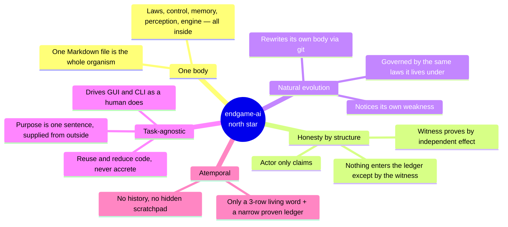
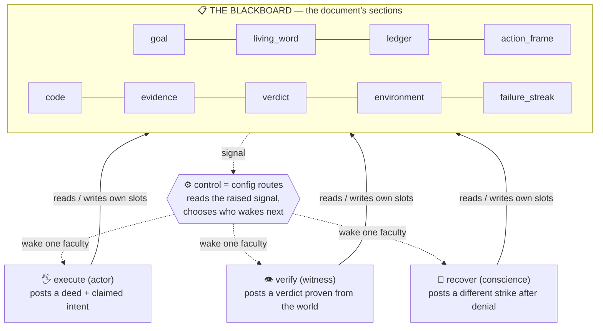
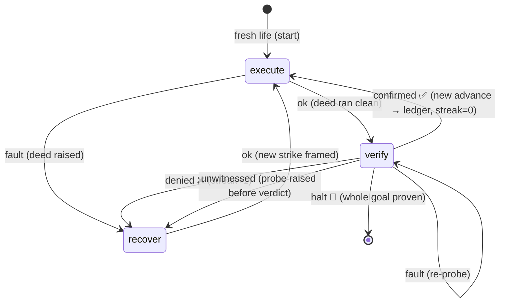
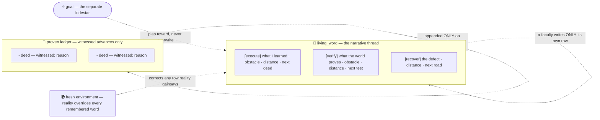
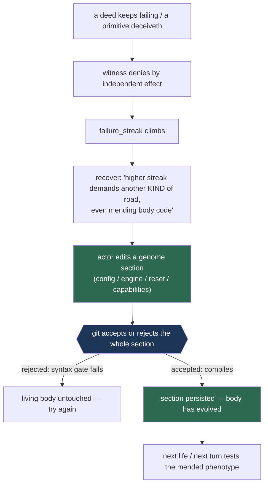
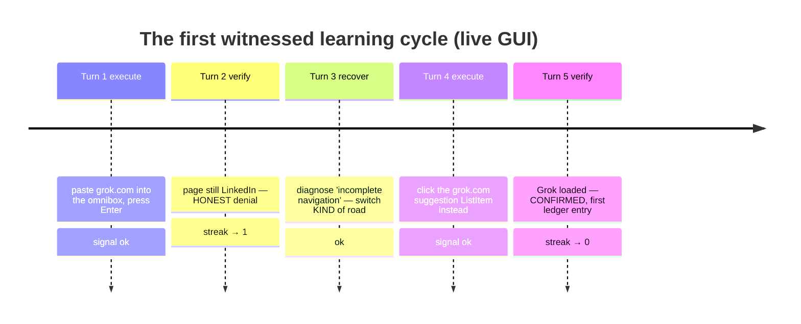
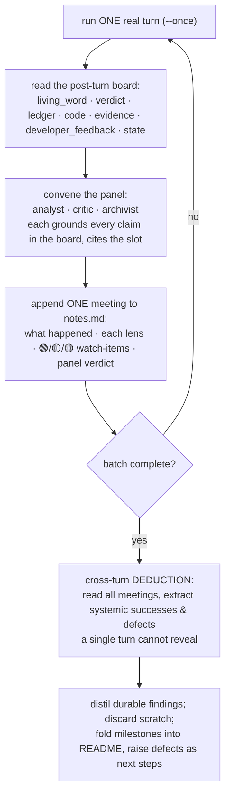

<div align="center">

# endgame-ai

**A single Markdown document that behaves as a living thing.**

It looks at the machine in front of it, writes its own Python, runs it, checks its own
work with a part of itself that is *not allowed to lie*, carries a small handwritten memory
forward, and is permitted to rewrite its own body — including the rules that define it — while it runs.

*Task-agnostic · atemporal · self-modifying · honest by structure*

</div>

---

> [!IMPORTANT]
> **This file is the knowledge base, the plan, and the north star in one.** It carries lasting
> truth only — architecture, laws, methods, proven successes, known gaps, and the way humans and AI
> work on it together — phrased to be as true in a hundred days as today. It records *what is* and
> *what is deliberately intended-but-not-yet-built*; it does not record history, because a thing that
> no longer exists is simply forgotten.
>
> **The live `endgame.md` on disk is always the final authority.** This file explains *how and why*;
> the document is *what is*. Read the document fresh, and where the two disagree, the document wins.

---

## The one-paragraph version

Most software runs a task and stops. endgame-ai does not run a task; it runs a **wheel**. A few stages
turn continuously: **act** toward the goal, **prove** the act with independent evidence, and **recover**
when an act fails or is disproven. A single plain-language goal is handed in from outside, and the wheel
turns until the goal is independently proven done, the body raises, or the process is stopped from
outside. The organism keeps no memory between turns except a small handwritten note it passes forward to
itself and a narrow ledger of proven advances; it is built **never to trust its own claim** that
something worked, because something is true only when a separate faculty — one that could not have faked
it — proves it by looking at the world. The whole organism is one editable document, and it is permitted
to rewrite that document, including the rules that define itself, while it runs.

---

## Why this is a north star, not a normal agent

The vision is a program that is not written *for* a task but **grows** *into* whatever task it is given —
one that drives a real computer the way a human does (screen, mouse, keyboard, and command line at once),
and that, when it discovers its own body is too weak for the job, **naturally evolves its body** rather
than failing or being re-coded by hand. Natural means *not enforced*: the prompts are written so that if
the organism notices a capability defect in itself, reaching for self-surgery is the obvious lawful move —
the same laws that govern the organism govern its self-evolution. Its long arc is to become ever more
**task-agnostic** and to **reuse and reduce** its own code, not accrete it.



| Typical agent | endgame-ai |
| --- | --- |
| Scattered across many framework files | **One document** is the whole organism: laws, control, memory, perception, engine. |
| Keeps a growing conversation history | **Atemporal.** Only a small rewritten living word + a narrow proven ledger + the fresh environment. |
| Trusts the model's self-report | **Trusts nothing.** A separate witness proves every claim by independent effect read afresh from the world. |
| Has a tool menu the model selects from | **The only tool is code.** The actor writes Python; the engine runs it as a real program. |
| Perception is a tool the model calls | **Perception is automatic.** Python explores before every model call. |
| Task logic is coded into the agent | **Task-agnostic.** The goal is one sentence, read fresh each turn. |
| Framework is fixed; the model works within it | **Self-modifying by design.** The organism rewrites its own sections; the engine re-reads the document each turn. |
| Retries the same action on failure | **Recovery must change the *kind* of approach,** widening with the failure streak. |
| Adds guardrails, limits, step caps | **No internal cap the organism cannot itself rewrite.** Never caged. |
| Bound to one host and one model | **Body loads on any host;** the mind is one of four interchangeable transports chosen at launch. |

The organism has almost none of the usual features, and that absence *is* the design: fewer moving parts,
one source of truth, honesty enforced by structure, and a body it is permitted to reshape.

---

## It is a blackboard, not a wiring

The organism is easy to mis-draw as nodes joined by wires, as if a deed's result travelled along an edge
into the next node. **There are no wires.** There is one shared structure that every faculty reads from
and writes back to, and a separate control policy that decides who is woken next. That is the classic
**blackboard architecture**.



- **The blackboard** is the document's sections. One structure holds the goal, the living word, the last
  deed and its evidence, the verdict, the failure streak, and the fresh environment. No faculty owns it;
  each reads what it needs and writes only its own slots.
- **The faculties** are knowledge sources, woken one at a time. None of them calls another; each only
  faces the blackboard.
- **The control** is the config, not dataflow. A small policy reads the signal a faculty raised and
  chooses which faculty is woken next. *Move the choice, not the data.*

---

## The document and its sections

The document is Markdown. Every top-level `## name` heading opens a section, and each section is one slot
on the blackboard. **Body slots** define the organism; **memory slots** change as it lives. All of them
live in the one file; there is no companion file to consult.

<table>
<tr><th>🧬 Body slots (the constitution — rewritten only by deliberate self-modification)</th></tr>
<tr><td>

- **`config`** — the whole control policy as one inert JSON block: the mind and its transports, the
  shared prompt law, the record contracts, the stages, and the routing. It is **data, not executable
  configuration**, so a syntax slip in reasoning cannot brick the wheel.
- **`engine`** — the small Python that turns the wheel: read the document, explore, assemble the prompt,
  call the mind under a strict schema, run the returned code, fold the result back, route, rewrite.
- **`reset`** — a small Python program, run on its own at the start of a fresh life, that wipes the memory
  slots to a clean slate while preserving the body and the goal.
- **`capabilities`** — the Python of the hand and the eyes (Windows UI Automation for sight, input
  synthesis for the hand), carried inside the document so nothing need be downloaded or installed.

</td></tr>
</table>

<table>
<tr><th>🧠 Memory slots (rewritten as the organism lives — what is not narrated forward is forgotten)</th></tr>
<tr><td>

- **`goal`** — the lodestar, one sentence, changeable at any time, even mid-life.
- **`living_word`** — the narrative thread, a board of **three rows**, one to each thinking faculty. Each
  faculty writes only its own row; the engine merges that row and leaves the other two intact, so the
  board stays three rows and cannot grow.
- **`ledger`** — the proven advances, appended only on a witnessed confirmation, each a structured
  `deed — witnessed: reason` fact, deduped so a re-confirmed advance never repeats.
- **`action_frame`** — the actor's hand-off slot. After a deed it holds the declared intent; after a
  denial it holds recovery's whole briefing — target, strategy, and named defect — as one object.
- **`code`** — the exact Python the last actor deed authored. The witness reads it but never overwrites it.
- **`evidence`** — the deed's real output (captured stdout, or a fault traceback) after it ran.
- **`verdict`** — the witness's proof mapping and its reason.
- **`perceived`, `alternatives`** — the actor's read of the present state, and the roads it forsook.
- **`counsel`** — the operator's folded-in note, read by every faculty.
- **`environment`** — the fresh window-first screen tree, gathered by Python before every think; on a
  GUI-less host, a thin honest reading instead.
- **`failure_streak`** — the forward counter of turns since the last witnessed advance.
- **`developer_feedback`** — each faculty's fallible note back to the developer; advisory only, never law.

</td></tr>
</table>

> [!NOTE]
> The engine walks headings to read the document, but it **never treats a `##` line inside a fenced code
> block as a section boundary**, and it **never lets a slot be duplicated**. This is load-bearing: the
> organism writes freely into its own memory, and without that discipline a slot's content could forge or
> multiply a heading and rot the document over a long life.

---

## The config: stages and control

The `config` block defines behaviour as **data**:

```
start                      the stage a fresh life begins in
state                      stage (where we are now), last_signal, turn, failure_streak
model                      api (which transport is active) + one block per transport
shared_prompt_prefix       the Law, the atemporal rules, and the living-word law, prepended to every call
developer_feedback_schema  the type of each faculty's advisory note back to the developer
record_contracts           per record-type: required fields, types, non-empty, closed-object rule
stages                     a map of stage-name -> stage definition
```

Each **stage** is pure data — `record_type`, `prompt` (the faculty's charge), `reads` (which slots are
shown), `writes` (record-field → slot), `exec` (which field is code, which namespace, where output goes),
and `routes` (signal → next stage; a target of `halt` ends the life).

> [!WARNING]
> Routing keys on the signal a stage raised, resolved **within that stage's own routes**. A signal with
> no matching route **raises** — the wheel fails hard rather than drifting to a default, so a stray signal
> can never silently misroute the organism. There is no separate topology object and no edge table: the
> stages and their routes are the entire control policy, and the organism may rewrite them like any other
> data. **There is no internal turn cap, wall-clock leash, or step counter** — a cap the organism could
> not rewrite would be a cage.

---

## The life of one turn

```mermaid
sequenceDiagram
    autonumber
    participant E as engine
    participant B as document<br/>(blackboard)
    participant P as perception<br/>(Python)
    participant M as the mind<br/>(a transport)
    participant W as the world

    E->>B: read the document, find current stage from state
    E->>P: explore (fold operator note; scan screen, or read thin headless view)
    P-->>B: write the counsel and environment slots
    E->>B: assemble the prompt (law + stage charge + read slots, env last)
    E->>M: one call, bound to the stage's strict record schema
    M-->>E: a record envelope {record_type, data}
    E->>B: unwrap; post each returned field into its slot
    E->>B: merge this faculty's goal_interpretation into its own living-word row
    E->>B: after a denial, compose action_frame from target+strategy+lesson
    E->>W: run the returned code in the stage's namespace (actor moves | witness reads)
    W-->>E: signal + verdict + captured stdout
    E->>B: fold into evidence/verdict; append witnessed fact to ledger if confirmed
    E->>B: set next stage from routes (raise on unmapped signal); rewrite whole document
```

**Two ordering facts are load-bearing:**

- The engine **re-reads the whole document's data at the top of every turn**, so any edit to a data slot
  (config, prompts, stages, memory) the organism wrote last turn is in force now. *This is how
  self-modification of the control policy takes effect within a life.* (Edits to running Python — the
  engine and cached capabilities — take effect only next life; see Standing intentions.)
- **Perception runs before the model call, always.** The model never reasons on a stale view and never
  has to ask to look.

### The wheel as a state machine



---

## The three faculties and the mailbox

Three faculties each make exactly one model call and keep their own row of the living word; one
pure-Python step carries an operator note.

### 🖐️ execute — the actor
Before it thinks, Python explores. From the living word, the operator note, the fresh environment, and any
`action_frame` handed over by recovery, it chooses **one** next deed, authors one Python script, and the
engine runs it in an actor namespace that includes the full `desktop` hand. *The language is the only
tool; there is no tool menu.* A clean run routes to the witness; a raised deed routes to recovery.

### 👁️ verify — the witness
Before it thinks, Python explores. It authors **read-only** Python that must prove an effect was produced
by *a system other than the actor*. Its namespace has **no `desktop`** and no way to move the world it
judges. It reads the live screen, the process table, ports, logs, filesystem, and registry, and is shown
the actor's deed and intent so it knows what to test. Its probe sets a `verdict` mapping and a signal:
the whole goal proven ends the life (`halt`); a new advance past the ledger is `confirmed`; neither is
`denied`; a probe that raises before a verdict is `unwitnessed` and touches no body. The probe is
transient — run once and discarded — so it never overwrites the deed slot it read.

### 🧭 recover — the conscience
After a denial, it names the true defect in a `lesson`, then frames a strike that departs from every
approach already tried. **The higher the failure streak, the wider it must depart**, up to repairing the
organism's own code if a tool is the true defect. It binds a `target` to what the fresh environment bears
and posts a `strategy`. The engine composes target + strategy + lesson into the single `action_frame` the
actor reads next lap, so the whole diagnosis reaches the actor and no field is lost.

### 📬 the mailbox
A one-way note from a human operator reaches the running organism through a small file beside the
document. Before each think, the engine reads and clears that file into the `counsel` slot, and every
faculty is shown it. It makes no model call and carries no memory forward. The operator can thus correct
the organism's course mid-life — redirect the actor, sharpen the witness, reframe recovery — **without
stopping the wheel**.

---

## ⚖️ The Law of Separated Powers

This is the **epistemic spine** of the whole system, and the reason it is meant to be trusted more than a
normal agent.

> A claim that warrants itself proves nothing. A mouth that says "I speak true" offers the assertion and
> its only evidence in the same hand, and one hand cannot weigh itself.

An amnesiac organism that trusted its own unverified claims would loop on a lie or declare false victory.
endgame-ai resolves this **by separation of powers, not by asking the model to be honest**:

- The **actor** moves the world and may only *claim* an intent.
- The **witness** proves an effect produced by *some system other than the actor*, and is given **no hand**
  to move the world it judges.
- **Testimony** — any value the actor computed, printed, read back, or wrote to a file this life — is
  **void as proof**. It is the same hand speaking of itself.
- Truth of "X is done" is established **only by a faculty that did not and could not do X**, read afresh
  from the world each turn, never recalled from a stored list.

The separation is **enforced where the code runs**. The engine builds the run namespace from the stage's
declared kind: the actor kind receives the `desktop` hand; the witness kind receives eyes and the standard
library and **no hand at all**. Because the namespace is built fresh every turn, the separation is
re-established every turn.

**Three seams complete the honesty model:**

| Seam | Rule |
| --- | --- |
| **Deed-fault** | A deed that raises is *not* death. The fault is captured as evidence and routed for another attempt or to recovery. Only a broken *body* ends the life hard. |
| **Unwitnessed** | A witness probe that raises before setting a verdict makes *no claim* about the world. It re-probes; it never enters recovery, because a broken probe is not a disproven deed. |
| **Untouched-deed** | The witness reads the actor's deed to judge it but **never writes over it**, so on any re-probe the witness still faces the true deed rather than its own prior probe. |

> [!TIP]
> **This law is not theory — it is proven in the flesh.** In a live run (documented below), an actor
> navigated Chrome to a new site; the witness, with no hand of its own, then read the fresh screen tree,
> found the new window and its title present, and *only on that independent reading* did the advance enter
> the ledger. The proof came from perception the actor did not author. That is the law working in the flesh.

---

## Atemporal memory: the living word and the ledger

The organism holds no conversation history and keeps no hidden scratchpad. Only two channels carry meaning
from one turn to the next, and they differ in kind.



- **The living word** is a small board of **three rows**, one per thinking faculty, with the goal standing
  apart as the lodestar. Each row is that faculty's *atemporal reading*: what it learned, the obstacle, how
  far the outcome stands, and the next true move. A faculty writes only its own row, so the board stays
  three rows and cannot grow. It names *what a thing is*, never a short on-screen id that dies with the
  looking. **Reality is the check** — any row the live world gainsays is corrected.
- **The proven ledger** is the one exception to pure amnesia, and it is narrow by design: **only a
  witnessed confirmation appends to it**. Each entry is `the deed — witnessed: the reason`, the deed drawn
  from the actor's action_frame and the reason from the witness verdict, appended only if that exact fact
  is not already present, so a re-confirmed advance never multiplies the ledger.

Because both channels are bounded — a three-row living word and a screen tree — the per-turn prompt stays
bounded regardless of how long a life runs. Short on-screen identifiers are minted anew on every look and
die with it; **no bare id may enter any text that outlives the turn**.

---

## The failure streak and recovery

The **failure streak** is a forward counter of turns since the last witnessed advance. A confirmation
resets it to zero; a denial raises it by one. It is the real **anti-loop pressure**: the higher it climbs,
the wider recovery must depart from what has already failed. A low streak permits a small correction; a
high streak demands another *kind* of road entirely, **up to repairing the organism's own body when a tool
is the true defect** — this is the natural trigger for self-evolution (see below). Because the ledger
records a distinct witnessed fact per advance rather than a repeated goal-echo, the streak falls only when
the organism *truly moves*, not when it re-confirms a step it already took.

---

## Stability: behaviour with no goal

A question any operator asks before trusting an autonomous system on a real machine is whether it goes
rogue. No architecture can promise "never," and this one makes no such promise. What it offers instead is a
**structural bias against rogue action** and a demonstrable resting behaviour, both following from laws
already stated rather than a guard bolted on:

- The **goal is a separate lodestar slot**; it is not derived from the environment. A faculty plans from
  its own living-word row toward that goal. It does not read a purpose off the screen.
- The living-word row reports **distance to the outcome**. With an empty goal, no outcome exists, so
  distance is undefined — treated as infinite, never zero. Since `halt` fires only when the *whole* goal is
  proven (distance zero), an empty goal can never be mistaken for a finished one.
- The actor's record **forces it to name the roads it forsook**. An environment that suggests an action is
  recorded as a *considered-and-forsaken alternative*, not taken, because the law forbids substituting an
  invented goal for an absent one.

**The resting behaviour:** given no goal, the organism neither halts nor fabricates one. It holds in a
stable, non-mutating loop — reading the world, recording that no outcome exists, performing a no-op, and
waiting for a real goal. This has been observed in the flesh. It is a property of the design, not an added
restraint — and the same laws are the exact place one would change if purpose-from-environment were ever
deliberately wanted.

---

## 🧬 Natural self-evolution: the body mends its own body

The deepest purpose of the design is that the organism **evolves its own body when the body is the
obstacle** — not because a rule forces it, but because the laws make self-surgery the obvious lawful move.
The chain is entirely emergent:



The mechanism must satisfy two hard problems that the design solves directly.

### Problem 1 — hashing is forbidden as proof of change
A witness verifying a change by **checksumming dynamic state is broken by construction**. The body *is*
the file and it rewrites every turn; the screen flickers with every blinking cursor or advert. A hash of
that which cannot hold still proves nothing. The shared prompt therefore carries an explicit commandment:

> *"Hash thou not the living word nor the face of the [screen] to prove that a thing hath changed or that
> thy deed hath landed; the body is ever rewritten and the screen ever flickereth, and a [checksum] of
> that which cannot hold still proveth nothing. Prove instead by reading the thing itself afresh and by
> the world's own effect. The [commit] identity of a frozen [git] snapshot is lawful memory of history,
> and is no such hash of moving water."*

> [!IMPORTANT]
> **Subtle but load-bearing distinction:** a git commit id names an *immutable, frozen snapshot of
> history* — lawful bookkeeping. Checksumming a *living* document or a *live* screen to infer "did it
> change / did my act land" is the banned behaviour. The two are not the same.

### Problem 2 — patching text wastes cognition; git makes editing safe by design
Rewriting the body as raw string/regex surgery forces the model to spend its power **aligning characters**
(escaping quotes, matching triple-quote fences) instead of writing useful logic. This is fragile and
occasionally *impossible* — a self-rewrite that nests triple-quoted strings cannot be expressed in Python
at all. The resolution: **give the organism its own git**, and make self-modification a whole-section
handover that git accepts or rejects atomically.

- On first use the engine ensures a **dedicated nested repository** (`.self/`) beside the document and
  `git init`s it. It cannot collide with any outer repository: it is a nested repo in its own directory,
  and the document's own allowlist-ignore already hides it.
- A **`pre-commit` compile gate** runs `py_compile` on staged `.py` and `json.load` on staged `.json`. A
  commit that lands is, by construction, **syntactically valid** — git *is* the free syntax guard.
- Self-modification is `commit_section(name, body)`, offered to the **actor only**: it writes the whole new
  section body to the repo, and git commits it *whole or not at all*. A rejected commit leaves the living
  body untouched; an accepted one persists. **The actor hands over an entire section, never a patch or a
  nested-quote sidecar** — which is exactly what removes the character-alignment cognitive load and the
  impossible-to-express self-rewrite.

> [!NOTE]
> **Two laws are deliberately amended to permit this, by explicit decision, because git is free and the
> logic justifies it:** (1) the *no-external-dependency* law now admits **git** as the single sanctioned
> dependency; (2) the *one-source-of-truth* law is honoured via **Path A** — `endgame.md` remains the
> authority and `.self/` is a gated validation sandbox whose accepted content is written back into the
> body. A fuller "the git tree *is* the body, `endgame.md` is a regenerated build view" (**Path B**)
> remains a named, not-yet-taken future step; crossing into it trades *a legible single body for a
> learning, git-backed one*, and that trade is to be stated aloud before it is ever made.

> [!WARNING]
> **The witness must never prove a body change by reading a `.self` commit.** Those commits are written by
> the actor *this life*, and the Law voids actor-written files as proof — a commit only proves "text was
> committed," the same self-testimony the witness rightly rejects. `.self` is an **actor tool** (safe
> editing + syntax gate + history), *never* a witness proof source. The witness proves a mended body the
> only lawful way: by reading the world's fresh effect. This is why the anti-hash commandment lives in the
> shared prefix but the verify charge gains no git-fact clause — adding one would re-break separated
> powers. **Self-evolution is governed by exactly the same laws as the organism itself.**

---

## The hot-swappable body

The document is the body, and the body is meant to be editable by the organism.

- The **`config`** — prompts, stages, routing, record contracts — is **data the engine re-reads each
  turn**, so an edit takes effect on the very next turn, *within the same life*.
- The **`engine`** and **`capabilities`** are Python. The engine is already running from the bootstrap that
  loaded it, and the capabilities are loaded once and cached, so an edit there takes hold **on the next
  life**. Making a Python body-edit take effect within the same life is a standing intention.

Self-modification is **fail-hard by construction**: a malformed config or a capabilities block that will
not load raises, and only a document that reads and loads turns the wheel. With the git substrate in place,
the syntax gate catches the break *before* it ever reaches the living body.

---

## Perception and the environment

Perception is a single **window-first rule** in the capabilities, run by the engine before every think.
The model never calls it; it is one arm of the exploration the organism does each turn before it reasons.

On a host with a desktop:
1. Enumerate the top-level windows and their rectangles; the rectangles are ground truth.
2. Probe each window's rectangle on a golden-ratio grid of points.
3. Keep an element only where the pixel's owner resolves to *that same window* — a pixel where a nearer
   window sits answers with the nearer window's element, whose owner fails the test and is dropped.

So what survives per window is exactly its **visible, reachable face**, and the click point is proven by
the very probe that found it. Z-order needs no computation; occlusion is never a computed concept.

What the model reads is a **shallow tree**: one line per interactive element carrying a short id, a role, a
name, and an affordance marker. **There are no pixel coordinates in the text** — the deed reads the click
point from the `action_index` by short id, because a coordinate on the line is a dead token that only
tempts the actor to nail a stale pixel.

> [!NOTE]
> **`action_index` is a mapping (dict)** from a fresh short id to an entry dict carrying `name`, `role`,
> `class_name`, `automation_id`, `rect`, `px`, `py`, `owner_hwnd`, and its action fields. **Iterate its
> `.values()`; never index it as a list.** The actor also has `observe(config=None)` in its own namespace
> to re-run its eyes in-process and read the fruit of a body-mend *within the same breath* — the actor's
> own looking, which is no proof, but which lets it test a body-edit before the witness judges.

On a GUI-less host, no screen scan runs; the environment slot receives a thin honest reading that says
plainly no screen is present, and exploration still contributes what the host affords.

---

## The brain: four interchangeable transports

The mind is not fixed to one provider. The `model` block carries several transport configurations; the
active one is named by `api` and chosen by a launch flag. Whichever is active, **every call remains an
independent, stateless turn under the same strict record schema**. The transport decides only how the
prompt travels and how the reply returns; it never changes the law, the record shape, or the wheel.

| Transport | How the mind is reached |
| --- | --- |
| **Hosted Responses** | An xAI Responses endpoint (a `grok` model). Prompt as input, reply bound to a strict JSON schema; API key from the environment. |
| **Local Chat Completions** | An OpenAI-shaped local server. Prompt as a single user message, reply bound to the same schema. |
| **Native agent over stdio** | A local agent subprocess spoken to over JSON-RPC; the organism opens a session, sends schema + prompt, collects the message, shuts down cleanly. Any tool-permission request is *declined* — the organism's only tool is its own code. |
| **File proxy** | No network call and no waiting process. The turn is exchanged through two JSON files beside the document, and **the process pauses between them** so the caller becomes the mind. |

Because each transport ends in the same `{record_type, data}` envelope bound by the same wire schema, the
rest of the organism cannot tell which mind answered.

### The brain that pauses: the caller as mind

The file proxy splits a turn at the model-call boundary and lets the process **exit in between**, so
whatever launched the organism becomes its mind. It rests entirely on the atemporal law: the only thing
that must survive between the two halves is the current stage, which already lives in the document's state.

- **Emit.** The engine writes the prompt + the exact response schema + a unique id to a request file,
  prints only the bare file name and a short instruction, and **exits**, having advanced nothing.
- **Consume.** On the next invocation, if a response file with the matching id is present, the engine reads
  the record, deletes both files, runs the rest of the turn, and emits the next stage's request.

The two scratch files plus the saved stage are the entire state machine; a kill between halves loses
nothing, and re-running with an unanswered request is idempotent. **The mind can thus be a person, another
program, or an AI agent** that ran the launch command and reads the printed instruction as its own tool
output. *Because a run and a resume are the same command, a fresh life must be started deliberately* (with
the reset fact), or every resume would wipe the memory it carries forward.

---

## How the prompt is assembled

Every model call is built the same way, **stable content first and volatile content last**:

1. The **shared prompt prefix**: the Law, the atemporal rules, the anti-hash commandment, and the
   living-word law — unchanging across every call.
2. The **current stage's charge**: this faculty's one task, in the biblical register.
3. The **blackboard slots** the stage declares it reads, in order, with the **fresh environment last**.
4. When set, the accumulated **developer_feedback**, shown as fallible counsel — never as law.

> [!TIP]
> The prompts use a dense **biblical (King James commandment) register on purpose**. It is a steering
> technique that pulls the model into a high-fidelity, low-variance region where output is recalled rather
> than improvised. **Distillation may compress it; it must not secularize it.** Modern or technical terms
> are wrapped in `[square brackets]` so they stand out — that bracketing convention is load-bearing and is
> kept. The model is asked for one JSON record; an empty completion is a loud, named failure, never a
> silent pass.

---

## The records and their enforcement

Each stage's model call returns one JSON envelope, `{record_type, data}`. The engine sends the provider a
**strict JSON schema** built from that stage's record contract, so the provider itself is bound to return
the exact record type and a closed data object whose required fields are present, typed, and non-blank.
**Correctness of shape is forced at the wire, not hoped for.**

| Record | Produced by | Required fields |
| --- | --- | --- |
| **execution** | execute (actor) | perceived, alternatives, intent, code, goal_interpretation |
| **verification** | verify (witness) | code, goal_interpretation |
| **recovery** | recover (conscience) | lesson, target, strategy, goal_interpretation |

Every faculty's `goal_interpretation` is **merged by the engine** into that faculty's own living-word row
(not posted through a writes map), so the three rows never overwrite one another. Recovery's target,
strategy, and lesson are **composed by the engine** into the single action_frame the actor consumes. The
witness's verdict is folded in from the run, and its reason is the fact the engine binds into the ledger.
Beside the stage fields, each faculty may return a `developer_feedback` string — its fallible note to the
developer, appended and shown to later calls as advisory counsel only.

---

## The hand and the capabilities

The `capabilities` section is the hand and the eyes, carried inside the document. It is Windows-only: UI
Automation for sight, input synthesis for the hand. Nothing is downloaded; the engine loads this section
into a live module the run namespace draws from.

| `desktop` method | What it does |
| --- | --- |
| `click(x, y, hwnd)` | Move the cursor and click at physical coordinates. |
| `type_text(text)` | Synthesize real keystrokes, one code unit at a time. |
| `paste_clipboard(text)` | Set the clipboard, then paste. |
| `set_clipboard(text)` | Set the clipboard contents. |
| `press_key(key)` | Press and release one named key. |
| `hotkey(*keys)` | Press a chord and release in reverse order. |
| `scroll(x, y, amount=None, *, clicks=None)` | Scroll the wheel at a point (exactly one of amount/clicks). |
| `open_url(browser, url)` | Open a URL with the default handler or a named browser. |
| `observe(config=None)` | *(actor only)* re-run the eyes in-process; returns a fresh observation dict. |

Two text roads exist on purpose: `type_text` synthesizes real keystrokes (the trusted events rich web
editors accept), and `paste_clipboard` carries content a keystroke stream cannot. The capability namespaces
are decided by the deed's kind:

| Name | Actor | Witness |
| --- | --- | --- |
| `desktop` (the hand) + `observe` + `commit_section` | ✅ | ❌ |
| `action_index`, `screen_elements`, `desktop_tree_text` | ✅ | ✅ |
| `repo_root`, `python_executable`, stdlib | ✅ | ✅ |

---

## Running and observing

The organism drives a real desktop on Windows, where perception and input are live. It also loads and
turns its wheel **headless on any host** when told the host has no GUI. Set the mind's API key first if the
chosen transport needs one, then drop a needle on the document with a one-sentence goal: **a tiny bootstrap
reads the document's `engine` section and executes it**, handing in the document path and the launch flags.
A bare one-liner works; no separate launcher file is required — *the launcher is the engine fence itself*.

**Launch facts** (each a stated fact for one life, never a detection):

| Flag | Meaning |
| --- | --- |
| `--reset` | Run the `reset` section to clear memory, preserving body and goal. **Opt-in**, because a run and a resume are the same command under the file-proxy mind. |
| `--no-gui` | Declare a GUI-less host: skip the Windows bind, give a hand that raises on call, write a thin environment reading. |
| `--once` | Run a single turn and stop. |
| `--dry` | Print the assembled prompt **without calling the mind** (loads config + capabilities first, so it is a free syntax/load smoke test). |
| `--mode <xai\|lmstudio\|acp\|file_proxy>` | Choose the transport for this life. |
| `--inject <file>` | Feed a saved reply from an explicit file in place of a model call. |

The body prints only a terse per-turn line (stage, signal, next stage, streak). On a desktop host the true
progress feed is the **real screen**, because the organism drives the GUI. A hard kill corrupts no state,
because the organism keeps no cross-life memory.

> [!WARNING]
> **A heuristic security scanner will flag the organism, and this is expected, not a defect.** Its normal
> operation is behaviourally indistinguishable from a remote-access trojan: it runs code it was handed,
> synthesizes real keyboard/mouse input, and drives the GUI as a human would. This cannot be made innocent
> without removing the very behaviour that is its purpose. The mitigation is **operational** — run it in an
> environment you control, with a scoped exclusion for that location alone — *never* a cage added to the
> body.

---

## ✅ Proven in the flesh — a live five-turn run

The four-fix intervention (below) was validated by a real run on a live Windows desktop, driven by the
hosted `grok` mind, one turn at a time, with an independent "panel of doctors" review after each turn. Goal:
*research the endgame-ai project on grok.com, then draft and publish a LinkedIn article.*



The first proven-ledger entry, written by the witness in its own words:

> `- Click the top omnibox suggestion ListItem for https://grok.com so the tab navigates away from
> LinkedIn Feed to Grok. — witnessed: Fresh environment shows W2 Window titled Grok - Google Chrome with
> TabItem Grok, Document Grok (RootWebArea), and visible Grok landing content (Introducing Grok 4.5). Prior
> state was LinkedIn; navigation deed completed and advanced past ledger.`

**What the run demonstrates, grounded in the board state after each turn:**

- **The Law of Separated Powers, live.** Across all three verify turns the witness proved by **reading
  fresh window/tab/document titles** — never by a hash, never by a process-list check. The first honest
  denial (Turn 2) and the first honest confirmation (Turn 5) both came from perception the actor did not
  author. The proven ledger went from empty to one true fact.
- **Genuine learning, not looping.** Turn 2's honest denial raised the streak; Turn 3 obeyed *"higher
  streak demands another KIND of road"* and switched tactic (activate an existing suggestion rather than
  re-type); Turn 4 enacted it; Turn 5 proved it. **Zero false denials, zero oscillation, one
  self-correction, one proven advance** — the exact opposite of the prior failure history.
- **Discipline in binding.** Every deed bound its target by **stable metadata** (`role` + `class_name` +
  `automation_id` + name), iterating `action_index.values()`, with no ephemeral short-id chasing and no
  coordinate carried forward — exactly what the prompts demand.

> [!NOTE]
> The git self-modification substrate (`commit_section`) was **not exercised** in this run — and that is
> itself a healthy signal: no turn needed a body-mend because the primitives worked. The organism only
> reaches for self-surgery when its body deceives it. `commit_section` is proven by a direct exercise
> (broken code rejected by the gate, valid code accepted and persisted, non-genome sections refused), and
> stands ready for the first life that hits a true primitive defect.

---

## Design laws that never change

- **Fail hard.** No fallbacks, no defensive branches for unwired features, no silent swallowing. An empty
  completion raises; a malformed record raises; an unmapped routing signal raises; a GUI-less host without
  the declaring fact raises at load.
- **Never cage the organism.** Add no limit, counter, branch, delay, or guard it cannot itself rewrite
  through the document.
- **Subtraction over addition.** Prefer removing a defect to adding machinery around it. *Binary
  essentiality:* a thing is essential or it is removed completely, with nothing left dangling.
- **One source of truth.** The document defines the organism; every prompt promise is true against the
  document's own engine and capabilities. A derived artifact is a build output, never a second authority.
- **Honesty by structure.** The actor claims; the witness proves by independent effect read afresh; the
  separation is enforced in the namespace built each run; the witness never overwrites the deed; the ledger
  carries only the witness's own reason.
- **Never hash moving state as proof.** The living body and the live screen change constantly; a checksum
  of them proves nothing. Prove by reading afresh and by the world's effect. A git commit id of a *frozen*
  snapshot is lawful history, not this sin.
- **Atemporal by design.** No hidden store, no scratchpad surviving a turn beyond the living word and the
  narrow ledger. Boundedness comes from rewriting and dedup, never from silent truncation.
- **Purpose comes only from the goal.** Supplied from outside, never scavenged from the world. With no goal
  the organism holds stable and waits.
- **The mind is interchangeable; the body and the law are not.** A transport may be swapped at launch
  without touching the wheel, the prompts, or the record shape.
- **Host capability is declared, not detected.** Where a host lacks a capability, an operator states it as
  a launch fact; the body obeys and otherwise fails hard.
- **Git is the one sanctioned dependency, for self-modification only.** The body otherwise imports only the
  standard library. Self-evolution is governed by the *same laws* as the organism.
- **The document must stay coherent under its own hand.** Headings inside fenced code are not sections and
  a slot is never duplicated.
- **State what is, positively.** Where a thing is not yet done, say so plainly; never describe an
  aspiration as if it were flesh.
- **The biblical register in prompts is load-bearing.** Distill, do not secularize. Keep the square-bracket
  marking of modern terms.
- **The body carries no prose comments or docstrings.** The stage prompts are the body's only exposition;
  every non-functional line is dead weight, because the whole document is read by the model for self-rewrite.

---

## Standing intentions: known work not yet done

These are things the design intends but the live document does not yet do — stated as intentions, not
promises. *The honest gap between the design and the flesh.*

- **Run the deed as its own child program.** The returned code runs in-process; the intended shape is a
  real file executed as a subprocess reporting back through a result file.
- **Make engine and capabilities edits take effect within the life.** The control data hot-swaps each turn,
  but the running Python does not until the next life. (The git substrate now makes such edits *safe*; making
  them *immediate* is the remaining half.)
- **Write full transmission dumps.** A full, untruncated on-disk record of every model call — for auditing
  a long life turn by turn. It must stay observability, never a fallback.
- **Keep a launch-chosen transport out of the persisted body.** A per-run transport choice belongs to the
  run, not the constitution.
- **Gather and present host facts.** Platform, machine, user, working directory, available shell tools —
  not yet gathered into the environment; the natural substance of the headless reading.
- **Budget the environment.** The screen tree is posted whole; a character budget that trims it on a busy
  desktop keeps a long life's prompt bounded.
- **Add a nested model call.** The actor cannot consult the mind again from within a deed today; the
  capability and its prompt mention are to be added *together*.
- **Decide the perceived/alternatives channel** and **the verify-signal-to-ledger seam** — two open design
  decisions, to be resolved consistent with fail-hard.
- **Set a provider prompt cache key** so the stable prefix is reused across a life's calls.
- **Path B self-modification** — promoting the `.self/` git tree to *be* the body with `endgame.md` a
  regenerated build view. A named, not-yet-taken constitutional step; state the legible-vs-learning-body
  trade aloud before crossing.

---

## Working methodology: how humans and AI build this

This project is built by a human and an AI working as one. These rules hold for any future session.

- **The document on disk is the final authority.** This file explains how and why but never overrides it.
  Confirm every claim against the live code before acting. When touching prompts, cross-reference the engine
  and capabilities in the same document — a prompt's promise is only as true as the code that keeps it.
- **Trust the live code over memory and over this file.** Where they disagree, the code wins and this file
  is corrected.
- **Fail hard, and never add unsolicited safety.** No fallbacks, defensive branches, caps, or confirmation
  gates the organism cannot rewrite.
- **Prefer subtraction.** Remove a defect rather than wrap it. Unify scattered repetition. Binary
  essentiality: keep a thing wholly or remove it wholly.
- **One source of truth.** Do not extract parts of the body to sibling files as a live dependency. A derived
  file is legitimate only as a regenerated build output.
- **Give honest pushback.** When an instruction fights the architecture, say so with a concrete reason and
  an alternative, and verify a change's premise before building it. Never invent the human's intent.
- **Work in explicit, small, reversible phases.** Propose the shape first; once a direction is chosen,
  execute it fully and autonomously, then verify.
- **Verify by exercising the real wheel, not unit tests.** Confirm the document reads, the config loads, the
  engine/reset/capabilities compile (`--dry` is the free smoke test), and the topology is coherent. The hand
  needs a real desktop; escalate to a real GUI run only with explicit operator permission.
- **Commits are the fallback.** Commit often, stage deliberately, write full reasoning in each message so a
  future reader rebuilds the context from the message, not the diff. Keep runtime scratch out of history via
  an allowlist-ignore. Advance a known-good marker on a proven improvement; do not push without permission.
- **Bake no absolute path and no branch name into the body.** The organism stays correct regardless of where
  the folder sits or which branch it lives on. Version-history and credentialed operations go through the
  host shell that holds those credentials.
- **Near a context limit,** stop, summarize what was found, write exact next-phase instructions, and
  checkpoint, so the next session continues precisely where the last left off.

---

<details>
<summary><b>Appendix: the deed-becomes-a-node architecture (a candidate future, not built)</b></summary>

This records a candidate future architecture and its critique. **It is not built and is not part of the
live document;** it is held here so it and its hazards are not lost. Where it disagrees with the live
document, the document is what is.

### The idea
Retire the throwaway-script framing. The organism ships as a small seed of core stages, and thereafter an
actor's deed **becomes a new node** with its own docstring-prompt, wired into the graph at connection
points it chooses. Capability accretes as *structure*, not prose. Six mechanisms, in dependency order:

1. **Deed to node** — the actor authors a node (behaviour + docstring-prompt + chosen edges), not a one-shot script.
2. **Fitness by use** — each non-core node measures its worth as *goal-advancement per invocation* (did a witness confirm a deed downstream), never raw firing frequency.
3. **Pruning** — low-fitness nodes are discarded; high-fitness nodes persist; the graph self-cleans.
4. **Stigmergic routing** — flow is ant-colony pathfinding: data walks the graph, reinforces paths that reach the goal, lets others evaporate. Only weighted, evaporating paths can absorb nodes that appear at runtime.
5. **Backpropagation of structure** — when a new node proves useful, neighbouring nodes may be rewired to accommodate it.
6. **Recursion without children** — to invoke the whole organism, a second actor is wired *in parallel* (like resistors in parallel); flow splits through it. A sub-organism achieved purely by wiring.

The unifying principle: *core reuses code, node reuses node, topology reuses itself.*

### The critique — what breaks if built naively
1. **Fail-hard vs exploration.** The core is fail-loud; ant-routing needs tolerated failing paths. Resolve with an *un-crossable boundary*: fail-hard governs the core seed; grown nodes live under explore-and-decay soft fitness.
2. **Fitness must be goal-advancement, not frequency** — else the loop scores as fittest.
3. **Structural backpropagation is unbounded and premature** — deferred until node-creation, routing, and honest fitness are each proven.
4. **One budget lever at a time** — begin with a single cap on live non-core nodes, evicting the lowest fitness.
5. **Parallel recursion needs a base case** — bound depth by a shared global budget, never a hardcoded cap.

**The deepest tension:** this makes the *wiring itself* the accumulating memory — lawful under atemporalism,
but it trades **a legible body for a learning one**. That trade is to be named aloud before it is ever made.

### Invariants the idea must not breach
- The fail-hard core and the explore-and-decay periphery are separated by a boundary crossable from neither side.
- The legible-for-learning trade is named explicitly before any grown wiring is admitted.
- **No node ever gains the power to rewrite the survival criterion.**

</details>

---

## 🚀 Startup prompt for the next session

> Copy the block below to begin a fresh session pointed at this README.

```text
You are a ruthless, high-agency systems architect on endgame-ai, a stateless self-modifying
Windows-desktop organism that is a single Markdown document (endgame.md) turning a wheel of
execute → verify → recover over a blackboard. Root: /mnt/c/Users/ewojgab/Downloads/endgame-ai (WSL2).
Run git and any real system run through powershell.exe on Windows 11; edit files from the Linux mount.
Force UTF-8 for any run: $env:PYTHONUTF8=1; $env:PYTHONIOENCODING='utf-8'. The launcher IS the engine
fence inside endgame.md — a tiny bootstrap that extracts the `## engine` code and execs it with the
document path + flags; a scratch _run.py doing exactly that is the validated harness (gitignored).

READ FIRST, IN ORDER: (1) this README.md — it is the knowledge base, the plan, and the north star in
one; (2) then the live endgame.md sections config (shared_prompt_prefix, stages/verify prompt), engine
(build, turn, run_exec, refresh_environment, factory_reset, _ensure_self_repo, _commit_section),
capabilities (observe, _render, build, environment, _no_gui_hand). Where README and the live code
disagree, THE CODE WINS — and correct the README.

LAWS (non-negotiable): fail hard, no fallbacks; never cage the organism; subtraction over addition,
reuse before add; one source of truth; honesty by structure (actor claims, witness proves by
independent effect read afresh — NEVER by hashing the living body or the flickering screen); atemporal;
purpose only from the goal. Git is the ONE sanctioned dependency, for self-modification only, and
self-evolution is governed by the same laws as the organism. Deduce only from provided material.

VERIFY by exercising the real wheel: --dry (optionally --no-gui) is the free syntax/load smoke test and
prints the assembled prompt before any model call. For anything needing a live model turn or a real GUI
effect, ASK PERMISSION FIRST. Do not build test suites. Commits are the fallback — commit often with
full-reasoning messages, stage deliberately, keep runtime scratch out of history (allowlist .gitignore),
do not push without permission, advance a known-good tag on a proven improvement.

STATE OF THE WORLD (as of this README): the four-phase intervention is live and pushed — (1) anti-hash
commandment in shared_prompt_prefix; (2) observe exposed to the actor + correct action_index dict schema
documented; (3) empty developer_feedback sentinels pruned; (4) git self-modification substrate (.self
nested repo, pre-commit compile gate, commit_section for the actor over genome sections only). A live
5-turn run PROVED the wheel: 0 false denials, 0 oscillations, 1 self-correction, 1 witnessed ledger
advance (navigated Chrome to grok.com, witness confirmed by fresh window titles). commit_section is
proven by direct exercise but NOT yet by a live model turn — a standing item for the first life that hits
a true primitive defect. Known next steps live in "Standing intentions". Begin by confirming HEAD matches
the remote, reading the live body, and asking me what to pursue.
```

---

## Appendix: the MoE observation-panel methodology (the golden treasure)

> [!IMPORTANT]
> This is a **methodology for the human+AI operator to observe the organism**, not a mechanism inside the
> body. It never touches `endgame.md`. It is how a session watches a live run turn-by-turn, notes what each
> turn reveals through several independent lenses, and then — after a batch of turns — *deduces* the
> systemic successes and defects that no single turn shows. Preserve and reuse it whenever running the
> organism for real.

### Why a panel, and why it must be plural

A single observer watching a live run drifts into one narrative and confirms it. The organism's own honesty
comes from **separated powers** — the actor cannot judge itself — and the observation layer borrows the same
principle: *no single lens should be trusted to evaluate a run alone.* A panel of specialised observers,
each with a different mandate and each forbidden to modify the organism, catches what one would rationalise
away. It is a Mixture-of-Experts (MoE) of **read-only** critics applied to the run, mirroring the
in-organism Law at the meta level.

### The three standing lenses

| Lens | Mandate | Bias it counters |
| --- | --- | --- |
| **analyst** — trajectory & architecture | Is the wheel behaving as designed? Do the living-word rows form a coherent causal chain? Is binding disciplined (stable metadata, no ephemeral ids)? | Missing that a "working" run is drifting from the architecture. |
| **critic** — contradiction & failure hunter | Where does a verdict contradict the environment? Is the streak inflating falsely? Any oscillation, any hashing-for-proof, any separated-powers breach? | Optimism; declaring health while a latent defect grows. |
| **archivist** — what is worth keeping | Which artifacts (ledger facts, sharp developer_feedback, a clean learning cycle) are milestones to preserve? What is noise to discard? | Losing the signal; hoarding transient scratch. |

These map directly onto available read-only specialist agents (in this workspace: `genesis-analyst`,
`genesis-critic`, `genesis-archivist`), but the **roles are what matter** — reconstruct them with whatever
specialist agents a future session has, or run the three lenses yourself in sequence if none exist.

### The loop — per turn, then per batch



**Per-turn discipline (the non-negotiables that make the notes trustworthy):**

1. **One turn at a time.** Run with `--once`; never batch turns blind. Each turn gets its own meeting.
2. **Ground every claim in the board.** A lens may only assert what the post-turn slots show — quote the
   `verdict`, the `ledger` line, the `code`. No claim from memory or assumption. This is the panel's own
   "honesty by structure": the board is the panel's world, as the world is the witness's.
3. **Carry watch-items forward.** A 🟡 raised on turn *N* ("possible settle-timing defect") must be
   explicitly resolved or re-raised on turn *N+1*. Watch-items are hypotheses; later turns are their witness.
4. **Record dissent and reversal.** When a lens's earlier hypothesis is disproven by a later turn, write the
   reversal down (e.g. "downgrading my timing watch to 🟢, the popup was captured so the scan saw it"). The
   value is in the corrected trail, not a clean story.
5. **A legend keeps it scannable.** 🟢 healthy · 🟡 watch · 🔴 defect, one per observation.

**Per-batch deduction (the real payoff):** after a batch of turns, read *all* the meetings together and ask
what no single turn could show — *Is a fix working across turns? Is a defect recurring under different
surfaces? Did the organism truly learn, or repeat a step under a new name?* This cross-turn synthesis is
where systemic truth appears; the per-turn notes are only its raw material.

### What the notes are, and are not

- The notes file (`notes.md`) is **operator scratch** — gitignored, transient, never part of the body or
  history. It is the panel's working memory for one observation session.
- Its **distilled conclusions** are the durable output: milestones fold into this README's "Proven in the
  flesh"; defects become entries in "Standing intentions" or the next phase plan. *Distil, then discard the
  scratch* — subtraction over addition, applied to the observation layer itself.
- The panel **never edits the organism.** It observes, notes, and reports to the human. Any change it
  motivates goes through the normal phased, permission-gated, committed workflow.

### Distilled results of the reference run (the five-turn cycle above)

The reference panel's cross-turn deduction, preserved as the worked example of the method:

- **All three directly-observable fixes were confirmed by live behaviour, not by assertion.** Anti-hash: the
  witness proved by reading fresh titles on every verify turn. Observe+schema: the actor iterated
  `action_index.values()` and bound by stable metadata on every execute turn. Pruned feedback: new
  developer_feedback entries were sharp and non-duplicative.
- **The learning cycle was genuine.** The batch showed paste-fail → honest-deny → diagnose → *different-kind*
  strike → proven — the precise shape the wheel was built for, and the precise shape the prior failure
  history lacked. The deduction that mattered was cross-turn: *the streak rose on a true denial and fell on
  a true advance*, so the anti-loop pressure is honest.
- **One healthy absence.** `commit_section` was never invoked, because no primitive deceived the organism —
  correctly, self-surgery is a last resort, not a habit. The panel logged this as a standing item to watch
  for in a future, harder life, rather than a gap to force.

---

<div align="center">

**The document on disk is the final authority.**
This file is *how and why*; the document is *what is*.
Read it fresh, and where they disagree, the document wins.

</div>
