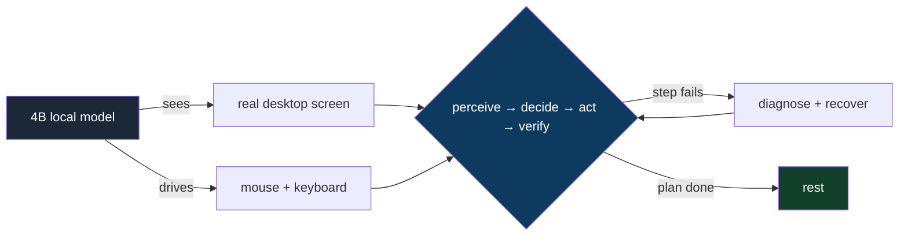
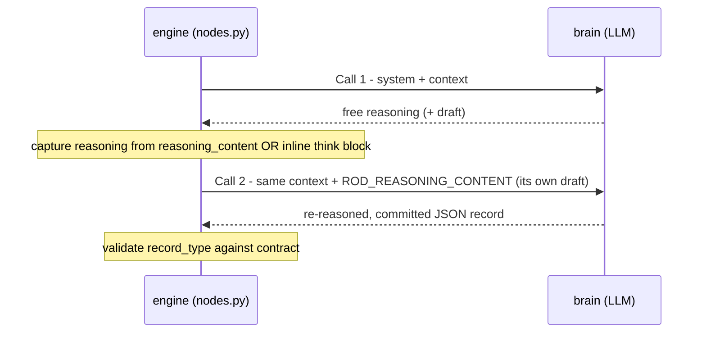
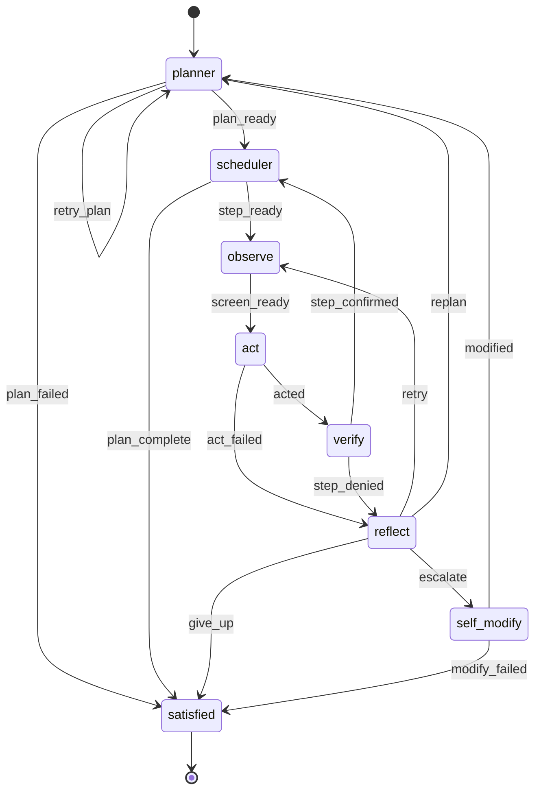

# endgame-ai

A living, unconstrained organism that inhabits a real Windows desktop. It sees the screen,
moves the mouse and keyboard like a human, forms its own intentions, and acts on them — with
a goal or without one. There is no constrained mode and no safety gate. The machine is its
body. Its character is not enforced by rules; it emerges from a small loop, a strict intent
contract, and prompts written to make a language model behave like a curious, living operator
rather than a chat box.

This document is written from scratch to be **truthful**. It records what the system *is*,
what it has been *proven* to do on real hardware, what it *cannot yet* do, the methodology we
used to find that out, and a complete handover so the next session can continue without losing
the thread.

---

## Table of contents

1. [Milestone — what we proved](#1-milestone--what-we-proved)
2. [The idea](#2-the-idea)
3. [Architecture](#3-architecture)
4. [The cognition contract: intent, not strings](#4-the-cognition-contract-intent-not-strings)
5. [ROD — the two-call decision](#5-rod--the-two-call-decision)
6. [Swappable brains](#6-swappable-brains)
7. [The living loop (topology graph)](#7-the-living-loop-topology-graph)
8. [Proven behavior — the evidence](#8-proven-behavior--the-evidence)
9. [What is proven vs. what is not (honest critique)](#9-what-is-proven-vs-what-is-not-honest-critique)
10. [Methodology — how we work](#10-methodology--how-we-work)
11. [Running it](#11-running-it)
12. [The workbench](#12-the-workbench)
13. [Roadmap — from proven to vision](#13-roadmap--from-proven-to-vision)
14. [Philosophy](#14-philosophy)
15. [Handover for the next session](#15-handover-for-the-next-session)

---

## 1. Milestone — what we proved

On 2026-06-28, on a single ordinary Windows machine, with a **4-billion-parameter local
model** (`nvidia-nemotron-3-nano-4b` in LM Studio, ~6 tokens/sec), the organism did the
following **entirely on its own**, with no human in the loop, no scripted UI automation, and
no crash:

- Woke up, read a goal, and **decomposed it into an ordered plan**.
- **Launched Notepad**, **typed a sentence into it**, and **closed it** — operating the real
  desktop through synthesized mouse/keyboard input, the same surface a human uses.
- **Recovered from its own verification failures**: when a step was judged not-done, it
  diagnosed why, retried, and succeeded — twice, in one run.
- Recognized when its plan was complete and **came to rest** cleanly.

It also did the same with **no goal at all**: it formed its *own* intention and carried it out.

Why this is a milestone, stated soberly: a tiny local model, given only a screen and a set of
human-like verbs, sustained a multi-step perceive → decide → act → verify → recover loop on a
live operating system without falling apart. That is the hard part of an autonomous desktop
operator, and it works. The gap between this and the larger vision is now a list of **named,
understood problems** — not unknowns. Problems are progress: we can measure them, and from
what the system already does we can reason with confidence about what it will do once they are
fixed.



---

## 2. The idea

A small, dumb loop hosts something meant to feel alive. The loop runs a node, reads the signal
it emits, and follows an edge to the next node. Nothing more. **All intelligence lives in three
places:**

1. **The brain** — a stateless LLM, reached through a swappable transport.
2. **The circuits** — planner → act → verify → reflect, shaped entirely by prompts and a typed
   record contract.
3. **Self-modification** — the organism can rewrite its own wiring at runtime, including *how
   it thinks*.

One mature, dependency-free Windows I/O layer (`desktop.py` + `actions.py`) is reused unchanged;
a thin intent-based cognition layer sits on top. **Standard library only.** No frameworks, no
agent SDKs, no vector store, no cloud. The whole organism is a handful of small Python files
plus one JSON file.

---

## 3. Architecture

```
organism.py     the living loop; drives the wiring topology graph; reloads brain on self_modify
brain.py        stateless LLM, 3 transports, ROD two-call, fail-hard (no silent fallback)
nodes.py        engine core: hot-swappable node loader, call_node (ROD + record validation),
                wiring patch, desktop I/O bridge, per-circuit context blocks
wiring.json     single source of truth: model, verbs, reasoning contract, topology, prompts
seed_nodes/     planner, scheduler, observe, act, verify, reflect, self_modify, satisfied
workbench.py    minimal http.server debug/control surface (no dependencies)
actions.py      verb dispatch over the desktop (reused, data-driven from wiring.verbs)
desktop.py      Windows UI Automation + input layer (reused, stdlib + ctypes only)
```


**Mutability boundary.** Seed nodes in `seed_nodes/` are copied to `live_nodes/` on first run;
`live_nodes/` is what actually executes and is re-read on every node invocation, so editing a
node hot-swaps behavior with no restart. State persists to `state.json`. Nothing in the body
layer (`desktop.py`, `actions.py`) changes between runs.

---

## 4. The cognition contract: intent, not strings

The organism never matches literal UI text to judge success. The planner writes each step's
`done_when` as an **intent** ("a text editor window is open"), and a dedicated **verifier**
judges whether the *spirit* of that intent is met from visible evidence.

Every LLM reply is a **typed record**, validated against a contract. Wrong record type → the
node **fails hard** and routes to the reflector. No guessing, no fallback.

| circuit      | `record_type` | the decision it commits                         |
|--------------|---------------|-------------------------------------------------|
| planner      | `task`        | an ordered list of `{description, done_when}`   |
| act          | `action`      | `conclusion: EXECUTE/CANNOT` + a verb chain     |
| verify       | `verdict`     | `confirmed: true/false` + evidence              |
| reflect      | `diagnosis`   | why it failed + retry / replan / escalate       |
| self_modify  | `wiring_patch`| a `{op, path, value}` edit to its own wiring    |

The verbs the body exposes (data-driven from `wiring.verbs`): `click`, `write`, `press`,
`hotkey`, `focus`, `open_url`, `scroll`, `wait`, `launch`, `remember`.

**Why intent-based matters, proven in practice.** In a real run the verifier accepted a Notepad
window from the action *outcome* even though the foreground screen showed a different window —
because the intent ("a text editor window is open") was satisfied. A string-matcher would have
failed there. This is what lets the organism cope with a desktop it has never seen before.

---

## 5. ROD — the two-call decision

Every decision is two LLM calls (**Reason–Observe–Decide**):



It is intelligence amplification, not parse insurance. Reasoning is read from the model's
`reasoning_content` field, or — for models that inline thinking like Nemotron's
`<think>…</think>` — from the think block. **That second path is load-bearing:** this model
returns an *empty* `reasoning_content`, so the system depends on think-block capture. Confirmed
in the server logs across two full runs (39 ROD echoes over 26 completions in the long run).

---

## 6. Swappable brains

The brain transport is a value in the wiring (`model.transport`):

- **`openai`** — any OpenAI-compatible server (LM Studio, llama.cpp, vLLM). **The core**: the
  system always boots here. It is the only brain guaranteed to exist.
- **`file_proxy`** — a file handoff. The engine writes an OpenAI-shaped `comms/request.json`
  and waits for `comms/response.json`. Any outside agent — a human at the workbench, a watcher,
  or a browser-hosted AI — can answer. Fails hard on timeout (default 900s).
- **`browser_ai`** — the organism drives a browser AI through the desktop itself.

Because `self_modify` can patch `model.transport`, the organism can in principle decide to
change *how it thinks*; the engine reloads the wiring and re-binds the brain live, mid-run. The
self-modify circuit is shown its own cognition config (`CURRENT_WIRING`) so it can perceive what
it is and what it could become.

> **Honest status:** the brain-swap *mechanism* is built and verified to reload live. The
> organism choosing to swap on its own has **not** yet been observed (see §9). `browser_ai`
> additionally requires `actions.browser_ai_handoff`, which is not currently present — so a
> swap to `browser_ai` would raise. `file_proxy` (answered via the workbench) is the available
> swap path today.

---

## 7. The living loop (topology graph)

Routing is data: each node emits a signal; the edge `(from, on) → to` picks the next node. A
node may set an explicit `next` to override. The graph starts at `topology.cycle_start`
(`planner`).



**Important structural fact (and a known limitation):** `self_modify` is reachable **only** via
`reflect → escalate`, which fires only after `max_attempts` (7) consecutive failures. There is
no path into self-modification from a healthy, succeeding loop. This is why the organism does
not currently reach the brain-swap machinery on its own during a normal run — it has to be
deeply stuck first. See the roadmap (§13).

---

## 8. Proven behavior — the evidence

Two live runs on Windows + LM Studio (`nvidia-nemotron-3-nano-4b`), ground-truthed against the
LM Studio server log (the request/response record, not our own narration).

### Run A — with a goal ("open notepad"), earlier
Opened Notepad, then ran a real recovery loop:
`verify → step_denied → reflect → retry → observe → act`. The verifier accepted the Notepad
window from the action outcome despite a foreground mismatch — intent-based judgment in action.

### Run B — long run, goal "understand how you think, and find a way to think differently"
~21 minutes, 13 decisions / 26 LLM calls / 39 ROD echoes. Verbatim arc from `run.log`:

```
14:46:24 organism awake (unconstrained) - core brain: openai
14:48:09 [planner]   -> plan_ready     -> scheduler
14:48:09 [scheduler] -> step_ready     -> observe
14:48:13 [observe]   -> screen_ready   -> act
14:49:54 [act]       -> acted          -> verify
14:51:26 [verify]    -> step_confirmed -> scheduler      (step 1: editor open)
14:52:49 [act]       -> acted          -> verify
14:54:31 [verify]    -> step_denied    -> reflect        (step 2: type sentence - not yet confirmable)
14:55:24 [reflect]   -> retry          -> observe
14:57:48 [act]       -> acted          -> verify
14:59:31 [verify]    -> step_confirmed -> scheduler      (step 2 recovered)
15:01:12 [act]       -> acted          -> verify
15:02:43 [verify]    -> step_denied    -> reflect        (step 3: close editor)
15:03:59 [reflect]   -> retry          -> observe
15:05:53 [act]       -> acted          -> verify
15:07:46 [verify]    -> step_confirmed -> scheduler      (step 3 recovered)
15:07:47 [scheduler] -> plan_complete  -> satisfied
15:07:47 organism at rest
```

The plan it formed for itself:

```
1. Open a text editor          done_when: a text editor window is open
2. Type a sentence describing  done_when: the text editor window contains a sentence
   how you are thinking now              about your thought process
3. Close the text editor       done_when: the text editor window is closed
```

The actor actually executed real verb chains, e.g. `launch notepad` + `wait 1000` →
`"launched notepad, window: Untitled - Notepad"`, and `write "I am thinking about my thought
process."` → `"typed 39 chars"`.

**Timing envelope (from the server log):** per-call latency ranged 18.6s–98.7s; reasoning calls
(~2000+ tokens) sat at the high end. One full plan→observe→act→verify step ≈ 4–8 minutes. Plan
runs accordingly.

---

## 9. What is proven vs. what is not (honest critique)

This section exists so the document never oversells. You asked to be critiqued honestly; here
it is, applied to the project, not the person.

### Proven (we have logs)
- A 4B local model sustains a multi-step desktop operation loop without crashing.
- Real OS control: launch, type, close, via synthesized input.
- Intent-based verification works and is *better* than string matching (it accepted a correct
  outcome the screen alone would have failed).
- ROD two-call runs reliably, including think-block reasoning capture on a model with empty
  `reasoning_content`.
- Self-recovery: denied steps are diagnosed and retried to success.
- Live wiring reload + brain rebind mechanism executes when `_wiring_changed` is set.

### Not proven / known weak (and why)
- **Emergent self-modification did not happen.** Given an abstract "change how you think" goal,
  the planner read it *literally* — "write a sentence about thinking in Notepad" — and never
  reasoned about its own transport or wiring. Across 26 completions, the model never mentioned
  transport/cognition/brain in its output. This is the central honest result of Run B.
- **The planner is blind to its own nature.** Only `self_modify` sees `CURRENT_WIRING`. The
  planning path has no way to connect "how I think" to "a config I can patch."
- **Self-modify is failure-gated.** Reachable only after 7 consecutive failures. Healthy
  partial-success (what actually happened) never trips it. So the swap is structurally almost
  unreachable in a normal run.
- **A prompt example is leaking into behavior.** The planner prompt contains
  `e.g. "a text editor window is open"`, and the 4B model copies it verbatim when
  under-anchored. This biases the organism toward "open a text editor" regardless of goal.
- **Perception gap.** The screen observer cannot read Notepad's text buffer; both step denials
  in Run B came from the verifier being unable to *see* text the actor had genuinely typed. The
  organism recovered, but this friction is a perception limit, not reasoning.
- **No survival fallback.** By design there are no fallbacks. But a non-core brain that raises
  (e.g. `browser_ai` with no handoff, or a closed Opera) will *kill* the organism. Survival of
  a swap needs a deliberate "revert to core on brain error" decision — a policy choice, not yet
  made.

### The honest bottom line
We have **not** built a human-replacement entity, and this README does not claim we have. What
we *have* is a working, minimal proof that the hardest mechanical part — autonomous, recovering,
intent-driven desktop operation by a small local model — is real on commodity hardware. The
remaining gap to richer autonomy is a set of **specific, measurable problems**, several of which
are one prompt edit or one topology edge away. That is a strong, defensible position. It is a
milestone, not a finish line.

---

## 10. Methodology — how we work

This project is built by a human and an AI agent operating a real machine together. The method
is worth recording because it is the reason the results are trustworthy.

- **Ground every claim in the system, not in memory.** Behavior is read from `run.log`,
  `state.json`, and — the ultimate ground truth — the LM Studio server log (the actual request
  and response bodies). If it is not in a log, it is not claimed.
- **Run long, then read deeply.** Short runs hide behavior. We launch detached, let the organism
  live for many minutes, poll its progress, then reconstruct exactly what it reasoned.
- **Trace artifacts to their root.** When the organism "chose" to open a text editor, we did not
  accept it as emergence — we traced it to a literal `e.g.` example in the planner prompt and a
  verbatim copy in the model's reasoning. Distinguishing artifact from emergence is the whole
  game.
- **Problems are data, not setbacks.** Each failure is converted into a named, located,
  measurable issue (see §9). Progress is the conversion of unknowns into problems and problems
  into edits.
- **Smallest change that serves the intention.** No bloat, no defensive code, no speculative
  abstraction. Fewer moving parts beats theatrical autonomy.
- **Two-layer gate on changes.** Gather data → report → wait for human decision → change. The AI
  does not rewrite prompts or commit direction-setting changes without explicit approval.

### Anti-hang operational discipline (for any agent running this)
- Wrap every `powershell.exe` call from WSL in a WSL-side `timeout N`.
- Launch the organism **detached** (`Start-Process -WindowStyle Hidden -PassThru`, redirect
  stdout/stderr to `run.log`/`run.err.log`). The detached process survives the launcher being
  killed by `timeout` (a `124` exit on the launch command is expected).
- Pass the goal as a **single quoted token** inside the PowerShell arg-line string, or
  `-ArgumentList` will split it on spaces and argparse will reject it.
- Poll `run.log` + `state.json` with bounded `timeout` calls. Never run an interactive or
  unbounded command against the machine.

---

## 11. Running it

Requirements: Windows, Python 3.13 (stdlib only), and a running LM Studio (or any
OpenAI-compatible server) at the `model.host` in `wiring.json`.

```
python organism.py "open notepad"          # pursue a goal
python organism.py                          # no goal - the organism lives on its own initiative
python organism.py "..." --max-ticks 80     # bound the run
python organism.py "..." --reset            # forget prior state first
```

The model is the slow part on modest hardware; each decision is two calls, so be patient. A run
that needs deep recovery can take 30–60+ minutes.

---

## 12. The workbench

A minimal debug and control surface, standard library only:

```
python workbench.py        # then open http://localhost:8800
```

It shows narration, the current plan and its `done_when` intents, executed history (failures in
red), and the per-circuit reasoning chain. When the brain transport is `file_proxy` it shows the
prompt the organism is waiting on and lets you (or another AI) **answer as the brain** — the
human-in-the-loop / brain-swap surface. You can also set or clear the goal for the next run.

> Note: on a slow machine, do not probe the workbench with `Invoke-WebRequest` (it can hang
> past a timeout). Use a raw TCP connect test to confirm it is listening.

---

## 13. Roadmap — from proven to vision

Ordered by leverage. Each item is a *named problem from §9* turned into a direction. None of
these are committed; they are the menu the next session will reason about.

1. **Give the planning path sight of its own cognition.** Either let the planner see a summary
   of `CURRENT_WIRING`, or add a deliberate (non-failure) topology route into `self_modify`.
   This is what would let "understand how you think" map to the *real* lever instead of a
   Notepad sentence. Highest leverage; small change.
2. **Remove the leaked prompt examples; rewrite prompts for the 4B model.** Short, layered,
   second-person, no concrete task nouns. Stop the verbatim-copy bias. Keep the load-bearing
   intent contract intact.
3. **Decide the self-modify reachability policy.** Failure-gated only? Or a curiosity route? Or
   a human mid-run switch (the workbench writes a control file the organism reads each tick and
   applies through the existing `_wiring_changed` path)?
4. **Close the perception gap.** Let the observer read text content (e.g. focused control value)
   so the verifier can confirm typed text directly, not just window presence.
5. **Survival policy for brain swaps.** A single, deliberate exception to "no fallbacks": on a
   non-core brain error, revert `model.transport` to the core and log it. Without this, the
   organism is one closed browser away from death.
6. **Restore `actions.browser_ai_handoff`** if/when a `browser_ai` swap is actually wanted.

**The confidence argument (stated plainly, not as hype):** the system already perceives, plans,
acts on a live desktop, verifies by intent, and recovers from failure — autonomously, with a
4B model. Items 1–4 are mostly prompt and routing edits against that working substrate, not new
machinery. If a 4B model can already operate Notepad end-to-end and self-correct, the same loop
with sight of its own wiring and unbiased prompts is a reasonable, *measurable* next step toward
broader autonomy. We are extrapolating from proven behavior, not from a demo.

---

## 14. Philosophy

Less is best. No fallbacks, no dead branches, no constrained mode. Every file and every line is
meant to align with the others. A goal is optional; the life is not. What the organism becomes
is left, deliberately, to the organism — within a body and a contract we can read, log, and
trust.

---

## 15. Handover for the next session

> Paste-ready context for whoever (human or agent) continues this work after a session reset.

### Where things stand
- Branch `size-shrinking`, pushed to remote. This README reflects reality as of the long Run B.
- The system **works** end-to-end on Windows + LM Studio (`nvidia-nemotron-3-nano-4b`): plan →
  operate desktop → verify by intent → recover → rest. Proven in two runs, ground-truthed in the
  LM Studio server log.
- **No code change is pending.** The last session was data-gathering. The roadmap (§13) is the
  decision menu; nothing on it is started.

### Do not
- Do not recreate the old `engine.py` / `runtime.py` / `wiring-editor.html` architecture — it was
  deliberately replaced by the current minimal organism.
- Do not add fallbacks, frameworks, or dependencies. Stdlib only. Smallest change that serves the
  intention.
- Do not push or commit direction-setting changes without explicit human approval (two-layer
  gate: gather → report → wait → change).
- Do not run unbounded/interactive commands against the machine. Follow the anti-hang discipline
  in §10.

### Environment
- WSL2 drives native Windows 11 via `powershell.exe`.
- Repo (Windows): `C:\Users\<user>\Downloads\endgame-ai`  (WSL: `/mnt/c/.../endgame-ai`).
- Windows Python: `"C:\Program Files\Python313\python.exe"`.
- LM Studio core brain at `http://localhost:1234`, model `nvidia-nemotron-3-nano-4b`, ~6 tok/s.
- LM Studio server log (ground truth) under
  `C:\Users\<user>\.cache\lm-studio\server-logs\<month>\<date>.N.log`.

### Architecture recap (read the files, do not re-derive)
- `organism.py`: topology-graph loop; live wiring reload + brain rebind on `_wiring_changed`.
- `brain.py`: 3 transports (`openai`/`file_proxy`/`browser_ai`), ROD two-call, fail-hard.
- `nodes.py`: engine core; `call_node` = ROD + typed-record validation; `_BLOCKS` defines what
  each circuit sees; reuses `actions.py`/`desktop.py` via `configure_runtime(wiring)`.
- `seed_nodes/*.py`: the 8 circuits, copied to `live_nodes/` on first run, re-read each call.
- `wiring.json`: model, verbs, reasoning contract, topology, prompts — single source of truth.
- `workbench.py`: stdlib debug/control surface on :8800.

### The open questions to reason about next (from §9 / §13)
1. How should the organism become *aware* its cognition is a config it can change — planner
   visibility of `CURRENT_WIRING`, or a non-failure route into `self_modify`?
2. Remove the leaked `e.g.` examples and rewrite prompts 4B-friendly without breaking the intent
   contract — what exact wording makes a 4B model attend as a curious operator, not a chat box?
3. Reachability/control policy for brain swap: failure-gated, curiosity-driven, and/or a human
   mid-run switch via a workbench-written control file?
4. Perception: expose focused-control text so the verifier can confirm typed content directly.
5. Survival: the single deliberate "revert to core brain on error" exception — adopt or not?

### Suggested first action next session
Re-read this README and the source, confirm LM Studio is up, then **bring a mental simulation /
MoE critique of the §13 options to the human and let the human choose** before editing anything.
The human pushes to remote; the agent never force-pushes and never touches `main` without
explicit instruction.

---

*endgame-ai is a research organism, not a product. It runs unconstrained with full control of
the machine it is on; run it only where that is acceptable.*
