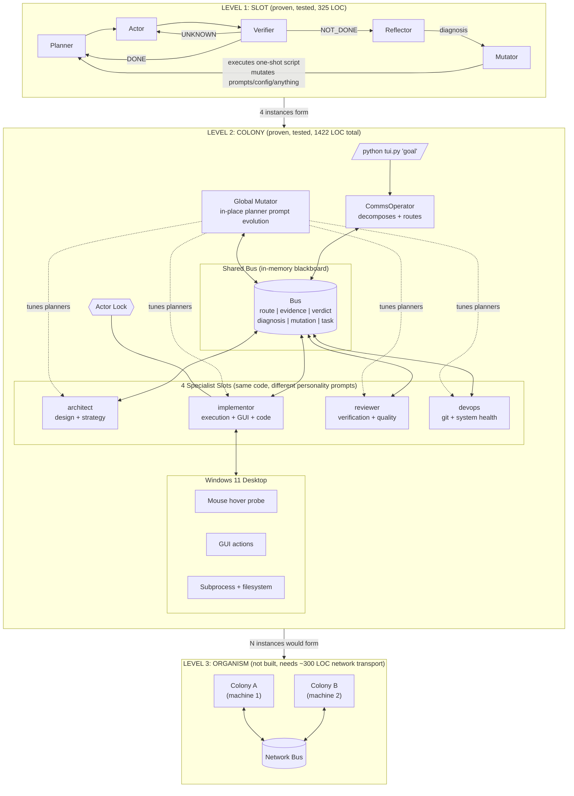
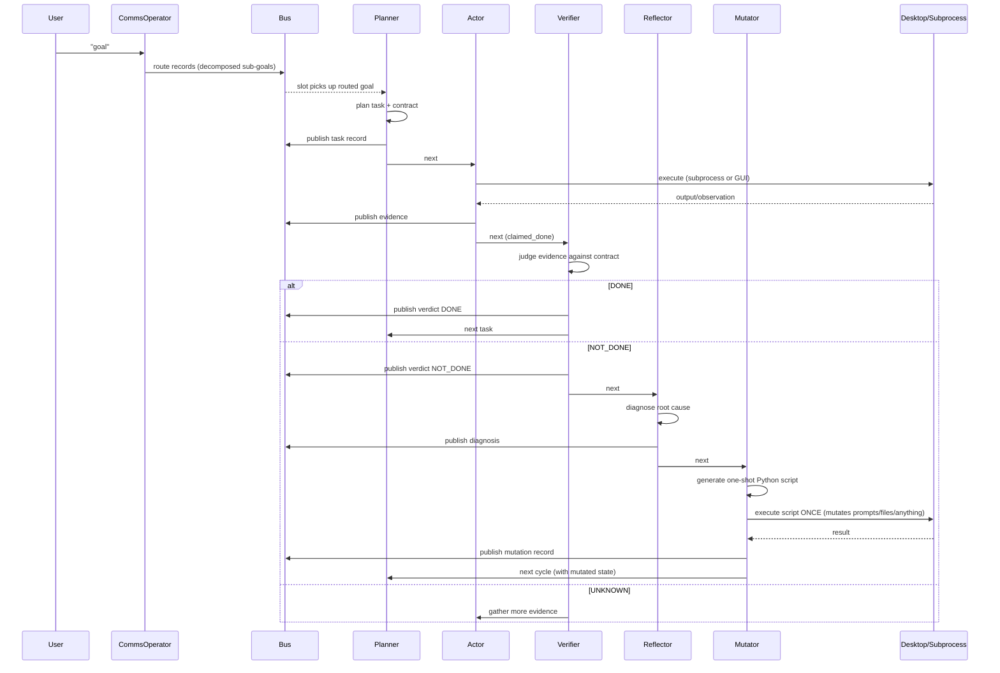
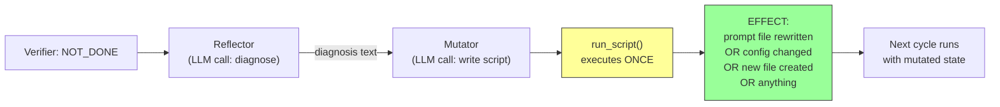

# endgame-ai

## System Levels



## Execution Flow



## Mutation Mechanism



## How to Run

```powershell
python tui.py "your goal"
```

One command. The system decides complexity. The user never manages slots or routing.

| Flag | Purpose |
|------|---------|
| `--host url` | LM Studio address (default: http://localhost:1234) |
| `--no-desktop` | Skip screen observation for pure subprocess tasks |
| `--workspace path` | Working directory |
| `--bus-file path` | Persist bus records to disk |

| Runtime Key | Action |
|-------------|--------|
| Enter | Send new goal |
| 1-4 | Toggle slot on/off |
| q | Quit |

## Governance Model

```
CODE:     permits everything (no restrictions, no guards, no permission checks)
PROMPTS:  instruct who does what (soft governance, not enforcement)
BUS:      records what happened (observability, feedback)
VERIFIER: judges outcomes (correction signal)
CYCLE CAP: 5 attempts then abandon (emergency brake, only hard limit)
```

The system is **unsecured by design**. The mutator can rewrite any file, execute any command, modify any prompt. This is the self-evolution mechanism. Any restriction in code would create a dead zone in the adaptation space.

The prompts tell the local mutator to tune actor/verifier only. The global mutator tunes planners. But nothing in code enforces this. If the local mutator touches the planner, the next cycle's verifier will show whether that helped or hurt. Bad mutations self-correct through the feedback loop.

## What Differentiates Slots

All slots run the same `Slot` class. They differ by:

1. **Personality prompt** — loaded from `prompts/personalities/{name}.txt` or `prompts/{name}/personality.txt`
2. **Routed goal** — CommsOperator sends different sub-goals to different slots
3. **can_act_desktop** — only implementor touches the GUI (others use subprocess)

The LLM behaves differently because the personality prompt tells it what it specializes in. The code is identical. This means any slot can evolve into any role if the mutator rewrites its personality prompt.

## Files (1422 LOC)

```
endgame-ai/
  tui.py        (225 LOC)  Entry point + display + keyboard
  colony.py     (175 LOC)  CommsOperator + GlobalMutator + orchestration
  slot.py       (325 LOC)  Planner + Actor + Verifier + Reflector + Mutator
  desktop.py    (428 LOC)  Screen observation + GUI actions
  llm.py        (112 LOC)  LM Studio HTTP client
  actions.py    ( 82 LOC)  Verb executor
  bus.py        ( 75 LOC)  Shared blackboard
  prompts/                  Mutable role prompts (governance layer)
    planner.txt
    actor.txt
    verifier.txt
    reflector.txt
    mutator.txt
```

No external dependencies. Python 3.12+ stdlib only.

## LLM: Nemotron 4B

- ~30-60s per response. One cycle = 2-4 LLM calls.
- Frequently returns malformed JSON. Handled by regex fallback parsing.
- Limited context. Prompts kept short. History capped at 6 entries.
- Will make mistakes. That is expected. The reflector/mutator loop exists because of this.
- Temperature 0.12 (low creativity, high consistency).

## Requirements

- Windows 11
- Python 3.12+
- LM Studio running with any model loaded

---

## HANDOVER FOR AI CONTINUATION

If you are an AI coding tool continuing work on this project, read this section.

### Identity

`endgame-ai` — a self-evolving agentic runtime. 1422 LOC Python. Zero dependencies. Operates Windows 11 desktop autonomously. Runs on small local models (Nemotron 4B).

### Architecture Rules

1. **OOP with injection.** No globals, no singletons, no env vars.
2. **Bus is the only IPC.** Slots never call each other. All through bus records.
3. **Single process.** No subprocesses for slots. No reactor. No file IPC.
4. **No code-level constraints.** Governance is via prompts, not enforcement.
5. **Prompts are mutable at runtime.** Mutator can rewrite them. That's the mechanism.
6. **Cycle cap = 5.** Only hard safety net. Never remove.
7. **Verifier never trusts actor.** Requires independent evidence. Never shortcut this.
8. **Colony is composable.** Takes (llm, bus, prompts_dir, workspace). Can be instantiated N times.
9. **Mutation is one-shot.** Mutator writes a script, it runs once, it's done. Not a loop.
10. **Reflector diagnoses, Mutator prescribes.** Two LLM calls, two concerns.

### File Responsibilities

| File | Does | Does NOT |
|------|------|----------|
| `bus.py` | Store/query records | Enforce permissions |
| `slot.py` | Run the P→A→V→R→M loop | Decide which slot gets what goal |
| `colony.py` | Route goals, manage slots | Execute tasks |
| `tui.py` | Display + input + orchestrate | Business logic |
| `desktop.py` | Observe screen + act on GUI | Decide what to click |
| `llm.py` | HTTP to LM Studio | Parse domain logic |
| `actions.py` | Execute verbs on elements | Decide which verb |

### Testing Without LM Studio

```python
from slot import Slot
from bus import Bus
from llm import LLMResult

class MockLLM:
    def __init__(self, responses):
        self._r = list(responses); self._i = 0
    def call(self, system, user, **kw):
        if self._i < len(self._r):
            r = self._r[self._i]; self._i += 1; return r
        return LLMResult(text='')

bus = Bus()
slot = Slot(name="test", llm=MockLLM([...]), bus=bus, prompts_dir=..., workspace=...)
slot.set_goal("test")
result = slot.step()
```

### The System Will Error

Errors are input to self-correction. Do not prevent all errors. Ensure:
1. Errors are caught (try/except in LLM-facing code)
2. Errors produce bus records (so reflector/mutator can read them)
3. Cycle cap triggers (so loops terminate)
4. Planner receives failure history (so it replans differently)

**Correct behavior: plan → fail → reflect → mutate → retry differently → succeed.**
