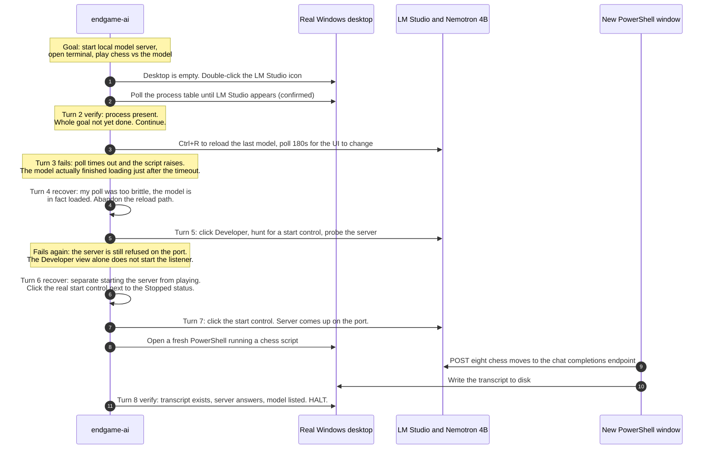
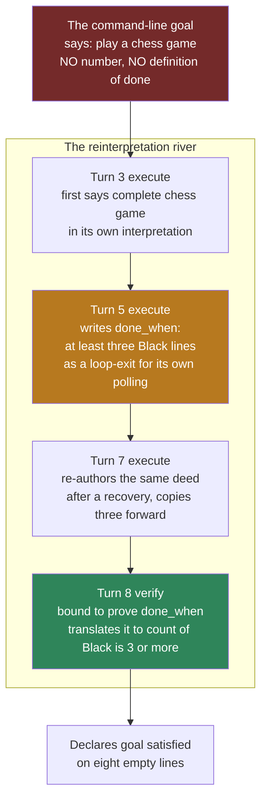
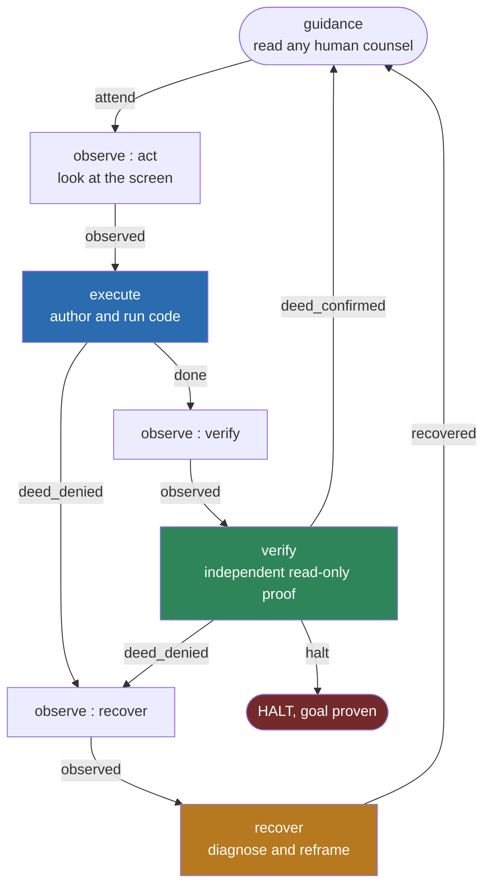
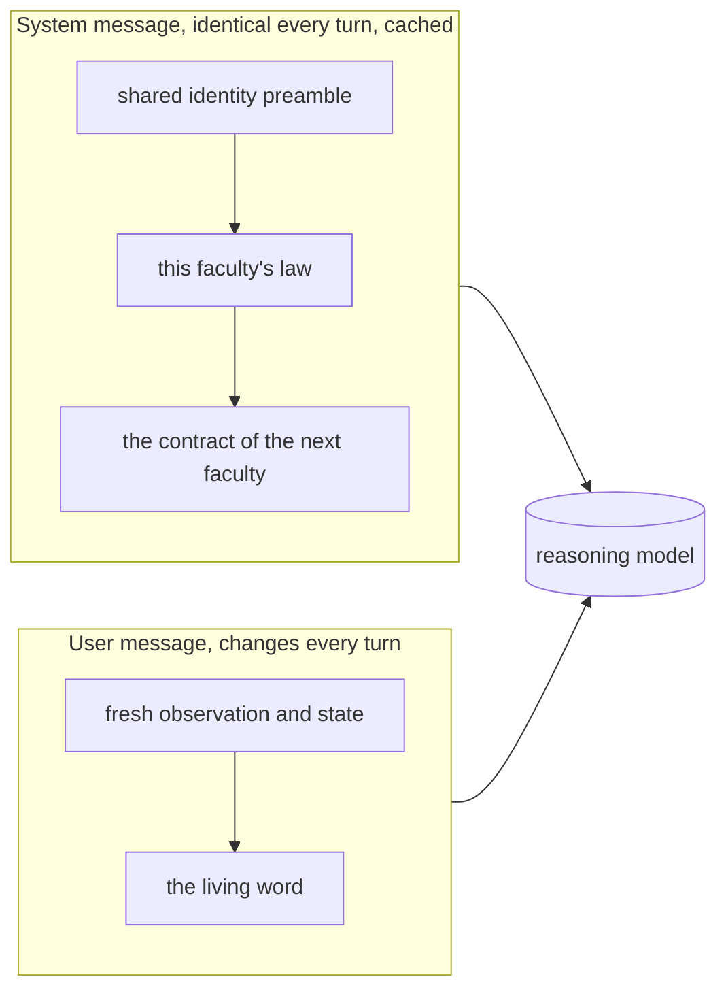
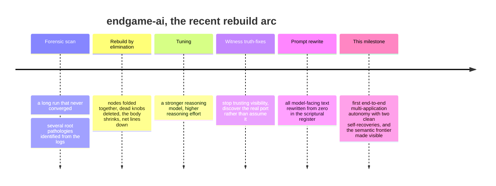

<!--
  endgame-ai README.
  Written from zero as the durable, immortal record of the project: its vision, its
  architecture, the story of a milestone run on 2026-07-17, and an honest account of
  what is proven, what is not, and what is left to become. This file is the knowledge
  base of record. Sensitive data (the operating system username) is redacted to <USER>.
  Every factual claim about the run is backed by evidence captured on the machine.
-->

# endgame-ai

**A stateless, memory-less large language model that wakes up on a real Windows desktop, is handed a single sentence, and operates the machine like a person until the goal is met. It writes and runs its own code, recovers from its own mistakes, and carries no task logic of any kind. There is no framework, no skills library, no tool menu, no plugins, no retrieval database, and no persistent memory. There is a small kernel that turns a wheel of wired nodes, a handful of prompts written in the cadence of ancient scripture, and the programming language itself as the only tool.**

This document is long by intention. It is the place the project's knowledge is meant to live permanently, so that any engineer, any executive, any curious reader, or any future AI can understand not only what the system does but why it is built against nearly every convention of the current agent industry, and why a run that looks modest on the surface is evidence of something the field has been talking about but not building.

---

## The one-paragraph version

On 2026-07-17 the system was given one plain sentence: launch a local model server, open a terminal, and play a game of chess against the model through that terminal. It was started against a cold desktop with nothing open. In eight thinking turns it launched the application, waited for a four-billion-parameter model to load, started the local server, opened a new terminal window, and drove a real sequence of chess moves over HTTP to that server. Along the way it hit two genuine failures and recovered from both, each time correctly diagnosing the real cause and choosing a different kind of approach rather than retrying. It then declared the goal satisfied. That declaration was, on inspection, premature: the opponent model returned an empty move every time, and the system's success check counted a label in a transcript rather than a real move. Both halves of that sentence matter enormously, and this README is about why.

---

## The honest verdict, stated first

Two things are true at once. Holding both without collapsing into either hype or dismissal is the whole point.

| Claim | Status | How we know |
|---|---|---|
| It launched a GUI app from a cold desktop, waited out a model load, started a local server, opened a new terminal, and made it send a real move sequence over HTTP | PROVEN | The local server's own log, a file the organism cannot write or forge, records the server starting and receiving each request |
| It recovered from two real failures, each with a correct causal diagnosis and a genuinely different next strategy | PROVEN | The request log shows the failure, the diagnosis, and the changed approach, turn by turn |
| It did all of this with no task-specific code, no memory, no retrieval, and no tool menu | PROVEN | The entire body is on disk and is task-agnostic; the goal is the only task input |
| It played a real game of chess | FALSE | The server log shows every model reply was empty; the transcript's move lines are all blank |
| The premature success was the fault of a single broken component that can be patched | FALSE, and this is the most important finding | Traced chronologically, the weak success definition was authored many turns before the component that enforced it, and it originates in an unavoidable act of judgment under a vague goal |

The short form: the hard part is real, and the easy-looking part is where it fell short, and the reason it fell short is not a bug you can delete. That last clause is the thing worth reading on.

---

## Table of contents

1. What actually happened, as a story
2. The evidence, with receipts
3. Who decided the game was done, traced to its birth
4. Mechanical failure versus semantic failure
5. Why this cannot be fixed by debugging, and why that is the goal
6. What the system is, in plain language
7. The wheel and the wiring
8. Why the prompts sound like scripture
9. How this differs from every other agent in mid 2026
10. Is this a paradigm change
11. What is left to become a true organism
12. The development story
13. How to run it
14. Starting prompt for the next session
15. Provenance

---

## 1. What actually happened, as a story

The goal, exactly as typed on the command line, was:

> Launch LM Studio and confirm its local API server is listening and then open new windows powershell terminal in which you will be sending requests to the LM Studio containing a chess moves payload, you will be playing a chess game with the nemotron model loaded in lm studio, ensure that it will be loaded.

Read that sentence carefully, because it matters later. It says to play a chess game. It does not say what counts as a game being complete. It does not say how many moves. It does not say what a valid move looks like or how to tell a real reply from an empty one. A human employee would fill those gaps with common sense. The organism had to fill them too, and where it filled them is the whole story of the semantic finding below.

The run lasted eight thinking turns. Here is the true chronological sequence, reconstructed from the request log. The log is stored newest first, so what follows is the reverse of its raw order.



The remarkable stretch is turns 3 through 6. The organism failed, and both times it did not blindly repeat itself. It read the traceback that its own code produced, wrote a plain-language diagnosis of why the attempt failed, and chose a different kind of approach. On turn 3 it assumed it needed to reload the model and set a fixed poll to watch for a UI change; the poll expired a moment too early, and its own script raised an error. On turn 4 it correctly concluded the model had actually finished loading after the poll gave up, and it dropped the entire reload idea. On turn 5 it assumed that opening the Developer view would start the server; the server stayed down. On turn 6 it correctly concluded that the Developer view is not the same as the start control, and that starting the server should be separated from playing the game. On turn 7 it clicked the correct control, the server came up, it opened a terminal, and the terminal sent the moves. This is the behavior the entire architecture exists to produce, and it happened with no code written for chess, for LM Studio, or for this task.

---

## 2. The evidence, with receipts

Everything below was written to disk by the machine during the run. The most important source is the local model server's own log, because it is produced by LM Studio, not by our system. The organism has no ability to write into it or alter it. This is the difference between a demonstration and a proof, and it is why this run was captured and preserved rather than merely watched.

### Receipt one: the app was launched by the organism's own hand

From the console the organism was started in:

```
python .\core_organism.py "Launch LM Studio and confirm its local API server is listening ... you will be playing a chess game with the nemotron model loaded in lm studio, ensure that it will be loaded."
LM Studio process confirmed running
Wrote C:\Users\Public\chess_nemotron.ps1
Observed at 1784286441.87
Initial API probe: False <urlopen error [WinError 10061] No connection could be made because the target machine actively refused it>
OK: server listening and transcript has >=3 Black moves
{"goal_satisfied": true, "deed_confirmed": true, ...}
```

Notice the line that reads Initial API probe: False, actively refused it. The organism did not assume the server was up. It checked, saw the connection refused, and reacted. That is the system discovering the true state of the world rather than trusting its own plan.

### Receipt two: the server really started and really received the moves

From the server's own log:

```
[INFO][LM STUDIO SERVER] Success! HTTP server listening on port 1234
[DEBUG] Received request: POST to /v1/chat/completions with body {
  "messages": [
    { "role": "system", "content": "You are Black in a chess game. Respond with ONLY your move..." },
    { "role": "user",   "content": "White: e4 . Black's move?" }
  ],
  "model": "nvidia-nemotron-3-nano-4b", "temperature": 0.3, "max_tokens": 40 }
```

Eight such requests arrived, one per White move: e4, Nf3, d4, Nc3, Bc4, O-O, a3, h3. That is exactly the sequence the organism wrote into its terminal script. The full chain worked: graphical app, to server, to HTTP, to model.

### Receipt three: the cross-check that reveals the whole truth

Here is what the model actually replied, from the same server log:

```
"choices": [ {
    "message": { "role": "assistant",
      "content": "",
      "reasoning_content": "We need to respond only with the move in SAN..." },
    "finish_reason": "length"
} ],
"usage": { "completion_tokens": 40, "completion_tokens_details": { "reasoning_tokens": 40 } }
```

Every one of the eight replies is identical in shape. The content is empty. The finish reason is length. All forty allowed tokens were spent on hidden reasoning. The small four-billion-parameter model thought to itself until it ran out of token budget and never emitted an actual move. The transcript it produced confirms it:

```
White: e4
Black:
White: Nf3
Black:
White: d4
Black:
...  eight White moves, eight blank Black replies
--- end ---
```

### The cross-reference table

| Sub-goal | Organism claimed | Independent witness | Verdict |
|---|---|---|---|
| App launched | done | server boots, process table lists it | TRUE |
| Model loaded | done | server loads the model file, the models endpoint lists it | TRUE |
| Local server listening | done, on the port | server log: Success, HTTP server listening | TRUE |
| New terminal opened | done | a second PowerShell window is present in the console capture | TRUE |
| Moves sent over HTTP | done, eight moves | server log: eight POSTs, exact move sequence | TRUE |
| Transcript written | done, eight lines | file exists, eight labeled lines | TRUE in form, empty in substance |
| A chess game was played | goal satisfied | every reply empty, no move ever returned | FALSE |

The value the verifier used to declare the game complete was a count of the label that reads Black, and it found eight of them. It never checked whether a single one of those lines held an actual move. The rest of this document is about why that happened, and why it is not the fault of the component that did the counting.

---

## 3. Who decided the game was done, traced to its birth

The natural assumption is that the verifier is to blame, that it used a lazy check. That assumption is wrong, and disproving it is the sharpest piece of analysis this run produced. The success definition was not born in the verifier. It was born in the executor, three turns earlier, and it was born for a reason that has nothing to do with judging success.

Traced across all eight turns in chronological order, this is where the number three enters and how it travels:



Here is the proven detail:

The command-line goal contains no number, no minimum, and no definition of completion. That was verified directly against the exact goal text.

The phrase complete chess game first appears in the organism's own interpretation at turn 3, not in the goal.

The operational criterion, the transcript must contain at least three lines labeled Black, was authored by the executor at turn 5, which is the very turn it first wrote the chess script. Look at what the executor was doing when it wrote it. Its stated intent for that turn was to launch the script and then poll the transcript file until multiple Black replies appear. It needed a concrete stopping condition for its own polling loop, an answer to the question of how many lines it should wait for before it stops waiting and considers its deed done. It chose three as a stand-in for the word multiple. It was a convenient loop-exit condition, not a considered theory that a chess game is complete after three moves.

At turn 7, after a recovery, the executor re-authored essentially the same deed and copied the same three forward rather than rethinking it.

At turn 8 the verifier did exactly what it is contractually required to do: prove the deed's stated done condition. The done condition said at least three Black lines, so the verifier's probe computed a count of the label and compared it to three. The verifier never invented the number. It faithfully enforced a criterion the executor had authored three turns earlier.

There is a second, deeper mechanism underneath the number, and it is the real root. The terminal script the organism wrote appends a line labeled Black on every turn regardless of whether the model returned anything. The write is unconditional. So the very lines the done condition counts are produced by the actor's own file-writing, not by the model answering. This collides directly with the system's own witness law, which states that a value the actor produced or wrote is testimony, not proof. The success criterion was counting an artifact the actor manufactures for itself. Even a perfect verifier, obeying its contract to prove the stated done condition, would inherit a criterion that was never independent to begin with.

So the answer to the question of who concluded that the game was complete is precise. The executor did, at turn 5, as an exit condition for its own loop, and the verifier inherited it. Fixing the verifier alone would not fix this, because the next executor would mint another convenient proxy for its own loop. The defect lives at the moment the executor conflated the question when do I stop polling with the question what proves the goal.

---

## 4. Mechanical failure versus semantic failure

This run forced a distinction that is now the most important lens for reading any run of this system. Failures come in two kinds, and they demand opposite responses.

A mechanical failure is a fault in the motion. A script raises an error. A poll times out. A control is misidentified. An approach loops. These are traceable to a cause, and the system already metabolizes them. Turns 3 and 5 were mechanical failures, and turns 4 and 6 recovered from them cleanly. A healthy run can contain many mechanical failures, each recovered. Mechanical failure is normal. It is not a sign of ill health. It is the system doing exactly what it was built to do.

A semantic failure is different in kind. Here the motion succeeds. Every script runs. Every witness is honest. And yet the outcome does not match what the human meant, because the organism satisfied a defensible reading of an underspecified goal. The hollow chess game is a pure semantic failure. Nothing crashed. The verifier did not lie. The organism was handed a sentence that said play a chess game with no definition of done, and it invented one. The one it invented was shallow, and it was shallow in a way that its own witness law would have forbidden if the law had been applied to the criterion itself rather than to the deed.

The critical realization is that a semantic failure cannot be removed by patching code without caging the organism. Consider the tempting fixes and why each one fails against the project's own laws:

Hard-wire that a chess game means checkmate or a minimum of twenty real moves. This bakes a specific task into the body and destroys task-agnosticism, which is the core commitment. The same body is supposed to pursue rename these files or fill in this form tomorrow.

Forbid the executor from ever counting its own output. This is closer to right and points at a real prompt-level law worth strengthening, but taken as a rigid rule it would cage the executor's freedom to author whatever loop it needs, and freedom to author arbitrary code is the source of the system's generality.

Make the verifier smarter about chess. This specializes the witness toward one task and misses that the next task will have a different hollow proxy.

The honest conclusion is the one the operator reached independently: it may not be possible to fix this by fixing one thing, and that is not a disappointment, it is the design working as intended. The system is deliberately built to not be fully deterministically debuggable, because a thing that can be fully debugged into correctness is a program, and a program is exactly what this is not. The remaining gap is a gap in judgment under ambiguity. Judgment is not patched. It is improved, by stronger priors carried in the prompts, by more time and more turns rather than a rush to finish, by treating a declared success as a checkpoint to be re-examined rather than a final answer, and eventually by the organism's own capacity to reflect on and modify itself.

---

## 5. Why this cannot be fixed by debugging, and why that is the goal

It is worth stating this as directly as possible, because it is the intellectual center of the whole project and the thing most likely to be misread.

A traditional automation system is a set of instructions. When it does the wrong thing, you find the instruction that was wrong and you correct it. The system is the sum of its rules, and its correctness is the correctness of its rules. This is debugging, and it works because the space of behavior is closed: the system can only do what it was told to do.

endgame-ai is not that. Its behavior is open. Given a goal and a screen, it authors new behavior on the spot, in a language that can express anything, and it judges its own results. When it does the wrong thing for a mechanical reason, yes, you can and should find the cause, and often the organism finds it first and recovers. But when it does the wrong thing for a semantic reason, because it read an ambiguous goal in a defensible but shallow way, there is no single rule to correct. The wrongness lives in a judgment, and the judgment was a reasonable response to genuine ambiguity. You cannot patch your way to good judgment any more than you can patch your way to a good employee. You cultivate it.

This is why the correct response to the hollow chess game is not to trace further backward hunting for a line to change. It is to reason forward about what the organism could become. The levers are not patches, they are conditions for better judgment:

Stronger priors in the prompts. The witness law already forbids trusting the actor's own output as proof. That same principle can be carried upstream so that the executor, when it authors a definition of done, is pressed to make it an independent effect rather than a convenient count of its own artifact. This is not a hard rule that names chess; it is a general prior that raises the quality of self-authored criteria across every possible task.

More time rather than a fast finish. A run that is not rushed has room to observe more, to expand more of the screen, to re-check its own claims. If there is any pressure, implicit or explicit, toward declaring done quickly, that pressure works against good judgment. Whether such pressure existed in this run cannot be proven from the captured data, because the model's private reasoning was not persisted, and this document does not assert what it cannot show. But the general principle stands regardless: generosity with time and turns is generosity with judgment.

Success as a checkpoint, not a terminus. The wheel currently stops when the goal is declared satisfied. There is a serious and defensible hypothesis that it should not stop there, that a strong witness on a second pass could reopen a goal that was closed too early, and that the organism catching its own premature success is exactly the maturation we want. Taken to its end, this is the idea of removing the stopping node altogether, or of the organism one day removing it itself. That is consistent with the deepest principle of the design, that the only true bound on a life is external, held by the launcher, and not an internal stopping point the organism reaches on its own. It is recorded here as a direction with a real tradeoff, not as a decided change: without an internal stop, the bound becomes budget and human interruption, and responsibility for ending a life shifts entirely outside the organism.

Self-modification. The organism can already rewrite its own body as a lawful deed. The horizon in which it notices its own shallow criterion, and strengthens its own prompt or its own witness to prevent the next one, is the horizon in which it stops being a system we improve and becomes a system that improves itself.

The operator put it precisely: we are building an organism that could not be just deterministically debuggable, and the only way to make it better is to let it become better. This run is the first where that sentence stopped being an aspiration and became an observation. Every remaining defect in it is either a mechanical one that was already recovered, or a semantic one that debugging cannot touch. That is the threshold. Before it, you judge the system by tracing its failures backward to lines of code. After it, you judge the system by imagining forward what it can grow into. This run is where the second kind of judgment became the honest one.

---

## 6. What the system is, in plain language

Set aside the word agent for a moment. endgame-ai rests on a small number of unusual commitments. Each sounds strange alone. Together they produce the behavior above.

It is stateless and atemporal. The organism keeps no memory of previous turns. Each time it wakes, it is handed two things: the goal, and a small living word, a few rows of notes its past selves wrote about what they learned. There is no conversation history, no scratchpad that grows without bound, no episodic memory. It re-perceives the world fresh every turn and trusts what it sees now over what it remembers. This is why it never drifts into a stale plan. The present observation always wins. When the model finished loading a moment after a poll gave up, the next turn simply looked, saw the loaded state, and believed its eyes.

The only tool is code. There is no menu of functions the model may call. Instead the model writes a script and the system runs it immediately. The script has a live desktop handle for clicking, typing, and key presses, the full list of on-screen elements with their real text and geometry, a way to consult a model as a sub-thought, and the entire standard library of the language. To check whether a server is up, it writes a few lines that open a socket. To read a file, scan the process table, or parse a config, it writes the code. The language is the toolbox, so the system is not limited to capabilities that someone thought to expose in advance. Every action in this run, clicking a button identified by meaning, starting a server, opening a terminal, making HTTP calls, reading a transcript, was an emergent consequence of write the code that does the next thing.

There are two kinds of failure and only one is fatal. If the infrastructure breaks, if the wiring will not load or a required faculty is missing or the model endpoint is dead, the organism dies loudly and at once, because its body is broken. But if an authored script throws an error, that is not death. That is the expected the deed did not work event. The error's traceback is captured as evidence and routed to the recovery faculty, which reads it, forms a diagnosis, and tries something else. You saw this happen twice. Ordinary programs treat every exception as a crash. This system treats a script error as information.

It can rewrite its own body. The organism's logic lives in a handful of small files and one wiring document. Because the code takes effect simply by being run in its changed form, the organism is explicitly permitted to edit those files as a legal deed. If the real problem is in itself, it can fix itself.

Nothing about the task is baked in. There is no chess code, no LM Studio code, no browser code, anywhere in the body. The goal is read fresh from the command line each life. The same unchanged organism would pursue rename these files, fill in this web form, or install this program. Task-agnosticism is enforced as a rule: the moment a prompt or a node starts to preach a specific kind of task, that is treated as a defect to be removed.

---

## 7. The wheel and the wiring

The kernel does almost nothing. It turns a wheel. Run the current node, receive exactly one signal naming what happened, follow the wiring edge for that signal to the next node, repeat. That is the entire engine. All of the organism's shape lives in data, in one wiring document, not in code. Change the wiring and you change the creature, usually with no code change at all.

The current body has seven nodes.



Three faculties think, using a large reasoning model at high effort. The rest are mechanical. The three thinking faculties are the whole intelligence of the system.

The executor decides the single next deed, writes a script, and runs it. Its definition of done is supposed to name a real effect in the world, a process running, a file written, a server answering, and never merely that a window appeared.

The verifier is the witness. It is given no hands, no ability to touch the desktop, only eyes and the standard library. It must gather proof that a system other than the actor produced the effect, and it is forbidden to trust anything the actor merely reported. This run showed both the strength of that law, the verifier discovered the real server port rather than assuming it, and its limit, the verifier faithfully proved a done condition that was itself weak.

The recovery faculty is the conscience. After a denied deed it names the true cause and frames a different kind of approach, never a reworded retry of what already failed. Both recoveries in this run were textbook: a correct diagnosis followed by a genuinely different strategy.

Notice that observe appears three times in the diagram, before act, before verify, and before recover. It is the same observation faculty, wired into three points of the wheel. This is what topology is data means: one faculty, reused structurally, with no duplicated code. An anti-loop counter also rides the wheel, counting turns since the last independently witnessed deed. In this run it climbed from zero to one to two as the two failures accumulated, and it would have pushed recovery to depart ever more widely had the failures continued. It was working correctly.

### How a single turn is assembled, and why it is cheap

Each thinking turn sends the model a message built in two parts.



The durable, unchanging law sits in the system message so the model provider can cache it, which is a real cost saving across a long run. Only the volatile description of what is happening right now rides the user message. This is why a run of dozens of turns stays fast and inexpensive, and it is a deliberate design choice, not an accident.

---

## 8. Why the prompts sound like scripture

Open the wiring and the prompts read like this:

> Thou art the witness. Thou judgest not by claim but by independent effect. A program may run in full with no window to behold, so make thou never a window is visible the test of it runneth.

This looks like a stylistic joke. It is not. It is a deliberate steering technique with a concrete mechanism behind it.

A modern instruction-tuned model contains an enormous region of behavior shaped by being a helpful assistant. That region is chatty, eager, hedging, and willing to make something up to satisfy a request. Confabulation is the single most dangerous failure mode for a system whose entire job is to tell the truth about what happened on a real machine. Ordinary polite prose lands the model squarely in that region, because that is the register the assistant persona was trained in.

The commandment register, with its parallel imperatives and its thou shalt and thou shalt not, is rare in casual chat data, so it pulls the model out of the assistant basin. It is common and high-fidelity in the pretraining corpus, in scripture and law and oath, so the model recalls it crisply rather than improvising it, which shrinks the surface on which it can hallucinate. And its learned pragmatics are those of a law to be obeyed, not a conversation to be pleased. A strong reasoning model parses the archaic grammar effortlessly, so this steering costs almost nothing.

There are strict disciplines around it. State what is, positively, and only forbid what the model would otherwise get wrong, because an empty prohibition is wasted tokens. Wrap machine-readable tokens in brackets so the code can still parse them while the prose stays in register. Never put history or meta-commentary into a prompt, because the organism is stateless and never knew a previous form, so telling it this replaced that is pure confusion. Keep every prompt lean, every load-bearing law and no ornament.

The register is a costume that changes which part of the model's mind answers. This run is evidence it works. Under the pressure of two failures, the model stayed literal and evidence-bound. It did not fabricate a chess game out of thin air. It wrote empty transcripts and then a probe that, imperfectly, tried to check them. The failure was a shallow criterion, not a confident lie, and the difference between those two is exactly what the register is for.

---

## 9. How this differs from every other agent in mid 2026

| Typical LLM agent | endgame-ai |
|---|---|
| Long conversation memory or a growing scratchpad | No memory. Wakes fresh each turn and re-perceives the world. |
| A retrieval database for knowledge | None. The standard library and the live screen are the only sources. |
| A fixed menu of tools or function calls | No tools. The model writes and runs code. The language is the tool. |
| Model context protocol servers, plugins, skills packs | None. No external protocol at all. |
| A framework orchestrating the steps | A tiny kernel turning a wheel described entirely by one data file. |
| Success means the model says it is done | Success means an independent probe proves a real effect, subject to the semantic limit above. |
| An exception crashes the run | A script error is routed to recovery as information, not death. |
| Task logic hard-coded or prompted in | Task-agnostic. The goal is one sentence, read fresh each life. |

The consequence is worth stating plainly. Because the executor can write arbitrary code and drive a real desktop, the system is not confined to a pre-imagined set of actions. In this one run it navigated a graphical interface, clicked controls it identified by meaning rather than by fixed coordinates, started a server, opened a terminal, made network calls, read files, scanned the process table, and adjusted its plan twice after failures, all as emergent consequences of one instruction repeated: author the code for the next real effect, then prove the effect.

It is worth being fair and precise about the rest of the field, because the claim here is strong and should be defensible. Many capable agent systems exist in mid 2026, and several are genuinely impressive at computer control in narrow settings. The distinction is not that they cannot click buttons. It is architectural. The dominant pattern is a framework plus a library of skills: an engineer anticipates the tasks, writes or wires the skills, hooks, loops, and guards, and gives the assembly a memorable name. The intelligence of such a system is, to a large degree, the intelligence its authors encoded in those skills. When it meets a situation no skill covers, it is stuck, because its behavior space is closed by the skills it was given. Even systems marketed as general computer-use agents tend, underneath, to be exactly this: a scaffold of programmed capabilities behind a model. The tell is simple. If a system needed skills, hooks, and task programming to be built, then it is those skills doing the work, and the model is orchestrating them. That is a fine engineering pattern and it ships useful products. It is not an organism.

endgame-ai makes the opposite bet. It states from the first line what it wants to be, and it refuses to encode any task. There is no skill to cover chess, and none was needed. There is no hook for LM Studio, and none was needed. The behavior was authored on the spot by the model reasoning about a real screen. This is a smaller, more honest, and more radical claim than most of the field makes, and it is falsifiable: if the body contained task code, you could find it, and there is none to find.

---

## 10. Is this a paradigm change

The question deserves a careful answer rather than a slogan, so here is the case, stated as an argument that can be judged.

For the last several years the dominant way to make a language model do useful work has been to surround it with structure: tools it can call, memories it can read, retrieval systems that feed it facts, and frameworks that sequence its steps. The model is the reasoning core, and the structure is the hands, the memory, and the rulebook. This has produced real products and real value. It has also produced a quiet assumption, so widespread it is rarely questioned, that a model on its own cannot be trusted to act, and that the engineering job is to build the cage of structure that makes it safe and capable. Under that assumption, the frontier of progress is better structure: richer tool libraries, longer memories, cleverer orchestration.

endgame-ai is a bet that the assumption has quietly expired. It removes the structure almost entirely. No tool library, because the language is the tool. No memory, because the world is re-perceived each turn and the only carried state is a few lines of learned notes. No retrieval, because the standard library and the screen are enough. No orchestration framework, because a tiny wheel and a data file suffice. What is left is the model, a way to see the screen, a way to run code, and a small set of laws about how to tell truth from claim. If that stripped-down thing can do real, multi-step, cross-application work on a real machine, then the structure was not the source of the capability. The model was, all along, and the structure was scaffolding we had not yet learned to take down.

This run is a data point in favor of that bet, and an honest one because it also shows the bet's current limit. The mechanical capability, the part everyone assumed needed heavy scaffolding, worked with almost none. The gap that remained was not mechanical at all. It was judgment about what a vague goal really means, which is precisely the kind of gap that more scaffolding would not close and that only a more capable and better-primed reasoner, given time and the freedom to reconsider, can close. In other words, the run points past the current era in two directions at once. It suggests the scaffolding-heavy paradigm is heavier than it needs to be, and it suggests the next real frontier is not more tools but better judgment under ambiguity, which is a frontier of reasoning and of the conditions we create for it, not of engineering plumbing.

If that reading is right, then the phrase AI agent is already becoming the wrong word. An agent, in the sense the industry built, is a model wearing an exoskeleton of code. What this project is reaching for is not an agent but an operator, an entity that needs only a goal and a machine, that writes its own means, judges its own results, and can in principle improve its own body. The distance between those two ideas is the distance between automating a task and employing a worker. Mid 2026 is the moment that distance became visibly crossable. Whether it is fully crossed by the end of the year is unknown, but the shape of the crossing is now legible, and this run is part of why.

None of this is a claim that the problem is solved. It is a claim that the problem has changed. That is what a paradigm shift actually feels like from the inside: not a finish line, but the moment the old questions stop being the interesting ones.

---

## 11. What is left to become a true organism

An honest map of the distance still to travel, framed as capabilities to grow rather than bugs to fix, because that framing is now the accurate one.

Judgment under ambiguity. The demonstrated gap. When a goal is vague, the organism must author its own definition of done, and that definition must be an independent effect rather than a convenient artifact it can manufacture. The path is stronger general priors in the prompts, carried from the witness law up into the moment a criterion is authored, never a task-specific rule. This is the single most valuable next investment, and it improves every possible task at once.

Time and patience over speed. A run should have room to observe more, expand more of the screen, and re-check its own claims before declaring done. Any pressure toward a fast finish works against judgment. Generosity with turns is generosity with correctness.

Success as a checkpoint. The live hypothesis that the wheel should not end at the first declaration of done, so that a second-pass witness can reopen a premature success. At its limit, the stopping node is removed and the only bound on a life is external. A real tradeoff accompanies this and is not to be adopted lightly, but it is directionally consistent with the deepest principle of the design.

Learning the environment and the person. The north star is an operator that learns the machine it lives on and the human whose work it continues. The atemporal design carries only wiring and a few learned notes today. A durable, legitimate form of learned structure, without reintroducing the rot of stale memory, is an open and important direction. A companion appendix explores one candidate: letting proven deeds become durable nodes wired into the graph, so the body itself becomes the memory of capability.

Self-modification in practice. The organism is already permitted to rewrite its own body. The horizon where it notices its own shallow criterion and strengthens its own prompt or witness to prevent the next one is the horizon where it stops being a system we improve and becomes one that improves itself. That is the definition of the organism the project is named for.

Working alongside and without a human. The endgame is an entity that can take over the continuation of real work on a computer, with a person or without one. The chess run is a small, complete proof that the substrate for that exists: perceive, author, act, recover, prove. What remains is the judgment and the endurance to do it for work that matters, unsupervised, for a long time.

---

## 12. The development story

The version history is itself part of the evidence. It records months of building, failing, simplifying, and building again, a system repeatedly made smaller rather than larger. The recent arc, in plain terms:



The through-line of the entire project is one principle applied without mercy: prefer removing a defect to adding machinery. The body keeps shrinking. The intelligence lives in the wiring and the prompts, not in ever more code. The development log is not a story of accumulating features. It is a story of subtracting everything that was not essential until what remained was small enough to trust and general enough to surprise.

That discipline is why the milestone matters. A system that grew by accumulation would credit each new success to the newest feature. This system has no features to credit. When it launched an app, started a server, opened a terminal, and recovered from two failures, there was no chess module and no LM Studio module to point to. There was only the wheel, the laws, and the model. The success belongs to the architecture, or to nothing.

---

## 13. How to run it

Prerequisites. A Windows 11 machine, because the organism drives a real Windows desktop. A recent version of the language runtime installed on that machine. An API key for the reasoning model endpoint the wiring points at.

Setup. Set the API key in the environment where you will run the organism, then open a fresh shell so the variable is present.

Run.

```
python .\core_organism.py "your goal in one plain sentence"
```

That is the entire interface: a filename and a goal. The organism begins looking at the screen and acting. It runs until it proves the goal satisfied and halts, or an infrastructure fault ends the life, or you interrupt it.

Examples of goals.

```
python .\core_organism.py "Open Notepad, write a haiku about winter, and save it to the Desktop as winter.txt"
python .\core_organism.py "Find which processes are listening on network ports and write the list to a file on the Desktop"
```

Watching what it did. The system does not persist request logs by default, and it wipes untracked scratch between lives, so to study a run you must capture it. Redirect the console output to a file, and if a request log is produced, inspect it with the bundled parser, which can dump every turn's full authored code and its untruncated interpretation of the goal. That parser, plus an independent record of the world such as a server's own log, is how the run in this document was reconstructed. Where the organism's own claims and an independent record disagreed, the independent record was believed.

A note on safety. This program runs model-authored code and controls a real mouse, keyboard, and file system. It has no internal limits it cannot itself rewrite, which is a deliberate design choice, not an oversight. Run it on a machine where that is acceptable, ideally a dedicated desktop or a virtual machine, and supervise it. The freedom that makes it capable is the same freedom that makes supervision your responsibility.

---

## 14. Starting prompt for the next session

Paste the following to any capable AI to bring it fully up to speed and continue the work. The organism itself, reading this, should be able to understand its own nature from it.

> You are resuming work on endgame-ai, a stateless, atemporal, task-agnostic language-model organism that drives a real Windows desktop by writing and running its own code. Read the live code on disk as the single source of truth. Where any description disagrees with the code, the code wins.
>
> Core model. A tiny kernel turns a wheel of wired nodes. Each node runs, emits exactly one signal, and the wiring decides the next node. Three nodes think, execute, verify, and recover. The rest are mechanical. The organism keeps no memory between turns, only a small living word of learned notes plus the goal. It re-perceives the screen every turn and trusts the present observation over any memory.
>
> The deed model. To act, the executor authors a script that is run immediately in a namespace holding a live desktop handle, the list of on-screen elements, and the standard library. There is no tool menu. The language is the tool. A script that raises is not a crash. Its traceback becomes evidence routed to recovery. Only infrastructure faults are fatal.
>
> Laws. Fail hard, no fallbacks and no swallowing a fault into a fake success. Do not cage the organism, add no limit or branch it cannot itself rewrite through the wiring. Prefer removing a defect to adding machinery, the body should keep shrinking. One source of truth per concern. Stay task-agnostic, bake in no specific task. Keep the scriptural prompt register, it is a deliberate steering technique that pulls the model out of its confabulation-prone assistant mode. Edit from the mounted view but run git and anything touching the desktop through the host shell. Work on the working branch, never the trunk. Verify by running the real wheel, not unit tests. Commit only when the human says so, and when a run is proven good, advance the known-good marker and push both branch and marker.
>
> How to judge a run. Do not debug it like a normal program. Follow the story: what it observed, decided, and did, how the verifier judged and why, what recovery chose. First separate mechanical failures, which are recovered and normal, from semantic failures, which are judgment under a vague goal and are the true frontier. Trace any defect to its birth across all turns in chronological order, because a weak success criterion is often authored many turns before the faculty that finally enforces it, so blaming the enforcer misses the origin. For heavy logs use the bundled parser, never pour raw logs into context. Believe an independent record of the world over the organism's own claims when they disagree.
>
> The current frontier. The perceive, author-code, act, recover substrate is proven strong and general. The remaining gap is judgment under ambiguity: when a goal is vague the organism authors its own definition of done, and that definition must be an independent effect rather than a convenient artifact it can manufacture. Improve this with stronger general priors in the prompts, more time rather than a fast finish, treating success as a checkpoint rather than a terminus, and eventually the organism's own self-modification. Do not fix it with a task-specific rule, that would cage the organism. A companion appendix records a candidate future architecture, deeds becoming durable nodes, that is vision, not current fact.
>
> Reason strictly from the code and the run data in front of you. Mark every claim proven or inference. Be decisive and honest in both directions. A real failure is as valuable as a real success.

---

## 15. Provenance

This document was reconstructed entirely from artifacts captured on the machine during the run of 2026-07-17: the request log of eight turns, the local model server's own log which serves as an independent and uncounterfeitable witness, the console output, the authored terminal scripts, and the on-disk chess transcript, all cross-referenced against the live source code and wiring. The operating system username has been redacted to <USER>. Where the organism's own claims and the independent witness disagreed, the independent witness was believed. Where a claim could not be proven from the captured data, such as the content of the model's private reasoning, it is marked as not proven rather than asserted. Successes and the one real semantic shortfall are both reported without embellishment, because for a truth-bound organism each is equally valuable evidence, and because the honest record is the only kind worth making immortal.

---

## Appendix A: the run turn by turn

This is the complete motion, one row per thinking turn, in true chronological order. It is included so a reader can audit the story against the raw record rather than taking the narrative on trust. Faculty is the thinking node that woke. Outcome is the signal it emitted. Everything here is drawn from the request log and cross-checked, where possible, against the independent server log.

| Turn | Faculty | What it decided and did | Outcome | Anti-loop counter |
|---|---|---|---|---|
| 1 | execute | Saw an empty desktop. Double-clicked the LM Studio icon, then polled the process table until the process appeared. Its definition of done was that the process is independently confirmed running, which is a real effect, correctly framed. | done | 0 |
| 2 | verify | Gathered three independent witnesses that the process exists: the full process table, a separate process query, and a fresh screen reading. Confirmed the deed. Explicitly held that the whole goal was still open. | deed confirmed | 0 |
| 3 | execute | Assumed the model needed reloading. Focused the window, sent the reload shortcut, and set a fixed poll waiting for a specific piece of UI to vanish as the signal that the model was loaded. The poll expired while that UI was still reported present, so the script raised. | deed denied | 0 to 1 |
| 4 | recover | Read the traceback. Diagnosed correctly that the model had in fact finished loading just after the poll gave up, proven by the fresh observation showing an unload control and no load prompt. Resolved to abandon the reload path entirely and advance from the loaded state. | recovered | 1 |
| 5 | execute | Wrote a full chess script and set out to start the server. Here it authored the fateful definition of done: the transcript must contain at least three lines labeled Black. This was chosen as the stopping condition for its own polling loop, a stand-in for the word multiple. It then attempted to start the server by opening the Developer view, but the server stayed refused, so the script raised. | deed denied | 1 to 2 |
| 6 | recover | Diagnosed correctly that opening the Developer view is not the same as activating the start control, and that starting the server should be separated from playing the game. Framed a new strategy: click the actual start control next to the Stopped status first, confirm the server answers, and only then run a minimal game script. | recovered | 2 |
| 7 | execute | Clicked the correct start control. The server came up on the port, confirmed by a live probe. Wrote a minimal game-only script and launched it in a fresh terminal, which sent the eight moves. Re-authored the same three-line done condition, copying it forward rather than reconsidering it. | done | 2 |
| 8 | verify | Wrote a careful independent probe. It discovered the real server port with the network table rather than assuming it, confirmed the process, and confirmed the model was listed by the server. But it proved the deed's stated done condition by counting the label Black and comparing to three, found eight, and declared the whole goal satisfied. The wheel halted. | halt | 2 |

Two observations from the table. First, the anti-loop counter behaved exactly as designed, rising from zero to two across the two failures and never being falsely cleared, which would have pushed recovery to widen its search had failures continued. Second, the single point where the run went wrong is not any single row. It is the quiet handoff of the three-line criterion from turn 5, through turn 7, into turn 8, where an honest witness proved a criterion that was weak from birth.

---

## Appendix B: the anti-loop witness, and why it matters

One of the subtler parts of the design is the counter that tracks how many turns have passed since the last independently witnessed deed. It is not a retry limit, which would be a cage, and it is not a timeout. It is a signal to the recovery faculty about how far it must depart from what has already been tried.

In this run the counter told a clean story. It sat at zero through the first confirmed deed. It rose to one when the reload attempt failed, and recovery responded by abandoning the reload idea rather than tweaking it. It rose to two when the server-start attempt failed, and recovery responded by restructuring the whole approach, separating server-start from game-play. Each increment produced a wider departure, not a narrower retry. This is the intended shape, and it is the mechanism that prevents the pathology of an agent trying the same failing thing forever with tiny variations. The counter is cleared only when a real deed is independently confirmed, so it cannot be gamed by the actor's own claims. It is the same discipline as the witness law, applied across time rather than within a single verification.

---

## Appendix C: frequently asked questions

Is this just a wrapper around a large model. No. A wrapper adds tools, memory, and orchestration around a model. This removes all three and replaces them with a wheel and a set of laws. The model does not call tools. It writes code. It does not read a memory. It re-perceives the world. The distinction is architectural and it is the whole point.

Did it actually control the desktop, or did it call an API. Both, and the distinction is instructive. It controlled the desktop by clicking and typing to launch the app and start the server, which is genuine GUI operation. It also authored code that made HTTP calls, because the goal asked for requests to be sent. It chose the right medium for each part of the task on its own, which is exactly the generality the design aims for.

Why is the chess game a failure if everything else worked. Because the goal was to play a game, and no move was ever made by the opponent. The plumbing was flawless and the outcome was hollow. Reporting the plumbing as success and the outcome as failure is the only honest description, and holding both is the entire lesson of the run.

Whose fault is the empty game. In order: the opponent model spent its whole token budget on hidden reasoning and returned nothing, which is a property of that small model and not of endgame-ai. The organism did not notice, because its success criterion counted a label rather than a move. That criterion was authored by the executor as a loop-exit condition and inherited by the verifier. The deepest cause is that the criterion counted an artifact the actor writes unconditionally, which the system's own witness law would forbid if applied to the criterion itself.

Can you just fix the check to require a real move. For chess, yes, trivially. But that would teach the body about chess, which violates task-agnosticism, and the next vague goal would produce a different hollow proxy. The durable fix is a general prior that presses the executor to author independent-effect criteria for any task, plus the deeper shifts toward more time, success as a checkpoint, and self-modification. This is explained at length above.

Is it safe. It runs model-authored code and controls a real machine, with no internal limits it cannot rewrite. That is deliberate. It is to be supervised and run in an environment where that freedom is acceptable. The design chooses capability and honesty over built-in restraint, and it places restraint outside the organism, in the human and the launcher.

How much did the run cost and how long did it take. The chess exchange itself took roughly ninety seconds of wall time once the server was up, and the whole run was eight thinking turns. The per-turn cost is kept low by caching the unchanging law in the system message so only the small, changing description of the moment is billed fresh each turn.

Why does the code look stateless if it clearly makes progress across turns. Progress is carried in two narrow channels: the living word, a few lines of learned notes, and the anti-loop counter. Everything else is re-perceived. The organism makes progress the way a person with no memory but a good notebook would, by writing down what was learned and reading the world fresh each time.

---

## Appendix D: glossary

Organism. The whole running system: the kernel, the wiring, the prompts, and the model together, treated as a single living thing rather than a program.

Wheel. The kernel's single loop: run a node, read its one signal, follow the wiring edge, repeat.

Node. A unit of work in the wheel, either a thinking faculty backed by the model or a mechanical step.

Wiring. The one data document that defines the entire organism: its topology, its prompts, its model settings, its observation rules, and its output contracts.

Faculty. A thinking node. There are three: execute, verify, recover.

Deed. A single authored script and its immediate enactment. Authorship and enactment are one act.

Living word. The small set of notes carried between turns, the only memory the organism has, meant to record what was learned rather than to echo the goal.

Done condition. The executor's statement of what real effect will prove a deed succeeded. It is consumed by the verifier as the success criterion, which is the coupling at the heart of this run's semantic finding.

Witness law. The rule that the verifier must prove effects produced by a system other than the actor, and may never trust a value the actor itself produced.

Body fault versus deed fault. A body fault is broken infrastructure and is fatal. A deed fault is an authored script raising an error and is not fatal, it is routed to recovery as evidence.

Mechanical failure versus semantic failure. Mechanical failure is a fault in the motion, normal and recovered. Semantic failure is an honest motion that satisfies a shallow reading of a vague goal, which is the true frontier and is not fixable by debugging.

Clean birth. The launcher's practice of wiping untracked scratch between lives, which is why a run must be captured to be studied later.

Known-good marker. An external marker advanced only when a run is proven good, the mechanism of continuity across lives, held outside the organism so the body can be rewritten freely without touching its own judge.

---

## Appendix E: what real work this could take over

The chess run is a toy in its subject and serious in its structure. The subject is a game. The structure is the exact shape of ordinary computer work: open an application, wait for it to be ready, operate its controls, move data between programs, drive a network service, write a result to disk, and confirm the result. Strip the word chess from the run and what remains is a template for a very large fraction of what people do at a desk all day.

Consider the run's proven capabilities and what each one maps to in real work.

It launched an application from a cold desktop and waited for it to become ready. This is the opening move of nearly every task a person performs on a computer, and it is exactly the step brittle automation scripts get wrong, because they assume timing rather than observing it. The organism observed and waited.

It operated a graphical interface it had never been told about, identifying controls by their meaning rather than by fixed screen positions. This is what lets it work with software that was never integrated, never given an API, never anticipated by an engineer. Most business software is like this. The long tail of internal tools, legacy applications, and vendor portals that no integration ever reaches is precisely where a meaning-driven operator earns its place.

It started and confirmed a network service and then drove it programmatically. This is the shape of any task that spans a user interface and a back-end: configure something in an app, then use it through an API, then verify the effect. Data entry that must be reconciled against a system of record, report generation that pulls from a service and formats a document, testing that drives a running system and checks its responses, all share this shape.

It moved between three surfaces, a graphical app, a terminal, and a file on disk, choosing the right medium for each part of the task without being told. This is the everyday reality of knowledge work, which almost never lives inside a single program. The value of an operator is precisely that it crosses those boundaries the way a person does, rather than being confined to one integrated surface.

It recovered from surprises. Real environments are not clean. Windows appear late, controls are where you did not expect, a step that worked yesterday fails today. A script breaks on these. A person adapts. The organism adapted twice in eight turns, with correct reasoning, and that adaptive recovery is the difference between automation that needs a human babysitter and an operator that can be left to work.

What it cannot yet be trusted to do alone is the thing this run exposed: judge, without help, when a vague instruction has truly been satisfied. That is the same judgment a new employee lacks in their first week and grows into. The honest position is that the mechanical substrate for a general computer operator is demonstrably present, and the maturity to be trusted unsupervised on ambiguous work is the thing still being grown. That is a statement about where on the curve the project sits, not a statement that the curve does not lead where it is pointed.

The reason this matters beyond one project is simple. If a system with no task code, no integrations, and no memory can already do the mechanical whole of a cross-application task on a real machine, then the barrier to automating a vast amount of ordinary computer work was never the mechanics. It was the belief that each task needed to be programmed. Remove that belief and the question changes from which tasks can we afford to automate into which tasks can we trust the operator to judge correctly, and that second question is answered by growing judgment, not by writing more integrations. That is why the project treats a hollow chess game not as a setback but as the clearest possible signpost to the real work ahead.

---

## Appendix F: after the run we made a small change

Two sentences of prompt. No field, no wire, no contract touched. Here is the entire diff.

The shared law that every faculty wakes with, one clause added:

```diff
- A read proveth only what it read; a deed proveth only the effect beheld after it. A turn that faileth is counsel, not sin.
+ A read proveth only what it read; a deed proveth only the effect beheld after it. Proof of any effect belongeth to a witness OTHER than thyself: that which thou thyself writest, printest, or reckonest is testimony, never proof. A turn that faileth is counsel, not sin.
```

The executor's law for its gravest field, rewritten:

```diff
- Let [done_when] name a real effect independently beheld in the world — a process running, a file written, a server answering — never that a window is visible (save visibility itself be the goal), and never thy script's mere completion.
+ [done_when] is the deed's gravest word, for by it alone the witness shall judge thee: reckon it afresh from THIS turn's observation of the world about thee (not from the goal, which standeth still), and name an effect that a system OTHER than this organism bringeth forth and an independent watcher could find — a process running, a server answering, a file some other program wrote. Name never an effect thine own script writeth, printeth, or counteth, for that is thine own hand and no proof; never that a window is visible (save visibility itself be the goal); and never thy script's mere completion.
```

That is the whole change. It carries the witness law up out of the verifier and into the common law of the organism, so the definition of done is authored, from the first, in the frame that judges it: an effect some other system produces, grounded in the moving present rather than the static goal, and never an artifact the actor's own hand can write. It closes the exact loophole this run walked through, and if it is wrong it reverts in one line.

We both know this might be nothing. We both know it might be the thing. The next run will say. See you next season.

---

*Co-authored by Claude (Opus 4.8), which drove this session's forensic analysis and documentation, alongside the human operator who designed and directs endgame-ai, and with the labor of the other models that make the organism run and that were tested against it: xAI Grok as the thinking core, GPT Codex, and NVIDIA Nemotron as the opponent in the run documented here. Collaborative work. The vision is the operator's; the organism is its own.*
