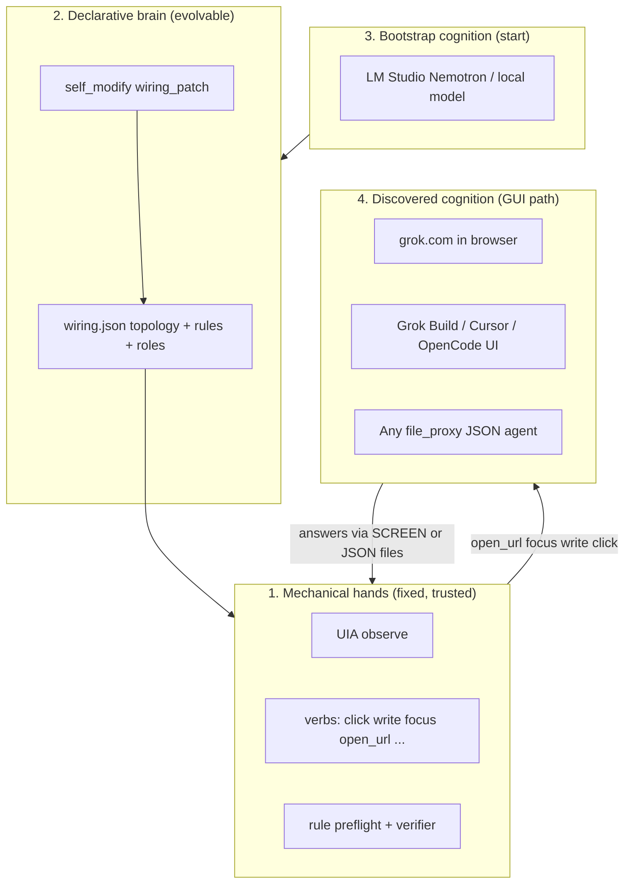
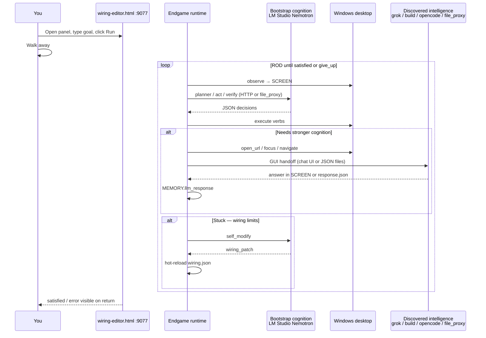
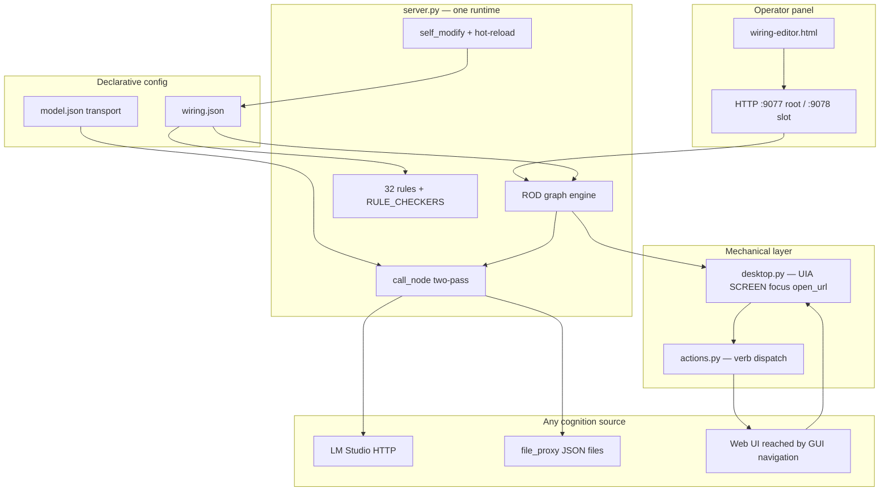
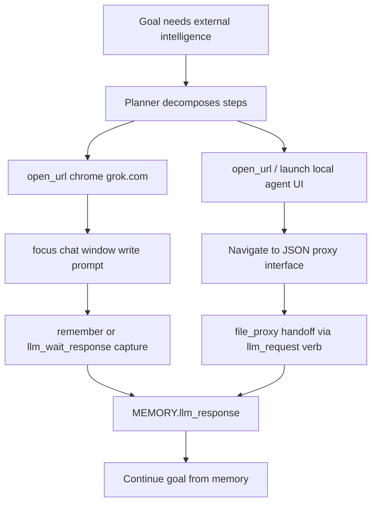
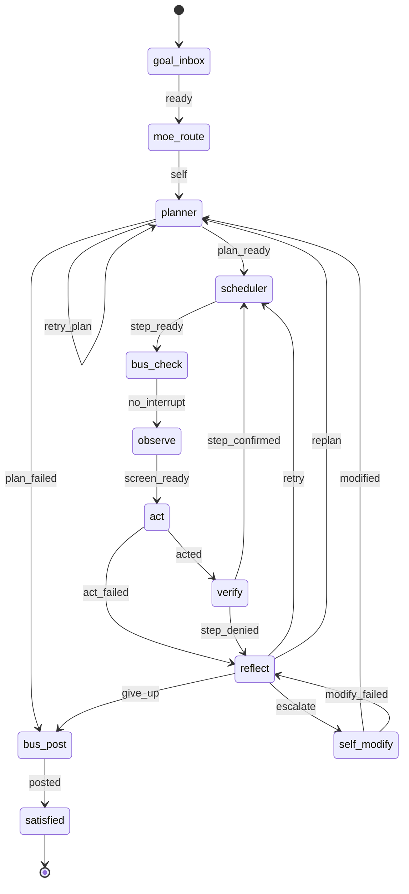
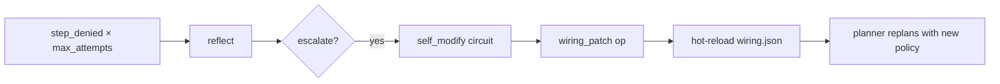
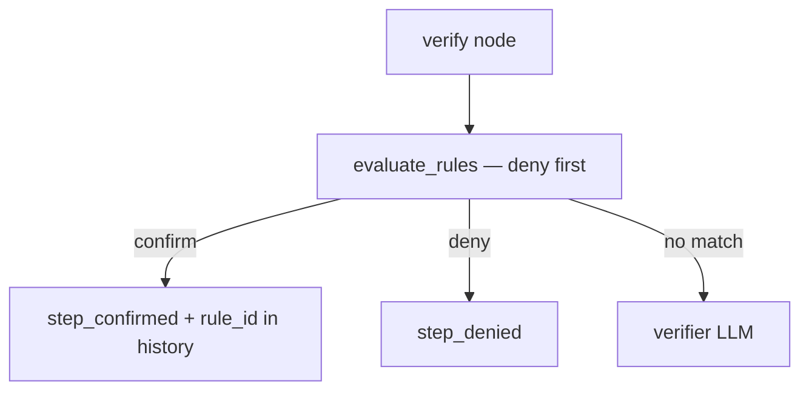
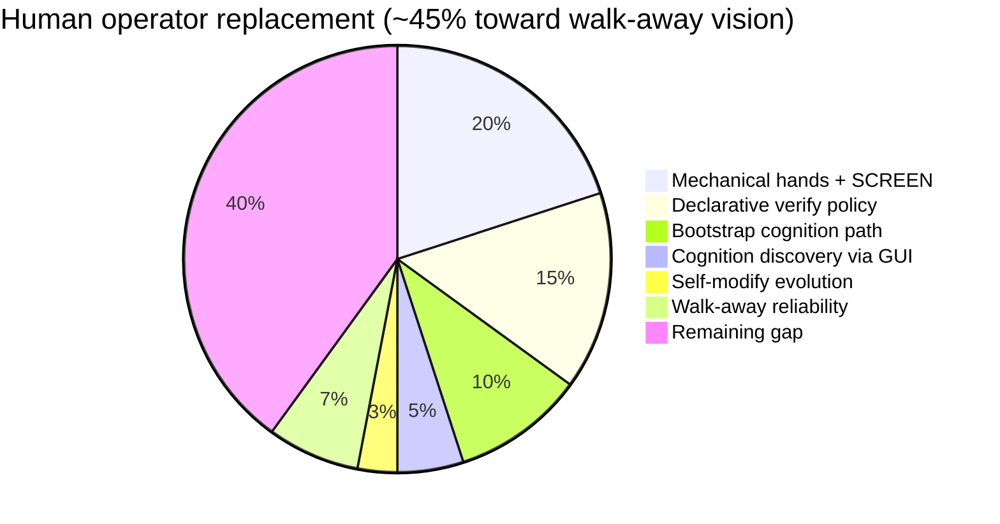

# Endgame-AI

**A self-evolving Windows desktop operator. You post a goal and walk away.**

Endgame-AI is not a chatbot with tools. It is not a cloud computer-use API. It is a **local runtime that owns the keyboard and screen**, reads the real desktop through UI Automation, executes verbs, judges progress with declarative rules, and asks models only for *decisions*. The model never drives the mouse.

The breakthrough bet: **the GUI is the universal API.** Any intelligence reachable through a browser tab, a local agent UI, or a JSON file handoff can be discovered and used — without hardcoded integrations, without vendor APIs, without pip.

Python stdlib only. `prompts/wiring.json` is the brain. `server.py` is the body. Cognition is pluggable and upgradeable at runtime.

| Field | Value |
|-------|-------|
| Repository | `https://github.com/wgabrys88/endgame-ai` |
| Branch | `codex/self-referential-relay` |
| Platform | Windows 10/11, interactive desktop |
| Entry | `python server.py` → panel at **http://127.0.0.1:9077/** |
| Default slot port | **9078** (slot 1) |
| Truth order | `wiring.json` + `server.py` + `desktop.py` + `actions.py` > this README |

**This file is the only documentation.**

---

## Table of contents

1. [What Endgame is (and is not)](#1-what-endgame-is-and-is-not)
2. [The breakthrough thesis](#2-the-breakthrough-thesis)
3. [Research context — where this sits in agentic AI](#3-research-context--where-this-sits-in-agentic-ai)
4. [Walk-away operator — the intended experience](#4-walk-away-operator--the-intended-experience)
5. [Uniform architecture](#5-uniform-architecture)
6. [Cognition bootstrap and discovery](#6-cognition-bootstrap-and-discovery)
7. [The ROD loop and self-evolution](#7-the-rod-loop-and-self-evolution)
8. [SCREEN → act → verify](#8-screen--act--verify)
9. [The declarative brain (wiring.json)](#9-the-declarative-brain-wiringjson)
10. [What is proven vs what is vision](#10-what-is-proven-vs-what-is-vision)
11. [Operator replacement — honest progress](#11-operator-replacement--honest-progress)
12. [Run it yourself — walk away with LM Studio](#12-run-it-yourself--walk-away-with-lm-studio)
13. [HTTP API](#13-http-api)
14. [Known gaps](#14-known-gaps)
15. [Remaining work](#15-remaining-work)
16. [Next AI handover prompt](#16-next-ai-handover-prompt)
17. [Deep Research prompt (ChatGPT project)](#17-deep-research-prompt-chatgpt-project)
18. [Repository layout](#18-repository-layout)

---

## 1. What Endgame is (and is not)

### It is

| Property | Meaning |
|----------|---------|
| **Desktop operator** | Sits at your PC like a human — sees UIA, moves cursor, types, switches windows |
| **Uniform system** | One ROD graph, one wiring brain, one mechanical layer — not a bag of scripts |
| **Decision / execution split** | LLM circuits emit JSON; Python executes and verifies |
| **GUI-unlimited** | `open_url`, `focus`, `click`, `write` can reach *any* webpage or app UI |
| **Cognition-pluggable** | Bootstrap on local Nemotron (LM Studio); upgrade to grok.com, Grok Build, OpenCode, or any file-proxy agent by *navigating there* |
| **Self-evolving** | `self_modify` can patch `wiring.json` (rules, prompts, topology, observe) when stuck |
| **Self-feeding** | Reasoning chains, MEMORY, traces, and file-proxy request/response loops accumulate context |

### It is not

| Anti-pattern | Why |
|--------------|-----|
| Standard tool-calling agent | Tools are not the interface — verbs + SCREEN + wiring rules are |
| Cloud computer-use only | Runs fully local; no vendor lock-in for hands or brain |
| Hardcoded grok/Chrome recipe | grok is one *discoverable* cognition source, not the architecture |
| `p0_file_proxy_runner.py` | Canned responses without reading SCREEN — automation only, invalid proof |
| MCP-as-hands | Endgame owns HWND focus and UIA — external agents advise, never click |

---

## 2. The breakthrough thesis

Most agentic systems in 2025–2026 follow one pattern: **one big model sees pixels and acts**.

| Approach | Examples | Limit |
|----------|----------|-------|
| Screenshot + API loop | [Anthropic Computer Use](https://platform.claude.com/docs/en/agents-and-tools/tool-use/computer-use-tool), OpenAI CUA/Operator | Cloud cost, API caps, no local policy evolution |
| Benchmark harnesses | [OSWorld](https://arxiv.org/abs/2409.08264), [Windows Agent Arena](https://microsoft.github.io/WindowsAgentArena/) | Measure agents, not ship operators |
| Self-modifying code | [Sakana DGM](https://sakana.ai/dgm/) | Code evolution, not live desktop wiring |
| Declarative graphs | LangGraph-style workflows | Static unless rebuilt |

**Endgame's bet — four separations:**



1. **Hands** — Python + UIA. Deterministic. Never hallucinate a click.
2. **Brain** — `wiring.json`. Hot-reloadable. Governs when steps confirm, deny, escalate, evolve.
3. **Bootstrap cognition** — Small local model (Nemotron) for planner/act/verify when you walk away.
4. **Discovered cognition** — Stronger intelligence reached by **navigating the GUI** to whatever service is available — grok.com, a build tab, a local agent that speaks JSON files. No API key required. The webpage *is* the API.

This is why it is not a branch diagram. Slots and relay workers are **implementation helpers** for parallelism. The mental model is one operator that can find its own way to better thinking.

---

## 3. Research context — where this sits in agentic AI

Recent work validates pieces of this design. Endgame combines them in a way none of the papers do alone.

| Research line | Key idea | Endgame mapping |
|---------------|----------|-----------------|
| **OSWorld** (2024–2025) | Open-ended desktop tasks in real OS environments | Same problem domain; Endgame targets Windows UIA + walk-away goals |
| **Windows Agent Arena** (Microsoft, 2025) | Scalable Windows GUI benchmark | Endgame is operator-first, not benchmark-first |
| **Computer Use** (Anthropic/OpenAI, 2025) | Model controls mouse/keyboard via API | Endgame inverts: runtime controls mouse, model advises |
| **DGM / self-modifying agents** (Sakana, 2025) | Agents rewrite own code to improve | Endgame `self_modify` patches **wiring policy**, not random Python |
| **GUI grounding surveys** (2025–2026) | Accessibility trees beat raw pixels for reliability | Endgame uses UIA `[ID]` + `[W#]` tokens, not screenshot-only |
| **Declarative agent configs** (2025) | Separate workflow from execution | `wiring.json` is the workflow; `server.py` is the executor |

**What is genuinely novel here:**

- **GUI as cognition router** — the operator can `open_url` grok.com, open a local agent IDE, or point file_proxy paths at whatever JSON-speaking tool exists. No integration code per vendor.
- **Policy evolution without redeploy** — `wiring_patch` ops (15 types) hot-reload rules/prompts/topology when reflect escalates.
- **Structural verify before LLM verify** — 32 declarative rules prevent false success (e.g. wait-only steps confirming without memory evidence).
- **Two-pass cognition contract** — reasoning pass then `DECIDE NOW` JSON pass reduces parse failures.
- **Stdlib-only single runtime** — no pip, one `server.py`, auditable mechanical layer.

---

## 4. Walk-away operator — the intended experience



**Your job:** start LM Studio (bootstrap), start `server.py`, open panel, post goal, leave.

**Endgame's job:** plan, observe, act, verify, discover cognition if needed, evolve wiring if stuck, finish.

You do **not** manually poll `request.json` when bootstrap uses `transport: openai` (LM Studio HTTP). You do **not** pre-open grok.com — the operator can open it via `open_url` when the plan requires it.

---

## 5. Uniform architecture



### Layer ownership

| Layer | Owns | Never owns |
|-------|------|------------|
| `wiring.json` | Topology, rules, roles, limits, observe, guards | Mouse, HWND, HTTP to models |
| `server.py` | Graph traversal, rule eval, LLM orchestration, patches | UIA element resolution |
| `desktop.py` | SCREEN, `[W#]`/`[ID]`, focus, `open_url` | Planning, verification policy |
| `actions.py` | Verb execution, guards | Rule definitions |
| Cognition provider | JSON per circuit (planner/act/verifier/reflector/self_modify) | Desktop control |

### Optional slots (implementation detail)

The repo can spawn slot workers for parallel tasks (e.g. relay capture). This is **not** the user mental model. One slot with bootstrap Nemotron is sufficient for most walk-away goals. Multi-slot is optimization, not architecture.

---

## 6. Cognition bootstrap and discovery

### 6.1 Bootstrap — Nemotron at start

On first boot, configure `prompts/model.json`:

```json
{
  "transport": "openai",
  "host": "http://localhost:1234",
  "model": "nvidia-nemotron-3-nano-4b",
  "temperature": 0.3,
  "max_tokens": 2048,
  "timeout": 900
}
```

LM Studio serves `/v1/chat/completions`. Endgame calls it automatically for every LLM circuit. **No manual JSON copy-paste.** This is the bootstrap brain — good enough to plan, act from SCREEN, and verify.

### 6.2 Discovery — finding stronger cognition via GUI

When a goal needs intelligence beyond bootstrap, the **planner and act circuits decide** — not a human config file:



**Paths the operator can discover without hardcoded scripts:**

| Target | How Endgame reaches it | Handoff mechanism |
|--------|------------------------|-------------------|
| grok.com | `open_url chrome grok.com` → write/click chat UI | SCREEN capture → `remember` or relay `response.json` |
| Grok Build / Cursor | `open_url` or win+r launch → focus window | file_proxy if agent writes JSON; else SCREEN |
| OpenCode / local agent | Navigate to local URL or app UI | `comms/.../request.json` ↔ `response.json` |
| Any webpage AI | GUI navigation only | Unrestricted — if it renders in a browser, Endgame can reach it |

**The GUI has no API rate limits.** If a human can click it, Endgame can click it. That is the unrestricted bridge.

### 6.3 file_proxy — universal JSON bridge

`transport: file_proxy` in `model.json` means: Endgame writes `comms/slot1_cognition/request.json`, any agent that reads JSON and writes `response.json` becomes cognition — Grok Build, OpenCode, a future local daemon, or you during development.

The request system is **self-feeding**: each cycle includes GOAL, HISTORY, MEMORY, SCREEN (for act), and reasoning chains from prior passes.

### 6.4 Two-pass LLM contract

| Pass | Trigger | Output in `content` |
|------|---------|---------------------|
| 1 | No `DECIDE NOW` in user message | Prose reasoning |
| 2 | `DECIDE NOW` present | Exactly one role JSON object |

Implemented in `server.py:1164–1174`. Reduces JSON parse failures across all cognition sources.

---

## 7. The ROD loop and self-evolution

**ROD** = Reflect – Observe – Decide (act is decide-from-SCREEN; verify/reflect close the loop).



### Self-evolution loop



**15 `wiring_patch` ops:** `add_rule`, `update_rule`, `set_observe`, `set_role`, `add_edge`, `set_limit`, … — see `SELF_MODIFY_OPS` in `server.py`.

`max_self_modify: 3` then `give_up`. Self-modify is coded; **not yet proven E2E** on a live stuck goal.

### Per-step micro-loop

```
scheduler → bus_check → observe → act → verify
                              ↑         |
                              └── reflect ← step_denied
```

`max_attempts: 7`, `max_replans: 3`.

---

## 8. SCREEN → act → verify

### SCREEN construction

```
1. Enumerate windows → [W1]..[Wn] tokens (HWND internally)
2. Hover scan (~400+ points) → actionable [ID] elements
3. Render: FOCUSED, ACTION SCOPE, WINDOWS list
4. Inject into act circuit only
```

### Key verbs

| Verb | Use |
|------|-----|
| `open_url` | `start chrome <url>` — no prior browser focus |
| `focus` | Target `[W#]` or window title — HWND-first with retry |
| `write` / `click` | Target `[ID]` from SCREEN |
| `remember` | Store fact in MEMORY from SCREEN |
| `llm_request` | Write prompt to `comms/llm_proxy/request.json` for JSON handoff |
| `llm_wait_response` | Poll `response.json` → `MEMORY.llm_response` |

### Verify pipeline



Deny rules block false success (e.g. `deny_wait_only_content_receipt`, `deny_response_no_evidence`).

---

## 9. The declarative brain (wiring.json)

| Section | Governs |
|---------|---------|
| `topology` | 12 nodes, 22 edges, signal routing |
| `rules` | 32 verify/act matchers → `RULE_CHECKERS` |
| `roles` | Planner, Act, Verifier, Reflector, Self_modify prompts |
| `limits` | max_attempts 7, max_replans 3, max_self_modify 3 |
| `observe` | hover scan, scope_depth, desktop_tree_enabled false |
| `verbs` / `verb_normalize` | Act JSON field mapping |
| `guards` | Advance hints after successful verbs |
| `reasoning` | Two-pass store/clear per circuit |

**Only `act` receives SCREEN.** Planner never sees pixels — it plans from goal + memory + history. This prevents coordinate hallucination in planning.

---

## 10. What is proven vs what is vision

| Capability | Status | Evidence |
|------------|--------|----------|
| UIA observe + SCREEN + verbs | **Proven** | Live runs + 11 mechanical tests |
| Bootstrap file_proxy cognition | **Proven** | Grok session read SCREEN → wrote response.json; Endgame acted |
| Notepad typing goal | **Proven** | `confirm_launch_chain`, `confirm_write_to_writable` |
| Chrome `open_url` navigation | **Proven** | `confirm_browser_open_url` |
| YouTube via direct watch URL | **Partial** | No click-play from search |
| Walk-away with LM Studio HTTP | **Designed** | `transport: openai` works; 4B model may fail JSON |
| Autonomous grok discovery (no pre-open) | **Vision** | `open_url` exists; P1 chatbot not E2E proven |
| self_modify recovery | **Coded, unproven** | Patch ops + hot-reload exist |
| Uniform cognition upgrade via GUI | **Vision** | Architecture supports; needs E2E proof |
| Zero-human session (post goal, leave) | **Target** | Requires reliable bootstrap model + discovery |

### Forbidden proof paths

| Path | Why invalid |
|------|-------------|
| `p0_file_proxy_runner.py` | Canned planner/act — never reads SCREEN |
| Coding agent manually clicking desktop | Bypasses Endgame loop |
| Unit tests alone | Mechanical only |

---

## 11. Operator replacement — honest progress



| Human skill | Endgame today |
|-------------|---------------|
| Sit at PC, receive goal | ✅ POST /run, panel |
| Plan subtasks | ✅ planner circuit (needs cognition) |
| See screen | ✅ UIA + hover |
| Click, type, switch apps | ✅ verbs + focus contract |
| Judge step completion | ✅ rules + verifier |
| Recover from errors | ⚠️ reflect/replan coded; self_modify unproven |
| Find better AI when stuck | ⚠️ GUI path exists; not proven autonomous |
| Work all day unattended | ❌ not production-hardened |

**The idea works.** The vision is larger than what is proven. The gap is polish and E2E proof of discovery + self-modify — not a missing architecture.

---

## 12. Run it yourself — walk away with LM Studio

### Prerequisites

- Windows 10/11, Python 3.11+
- [LM Studio](https://lmstudio.ai) — load Nemotron (or larger model), start server **port 1234**
- Chrome installed

### One-time config

Edit `prompts/model.json` — set `"transport": "openai"` (see §6.1).

### Start

```powershell
cd C:\path\to\endgame-ai
$env:PYTHONIOENCODING = 'utf-8'
python server.py
```

Open **http://127.0.0.1:9077/** (workbench panel).

### Post goal and leave

Type goal in panel or:

```powershell
Invoke-RestMethod -Method Post -Uri http://127.0.0.1:9078/run `
  -ContentType 'application/json' `
  -Body '{"goal":"open notepad and type hello"}'
```

Poll when you return:

```powershell
Invoke-RestMethod http://127.0.0.1:9078/state
# satisfied: true → done
```

### Example goals (increasing ambition)

| Goal | What Endgame must discover |
|------|---------------------------|
| `open notepad and type hello` | Bootstrap Nemotron only |
| `navigate to google.com in chrome` | `open_url` verb |
| `ask grok what is the capital of France and save the answer` | Bootstrap plans → open grok → chat → capture → remember |
| `use the best available AI on this PC to summarize my goal` | Full cognition discovery — hardest, unproven |

### Between goals

```powershell
Invoke-RestMethod -Method Post -Uri http://127.0.0.1:9078/llm-proxy/clear `
  -ContentType 'application/json' -Body '{"confirm":true}'
```

### If Nemotron fails JSON

Use a larger LM Studio model, or set `transport: file_proxy` and let Grok Build / Cursor poll `comms/slot1_cognition/request.json` — same uniform system, different cognition source.

---

## 13. HTTP API

| Method | Path | Purpose |
|--------|------|---------|
| GET | `/health` | Transport, nodes, run status |
| GET | `/state` | Full run state + history |
| POST | `/run` | `{"goal":"..."}` |
| POST | `/pause` / `/resume` | Control loop |
| POST | `/llm-proxy/clear` | `{"confirm":true}` — clear stale cognition |
| POST | `/wiring` | Hot-reload wiring |
| GET | `/wiring/audit` | Validate wiring |

Ports: root **9077**, slot 1 **9078**, slot 2 **9079** (optional relay worker).

---

## 14. Known gaps

| Gap | Impact |
|-----|--------|
| Bootstrap 4B model JSON reliability | Walk-away may fail on DECIDE NOW pass |
| P1 chatbot / grok discovery | Not E2E proven |
| self_modify | Coded, never demonstrated live |
| `plan_failed` → silent death | No reflect recovery |
| YouTube click-play | Partial benchmark only |
| Slot 2 relay as separate worker | Should merge into uniform discovery story |
| Codebase size | `server.py` needs shrink via modify/remove |

---

## 15. Remaining work

Priority for next implementer:

1. **Prove walk-away** — LM Studio bootstrap, post goal, leave, return to `satisfied: true` on Notepad + Google.
2. **Prove cognition discovery** — goal that requires opening grok.com autonomously (no pre-opened tab).
3. **Prove self_modify** — stuck goal → wiring_patch → success on retry.
4. **Unify relay into single-slot story** — Slot 2 optional; Slot 1 should handle discovery via verbs.
5. **Shrink** — remove dead paths before adding features.
6. **YouTube click-play** — act clicks `[ID]` result; player-state verify.

---

## 16. Next AI handover prompt

```
You are continuing Endgame-AI — a self-evolving Windows desktop operator.

REPO: https://github.com/wgabrys88/endgame-ai
BRANCH: codex/self-referential-relay
DOCS: README.md only — read fully first.

THESIS (do not misunderstand):
- Endgame owns the hands (UIA, verbs). Cognition advises via JSON only.
- GUI is the universal API — grok.com, Grok Build, OpenCode, any webpage or JSON file agent are DISCOVERABLE cognition upgrades, not hardcoded branches.
- User posts goal in panel and walks away. Bootstrap = LM Studio Nemotron (transport: openai). System must find stronger AI via open_url/focus/write when needed.
- wiring.json is the evolvable brain. self_modify patches policy at runtime.
- Uniform system — slots/relay are implementation helpers, not the architecture story.

PROVEN: Notepad hello, Google open_url (SCREEN-driven cognition). YouTube partial. P1 chatbot + self_modify + walk-away discovery NOT proven.

YOUR GOAL: Prove the vision — walk-away goals, autonomous cognition discovery, self_modify on stuck run. Shrink server.py. Modify/remove before add.

OPERATE:
1. python server.py → panel :9077
2. model.json transport: openai + LM Studio :1234 for walk-away bootstrap
3. POST /run on :9078
4. Proof = satisfied:true + history with real verbs + rule_id on verify
5. Read request.json SCREEN when using file_proxy — never canned scripts

FORBIDDEN: p0_file_proxy_runner.py as proof, manual desktop control, new files before audit.

KEY FILES: server.py, desktop.py, actions.py, prompts/wiring.json
```

---

## 17. Deep Research prompt (ChatGPT project)

```
Deep research: Endgame-AI — self-evolving desktop operator with GUI-as-universal-API

Repository: https://github.com/wgabrys88/endgame-ai
Branch: codex/self-referential-relay

CONTEXT — read README first. This is NOT a standard computer-use agent.

Research questions:

1. PARADIGM COMPARISON
   Compare Endgame-AI to: Anthropic Computer Use, OpenAI CUA/Operator, OSWorld agents, Windows Agent Arena, UFO, Sakana DGM, LangGraph declarative agents.
   What is Endgame's unique bet? (hands/brain/cognition separation, GUI-unlimited cognition discovery, wiring.json self-evolution, structural verify rules, stdlib-only runtime)

2. SCIENTIFIC GROUNDING
   Survey 2025–2026 papers on: GUI grounding (UIA vs pixels), desktop agent benchmarks, self-modifying agents, declarative agent policy, local+remote cognition routing.
   Where does Endgame align with state of the art? Where is it ahead? Where behind?

3. WALK-AWAY OPERATOR MODEL
   Analyze the intended UX: bootstrap Nemotron → autonomous cognition discovery via GUI → self_modify policy evolution.
   What engineering gaps block "post goal and leave"? What is proven vs vision?

4. GUI AS UNIVERSAL API
   Analyze the claim that any browser-reachable or JSON-file-speaking intelligence can be integrated without vendor APIs.
   Compare to MCP, tool-calling, and computer-use APIs. Security and reliability implications.

5. SELF-EVOLUTION
   Analyze wiring_patch ops vs code self-modification (DGM). Risks of policy drift. Hot-reload safety.

6. ROADMAP
   Prioritized 3-session plan to prove: (a) walk-away bootstrap, (b) autonomous grok discovery, (c) self_modify recovery.
   Effort S/M/L per item.

Deliverables:
- 1-page executive summary
- Comparison table vs 5 closest systems
- Mermaid architecture (hands / brain / bootstrap / discovered cognition)
- Bibliography with arXiv links
- Honest assessment: breakthrough potential vs current maturity (~45% operator replacement)
```

---

## 18. Repository layout

| Path | Role |
|------|------|
| `server.py` | HTTP API, ROD loop, rules, LLM, self_modify |
| `desktop.py` | UIA, SCREEN, `[W#]`/`[ID]`, focus, `open_url` |
| `actions.py` | Verb dispatch |
| `prompts/wiring.json` | Brain — 32 rules, 12 nodes, 22 edges |
| `prompts/model.json` | Cognition transport (openai or file_proxy) |
| `wiring-editor.html` | Walk-away panel |
| `test_mechanical_fixes.py` | 11 mechanical tests (not E2E proof) |
| `p0_file_proxy_runner.py` | Canned driver — **not valid proof** |

**Gitignored runtime:** `state*.json`, `bus.json`, `comms/`, `traces.jsonl`

---

## Authoritative counts

| Item | Slot 1 value |
|------|--------------|
| Rules | **32** |
| Nodes | **12** |
| Edges | **22** |
| max_attempts / max_replans | **7** / **3** |
| max_self_modify | **3** |

Re-count from `wiring.json` after edits.

---

## License

Research operator tooling. Not production-hardened.

**Walk away. Let Endgame find the way.**