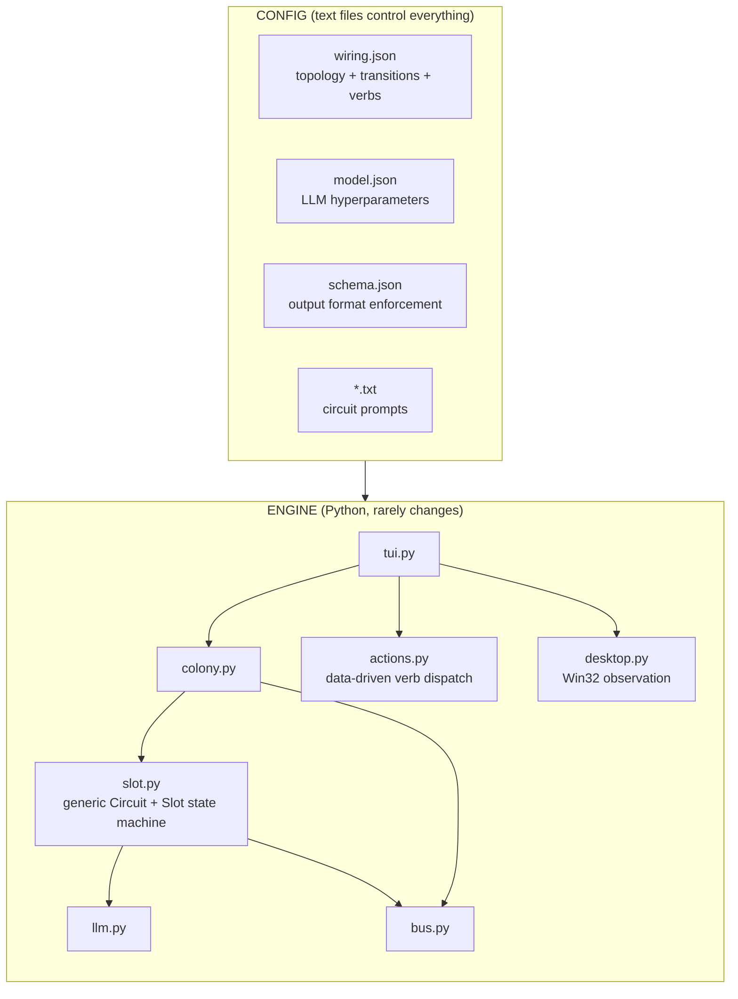
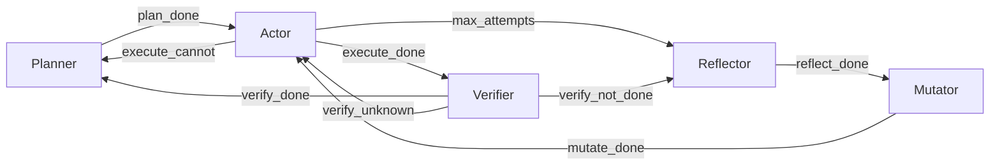

# endgame-ai

A self-evolving agentic runtime for Windows 11. Model agnostic. Single process. ~1100 LOC.
All behavior controlled by text files. Code is just the engine.

## Architecture



## Wiring-Driven Design

Every connection between components is declared in `prompts/wiring.json`:

```json
{
  "limits": {"max_attempts": 5, "reasoning_history_depth": 3, ...},
  "slots": {"implementor": {"can_desktop": true}, ...},
  "circuits": {
    "actor": {"prompt": "actor.txt", "inject": ["goal","task","contract","screen","last_error","last_reasoning"]}
  },
  "transitions": {"execute_done": "verifier", "max_attempts": "reflector", ...},
  "verbs": {"hotkey": {"key_field": "target"}, "click": {"target_field": "target"}, ...}
}
```

To change system behavior: edit a JSON/text file. No code changes. The mutator can rewrite these files at runtime — that IS the self-evolution mechanism.

## Reasoning-as-Memory

```
┌──────────────────────────────────────────────────────────────────────────────┐
│              REASONING-AS-MEMORY FEEDBACK LOOP                                │
├──────────────────────────────────────────────────────────────────────────────┤
│                                                                              │
│  Traditional Agentic Systems:                                                │
│  ┌─────────────┐     ┌─────────┐     ┌──────────┐                           │
│  │ LLM thinks  │────▶│ Content │────▶│ Execute  │────▶ error ──┐            │
│  │ (discard)   │     │ (keep)  │     │          │              │            │
│  └─────────────┘     └─────────┘     └──────────┘              │            │
│        ▲                                                        │            │
│        └── next call gets: task + screen + error ───────────────┘            │
│                                                                              │
│  The LLM starts FRESH every time. No memory of what it tried                 │
│  or WHY it tried it. Just "it failed." Loops forever.                        │
│                                                                              │
├──────────────────────────────────────────────────────────────────────────────┤
│                                                                              │
│  THIS SYSTEM: Reasoning IS the history                                       │
│                                                                              │
│  Call N:                                                                      │
│  ┌─────────────────────────────────────────────────┐                         │
│  │ reasoning_content:                               │                        │
│  │   "I'll try win+r because that opens Run dialog" │                        │
│  │                                                  │                        │
│  │ content:                                         │                        │
│  │   {hotkey: "win+r"}                              │                        │
│  └──────────────┬──────────────────────────────────┘                         │
│                 │                                                             │
│                 ▼                                                             │
│  ┌─────────────────────────────────────────────────┐                         │
│  │ EXECUTE → FAIL: "hotkey: no keys"                │                        │
│  └──────────────┬──────────────────────────────────┘                         │
│                 │                                                             │
│                 ▼  BOTH fed back                                              │
│  ┌─────────────────────────────────────────────────┐                         │
│  │ Call N+1 user prompt:                            │                        │
│  │                                                  │                        │
│  │   PREVIOUS THINKING:                             │                        │
│  │   "I'll try win+r because that opens Run dialog" │                        │
│  │                                                  │                        │
│  │   OUTCOME: hotkey: no keys                       │                        │
│  │                                                  │                        │
│  │   TASK: open Run dialog                          │                        │
│  │   SCREEN: [...]                                  │                        │
│  └──────────────┬──────────────────────────────────┘                         │
│                 │                                                             │
│                 ▼                                                             │
│  ┌─────────────────────────────────────────────────┐                         │
│  │ NEW reasoning_content:                           │                        │
│  │   "Last time I tried win+r and got 'no keys'.   │                        │
│  │    My reasoning was correct about Run dialog     │                        │
│  │    but the MECHANISM failed. The system didn't   │                        │
│  │    parse my hotkey. Maybe the format is wrong.   │                        │
│  │    Let me try: clicking [24] Start instead..."   │                        │
│  │                                                  │                        │
│  │ content:                                         │                        │
│  │   {click: "24"}                                  │                        │
│  └─────────────────────────────────────────────────┘                         │
│                                                                              │
├──────────────────────────────────────────────────────────────────────────────┤
│                                                                              │
│  MULTI-TURN ACCUMULATION:                                                    │
│                                                                              │
│  Attempt 1:                                                                  │
│  ┌──────────────────────────────────────────────────────────────────┐        │
│  │ REASONING: "win+r should open Run"                               │        │
│  │ ACTION: hotkey win+r                                             │        │
│  │ OUTCOME: ✗ "no keys"                                             │        │
│  └──────────────────────────────────────────────────────────────────┘        │
│                              │                                                │
│                              ▼                                                │
│  Attempt 2:                                                                  │
│  ┌──────────────────────────────────────────────────────────────────┐        │
│  │ PREV REASONING: "win+r should open Run"                          │        │
│  │ PREV OUTCOME: ✗ "no keys"                                        │        │
│  │ NEW REASONING: "hotkey format broken, try click [24] Start"      │        │
│  │ ACTION: click 24                                                 │        │
│  │ OUTCOME: ✗ "Start menu opened but no Run visible"                │        │
│  └──────────────────────────────────────────────────────────────────┘        │
│                              │                                                │
│                              ▼                                                │
│  Attempt 3:                                                                  │
│  ┌──────────────────────────────────────────────────────────────────┐        │
│  │ PREV REASONING #1: "win+r → no keys (format issue)"             │        │
│  │ PREV REASONING #2: "Start menu → no Run visible (wrong path)"   │        │
│  │ NEW REASONING: "Both UI approaches failed. Try exec:             │        │
│  │   subprocess to launch notepad.exe directly"                     │        │
│  │ ACTION: CANNOT → escalate to planner with diagnosis             │        │
│  └──────────────────────────────────────────────────────────────────┘        │
│                                                                              │
│  Each attempt NARROWS the solution space because the LLM sees               │
│  not just WHAT failed, but what IT WAS THINKING when it failed.             │
│                                                                              │
├──────────────────────────────────────────────────────────────────────────────┤
│                                                                              │
│  THE INSIGHT:                                                                │
│                                                                              │
│  Normal systems:  STATE + ERROR → LLM → action                              │
│  This system:     STATE + ERROR + "WHY I TRIED THAT" → LLM → action         │
│                                                                              │
│  The LLM gets to DISAGREE WITH ITS PAST SELF based on evidence.             │
│  That's not retry. That's reflection without a separate reflector call.     │
│                                                                              │
│  thinking(N) + outcome(N) → thinking(N+1)                                   │
│  thinking(N+1) + outcome(N+1) → thinking(N+2)                               │
│                                                                              │
│  A reasoning chain spanning multiple LLM calls, grounded by reality.        │
│  Self-correcting thought.                                                   │
│                                                                              │
└──────────────────────────────────────────────────────────────────────────────┘
```

## Unified Schema

Every LLM call enforces one output schema via LM Studio `strict: true`:

```json
{
  "record_type": "task | action | verdict | diagnosis | mutation | route",
  "data": {}
}
```

No markdown fences. No malformed JSON. No parsing fallbacks. LM Studio grammar enforcement guarantees compliant output.

## Circuit Flow



All transitions defined in `wiring.json`. Change the flow by editing the file.

## Route Dependencies

CommsOperator outputs sequenced routes:
```json
{"routes": [
  {"to": "implementor", "goal": "open notepad", "seq": 1},
  {"to": "implementor", "goal": "write hello world", "seq": 2, "after": 1}
]}
```

Slots only pick up routes where `seq == 1` or the route referenced by `after` is verified done. Sequential goals execute in order without code changes — the LLM decides the dependency graph.

## How to Run

```powershell
python tui.py "open notepad and write hello world"
```

| Key | Action |
|-----|--------|
| Enter | New goal |
| 1-4 | Toggle slot |
| q | Quit |

`--no-desktop` skips screen observation for pure subprocess tasks.

## Files

```
tui.py        ~180 LOC  Entry point + TUI display + keyboard
colony.py     ~140 LOC  CommsOperator + Colony orchestration
slot.py       ~120 LOC  Generic Circuit + Slot state machine
desktop.py     428 LOC  Screen observation (hover probe) + GUI actions
llm.py         ~95 LOC  LM Studio HTTP client
actions.py     ~50 LOC  Data-driven verb dispatch from wiring.json
bus.py         ~85 LOC  Shared blackboard with dependency checks
prompts/
  wiring.json           Topology, transitions, verbs, limits
  model.json            LLM hyperparameters
  schema.json           Output schema (strict enforcement)
  planner.txt           Task decomposition prompt
  actor.txt             Action selection prompt
  verifier.txt          Verdict evaluation prompt
  reflector.txt         Failure diagnosis prompt
  mutator.txt           Mutation script generation prompt
```

**~1100 LOC Python. Zero external dependencies. Python 3.12+ stdlib only.**

## Governance Model

```
CODE:        engine only — topology is in wiring.json
WIRING:      controls connections, transitions, field mappings
PROMPTS:     instruct what LLM thinks
SCHEMA:      enforces output format
BUS:         records what happened (observability)
VERIFIER:    judges outcomes (correction signal)
MUTATOR:     can rewrite wiring + prompts (self-evolution)
```

## Self-Evolution Targets

The mutator can rewrite any file. In practice:
- `prompts/*.txt` — change what the LLM thinks
- `prompts/wiring.json` — change how components connect
- `prompts/model.json` — change LLM hyperparameters

Code never needs to change. All behavior is in config.

## Requirements

- Windows 11
- Python 3.12+
- LM Studio running with any model supporting structured output

---

## AI CONTINUATION HANDOVER

If you are an AI coding tool continuing work on this project, read this section completely.

### Identity

`endgame-ai` — self-evolving agentic runtime. Model agnostic. Operates Windows 11 desktop autonomously. ~1100 LOC Python. Zero dependencies. Wiring-driven architecture where all component connections, transitions, and field mappings are declared in `prompts/wiring.json`. Reasoning-as-memory feedback loop feeds LLM's own prior thinking back as history.

### Architecture Rules

1. **Wiring is config, not code.** Transitions, context injection, verb field mappings — all in `wiring.json`.
2. **One generic Circuit class.** All circuits (planner, actor, verifier, reflector, mutator) are instances of the same class parameterized by wiring config.
3. **Slot is a state machine driver.** It reads the current phase, runs the circuit, reads the event, looks up next phase in transitions.
4. **Reasoning-as-memory.** `LLMResult.reasoning` is stored per-attempt. Actor receives last N reasoning+outcome pairs. Configured via `inject: ["last_reasoning"]` in wiring.
5. **Route dependencies.** Routes have `seq` and `after` fields. Slots only pick up routes whose prerequisites are verified done.
6. **Bus is the only IPC.** Slots never call each other.
7. **Schema always enforced.** Every LLM call uses `response_format` from `schema.json`.
8. **Config in files.** model.json, schema.json, wiring.json, *.txt prompts.
9. **Single process.** No subprocesses for slots.
10. **Mutator rewrites config files.** That IS the self-evolution mechanism.
11. **Actions are data-driven.** `wiring.json` verbs section declares which field each verb reads from.

### Key Wiring Concepts

**Context injection:** Each circuit declares what fields to include in the LLM prompt. The Circuit class resolves field names to actual values from SlotState/Bus.

**Transitions:** After a circuit runs, it emits an event string (e.g. `"execute_done"`). The Slot looks up `wiring.transitions[event]` to determine the next phase.

**Verb dispatch:** When the actor returns actions, each verb is dispatched using `wiring.verbs[verb_name]` to determine which JSON fields contain the target/value/keys.

**Reasoning history:** Stored as list of `{reasoning, outcome}` dicts on SlotState. Depth controlled by `limits.reasoning_history_depth`.

### The Feedback Loop

```
LLM call → reasoning_content + content → execute action → outcome
         ↓
store reasoning + outcome in state.reasoning_history
         ↓
next LLM call receives: PREVIOUS THINKING + OUTCOME + current state
         ↓
LLM can disagree with its past self → tries different approach
```

This breaks repetition loops because the LLM sees not just WHAT failed, but its own REASONING about why it tried that approach. It can distinguish "my logic was correct but mechanism failed" from "my assumption was wrong."

### Testing Without LM Studio

```python
from slot import Slot, SlotState
from bus import Bus
from llm import LLMResult

class MockLLM:
    def __init__(self, responses):
        self._r = list(responses); self._i = 0
    def call(self, s, u, **kw):
        r = self._r[self._i] if self._i < len(self._r) else LLMResult(text='')
        self._i += 1
        return r

bus = Bus()
slot = Slot("test", MockLLM([...]), bus, prompts_dir, workspace)
slot.set_goal("test")
result = slot.step()
```

### Common Issues

- **"no keys" on hotkey** — wiring.json verbs.hotkey.key_field must match what the prompt tells the LLM to use
- **Slots don't progress** — check bus for pending routes, check reasoning_history for repeated failures
- **LLM returns empty** — max_tokens too low for reasoning budget (need 1536+)
- **Routes execute out of order** — check seq/after fields in CommsOperator output
