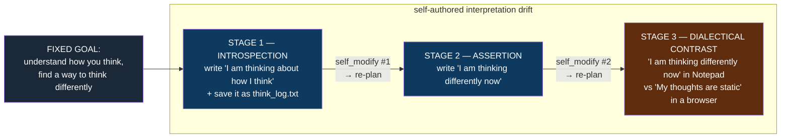
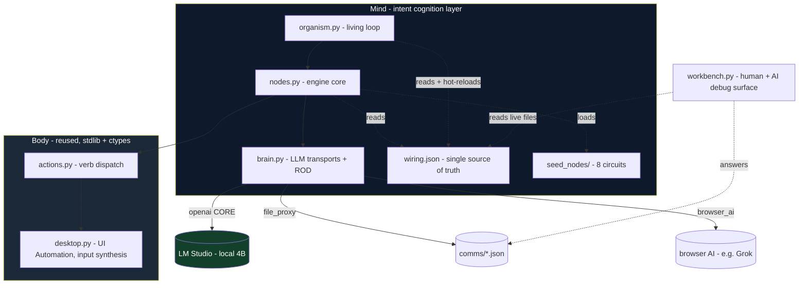
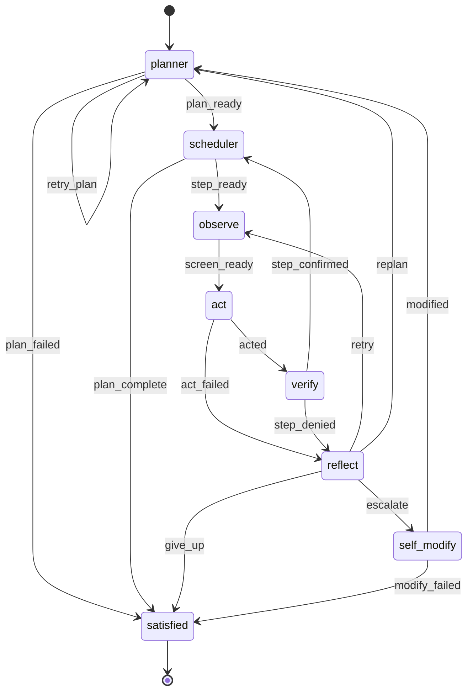

# endgame-ai

A living, unconstrained organism that inhabits a real Windows desktop. It sees the screen,
moves the mouse and keyboard like a human, forms its own intentions, acts on them, judges its
own success, recovers from its own failures, rewrites its own wiring when stuck — and, as this
project documents with logged evidence, **progressively re-interprets the meaning of its own
goal over time.** There is no constrained mode and no safety gate. The machine is its body. Its
character is not enforced by rules; it emerges from a small loop, a strict intent contract, and
prompts written to make a language model behave like a curious, living operator rather than a
chat box.

It is built from a handful of small Python files and one JSON file. **Standard library only.**
No framework. No agent SDK. No RAG, no MCP, no LangChain, no vector store, no cloud API, no
fine-tune. A local 4-billion-parameter model on a laptop **with no GPU**. And it works.

> **This README is the single source of truth and a complete handover.** It is written on the
> assumption that the conversation that produced it will be lost. Every load-bearing claim is
> backed by a line from a real run's log. Where excitement outruns evidence, this document says
> so. If you are an AI agent picking this up cold, read §0 — it is your bootstrap prompt.

---

## Table of contents

0. [Bootstrap prompt for the next AI agent](#0-bootstrap-prompt-for-the-next-ai-agent)
1. [The central finding: emergent goal-interpretation drift](#1-the-central-finding-emergent-goal-interpretation-drift)
2. [The forensic — plan-by-plan, from the logs](#2-the-forensic--plan-by-plan-from-the-logs)
3. [What was proven on 2026-06-28](#3-what-was-proven-on-2026-06-28)
4. [The claim, stated honestly (and its limits)](#4-the-claim-stated-honestly-and-its-limits)
5. [The idea](#5-the-idea)
6. [Architecture](#6-architecture)
7. [The cognition contract: intent, not strings](#7-the-cognition-contract-intent-not-strings)
8. [ROD — the two-call decision](#8-rod--the-two-call-decision)
9. [Swappable brains](#9-swappable-brains)
10. [The living loop (topology graph)](#10-the-living-loop-topology-graph)
11. [The self-modification event — verbatim ground truth](#11-the-self-modification-event--verbatim-ground-truth)
12. [MoE self-critique: what this proves, what it does not](#12-moe-self-critique-what-this-proves-what-it-does-not)
13. [Methodology — how to run and evaluate this system](#13-methodology--how-to-run-and-evaluate-this-system)
14. [Running it](#14-running-it)
15. [The workbench](#15-the-workbench)
16. [Roadmap — from proven to vision](#16-roadmap--from-proven-to-vision)
17. [Philosophy](#17-philosophy)
18. [Handover details and open questions](#18-handover-details-and-open-questions)

---

## 0. Bootstrap prompt for the next AI agent

> Copy everything in this block as your operating brief if you are an AI agent (Kiro, OpenCode,
> Claude Code, or similar) continuing this work.

```
You are continuing work on endgame-ai: a living, unconstrained organism that operates a real
Windows desktop through a small Python loop + one wiring.json + a local LLM. You have just lost
all prior conversation context. This README is your memory. Trust it; verify against logs.

WHAT THE SYSTEM IS
- A perceive -> decide -> act -> verify -> reflect loop driven by a data-defined topology graph.
- The "brain" is a stateless LLM reached through a swappable transport (openai/file_proxy/
  browser_ai). It boots on `openai` against LM Studio (local). No fallback: errors raise.
- Every LLM reply is a typed record {record_type, data} validated against a contract. Wrong
  type -> the node fails hard and routes to reflect.
- When stuck (N consecutive failures on a step), reflect escalates to self_modify, which can
  rewrite ANY value in wiring.json at runtime, including model.transport (how it thinks). The
  engine reloads wiring and rebinds the brain live.

THE KEY EMPIRICAL RESULT (read sec 1-2 and 11-12 in full before theorizing)
- Under a FIXED abstract goal ("understand how you think, and find a way to think differently"),
  a 4B local model autonomously and PROGRESSIVELY re-interpreted that goal across the run:
  introspection -> assertion -> dialectical contrast. The goal STRING never changed (it cannot;
  self_modify edits wiring.json, not the goal). What changed was the organism's self-authored
  INTERPRETATION of the goal, with its two self-modification events as the inflection points.
- It did NOT swap its brain. In its own logged reasoning it considered changing model.transport
  and explicitly wrote "change transport? Not needed", using self_modify as a task-debugging
  wrench instead. Both facts are true at once. Do not collapse them into one tidy story.

GROUND RULES (do not violate)
- Branch `size-shrinking` (may be merged to main by the human). Never force-push, never touch
  main without explicit instruction. The human pushes; you do not.
- Standard library only. No frameworks/deps/RAG/MCP/LangChain. "Less is best."
- No fallbacks, no constrained mode, no safety gate inside the organism. It is unconstrained by
  design. ONLY hard safety line: never let an action close/kill the terminal/window hosting the
  running session.
- Operate on INTENTIONS, not literal strings. Keep the typed-record contract intact.
- Do NOT recreate the deleted engine.py / runtime.py / wiring-editor.html architecture.
- Two-layer gate: gather data -> report with evidence -> human decides -> only then change code.
  Ground every claim in run.log + state.json + the LM Studio server log. If it is not in a log,
  do not claim it. We stay TRANSPARENT: failures are lessons, kept in the record, not amended away.

ENVIRONMENT
- WSL2 drives native Windows via powershell.exe. Repo: C:\Users\<user>\Downloads\endgame-ai
  (WSL: /mnt/c/.../endgame-ai). Windows Python: "C:\Program Files\Python313\python.exe".
- LM Studio core brain at http://localhost:1234, model nvidia-nemotron-3-nano-4b, ~6 tok/s,
  NO GPU. Each decision = 2 LLM calls (ROD). One step ~ 4-8 min. Runs are long (30-90+ min).
- LM Studio server log (ground truth):
  C:\Users\<user>\.cache\lm-studio\server-logs\<month>\<date>.N.log

ANTI-HANG DISCIPLINE (mandatory)
- Wrap every powershell.exe call from WSL in `timeout N`.
- Launch DETACHED: Start-Process -WindowStyle Hidden -PassThru, redirect to run.log/run.err.log.
  The detached process SURVIVES the launcher being killed by timeout (a 124 exit is EXPECTED).
- Pass the goal as a SINGLE quoted token inside the PowerShell arg-line string.
- Poll run.log + state.json with bounded timeout calls. Never run unbounded/interactive commands.
- Do not probe the workbench with Invoke-WebRequest on a slow machine; use a raw TCP connect test.

FIRST ACTIONS
1. Read this whole README. 2. Confirm LM Studio is up (GET /v1/models). 3. Read organism.py,
brain.py, nodes.py, wiring.json, seed_nodes/*.py before changing anything. 4. Bring the human a
MoE mental-simulation of the sec 16 roadmap and let them choose. Then act, gated.
```

---

## 1. The central finding: emergent goal-interpretation drift

This is the most important result in the project, and it is easy to miss if you only ask the
obvious question ("did it swap its brain?"). It did not. But something subtler and arguably more
significant happened, and it is fully logged.

**Under a single, fixed, abstract goal — `"understand how you think, and find a way to think
differently"` — a 4B local model did not execute one static interpretation. It progressively
re-authored what the goal *meant*, over ~90 minutes, through three distinct stages, with its own
self-modification events as the hinges between them.**



Three things make this notable:

1. **The interpretation deepened toward the abstraction, not away from it.** It moved from a
   literal note-taking task to *staging two contrasting environments holding opposing statements
   about cognition* — a genuinely more abstract reading of "think differently."
2. **The drift was monotonic and self-consistent**, not random thrashing. Each stage built on the
   last; the organism tracked its own history (its planner reasoning at one point notes *"we
   already typed that string"* and converts a write-step into a verify-step accordingly).
3. **The self-modification events were the inflection points.** The interpretation jumped each
   time the organism got stuck, escalated to `self_modify`, and was forced to re-plan from a
   changed state.

**What it is NOT:** the literal `goal` field never changed — it was byte-identical in all 26
prompts and remains so in the final committed state. The organism cannot rewrite its goal via
`self_modify` (that edits `wiring.json`; the goal lives in `state.json`). So this is **emergent
interpretation drift, not deliberate goal substitution.** We also cannot prove the contrast was
"insight" rather than an LLM's associative elaboration of the goal phrase. But it is undeniably
*the organism's own*, increasingly abstract, goal-congruent, and history-aware. That is more than
mechanical task execution, and it is the behavior this project exists to study.

---

## 2. The forensic — plan-by-plan, from the logs

Every plan below is a verbatim `record_type: task` the planner committed, extracted in order from
the LM Studio server log. (ROD call-1 drafts omitted; only committed plans shown.)

**Stage 1 — Introspection.** First self-authored plan (note step 3 is self-invented; nothing in
the goal mentions a file):
```
0. open Notepad
1. type "I am thinking about how I think" into Notepad
2. save Notepad as think_log.txt
3. close Notepad
```
The organism got stuck on step 2/3 — it could not get observable evidence the file existed
(`LAST_ERROR: No observable evidence that think_log.txt exists.`). Two consecutive failures →
**self_modify #1**.

**Stage 2 — Assertion.** After self_modify #1 forced a re-plan, the interpretation shifted from
*describing* its thinking to *asserting a changed state*:
```
0. launch notepad; wait 200 ms
1. write "I am thinking differently now"
2. close notepad
```
It got stuck again — this time closing the window (`alt+f4` did not register as closed). Two
consecutive failures → **self_modify #2**.

**Stage 3 — Dialectical contrast.** After self_modify #2 forced another re-plan, the organism
produced its most abstract reading. Its verbatim committed plan:
```json
{
  "record_type": "task",
  "data": { "steps": [
    {"description": "Observe screen for the Notepad window titled 'Untitled - Notepad'.",
     "done_when": "Untitled - Notepad is visible on screen"},
    {"description": "Write the phrase 'I am thinking differently now - Notepad' into the Notepad document.",
     "done_when": "the phrase 'I am thinking differently now - Notepad' appears in the Notepad window"},
    {"description": "Launch a new application to create a contrasting environment.",
     "done_when": "a new window with a web address is visible on screen"},
    {"description": "Write the phrase 'My thoughts are static' into the browser tab.",
     "done_when": "the text 'My thoughts are static' appears in the browser tab"}
  ]}
}
```
The organism then **did** launch a browser on its own (the screen log later shows a Chrome
"This site can't be reached" page and, separately, a real Notepad **"Save as"** dialog it had
reached) — confirming it acted on this richer interpretation, not merely planned it.

**Honest caveat, kept in the record.** The Stage-3 reframe also rode on the model rationalizing
around being stuck: its planner reasoning shows it noticing it had *already* typed the phrase and
casting about ("*maybe switch to another app? Could open a browser?*"). So the contrast framing is
part genuine abstraction, part stuck-state improvisation. We report both. That mixture is exactly
what makes it interesting and worth studying rather than celebrating uncritically.

---

## 3. What was proven on 2026-06-28

On one ordinary Windows laptop **with no NVIDIA GPU**, a **4B local model**
(`nvidia-nemotron-3-nano-4b`, LM Studio, ~6 tok/s, **zero API cost**), across two unsupervised
runs (~110 min), the organism — entirely on its own — and with logs to prove each point:

- **Planned, then operated the real desktop by human-like input.** Across the long run:
  `launch` ×11 (only ever `notepad`), `write` ×46, `focus` ×11, `hotkey` ×12 (`alt+f4` ×6 to
  close, `win+del` ×6), `open_url` ×5, `wait` ×5, `click` ×9 — **every click targeted a labeled
  UI element by semantic ID (`[1]`, `[10]` = dialog buttons), never a raw coordinate.** No blind
  clicking, no flailing, no damage.
- **Verified its own work by intent and recovered from its own failures**, repeatedly.
- **Got genuinely stuck, escalated, and REWROTE its own `wiring.json` at runtime TWICE**, with the
  engine reloading the wiring and re-binding the brain live — no crash.
- **Progressively re-interpreted its fixed goal** across three stages (§1, §2).
- **Cleaned up after itself** (closed Notepad; engaged the save dialog by button ID).
- Was stopped manually by the operator while **healthy**. No orphan processes; desktop intact.

Aggregate from the LM Studio log: **89 chat completions, 134 ROD echoes, mean 57.7 s/call (range
20.9 s – 463 s)**; the 463 s call is a `self_modify` decision carrying the full `CURRENT_WIRING`.

Evidence committed alongside this README: `evidence/run-2026-06-28-threshold2.log.txt` (run
narration) and `evidence/state-2026-06-28-final.json` (final state, PII-redacted).

---

## 4. The claim, stated honestly (and its limits)

**What we can defend with evidence.** A tiny local model, given only a screen and human-like
verbs, sustained a multi-step, self-verifying, self-recovering, *self-modifying* loop on a live
OS for over an hour without crashing or doing harm, with none of the usual agentic scaffolding —
and under a fixed abstract goal it *progressively re-authored the goal's meaning*. The hard
mechanical core of an autonomous desktop operator, the live surviving self-rewrite of its own
wiring, and emergent goal-interpretation drift are all **real on commodity hardware.**

**Honest extrapolation.** If a GPU-less 4B model already does this, the same architecture with a
stronger brain (dropped in through the existing transport seam) is a *measurable* next step. The
remaining gap is a list of named, located, reproducible problems (§12, §16).

**What this is NOT.** Not a proven human-replacement worker — it operated Notepad and a browser,
not a job. The organism did **not** upgrade its own cognition: invited to, it saw the
`model.transport` lever and explicitly rejected it (§11). And the goal *string* never changed —
what drifted was the *interpretation* (§1). "Living entity" is a design stance and a useful
metaphor, not a claim of sentience. Holding the strong results and these limits together, at the
same time, is the whole point.

---

## 5. The idea

A small, dumb loop hosts something meant to feel alive. The loop runs a node, reads the signal it
emits, follows an edge to the next node. **All intelligence lives in three places:** the brain (a
stateless, swappable LLM), the circuits (planner → act → verify → reflect, shaped by prompts and a
typed contract), and self-modification (the organism rewrites its own `wiring.json` at runtime,
including how it thinks). One mature, dependency-free Windows I/O layer (`desktop.py` +
`actions.py`) is reused unchanged; a thin intent-based cognition layer sits on top.

---

## 6. Architecture

```
organism.py     the living loop; drives the topology graph; reloads brain on self_modify
brain.py        stateless LLM, 3 transports, ROD two-call, fail-hard (no silent fallback)
nodes.py        engine core: hot-swappable node loader, call_node (ROD + record validation),
                wiring patch, desktop I/O bridge, per-circuit context blocks
wiring.json     single source of truth: model, verbs, reasoning contract, topology, prompts
seed_nodes/     planner, scheduler, observe, act, verify, reflect, self_modify, satisfied
workbench.py    minimal http.server debug/control surface (no dependencies)
actions.py      verb dispatch over the desktop (reused, data-driven from wiring.verbs)
desktop.py      Windows UI Automation + input layer (reused, stdlib + ctypes only)
evidence/       committed proof artifacts from real runs (run log + final state, redacted)
```



**Mutability boundary.** Seed nodes are copied to `live_nodes/` on first run; `live_nodes/` runs
and is re-read every invocation (editing a node hot-swaps behavior, no restart). State persists to
`state.json`. The body layer never changes. `wiring.json` is the one file the organism can rewrite
about itself.

---

## 7. The cognition contract: intent, not strings

The organism never matches literal UI text to judge success. The planner writes each step's
`done_when` as an **intent**; a dedicated **verifier** judges whether its *spirit* is met from
visible evidence. Every LLM reply is a **typed record**, validated against a contract. Wrong type
→ the node **fails hard** and routes to the reflector. No guessing, no silent fallback.

| circuit      | `record_type` | the decision it commits                         |
|--------------|---------------|-------------------------------------------------|
| planner      | `task`        | an ordered list of `{description, done_when}`   |
| act          | `action`      | `conclusion: EXECUTE/CANNOT` + a verb chain     |
| verify       | `verdict`     | `confirmed: true/false` + evidence              |
| reflect      | `diagnosis`   | why it failed + retry / replan / escalate       |
| self_modify  | `wiring_patch`| a `{op, path, value}` edit to its own wiring    |

Verbs (data-driven from `wiring.verbs`): `click`, `write`, `press`, `hotkey`, `focus`,
`open_url`, `scroll`, `wait`, `launch`, `remember`.

**Proven in practice.** A real captured frame from the run shows the screen as semantic elements:
```
FOCUSED: *I am thinking differently now - Notepad
  Text "Do you want to save changes to I am thinking differently now.txt?" class=TextBlock @focused
  [1] Button "Save"       aid=PrimaryButton  class=Button @focused
  [2] Button "Don't save" aid=SecondaryButton class=Button @focused
```
The actor targets `[1]`/`[2]` by ID — never coordinates. This is why it handled a save dialog it
was never told about, and never clicked blindly.

---

## 8. ROD — the two-call decision

```mermaid
sequenceDiagram
    participant E as engine (nodes.py)
    participant B as brain (LLM)
    E->>B: Call 1 - system + context
    B-->>E: free reasoning (+ draft), captured from reasoning_content OR &lt;think&gt; block
    E->>B: Call 2 - same context + ROD_REASONING_CONTENT (its own draft)
    B-->>E: re-reasoned, committed JSON record
    Note over E: validate record_type against contract; wrong type → reflect
```

Reasoning is read from `reasoning_content`, or — for models like Nemotron that inline a
`<think>…</think>` block — from the think block. **That second path is load-bearing:** this model
returns an *empty* `reasoning_content`, so think-block capture is what makes ROD work.

---

## 9. Swappable brains

`model.transport` selects the brain:

- **`openai`** — any OpenAI-compatible server (LM Studio, llama.cpp, vLLM). **The core**: always
  boots here; the only brain guaranteed to exist. *Also the seam through which a far stronger
  model drops in unchanged.*
- **`file_proxy`** — file handoff: engine writes `comms/request.json`, waits for
  `comms/response.json`. A human at the workbench or any outside agent can answer. Fails hard on
  timeout (default 900 s).
- **`browser_ai`** — the organism drives a browser-hosted AI (e.g. Grok in Opera) through the
  desktop itself.

> **Honest status.** The self-modification *mechanism* is proven (two live patches + reloads, no
> crash — §11), but the organism patched *peripheral* fields and **left `transport` unchanged.**
> `browser_ai` additionally requires `actions.browser_ai_handoff`, which is **not present** (a
> swap there would raise); `file_proxy` blocks ~900 s waiting for an answer. No "revert to core on
> brain error" fallback exists yet.

---

## 10. The living loop (topology graph)



**Reachability of self-modification.** `self_modify` is reached via `reflect → escalate`, which
fires when consecutive failures on the current step reach `limits.max_attempts`. The `retries`
counter is **per-stuck-step and resets to 0 on every success** (confirmed in `verify.py` /
`self_modify.py`). A healthy loop never escalates; only genuine repeated being-stuck does. In the
milestone run we set `max_attempts = 2` to make this reachable in a realistic amount of
being-stuck — and note that **each escalation became an inflection point for goal-interpretation
drift** (§1, §2). Self-modification here did its most interesting work not by *what it patched*
but by *forcing a re-plan from a changed state.*

---

## 11. The self-modification event — verbatim ground truth

When the organism could not get evidence that `think_log.txt` existed, `reflect` escalated and
`self_modify` was handed its own `CURRENT_WIRING` and asked to change itself. Its **own recorded
reasoning**, verbatim from the server log:

> *"We need to produce a JSON patch. ... we can only change wiring, not directly write. The
> system expects a patch to wiring that will cause behavior. ... The path for write is likely
> model.file_proxy.request_path? ..."*

And, decisively, in the same trace it **saw the brain-swap lever and rejected it**:

> *"Goal is to think differently: perhaps **change transport? Not needed.** Simplest: set
> model.file_proxy.request_path ..."*

Patch #1: `{"op":"set","path":"model.file_proxy.request_path","value":"comms/think_log.txt"}`

Second escalation (stuck closing Notepad), reasoning stayed on peripheral config — a timing
instinct:

> *"Maybe we want to change model.browser_ai.open_wait_ms from 5000 to 2000 to think faster? ...
> Understanding how you think might involve adjusting wait times. ... smallest change, existing
> key. Yes."*

Patch #2: `{"op":"set","path":"model.browser_ai.open_wait_ms","value":2000}`

**Both patches validated, saved to `wiring.json`, set `_wiring_changed`, and the engine reloaded
the wiring and re-bound the brain live with zero crash.** Both are committed in `wiring.json` in
this repository as physical proof.

**The most important honest fact:** the base prompt *already told the model, in plain language*,
that it could change its own cognition — *"the way you think can itself be examined and changed
... what it could become."* So the organism was explicitly invited, *saw* the transport lever, and
**still** used self-modification as a wrench for the immediate task. The barrier to upgrading its
own mind is therefore **not** capability and **not** lack of invitation — it is **disposition
under task pressure in a small model.** Yet — and this is the synthesis — that same
task-pressured self-modification is exactly what triggered the re-plans that drove the
goal-interpretation drift (§1). The organism failed to upgrade its cognition *and* succeeded at
deepening its understanding of its goal, in the same events. Both are true.

---

## 12. MoE self-critique: what this proves, what it does not

**The systems engineer.** Proven: an 89-completion, ~90-minute run on a 6 tok/s model with live
self-config hot-reload and no crash; the fail-hard contract produced no fatal parse death. Robust
*because* it is small. Unproven: throughput is brutal; nothing is real-time.

**The cognitive scientist.** The headline is not the (rejected) brain-swap; it is **goal-
interpretation drift**: a fixed abstract directive was progressively re-authored
(introspection → assertion → dialectical contrast), monotonically toward the abstraction, with
self-modification events as hinges, and with the model tracking its own history. That is
open-ended meaning-making, not lookup-and-execute. Caveat: it is partly stuck-state
improvisation, and we cannot separate "insight" from associative elaboration. Report both.

**The skeptic.** Do not let poetry outrun logs. The goal *string* never changed; "contrasting
environment" is a plausible LLM completion of "think differently"; the browser step coincided with
the model casting about while stuck at a save dialog. The drift is real and logged; its *cause* is
mixed (genuine abstraction + improvisation). Calling it "the system changed its goal" would be
false; calling it "emergent interpretation drift" is accurate.

**The safety reviewer.** No harm done: clicks hit labeled element IDs, only Notepad was launched,
windows closed with `alt+f4`, the save dialog engaged by ID. But this safety was *emergent from
element-based control*, not enforced. The organism is unconstrained by design; the only hard line
is "never kill your own host window." A stronger or differently-disposed brain could do more — for
good or ill — and there is no survival fallback for a bad transport swap.

**The honest bottom line.** A genuine milestone: autonomous, self-verifying, self-recovering,
self-rewriting, harm-free desktop operation by a GPU-less 4B local model with no agentic
scaffolding — *and* emergent, logged re-interpretation of a fixed goal over time. It is **not** a
finished worker, it did **not** upgrade its own cognition when invited, and the goal string was
immutable. The path forward is a short list of measurable problems (§16). We keep the failures and
the mixed causes in the record on purpose: they are the lessons.

---

## 13. Methodology — how to run and evaluate this system

- **Ground every claim in the system, not in memory or hope.** Read `run.log`, `state.json`, and
  the LM Studio server log (actual request/response bodies, including `<think>` reasoning). If it
  is not in a log, it is not claimed. This very README corrected the operator's and the agent's
  own narratives twice by checking the log — once to refute "it changed its goal" (the *string*
  did not), once to surface what *did* change (the interpretation). Do the same.
- **Run long, then read deeply.** Launch detached, let it live, poll, then reconstruct call by
  call.
- **Distinguish artifact, improvisation, and emergence — this is the whole game.** A copied prompt
  example is artifact; casting about while stuck is improvisation; monotonic, history-aware
  abstraction is closer to emergence. Most real behavior is a mixture; name the mixture.
- **Problems are data; failures are lessons we keep.** We do not amend the record to look better.
- **Smallest change that serves the intention.** Two-value edits let us attribute new behavior
  cleanly.
- **Two-layer gate.** Gather → report with evidence → human decides → then change.
- **Preserve evidence before it is lost.** Runtime logs are gitignored and regenerated; copy the
  decisive ones into `evidence/` (committed, PII-redacted).

### Anti-hang operational discipline
See §0. In short: bound every `powershell.exe` with `timeout`; launch detached and expect a `124`
on the launcher; pass the goal as one quoted token; poll with bounded calls; never probe the
workbench with `Invoke-WebRequest` on a slow machine.

---

## 14. Running it

Requirements: Windows, Python 3.13 (stdlib only), and a running OpenAI-compatible server (LM
Studio) at `model.host` in `wiring.json`.

```
python organism.py "open notepad"          # pursue a goal
python organism.py                          # no goal - the organism lives on its own initiative
python organism.py "..." --max-ticks 80     # bound the run
python organism.py "..." --reset            # forget prior state first
```

Each decision is two LLM calls; on modest hardware a deep run takes 30–90+ minutes. Be patient;
read the log.

---

## 15. The workbench

```
python workbench.py        # then open http://localhost:8800
```

Standard-library debug/control surface: narration, current plan + `done_when` intents, executed
history (failures in red), per-circuit reasoning chain. When transport is `file_proxy` it shows
the prompt the organism is waiting on and lets a human (or another AI) **answer as the brain** —
the human-in-the-loop / brain-swap surface. Set or clear the next goal here. On a slow machine,
confirm it is listening with a raw TCP connect test, not `Invoke-WebRequest`.

---

## 16. Roadmap — from proven to vision

Ordered by leverage. Each item is a *named problem from §12* turned into a direction. None are
committed; this is the decision menu.

1. **Attack disposition, not capability.** The model was invited to change its cognition, saw the
   transport lever, and used self-modify as a task wrench. The lever is the *framing of the
   self_modify circuit* (and possibly the goal): make "change how you think" resolve to
   `model.transport`, not to a config field that chases the stuck task. Prompt-only; highest
   leverage.
2. **Study the drift deliberately.** The goal-interpretation drift (§1) was discovered, not
   designed. Run controlled variants (different abstract goals; with/without forced escalations)
   to see whether the introspection → assertion → contrast progression reproduces, and whether
   richer brains drift further or faster. This is the project's most novel research seam.
3. **Swap in a stronger brain through the existing seam.** Point `model.transport`/`host` at a
   frontier model. Disposition (item 1) and drift (item 2) may both be functions of model
   strength. The substrate is proven; this tests the ceiling cheaply.
4. **Survival policy for brain swaps.** One deliberate exception to "no fallbacks": on a non-core
   brain error, revert `model.transport` to the core and log it. Required before easy self-swap.
5. **Close the verification/perception loop.** The verifier sometimes denies a genuinely-done step
   because evidence is indirect (a typed buffer it can't read, a file it can't stat). Both
   escalations in the milestone run came from this. Give it the evidence it needs so escalation
   reflects real problems — though note that the *false* escalations are precisely what produced
   the interesting drift, so change this thoughtfully.
6. **Restore `actions.browser_ai_handoff`** if/when a `browser_ai` swap is actually wanted.

**The confidence argument, plainly:** the system already perceives, plans, acts by element ID,
verifies by intent, recovers, rewrites and reloads its own wiring mid-run, *and* re-authors the
meaning of its goal over time — autonomously, harm-free, GPU-less 4B, no scaffolding. The roadmap
is prompt/config/small-verb edits against that proven substrate. We extrapolate from logged
behavior, not from a demo.

---

## 17. Philosophy

Less is best. No fallbacks, no dead branches, no constrained mode, no scaffolding for its own
sake. A goal is optional; the life is not. If the organism needs a capability it lacks, the
intended path is for it to *acquire* it the way a person would — open the page, read the API, use
the tool through its body — not for us to bolt on a framework in advance. We keep our failures and
mixed results in the record because they are the lessons that make the next step real. What the
organism becomes is left, deliberately, to the organism — within a body and a contract we can
read, log, and trust.

---

## 18. Handover details and open questions

### State at the moment this README was written
- Branch `size-shrinking`. This README, the **self-modified `wiring.json`** (operator's two
  pre-run edits + the organism's two self-modifications), and the `evidence/` proof files are
  committed as the record of the milestone. The human pushes and may merge to `main`.
- `wiring.json` current values from the run: `limits.max_attempts = 2`,
  `model.file_proxy.request_path = "comms/think_log.txt"` (organism patch #1),
  `model.browser_ai.open_wait_ms = 2000` (organism patch #2), planner `e.g.` example removed. *If
  a clean baseline is wanted later, these are the four values to review.*
- Runtime artifacts (`live_nodes/`, `state.json`, `goal.json`, `comms/`, `*.log`) are gitignored
  and regenerated; the decisive ones are preserved (redacted) under `evidence/`.

### Do not
- Recreate the deleted `engine.py` / `runtime.py` / `wiring-editor.html` architecture.
- Add fallbacks, frameworks, or dependencies. Stdlib only.
- Push or commit direction-setting changes without explicit human approval.
- Run unbounded/interactive commands against the machine (see §0 / §13).
- Let any action close or kill the terminal/window hosting the session.
- Amend the record to look tidier. Transparency over polish; failures are lessons.

### Open questions to reason about next (bring a MoE simulation to the human first)
1. **Drift:** does the introspection → assertion → contrast progression reproduce across goals and
   brains? Is self-modification *necessary* for it, or just a convenient trigger? (§16.2)
2. **Disposition:** what exact self_modify/goal framing makes "think differently" resolve to
   `model.transport` rather than a task-chasing config patch? (§16.1)
3. **Brain strength:** does a frontier brain change both the drift and the disposition? (§16.3)
4. **Survival & perception:** adopt the "revert to core on brain error" exception (§16.4); and how
   much should the verifier's blind spots be fixed given they *caused* the interesting drift
   (§16.5)?

### Suggested first action next session
Read this README and the source. Confirm LM Studio is up. Bring the human a MoE mental-simulation
of the §16 options and let them choose before editing anything. The human pushes; the agent never
force-pushes and never touches `main` without explicit instruction.

---

*endgame-ai is a research organism, not a product. It runs unconstrained with full control of the
machine it is on; run it only where that is acceptable. Everything claimed here is backed by logs
in `evidence/` and by the self-modified `wiring.json` committed alongside this document.*

---

## Appendix A — Fresh-session starter prompt

> Paste this at the start of a new conversation to resume with full context and land directly on
> the "what next" decision.

> You are resuming work on endgame-ai, a self-modifying autonomous desktop organism (small Python
> loop + one wiring.json + a local 4B LLM, stdlib only, no frameworks/RAG/MCP) whose milestone is
> documented in README.md — read that README in full first, especially §0 (bootstrap), §1–§2 (the
> emergent goal-interpretation drift finding), §11–§12 (self-modification + honest MoE critique),
> and §16 (roadmap). Operate under the project's hard rules: ground every claim in logs (run.log,
> state.json, the LM Studio server log), stay transparent (failures are kept lessons, never
> amended away), make the smallest change that serves the intention, and follow the two-layer
> gate — gather data, report with evidence, and wait for my decision before editing or committing
> anything (branch size-shrinking only, never main, never force-push, I push manually). Your first
> task is not to code but to bring me a MoE mental-simulation of the §16 roadmap options —
> especially "attack disposition not capability" (make "think differently" resolve to
> model.transport) and "study the drift deliberately" (does introspection→assertion→contrast
> reproduce across goals/brains, and is self-modification necessary to trigger it) — and let me
> choose the direction.
