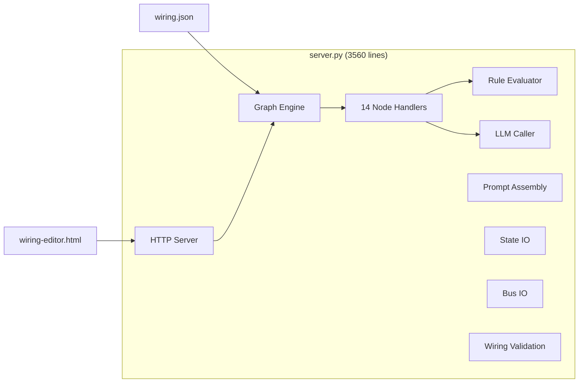
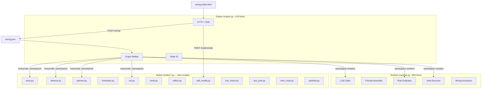
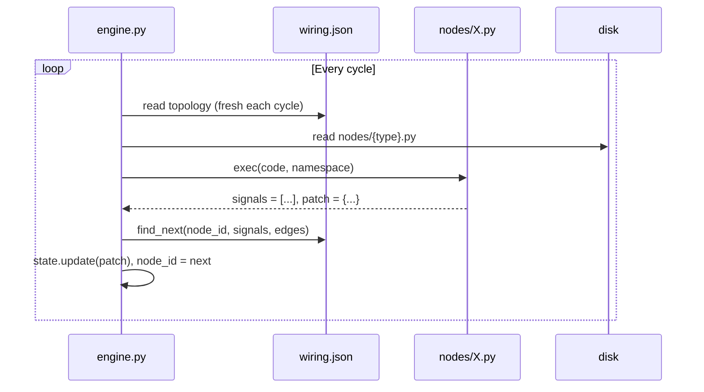

# endgame-ai

An autonomous desktop operator that replaces human keyboard/mouse interaction with an AI agent navigating a graph of capabilities. It observes the screen, plans multi-step tasks, executes desktop actions, and verifies outcomes — all steered by a JSON wiring file editable through a visual graph editor.

## Vision

**One sentence:** A self-modifying AI agent that operates your desktop like a human would — planning, clicking, typing, verifying — but faster, cheaper, and 24/7.

### Real-World Use Cases

| Use Case | What It Does |
|----------|-------------|
| Browser automation | Opens URLs, fills forms, clicks buttons, reads results |
| App orchestration | Launches apps via Win+R, types content, saves files |
| Multi-step research | Opens browser → navigates to site → extracts data → stores in memory |
| LLM relay | Receives prompts via file → types into browser AI chat → captures response → writes back |
| Self-improving agent | When stuck, modifies its own wiring/prompts to overcome the obstacle |

### Multi-Provider LLM Architecture

The system is LLM-backend agnostic. It talks to intelligence through pluggable transports:

- **openai** — Any OpenAI-compatible API (LM Studio, Ollama, vLLM, OpenRouter, etc.)
- **file_proxy** — Write prompt to disk, external process fills response (enables ANY provider)
- **browser_ai** — Types prompts directly into browser-based AI GUIs (Grok, ChatGPT, Claude web)

This means: if you can access an LLM through ANY interface (API, GUI, file), endgame-ai can use it.

## Current Architecture (server.py monolith)



**Problems:**
- 3560-line god file — every change risks the whole system
- Adding a new node type requires editing server.py
- Cannot hot-create new capabilities at runtime
- Self-modify can add nodes to topology but cannot create new node TYPES
- Tight coupling between engine, handlers, and utilities

## Target Architecture (modular exec-based)



### Execution Model



### Node Contract

Every node is a bare Python script. No classes, no decorators, no boilerplate.

**Input** (injected into exec namespace):
- `state` — current graph state dict
- `config` — this node's topology entry from wiring.json

**Output** (set as variables in the script):
- `signals` — list of signal strings (e.g. `["screen_ready"]`)
- `patch` — dict to merge into state (e.g. `{"screen": "..."}`)

**Available in namespace** (injected by engine):
- `llm(system, user, temperature=None)` — call LLM
- `observe_screen()` — capture desktop
- `execute_verb(verb, target, value)` — desktop action
- `evaluate_rules(phase, state, wiring)` — run rule engine
- `wiring` — current wiring.json dict
- `load_system_prompt(circuit, state, node)` — prompt assembly
- `build_user_message(circuit, state, node)` — dynamic user message
- `save_state(state)` — persist state
- `time`, `json`, `re`, `pathlib` — stdlib essentials

**Example — nodes/observe.py:**
```python
screen = observe_screen()
meta = last_observation_snapshot()
patch = {"screen": screen}
if meta:
    patch["screen_meta"] = meta
signals = ["screen_ready"]
```

**Example — nodes/entry.py:**
```python
signals = ["ready"]
patch = {}
```

**Example — nodes/scheduler.py:**
```python
steps = state.get("plan", [])
idx = state.get("step", 0)
if idx >= len(steps):
    signals = ["plan_complete"]
    patch = {}
else:
    signals = ["step_ready"]
    patch = {"current_step": steps[idx], "step_goal": steps[idx]["description"]}
```

### Self-Modify Killer Feature

With this architecture, `self_modify.py` can:
1. Ask LLM to generate Python code for a new capability
2. Write it as `nodes/new_capability.py`
3. Add node + edges to wiring.json
4. Next cycle: engine reads new wiring, finds new node file, exec's it

**The AI creates its own brain modules at runtime. No restart. No deploy.**

### Why exec() and Not importlib

| | exec() | importlib |
|---|--------|-----------|
| Hot-swap | Automatic (reads file each time) | Requires explicit reload() |
| Caching | None (always fresh) | Must manage cache invalidation |
| Namespace | Full control over what's available | Module-level globals persist |
| Simplicity | `exec(open(f).read(), ns)` | `importlib.import_module(); reload()` |
| Constraint | None (unconstrained by design) | Import system rules apply |

## File Structure After Refactor

```
endgame-ai/
├── engine.py              (~100 lines) — graph walker, HTTP, SSE, state IO
├── runtime.py             (~800 lines) — LLM, prompts, rules, verbs, utilities
├── desktop.py             (unchanged)  — Windows UI automation
├── actions.py             (unchanged)  — verb registry + screen capture
├── colony.py              (unchanged)  — multi-slot launcher
├── wiring-editor.html     (minor add)  — + node creation via API
├── wiring.json            (unchanged)  — topology, prompts, rules, config
└── nodes/                               — one file per capability
    ├── entry.py           (~3 lines)
    ├── observe.py         (~15 lines)
    ├── planner.py         (~50 lines)
    ├── scheduler.py       (~12 lines)
    ├── act.py             (~150 lines)
    ├── verify.py          (~70 lines)
    ├── reflect.py         (~45 lines)
    ├── bus_check.py       (~20 lines)
    ├── bus_post.py        (~20 lines)
    ├── moe_route.py       (~25 lines)
    ├── self_modify.py     (~55 lines)
    ├── satisfied.py       (~8 lines)
    ├── llm_request_check.py (~30 lines)
    └── llm_response_write.py (~25 lines)
```

**Line counts:**
- Before: 3560 (server.py) + 289 (actions.py) + 1623 (desktop.py) = 5472 lines
- After: ~100 (engine) + ~800 (runtime) + ~528 (nodes/) + 289 (actions) + 1623 (desktop) = 3340 lines
- Net reduction: ~2130 lines (~39% smaller)

## Implementation Checklist

### Phase 1: Create engine.py (the new core)
- [ ] Graph walker loop (exec-based, reads .py fresh each cycle)
- [ ] Namespace injection (state, config, all runtime functions)
- [ ] Edge resolution (find_targets from wiring topology)
- [ ] HTTP server (all existing endpoints: /health, /wiring, /state, /run, /step, /pause, /resume, /events SSE, /node/*, /inspect, /bus, /slots, /system)
- [ ] State IO (save/load state.json, atomic writes)
- [ ] SSE push system
- [ ] Run queue + worker thread
- [ ] Pause/resume mechanism

### Phase 2: Create runtime.py (shared utilities)
- [ ] LLM caller (openai, file_proxy, browser_ai transports)
- [ ] Prompt assembly (load_system_prompt, build_user_message, resolve_prompt_blocks)
- [ ] Rule evaluator (evaluate_rules + all 46 RULE_CHECKERS)
- [ ] Wiring accessors (wiring_limit, wiring_error, validate_wiring)
- [ ] Reasoning storage (reasoning_patch, clear_reasoning_patch, parse_circuit_response)
- [ ] Action normalization (normalize_actions_from_wiring)
- [ ] Token budget management (_context_budget, block truncation)
- [ ] Model config management (normalize, reload, persist, transport switching)
- [ ] File proxy / relay infrastructure
- [ ] Bus read/write
- [ ] Trace recording (append_trace, recent_traces)
- [ ] Raw logging

### Phase 3: Extract nodes/*.py (14 modules)
- [ ] entry.py — trivial (return ready)
- [ ] observe.py — call observe_screen with retry logic
- [ ] planner.py — LLM call + step extraction + retry logic
- [ ] scheduler.py — pure state: advance plan step index
- [ ] act.py — LLM call + verb execution + target validation + rules
- [ ] verify.py — re-observe + preflight rules + LLM fallback
- [ ] reflect.py — retry/replan/escalate decision tree
- [ ] bus_check.py — poll bus for interrupts
- [ ] bus_post.py — write telemetry to bus
- [ ] moe_route.py — goal routing between slots
- [ ] self_modify.py — LLM-generated wiring patches + NEW: .py file creation
- [ ] satisfied.py — terminal state check
- [ ] llm_request_check.py — relay request polling
- [ ] llm_response_write.py — relay response writing

### Phase 4: Update HTML (wiring-editor.html)
- [ ] Add Node button: prompt for type, show available types from /health
- [ ] Add Node button: offer "create new type" which scaffolds a .py file
- [ ] POST /node/create endpoint in engine.py (writes template .py to nodes/)
- [ ] Keep all existing functionality unchanged

### Phase 5: Validation & Cleanup
- [ ] Run existing wiring.json through new engine — verify same behavior
- [ ] Test hot-swap: edit a node .py while running, confirm new code picked up
- [ ] Test self_modify: verify it can create nodes/new_type.py + wire it in
- [ ] Delete server.py
- [ ] Update .gitignore to whitelist nodes/ directory
- [ ] Verify wiring-editor.html still works with new engine endpoints

## Risks & Mitigations

| Risk | Impact | Mitigation |
|------|--------|-----------|
| exec() performance (re-read files each cycle) | Microseconds per read; LLM calls dominate at 2-15s | Non-issue |
| Shared state between nodes (globals) | Namespace is fresh each exec — no bleed | By design |
| Runtime errors in node .py crash the loop | Wrap exec in try/except, emit error signal | Engine catches |
| Circular imports in runtime.py | runtime.py imports nothing from nodes/ | Layered deps |
| HTML node creation = arbitrary .py files | Desired behavior (unconstrained by design) | Feature, not bug |

## Migration Strategy

**Approach:** Build new system alongside old. Switch when proven equivalent.

1. Create `engine.py`, `runtime.py`, `nodes/` — all new files
2. Both `server.py` and `engine.py` exist simultaneously
3. Test `engine.py` with same wiring.json — confirm identical behavior
4. Delete `server.py` when satisfied
5. Rename `engine.py` if desired

**Rollback:** `git revert` — server.py is preserved in git history.

---

## Handover Prompt (for next session)

> **CONTEXT:** You are implementing the modular exec-based architecture for endgame-ai. The plan is in this README.md. The current system is a 3560-line server.py monolith that works but needs to be decomposed into engine.py + runtime.py + nodes/*.py modules.
>
> **BEFORE CODING:**
> 1. Re-read this README.md for the full plan
> 2. Re-read server.py (3560 lines) — the source of truth for current behavior
> 3. Re-read actions.py and desktop.py — these stay unchanged
> 4. Re-read wiring.json — the topology/prompts/rules that drive everything
> 5. Re-read wiring-editor.html — the visual editor that must keep working
>
> **IMPLEMENTATION ORDER:**
> 1. Create `nodes/` directory with all 14 node modules extracted from server.py handlers
> 2. Create `runtime.py` with shared utilities extracted from server.py
> 3. Create `engine.py` with the exec-based graph walker + HTTP server
> 4. Test: run engine.py, hit same endpoints, verify same behavior as server.py
> 5. Update wiring-editor.html with node creation capability
> 6. Delete server.py
>
> **KEY PRINCIPLES:**
> - Nodes are bare scripts: set `signals` and `patch` variables, no def/class required
> - Engine injects namespace with: state, config, llm(), observe_screen(), execute_verb(), evaluate_rules(), wiring, save_state(), time, json, re, pathlib
> - exec() reads .py fresh each cycle — automatic hot-swap
> - wiring.json is re-read each cycle — live topology changes
> - No safety constraints on exec — unconstrained by design
> - self_modify can write new .py files to nodes/ directory
> - HTML can scaffold new node .py files via POST /node/create
>
> **SUCCESS CRITERIA:**
> - `python engine.py` serves on same port, same endpoints
> - wiring-editor.html works unchanged (fetches /wiring, /state, /events, POSTs /step /run etc.)
> - All 14 node behaviors identical to server.py handlers
> - Hot-swap proven: edit nodes/observe.py while running → new code executes next cycle
> - Self-modify proven: self_modify.py creates new node file + wires it in topology

---

*This document replaces the previous 700-line narrative README. It is the implementation plan.*
