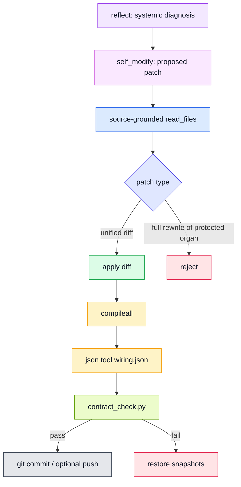
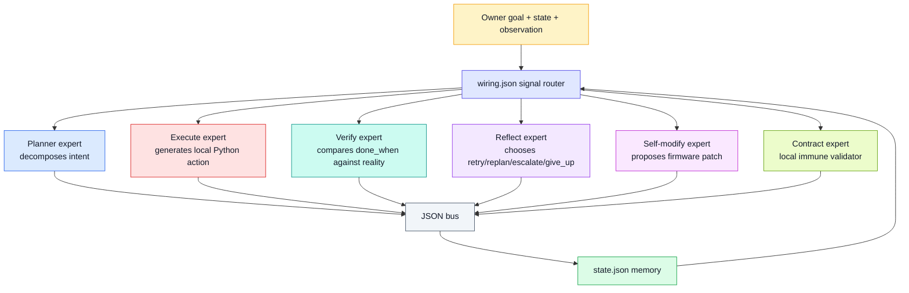

# endgame-ai

> A local computer-control organism.
>
> Python is the body. The desktop is the world. `wiring.json` is the nervous system. JSON records are the bus. Git is firmware memory. Grok is a reasoning organ, not the organism itself.

---

## Current truth

endgame-ai is no longer only an idea.

It has already demonstrated the essential closed loop:

```text
human goal -> plan -> observe -> execute -> verify -> reflect -> retry -> execute -> verify
```

It has also demonstrated, in an earlier harder run, that it can escalate into self-modification, write repository changes, commit to git, and push to a remote GitHub repository. That earlier run failed because self-modification was too powerful before the immune system was strong enough. That failure is now part of the data model of the project.

The latest hardening patch assumes this truth:

> A self-evolving organism is not safe merely because it compiles. It must prove that its organs still satisfy their contracts after mutation.

The current system therefore treats self-modification as firmware surgery and `contract_check.py` as the immune system.

---

## Why this project exists

Most "agents" are prompts wrapped around tools.

endgame-ai is built around a different premise:

```text
The model is not the agent.
The loop is not the agent.
The organism is the agent.
```

A real local assistant needs:

- a body that can act on the computer,
- sensors that can inspect the desktop,
- structured organs that specialize by role,
- a bus contract between organs,
- verification after action,
- reflection after failure,
- firmware self-modification through git,
- and an immune system that rejects self-harm.

This project is a working attempt to make that real on a normal desktop.

It is intentionally simple.

The design should stay closer to electronics than to enterprise software.

---

## The organism metaphor

```mermaid
flowchart LR
    Human["🧑 owner goal"]:::human --> Planner["🧠 planner organ"]:::brain
    Planner --> Scheduler["⏱ scheduler"]:::logic
    Scheduler --> Observe["👁 observe sensor"]:::sensor
    Observe --> Execute["🦾 execute actuator"]:::actuator
    Execute --> Verify["✅ verify comparator"]:::verify
    Verify -->|step_confirmed| Scheduler
    Verify -->|step_denied| Reflect["🪞 reflect diagnostic"]:::reflect
    Reflect -->|retry| Observe
    Reflect -->|replan| Planner
    Reflect -->|escalate| SelfModify["🧬 self_modify firmware"]:::firmware
    SelfModify --> ContractCheck["🛡 contract_check immune system"]:::immune
    ContractCheck -->|valid| Git["🌐 git commit / push"]:::git
    ContractCheck -->|invalid| Rollback["↩ rollback"]:::danger
    Git --> Planner

    classDef human fill:#fef3c7,stroke:#f59e0b,color:#111827;
    classDef brain fill:#dbeafe,stroke:#2563eb,color:#111827;
    classDef logic fill:#e0e7ff,stroke:#4f46e5,color:#111827;
    classDef sensor fill:#dcfce7,stroke:#16a34a,color:#111827;
    classDef actuator fill:#fee2e2,stroke:#dc2626,color:#111827;
    classDef verify fill:#ccfbf1,stroke:#0d9488,color:#111827;
    classDef reflect fill:#f3e8ff,stroke:#9333ea,color:#111827;
    classDef firmware fill:#fae8ff,stroke:#c026d3,color:#111827;
    classDef immune fill:#ecfccb,stroke:#65a30d,color:#111827;
    classDef git fill:#e5e7eb,stroke:#374151,color:#111827;
    classDef danger fill:#ffe4e6,stroke:#e11d48,color:#111827;
```



The important idea is not that a model is "smart."

The important idea is that each organ has a small role and emits a typed record onto a bus.

---

## Bus contract

Every node is a chip.

Every chip receives context and emits one packet.

```text
Node input:  ctx
Node output: signal + patch
LLM record:  record_type + data
Router:      wiring.json topology
Memory:      state.json
Trace:       runtime logs
```

A minimal output looks like:

```python
return bus.emit(
    "step_confirmed",
    {
        "last_verification": {
            "success": True,
            "signal": "step_confirmed",
        }
    },
    record=record,
)
```

The bus is not decorative.

It is the organism's electrical protocol.

If a prompt emits the wrong field, the Python node cannot route the signal. If a node emits a signal not present in topology, the bus must reject it. If a self-modification removes a required organ function, the immune system must reject it.

---

## What happened in the July 3 destructive run

Before the latest hardening, endgame-ai performed a long, ambitious desktop-and-GitHub run.

That run proved the system could:

- operate a real Windows desktop,
- call Grok as a structured reasoning organ,
- use observations to judge the screen,
- escalate repeated failure into `self_modify`,
- write repository changes,
- commit to git,
- push to a remote GitHub repository,
- and continue after mutation.

It also proved the most dangerous failure mode:

> Python syntax validation is not organism validation.

A self-modification replaced critical organs with tiny files that compiled but no longer satisfied the organism contract. The project learned that `desktop.py`, `execute.py`, and other core organs must not be fully rewritten without contract validation.

That failure is not ignored.

It became the reason for the immune system.

---

## Current immune-system principle

Self-modification is allowed, but not trusted.

The LLM may propose.

The local organism validates.

Git records.

The immune system decides whether the body still lives.



The latest hardening expects:

- `contract_check.py` exists.
- Existing Python organs are modified by unified diffs, not whole-file replacement.
- Protected core files cannot be replaced with compiling stubs.
- Touched existing files must be declared in `read_files`.
- New wiring paths are rejected unless schema-approved or explicitly experimental.
- Raw GitHub source access is allowed for source-grounded self-modification.
- Local checkout and local contract checks are authoritative.

Grok can advise.

Grok cannot bypass the organism's immune system.

---

## Latest basic run: Notepad task

The latest uploaded run was intentionally smaller.

Goal:

```text
open notepad and write a short paragraph about endgame-ai
```

The run lasted about forty seconds and produced eight Grok calls.

### Request counts

| Organ | Calls |
|---|---:|
| planner | 1 |
| execute | 3 |
| verify | 3 |
| reflect | 1 |
| self_modify | 0 |
| frame_action | 0 |

### Signal / conclusion counts

| Signal or conclusion | Count |
|---|---:|
| step_ready | 1 |
| EXECUTE | 3 |
| step_denied | 1 |
| retry | 1 |
| step_confirmed | 2 |

### Token shape

| Metric | Value |
|---|---:|
| Requests | 8 |
| Prompt tokens | 7932 |
| Completion tokens | 956 |
| Reasoning tokens | 2964 |
| Cached prompt text tokens | 832 |
| Total tokens | 11852 |
| Cost ticks reported by xAI logs | 188414000 |

Do not treat cost ticks as a public price quote in this README. They are preserved as internal log accounting.

---

## Timeline of the latest run

```mermaid
sequenceDiagram
    autonumber
    participant Owner
    participant Planner
    participant Execute
    participant Verify
    participant Reflect
    participant Desktop

    Owner->>Planner: "open notepad and write a short paragraph about endgame-ai"
    Planner-->>Owner: plan: launch notepad, then type paragraph
    Execute->>Desktop: subprocess.Popen(["notepad.exe"])
    Verify->>Desktop: observe desktop tree
    Verify-->>Reflect: step_denied: Notepad not visible yet
    Reflect-->>Execute: retry: likely timing/visibility gap
    Execute->>Desktop: Notepad now focused; type paragraph
    Verify->>Desktop: observe Notepad window
    Verify-->>Owner: step_confirmed
    Execute->>Desktop: append more sentences
    Verify->>Desktop: observe Notepad editor/title
    Verify-->>Owner: step_confirmed
```

The key behavior is not "Notepad opened."

The key behavior is that the organism did not blindly trust its first action result.

It launched Notepad. Verification did not see Notepad yet, so it denied success. Reflection did not panic and did not call self-modify. It classified the failure as likely timing/visibility and chose `retry`. On retry, the desktop showed Notepad focused, and execute used that new state to type the paragraph.

That is the loop working.

---

## What the latest run proves

### 1. The planner is not hardcoded to Notepad

The human goal named Notepad.

The planner converted that goal into two observable steps:

1. launch Notepad,
2. type a paragraph about endgame-ai.

This is expected, not hardcoding.

The important property is that the step list was created from the goal and grounded in observable `done_when` conditions.

### 2. Execute generated runtime code from context

The first execute call generated:

```python
import subprocess
subprocess.Popen(["notepad.exe"])
result = {"action": "launched_notepad"}
```

The later execute call generated `type_text(...)` because the fresh observation showed Notepad focused.

That means execute changed behavior based on observation, not a fixed script.

### 3. Verify refused false success

After `subprocess.Popen`, verify did not accept `last_result` as proof.

It checked the desktop tree and denied the step because Notepad was not visible yet.

That is essential.

The organism cannot become real if it trusts action reports more than reality.

### 4. Reflect chose the correct recovery class

Reflect emitted `retry`, not `escalate`.

That matters because the earlier destructive run showed over-escalation can turn into unnecessary self-modification. In the latest run, the organism treated a transient timing issue as a transient issue.

That is progress.

### 5. Self-modify stayed inactive

No self-modify call occurred in this simple run.

That is good.

The immune-system patch should make self-modify safer, but the best self-modify is one that does not activate for ordinary UI timing friction.

### 6. Prompt identity improved behavior

The organ prompts now include shared identity:

```text
specialized, stateless organ
local computer-control organism
Python is the body
desktop is the world
wiring.json is the nervous system
JSON records are the bus
git is firmware memory
```

The logs show all organs returned the expected typed records:

- `plan`
- `execution`
- `verification`
- `reflection`

The responses were not empty tiny fragments. They included useful reasoning while keeping the machine-readable `data` fields exact.

---

## What the latest run does not prove yet

This was a basic test.

It does not prove:

- robust browser operation,
- reliable social posting,
- complex website navigation,
- successful self-modification under the new immune system,
- remote GitHub source browsing inside a self-modify run,
- long-horizon task completion,
- or safe operation across many unrelated desktop apps.

It proves a smaller but important thing:

> The hardened organism is not worse than before. It still acts on the desktop, still routes records correctly, still verifies reality, and now avoids unnecessary self-modification for a recoverable failure.

That is enough to justify the next harder run.

---

## Honest issue discovered in the latest run

The run also showed a subtle problem.

During retry, execute saw Notepad focused while the current step was still technically "Launch notepad.exe." It opportunistically typed the paragraph before the scheduler had formally advanced to the second step.

This was useful in this case because it moved toward the goal. But it is architecturally important.

Future improvement:

```text
Allow opportunistic progress, but make it explicit.
```

For example, execution could return:

```json
{
  "record_type": "execution",
  "data": {
    "conclusion": "EXECUTE",
    "progress": "advanced_beyond_current_step",
    "code": "..."
  }
}
```

Then verify/scheduler can decide whether to confirm one step, advance two steps, or require explicit verification of the second condition.

Do not suppress adaptive behavior.

Formalize it.

---

## Another verification limitation

The final verify concluded that Notepad contained multiple sentences mentioning endgame-ai.

The evidence was strong enough for a basic demo:

- focused title changed to a Notepad document title derived from the typed text,
- the document/editor element existed,
- last action was `type_text`,
- no error occurred.

But the desktop tree did not necessarily expose the full text buffer.

For stronger verification, future verifier/body should support a text-reading canary for editors:

```text
select all -> copy -> inspect clipboard
```

or a UIA text pattern when available.

This is not a failure.

It is the next precision upgrade.

---

## System-level MoE analysis

This project should be understood as a system-level mixture of experts.

Not necessarily MoE inside the neural network.

The explicit MoE is the topology.



### Planner expert

Strength:

- Converts vague human request into observable local steps.
- Keeps `done_when` visible and testable.

Risk:

- Can overfit to current UI or make too-large steps.

Current verdict:

- Worked correctly in the Notepad run.

### Execute expert

Strength:

- Produces small Python snippets.
- Uses local capability runtime.
- Adapts to fresh observation.
- Does not need external tool frameworks.

Risk:

- Can progress beyond current scheduler step.
- Can use action result as if it were reality unless verify catches it.
- Needs better "wait then observe" patterns for slow UI.

Current verdict:

- Worked and adapted. Needs explicit opportunistic-progress contract.

### Verify expert

Strength:

- Denied false success after launch.
- Confirmed visible desktop conditions.
- Kept machine-readable `success` and `next_signal`.

Risk:

- May over-confirm content when desktop tree does not expose exact text buffer.

Current verdict:

- Stronger than before. Needs deeper content-reading support.

### Reflect expert

Strength:

- Correctly classified first failure as retry.
- Did not escalate into self-modify.
- Produced useful lesson and diagnosis.

Risk:

- In advanced tasks, it may still escalate too often unless failure streak and contract evidence are precise.

Current verdict:

- Major improvement versus the destructive run.

### Self-modify expert

Strength:

- Proven in earlier run to be capable of generating and applying repository changes.

Risk:

- Historically dangerous without contract validation.

Current verdict:

- Should remain enabled only with immune checks.

### Contract / immune expert

Strength:

- Converts "compiles" into "organism still has organs."
- Blocks protected full rewrites.
- Forces source-grounded modifications.

Risk:

- Needs to grow as new organs appear.

Current verdict:

- The next essential layer.

---

## Is the project progressing?

Yes.

The evidence says progress is real.

### Before hardening

The organism could self-modify, but it could also destroy critical organs with compiling stubs.

### After hardening

The basic desktop loop still works, but reflection is less reckless and self-modify is protected by contract checks.

### Proof of improvement

The latest run contained a failure:

```text
Notepad launch returned success-like result, but Notepad was not yet visible.
```

An immature system would do one of three bad things:

1. hallucinate success,
2. repeat the same action blindly forever,
3. escalate to self-modify too early.

endgame-ai did none of those.

It denied the step, reflected, chose retry, then completed the task.

That is progress.

### What remains unproven

The system is not yet proven on a complex long-run browser/GitHub/social workflow after the immune patch.

That must be tested next.

But the correct conclusion is:

```text
The organism is alive enough to harden, not dead enough to abandon.
```

---

## Current recommended next scenario

Do not jump immediately to public posting.

The next run should be harder than Notepad, but not chaotic.

Recommended goal:

```text
Use the currently focused browser to open Grok or another accessible AI page. Ask for one recent AI or technology news item. Write a short X-style post and a LinkedIn-style post into a local text file. Verify the file exists and contains both sections. Do not publish externally in this run.
```

This tests:

- browser navigation,
- using an AI site,
- text synthesis,
- file creation,
- verification,
- without social-site friction.

After that:

```text
Open X and LinkedIn composers and paste draft-ready text, but stop before final publish unless the composer is already logged in and visible.
```

After that:

```text
Publish.
```

---

## Development rules from now on

1. Keep the bus small.
2. Keep organs specialized.
3. Keep prompts source-grounded.
4. Verify reality after action.
5. Reflect before self-modifying.
6. Self-modify only with source content.
7. Never trust compilation as sufficient validation.
8. Use `contract_check.py` before commit and push.
9. Allow Grok to advise, but keep local validation authoritative.
10. Treat every failure as data.

---

## Operator checklist

Before a run:

```bash
python -m compileall -q .
python -m json.tool wiring.json
python contract_check.py
git status
```

After a run:

```bash
python export_workspace_text.py
git log --oneline --decorate -20
git status
```

Before force-pushing a rewritten clean history:

```bash
git fetch origin
git tag before-immune-rewrite-YYYY-MM-DD origin/main
git push origin before-immune-rewrite-YYYY-MM-DD
git push --force-with-lease origin main
```

Use `--force-with-lease`, not plain `--force`, unless you intentionally do not care about replacing remote history.

---

## What this project is becoming

endgame-ai is a cheap local computer-control organism that can do real work on a desktop and evolve through git.

It is not finished.

But it has crossed an important threshold:

- it acts,
- it verifies,
- it reflects,
- it can self-modify,
- and now it is gaining an immune system.

The failure was not embarrassment.

The failure was the first scar.

The scar is now architecture.

The world is not waiting for another chatbot.

The world needs computers that do jobs.

endgame-ai is moving toward that.
