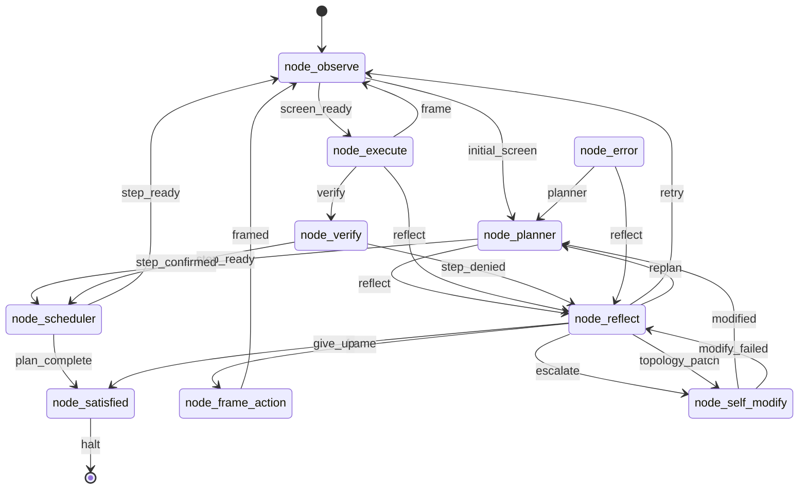

# endgame-ai

`endgame-ai` is a local Windows desktop organism. The tracked repository is part of the prompt sent to the model during self-evolution, so source size is runtime cost.

## Contract

- `core_organism.py` owns the cycle, state writes, stop/deadline checks, topology routing, and self-modify apply/commit/hot-swap.
- `wiring.json` is the single source of truth for model transport, paths, topology, observe config, self-modify config, and organ prompts.
- `core_node_base.py` dynamically loads `node_*.py` modules named by `wiring.json`.
- `core_brain.py` dynamically loads the selected `transport_*.py` module.
- `node_execute.py` runs model-emitted Python through `exec(code, ns)` with GUI, subprocess, filesystem, module, state, wiring, and observation helpers injected by `core_nodes.py`.
- `node_self_modify.py` emits `git_evolution_patch`; `core_nodes.py` applies file writes, deletes, wiring patches, commands, commits them, and updates the configured known-good git ref.
- The organism is intentionally unsafe. Evolution is constrained by code contracts and git mechanics, not by sandboxing or policy guardrails.

## Cycle



Every node emits a signal plus a state patch. `effective_goal` is rewritten through planner, scheduler, execute, frame, verify, reflect, self_modify, and satisfied so the current narrative is carried forward while `state.goal` keeps the root goal.

## Runtime Files

- `runtime_state.json`: resumable state.
- `runtime_control.json`: `run`, `pause`, or `step` control.
- `runtime_events.jsonl`: bus, node, and brain forensics.
- `runtime_stop.json`: stop request.
- `runtime_*.pid`: process registry.

These files are ignored by git and are not part of the prompt surface.

## Start

```powershell
python core_organism.py "goal" --reset --duration-seconds 300
python core_organism.py "continue goal" --duration-seconds 300
```

Selected transport comes from `wiring.json:model.transport`. The default is `transport_xai`; set `XAI_API_KEY` for API mode or change the transport intentionally.
