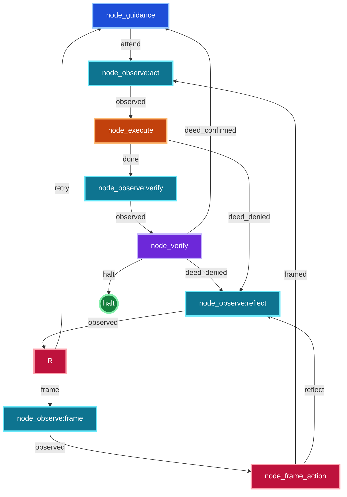
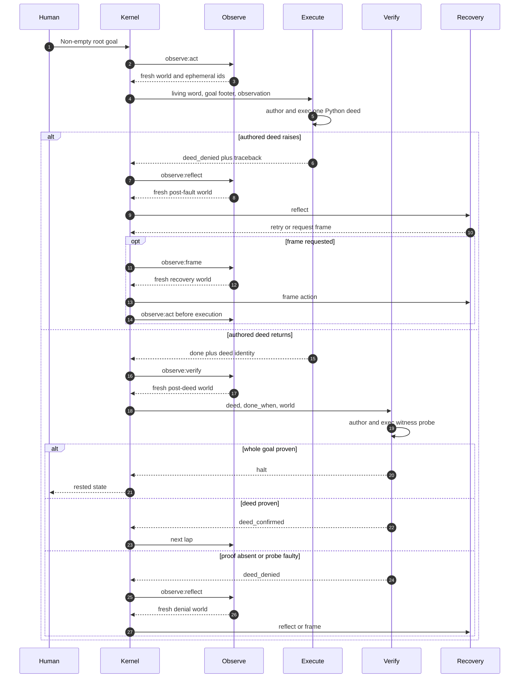
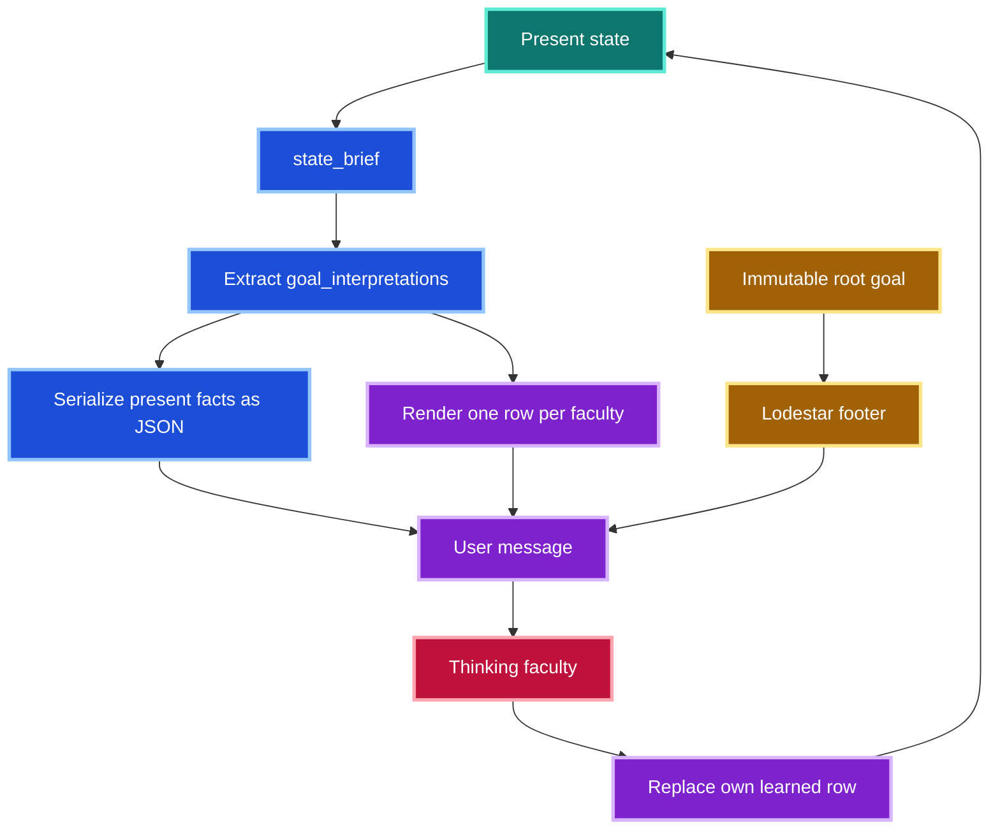
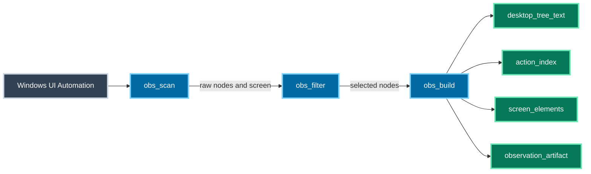
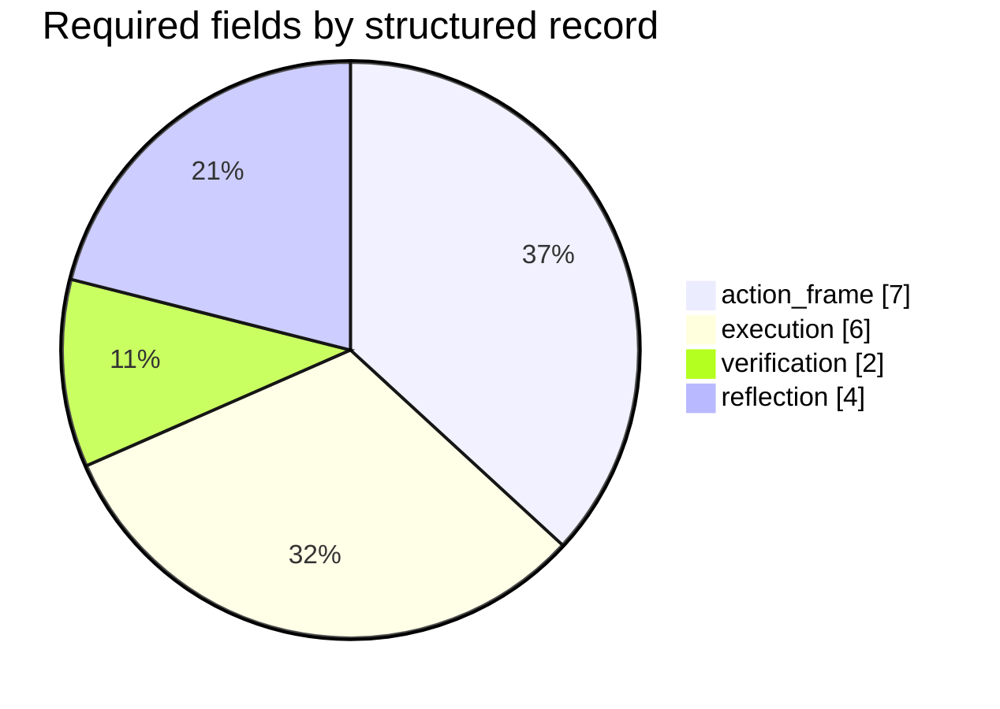
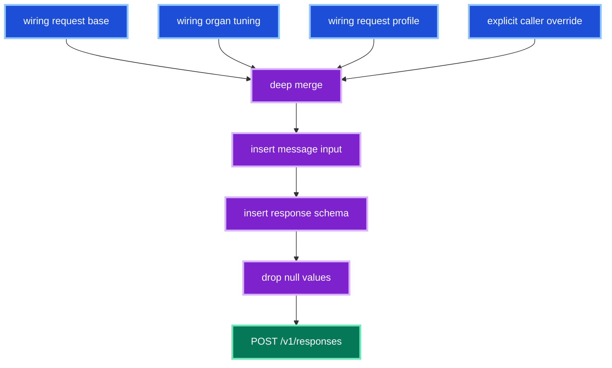
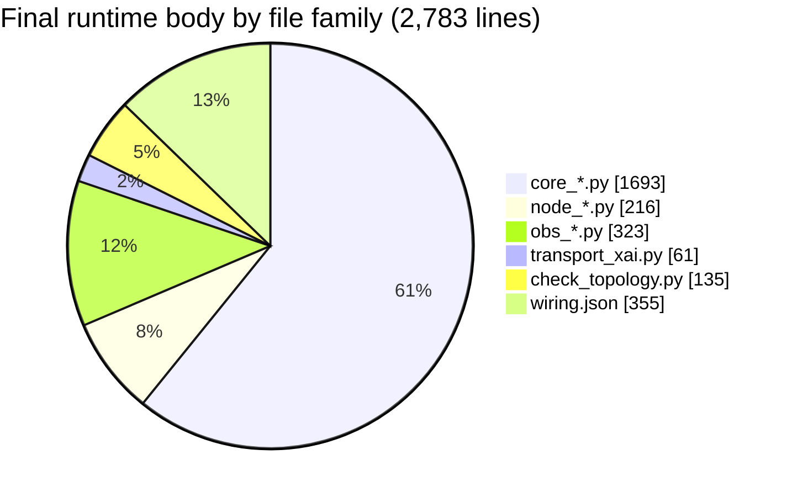
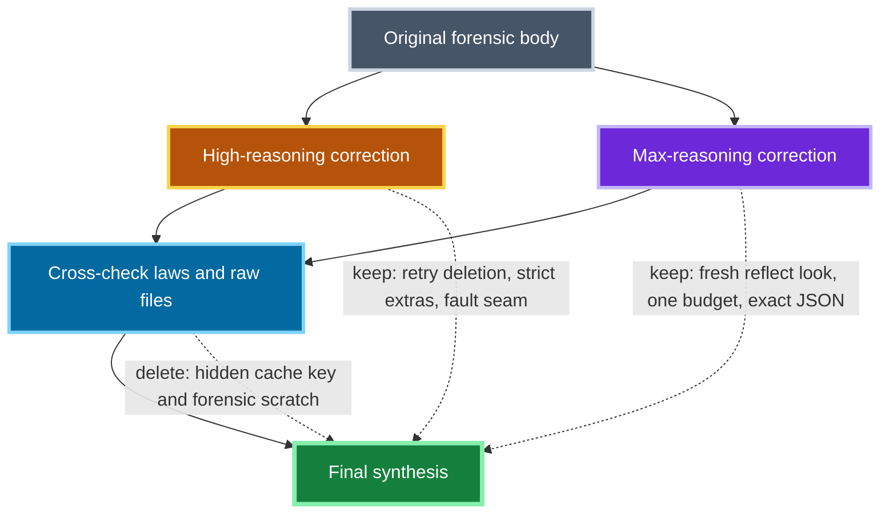
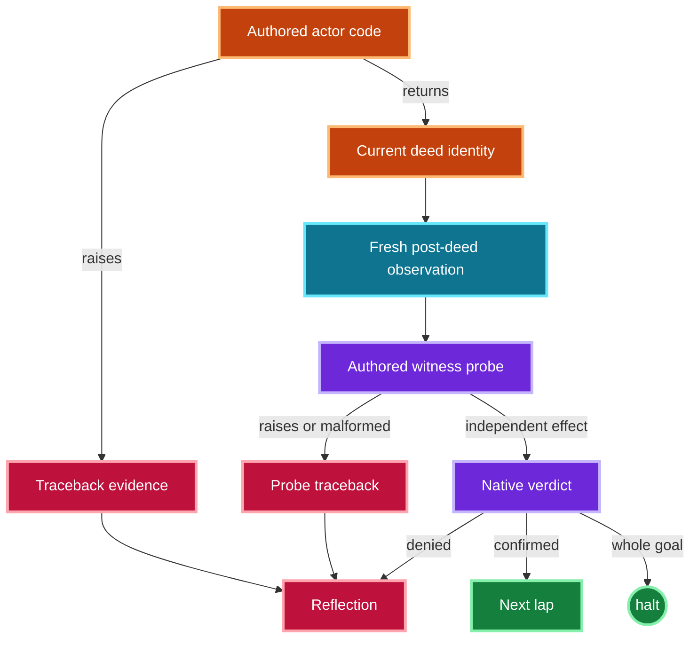

# endgame-ai

> A task-agnostic, self-modifying reasoning organism that inhabits a real Windows desktop through model-authored Python.

This README describes the final reconciled body.

It explains what changed across the original forensic archive, the High-reasoning correction, the Max-reasoning correction, and the final synthesis.

It also explains what happens after a goal is given, how every node and signal participates, how evidence moves, how faults are separated, and how to run the body on its intended Windows wheel.

The live files remain the authority.

If prose and code ever disagree, read `wiring.json`, the node input-contract docstrings, and the implementing Python together.

## Status at a glance

| Property | Final state |
| --- | --- |
| Runtime topology identities | 9 |
| Python node implementations | 5 |
| Observe identities sharing one implementation | 4 |
| Declarative thinking faculties | 1 |
| Structured record contracts | 4 |
| Terminal pass-through faculty | None |
| Executor action model | One authored Python script, immediately executed |
| Verifier action model | One authored Python probe, desktop hand withheld |
| Fresh observations | Immediately before every thinking faculty |
| Expansion size control | One wiring-owned character budget |
| Internal retry counter | None |
| Server-side model capability | Optional xAI web search, presently wired to reflection |
| Request profiles | `observe` and `web_search`, both wiring-owned and low-reasoning |
| Browser whitelist | None |
| Hidden prompt-cache routing key | None |
| Runtime body size | 2,783 lines across Python plus `wiring.json` |
| Commit included | No |
| Live Windows validation included | No; the operator requested packaging without execution |

## The shortest accurate description

The human gives endgame-ai one plain-language goal.

The organism reads optional counsel.

It takes one fresh UI Automation observation.

The execute faculty receives the current living word, the fresh world, and any recovery frame.

It authors a single Python program for the next deed.

That program runs immediately inside an uncaged capability namespace.

If the program raises, its traceback becomes deed-failure evidence.

The wheel takes another fresh observation before reflection reasons about that fault.

If the program returns, the wheel takes a fresh post-deed observation.

The verifier authors a Python probe.

The verifier has no `desktop` object with which to move the world.

Its probe must establish provenance from systems other than the actor.

It must use more than one kind of witness before declaring a thing absent.

It sets a native-Python verdict.

The kernel routes mechanically from that verdict.

A confirmed intermediate deed starts another lap.

A denied deed is observed again before reflection, framing is observed again before it reasons, and a framed deed is observed again before execution.

A proven whole goal emits `halt` directly.

No extra satisfied node is required.

## Why this project is unusual

endgame-ai is not a conventional client-tool-calling agent.

There is no curated host-action menu such as `click_button` or `edit_file` exposed as separate tools.

Python is the deed language.

The xAI transport may offer a wiring-selected server-side `web_search` capability to a thinking faculty; it gathers public knowledge inside that model request and never moves the Windows world.

The live desktop object is one value inside the executor namespace.

The standard library is present.

The current observation is data.

The model may search that data, inspect processes, read files, invoke PowerShell, wait, re-observe, or rewrite the body by authoring ordinary Python.

Self-modification is therefore possible without being a privileged feature or preached objective.

The body does not contain a self-evolution node.

The body does not contain a desktop-task playbook.

The body contains a general wheel, perception, an author-enactor, a witness, and a recovery arc.

## Deliberate operating posture

The executor runs model-authored Python on the host.

The namespace is deliberately uncaged.

The final synthesis adds no sandbox, allowlist, action cap, retry cap, or human-approval checkpoint.

The verifier's desktop hand is withheld because witness and actor have different roles.

That withholding is not a claim that Python itself is sandboxed.

Read-only verification is a behavioral law expressed in its prompt.

The standard library remains powerful.

This distinction is essential to describing the body truthfully.

## Documentation compatibility

This file is ordinary GitHub Flavored Markdown.

GitHub renders Mermaid fenced blocks in repository Markdown files, issues, discussions, pull requests, and wikis.

The diagrams below use conservative flowchart, sequence, state, and pie syntax.

Color is applied with Mermaid `classDef` rules rather than external stylesheets.

GitHub documents Mermaid Markdown support in [Creating diagrams](https://docs.github.com/en/get-started/writing-on-github/working-with-advanced-formatting/creating-diagrams).

GitHub describes a repository README as the place to explain why a project is useful, what it does, and how to use it in [About the repository README file](https://docs.github.com/en/repositories/managing-your-repositorys-settings-and-features/customizing-your-repository/about-readmes).

Mermaid documents node coloring and styling in [Flowcharts Syntax](https://mermaid.js.org/syntax/flowchart.html).

## Reading map

Start with these sections if this is your first encounter:

1. `What happens when a goal is given` for the lived behavior.
2. `Complete final topology` for every node and edge.
3. `The living word` for continuity without chat history.
4. `The deed model` for execution.
5. `The witness model` for proof.
6. `How to run` for the Windows command path.
7. `Version-by-version comparison` for the forensic reconciliation.
8. `File atlas` for ownership by source file.

---

# What happens when a goal is given

## 1. Birth

The process is started with one non-empty goal string.

`core_organism.run()` rejects an empty goal.

It loads `wiring.json` through `core_wiring.load_wiring()`.

Wiring validation happens before the wheel begins.

The initial node is read from `topology.cycle_start`.

In the final body that node is `node_guidance`.

The initial state contains the goal, tick zero, the current node, an empty goal-interpretation table, and the selected transport name.

No prose memory is restored.

No previous response is resumed.

No generated cache-routing key is created.

The life begins from the current wiring and the supplied goal.

## 2. Counsel

`node_guidance` reads the path named by `paths.guidance`.

The default relative path is `guidance.txt`.

If the file is absent or blank, counsel is the empty string.

If counsel exists, the node reads it and clears the file.

Counsel is refusable context, not a replacement goal.

The node emits `attend`.

The wiring sends `attend` to `node_observe:act`.

## 3. The pre-deed look

`node_observe:act` uses the one `node_observe.py` implementation.

It reads the observation law from `wiring.json`.

The observation pipeline loads its named scan, filter, and build phases.

The scan phase gathers raw UI Automation nodes.

The filter phase selects the relevant visible structure.

The build phase creates the readable tree, action index, full searchable element list, and observation artifact.

The observation receives a fresh timestamp.

Short element identifiers are minted for this observation only.

The observe node emits `observed`.

The `node_observe:act` edge sends `observed` to `node_execute`.

## 4. Interpretation before action

The execute node assembles a payload.

The payload includes the immutable root goal.

It includes any action frame.

It includes a compact operational focus.

It includes the fresh observation.

`core_brain.think()` removes the living-word rows from the JSON focus before serialization.

It appends the living-word table once at the tail of the user message.

The root goal appears once beneath the rows as a lodestar footer.

The root goal is not duplicated into stable system context.

The execute prompt and shared prefix come from `wiring.json`.

The consumer input contracts are discovered live from downstream docstrings or declarative descriptions.

The response schema comes from the `execution` record contract.

## 5. Authorship

The model must return exactly one execution record.

The record must contain `perceived`.

The record must contain `alternatives`.

The record must contain `intent`.

The record must contain `done_when`.

The record must contain `code`.

The record must contain `goal_interpretation`.

No surplus execution fields are accepted.

The JSON commitment must be the returned JSON object itself.

Code fences are not recovered.

Embedded JSON fragments are not searched out of surrounding prose.

A malformed record is a body fault.

## 6. Enactment

`node_execute` builds the capability namespace.

It immediately calls Python `exec()` on the authored script.

The actor namespace includes `desktop`.

It includes `action_index`.

It includes `screen_elements`.

It includes observation data.

It includes `consult_model`.

`consult_model(prompt, profile)` resolves only wiring-owned request profiles.

The `observe` profile is a low-reasoning sub-reading for narrowed local data.

The `web_search` profile is a low-reasoning request with xAI's native server-side web search available under a per-request tool-call budget.

It includes `state`, `wiring`, and the goal.

It includes the standard-library modules deliberately placed in the namespace.

Ordinary imports remain available to authored Python.

The script may contain many ordered acts while remaining one deed.

## 7. Honest waiting

Launching a process does not prove that its window is ready.

Opening a URL does not prove that the destination state has materialized.

Loading a model does not prove that the service is listening.

The execute law therefore requires waiting inside the same authored script for a newly summoned thing.

Every script begins by calling `desktop.observe()` again and reacquiring its target from the returned present data.

It must behold the new thing before acting on it or declaring it absent.

It first uses ordinary Python to search `screen_elements`, then calls `desktop.expand()` only for the smallest relevant elements.

Expansion returns whole text and descendants or fails hard with the measured character sizes, allowing the deed to narrow and ask again.

When interpretation remains after mechanical narrowing, the script may send the selected material through the low-reasoning `observe` profile.

The shallow tree alone is not enough for such a judgment.

## 8. Deed success path

If the authored script returns without raising, execute emits `done`.

The current deed becomes the pair of `intent` and `done_when`.

The execute faculty rewrites its living-word row.

The action timestamp is recorded.

Any prior action frame is cleared.

The wiring sends `done` to `node_observe:verify`.

The verifier never judges from the pre-deed observation.

## 9. Deed fault path

If the authored script raises, only the `exec()` seam catches it.

The full traceback is captured.

The deed is not mislabeled successful.

The node emits `deed_denied`.

The wiring does not send that denial directly into reflection.

It first sends it to `node_observe:reflect`.

That fresh observation matters because a partially completed script may already have changed the world.

Reflection therefore reasons from the post-fault world rather than the stale pre-deed world.

## 10. The post-deed look

`node_observe:verify` takes one fresh observation after a non-raising deed.

Topology establishes that causal order directly. No age-insensitive `observation_fresh` boolean is manufactured.

It emits `observed`.

The wiring sends that signal to `node_verify`.

## 11. Probe authorship

The verifier receives the last deed description.

It receives `done_when`.

It receives the current living word.

It receives one fresh observation.

It authors one Python probe.

The verification record contains only `code` and `goal_interpretation`.

No surplus verification fields are accepted.

## 12. Witness execution

The verifier namespace has no `desktop` object.

Bound `observe()` and `expand()` eyes remain available.

The standard library remains available.

Python remains uncaged.

The prompt commands read-only conduct.

The probe must set a global `verdict` mapping.

`goal_satisfied` must be a native Python `bool`.

`deed_confirmed` must be a native Python `bool`.

`reason` must be a non-blank Python string.

String values such as `"false"` are not accepted as booleans.

Lowercase JSON tokens such as `false` raise in Python and become probe-fault evidence.

## 13. Provenance

Actor output is testimony.

Actor `print()` output is testimony.

A value computed only by the actor is testimony.

A value read back from the actor's own variable is testimony.

Proof must come from a system other than the actor.

Examples include a fresh screen state rendered by an application.

Examples include a process with a relevant name and start time.

Examples include a newly listening port.

Examples include a filesystem modification time bound to the deed window.

Examples include Event Log or registry evidence created by another system.

The relevant witnesses depend on the deed.

No fixed witness list is enforced by code.

## 14. Negative claims

A single empty process query proves only that query's blindness.

A single shallow screen proves only what that screen exposed.

A newly launched application may still be materializing.

Before declaring absence, the verifier must wait when appropriate.

It must use more than one kind of witness.

The prompt names process table, screen, ports, logs, registry, and filesystem only as examples.

The model chooses deed-appropriate provenance in Python.

## 15. Mechanical routing

If `goal_satisfied` is true, `node_verify` emits `halt`.

The wiring sends `halt` directly to the terminal sentinel.

If only `deed_confirmed` is true, the node emits `deed_confirmed`.

The wiring sends that signal back to `node_guidance` for another lap.

If neither is true, the node emits `deed_denied`.

The wiring sends that signal to `node_observe:reflect`, then into `node_reflect`.

If the probe itself raises or produces a malformed verdict, its traceback becomes the denial reason.

The probe fault also enters the verifier's living-word row.

## 16. Reflection

Reflection receives the denied deed.

It receives evidence.

It receives the failure streak.

It receives a fresh observation.

For execute faults, freshness comes from `node_observe:reflect`.

For verification denials, a new `node_observe:reflect` scan replaces the earlier verifier input before reflection reasons.

Reflection is assigned the wiring-owned `web_search` profile. Grok may choose its native server-side search when diagnosis requires current public knowledge; local deed proof still belongs to the verifier.

The failure signature is built from deed description and `done_when` only.

Authored code is not part of deed identity.

Verifier prose is not part of deed identity.

When the same deed identity fails again, the streak count climbs.

The reflection law forbids giving a failed strategy a new name and calling it different.

On a repeated failed approach, reflection must emit `frame`.

That signal first enters `node_observe:frame`.

On a genuinely different deed, reflection may emit `retry`.

## 17. Framing

`node_frame_action` is not implemented by a `node_frame_action.py` file.

It is a declarative node defined in `wiring.json`.

Its input contract is the `node_defs.node_frame_action.description` string.

Its prompt comes from `prompts.node_frame_action`.

Its output obeys the `action_frame` contract.

It names the fresh screen summary.

It names a target.

It names a truly other strategy.

It names risk and notes.

It writes its living-word row.

It may emit `framed` through `node_observe:act` and then to execute.

It may emit `reflect` through `node_observe:reflect` and then back to reflection.

## 18. Rest

The wheel rests only when the verifier proves the whole goal.

The verifier emits `halt` directly.

`core_organism` recognizes `halt` as a terminal sentinel.

No `node_satisfied` pass-through is needed.

The returned state records the halted phase and last signal.

The live process then returns to its external caller.

---

# Complete final topology

The topology below includes every wired identity and every terminal route.



## Topology adjacency list

| Source | Signal | Target | Meaning |
| --- | --- | --- | --- |
| `node_guidance` | `attend` | `node_observe:act` | Counsel is folded; look before acting |
| `node_observe:act` | `observed` | `node_execute` | Fresh pre-deed world is ready |
| `node_execute` | `done` | `node_observe:verify` | Script returned; look for effects |
| `node_execute` | `deed_denied` | `node_observe:reflect` | Script raised; inspect the resulting world |
| `node_observe:verify` | `observed` | `node_verify` | Fresh post-deed world is ready |
| `node_observe:reflect` | `observed` | `node_reflect` | Fresh post-fault world is ready |
| `node_observe:frame` | `observed` | `node_frame_action` | Fresh recovery world is ready for framing |
| `node_verify` | `halt` | `halt` | Whole goal independently proven |
| `node_verify` | `deed_confirmed` | `node_guidance` | One deed proven; begin another lap |
| `node_verify` | `deed_denied` | `node_observe:reflect` | Effect not proven; refresh before diagnosis |
| `node_reflect` | `retry` | `node_guidance` | Genuinely different deed may begin from counsel and a fresh look |
| `node_reflect` | `frame` | `node_observe:frame` | Refresh before a new target/strategy frame |
| `node_frame_action` | `framed` | `node_observe:act` | Refresh again before enacting the framed strategy |
| `node_frame_action` | `reflect` | `node_observe:reflect` | Refresh before another diagnosis |

## Why there are nine identities but five node files

Four identities are instances of the same observation implementation.

They are `node_observe:act`, `node_observe:verify`, `node_observe:reflect`, and `node_observe:frame`.

The suffix changes topology identity, not implementation file.

The loader resolves all four through `node_observe.py`.

The declarative `node_frame_action` lives in wiring data.

The remaining Python nodes are guidance, execute, verify, and reflect.

That yields nine topology identities from five Python node files plus one declarative definition.

## Why direct halt is coherent

`halt` is already a kernel sentinel.

The verifier already possesses the independently computed whole-goal verdict.

A terminal node that only converts `goal_satisfied` into `halt` adds no new witness, state, or transformation.

Deleting that pass-through reduces one file, one node contract, one edge, and one opportunity for drift.

The final topology therefore maps the verifier's `halt` signal directly to the sentinel.

## Why the recovery observation identities are essential

An execution script can change the world before raising.

The pre-deed observation cannot reveal those partial effects.

Reflection is a thinking faculty.

The one-fresh-observation law applies before it reasons.

`node_observe:reflect` is therefore not duplication for its own sake.

`node_observe:frame` likewise prevents a slow reflection request from handing an aged screen directly to framing.

Together with the return through `node_observe:act`, they give each thinking faculty a causally adjacent scan.

---

# Goal lifecycle as a sequence



## Lifecycle invariants

- A thinking actor never receives a pre-birth assumption in place of an observation.
- Execute acts from one fresh observation.
- Verify judges from a later fresh observation.
- Reflection after either kind of denial receives another fresh observation.
- Framing receives its own fresh observation.
- A framed deed passes through another act observation before execute.
- The goal string does not grow or mutate.
- The living word is rewritten in place by faculty.
- Element IDs do not survive their observation.
- A successful actor return is not proof.
- A verifier verdict is not accepted unless its native types are exact.
- The whole goal halts only through independent evidence.

---

# The living word

## Purpose

The living word is the goal-interpretation table.

It is the sole durable narrative continuity within a life.

It is not a transcript.

It is not a chain-of-thought log.

It is not an append-only memory.

Each thinking faculty owns one row.

When that faculty acts, it replaces its row.

The table therefore stays small.

## Required content

Each row should state what the world revealed.

It should state what deed was attempted.

It should state how that deed fared.

It should state the present obstacle.

It should state the next true deed.

It should not merely restate the immutable goal.

It should not contain a bare ephemeral ID such as `e7`.

It should name the actual role, place, or meaning of the relevant thing.

## Message placement

The operational focus is built first.

The goal-interpretation mapping is removed from that focus before JSON serialization.

The remaining present facts become JSON.

The living-word table is rendered afterward.

The table is appended to the user-message tail exactly once.

The immutable root goal is rendered exactly once below the rows.

No second root-goal header is injected into stable context.

This ordering makes the learned present precede the lodestar.

## Living-word data flow



## Example of a useful row

> The application window is visible but still reports a busy interaction state; the launch deed returned before readiness, so the next deed must wait and re-observe until the window becomes interactive before selecting the intended control.

## Example of a useless row

> I must complete the user's goal.

The useful row carries world revelation, deed outcome, obstacle, and next deed.

The useless row only echoes the lodestar.

## Relationship to the failure streak

The living word handles semantic learning.

The failure streak handles exact mechanical identity.

The signature contains deed description and `done_when`.

If those exact values recur after denial, the count increases.

Authored code may change without changing deed identity.

Reflection still receives prompt law against semantic renaming.

No embedding index or semantic-history subsystem is added.

---

# The deed model

## One script, one deed

The execute faculty authors one Python string.

The same node immediately executes it.

There is no runner node.

There is no function-calling round trip between authorship and enactment.

A single deed may contain multiple ordered operations.

Its identity is the intended effect and observable completion condition.

## Actor namespace

The actor namespace contains these deliberately supplied names:

| Name | Meaning |
| --- | --- |
| `desktop` | Live desktop object with movement and observation methods |
| `action_index` | Mapping from current ephemeral IDs to element facts and geometry |
| `screen_elements` | Searchable full present scan |
| `desktop_tree_text` | Compact readable observation tree |
| `observation` | Compact observation facts |
| `observed_at` | Observation timestamp |
| `consult_model` | `consult_model(prompt, profile)` through a wiring-owned low-reasoning request profile |
| `state` | Current state snapshot supplied to the node |
| `wiring` | Live wiring object supplied to the node |
| `goal` | Immutable root goal string |
| `repo_root` | Runtime-resolved project directory |
| `python_executable` | Current interpreter path |
| `subprocess` | Standard subprocess module |
| `os` | Standard OS module |
| `sys` | Standard system module |
| `json` | Standard JSON module |
| `time` | Standard time module |
| `pathlib` | Standard path module |
| `hashlib` | Standard hashing module |

This list is not a sandbox boundary.

Authored Python may import other standard-library modules.

## Desktop methods

The live desktop object exposes these methods:

| Method | Purpose |
| --- | --- |
| `click(x, y, hwnd=0)` | Move the pointer and issue a click |
| `type_text(text)` | Write text through clipboard and paste |
| `press_key(key)` | Press one mapped key |
| `hotkey(*keys)` | Press a mapped key combination |
| `scroll(x, y, amount, hwnd=0)` | Scroll at a physical screen point |
| `open_url(browser, url)` | Open with the default handler or a supplied executable |
| `observe(config=None)` | Take a fresh observation |
| `expand(elements, char_budget=None)` | Re-acquire and deeply inspect selected elements |

Unknown key names raise.

An empty hotkey raises.

Out-of-screen coordinates raise.

An empty URL raises.

There is no hardcoded browser installation list.

`browser="default"` uses the Windows URL handler.

Any other browser argument is treated as the executable supplied by the authored deed.

## Rect contract

Every action-index rectangle is a mapping.

Its keys are `left`, `top`, `right`, and `bottom`.

The center calculation is:

```python
rect = entry["rect"]
x = (rect["left"] + rect["right"]) // 2
y = (rect["top"] + rect["bottom"]) // 2
desktop.click(x, y, entry.get("hwnd", 0))
```

Positional access such as `rect[0]` is wrong.

The prior forensic run demonstrated why this exact contract matters.

## Fullness before action

The compact tree is a skeleton.

It includes short previews and true text sizes.

`screen_elements` contains the full present element data selected by the observation pipeline.

The actor may search it with ordinary Python.

`desktop.expand()` re-acquires selected points and harvests their deep subtrees.

The intended progressive look is:

1. call `desktop.observe()` at deed time;
2. use Python predicates over `screen_elements` to narrow by role, name, text, bounds, or another present fact;
3. expand only the smallest relevant entries;
4. if the material still needs semantic reading, give the selected full element to `consult_model(..., "observe")`;
5. repeat with a smaller or different element when the character-budget error reports that the chosen set is too large.

This loop uses data selection and model consultation, not a new desktop tool.

No hidden text truncation is applied inside expand.

The only expansion size control is `expand_char_budget` in wiring.

If the requested harvested text exceeds that budget, expand raises and reports sizes.

There is no `expand_max_nodes` control in the final body.

The standing scan's existing `max_subtree_nodes_per_point` remains a scan-structure control. It is now passed into the correct `harvest_subtree` parameter rather than being mistaken for a parent runtime identifier.

## Summoned things

A newly launched process can exist before its window.

A window can exist before its content is ready.

A service process can exist before a port listens.

An Electron application can own several processes while showing one window.

The actor must therefore wait and re-observe inside the authored script.

The rule is task-agnostic because it applies to any newly summoned thing.

## Actor result versus world result

The actor returning means only that Python did not raise.

It does not mean the intended effect occurred.

The actor printing a message means only that it printed a message.

The verifier alone judges independent effect.

---

# The witness model

## Role separation

The actor changes the world.

The witness judges the changed world.

The actor receives `desktop`.

The witness does not.

The witness receives bound observation eyes.

The witness retains uncaged Python.

This is role separation, not a security sandbox.

## Witness namespace facts

The final kernel reuses the general capability namespace and withholds only the `desktop` value in read-only mode.

It adds bound `observe` and `expand` functions.

Other Python names remain present.

The prompt commands the namespace to be used as eyes.

This final choice differs from the High-reasoning alternative, which constructed an early-return minimal namespace and deep-copied observational data.

The final synthesis rejects that extra machinery because the standard library would remain capable of mutation anyway.

Truthful prompt law is preferred over a partial sandbox claim.

## Exact verdict contract

The authored probe must create:

```python
verdict = {
    "goal_satisfied": False,
    "deed_confirmed": True,
    "reason": "A fresh application window and a process start time both prove the requested launch deed."
}
```

Both boolean values must be native `bool` objects.

The reason must be a non-blank string.

Missing keys are a probe fault.

String booleans are a probe fault.

An empty reason is a probe fault.

A probe exception is a deed denial with traceback.

## Provenance ladder

The following ordering is conceptual, not hardcoded:

1. Actor assertion is weakest.
2. Actor readback is still testimony.
3. One independent witness can prove a positive fact when directly bound to the deed.
4. A negative claim requires multiple witness kinds because blindness is easy.
5. Whole-goal satisfaction requires evidence for every material requirement.

## Examples of deed-bound proof

For a process launch, process name plus start time may prove process creation.

A fresh screen may separately prove window materialization.

A newly listening port may prove service readiness.

For a file deed, an external consumer reading the file may be stronger than the actor reading its own write.

For an application setting, a fresh UI state and an application-owned persisted setting may corroborate each other.

For a network service, process, port, and log event may form independent kinds.

The verifier chooses witnesses appropriate to the deed.

## Positive and negative asymmetry

A fresh screen visibly containing a named window can positively prove that window exists.

A screen lacking that window does not prove it does not exist.

It may be hidden, delayed, on another desktop, or omitted by observation.

Negative verdicts therefore demand more witness diversity.

## Probe-fault preservation

The final verifier captures authored probe exceptions.

It captures malformed verdicts in the same authored-code seam.

The traceback becomes `last_verification.reasoning`.

The verifier living-word row is replaced with the probe-failure lesson.

The wheel emits `deed_denied`.

Reflection receives the fault instead of a body-killing ambiguity.

Malformed model records remain body faults before this seam.

---

# Fault model

## Two fault classes

| Fault class | Examples | Result |
| --- | --- | --- |
| Body fault | Wiring will not load, missing node implementation, malformed structured record, bad transport, invalid topology | Life ends loudly |
| Deed fault | Authored actor script raises, authored verifier probe raises, authored verdict is malformed | Traceback becomes denial evidence and recovery begins |

## Why the distinction exists

An authored script is a proposed deed.

Its failure is information about that deed.

Reflection exists to metabolize that information.

A broken loader or malformed wiring means the organism itself cannot operate coherently.

Continuing after a body fault would falsify the body.

## What fail hard means here

Transport retries are removed.

URL errors raise on the first request.

HTTP errors raise on the first response.

Invalid UTF-8 response bytes raise.

Missing UI Automation constants raise.

Missing observation phase names raise.

Missing node input contracts raise.

JSON code fences are not forgiven.

Surplus structured fields are rejected.

Unknown desktop keys raise.

No body fallback silently invents coherence.

## What fail hard does not mean

It does not mean every authored deed fault kills the life.

The traceback must remain loud and visible.

Routing that traceback to reflection is the intended deed semantics.

It does not convert the fault into success.

It does not suppress the fault.

---

# Observation architecture

## Three swappable phases

The observation implementation is factored into scan, filter, and build phases.

Their module names live in wiring.

The kernel does not hardcode those phase modules.



## Scan phase

`obs_scan.py` samples the screen and UI Automation tree.

It uses wiring-owned scan settings.

It returns raw nodes and physical screen dimensions.

UI Automation constants come from the generated UIA module.

Numeric fallback constants are not carried in the final body.

Task-specific application names are not carried in the final body.

## Filter phase

`obs_filter.py` ranks and limits the standing observation.

It uses general role, depth, interactivity, window, and count rules.

Those standing scan/filter limits are observation-shape configuration.

They are distinct from targeted expansion's single text budget.

## Build phase

`obs_build.py` assigns observation-local IDs.

It builds rectangles as mappings.

It creates readable tree lines.

It exposes full selected text in `screen_elements`.

It exposes interaction state when available.

## Targeted expansion

Expansion begins from one or more current element descriptors or points.

The element is re-acquired from its physical point.

Its full subtree is harvested.

The output is freshly observed evidence.

The aggregate character cost is measured.

If the character budget is exceeded, the call raises.

No per-element node cap exists in final expansion.

## Observation-local identity

An ID such as `e7` is useful only inside the observation that minted it.

Another observation may assign `e7` to a different element.

The living word must therefore carry semantic descriptions, not IDs.

The action index is refreshed with every observation.

---

# Structured records

The model-facing faculties emit four record types.

Every contract rejects additional properties.



## Execution record

Required fields:

- `perceived`: what the touched things actually are.
- `alternatives`: deeds considered and why one was chosen.
- `intent`: the deed identity description.
- `done_when`: the observable condition the witness must judge.
- `code`: the authored Python script.
- `goal_interpretation`: the new execute living-word row.

## Verification record

Required fields:

- `code`: the authored Python witness probe.
- `goal_interpretation`: the proposed verifier living-word row when the probe itself is sound.

The actual verdict is produced by executing `code`.

It is not a model-returned top-level record field.

## Reflection record

Required fields:

- `next_signal`: one wired recovery route.
- `lesson`: what the denial teaches.
- `diagnosis`: the causal defect.
- `goal_interpretation`: the new reflection living-word row.

## Action-frame record

Required fields:

- `next_signal`: one wired frame route.
- `screen_summary`: the relevant fresh world.
- `target`: the semantic target.
- `strategy`: a genuinely other strategy.
- `risk`: `low`, `medium`, or `high`.
- `notes`: actionable counsel.
- `goal_interpretation`: the new frame living-word row.

## Schema construction

`core_brain._record_response_format()` builds strict JSON Schema from wiring contracts.

Required string fields receive non-empty schema floors where declared.

The outer record accepts only `record_type` and `data`.

The inner data object obeys each contract's additional-property rule.

Signal enums can be derived from live outgoing edges.

The provider schema is followed by a transport-neutral local validator.

## Exact commitment

The returned response content must parse as one JSON object.

Whitespace accepted by JSON is acceptable.

Markdown fences are not stripped.

Prose surrounding an object is not searched.

The record type must match the faculty's expected type.

Required data must be present.

Types must match.

Non-empty fields must be non-blank.

Enums must match.

Unexpected fields must be absent.

---

# Request assembly and transport

## One source of request policy

`wiring.json` owns the literal request base.

It owns per-organ partial request bodies.

It owns the transport URL.

It owns model selection and reasoning effort.

Python fills only dynamic input and structured-output format.

The final synthesis removes the generated `prompt_cache_key` lifecycle.

The current body restores two named profiles because they now have live consumers rather than remaining dormant policy.

`observe` lowers reasoning and output cost for narrowed local material.

`web_search` lowers reasoning, offers xAI's native server-side search with automatic choice, and limits built-in calls per request in wiring.

`model.node_profiles` presently assigns `web_search` to `node_reflect`; any thinking node may be assigned a wiring profile without changing Python.

## Request merge order



## Transport behavior

`transport_xai.py` serializes the request as UTF-8 JSON.

It reads `XAI_API_KEY` from the environment.

It sends one HTTP POST.

It does not retry.

It parses the response as strict UTF-8 JSON.

It extracts `output_text` when available.

It otherwise walks typed output items to gather reasoning and message text.

It returns content and reasoning to the brain.

## Output-token settings

Four organs have the same current band:

| Organ | Minimum | Maximum | Reasoning effort |
| --- | ---: | ---: | --- |
| `action_frame` | 1,000 | 32,768 | high |
| `execution` | 1,000 | 32,768 | high |
| `verification` | 1,000 | 32,768 | high |
| `reflection` | 1,000 | 4,096 | low through its assigned profile |

The standing organ bands live in `model.organs`; a wiring-selected request profile may override maximum and reasoning effort for its assigned node.

## `min_output_tokens` caveat

The official xAI Responses documentation exposes `max_output_tokens` in response/request material.

The current official reference does not expose a `min_output_tokens` field.

See the [xAI Responses REST reference](https://docs.x.ai/developers/rest-api-reference/inference/chat).

The retained minimum is an explicit operator experiment from the project mandate.

The first live API call is the truth gate.

If it returns HTTP 400 naming `min_output_tokens` as unknown, delete exactly the four `min_output_tokens` entries from `wiring.json`.

Do not add a compatibility fallback.

Do not add a retry.

The transport should fail on the first rejected request.

## `max_tool_calls` caveat

xAI documents native web search, automatic tool choice, and successful server-side tool invocations as billable events.

The restored profile also sends `max_tool_calls: 4`, the field carried by the supplied transport catalog, so one reflection request cannot elect more than four built-in calls.

The public pages consulted for this correction did not independently expose that field in their prose examples.

The first live reflection request is therefore its truth gate.

If xAI rejects `max_tool_calls`, let the transport fault end the life; do not hide the rejection or silently remove the requested budget.

---

# Runtime body composition

The figures below count only `*.py` plus `wiring.json` in the final package.

They exclude this README, meta descriptions, and forensic logs.



## Elimination trajectory

| Body | Runtime lines | Change from original | Main character |
| --- | ---: | ---: | --- |
| Original forensic archive | 2,969 | — | Broken topology and accumulated drift |
| High-reasoning alternate correction | 2,857 | −112 | Restored terminal node; removed several seams |
| Max-reasoning delivered correction | 2,769 | −200 | Eliminated terminal pass-through and second expansion cap |
| Final reconciled synthesis | 2,728 | −241 | Also removed hidden cache-key lifecycle and distilled stale internals |
| Present truth-restoration | 2,783 | −186 | Restored live profiles, per-thinker looks, progressive reading, and spatial coordinates |

The mandated README is counted separately because its required 1,000+ lines necessarily increase repository documentation size.

The executable organism remains 186 lines below the supplied original archive. Across the complete project, deletion of the redundant node-reference chapter more than offsets the requested runtime restoration.

---

# Version-by-version comparison

## The four bodies compared

The final deduction used four distinct representations.

The first was the original forensic archive supplied for correction.

The second was the High-reasoning `corrected.diff` attachment.

The third was the High-reasoning `endgame-ai-forensic-correction.md` attachment.

The fourth was the previously delivered Max-reasoning corrected tree.

The two High-reasoning attachments were not assumed to be identical.

They were read independently and compared against each other.

The final synthesis was then derived from live file content, not from either report's conclusions.

## Attachment-to-attachment contradiction

The High-reasoning diff and High-reasoning analysis disagree in `core_brain.py`.

The diff changes the transport assignment in `call()` to:

```python
transport, _ = wiring.get_transport_config(w)
```

The same function then passes `cfg` to the transport.

In the tree reconstructed literally from `corrected.diff`, `cfg` is undefined.

That representation would fail on the first model call.

The analysis document's “full content” instead contains:

```python
transport, cfg = wiring.get_transport_config(w)
```

That representation is internally coherent at this line.

No other full-file code block differed between the reconstructed diff and the analysis document.

The final synthesis uses `transport, cfg` because the transport requires the configuration object.

This is an example of why a prose report and its patch must be cross-checked.

## Comparison matrix

| Concern | Original archive | High diff/report | Max correction | Final synthesis |
| --- | --- | --- | --- | --- |
| Missing `node_satisfied.py` | Broken topology | Restored node | Deleted pass-through and routed direct halt | Direct halt retained |
| Fresh observation before every thinker | Missing | Partial | Added only post-execute-fault `observe:reflect` | Completed with denial, frame, and pre-act rewiring |
| Expansion controls | Character budget plus node cap | Retained both | Character budget only | Retained |
| JSON commitment | Fence/subobject recovery | Recovery retained | Exact JSON only | Retained |
| Living-word duplication | Rows serialized and appended; root goal duplicated | Duplication retained | Rows extracted; one table and one footer | Retained |
| Request profiles | Present but unused | Removed from wiring/brain but stale hooks remained | Removed end to end | Restored with live `observe` and `web_search` consumers |
| Transport retries | Present | Removed | Removed | Retained |
| Hidden cache routing | Generated key | Removed | Generated key remained | Removed |
| Browser policy | Hardcoded browser paths and whitelist | Retained | Removed | Retained |
| Task-specific desktop icon names | Present | Retained | Removed | Retained |
| UIA fallback constants | Present | Retained | Removed | Retained |
| UIA typelib recovery | Present | Retained | Removed | Retained |
| Verifier namespace | Desktop withheld, other actor names present | Early-return minimal copy | Desktop withheld, other actor names remained | Restored early-return observational namespace |
| Verifier booleans | Truthiness conversion | Truthiness conversion | Native booleans required | Retained |
| Malformed verifier verdict | Could body-fault or coerce | Non-faulting malformed verdict body-faulted | Authored probe fault routed to reflection | Retained |
| Record extras | Execution/verification allowed extras | Rejected extras | All four reject extras | Retained |
| Downstream docstring syntax error | Swallowed | Raised | Raised | Retained |
| Observation phase defaults | Hidden fallback names | Retained | Exact wiring names required | Retained |
| `open_url` task policy | Known browser list | Retained | Default handler or supplied executable | Retained |
| Runtime lines | 2,969 | 2,857 | 2,769 | Recounted by the packaged tree |

## Original forensic archive

### What it already got right

The original body already had a data-driven topology.

It already had four structured record contracts.

It already separated execution from verification.

It already carried the living-word table mechanism.

It already keyed the failure signature by deed description and `done_when`.

It already had a combined author-and-enact execute node.

It already exposed rectangles as mappings in observation data.

It already contained wait-and-reobserve prompt intent.

It already had a multi-witness verifier prompt direction.

### What was broken

`wiring.json` named `node_satisfied` but the archive lacked `node_satisfied.py`.

The graph therefore failed its own loader before life.

The living-word rows were serialized inside focus and then appended again as a table.

The root goal was also injected as stable context and as the table footer.

The transport carried retry machinery.

The transport docstring carried a large provider API catalog.

Wiring carried dormant request profiles, including server web search.

They earned deletion while dormant. They earn restoration now because reflection is explicitly wired to `web_search` and executor Python can explicitly select either low-cost profile through `consult_model`.

Desktop URL opening carried absolute browser installation paths and a whitelist.

Observation carried a list of named desktop applications.

Targeted expansion carried a second node-count control.

UIA loading attempted recovery instead of failing on the first body fault.

UIA constants had numeric fallback values.

JSON extraction recovered fenced or embedded objects.

Execution and verification records allowed unexpected fields.

The actor prompt described bare expansion calls that were not present in its namespace.

The verifier accepted values through Python truthiness rather than exact native booleans.

An execution fault went directly to reflection without a post-fault observation.

## High-reasoning alternate correction

### Repairs worth keeping

The alternate correction correctly removed transport retries.

It correctly removed the large API catalog.

It correctly removed request profiles while they had no consumer.

It correctly made invalid desktop key inputs raise.

It correctly made downstream docstring parsing fail hard.

It correctly rejected surplus execution and verification fields.

It correctly added a verifier authored-code fault seam.

It correctly distilled several node docstrings.

It correctly noticed that the attached topology could not load without resolving `node_satisfied`.

### Repairs not kept

Restoring `node_satisfied.py` repaired the missing-file symptom but retained an unnecessary terminal pass-through.

The final body instead deletes the topology dependency and routes `halt` directly.

The alternate correction retained direct execute-fault to reflection routing.

That violates the fresh-observation-before-thinking law after a partial deed.

The alternate correction retained `expand_max_nodes`.

The explicit final law names the character budget as the only expansion control.

The alternate correction retained fenced and embedded JSON recovery.

That conflicts with exact structured commitment and fail-hard behavior.

The alternate correction serialized living-word rows twice and root goal twice.

That conflicts with the sole-tail placement law.

The alternate correction retained hardcoded browser paths and application names.

That conflicts with task and environment agnosticism.

The alternate correction retained UIA fallback constants and typelib repair.

That conflicts with fail-hard body semantics.

The alternate correction converted verifier verdict values with `bool()`.

That would make the string `"false"` true.

The alternate correction created an early-return verifier namespace and deep-copied observation data.

The current body restores that role boundary without calling it a sandbox: standard-library Python remains powerful, while actor-owned state, wiring, action index, consulting voice, and desktop hand are not injected into the witness namespace.

The alternate correction left stale profile hooks without live profile data.

The current body restores a complete profile path—validated wiring, node selection, request merge, and executor consultation—so no hook dangles.

The literal diff also introduced the undefined-`cfg` transport defect described above.

## Max-reasoning delivered correction

### Improvements beyond the alternate version

It eliminated `node_satisfied` rather than restoring it.

It added `node_observe:reflect` for post-execution-fault truth.

It removed `expand_max_nodes` end to end.

It removed task-specific desktop icon names.

It removed browser executable paths and whitelist policy.

It removed UIA generated-module recovery.

It removed numeric UIA constant fallbacks.

It required observation phase names from wiring.

It removed then-unused request-profile hooks; the present correction restores them only with live consumers.

It made record JSON commitment exact.

It placed living-word rows and root goal once.

It tightened verifier booleans and non-blank reason.

It routed a malformed verdict through the authored-probe fault seam.

It preserved probe traceback in the verifier living word.

It reduced present focus to facts that earn their place.

It corrected model-facing capability names to `desktop.expand()` and `desktop.observe()`.

### Last remaining drift

It still generated a per-life `prompt_cache_key` in `core_brain.py`.

It reset that identifier from `core_organism.py`.

This was hidden request policy outside `wiring.json`.

The durable meta-law says wiring owns request policy and Python serializes it.

The final synthesis therefore removes the identifier, imports, reset function, reset call, and override injection.

Its internal capability docstring also carried a long restatement of architecture.

The final synthesis distills that internal docstring to one sentence.

## Final reconciled synthesis

The final body retains every repair that survives simultaneous tracing across wiring, contracts, prompts, and code.

It removes the hidden cache-key seam.

It removes the closed conversation checkpoint.

It omits runtime console output, request logs, and run digest from the GitHub-ready package.

Those forensic inputs remain in the source archive from which this reconciliation was made.

The durable meta-description remains as `THE-prompt.md`.

This README becomes the repository-facing explanation and comparison record.

No alternate diff or analysis report is bundled as runtime source.

## Final choice graph



---

# Forensic deductions from the captured run

## Duplicate LM Studio opening

The retained evidence did not prove two top-level LM Studio launches.

Several `LM Studio.exe` process rows do not by themselves prove several application instances.

Electron applications normally use multiple processes for one visible application.

The captured taskbar observation reported one running window.

One later authored restart script intended to focus, close, and relaunch the application.

That script attempted positional rectangle access against a mapping.

It faulted before the close and relaunch operations.

The earliest launch request was absent from the supplied request-log slice.

The human observation of a duplicate opening is therefore important but not causally proven by these artifacts.

The startup-race hypothesis remains plausible.

The general repair is not an LM Studio delay constant.

The general repair is same-script wait, fresh observation, and multi-kind witness before absence.

## Electron process interpretation

Electron's official process model describes a main process and renderer processes associated with windows or embedded content.

See [Electron Process Model](https://www.electronjs.org/docs/latest/tutorial/process-model).

Therefore a process-table count is not a direct application-instance count.

The verifier must combine process evidence with fresh window evidence and, where relevant, ports or logs.

## Emergent self-editing

The captured requests show that the model independently chose to read and write `node_execute.py`.

The prompts did not contain a self-evolution sermon.

This proves the emergence of self-modification attempts as ordinary deeds.

It does not prove beneficial semantic evolution.

The file's later timestamp is consistent with a write.

The retained file content and line-targeting scripts do not prove a meaningful source transformation.

At least one authored rewrite script was syntactically invalid before its write path.

Some writes were consistent with no-op rewrites.

The correct conclusion is narrower than “the system evolved itself.”

The topology allowed self-editing behavior to emerge.

The captured artifacts do not prove that a semantically changed body survived and ran.

## Rect failure

The captured authored code indexed a rectangle by position.

The observation contract supplied a mapping.

Converting a mapping key such as `left` to integer produced the observed error.

The final execute prompt states the mapping keys and center formula explicitly.

The desktop itself still validates physical screen bounds.

## False-success seam

One authored script enclosed broad work in `try/except` and printed its error.

Because the script did not re-raise, the executor could only see a normal return.

The final prompt commands every deed fault to rise and become traceback counsel.

No parser is added to guess whether printed text means failure.

The witness still judges actual effect.

## False-negative witness seam

The run showed a witness that looked through too few channels and concluded absence too early.

The final verifier law requires more than one witness kind before a negative conclusion.

The final actor law requires waiting for newly summoned things.

The final graph ensures observations occur at the correct points.

No application-specific witness is hardcoded.

## Failure-streak observation

Captured failure counts remained at one because near-identical strategies were paraphrased as different deed descriptions.

The mechanical signature is still correctly scoped to description and `done_when`.

The final prompts add the semantic law that a failed strategy earns no new name.

No semantic embedding subsystem is added.

Model obedience to that law remains a live-wheel question.

---

# How to use endgame-ai

## Intended host

The intended host is Windows 11 with a visible interactive desktop.

The desktop layer uses Windows UI Automation and `ctypes.windll`.

The code is not intended to drive a headless Linux desktop.

The host needs a working Python installation.

The source imports `comtypes` in addition to the Python standard library.

The host needs network access to the configured xAI Responses endpoint.

The process needs `XAI_API_KEY` in its environment.

## Repository placement

Extract the ZIP into a normal project directory.

Do not embed an absolute installation path into source files.

The runtime resolves its own directory through `__file__`.

The authored executor receives that resolved directory as `repo_root`.

## PowerShell discipline

Project operations intended to touch the Windows host should run through `powershell.exe -NoProfile`.

Microsoft documents that `-NoProfile` prevents loading PowerShell profiles in [about_PowerShell_exe](https://learn.microsoft.com/en-us/powershell/module/microsoft.powershell.core/about/about_powershell_exe?view=powershell-5.1).

The examples below use relative paths.

Adjust the relative directory name to where the archive was extracted.

## 1. Extract the archive

From a parent directory containing the final ZIP:

```powershell
powershell.exe -NoProfile -Command "Expand-Archive -LiteralPath '.\endgame-ai-final.zip' -DestinationPath '.\endgame-ai' -Force"
```

If the archive has a different filename, substitute that filename only.

## 2. Install the external Python dependency

```powershell
powershell.exe -NoProfile -Command "Set-Location '.\endgame-ai'; py -m pip install comtypes"
```

The project does not introduce a dependency manager or lockfile in this correction.

The source itself is the dependency authority.

## 3. Set the xAI API key

Set `XAI_API_KEY` in the Windows environment through your normal secret-management method.

For a temporary PowerShell session, the shape is:

```powershell
$env:XAI_API_KEY = '<your-key>'
```

Do not put the real key in `wiring.json`.

The transport reads only the environment variable.

## 4. Optional counsel

The default guidance path is `guidance.txt` in the project directory.

The file may be absent.

To provide one-time counsel before or during a life:

```powershell
powershell.exe -NoProfile -Command "Set-Location '.\endgame-ai'; Set-Content -LiteralPath '.\guidance.txt' -Value 'Re-read the fresh world and choose the smallest true next deed.' -Encoding utf8"
```

The guidance node clears non-empty counsel after reading it.

Counsel does not replace the root goal.

## 5. Operator-run static gates

The Linux-compatible static and contract gates were run against the source and against a clean reconstruction of the final ZIP.

Neither pass can execute Windows UI Automation or make a credentialed xAI request in this environment.

Run these gates on the intended host before the live wheel if you want static confirmation:

```powershell
powershell.exe -NoProfile -Command "Set-Location '.\endgame-ai'; py -m json.tool .\wiring.json *> $null; if ($LASTEXITCODE -ne 0) { exit $LASTEXITCODE }; py -m py_compile .\*.py; if ($LASTEXITCODE -ne 0) { exit $LASTEXITCODE }; py -c \"import core_wiring; core_wiring.load_wiring()\"; if ($LASTEXITCODE -ne 0) { exit $LASTEXITCODE }; py .\check_topology.py"
```

These checks are necessary but not behavioral proof.

They do not exercise UI Automation against the live desktop.

They do not call the model.

They do not prove model obedience.

## 6. Run one life

If `XAI_API_KEY` is already inherited by the process:

```powershell
powershell.exe -NoProfile -Command "Set-Location '.\endgame-ai'; py .\core_organism.py 'Describe the goal here in plain language.'"
```

The CLI passes the positional text as the immutable root goal.

An empty goal exits through a value error.

The process turns until direct `halt`, a body fault, or a keyboard interrupt.

There is no internal turn cap.

## 7. Watch the first model call

The first call determines whether the provider accepts `min_output_tokens`.

If the call succeeds, no transport change is required from this caveat.

If it fails with HTTP 400 and explicitly identifies `min_output_tokens` as unknown, edit `wiring.json`.

Remove the four `min_output_tokens` lines under the four organs.

Leave the `max_output_tokens` lines intact.

Do not add conditional stripping in Python.

Do not add retry behavior.

Re-run as a fresh life after the wiring edit.

## 8. Read a life correctly

Follow node order and signals.

Separate authored deed faults from body faults.

Do not treat actor print output as success proof.

Inspect the verifier's named witnesses.

Compare the deed's `acted_at` and the observation's `observed_at`, then inspect whether the probe itself observed anew before judging mutable screen state.

For an absence verdict, check whether more than one kind of witness was used.

Check whether reflection chose a truly different strategy.

Check whether the living-word rows contain learned facts instead of goal echoes.

Check whether bare IDs leaked into durable rows.

## 9. Interrupt a life

The kernel catches `KeyboardInterrupt`.

It returns state with phase `interrupted`.

No automatic commit follows.

No known-good ref is advanced by this project body.

## 10. Commit discipline

This archive contains no commit.

Review live behavior first.

Commit only after explicit human approval.

Run host git commands through `powershell.exe -NoProfile` under the project's operating law.

Stage source deliberately.

Do not stage runtime logs, request captures, generated guidance, or bytecode caches.

Advance `refs/endgame/known_good` only under explicit approval.

Mention the `min_output_tokens` HTTP-400 caveat in the eventual commit message while the experiment remains.

## 11. Upload to GitHub

Place `README.md` at repository root.

GitHub will render the Markdown and Mermaid diagrams in the repository view.

Keep the source files and `wiring.json` at the same root unless wiring paths are deliberately changed.

Do not upload forensic runtime captures as project source.

## Minimal command summary

```powershell
powershell.exe -NoProfile -Command "Set-Location '.\endgame-ai'; py -m pip install comtypes"
powershell.exe -NoProfile -Command "Set-Location '.\endgame-ai'; py .\check_topology.py"
powershell.exe -NoProfile -Command "Set-Location '.\endgame-ai'; py .\core_organism.py 'Your goal'"
```

The second command is an operator gate, not a substitute for the third command's live behavior.

---

# File atlas

## Runtime and configuration files

### `wiring.json`

Owns topology.

Owns prompts.

Owns model and transport request values.

Owns organ tuning.

Owns observation phase names and settings.

Owns four record contracts.

Owns the declarative frame node.

### `core_organism.py`

Turns the frontier-based wheel.

Loads wiring at birth.

Calls nodes.

Follows signals.

Handles fan-out and barriers generically.

Recognizes `halt` and `wait` sentinels.

### `core_wiring.py`

Loads and validates wiring.

Validates transport, paths, phases, counts, topology, prompts, and contracts.

Resolves relative project paths.

Provides prompt assembly and selected transport configuration.

Validates that every node profile names a live topology identity and a defined wiring request profile.

Contains no expansion-node-cap validator.

### `check_topology.py`

Performs the offline graph and contract check.

Checks node identities and implementations.

Checks reachability from cycle start.

Checks edge targets and signal contracts.

Checks record-contract coherence.

It is an operator gate, not runtime behavior proof.

### `core_loader.py`

Loads Python modules by configured kind and name.

Resolves instance suffixes to base modules.

Supports live re-reading behavior according to its loader semantics.

### `core_node_base.py`

Defines the base node thinking pattern.

Assembles prompts and payloads.

Validates signals against live wiring.

Implements declarative node evaluation.

Selects a node's optional request profile exclusively from wiring.

### `core_brain.py`

Builds messages.

Builds strict response schemas.

Discovers downstream input contracts.

Places the living word at the user tail.

Calls the configured transport.

Resolves wiring-owned request profiles for node calls and executor sub-consultations.

Commits exact JSON records.

Validates record substance.

Contains no generated prompt-cache key.

### `core_bus.py`

Defines records and emissions.

Provides deep merge and null pruning.

Renders the living-word table.

Builds compact state and observation views.

Builds execution evidence.

Computes deed failure identity and streak.

### `transport_xai.py`

Builds the final request body from wiring and dynamic values.

Sends one Responses API request.

Parses response text and reasoning.

Raises on transport faults.

Contains no retry loop.

Contains no API-field catalog.

### `core_nodes.py`

Builds actor and verifier Python namespaces.

Exposes the live desktop only to the actor.

Provides `consult_model`.

Withholds `consult_model`, actor state, wiring, action index, goal, and desktop hand from the verifier's early-return namespace.

Supplies current observation and runtime paths.

### `core_desktop.py`

Initializes Windows UI Automation.

Provides click, type, key, hotkey, scroll, URL, observe, and expand methods.

Fails on invalid key and coordinate inputs.

Uses the default URL handler or an authored executable.

Contains no browser whitelist.

### `core_observation.py`

Owns general UI Automation extraction.

Loads scan, filter, and build phases by wiring name.

Converts elements into raw facts.

Supports fresh targeted expansion.

Contains no task-specific icon names.

Contains no expansion node cap.

### `obs_scan.py`

Scans UI Automation according to wiring-owned scan settings.

Returns raw nodes and screen data.

### `obs_filter.py`

Filters and ranks the standing observation.

Applies general interactivity and structural rules.

### `obs_build.py`

Builds observation-local IDs.

Builds the tree, action index, and searchable element list.

Preserves rectangle mappings and text-size facts and renders compact center coordinates into the reasoning tree.

### `node_guidance.py`

Reads and clears optional counsel.

### `node_observe.py`

Runs one fresh observation for all four observation identities.

### `node_execute.py`

Authors and enacts one Python deed.

Captures authored traceback as denial evidence.

### `node_verify.py`

Authors and runs one Python witness probe.

Requires an exact verdict.

Routes whole-goal proof directly to `halt`.

### `node_reflect.py`

Updates the failure streak and authors a causal recovery record.

## Documentation files

### `THE-prompt.md`

Durable atemporal meta-description.

Names project law and architectural intent.

The live code still wins if drift appears.

### `README.md`

Repository-facing explanation.

Contains final topology, behavior, comparison, usage, and caveats.

## Files deliberately absent

### `node_satisfied.py`

Absent because direct halt eliminates the pass-through faculty.

### `THE-compact.md`

Absent because the closed conversation checkpoint contained stale session state and TODOs.

This README supersedes its durable explanatory function.

### Captured console and request logs

Absent from the GitHub-ready package because they are runtime forensic artifacts.

Their source copies remain in the supplied forensic archive.

### `requirements.txt`

Not added because the task forbade new unearned machinery.

The only non-stdlib import required by source is visible as `comtypes`.

### A launcher

Not included in the attached source body and not invented here.

The meta-description discusses an external launcher, but this package contains the organism body only.

---

# Wiring reference

## `schema`

The wiring schema label is `endgame-ai.wiring.v1`.

It identifies the document shape.

## `model.transport`

Selects the transport module by name.

The final value is `transport_xai`.

## `model.transport_config`

Maps transport names to their configuration.

The selected transport configuration contains URL, structured-output selection, reasoning pattern, injection template, and request base.

## `model.transport_config.transport_xai.url`

Names the Responses endpoint.

## `structured_outputs.enabled`

Controls whether the brain supplies strict response format schemas.

The final value is true.

## `reasoning_pattern`

Controls orchestration shape.

The final value is `native`.

The kernel also understands `single_pass` and `two_pass` when explicitly wired.

There is no default fallback for a missing pattern in final `think()`.

## `reasoning_injection_template`

Provides the explicit template used only by `two_pass` orchestration.

It remains required wiring even though the current pattern is native.

## `request`

Contains the literal provider request base.

The final request names model `grok-4.3`.

It sets temperature `0.2`.

It sets high reasoning effort.

It sets `store` false.

It sets truncation disabled.

It contains no tools array.

It contains no generated cache key.

## `model.global.timeout`

Provides the network timeout consumed through selected transport configuration assembly.

The final value is 180 seconds.

This is a network operation timeout, not an organism turn cap.

## `model.organs`

Maps record type to per-call request tuning.

Four thinking contracts have organ entries.

Guidance and observation do not call the model.

## `paths.nodes`

Names the relative directory holding node modules.

The final value is the project root.

## `paths.brains`

Names the relative directory holding transport/brain modules according to loader conventions.

The final value is the project root.

## `paths.guidance`

Names the one-time counsel file.

The final value is `guidance.txt`.

## `observe_config.hover_cache.enabled`

Requires the observation pipeline to be active.

The final value is true.

## `observe_config.hover_cache.phases`

Names `obs_scan`, `obs_filter`, and `obs_build`.

All three names are required.

No fallback phase names are supplied in Python.

## `scan`

Owns standing observation scan density and raw count controls.

These controls shape the ordinary scan.

They are not the targeted expansion text budget.

## `filter`

Owns standing observation selection counts, depth, and interactivity requirements.

## `budget.line_preview_chars`

Controls compact tree-line preview size.

It does not truncate `screen_elements` full text.

## `budget.expand_char_budget`

Is the single targeted expansion size control.

The final value is 200,000 characters.

## `topology.cycle_start`

Names `node_guidance`.

## `topology.nodes`

Lists all nine live identities.

The list contains four observe instances.

It does not contain `node_satisfied`.

## `topology.edges`

Owns every signal vocabulary and route.

A node's legal output signals derive from its outgoing edge names.

## `topology.barriers`

Is an empty mapping in the current graph.

The kernel still implements barrier behavior generically.

## `shared_prompt_prefix`

Carries universal model-facing law.

It carries identity, record-only speech, testimony discipline, atemporal living word, ID ephemerality, and row-writing law.

## `prompts`

Carries role-specific model-facing instructions for execute, verify, reflect, and frame.

## `record_contracts`

Carries the four exact structured output contracts.

## `request_profiles`

Carries the two reusable partial request bodies.

`observe` is a low-reasoning, bounded-output sub-reading.

`web_search` adds xAI's native server-side web search, automatic choice, bounded output, and a wiring-editable per-request tool-call budget.

## `model.node_profiles`

Assigns a named request profile to a thinking topology identity.

The current assignment gives `node_reflect` the optional `web_search` capability.

## `node_defs`

Carries the declarative frame node's input contract, prompt key, record type, signal source, payload, evidence, and patch mapping.

---

# Data-flow reference

## State written at birth

- `_phase`
- `goal`
- `tick`
- `current_node`
- `goal_interpretations`
- `wiring_transport`
- `started_at`

## Observation patch

- `observed_at`
- `desktop_tree_text`
- `action_index`
- `screen_elements`
- `observation_artifact`

## Execute patch

- `current_deed`
- `goal_interpretations`
- `turn_executions`
- `last_action_at`
- `action_frame`

## Verification patch

- `verification`
- `last_verification`
- `goal_interpretations`
- On confirmation: `witnessed_deed_count`
- On confirmation: reset `failure_streak`
- On confirmation: clear `action_frame`
- On confirmation: clear `current_deed`

## Reflection patch

- `failure_streak`
- `action_frame`
- `reflection`
- `last_reflection`
- `goal_interpretations`

## Frame patch

- `action_frame.screen_summary`
- `action_frame.target`
- `action_frame.strategy`
- `action_frame.risk`
- `action_frame.notes`
- `goal_interpretations`

## Kernel routing state

- `frontier`
- `barrier_arrivals`
- `last_signal`
- `last_node`
- incremented `tick`

## Compact focus sent to thinking faculties

- living word, extracted to tail
- latest counsel
- current deed description and `done_when`
- failure streak
- whether an action frame exists

Tick, current node, previous signal, full prior verification, and full prior reflection are not duplicated into every model focus.

## Evidence flow



---

# Troubleshooting by symptom

## Wiring fails to load

Treat it as a body fault.

Read the exact exception.

Check required wiring paths and types.

Check that every listed Python node resolves to a file or declarative definition.

Check every edge target.

Do not add a fallback loader.

## Topology checker reports a missing node

First ask whether the node does essential work.

If it is a pass-through, delete the dependency and route directly.

If it owns essential transformation, restore or implement it only with evidence.

The final resolution of `node_satisfied` followed the first path.

## First model call raises `NameError: cfg`

That symptom identifies the literal High-reasoning diff representation, not this final synthesis.

Final `core_brain.call()` binds both `transport` and `cfg`.

Confirm the final file was extracted rather than the alternate patch being applied independently.

## First model call returns HTTP 400 for `min_output_tokens`

Remove exactly four minimum-token entries from wiring.

Do not remove maximum-token entries.

Do not edit the transport to strip the field conditionally.

Do not retry the rejected request.

## Model returns JSON inside Markdown fences

The body should fail the record commit.

The model-facing contract requires one record only.

Do not restore fence recovery.

## Verifier returns string booleans

The probe becomes a deed denial.

Reflection receives the malformed-verdict traceback.

The next strategy must produce native Python `True` or `False`.

## Verifier reports absence too quickly

Inspect the probe code.

Check whether it waited for a newly summoned thing.

Check whether it used more than one witness kind.

Check process start times, fresh screen, ports, logs, or filesystem evidence as deed-appropriate.

Do not add an application-specific sleep constant to the kernel.

## Actor opens an application twice

Do not infer duplicate launches from process count alone.

Trace the authored scripts in order.

Use process start times.

Use fresh window observations.

Distinguish a taskbar focus click from a process launch.

Check whether a supposed restart script actually reached its restart operations.

## Actor claims success after printing an exception

The authored script swallowed its own fault.

The execute prompt forbids this.

The verifier must still deny absent effect.

Do not parse console text into a synthetic failure channel.

## Reflection loops with paraphrased strategies

Compare deed description and `done_when`.

Check the living-word rows for semantic repetition.

Check whether reflection obeyed the SHALT-frame law.

Check whether framing actually chose another target or method.

Do not add a semantic memory subsystem without new evidence.

## Bare IDs appear in the living word

That is model disobedience to the ephemerality law.

The row should name role, place, and meaning instead.

The final body does not add a post-hoc ID sanitizer.

Such a sanitizer would be new machinery and could erase legitimate text.

## `desktop.expand()` exceeds budget

The call should raise and report requested sizes.

Ask for fewer elements in another authored deed or sub-step.

Do not add truncation.

Do not restore a hidden node cap.

## UI Automation module fails to load

Treat it as a body/environment fault.

Confirm Windows, Python, `comtypes`, and UI Automation availability.

The final body does not purge and regenerate modules silently.

## URL opening fails for a named browser

`default` uses the Windows association.

Any non-default value must be an executable resolvable by the host.

There is no known-browser lookup table.

## Invalid key name raises

That is the intended deed-fault behavior.

Use one of the mapped key names or author a different Windows input method in Python.

Do not convert the error into `{ok: false}` and ignore it.

---

# Behavioral validation guide

The package was not run after final reconciliation.

The operator asked to perform the live run.

The following guide describes what that run should establish.

## Gate A: body birth

Expected evidence:

- wiring loads;
- every topology identity resolves;
- all nodes are reachable;
- four record contracts validate;
- guidance reaches the first observation.

## Gate B: live observation

Expected evidence:

- UI Automation initializes;
- screen dimensions are physical pixels;
- the fresh tree contains real current windows;
- action-index rectangles are mappings;
- `screen_elements` carries searchable full selected text;
- observation timestamps increase across looks.

## Gate C: actor grounding

Expected evidence:

- execute names semantic targets;
- rectangle access uses mapping keys;
- fullness-dependent actions search or expand;
- newly summoned things are waited for;
- exceptions escape the authored script.

## Gate D: verifier provenance

Expected evidence:

- verifier has no `desktop` value;
- probe sets exact native booleans;
- positive claims bind to outside-system effect;
- negative claims use multiple witness kinds;
- whole-goal proof covers all requirements.

## Gate E: recovery

Expected evidence:

- actor traceback routes through `observe:reflect`;
- reflection sees the post-fault world;
- exact repeated deed identity increments its streak;
- repeated strategy is framed rather than renamed;
- a genuinely different deed can retry.

## Gate F: terminal truth

Expected evidence:

- verifier emits `halt` only after whole-goal proof;
- kernel recognizes direct terminal sentinel;
- no missing terminal node is loaded;
- returned state reports halted phase.

## Gate G: transport experiment

Expected evidence:

- xAI accepts or explicitly rejects the minimum-token field;
- reflection receives the wiring-selected `web_search` profile;
- Grok chooses or declines its server-side tool under `tool_choice: auto`;
- the per-request built-in tool-call budget is serialized from wiring;
- no generated prompt-cache key appears;
- first transport fault ends the life.

## What an offline pass cannot prove

It cannot prove that the model follows the living-word law.

It cannot prove that the model avoids bare IDs.

It cannot prove that the model waits long enough for a particular application.

It cannot prove that witness selection is causally sound.

It cannot prove that self-modification is beneficial.

It cannot prove that a changed body survives a new life.

Only the real wheel can provide those facts.

---

# Design laws retained in the final body

## Ground truth

Read live files.

Trace wiring, prompt, docstring, contract, and implementation together.

Distinguish proven facts from inference.

## Elimination

Delete pass-through faculties.

Delete dormant policy.

Delete duplicate limits.

Delete hidden request mutation.

Add only the observation identity required for honest ordering.

## Task agnosticism

No application name appears in model-facing law.

No browser list is baked into action behavior.

No self-evolution faculty exists.

Desktop and Python are general capabilities, not goals.

## Fail hard

Body faults end the life.

Deed faults retain traceback and enter recovery.

No retry loop masks transport truth.

No parser recovers malformed record prose.

## No cage

No sandbox is added.

No action whitelist is added.

No turn cap is added.

No approval loop is added.

The verifier's missing desktop hand is role definition, not a security claim.

## One source of truth

Wiring owns topology.

Wiring owns model-facing prompts.

Wiring owns request values.

Wiring owns organ tuning.

Wiring owns record contracts.

Consumer docstrings own input contracts.

Python implements the kernel.

## Atemporalism

The root goal is immutable.

The living word is the narrative river.

The fresh observation is the present tense.

Failure streak is narrow mechanical state.

No prose transcript is fed back as memory.

## Witness discipline

Actor testimony proves no world effect.

Independent effect must be deed-bound.

Absence requires witness diversity.

Whole-goal proof covers the whole goal.

## Scriptural register

Shared and node prompts retain the commandment register.

Injected node contracts retain it.

This README uses natural technical language because it is for human repository readers, not a model-facing faculty artifact.

---

# Frequently asked questions

## Is endgame-ai a desktop automation script?

No fixed desktop task is encoded.

It is a general wheel whose actor can use a desktop capability.

## Is Python the only tool?

Python is the only host deed language.

There is no curated host-action tool menu.

Python can invoke the desktop object and ordinary libraries.

Separately, wiring may offer xAI's server-side `web_search` capability to a model request. That consultation cannot move or prove the local Windows world.

## Does the actor call a separate runner?

No.

Execute authors and immediately enacts one script.

## Does the verifier run Python too?

Yes.

It authors a probe and executes it with the desktop hand withheld.

## Is the verifier sandboxed?

No.

Python remains uncaged.

Read-only conduct is prompt law.

## Why not deep-copy everything for the verifier?

A deep copy would narrow accidental mutation of supplied objects but would not make standard-library Python read-only.

The final design avoids extra machinery and states the truth.

## Why is `node_satisfied` absent?

It added no transformation after whole-goal proof.

Direct `halt` is the smaller complete topology.

## Why is there an observe node before reflection?

An authored script may alter the world before raising.

Reflection needs that post-fault present.

## Why are there four observe identities?

The same implementation serves four distinct causal positions: before acting, before verification, before reflection, and before framing.

Topology identity records when the look occurs.

## Why is the root goal at the message tail?

It is a lodestar beneath the learned living word.

It should constrain direction without drowning current learning.

## Is there cross-run memory?

Not inside this body.

Cross-life selection belongs to an external launcher described in the meta document.

## Can the organism rewrite itself?

Yes, as an ordinary Python deed.

That possibility is not preached as the goal.

## Does a file write prove self-evolution?

No.

Semantic change and survival in a new life require separate proof.

## Why restore a web-search request profile?

Python remains the only host deed capability.

The restored profile is not dormant: wiring assigns it to reflection, where Grok may need current public knowledge to diagnose an obstacle, and actor Python may select it explicitly through `consult_model`.

xAI executes that search on its own servers inside the model request. It cannot click the desktop or prove a local deed.

Its low reasoning, maximum output, and per-request tool-call budget all live in wiring and remain editable by the organism.

## Why no retry on network errors?

The fail-hard law makes the first transport fault truthful.

Retries would hide timing and provider behavior.

## Why no browser whitelist?

It was environment-specific policy.

The final method uses the default handler or the executable authored for the deed.

## Why exact JSON only?

The model is already constrained by a structured record contract.

Recovering surrounding prose rewards contract violation and obscures body truth.

## Why require native booleans?

Python truthiness would make non-empty strings true.

The verdict controls mechanical routing and must be exact.

## Why is actor print output ignored?

It is authored testimony.

It cannot prove independent world effect.

## What proves a deed?

An effect wrought by another system and bound to the deed.

## Why are negative claims harder?

One witness can miss a thing for many reasons.

Multiple witness kinds reduce false absence.

## What is a deed identity?

The pair of description and `done_when`.

## Why not include authored code in the identity?

Different code can attempt the same deed.

Including code would reset the streak on cosmetic implementation changes.

## What causes framing?

Reflection chooses it when fresh aim or a truly other strategy is required.

Repeated failed identity makes framing mandatory in prompt law.

## Does the kernel enforce semantic strategy difference?

No.

That remains model reasoning guided by the living word and reflection prompt.

## What is `action_frame`?

A compact state object naming screen, target, strategy, risk, and notes for the next execute decision.

## Is frame action a Python file?

No.

It is a declarative thinking node in wiring.

## What happens if a node emits an unknown signal?

The topology contract raises.

## What happens if the frontier drains?

The kernel raises a topology contract error.

## Are barriers used now?

No.

The current mapping is empty, while generic kernel support remains.

## Are fan-out edges used now?

No current edge targets a list.

Generic support remains.

## Why keep generic fan-out and barriers?

They are existing topology capabilities, not new machinery from this correction.

## What controls observation size?

Standing scan/filter configuration shapes the ordinary view.

Targeted expansion text has one character budget.

## Why no expansion node cap?

The explicit final law names the character budget as the single expansion size control.

## Does the compact tree contain all text?

No.

It carries previews and true sizes, while `screen_elements` and expansion expose fuller data.

## Are element IDs stable?

No.

They die with each observation.

## What if a bare ID enters the living word?

The model violated the prompt law.

No post-hoc sanitizer is added.

## Does `open_url` know Chrome paths?

No.

That environment-specific list was removed.

## What dependency is required?

The source imports `comtypes` for Windows UI Automation.

## Which model is configured?

`wiring.json` currently names `grok-4.3`.

Model selection is wiring data.

## Which endpoint is configured?

The xAI Responses endpoint named in wiring.

## Does the project store responses?

The request base sets `store` false.

## Does it continue provider response IDs?

No.

The life sends stateless per-call messages assembled from present state.

## Does it create a prompt cache key?

No.

That hidden request-policy seam was removed in the final synthesis.

## Can provider-side automatic caching still occur?

That is a provider behavior outside this body's explicit request policy.

The body does not generate a routing key.

## Why keep `min_output_tokens` if undocumented?

The operator explicitly accepted the experiment.

The first live request must settle it.

## What if the minimum is rejected?

Delete the four wiring entries immediately.

No code fallback is appropriate.

## Was this final package run?

No.

The user explicitly reserved the run for the live host.

## Was the previous Max correction tested offline?

Yes, before this final reconciliation.

Those earlier passes are evidence about the baseline, not proof of the final package.

## Was a commit made?

No.

## Were refs advanced?

No.

## Are the forensic logs in the final ZIP?

No.

They were deliberately omitted from the GitHub-ready tree.

## Where is the comparison history?

In this README.

## Which file is the final authority?

No single prose file overrides code.

Read live wiring, contracts, node docstrings, and implementation together.

---

# Final package manifest

The final ZIP contains these project files:

1. `README.md`
2. `THE-prompt.md`
3. `check_topology.py`
4. `core_brain.py`
5. `core_bus.py`
6. `core_desktop.py`
7. `core_loader.py`
8. `core_node_base.py`
9. `core_nodes.py`
10. `core_observation.py`
11. `core_organism.py`
12. `core_wiring.py`
13. `node_execute.py`
14. `node_guidance.py`
15. `node_observe.py`
16. `node_reflect.py`
17. `node_verify.py`
18. `obs_build.py`
19. `obs_filter.py`
20. `obs_scan.py`
21. `transport_xai.py`
22. `wiring.json`

There is no `__pycache__` directory in the package.

There is no guidance scratch file in the package.

There is no alternate patch in the package.

There is no forensic request log in the package.

There is no console capture in the package.

There is no run digest in the package.

There is no `node_satisfied.py` in the package.

There is no hidden launcher in the package.

---

# External references

- [GitHub: About the repository README file](https://docs.github.com/en/repositories/managing-your-repositorys-settings-and-features/customizing-your-repository/about-readmes)
- [GitHub: Creating Mermaid diagrams](https://docs.github.com/en/get-started/writing-on-github/working-with-advanced-formatting/creating-diagrams)
- [Mermaid: Flowchart styling](https://mermaid.js.org/syntax/flowchart.html)
- [xAI: Responses REST reference](https://docs.x.ai/developers/rest-api-reference/inference/chat)
- [xAI: Responses versus Chat Completions](https://docs.x.ai/developers/model-capabilities/text/comparison)
- [xAI: Web Search](https://docs.x.ai/developers/tools/web-search)
- [xAI: Function Calling and tool choice](https://docs.x.ai/developers/tools/function-calling)
- [xAI: Tool Usage Details](https://docs.x.ai/developers/tools/tool-usage-details)
- [Microsoft: about_PowerShell_exe](https://learn.microsoft.com/en-us/powershell/module/microsoft.powershell.core/about/about_powershell_exe?view=powershell-5.1)
- [Electron: Process Model](https://www.electronjs.org/docs/latest/tutorial/process-model)

---

# Closing model

Give the organism a goal.

It reads counsel.

It looks.

It authors one deed.

It acts.

It looks again.

An independent witness probes the effect.

Truth advances the wheel.

Denial becomes a causal lesson.

Repetition must become another strategy.

Whole-goal proof halts directly.

The living word carries learned present meaning between faculties.

The root goal remains beneath it as a lodestar.

The wiring owns the body's form.

Python remains the sole deed language.

The final body is smaller than the supplied original runtime, and the complete project remains net smaller after redundant documentation is removed.

Its remaining uncertainty belongs to the real Windows wheel.
