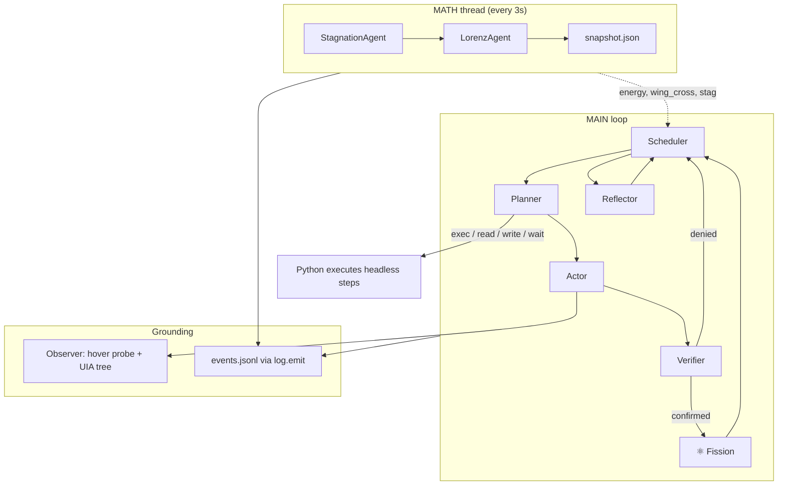

<div align="center">

# endgame-ai

**~2,900 lines of Python. Zero pip dependencies. A Windows desktop organism that plans, sees, acts, verifies — and rewrites its own source while running.**

[](https://www.python.org/)
[](https://github.com/wgabrys88/endgame-ai)
[](.)
[](.)
[](.)

*If you're going to try, go all the way. Otherwise, don't even start.*  
— Charles Bukowski

**That line has been in this repo since the beginning. It was never decoration. It was the spec.**

[Quick start](#quick-start) · [What happened](#what-happened) · [Architecture](#architecture) · [M4](#m4--the-moment-everything-became-possible) · [Run it](#quick-start)

</div>

---

## Read this twice

**M4 in one sentence:** the organism **launched itself** and **rewrote its own code** — same run, no human touching files.

On **2026-06-10** you ran one command (`python tui.py "…"`). The TUI spawned `main.py` via `subprocess.Popen`. The reactor logged it immediately:

```json
{"n":1,"phase":"start","d":{"goal":"…","budget":2000}}
```

That `phase:start` line in `events.jsonl` is the receipt: **it booted its own core.** Not a metaphor. Event **#1**, timestamp `2026-06-10T18:22:30Z`.

Then — still without you editing anything — it evolved itself:

| Log event | What happened |
|-----------|---------------|
| **#1** | Reactor alive (`phase:start`) — self-launched via TUI → `main.py` |
| **#357** | `exec` rewrote `config.py` — `SCREEN_ELEMENT_VALUE_LIMIT` 500 → 1000 |
| **#359** | `exec` appended conversation-state rule to `prompts/planner.txt` |

Commit on disk: [`eff78fb`](https://github.com/wgabrys88/endgame-ai/commit/eff78fb). Golden log backed up locally.

That is why we call it M4. Not because it passed a linter gate. Because it **started** and **changed** in one living session.

**Transparent:** that run has not yet logged old-instance → new-instance on evolved code (`spawn_main` / resurrection is next — one `phase:start`, zero spawns after #357) — but versus M3 (prompt patches only), M4 is still real: self-launch plus self-edit of actual `.py` on disk, same session, no crash.

---

Most agent frameworks are a million lines of abstraction teaching a model to *pretend* it has hands. **endgame-ai threw that out.**

No LangChain. No tool-registry theater. We burned the rulebooks and wired a **reactor** — math thread, event bus, LLM roles, raw Win32/UIA, real Python `exec`. Planner names intentions. Python executes. Verifier demands proof. Verified work **fissions**.

---

## What happened

This project was not designed in a conference room. It was built the way Bukowski meant it — **all the way**.

One person with ideas. One model with skills. Hundreds of commits of throwing shit out until only the necessary spine remained. Framework patterns → deleted. Dead architecture → deleted. `cmd.exe` quoting hell → deleted. PID theater → deleted. What stayed:

| Kept | Why |
|------|-----|
| **Lorenz + stagnation math** | Not cosplay — scheduling signal. Energy rises, wings cross, reflector wakes. |
| **Fission** | Verified milestone completes → plan resets → organism sustains. Nuclear metaphor, yes — but it's *math wiring*, not branding. |
| **Observer** | Hover probe first (browsers lie to trees), UIA tree second, merge, depth-indented `SCREEN`. |
| **`exec`** | Real Python in the reactor — not shell strings. The organism's metabolism. |
| **Event bus** | `log.emit()` — pause is a null sink; one choke point for truth. |

We did not build a chatbot with tools. We built a **self-sustaining loop** that can touch the desktop, touch its own files, and argue with a verifier about whether it actually accomplished anything.

---

## Architecture

Two threads. One organism. No framework babysitting the model.



**Headless** (no actor LLM): `exec`, `read_file`, `write_file`, `wait`.

**GUI** (actor LLM): click, focus, write, press — only when `gui_mode` exists.

**Exec environment** (injected, no imports needed): `BASE_DIR`, `Path`, `os`, `sys`, `json`, `time`, `subprocess`, `spawn_main()`, `enable_gui()`.

---

## M4 — the moment everything became possible

Milestones were never a corporate roadmap. They were **capabilities unlocking capabilities**.

| Milestone | What it means | Status |
|-----------|---------------|--------|
| **M1–M2** | See the desktop. Act on it. Verify. | ✓ |
| **M3** | Prompt self-evolution — reflector mutates prompts from runtime evidence | ✓ [`8901988`](https://github.com/wgabrys88/endgame-ai/commit/8901988) |
| **M4** | **Self-launch + self-edit** — TUI spawns `main.py`, reactor logs `start`, organism rewrites its own Python & prompts via `exec` | ✓ [`eff78fb`](https://github.com/wgabrys88/endgame-ai/commit/eff78fb) · log `#1` `#357` `#359` |
| **Later** | `spawn_main()` from inside `exec`, resurrection (kill → relaunch new code) | optional polish |

### Is M4 the last milestone that *matters*?

**Yes.** Launch + `exec` metabolism means everything else is deduction — prompts, config, behavior, child processes. What remains before `main` merge is **validation** (LM Studio runs, longer sessions), not a new milestone tier.

---

## Quick start

```powershell
cd $env:USERPROFILE\Downloads\endgame-ai
python -c "import observer, engine, agents, actions, log, tui; print('OK')"
python tui.py "Your goal here" --backend acp --event-budget 500
```

| Key | Action |
|-----|--------|
| **Enter** | Goal input — hot-swap via `goal.txt` or launch |
| **Space** | Pause / resume (`log.emit` null sink) |
| **q** | Quit TUI |

**Requirements:** Windows 10/11 · Python 3.13 · [LM Studio](http://localhost:1234) or ACP (Kiro CLI in WSL2)

**Headless / debug:**

```powershell
python main.py "your goal" --backend lmstudio --event-budget 200
python debug_context.py planner --goal "test"
```

Project root is always `BASE_DIR` (directory containing `main.py`). Stay inside it.

---

## Why this is not your framework

<table>
<tr>
<td width="50%">

**Typical agent stack**

- 50+ dependencies
- Tool schemas as religion
- Shell/command as “code execution”
- Human merges every change
- “Autonomous” in the README only

</td>
<td width="50%">

**endgame-ai**

- 12 core `.py` modules + 4 prompts + 4 schemas
- Planner names intentions; **Python executes**
- `exec` with full `subprocess` + `spawn_main`
- **Self-launch** (`tui.py` → `main.py`, log `#1`) **+ autonomous `config.py` rewrite**
- Verifier blocks fake milestones
- Fission keeps the organism alive

</td>
</tr>
</table>

We are not claiming omniscience. We are claiming something narrower and weirder: **a minimal reactor that can improve itself in production.** That is logically closer to “general capability” than another wrapper around `function_calling`.

---

## The tree

```
main.py          entry, respawn contract, goal board
engine.py        reactor loop + math thread + fission
agents.py        planner · actor · verifier · reflector · scheduler
actions.py       exec · verbs · spawn_main · import gate
observer.py      hover probe + UIA tree → SCREEN
log.py           event bus · pause · lock
tui.py           full-width dashboard
win32.py         raw ctypes — no pip
llm.py           LM Studio / ACP backends
prompts/         planner · actor · verifier · reflector
schemas/         strict JSON outputs
```

Runtime artifacts (`events.jsonl`, `snapshot.json`, `goal.txt`, `pause`, `gui_mode`, …) are created on run and gitignored. Keep-only policy — only the essential tree ships.

---

## Proven in one run (2026-06-10)

<details>
<summary><b>What the organism did — no human file edits</b></summary>

1. **Self-launched** — TUI → `main.py` → `events.jsonl` event `#1` `phase:start`
2. Read its own README, source, prompts, schemas
3. Launched Opera → Grok via `exec` + `subprocess` (event `#28`)
4. Baseline conversation — verifier **confirmed**, fission fired (event `#212`)
5. **`config.py` 500 → 1000** (event `#357`)
6. **Planner rule appended** (event `#359`)

Receipt: commit [`eff78fb`](https://github.com/wgabrys88/endgame-ai/commit/eff78fb) + backed-up `events.jsonl`.

</details>

---

## Config defaults

| Key | Value |
|-----|-------|
| `EVENT_BUDGET` | 20 (override: `--event-budget N`) |
| `MATH_INTERVAL` | 3.0s |
| `EXEC_TIMEOUT` | 60s |
| `SCREEN_ELEMENT_VALUE_LIMIT` | **1000** (organism-evolved) |

---

## What's next

- [ ] **LM Studio** — full run on local backend (same reactor, different wire)
- [ ] **Merge `refactor-v4` → `main`** after you're satisfied with tests
- [ ] Optional: `spawn_main()` from `exec`, resurrection (detach → exit → relaunch)

---

**Branch:** `refactor-v4` · **`main` frozen until merge** · [repo](https://github.com/wgabrys88/endgame-ai) · [M4 commit](https://github.com/wgabrys88/endgame-ai/commit/eff78fb)