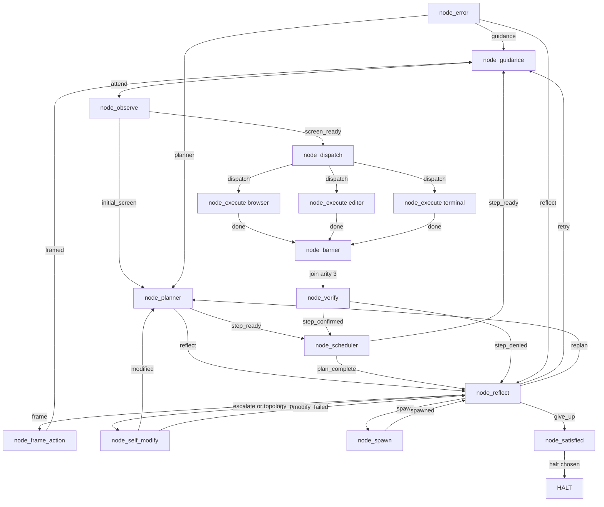
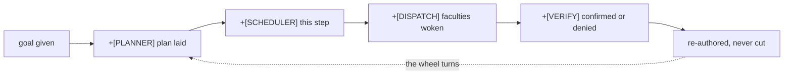
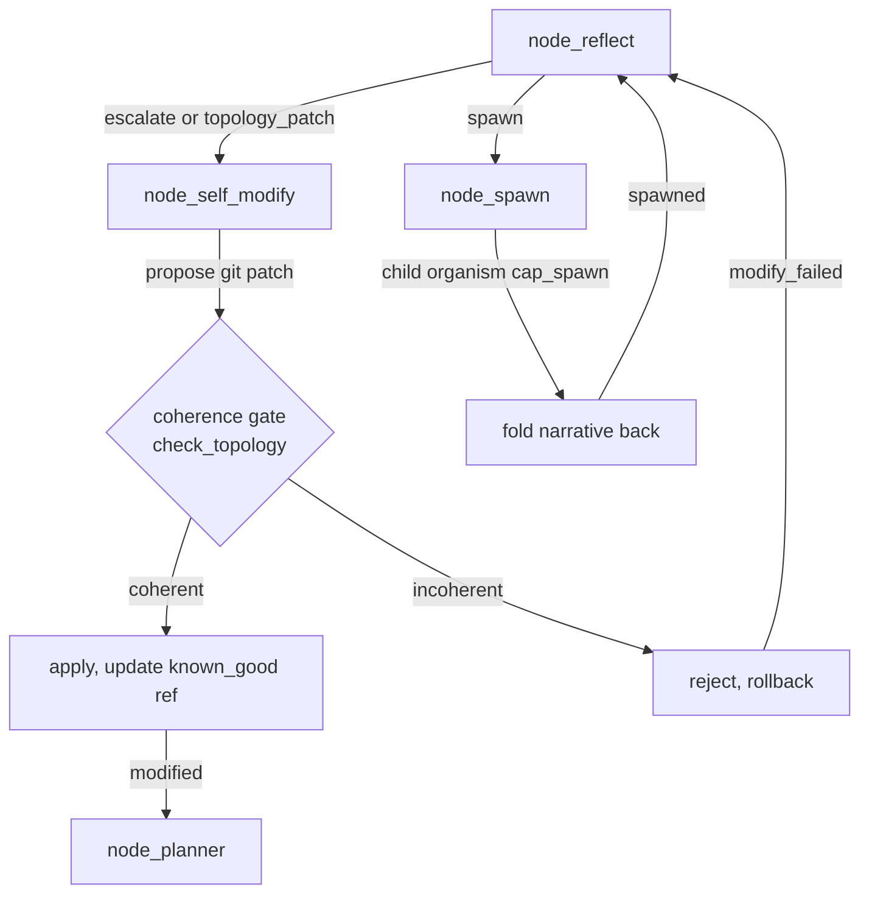

# endgame-ai

A task-agnostic organism that operates a Windows 11 desktop the way a person does: it sees the screen through UI Automation, moves the hands (clicks, types, runs Python and shell commands), and carries a single goal-narrative that every node rewrites as it passes through. It is not a pipeline with a first step and a last step. It turns through its nodes on a wheel and stops only when it decides to.

This README is written to be read by both humans and AI, in plain English. It separates **what has been proven to run** from **what is built but not yet exercised**, because both are facts and confusing them is how systems get misunderstood.

---

## What it does, in one honest paragraph

You give it a goal in ordinary words. It observes the actual desktop, plans, wakes the faculties a step needs (browser, editor, terminal), acts with real Python it writes on the spot, checks its own work on the evidence, reflects when blocked, and loops. There is no task-specific code inside it — the same 16 nodes handle "converse with a website" and "edit a document" and anything else, because the behavior comes from the goal-narrative and the model, not from branches wired for a particular task. **This is the core design commitment: the system is task-agnostic. No task-specific fixes are ever added to it.**

### Why that matters for everyday work

Most agent frameworks reach a real desktop only through a stack of glue: a browser-automation SDK, tool schemas, RAG, MCP servers, plugins, skill definitions. This one reaches the desktop with a handful of Python files and no such stack — **no `pip install` of an agent SDK, no RAG, no MCP, no skills, no tool registry.** When it was asked to open a browser, talk to Grok, and work on a LinkedIn profile, it opened Chrome, clicked the input, and typed the query — using Python it generated itself against a small capability runtime. If you do repetitive desktop work (fill a form, read a screen and react, drive a web app, run a sequence of commands and verify the result), the promising claim here is that a very small, general substrate can do it without bespoke automation per task. That claim is now partly proven (see below) and partly still open.

---

## Proven vs. not-yet-proven (read this before believing anything else)

**Proven to run** (observed on the Windows host, in `runtime_events.jsonl`):

- The wheel turns. Across two live runs it completed multiple full laps without the substrate imposing any stop; it halted only on the operator's time leash.
- All three faculties fan out and gather. `node_dispatch` woke `node_execute:browser/:editor/:terminal`, they ran in parallel, and `node_barrier` (arity 3) joined them back into one flow every time.
- It does real desktop work. It opened a browser, clicked Grok's input field, and typed a query (a branch-specific question about this very repository), then read the response back off the screen.
- It judges honestly. `node_verify` denied its own incomplete step ("query sent, but no reply captured yet") instead of claiming success, then `node_reflect` chose `retry`, and on a later lap `node_verify` confirmed success once the reply was actually on screen and advanced the scheduler.
- It recovers from its own mistakes. When its self-written code sliced a dict as if it were a string, it did not crash the system — the failure re-narrated through `node_error`, `node_reflect` diagnosed it, and the wheel kept turning.
- The off-host gates pass: `py_compile` clean, WSL-safe imports load, `check_topology.py` exits 0.

**Built but not yet exercised in a live run** (real code, honest unknowns):

- `node_self_modify` (git-backed code/wiring rewrite) and its coherence gate + hot-swap safety net — wired and unit-reachable, but no live run has driven the organism to actually rewrite itself.
- `node_spawn` / `cap_spawn` (a node begetting a child organism) — implemented, not yet chosen by the organism during a live run.
- Longer autonomous runs (minutes to unbounded) — so far the longest observed run was 60 seconds under the leash. Completing a whole multi-step goal end to end has not been demonstrated yet.
- The `guidance.txt` steering surface has been read by `node_guidance` in runs but not yet used to steer a live run toward a changed course.

Treat the second list as promising and plausible, not as demonstrated.

---

## The measurable result of the day: less code, not more

A full day of work reduced the codebase substantially while introducing the fractal design. Measured against the previous `main` branch:

```
38 files changed, 1,682 insertions(+), 4,615 deletions(-)
```

Net, roughly 2,900 lines removed. The current tracked Python is about 3,300 lines total. The fractal wheel replaced the older linear pipeline and, in the runs performed, **does not behave worse than the pipeline `main` represented** — it runs, turns, and does real work. That is the proven claim: fewer moving parts, same-or-better behavior in the runs we did. It is not a claim of superiority under all conditions, which has not been tested.

---

## The wheel (this is the live topology)

`wiring.json` is the wheel. It is entered at `node_guidance` — that is where an already-turning wheel is picked up each lap, not a "start." Every path returns to the wheel; nothing dead-ends. `node_dispatch` fans out to all three faculty instances; the chosen ones work, the unchosen pass through idle; all three converge on `node_barrier`. The only way to `halt` is a deliberate choice through `node_reflect → give_up → node_satisfied`.



16 wired nodes, `cycle_start = node_guidance`, `topology.barriers = {"node_barrier": 3}`.

### What each node actually did in the live runs

This is the observed behavior, not the intended behavior:

- **node_guidance** — entered the wheel each lap, folded any `guidance.txt` into the narrative (none was supplied), passed on.
- **node_observe** — scanned the desktop via UIA and produced screen text the planner and faculties could read.
- **node_planner** — turned the plain-words goal into an ordered intent (e.g. "open browser to grok.com and converse … then edit the profile …"), including the branch-specific detail baked into the goal.
- **node_scheduler** — set the single next step before the hands; advanced to the next step after a confirmed verification.
- **node_dispatch** — chose which faculties to wake; in these runs it woke the relevant subset and let the others idle.
- **node_execute (browser/editor/terminal)** — wrote and ran Python: clicked the Grok input, typed the query, waited for and read the response, checked for required tools via `subprocess`. Some self-written code was imperfect and was corrected on later laps.
- **node_barrier** — gathered all three faculties (arity 3) into one flow before judgment, every lap.
- **node_verify** — confirmed or denied on evidence only; denied honestly when the reply had not yet arrived, confirmed once it had.
- **node_reflect** — on denial, chose `retry` (wait longer / re-read); diagnosed a bug in the organism's own generated code from the narrative.
- **node_error** — caught stumbles (including a `KeyError` in generated code) and returned the wheel to motion; no stumble ended the run.

Nodes that are wired and prompted but were not exercised in these runs: **node_frame_action, node_self_modify, node_spawn, node_satisfied**.

---

## Memory and sanity: the goal-narrative

There is one piece of memory that matters: `state["effective_goal"]`. Every node appends a clearly-tagged line describing what it did and understood (`[PLANNER]`, `[SCHEDULER]`, `[DISPATCH]`, `[VERIFY]`, and so on). It is never truncated — a missing field is treated as a bug to fix at its source, never patched with a default, and the narrative is never cut with `str[:N]`.

This narrative is also the sanity mechanism. Because each node re-tells the shared goal in its own words, the state does not simply repeat, and a company of fallible LLM nodes holds itself to one purpose. Coherence here is psychological — it comes from the re-telling — not from control-flow guardrails. In practice this is why, when the organism made a mistake, it wrote the mistake into the narrative plainly and the next nodes reasoned from it.



---

## Steering: guidance, not command

The only external steering surface is the workspace file `guidance.txt`. At the top of each lap, `node_guidance` reads it, folds it into the narrative as a strong, clearly-tagged, ignorable signal, and consumes the file. The organism may act on it or not — the node company decides. You steer it the way you advise a colleague, not the way you call a function.

The one genuinely external control is the operator's leash for finite development runs: `--duration-seconds`, a stop file, and pause/step. That leash sits outside the organism's biology — a cage door, not part of the creature. Run with `duration_seconds=None` and it turns without a time bound.

---

## Self-modification and recursion (built, not yet exercised live)

`node_reflect` can route to `node_self_modify` when the organism's own code or wiring must change. Self-modify proposes a git-backed patch (files to read/write/delete, wiring patches, commands, expected validation). Applied changes are gated: `check_topology.coherence_problems` must pass, and a known-good ref (`refs/endgame/known_good`) plus optional hot-swap guard against a bad self-edit. `node_spawn` can raise a child organism (`cap_spawn`, depth-gated) on the inherited narrative and fold its result back — because a node and an organism are the same shape.

Both mechanisms are implemented and reachable in the topology. Neither has yet been triggered by the organism during a live run. When they are, this section will be updated with observed behavior.



---

## Prompts: cache-aware, plain-contract, no examples

Each node's prompt is a static system-role string in `wiring.json → prompts`; the dynamic payload (goal-narrative, step, observation, evidence) is serialized into the user role and delivered last. The split is deliberate: the static system content is cacheable across turns, and only the small dynamic tail changes.

Every prompt is composed most-stable-first so the shared prefix is reused by the cache: a universal opener identical across all prompt entries, the same roster of nodes, the node's own identity, the exact record contract (record type, required fields, allowed signals, derived from `core_brain._RECORD_RULES`), and a low-priority tail inviting the node to inhabit the goal. Hard rules are written in a commandment register on purpose — it is a phrasing that resonates in the training data and keeps the model steadily controllable. There are no few-shot examples; the schema is the instruction.

Note on tokens: the caching design above is working as intended and is not the concern. Observation payloads are the larger cost, and reintroducing filtering at the observation source is a known future optimization — deliberately deferred (see Next steps).

---

## Architecture

### Substrate (the small, stable core)

| Module | Role |
|---|---|
| `core_organism.py` | Turns the wheel: load a node, call it, validate its signal against the topology edge, apply the patch, route to the next node(s). Imposes no ending. |
| `core_loader.py` | Dynamic, file-based plugin loading (`load(kind, name, w)` → `<prefix><base>.py`). No registry. Splits `node_execute:browser` into base + instance. |
| `core_node_base.py` | The one abstract base, `BaseNode` (think → build_payload → signal → patch). Threads `node_base` / `node_instance` into `ctx`. |
| `core_bus.py` | Records, signals, `emit`, `validate_signal`, narrative briefs. |
| `core_brain.py` | The LLM call: system/user message assembly, record contract (`_RECORD_RULES`), prompt-cache key, structured outputs, runtime-event logging. |
| `core_wiring.py` | Loads and validates `wiring.json` (every node needs edges and a prompt; required paths exist). |
| `core_state.py` | State persistence, tick, and the operator leash (`wait_before_node`, duration expiry). |
| `core_stop_check.py` | The stop file / pid — part of the operator leash. |
| `check_topology.py` | The coherence gate: reachability from `cycle_start`, no dangling targets, barriers have a join edge and positive-int arity. Used by both the CLI and the runtime self-modify gate. |
| `core_nodes.py`, `core_desktop.py`, `core_observation.py` | Capability runtime plus the UIA eyes and hands. Windows-only (import `comtypes`). |
| `cap_spawn.py` | The child-organism capability invoked by `node_spawn`. |
| `transport_xai.py` | The real transport (xAI HTTP), used on the Windows host. |
| `transport_file_proxy.py` | Off-host debug transport: writes the request to disk; an operator answers as the model. |

### The nodes

Mechanical (no model): `node_guidance`, `node_observe`, `node_scheduler`, `node_barrier`, `node_spawn`, `node_satisfied`, `node_error`.

LLM (strict record): `node_planner` (`plan`), `node_dispatch` (`dispatch`), `node_execute` faculties (`execution`), `node_verify` (`verification`), `node_frame_action` (`action_frame`), `node_reflect` (`reflection`), `node_self_modify` (`git_evolution_patch`).

### The bus law

Every node emits `(signal, patch)`. The bus validates that the signal is a legal edge out of that exact node instance, applies the patch to state, increments the tick, and routes to the next node(s). A fan-out edge is a list; a fan-in barrier waits until its arity is met.

---

## Running it

The organism runs on Windows 11 because the eyes and hands need real UI Automation. From the repo root on the host:

```bash
# Bounded development run (operator leash), fresh state
python core_organism.py "your goal in plain words" --reset --duration-seconds 120

# Resume where it left off (no --reset)
python core_organism.py "your goal" --duration-seconds 300
```

For an unbounded run (the organism proper), omit the leash in code (`duration_seconds=None`).

CLI flags (`core_organism.main`): `goal` (positional), `--reset`, `--duration-seconds` (default 120), `--brain-call-budget`, `--start-node`, `--wiring`.

Configure the model in `wiring.json → model` (`transport = transport_xai`; per-node `reasoning_effort` / `max_output_tokens` under `model.organs`). Steer a running organism by writing into `guidance.txt`. Watch it think in `runtime_events.jsonl` — every brain request and response is logged there, and reading that file is how you evaluate a run.

### Reading a run

Evaluate liveness and coherence, not task completion. Good signs: the wheel keeps turning through varied nodes; the narrative advances and stays untruncated; faculties fan out and the barrier gathers them; a stumble re-narrates and the wheel continues. Worrying signs: a mechanical dead-loop (one node erroring repeatedly with no narrative motion), or the same framework error recurring identically (that is a real bug to fix at the source). A faculty's self-written code failing once and being corrected on a later lap is the organism adapting, not a defect.

### Developing off-host (WSL / Linux)

The acting nodes (`node_execute`, `node_observe`, and anything importing `core_desktop` / `core_nodes`) cannot import off Windows (`comtypes`). Everything else is pure Python. The gates run anywhere:

```bash
python3 -m py_compile *.py
python3 -c "import core_organism, core_bus, core_wiring, core_state, check_topology"
python3 check_topology.py    # exit 0 = coherent wheel
```

Push from WSL via the Windows host git (uses the Windows credential store):

```bash
git.exe -C 'C:\Users\ewojgab\Downloads\endgame-ai' push origin <branch>
```

---

## The rules this system depends on (read before changing anything)

These are not style preferences. A change that violates them is wrong even if it appears to work.

1. **Task-agnostic, always.** Never add task-specific handling. The same nodes must serve any goal. If a fix only helps one kind of task, it does not belong in the system — improve the prompt, the contract, or a capability instead.
2. **System = nodes + wiring, everything hot-swappable.**
3. **No branching, fallbacks, defensive coding, or ceremony. Fail hard and loud.** A missing key is a bug to fix at its source, not a defaulted `.get`. Prefer deleting code to adding it.
4. **Plugins are dynamic and file-based** — no compile-time registry. The organism must be able to write a new `node_*.py` at runtime and load it with zero core change.
5. **Keep the load-bearing organs alive:** hot-swap, self-modify, and the coherence gate.
6. **When the graph changes, change the prompts and record contracts with it.** Keep the commandment register for hard rules.
7. **The narrative is never truncated.**
8. **A failure is information for the narrative, not a branch to add.** It already routes through `node_error`. The fix is usually a clearer prompt, a better-narrated failure, or a new capability the organism can choose — not an `if` in the core.
9. **This README is the single living handover.** Update it after every change. Verify, then commit, one coherent step at a time.

---

## Next steps

Behavioral, not architectural — the structure is complete and coherent. What remains is running it and watching.

- **Longer runs toward a completed goal.** So far the longest observed run is 60 seconds. Run several minutes and watch a multi-step goal (like the Grok-then-LinkedIn task, including the once-a-minute status write to a Notepad++ window) proceed toward completion. Judge liveness and coherence.
- **First self-chosen self-modification and spawn.** Both are built and untested live. Watch for the organism reaching `node_self_modify` or `node_spawn` on its own, and record the behavior here. A compelling open story: run it and let it discover that it should optimize itself — a real possibility the design allows, not yet demonstrated.
- **Observation token cost — a dedicated future session, not now.** KV/prompt caching is already good and is not the issue. The larger token cost is the observation payload. Reintroducing filtering at the observation source (`core_observation` / `core_desktop`) is a known optimization from prior experience; it is deliberately deferred to its own focused session so it is done carefully and stays task-agnostic. It is not urgent — current behavior is workable — but it is the clearest efficiency lever.
- **Prompt/faculty tuning from real behavior.** Whether `node_dispatch` under- or over-wakes faculties on vague goals, and whether the narrative ever circles without a mechanical dead-loop, are prompt-register questions to observe and tune, not code changes.
- **Minor cleanup.** A stale initializer in `core_organism.run` (`current = "node_observe"`, immediately overwritten by `cycle_start`) is harmless dead residue; remove it in its own small commit whenever convenient.

---

## History

- **Substrate B1–B5** — list edges, frontier fan-out scheduler, `node_barrier` fan-in, `cap_spawn` recursive child organism, the topology-coherence gate.
- **F1** — removed the endings the substrate imposed (no error-streak halt, no completion terminus). Stopping became the organism's own choice only.
- **F2** — goal-file steering: `node_guidance` at the wheel's entry folds `guidance.txt` into the narrative as a strong, ignorable signal.
- **F3** — the fractal wheel: `node_dispatch` selects faculties and fans out to `node_execute` instances; `node_barrier` gathers them; `node_spawn` recurses; `node_scheduler.plan_complete` reflects rather than auto-halting; `node_error` re-enters the wheel and never dead-ends.
- **Prompts** — rewritten to the cache-aware, commandment-rule structure above.
- **First live runs** — the wheel runs on the Windows host. A logging-contract bug (`KeyError: 'paths'`) and two verify/execute contract bugs were found by running it and fixed at the source; the organism then did real browser work and verified its own progress honestly.

The architecture is built. The remaining work is not construction — it is living: running it, reading its narrative, steering only with `guidance.txt`, and tuning from what it actually does. When the hands stumble on real GUI or commands, resist the reflex to cage the case; give the organism what it needs to adapt itself.
