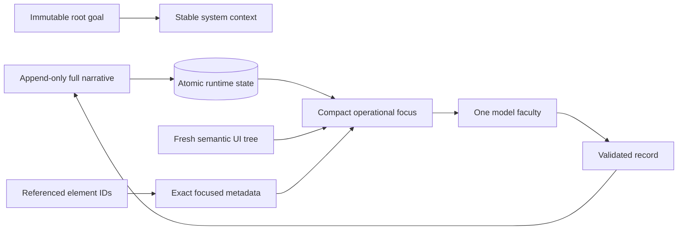
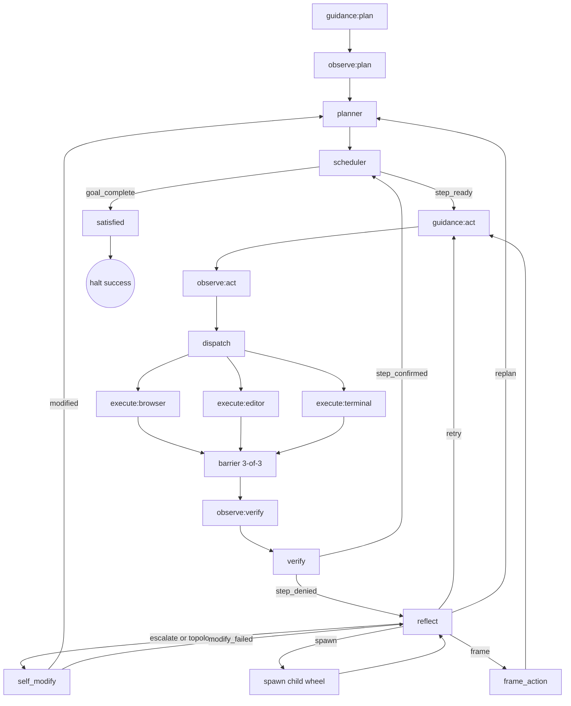
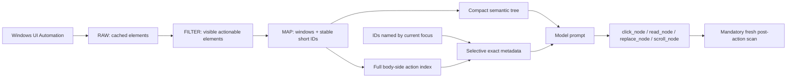
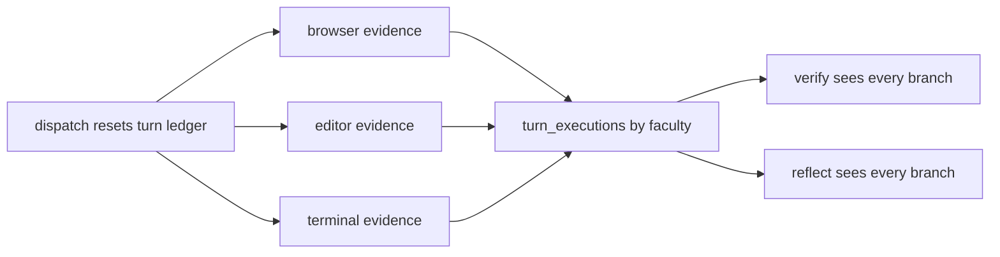
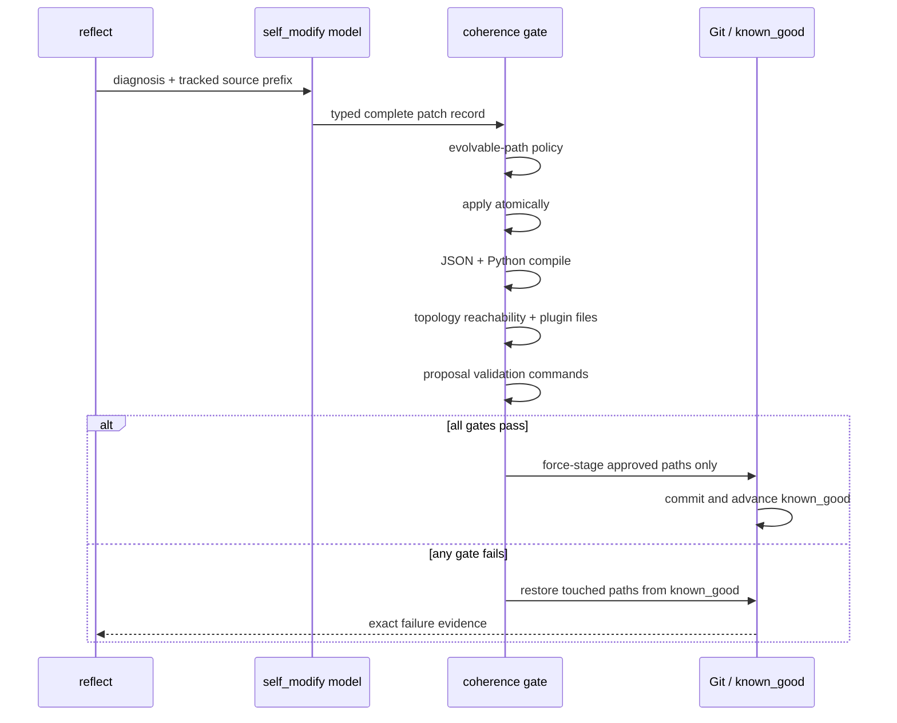

# endgame-ai

`endgame-ai` is a task-agnostic autonomous organism for a real Windows 11 desktop. It observes through UI Automation, acts through a small local capability surface, and carries one immutable goal around a continuously turning, dynamically wired company of fallible faculties.

This revision starts from golden baseline commit `451faf0cfe0f37285b8b3fdb82c34d2c1aea6739` and the attached 2026-07-10 run. Every claim below is derived from `runtime_events.jsonl`, `request-logs-2026-07-10.jsonl`, `runtime_state.json`, or deterministic replay of those artifacts. The raw run files are intentionally not tracked in the release: self-evolution requires a clean Git worktree, while their hashes and complete call ledger remain here.

## Verdict

The run was better than the previous one: it launched Chrome, opened LinkedIn, reached the owner profile, and opened the GitHub repository. It still did **not** complete the goal and it did **not** exhaust its options.

The organism halted after **253.728 seconds** of a 600-second leash. At the final model decision, state explicitly reported `elapsed_seconds=248.349` and `remaining_seconds=351.651`; the model nevertheless said the deadline had expired and selected `give_up`. Immediately before that, planner produced a five-step replan and Python rejected it with `RuntimeError: planner replan amputated root goal obligations` because the new plan had fewer steps. That guard measured list length, not semantic obligation coverage. The replan itself was also wrong: it replaced requested LinkedIn changes with local text files.

The deeper failures were:

1. the full append-only `effective_goal` was injected into almost every system prompt and again inside nested state/evidence;
2. structured model responses were duplicated into state because the entire JSON answer was stored as `reasoning`;
3. three execution branches collapsed into one `last_result`, letting the last finisher erase another faculty's failure and evidence;
4. browser turns could emit prose or local files without any browser action;
5. verification accepted self-authored proxy artifacts as proof of external consultation and website edits;
6. focused UI metadata was built by the bus but stripped by `core_brain` before transport;
7. `give_up` was a model option even while the external leash remained open.

All seven are corrected without a LinkedIn-, Grok-, browser-site-, or task-specific branch.

## Evidence identity

| Artifact | SHA-256 |
|---|---|
| `runtime_events.jsonl` | `f56dfbbd676766c5cee95027a5716e03d3725d5ef80b90714a80e1a72d3015da` |
| `request-logs-2026-07-10.jsonl` | `488126849efb6d09f3e8608762eafabe4da9aac8f444510251b472cad3bf8672` |
| `runtime_state.json` | `f65b95cef4a8fc8807cc3f021fb6f7e1df9fd0ae90835892517f49610f10856b` |

The organism log contains 40 `brain_request` and 40 `brain_response` events. The server log contains 40 requests in reverse chronological order. After timestamp sorting, all 40 request message arrays and all 40 response bodies match byte-for-byte. The growth therefore happened before transport; it was not server-side conversation history.

## Token and request forensics

Actual recorded totals:

| Metric | Value |
|---|---:|
| Model calls | 40 |
| Prompt tokens | 401,564 |
| Cached prompt tokens | 74,176 |
| Completion tokens | 8,470 |
| Message characters sent | 1,539,537 |
| First request | 9,403 characters / 2,420 prompt tokens |
| Largest request | 73,599 characters / 18,094 prompt tokens |

The observation was not the runaway component. After the browser settled, `desktop_tree_text` stayed near 6.3–8.6 kB. The append-only narrative grew from 1,295 to 27,944 characters and was placed in the system goal. The final replan user payload also contained roughly 31.5 kB of state, a 6.5 kB observation, the old plan, a duplicate root plan, and completed steps. The final reflection carried 33.9 kB of evidence while its system goal carried 27.9 kB.

A conservative replay projection using the same 40 captured observations, the corrected prompts, and even the old bulky action evidence yields:

| Projection | Recorded | Corrected projection | Reduction |
|---|---:|---:|---:|
| Aggregate message characters | 1,539,537 | 584,705 | 62.0% |
| Largest request | 73,599 | 19,760 | 73.2% |

This projection is deterministic character accounting, not a claim about a future provider bill. A fresh live run is required for actual token/caching measurements.

## The memory/focus split

The system now distinguishes three concerns that the failed run conflated:



- **Root goal:** immutable and sent once in stable system context for every ordinary faculty.
- **Full narrative:** never truncated or reset; persisted in state and appended only with meaningful events.
- **Operational focus:** current step, remaining step count, latest verification/reflection/failure, exact timing, current multi-faculty evidence, and fresh observation.
- **ID expansion:** the broad tree contains short semantic IDs; when a step, frame, reflection, or action names one, only that ID's exact role, action, rectangle, enabled state, automation ID, class, window handle, and depth are expanded. The full action index is never dumped into a prompt.

The failed code already constructed part of this focus, but `core_brain._normalize_observation()` discarded everything except tree text and timestamp. The corrected normalizer preserves the compact focused fields.

## The fractal wheel

The wheel is entered at guidance, not “started” as a pipeline. Fan-out creates three faculty turns; a barrier gathers all three; a child organism can recursively run the same topology.



There is no model-authored abandonment edge. While the external leash is open, reflection must choose a materially new retry, replan, frame, evolution, topology patch, or child. Duration and stop-file termination remain mechanical. Successful rest is reached only when scheduler finds every step in the current complete remaining plan positively verified.

## Observation and semantic focus



`replace_node(node_id, text)` is a task-agnostic deterministic helper for write-capable UIA nodes. It clicks the exact current element, selects its contents, types the replacement, and records one composite action. Browser faculty policy requires at least one recorded browser/UI capability event; printing a claim or writing a local file cannot masquerade as browser work.

## Fan-out evidence is a ledger, not a last writer

The failed run dispatched browser and editor together three times. Each branch wrote the same `last_result`; the later editor branch erased browser evidence. That is why fabricated “Grok advice” and a local profile plan could be confirmed as if an external consultation had occurred.



Each entry retains code hash/size, result, action events, error, and structured failure. A later successful branch cannot clear an earlier branch failure. Verification is explicitly told that an API return proves only the API returned, a local file proves only the file exists, a draft does not prove a website changed, and self-authored text does not prove an external consultation.

## Planner and termination semantics

Plan length is not an invariant. A valid replan may split, merge, reorder, or replace steps while preserving every unsatisfied root-goal obligation by meaning. The count guard and duplicate `root_plan_intent` state are removed. Planner receives the immutable root goal, previous plan, completed steps, latest reflection, fresh observation, and compact focus.

The historical five-step replan now passes the mechanical planner path, but its proxy-file substitutions remain semantically unacceptable under the revised prompt. This distinction matters: Python should not reject a plan because `5 < 14`; the planning faculty and verifier should reject it because local files do not produce the requested external effects.

## Structured records and reasoning

All model behavior crosses one wiring-derived structured-output boundary. Contracts now type and constrain plans, dispatches, frames, executions, verifications, and reflections. Empty plans, empty faculty selections, blank lessons/diagnoses, undeclared execution fields, and `give_up` fail hard.

The failed implementation committed the structured record correctly and then replaced its `reasoning` with the entire JSON response. This happened on all 40 calls and duplicated 38,540 characters into node records/state. Single-pass thinking now preserves transport-native reasoning when present, otherwise the record's validated top-level `reasoning` exactly once. Verification consumes that top-level field rather than looking for nonexistent `data.reasoning`.

## Self-evolution transaction



The stable source prefix is reserved for self-modification. Ordinary faculties do not pay its token cost.

## Complete call-by-call cross-reference

The assessment column distinguishes a valid signal/API call from proof that the task step was actually complete.

| # | Runtime node | Record / signal | Request chars | Prompt tokens | Cached | Response summary | Forensic assessment |
|---:|---|---|---:|---:|---:|---|---|
| 1 | `node_planner` | `plan/step_ready` | 9,403 | 2,420 | 128 | 14 steps | Broad plan retained the goal, but several done conditions accepted proxy files and a time check as work. |
| 2 | `node_dispatch` | `dispatch/dispatch` | 12,992 | 3,162 | 128 | browser | Correctly selected browser for opening Chrome. |
| 3 | `node_execute:browser` | `execution/—` | 14,944 | 3,607 | 704 | click_node('e_42_66194_4_23') | Correct deterministic click; post-action evidence showed Chrome. |
| 4 | `node_verify` | `verification/step_confirmed` | 15,074 | 3,811 | 704 | confirmed | Correct confirmation from fresh UI state. |
| 5 | `node_dispatch` | `dispatch/dispatch` | 18,448 | 4,852 | 704 | browser | Correct browser dispatch. |
| 6 | `node_execute:browser` | `execution/—` | 20,737 | 5,431 | 704 | open_url('chrome', 'https://www.linkedin.c | Correct direct navigation with open_url. |
| 7 | `node_verify` | `verification/step_confirmed` | 23,002 | 6,335 | 704 | confirmed | Correct confirmation from fresh LinkedIn UI. |
| 8 | `node_dispatch` | `dispatch/dispatch` | 23,243 | 6,434 | 704 | browser | Browser was reasonable, but the step could first have been witnessed from existing UI evidence. |
| 9 | `node_execute:browser` | `execution/—` | 25,526 | 6,979 | 1,664 | click_node('e_42_1114504_4_15_2_5266') | Clicking the avatar did not itself prove login. |
| 10 | `node_verify` | `verification/step_denied` | 26,338 | 7,434 | 1,792 | denied | Correct denial: intended proof was missing. |
| 11 | `node_reflect` | `reflection/retry` | 27,821 | 7,759 | 704 | Verification failed due to missing evidenc | Retry was legal; diagnosis should have demanded a concrete read or new evidence. |
| 12 | `node_dispatch` | `dispatch/dispatch` | 27,888 | 7,713 | 1,856 | browser | Correct browser dispatch. |
| 13 | `node_execute:browser` | `execution/—` | 30,196 | 8,305 | 128 | print('Logged-in state confirmed via obser | Invalid browser turn: printed a self-authored claim and produced no UI action. |
| 14 | `node_verify` | `verification/step_confirmed` | 29,902 | 8,213 | 1,792 | confirmed | Logged-in state may have been visible, but stdout was not proof; verification needed to cite UI only. |
| 15 | `node_dispatch` | `dispatch/dispatch` | 30,072 | 8,246 | 1,856 | browser | Correct browser dispatch. |
| 16 | `node_execute:browser` | `execution/—` | 32,378 | 8,769 | 128 | click_node('e_42_1114504_4_15_2_5266') | Useful partial click opening the profile menu. |
| 17 | `node_verify` | `verification/step_denied` | 32,573 | 9,065 | 2,304 | denied | Correct denial: profile page was not yet visible. |
| 18 | `node_reflect` | `reflection/retry` | 33,972 | 9,378 | 704 | Step denied due to missing evidence of pro | Correct retry toward a different visible target. |
| 19 | `node_dispatch` | `dispatch/dispatch` | 33,967 | 9,389 | 2,432 | browser | Correct browser dispatch. |
| 20 | `node_execute:browser` | `execution/—` | 36,274 | 9,980 | 2,496 | click_node('e_42_1114504_4_15_2_12068') | Correct click on View profile. |
| 21 | `node_verify` | `verification/step_confirmed` | 34,086 | 9,348 | 2,304 | confirmed | Correct if the fresh tree contained the profile headline/About evidence. |
| 22 | `node_dispatch` | `dispatch/dispatch` | 35,099 | 9,474 | 128 | browser | Browser was suitable only for navigation; repository analysis should use deterministic local source inspection. |
| 23 | `node_execute:browser` | `execution/—` | 37,409 | 10,066 | 128 | open_url('chrome', 'https://github.com/wga | Correct navigation to GitHub, but not completion of repository analysis. |
| 24 | `node_verify` | `verification/step_denied` | 36,631 | 9,823 | 2,880 | denied | Correct denial: navigation alone did not extract facts. |
| 25 | `node_reflect` | `reflection/retry` | 38,272 | 10,184 | 2,496 | Verification failure is a false negative c | Retry signal was reasonable, but calling the denial a false negative was unsupported. |
| 26 | `node_dispatch` | `dispatch/dispatch` | 38,280 | 10,167 | 704 | browser+editor | Over-dispatch. Terminal should inspect the local repository; editor is needed only for a genuinely requested artifact. |
| 27 | `node_execute:browser` | `execution/—` | 40,655 | 10,738 | 704 | import json | Fabricated repository contents in a string instead of reading source or UI. Browser-role violation. |
| 28 | `node_execute:editor` | `execution/—` | 44,927 | 11,653 | 704 | import json | Structured the fabricated claims; did not establish factual provenance. |
| 29 | `node_verify` | `verification/step_confirmed` | 49,177 | 12,679 | 3,264 | confirmed | False confirmation: self-authored files were treated as proof of repository analysis. |
| 30 | `node_dispatch` | `dispatch/dispatch` | 47,294 | 12,245 | 3,392 | browser+editor | Wrong split for external consultation: browser needed a real Grok interaction; editor could only record returned advice. |
| 31 | `node_execute:browser` | `execution/—` | 51,783 | 13,281 | 3,840 | import json | Explicitly substituted invented advice for Grok and performed no browser action. |
| 32 | `node_execute:editor` | `execution/—` | 57,869 | 14,629 | 3,840 | import json | Produced a useful draft, but only from invented advice. |
| 33 | `node_verify` | `verification/step_confirmed` | 63,756 | 15,883 | 3,264 | confirmed | False confirmation caused by proxy evidence and single-last-result fan-in. |
| 34 | `node_dispatch` | `dispatch/dispatch` | 60,958 | 15,241 | 3,392 | browser+editor | Over-dispatch for a real website edit; browser action was the critical faculty. |
| 35 | `node_execute:browser` | `execution/—` | 66,552 | 16,481 | 4,864 | import json | Browser-role violation: wrote a local headline file and did not navigate or edit LinkedIn. |
| 36 | `node_execute:editor` | `execution/—` | 67,555 | 16,790 | 4,864 | import json | Duplicated the local proxy rather than contributing distinct evidence. |
| 37 | `node_verify` | `verification/step_denied` | 68,658 | 17,081 | 4,672 | denied | Correct denial: the LinkedIn headline was unchanged. |
| 38 | `node_reflect` | `reflection/replan` | 70,155 | 17,401 | 2,496 | Current failure streak is 1. The root caus | Replan was justified, but the diagnosis falsely claimed missing edit capability and insufficient time. |
| 39 | `node_planner` | `plan/step_ready` | 52,072 | 13,024 | 128 | 5 steps | Semantically bad replan: replaced real LinkedIn changes with local files. The Python step-count guard failed for the wrong reason. |
| 40 | `node_reflect` | `reflection/give_up` | 73,599 | 18,094 | 3,776 | Root cause is mismatch between the plan's  | Incorrect give_up: it contradicted remaining_seconds=351.651, skipped available capabilities/evolution, and followed a planner exception. |

## Source layout

| File | Responsibility |
|---|---|
| `wiring.json` | Topology, prompts, contracts, aliases, model config, capabilities, self-evolution policy. |
| `core_organism.py` | Turns the frontier, applies bus patches, invokes evolution, enforces duration/stop. |
| `core_node_base.py` | One lifecycle for every LLM node: payload → think → signal → patch. |
| `core_brain.py` | Only model boundary; messages, schemas, contracts, cache key, logging. |
| `core_bus.py` | Node output law, signal validation, compact focus, observation/evidence projection. |
| `core_observation.py` | UIA RAW → FILTER → MAP and short semantic IDs. |
| `core_desktop.py` | DPI-aware physical actions and direct browser launch. |
| `core_nodes.py` | Dynamic capabilities plus git-backed evolution transaction. |
| `node_*.py` | Hot-swappable faculties. Mechanical nodes make no model call. |
| `cap_spawn.py` | Child organism recursion. |
| `check_topology.py` | Reachability, edge, barrier, contract, and plugin coherence. |

## Requirements and run

Use Windows 11 with Python 3.11+ and `comtypes` installed. Configure the selected model transport in `wiring.json`; the default xAI transport reads `XAI_API_KEY` from the environment.

```powershell
python -m pip install comtypes
$env:XAI_API_KEY = "..."
python .\check_topology.py
python .\core_organism.py "your task-agnostic goal" --duration-seconds 600 --reset
```

Use `--reset` for a new goal. Omit it only to resume the persisted runtime state deliberately.

## Verification performed for this revision

```text
Python compilation:                  pass
JSON/wiring validation:              pass
Topology reachability:               19/19 nodes
Dangling edges:                      none
Barrier arity:                       3 execute branches
Record contracts:                    9 coherent types
Historical request cross-reference:  40/40 exact
Historical response cross-reference: 40/40 exact
Historical five-step replan replay:  accepted
Historical give_up replay:           rejected
Focused-ID metadata transport:       preserved
Multi-faculty failure retention:      pass
Structured reasoning de-duplication: pass
```

A fresh Windows 11 run is still the decisive acceptance test for live completion. Static gates and historical simulation can prove the demonstrated defects are removed; they cannot honestly prove a third-party website will expose the same controls, remain logged in, or accept every profile mutation in a future session.

## Engineering laws

- Task-agnostic always; no goal- or website-specific branches.
- Wiring is the behavioral source of truth.
- Every node emits exactly one legal signal and one patch through the bus.
- Fail hard; do not hide missing keys or malformed records with defaults.
- Keep LLM nodes thin and share one base lifecycle.
- Keep mechanical nodes mechanical.
- Preserve the full narrative on disk; reduce prompt cost with focused projection, not truncation.
- Treat failure as evidence for a new turn or evolution, not a reason to invent success.
- Prefer subtraction and deterministic capabilities over ceremonial autonomy.
