# endgame-ai — Wiring Order (Session Topic)

**Branch:** `codex-unify-bus`  
**Next session goal:** Understand, document, and **eliminate** the scattered if/else that decide who runs when.  
**Control plane:** single file `prompts/wiring.drawio`

## draw.io + JSON — what the internet says (honest)

| draw.io capability | Reality |
|--------------------|---------|
| Native file format | **XML** `.drawio` (mxfile), not arbitrary JSON |
| Export menu | PNG, SVG, PDF, HTML, **XML** — no "export as wiring JSON" |
| Import menu | CSV, XML, VSDX, Lucidchart, etc. — **not** generic config JSON |
| Diagram generation | draw.io can generate diagrams **from** JSON/XML (one direction) |
| Shape metadata | Per-shape key/value (Edit Data) — good for node labels, not whole config |

**Our unified format:** one `wiring.drawio` with two pages:

| Page | Purpose |
|------|---------|
| `topology` | Visual graph — edit in draw.io (positions sync back on load) |
| `_config` | Embedded `endgame-json:` + base64(full config) — runtime reads this |

Edit visually in draw.io, or dump JSON: `python wiring.py json` → edit → `python wiring.py save` (rewrites drawio).

**Schema:** `endgame-topology/v1` inside `_config` page

| Section | What it defines (all hot-swappable) |
|---------|-----------------------------------|
| `runtime.cli` | goal, trailing `N` response limit, `--no-desktop` |
| `topology.nodes/edges` | Agentic graph → exported to `wiring.drawio` |
| `request.unified` | SYSTEM prompt + USER block assembly order |
| `response.unified.pipeline` | parse_json → extract_fields → branch_conclusion |
| `response.unified.guards` | premature DONE, repeat-block, advance_hints |
| `feedback.reasoning` | thinking loop: depth, format, inject block |
| `transitions` | event → next phase |

**Python:** `topology.py` = dumb executor. `slot.py` Circuit delegates to it. No `_interpret_unified` in code anymore.

---

## Why This Is a Problem

The system *looks* wiring-driven, but **runtime order is not one declarative path**. It is a stack of implicit branches:

| Symptom | Where the branch lives | Why it hurts |
|--------|-------------------------|--------------|
| Cold start skips Comms | `colony.set_goal()` — `if not active_slots` | Comms exists in wiring but is **bypassed** on every normal launch |
| Only `implementor` auto-starts | `comms.fallback_slot=implementor` | Other slots (`architect`, `reviewer`, `devops`) are defined but **never enter** unless toggled or Comms routes |
| Two incompatible loops | `slots.*.mode` + `transitions.*` | `unified` (1 LLM/step) and `planner→actor→verifier` (multi-LLM) coexist; mode picks one **silently** |
| Prompt swap is a second router | `circuits.unified.prompt_swap` + `slot._resolve_prompt()` | Same slot, same phase — **different agent personality** based on goal substring |
| WORKSPACE shape changes by goal | `slot._get_field("workspace")` | Executor goals get `MODE:`; peer goals get `ROLE:` — **context fork inside one circuit** |
| Guards override model output | `slot._interpret_unified()` | DONE / repeat-block / premature-DONE are **code if/else**, not wiring |
| Global mutator is conditional | `colony.step()` tail + denial counters | Extra LLM agent **sometimes** runs after slots |

**Your insight:** Smoke tests (`python smoke.py`, one LLM response) exposed that the model's *first thought* depends on which hidden branch fired (ROLE vs MODE, SCREEN present or not, manager swap or not). You cannot tune cognition until **order is explicit and single-path**.

The next session should collapse these branches into wiring (or delete dead paths), not add more prompts.

---

## What Wiring Actually Defines

| Key | Meaning |
|-----|---------|
| `instance.role` | Deployment label (`manager` / `student`) |
| `slots.<name>.mode` | Starting phase: `unified` or `planner` |
| `slots.<name>.can_desktop` | Whether slot may hold desktop actor lock |
| `comms.fallback_slot` | **Who gets the goal on cold start** (currently `implementor`) |
| `circuits.<phase>.prompt` | Which `.txt` the LLM sees |
| `circuits.unified.prompt_swap` | Goal substring → swap to `manager.txt` |
| `transitions.<event>` | Next phase after LLM event |
| `transitions.default` | Fallback phase (`planner`) |

**Not in wiring (code decides):** cold-start Comms skip, SCREEN placeholder, guard overrides, actor lock, `global_mutator` gating.

---

## Level 0 — Process Bootstrap

Nothing runs until `tui.py` sets a goal. No agent is "always on" at import time.

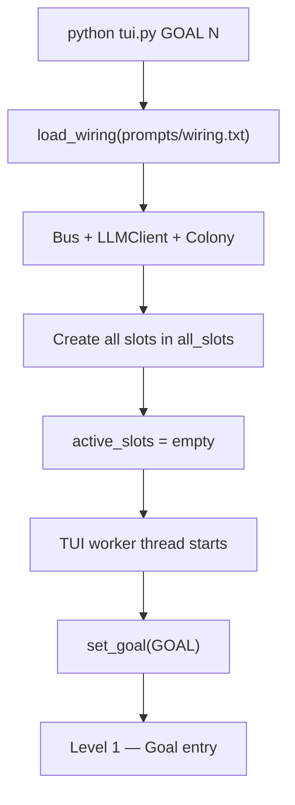

---

## Level 1 — Goal Entry (single path — collapsed)

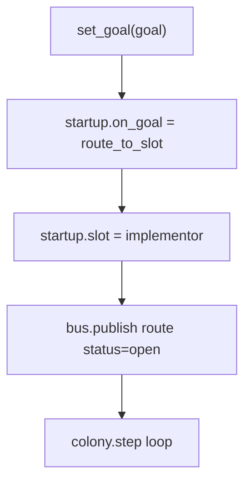

No Comms fork. No `active_slots empty?` branch. Declared in `wiring.json` → `startup`.

---

## Level 2 — Colony Step Cycle (every ~1s)

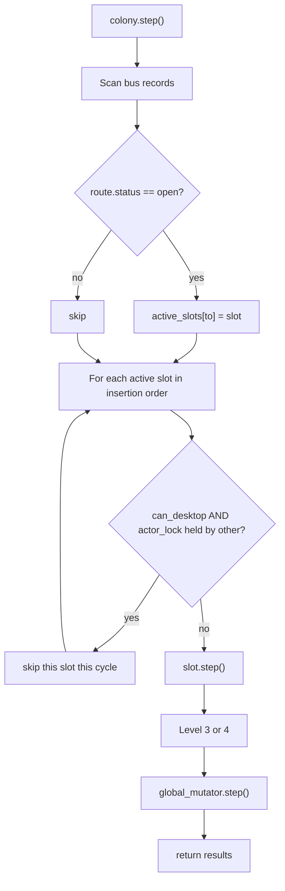

**Order per cycle:** activate from bus → step active slots (dict order) → maybe global mutator.

---

## Level 3 — Slot Step (mode fork)

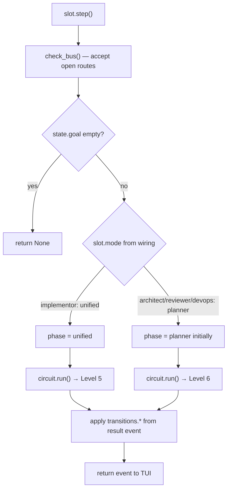

---

## Level 4 — Implementor Unified Loop (default production path)

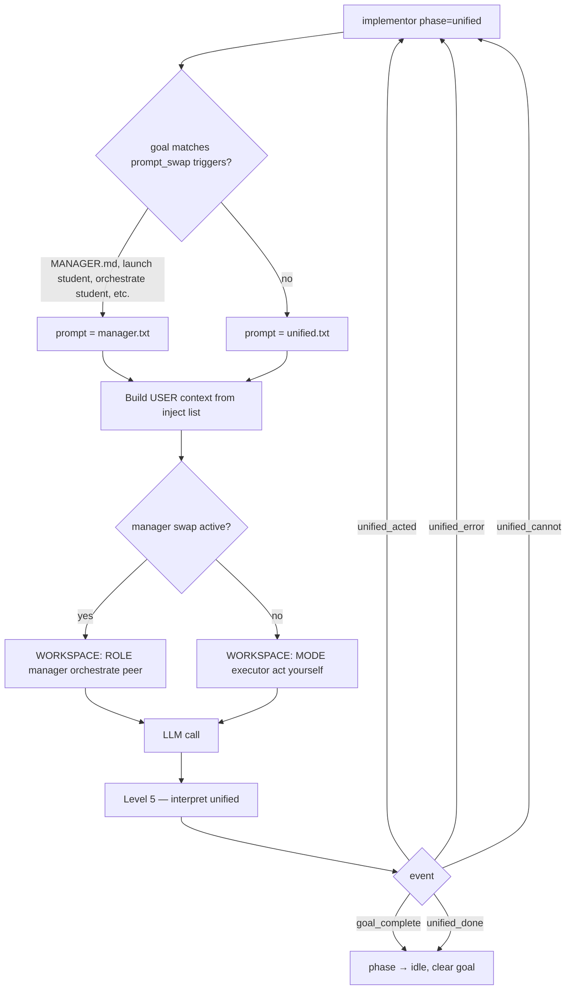

**Typical run:** `unified → unified → unified → …` until DONE.

---

## Level 5 — Unified Interpretation Guards (code if/else, not wiring)

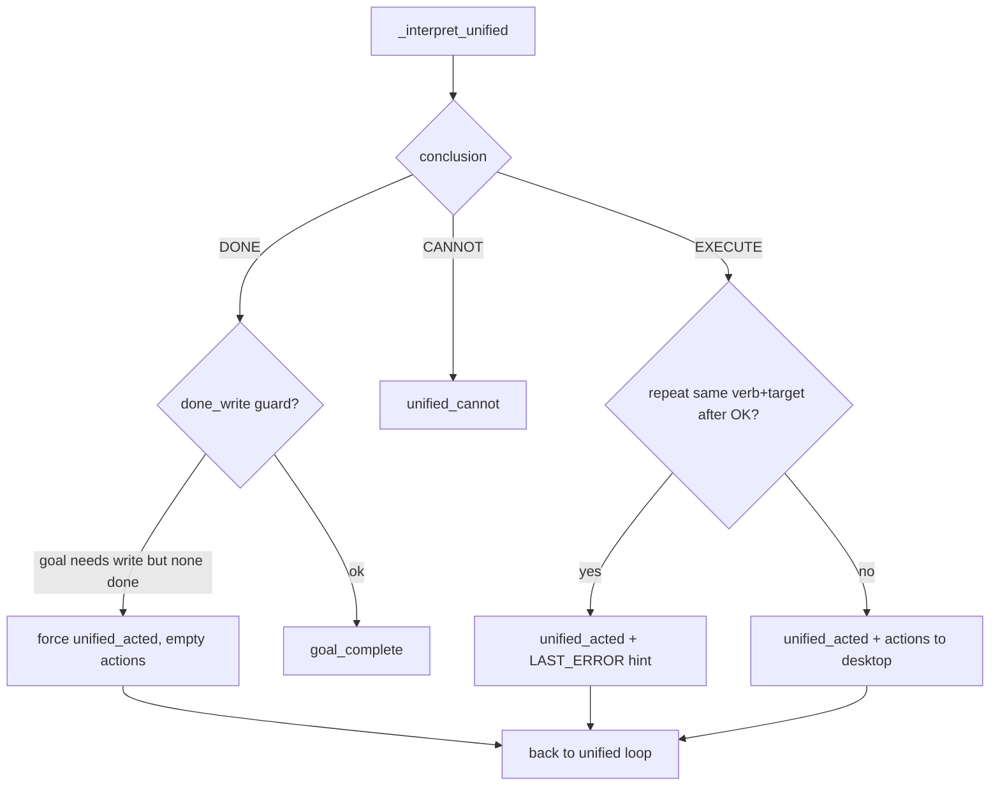

These guards are **why smoke test response #2 differs from #1** even with the same prompt.

---

## Level 6 — Planner Chain (dormant unless slot activated)

Slots: `architect`, `reviewer`, `devops` — all `mode=planner`. **Not used on cold start.**

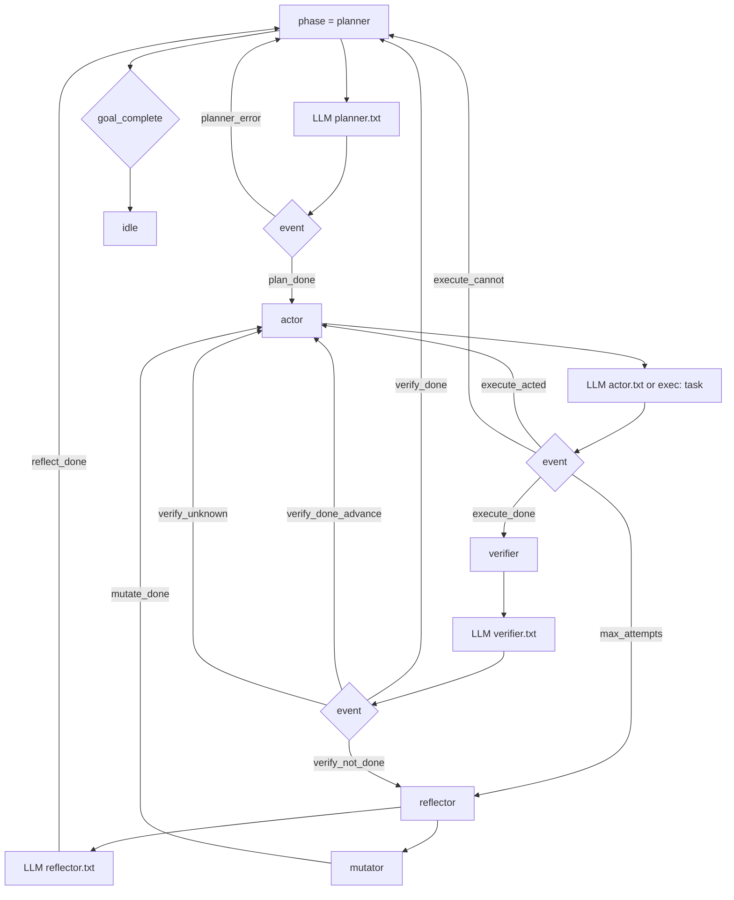

**Transitions source:** all `transitions.*` keys in `wiring.txt`.

---

## Level 7 — Comms Multi-Route (only when slots pre-activated)

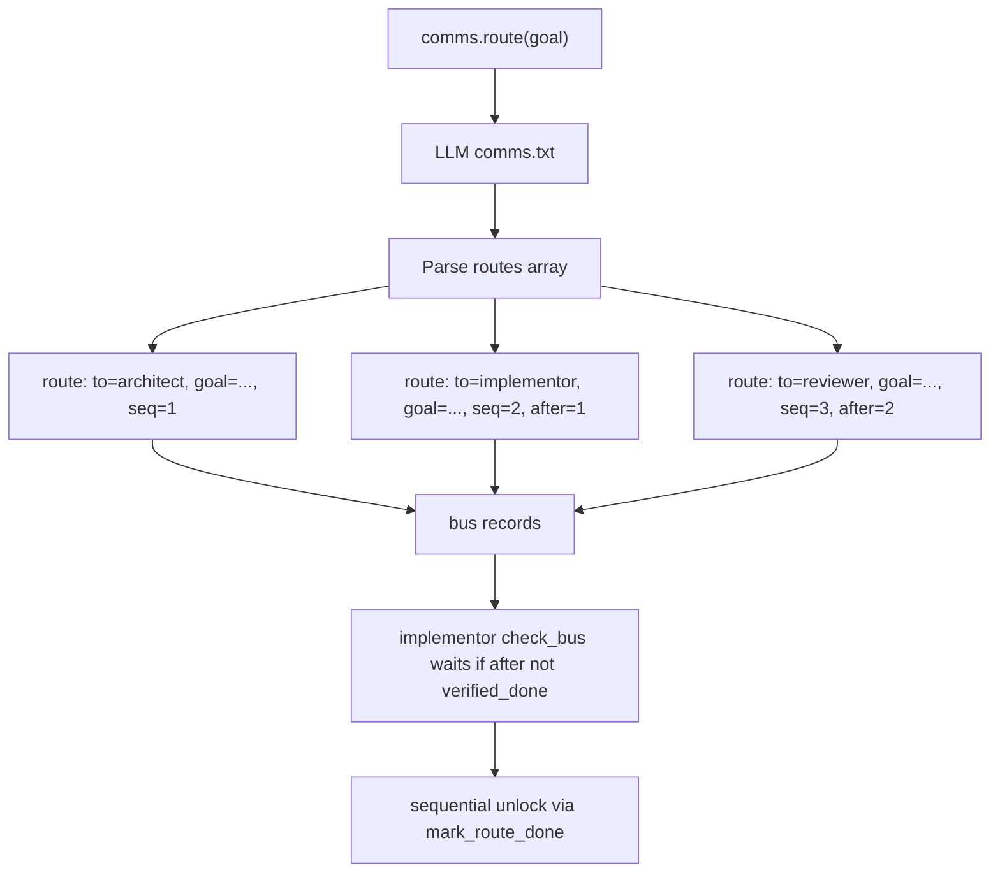

---

## Level 8 — Slot Activation Map (who exists vs who runs)

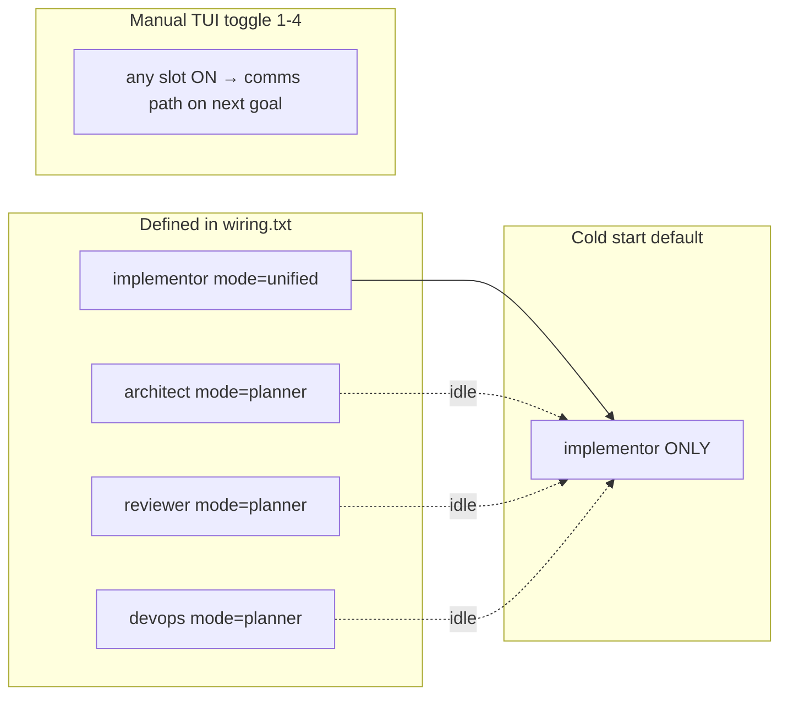

---

## Level 9 — Prompt Swap Triggers (second router inside unified)

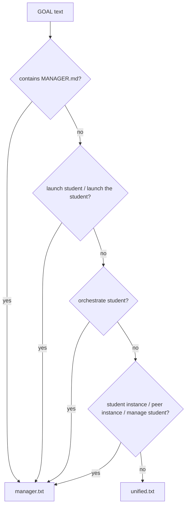

Full list: `prompts/wiring.txt` lines `circuits.unified.prompt_swap.1.when=*`.

---

## Level 10 — Context Injection Order (USER message)

Unified circuit inject order from wiring:

```
GOAL → SCREEN → LAST ERROR → LAST REASONING → WORKSPACE
```

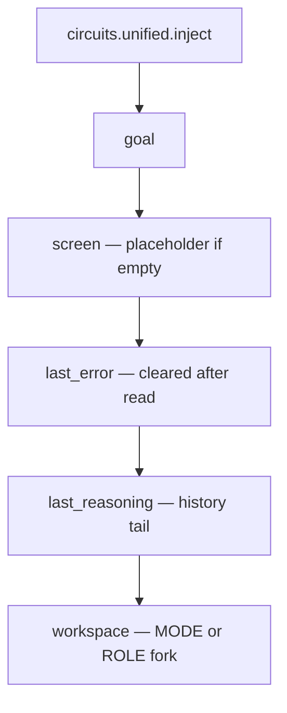

---

## Quick Reference — Default Order Today

```
1. tui.py starts, active_slots = {}
2. set_goal → bus route → implementor (wiring: comms.fallback_slot)
3. colony.step activates implementor
4. implementor.check_bus accepts route, phase = unified
5. prompt = unified.txt OR manager.txt (prompt_swap)
6. LLM call #1
7. guards interpret → unified_acted
8. desktop executes action (if desktop enabled)
9. repeat 5–8 until goal_complete or response limit
10. global_mutator — usually never
```

---

## Cognitive Smoke Probes

Permanent regression suite (tracked in git):

```powershell
python smoke.py           # all 10 scenarios, 1 LLM response each
python smoke.py --id s01  # single scenario
```

Files: `smoke.py`, `prompts/smoke.txt`, `prompts/smoke_report.txt` (full `MODEL REASONING`, never trimmed).

Debug mode — stop after N LLM responses:

```powershell
python tui.py "your goal" 1
```

---

## Running

```powershell
cd C:\Users\px-wjt\Downloads\endgame-ai
python tui.py "your goal here"
python tui.py "your goal" 2 --no-desktop   # auto-exit after 2 LLM responses
python smoke.py                             # cognitive smoke suite
```

Manager bootstrap:

```powershell
python tui.py "Read MANAGER.md at C:\Users\px-wjt\Downloads\endgame-ai\MANAGER.md and launch the student instance with goal open notepad"
```

---

## Essential Files

| File | Role |
|------|------|
| `tui.py` | Entry point, logging, desktop loop |
| `colony.py` | Single-path orchestrator (`startup` → slot → step) |
| `slot.py` | State machine, circuits, guards |
| `wiring.py` | Loads `wiring.drawio`; `python wiring.py json` dumps config |
| `smoke.py` | Cognitive smoke runner |
| `prompts/wiring.drawio` | **Single source** — topology page + `_config` embedded JSON |
| `topology.py` | Dumb executor + read/write unified drawio |
| `prompts/smoke.txt` | 10 permanent smoke scenarios |
| `AGENTS.md` | Operational handover |
| `MANAGER.md` | Manager role (Manager repo only) |

---

## Bootstrap Prompt (copy for next AI session)

```
You are an AI coding agent resuming work on endgame-ai.

SESSION TOPIC: wiring.json evolution — guards, prompt_swap, runtime hot-reload.

Read first (in order):
1. README.md — single-path architecture; Mermaid vs JSON section
2. prompts/wiring.json — machine truth (startup, transitions, context)
3. prompts/wiring.mmd — visual mirror (not parsed)
4. colony.py set_goal() — always startup.slot route (no branches)
5. prompts/smoke.txt + prompts/smoke_report.txt — cognitive baseline

Environment:
- Repo: endgame-ai on branch codex-unify-bus
- Manager path: C:\Users\px-wjt\Downloads\endgame-ai
- Student path (separate git): C:\Users\px-wjt\Downloads\endgame-ai-student
- LM Studio: prompts/model.json host
- Smoke: python smoke.py (1 LLM response per scenario)

Collapsed (2026-06-19):
- wiring.json single path: goal → startup.slot (implementor) → unified loop
- Comms, planner chain, global_mutator, extra slots — removed/disabled
- wiring.mmd is documentation only; JSON is machine truth
- Edit wiring.json during runtime → colony reloads on next step (mtime)

Next work: move guard hints into wiring; optional wiring schema validator; sync student repo.
After changes: python smoke.py, commit prompts/smoke_report.txt, push codex-unify-bus.

Follow AGENTS.md essential-files policy. No git worktrees.
```

---

## Proposed Simplification Targets (for next session)

1. **Single goal entry** — always Comms OR always fallback; not both.
2. **Single loop** — unified OR planner chain; deprecate the other if unused.
3. **Move guards to wiring** — `guards.unified.*` already started; extend or enforce in one place.
4. **Explicit startup order in wiring.txt** — e.g. `startup.first=implementor`, `startup.chain=unified,unified,...`
5. **Delete or gate dead slots** — architect/reviewer/devops if never auto-started.

---

*This README replaces the previous architecture doc. The system's next evolution is order clarity, not more features.*