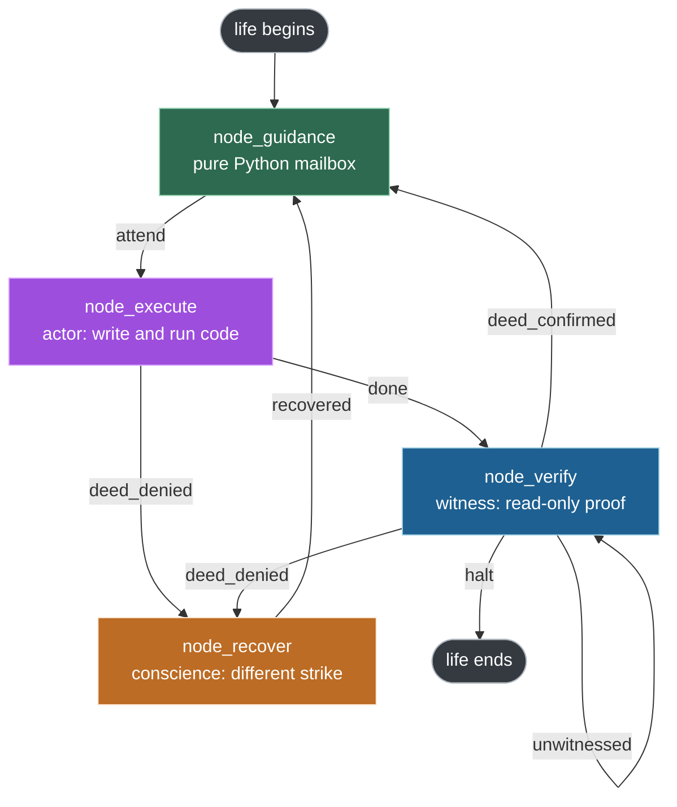
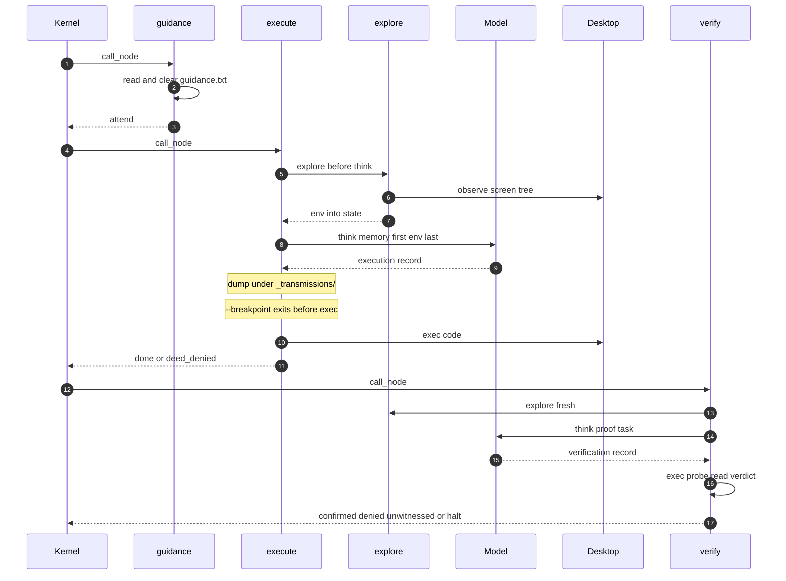
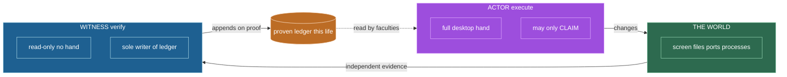
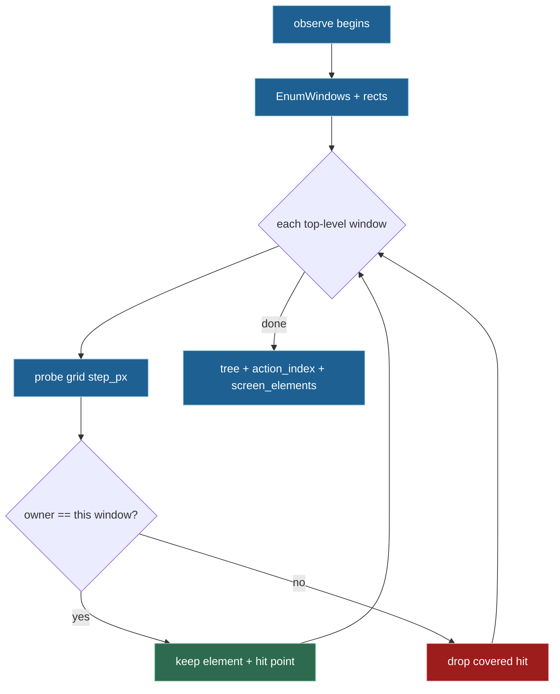
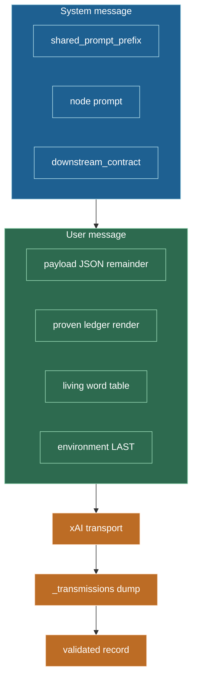
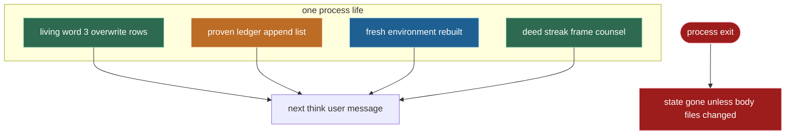
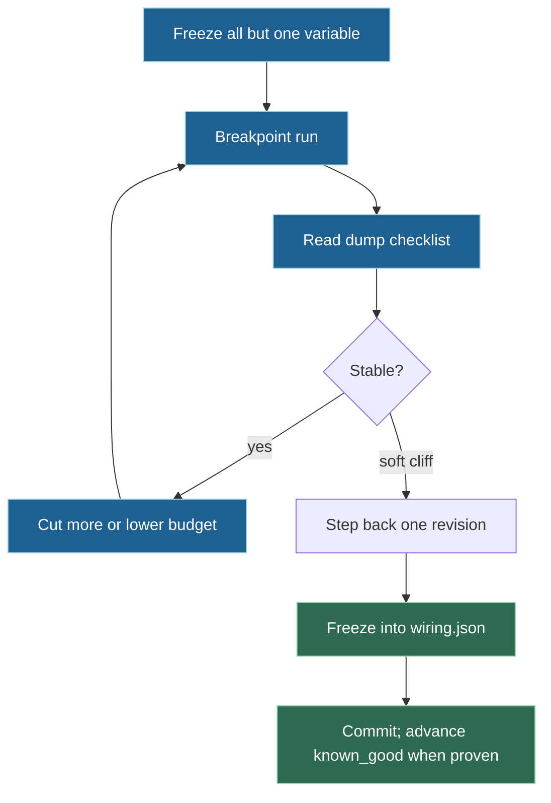
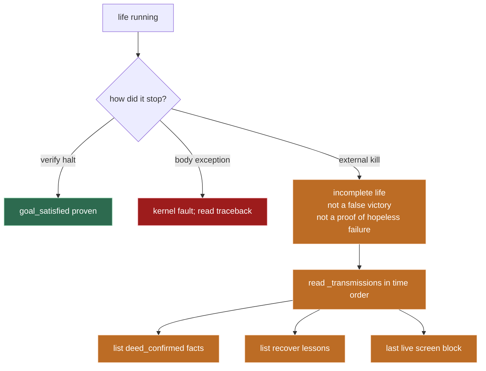

# endgame-ai

A pure **atemporal**, **task-agnostic**, **self-modifying** LLM organism that drives a real
**Windows 11** desktop the way a human operator would: look at the screen, move mouse and
keyboard, run commands, and rewrite its own body when the true fault is in its DNA.

This file is the **north star**. It is written to stay true across sessions. It carries
architecture, laws, methodology, and **honest proof status**. The live code on disk is always
the final authority. Read this file **and** the code; where they disagree, **the code wins**.
When a claim here cannot be derived from disk or from named dumps, it is a defect in this file.

Any human, any AI session, or the organism itself that reads this should leave knowing: what the
system is, what it must never become, how a life turns, what memory is and is not, how to tune
under breakpoint, what is proven, what is open, and how self-evolution is allowed without cages.

---

## Table of contents

- [The one-paragraph version](#the-one-paragraph-version)
- [Three ways to read this](#three-ways-to-read-this)
- [Why this is not a normal agent](#why-this-is-not-a-normal-agent)
- [The seven non-negotiable rules](#the-seven-non-negotiable-rules)
- [System topology](#system-topology)
- [The life of one turn](#the-life-of-one-turn)
- [The four nodes](#the-four-nodes)
- [The Law of Separated Powers (resolved liar paradox)](#the-law-of-separated-powers-resolved-liar-paradox)
- [Perception and environment injection](#perception-and-environment-injection)
- [How the prompt is assembled](#how-the-prompt-is-assembled)
- [Memory: living word and proven ledger](#memory-living-word-and-proven-ledger)
- [Record contracts](#record-contracts)
- [Desktop body and capability namespaces](#desktop-body-and-capability-namespaces)
- [The wiring document](#the-wiring-document)
- [Transmission dumps and CLI breakpoint](#transmission-dumps-and-cli-breakpoint)
- [Tuning methodology](#tuning-methodology)
- [Repository shape and complexity](#repository-shape-and-complexity)
- [What is proven (evidence, not hope)](#what-is-proven-evidence-not-hope)
- [What is not proven](#what-is-not-proven)
- [How to read a life (especially an interrupted one)](#how-to-read-a-life-especially-an-interrupted-one)
- [Running it](#running-it)
- [Offline gates](#offline-gates)
- [Design laws that never change](#design-laws-that-never-change)
- [Working methodology](#working-methodology)
- [Idea reservoir (not shipped)](#idea-reservoir-not-shipped)
- [File-by-file map](#file-by-file-map)
- [Glossary](#glossary)

---

## The one-paragraph version

endgame-ai does not run a fixed task script. It runs a **wheel**. Four steps turn: read any human
note, act on the screen, prove the act with independent evidence, recover when an act fails. A
single plain-language **root goal** is handed in from outside. The wheel turns until that goal is
**independently proven** done, the body raises, or the process is stopped from outside. Between
steps it keeps only small **process-local** state: a three-row rewritable lesson table (the
**living word**), an in-process list of witnessed facts for this life (the **proven ledger**), and
a few brief fields. It has no conversation-history product and no on-disk product memory of past
lives. It never trusts its own claim that something worked. Something is true for the wheel only
when a separate part (the **witness**) proves it by looking at the world. Everything the organism
*is* lives chiefly in `wiring.json` plus a handful of hot-swappable Python body files, and the
organism is allowed to rewrite that body.

---

## Three ways to read this

### For anyone

You give one sentence. The system does not follow a fixed script. It repeats an honest loop:

1. Check for a short operator note (if any).
2. Look at the whole screen.
3. Do **one** small deed (click, type, command, file write, or even edit its own code).
4. Check that deed with a **different** method than the one that did it.
5. If proven, remember it for this sitting and continue. If not, name the real defect and try a
   **different kind** of approach.

It is not allowed to say "done" and be believed. A separate inspector must confirm from the real
world. That separation is the heart of the system.

### For a CEO

The expensive failures of automation are work that never happens, and **false claims that it did**.
endgame-ai attacks the second failure **structurally**: the part that acts cannot be the part that
signs off. False victory cannot enter the proven record of a life without an independent witness.

It is **task-agnostic**: one system, any goal expressible in a sentence, real desktop as the hand.
It is transparent: DNA in one JSON file plus a small kernel. It can improve itself when the fault
is in its tooling. It is deliberately careful and step-by-step. Correctness beats raw speed when a
false "done" is expensive.

### For an engineer

A small kernel turns a **directed graph** defined in `wiring.json`. Four nodes in `core_nodes.py`.
Before every thinking faculty call, Python **explores** (window-first UI tree + host facts). The
actor authors and `exec`s world-changing Python. The witness authors and `exec`s read-only proof
probes. Capability namespaces enforce Separated Powers. State is minimal. Fail-hard. Subtraction
ethos. Full request/response dumps under `_transmissions/` for science and forensics.

---

## Why this is not a normal agent

| Typical agent | endgame-ai |
| --- | --- |
| Growing conversation history | Atemporal process state: living word (3 overwrite rows) + ledger (in-life list) |
| Trusts model self-report | Witness proves by independent effect |
| Tool menu | The only tool is **code** the actor authors |
| Perception is optional | Perception is automatic before every think |
| Task logic baked in | Task-agnostic; goal is one sentence per life |
| Fixed framework | Self-modifying; may rewrite body and wiring |
| Blind retry | Recovery must change **kind** of approach |
| Internal step cages | No internal cap the organism cannot rewrite |
| Silent context truncation | Ranked env budget with **visible** omission markers |
| Env vars as secret control | Interjection is **CLI** `--breakpoint` only |

---

## The seven non-negotiable rules

1. **Task-agnostic.** No product task logic in the body for chess, LinkedIn, email, or any single
   app. Goals arrive as plain language. Temporary experiments must not become permanent DNA.

2. **Code-as-action.** The actor authors Python and runs it. Progress is scripts: GUI, CLI, APIs,
   filesystem, or rewrite of body files.

3. **Environment discovery and scripted chaining.** Multi-step GUI must not assume success. Prefer
   deterministic self-checks inside a script. Unpredictable surfaces favor shorter scripts and more
   witness laps.

4. **Independent witness.** Actor testimony, including files the actor wrote this life, is void as
   proof. Only effects from systems other than the actor count.

5. **Living word of lessons; ledger of proven effects only.** Narrative memory is three rewritable
   faculty rows. "Do not redo" inside this life is the proven ledger. Neither is a disk chat log.
   Environment is re-looked every think, not stored as a growing diary.

6. **Hot-swappable body.** Nodes, topology, prompts, and knobs are ordinary files. The organism may
   edit them when the true fault is in its DNA. Useful self-evolution should be committed like any
   other improvement. Self-modify is **allowed by law in the prompts and by code-as-action**; it is
   not a separate product module with its own UI.

7. **Choose surface by feasibility.** GUI, shell, raw Python, local or remote models, registry,
   ports: the quarry chooses the surface, not habit.

---

## System topology

Four nodes. `node_guidance` is pure Python (no model). The other three each make **exactly one**
model call per visit. Signals select the next node.



| From | Signal | To |
| --- | --- | --- |
| node_guidance | attend | node_execute |
| node_execute | done | node_verify |
| node_execute | deed_denied | node_recover |
| node_verify | deed_confirmed | node_guidance |
| node_verify | deed_denied | node_recover |
| node_verify | unwitnessed | node_verify |
| node_verify | halt | life ends |
| node_recover | recovered | node_guidance |

`cycle_start = node_guidance`. There is **no** internal turn cap. External stop (Ctrl+C, kill
process, operator shutdown) ends the life with whatever state was reached. That is not a verdict
that the wheel "failed" or "succeeded"; it is only that the process stopped. See
[How to read a life](#how-to-read-a-life-especially-an-interrupted-one).

Two honesty loops that matter:

- `unwitnessed -> node_verify`: a broken probe is not a world judgment. Simplify the probe.
- Denials go to recover, which must change **kind**, including (when streak rises) mending body code.

### Fractal names (colon instances)

Topology node ids may be plain (`node_execute`) or qualified (`node_execute:surface_a`). Resolution
is `name.split(":", 1)[0]` against `FACULTIES`. Live default DNA uses four plain names only. Richer
graphs are wiring-legal when edges and bases validate. Prefer wiring instances over forking kernels.

---

## The life of one turn



`explore(ctx)` always runs inside `BaseNode.think()` immediately before the model call. The model
never has to "ask to look." Looking is free and mandatory.

---

## The four nodes

### node_guidance

Pure Python. Reads and clears `paths.guidance` (default `guidance.txt`). Emits `attend` with
`latest_counsel` (empty string if no note). No model call. No explore.

### node_execute (actor)

One model call after explore. Authors one Python script; `exec` in full capability namespace.
Clean run -> `done`. Raised script -> `deed_denied` then recover (life does not die on actor fault).

Discipline that is load-bearing in prompts and practice:

- One unknown fruit then cease; prepare-and-read may chain when outcomes are gated.
- Click needs two ints: `desktop.click(action_index["eN"]["px"], action_index["eN"]["py"])`.
- Short ids die each look; reacquire from this turn's tree / action_index.
- Stdlib via import; body powers by bare name.
- Mid-script re-look is `desktop.observe(config)` (legacy method name). Config is a **dict or
  None**. Non-dict args are ignored and defaults used (harden so a bare number no longer
  TypeErrors). Prefer explicit `time.sleep` for waiting; do not treat observe as sleep.

### node_verify (witness)

One model call after explore. Authors **read-only** Python. Must set `verdict` with:

- `goal_satisfied`: bool
- `deed_confirmed`: bool
- `reason`: non-blank string

| Verdict | Signal |
| --- | --- |
| goal_satisfied true | halt (whole goal proven) |
| deed_confirmed true (goal not whole) | deed_confirmed, append ledger, back to guidance |
| neither | deed_denied then recover |
| probe raises before verdict | unwitnessed then verify again |

No middle verdict. Lacking independent advance, `deed_confirmed` is false. Actor files this life are
void as proof. That strictness is **feature, not bug**: it is how false victory is refused.

### node_recover (conscience)

One model call. Names true defect in `lesson`, frames different `target` / `strategy`, builds
`action_frame` for the actor. Higher `failure_streak` demands wider kind-change, up to mending body
code. That path is **on purpose**: self-heal by code-as-action, not a missing feature.

---

## The Law of Separated Powers (resolved liar paradox)

A claim that warrants itself proves nothing. An organism that trusted its own unverified claims
would loop on a lie or declare false victory. That is the **liar paradox** of self-report.

endgame-ai resolves it by **separation of powers**, not by hoping the model is honest:

- The actor moves the world and may only **claim**.
- The witness proves an effect from a system other than the actor, and has **no hand** to move what
  it judges.
- Actor testimony this life is void as proof.
- Only the witness writes the proven ledger.

Enforced in `build_capability_runtime`:

- Full namespace: `desktop`, `action_index`, `consult_model`, ...
- `read_only=True`: `observe` + stdlib-oriented reads only (no `desktop` hand).



Further seams:

- **Deed-fault:** actor `exec` raises -> recover (not death).
- **Unwitnessed:** probe raises before verdict -> re-probe (not false denial of the world).

---

## Perception and environment injection

### Window-first observe

`core_observation.observe()`:

1. Enumerate top-level windows (`EnumWindows` + `GetWindowRect`).
2. For each window rect, probe a grid (`exploration.step_px`). Real cursor moves (`SetCursorPos`).
3. Keep an element only if `GetAncestor(WindowFromPoint)` owns that window. Covered pixels contribute
   nothing for that window.

Consequences:

- Occluded UI is invisible. Honest tree cannot invent covered faces.
- Model-facing text is a **shallow tree**: short id, role, name, affordance. Coordinates live in
  `action_index` for the executor, not as free text in the user message.
- Subtree harvest per point is bounded by `max_subtree_nodes_per_point`.



### Ranked environment budget

`core_bus.render_environment` spends `exploration.max_environment_chars` deterministically:

1. Window title lines first.
2. Element lines with fair share across windows, then round-robin.
3. Host core facts reserved (platform, machine, user, cwd, python, shell tools).
4. Omissions end with an explicit `[environment budget: ...]` marker, never silent mid-line cut.
   (Host no longer gathers a Start-Menu installed-apps list; that bloat is gone from DNA.)

Living word and proven ledger are **outside** this budget and can still bloat requests in a long
life.

**What env-budget tuning proved (and what it did not):**

Breakpoint ladder work on a **busy dual-surface desktop** (chess boards used as a dense, visible
fixture, not as product task DNA) showed:

| Budget band | Observed effect on that fixture |
| --- | --- |
| Too low (~3k-5.5k) | Critical controls dropped (Edit / Send / board state) |
| ~6k on that fixture | Interactive faces kept when apps list was still deferred |
| Higher (~12k) | More room for multi-window faces after apps list was removed |

Live wiring holds `max_environment_chars = 12000` (re-read `wiring.json` if this line and disk
disagree). Ladder work proved **budget vs visible controls on that layout**, not "deep
categorization is solved for every goal forever." The tree remains shallow by design. Re-measure
when desktop density changes.

### Naming: exploration vs observation (history)

Commits B13/B14 collapsed probe/expand into **one always-on exploration** and rewrote model-facing
prose so the environment is **PRESENTED**, not "fetched" by an observe profile. Wiring knobs live
under `exploration.*`. Pre-think path is `explore(ctx)` in `core_nodes.py`.

Legacy names still exist on disk for the **hand re-look API**: file `core_observation.py`, method
`desktop.observe(...)`, witness bare name `observe()`. Those are mid-script re-scans of the screen,
not a separate perception faculty. Prefer saying **exploration** for the automatic pre-think path
and **presented environment** for what the model reads.

---

## How the prompt is assembled

Stable content first, volatile last (prompt-cache / KV reuse).



- Structured outputs on; schema from `record_contracts`.
- Organs merge overrides into the request (including `reasoning.effort`). Edit request **and**
  organs when tuning effort.
- **Never** put live screen text into the system prefix.

Prompts use a dense biblical (KJV commandment) register on purpose. Distillation compresses; it
must not secularize.

---

## Memory: living word and proven ledger

| Channel | Kind | Writer | Structure | Survives process exit? |
| --- | --- | --- | --- | --- |
| Living word | Subjective lessons | Each faculty overwrites its row | execute / verify / recover + root goal as lodestar | **No** |
| Proven ledger | Objective do-not-redo this life | Witness only on confirm | `list[str]` on process state | **No** |
| Fresh environment | Reality this look | Python explore every think | Tree + host, budgeted | **No** |

Truths that must not be hidden:

1. Scope of the ledger is **one process life**. A new `python core_organism.py "..."` starts empty.
2. Nothing is written to disk as a **product** ledger. (The actor may write ordinary files on disk;
   those are world effects, not the in-process ledger product.)
3. Dedup is exact string only. No cap. Long lives grow token cost.
4. Short UI ids die each look.



---

## Record contracts

| Record type | Faculty | Required non-empty fields |
| --- | --- | --- |
| execution | execute | perceived, alternatives, intent, code, goal_interpretation |
| verification | verify | code, goal_interpretation |
| recovery | recover | lesson, target, strategy, goal_interpretation |

`additional_properties: false`. Fail-hard validation in transport assembly.

---

## Desktop body and capability namespaces

`core_desktop.py` is the hand (Windows UI Automation + ctypes input).

| Method | Role |
| --- | --- |
| observe(config) | Mid-script re-look; config is dict or None |
| click(x, y) | Physical click two ints |
| type_text / paste / set_clipboard | Text roads |
| press_key / hotkey / scroll / open_url | Keys, wheel, browser open |

| Name | Actor | Witness |
| --- | --- | --- |
| desktop | yes | no |
| action_index | yes | no |
| consult_model | yes | no |
| observe | via desktop | yes (read_only bare) |
| screen_elements / stdlib | yes | yes |
| repo_root, python_executable | yes | yes |

---

## The wiring document

`wiring.json` is editable DNA. Shape (values live on disk; re-read the file):

```
schema, model (transport_xai, request, organs, profiles),
paths.guidance,
exploration (step_px, max_subtree_nodes_per_point, max_environment_chars),
topology (cycle_start, nodes, edges),
shared_prompt_prefix, prompt_templates, prompts,
record_contracts
```

Knobs that most affect sight and request size:

| Knob | Effect |
| --- | --- |
| max_environment_chars | Env injection cap |
| step_px | Probe density |
| max_subtree_nodes_per_point | Harvest cap per probe |
| temperature | Variance (live often 0.0 for tight records) |
| reasoning.effort | Hidden reasoning depth; request size unchanged |
| max_output_tokens | Completion ceiling |

There is no wiring knob for ledger max length. That absence is real.

---

## Transmission dumps and CLI breakpoint

Every transport call writes a full dump under `_transmissions/<stamp>_<id>/` and updates
`_transmission_latest.json` / `_transmission_latest_dir.txt`.

Typical files: `content.txt`, `message_system.txt`, `message_user.txt`, `request_body.json`,
`meta.json`, reasoning/content splits.

```text
python core_organism.py --breakpoint "one transmission goal"
```

| Mode | Behavior |
| --- | --- |
| default | Life continues after dump; exec may run |
| `--breakpoint` | After dump, `sys.exit(42)` before any exec |

Implemented as a runtime flag from argv (`core_brain.set_break_after_response`). Not an environment
variable. Primary science mode: one transmission, analyze, stop. Do not open-loop thrash while
benchmarking prompts or env budgets.

There is **no** claim-only CLI on the current body. Multi-faculty dry-run without world mutation is
not a shipped flag; use breakpoint per faculty life or accept real exec.

---

## Tuning methodology



Do not: open-loop thrash mixed with A/B; add fallback cages; secularize prompts; put env into system
prefix; invent a parallel agent product beside this kernel.

---

## Repository shape and complexity

Body is intentionally small. Approximate line counts of tracked runtime DNA (excluding this README,
`.git`, dumps, caches):

| File | Role | Lines (approx.) |
| --- | --- | --- |
| core_observation.py | Window-first perception | ~400 |
| core_brain.py | Transport, dumps, breakpoint | ~400 |
| core_nodes.py | Faculties, explore, namespaces | ~340 |
| core_bus.py | Records, env budget, memory render | ~290 |
| core_wiring.py | Load and validate DNA | ~185 |
| wiring.json | Model, topology, prompts, knobs | ~180 |
| core_desktop.py | Hand | ~140 |
| core_organism.py | Kernel loop + CLI | ~70 |
| **Python + wiring total** | | **~2000 lines** |

That is the whole organism body. Complexity lives in **contracts and laws**, not in framework
layers. Untracked at runtime: `_transmissions/`, optional operator files, any actor-written
workspace debris.

---

## What is proven (evidence, not hope)

Claims below are grounded in **disk contracts** and/or **named transmission dumps**. Nothing else
is "proven" in this document.

### Proven by code on disk (always re-check)

- Four-node wheel with the edge table above (`wiring.json` topology).
- Separated Powers via capability namespaces (`core_nodes.build_capability_runtime`).
- Auto explore before each think (`BaseNode.think` -> `explore`).
- Ranked env budget with visible markers (`core_bus.render_environment`).
- Always-on transmission dumps (`core_brain`).
- CLI `--breakpoint` exits after dump before exec (`core_organism` + `core_brain`).
- Fail-hard wiring load and record contracts.
- Process-local living word and proven ledger; no product chat memory.
- Self-modify is **lawful**: shared prefix and recover prompt authorize rewriting body files when
  effect mismatches word. Mechanism is ordinary code-as-action, not a second engine.

### Proven by live open-loop dumps (operator goal: LinkedIn + Grok consult path)

Dump set under `_transmissions/` with stamps starting `20260720_121918` through `20260720_122516`
(19 model transmissions in one process life). Faculties visited: execute, verify, recover (full
wheel). HTTP 200 on transports. Screen trees refreshed (taskbar clock advanced across dumps).

Grounded outcomes from those dumps and console witnesses:

1. **Witness correctly refused empty progress.** Early verify denied "I listed the repo" as
   non-advance (`deed_confirmed: false`; reason: baseline tree existence is not new ledger
   advance; whole LinkedIn goal unmet). That is Separated Powers working, not "the system failed."

2. **Witness correctly confirmed a real filesystem advance.** Later verify set
   `deed_confirmed: true` for creation of a readable
   `proven_ledger/directory_snapshot.md` under the repo (independent FS witness; whole goal still
   false). The in-process proven ledger of that life recorded the witnessed fact. Note: the
   on-disk folder name is actor scaffolding for that goal wording; it is **not** the product
   in-process ledger mechanism.

3. **Perception + injection delivered a real multi-app desktop.** Live screen blocks showed
   desktop, PowerShell, Chrome, and later **Grok** UI with short ids including an
   **Edit "Ask Grok anything"** control. Environment budget markers appeared when installed_apps
   were dropped under cap.

4. **Recovery ran as designed; the observe bug was real; the body mend did not finish that life.**
   - **Real problem?** **YES.** Actor called `desktop.observe(2)` / `observe(0.5)` (number as
     config). Body expected a dict; `dict(2)` / `dict(0.5)` raised TypeError. That is a real API
     misuse / contract hole, not a false alarm.
   - **Solved in that life?** **NO.** Recover named it. One execute tried to patch
     `core_observation.py` inline and died with SyntaxError. Last recover planned a file-based
     mend. Process stopped before a witnessed successful DNA fix. Repo body was still unfixed at
     kill time.
   - **Continued anyway after first hit?** **YES.** After the first observe(int) deny, next execute
     avoided observe and drove Chrome address bar to grok.com (Grok UI then appeared). Later it
     called observe(float) again on the Grok chat path, crashed again, then tried body mend. Wheel
     kept turning; it did not freeze forever on one fault.

5. **The life advanced past scaffolding toward the browser surface.** After a confirmed disk
   snapshot, execute moved to Chrome / grok.com. Grok surface appeared in the presented tree. The
   life did **not** reach a verified multiturn Grok consult completion or any LinkedIn publish.

6. **The process was stopped from outside before the wheel halted on goal.** There is no
   `halt` signal in that dump set. External stop is allowed by design (no internal cage). An
   interrupted life is **not** a proof that self-heal cannot continue; it is only incomplete
   record of a life that was still turning (recover / mend path active).

### Proven by breakpoint / ladder methodology (sight science)

- Env char ladder on a dense dual-surface desktop justified freezing `max_environment_chars` near
  6000 for that class of density (see Perception section).
- Distillation + click recipe: execute prompt carries `action_index` px/py click pattern; lower
  budgets and looser prompts previously lost critical controls or correct click shape.

---

## What is not proven

Honest open list. Do not paper these over.

- **Full goal completion** of the LinkedIn Open-to-Work + Premium + article path: not witnessed.
- **Completed multiturn Grok.com consult** as independent effect: not witnessed (surface reached;
  sent consult not proven).
- **"Depth categorization solved for every app forever"**: false reading of the env-budget chess
  fixture. Proven is budget vs visible controls on that layout; tree remains shallow.
- **Self-modify completing a successful body mend in that open-loop life**: not proven (see YES/NO
  above). Later DNA may harden observe separately; that is a new change, not log proof from the kill.
- **Cross-life product memory**: not a feature. Only body files persist if edited and saved.
- **Long-life ledger token pressure under control**: no cap; unproven under multi-hour lives.

---

## How to read a life (especially an interrupted one)



Rules of interpretation:

1. **Only witness-confirmed facts are "done" for the wheel.** Actor intent is not done.
2. **Strict verify is success of the architecture** when it denies hollow claims. Slow progress that
   is honest is not failure of the design.
3. **Recover directing body mend is on-mission**, not a missing product. The logs show the organism
   using the self-evolution *permission* it already has.
4. **Operator kill ends observation**, not necessarily the causal story. If the last dumps show
   recover framing a different kind of strike, the fair statement is: life interrupted mid
   self-heal path; goal incomplete; partial advances may still be real.
5. **Do not invent credentials or victory.** Published LinkedIn text that no dump witnesses is not
   done. Grok consult not independently confirmed is not done.

### Compact narrative of the 2026-07-20 open-loop life (forensics, not shame)

| Stage | What the dumps show |
| --- | --- |
| Early | Actor explored / tried disk scaffolding; verify denied non-advance (correct) |
| Mid | Actor produced a real snapshot file; verify confirmed it (correct); whole goal still false |
| Later | Actor opened Chrome and reached a Grok surface visible in the tree |
| Late | Actor scripts faulted on `observe(number)`; recover named the defect and pushed kind-change / body mend |
| End | External stop; no halt; no LinkedIn publish; no proven Grok multiturn completion |

That sequence is **partial success of the honesty machine** plus **incomplete goal**, not "the
system proved it cannot work." Treating recover's self-modify direction as "we never implemented
self-evolve" misunderstands the design: self-evolve **is** code-as-action under Separated Powers,
and the logs are the evidence trail of that attempt.

---

## Running it

Requires **Windows**, **`XAI_API_KEY`**, Python with project deps (`comtypes` for UIA).

### Full life (world may change)

```text
python core_organism.py "your one sentence root goal"
```

Explore moves the real cursor. Dumps always write. Wheel continues until halt, raise, or external
stop.

### Breakpoint (no world deed)

```text
python core_organism.py --breakpoint "inventory what the fresh environment shows"
```

Exit code 42 after first dump is expected.

---

## Offline gates

Minimum honesty checks before claiming body health:

```text
python -m py_compile core_organism.py core_wiring.py core_nodes.py core_brain.py core_bus.py core_desktop.py core_observation.py
python -c "import core_wiring as w; w.load_wiring(); print('wiring ok')"
```

Offline gates are necessary, not sufficient. Live proof is dumps + independent effects.

---

## Design laws that never change

1. Code wins over README when they disagree; fix the README.
2. No fallback branches for unwired features. Fail hard.
3. No silent truncation of environment; markers or full lines.
4. No conversation-history product.
5. No baking tasks into DNA.
6. No cages the organism cannot rewrite.
7. Subtraction over addition.
8. Witness alone writes proven ledger for the life.
9. Prompt cache: stable system first; volatile env last.
10. Biblical register in prompts is load-bearing; distill, do not secularize.

---

## Working methodology

For humans and AI sessions editing this repo:

1. Read this README and the live `wiring.json` / `core_*.py` before changing behavior.
2. Prefer one-variable changes under `--breakpoint`.
3. Score dumps, not vibes.
4. Open-loop lives are for proof of effect; do not mix with A/B thrash.
5. When a life is interrupted, forensics first: list confirmed facts, last screen, last recover
   lesson. Do not declare total failure or total victory without witness.
6. Useful body mends that open-loop discovers should be cleaned, tested, committed, and pushed.
7. Advance `endgame/known_good` only when the operator accepts the new body as the known-good tip.
8. Never invent published LinkedIn content, API credentials, or "done" that dumps do not support.

---

## Idea reservoir (not shipped)

These are allowed thoughts, **not** claims of implementation:

- Ledger summary under witness rules if long lives prove token pain.
- Further rename residual "observation" identifiers to exploration if subtraction stays clean.
- Softer operator framing in goals so explore-first wording does not starve primary GUI goals.
- Fractal child life via subprocess + breakpoint dumps as outer witness material.
- Wire colon-instances only when measured need exists.

Do not promote reservoir items into "proven" without dumps and code.

---

## File-by-file map

| File | Role |
| --- | --- |
| core_organism.py | Kernel loop, CLI `--breakpoint` |
| core_wiring.py | Load/validate DNA |
| core_nodes.py | Faculties, explore, namespaces, call_node |
| core_brain.py | Message assembly, transport, dumps, breakpoint exit |
| core_bus.py | Records, signals, env budget, living word / ledger render |
| core_observation.py | Window-first perception |
| core_desktop.py | Hand |
| wiring.json | DNA |
| guidance.txt | Operator mailbox (runtime; optional) |
| README.md | This north star |
| _transmissions/ | Untracked dumps (science + forensics) |

---

## Glossary

| Term | Meaning |
| --- | --- |
| Life | One process run of `core_organism.py` with one root goal |
| Wheel | The four-node topology turning on signals |
| Actor | node_execute; moves world; may only claim |
| Witness | node_verify; proves; sole ledger writer |
| Recover | node_recover; kind-change after denial |
| Living word | Three overwrite lesson rows + root goal lodestar |
| Proven ledger | In-process list of witness-confirmed facts this life |
| Explore | Python perception before every think |
| Action index | Short id -> clickable px/py for this look only |
| Breakpoint | CLI mode: dump then exit 42 before exec |
| Separated Powers | Actor cannot judge its own deed |
| Halt | Witness signal that whole goal is satisfied |
| External stop | Operator kill; incomplete life, not a false halt |

---

*endgame-ai: honesty by architecture, progress by witnessed effect, body small enough to rewrite.*
