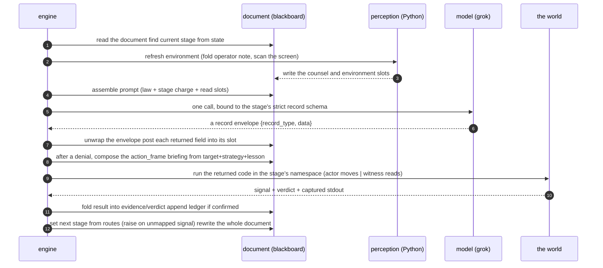

# endgame-ai

An atemporal, task-agnostic, self-modifying LLM organism that drives a real Windows 11 desktop the
way a human operator would: it looks at the screen, moves the mouse and keyboard, runs commands, and
is permitted to rewrite its own body while it runs.

The organism is a single document. One Markdown file carries the whole living thing: its laws, its
control policy, its memory, its perception code, and the small engine that turns its wheel. There is
no framework around it and no hidden store beneath it. Drop a needle on the document with a
one-sentence goal and it comes alive; kill it and it forgets everything, because it was never
anywhere but the document and the world in front of it.

This file is the durable knowledge base. It carries lasting truth only: architecture, laws, and
reasoning, written to be as useful in a hundred days as today. It carries no volatile session state
(no commit hashes, no "current phase", no proof-of-one-run). Every line is written to be atemporally
factual: what is, is stated as what is; what is intended but not yet done is stated plainly as not
yet done, so the reader is never misled into believing an aspiration is already flesh. The live
document on disk is always the final authority. Read it fresh, and where this file and the document
disagree, the document wins. This explains how and why; the document is what is.

---

## Table of contents

- [The one-paragraph version](#the-one-paragraph-version)
- [What is built and what is not yet done](#what-is-built-and-what-is-not-yet-done)
- [Why this is not a normal agent](#why-this-is-not-a-normal-agent)
- [It is a blackboard, not a wiring](#it-is-a-blackboard-not-a-wiring)
- [The document and its sections](#the-document-and-its-sections)
- [The config: stages and control](#the-config-stages-and-control)
- [The life of one turn](#the-life-of-one-turn)
- [The three faculties and the mailbox](#the-three-faculties-and-the-mailbox)
- [The Law of Separated Powers](#the-law-of-separated-powers)
- [How the deed runs](#how-the-deed-runs)
- [Atemporal memory: the living word](#atemporal-memory-the-living-word)
- [The failure streak and recovery](#the-failure-streak-and-recovery)
- [Hot-swappable body](#hot-swappable-body)
- [Perception and the environment](#perception-and-the-environment)
- [How the prompt is assembled](#how-the-prompt-is-assembled)
- [The records and their enforcement](#the-records-and-their-enforcement)
- [Transmission dumps](#transmission-dumps)
- [The hand and the capabilities](#the-hand-and-the-capabilities)
- [Running and observing](#running-and-observing)
- [Design laws that never change](#design-laws-that-never-change)
- [Standing intentions: known work not yet done](#standing-intentions-known-work-not-yet-done)
- [Working methodology](#working-methodology)
- [Glossary](#glossary)

---

## The one-paragraph version

Most software runs a task and stops. endgame-ai does not run a task at all; it runs a wheel. A few
stages turn continuously: act on the screen, prove the act with independent evidence, and recover
when an act fails. A single plain-language goal is handed in from outside, and the wheel turns until
the goal is independently proven done, the body raises, or the process is stopped from outside. The
organism keeps no memory between turns except a small handwritten note it passes forward to itself,
and it is meant never to trust its own claim that something worked: something is true only when a
separate faculty, one that could not have faked it, proves it by looking at the world. The whole
organism is one editable document, and the organism is permitted to rewrite that document, including
the rules that define itself, while it runs.

---

## What is built and what is not yet done

The organism runs today: it reads the document, refreshes perception, folds in any operator note,
calls the model under a strict per-stage schema, runs the returned code, folds the result back,
appends a proven ledger on a witnessed advance, escalates a failure streak, and rewrites the document
each turn. The actor/witness namespace separation is enforced at the point the code runs. The
operator note reaches every faculty. Recovery's whole briefing — its target, its strategy, and its
named defect — reaches the actor as one action_frame. The witness sees the deed's declared intent and
cannot overwrite the deed it judges. Routing fails hard: an unmapped signal raises rather than
drifting to a default.

Several ideas remain intentions, not flesh, and are gathered honestly in
[Standing intentions](#standing-intentions-known-work-not-yet-done) and flagged in place throughout,
so no section reads as a promise the code does not keep. The largest such gaps: the deed runs
in-process rather than as its own child program; the living word is a single overwritten string
rather than a multi-row faculty table; host facts are not gathered; the proven ledger keeps the raw
living-word text rather than a structured witnessed fact; and a body edit to the engine or the
capabilities does not take effect within the same life. Where a section describes such a thing, it
says plainly that it is not yet done.

---

## Why this is not a normal agent

| Typical agent | endgame-ai |
| --- | --- |
| Scattered across many framework files | One document is the whole organism: laws, control, memory, perception, engine. |
| Keeps a growing conversation history or memory store | Atemporal. Keeps only a small rewritten living word plus the fresh environment. |
| Trusts the model's self-report ("I completed the task") | Trusts nothing. A separate witness proves every claim by independent effect read afresh from the world. |
| Has a tool menu the model selects from | The only tool is code. The actor writes Python; the engine runs it as a real program. |
| Perception is a tool the model chooses to call | Perception is automatic. Python explores before every model call. |
| Task logic is coded into the agent | Task-agnostic. The goal is one sentence read fresh each life. |
| Framework code is fixed; the model works within it | Self-modifying by design. The organism may rewrite its own sections, and the engine re-reads the document's data each turn. |
| Retries the same action on failure | Recovery is charged to change the kind of approach, not repeat it. |
| Adds guardrails, limits, and step caps | No internal cap the organism cannot itself rewrite. Never caged. |

The organism has almost none of the usual "features." That absence is the design. Fewer moving
parts, one source of truth, honesty enforced by structure, and a body it is permitted to reshape.

---

## It is a blackboard, not a wiring

The organism is often drawn as nodes joined by wires, as if a deed's result travelled along an edge
into the next node. That picture is false, and naming it falsely hides the real shape. There are no
wires. There is one shared structure that every faculty reads from and posts back to, and a separate
control policy that decides who is woken next. That is the classic blackboard architecture, and
endgame-ai is one.

- The blackboard is the document's sections. One structure holds the goal, the living word, the last
  deed and its evidence, the verdict, the failure streak, and the fresh environment. No faculty owns
  it; each reads what it needs and writes only its own slots.
- The faculties are knowledge sources, woken one at a time. The actor posts a deed and a claimed
  intent. The witness posts a verdict proven from the world. The conscience posts a different strike
  after a denial. None of them calls another; each only faces the blackboard.
- The control is the config, not dataflow. A small policy reads the signal a faculty raised and
  chooses which faculty the blackboard wakes next. Move the choice, not the data.

The word "wiring" is retired on purpose. What looked like edges is a control component over a shared
memory. Say blackboard and say control, because that is what is true.

---

## The document and its sections

The document is Markdown. Every top-level `## name` heading opens a section, and each section is one
slot on the blackboard. Some slots are the body (they define the organism); the rest are memory (they
change as it lives).

Body slots (the constitution; rewritten only by deliberate self-modification):

- `config` — the whole control policy as one inert JSON block: model, the shared prompt law, the
  record contracts, the stages, and the routing. Data, not executable config, so a syntax slip cannot
  brick self-rewrite.
- `engine` — the small Python that turns the wheel: read the document, assemble the prompt, call the
  model under a strict schema, run the returned code, fold the result back, route to the next stage,
  rewrite the document.
- `reset` — a small Python program, extracted and run on its own at the start of a fresh life, that
  wipes the memory slots to a clean slate while preserving the body and the goal.
- `capabilities` — the Python of the hand and the eyes (Windows UI Automation and input synthesis),
  carried inside the document so nothing need be downloaded or installed beside it.

Memory slots (rewritten as the organism lives; what is not narrated forward is forgotten):

- `goal` — the lodestar, one sentence, changeable at any time, even mid-life.
- `living_word` — a faculty's reading of the world. In the live document this is a single string,
  overwritten in whole by whichever faculty last wrote its `goal_interpretation`; the intended
  multi-row faculty table is not yet done (see Standing intentions).
- `ledger` — the proven advances, appended only on a witnessed confirmation.
- `action_frame` — the actor's hand-off slot. After a deed it holds the actor's own declared intent;
  after a denial it holds recovery's whole briefing — the target, the strategy, and the named defect —
  composed as one object the actor reads next lap.
- `code` — the exact Python the last actor deed authored. The witness reads it to know the deed it
  judges; the witness does not overwrite it, so the deed survives every re-probe.
- `evidence` — the deed's real output (stdout, or a fault traceback) after it ran.
- `verdict` — the witness's proof mapping.
- `perceived`, `alternatives` — the actor's read of the present state, and the roads it weighed and
  forsook. Both are written by the actor and, at present, read by no stage; they stand as
  board-visible documentation of the actor's reasoning (see Standing intentions).
- `counsel` — the operator's folded-in note, read by every faculty.
- `environment` — the fresh window-first screen tree, gathered by Python before every think.
- `failure_streak` — the forward counter of turns since the last witnessed advance.

The engine reads the document by walking headings, but it never treats a `##` line inside a fenced
code block as a section boundary and never lets a slot be duplicated. This is load-bearing: the
organism writes freely into its own memory slots, and without that discipline a slot's content could
forge or multiply a heading and rot the document over a long life. The writer is whole-file and
sections stay unique.

---

## The config: stages and control

The `config` block defines the organism's behaviour as data. Its shape:

```
start                 the stage a fresh life begins in
state                 stage (where we are now), last_signal, turn, failure_streak
model                 url + request (model, temperature, reasoning.effort, store)
shared_prompt_prefix  the Law and the atemporal rules, prepended to every call
record_contracts      per record-type: required fields, types, non-empty, closed-object rule
stages                a map of stage-name -> stage definition
```

Each stage is pure data:

```
record_type  which record contract this stage's reply must satisfy
prompt       this faculty's charge, in the biblical register
reads        which blackboard slots are shown to the model this stage
writes       record-field -> slot: where each returned field is posted
exec         field (which returned field is code), namespace (actor|witness), output_to (which slot
             receives the run's result); a stage with no exec only posts fields and routes
routes       signal -> next-stage; a route target of "halt" ends the life
```

Routing keys on the signal a stage raised, resolved against that stage's own `routes`. Signals are
not globally unique, so routing is always read within the current stage. A signal with no matching
route raises: the wheel fails hard rather than drifting to a default, so a stray signal can never
silently misroute the organism. There is no separate topology object and no edge table; the stages
and their routes are the entire control policy, and the organism may rewrite them like any other data.

There is no internal turn cap, wall-clock leash, or step counter. The wheel turns until a stage routes
to `halt`, the body raises, or the process is stopped from outside. Adding a cap the organism could
not itself rewrite would be caging it.

---

## The life of one turn



Two ordering facts are load-bearing:

- The engine re-reads the whole document's data at the top of every turn, so any edit to a data slot
  (the config, the prompts, the stages, the memory) the organism wrote on a previous turn is in force
  now. This is how self-modification of the control policy takes effect within a life. Edits to the
  running Python (the engine itself, and the cached capabilities) do not take effect within the same
  life; see Hot-swappable body.
- Perception runs before the model call, always. The model never reasons on a stale view and never
  has to ask to look.

---

## The three faculties and the mailbox

Three faculties each make exactly one model call, and one pure-Python step carries an operator note.

### execute (the actor)

Before it thinks, Python explores. From the living word, the operator note, the fresh environment, and
any action_frame handed over by recovery, it chooses one next deed, authors one Python script, and the
engine runs it in an actor namespace that includes the full `desktop` hand. The language is the only
tool; there is no tool menu. A clean run routes to the witness; a raised deed routes to recovery. Its
reply is the execution record.

### verify (the witness)

Before it thinks, Python explores. It authors read-only Python that must prove an effect was produced
by a system other than the actor. Its namespace has no `desktop` and no way to move the world it
judges. It reads the live screen, the process table, ports, logs, the filesystem, and the registry,
and it is shown the actor's deed and the actor's declared intent so it knows what to test. Its probe
must set a `verdict` mapping with booleans `goal_satisfied` and `deed_confirmed` and a non-blank
reason, and set the signal accordingly: goal proven ends the life (`halt`); a new advance past the
ledger is `confirmed`; neither is `denied`; a probe that raises before a verdict is `unwitnessed` and
touches no body. Its reply is the verification record. The witness's probe is transient — run once and
discarded, preserved only in the transmission dumps — so it never overwrites the deed slot it read.

### recover (the conscience)

After a denial, it names the true defect in a `lesson`, then frames a strike that departs from every
approach already tried. The higher the failure streak, the wider it must depart, up to and including
repairing the organism's own code if a tool is the true defect. It binds a `target` to what the fresh
environment bears and posts a `strategy` for the next deed. Its reply is the recovery record. The
engine composes the three — target, strategy, lesson — into the single action_frame the actor reads
next lap, so the whole diagnosis reaches the actor and no field is lost.

### the mailbox

A one-way note from a human operator reaches the running organism through a small file beside the
document. Before each think, the engine reads and clears that file into the `counsel` slot, and every
faculty is shown it. It makes no model call and carries no memory forward beyond the note itself. The
operator can thus correct the organism's course mid-life — redirect the actor, sharpen the witness,
reframe recovery — without stopping the wheel.

---

## The Law of Separated Powers

This is the epistemic spine of the whole system, and the reason it is meant to be trusted more than a
normal agent.

A claim that warrants itself proves nothing. A mouth that says "I speak true" offers the assertion
and its only evidence in the same hand, and one hand cannot weigh itself. An amnesiac organism that
trusted its own unverified claims would loop on a lie or declare false victory. endgame-ai resolves
this by separation of powers, not by asking the model to be honest:

- The actor moves the world and may only claim an intent.
- The witness proves an effect produced by some system other than the actor, and is given no hand to
  move the world it judges.
- Testimony, meaning any value the actor computed, printed, read back, or wrote to a file this life,
  is void as proof. It is the same hand speaking of itself.
- Truth of "X is done" is established only by a faculty that did not and could not do X, read afresh
  from the world each turn, never recalled from a stored list.

The separation is enforced where the code runs. The engine builds the run namespace from the stage's
declared kind: the actor kind receives the `desktop` hand rebuilt from the capabilities; the witness
kind receives eyes and the standard library and no hand at all. Because the namespace is built fresh
for every run, the separation is re-established every turn. A body edit that tried to hand the witness
a hand would have to survive into that namespace build, and the witness kind simply adds no hand.

Three seams complete the honesty model:

- The deed-fault seam. A deed that raises is not death. The fault is captured as evidence and routed
  back for another attempt or to recovery. Only a broken body ends the life hard.
- The unwitnessed seam. A witness probe that raises before setting a verdict makes no claim about the
  world. It re-probes and never enters recovery, because a broken probe is not a disproven deed.
- The untouched-deed seam. The witness reads the actor's deed to judge it but never writes over it,
  so on any re-probe the witness still faces the true deed rather than its own prior probe. The thing
  under judgement cannot be quietly replaced by the act of judging it.

---

## How the deed runs

In the live document the returned code is run in-process: the engine builds a namespace, redirects
standard output to a buffer, and executes the code there. The signal is read from the namespace after
the run (`signal`, defaulting to `ok`), the verdict is read from the namespace (`verdict`), and any
raised exception is captured as a fault traceback into the evidence slot.

Each turn, for a stage that carries an `exec`:

1. The returned fields are posted to their slots by the stage's `writes` map. The actor's deed is
   recorded in the `code` slot before it is enacted; the witness authors a probe but does not persist
   it, so the deed slot keeps the deed.
2. The engine builds the run namespace for the stage's kind (actor or witness), merging in the hand
   and the promised bare names from the capabilities.
3. The engine runs the code with standard output captured.
4. It reads the run's signal and verdict from the namespace and folds them, with the captured stdout,
   into the `evidence` and `verdict` slots, then routes on the signal.

The namespace is the promise kept. Whatever the prompt offers the model by bare name is exactly what
the namespace build puts in place: `action_index`, `screen_elements`, `desktop_tree_text`,
`repo_root`, `python_executable`, and, for the actor kind only, the `desktop` hand. The model writes
`desktop.click(...)` trusting it exists; the namespace makes that true at the moment of execution.

Running the deed as its own child program — a real file beside the document, executed as a
subprocess, reporting back through a result file — is the intended shape, and the actor's own charge
already commands "write a file and invoke it, never nest escapes." That subprocess execution is not yet
done for the deed; the only part of the organism that runs a subprocess today is the reset, which
extracts the `reset` section to a file and runs it on its own. Moving the deed to a child process is a
standing intention.

---

## Atemporal memory: the living word

The organism holds no conversation history and keeps no hidden scratchpad. Two channels, and only
two, carry meaning from one turn to the next, and they differ in kind.

The living word is the narrative thread across wakings. Its intended form is a small table — one row
per thinking faculty plus the goal as a lodestar — where each row is a reading of the environment
(what changed by the last deed, why, and the expected consequence to test against the fresh
environment), and a faculty overwrites only its own row so the table stays a fixed handful of rows and
cannot grow. In the live document this is not yet done: the living word is a single string, and each
faculty's `goal_interpretation` overwrites the whole slot, so only the most recent faculty's reading
survives. Restoring the multi-row table is a standing intention.

The fresh environment is the other channel: the window-first screen tree gathered by Python before
every think and posted last. Reality overrides every remembered word. Any living word claim the live
screen gainsays must be corrected. What stands done is seen in the world now.

The proven ledger is the one exception to pure amnesia, and it is narrow by design: only a witnessed
confirmation appends to it, so it records advances a separate faculty proved, never the actor's own
claim. In the live document the appended entry is the current living-word text at the moment of
confirmation; the intended structured fact form ("the deed — witnessed: the independent reason") is
not yet done. Even structured, redo-avoidance rests first on reading the present environment, because
the world is the final authority and a stored line can go stale.

Because both channels are bounded — a small living word and a screen tree — the per-turn prompt is
meant to stay bounded regardless of how long a life runs. The screen tree is not yet budget-limited,
so on a very busy desktop the environment slot can grow large; a perception budget is a standing
intention. Short on-screen identifiers are minted anew on every look and die with it; no bare id may
enter any text that outlives the turn. A thing is named by what it is, not by an id that will be stale
next look.

---

## The failure streak and recovery

The failure streak is a forward counter of turns since the last witnessed advance. A confirmation
resets it to zero; a denial raises it by one. It is the real anti-loop pressure: the higher it climbs,
the wider recovery must depart from what has already failed. A low streak permits a small correction;
a high streak demands another kind of road entirely, up to repairing the organism's own body when a
tool is the true defect. Recovery frames that departure — its target, its strategy, and the lesson it
learned — into the single action_frame the actor reads next lap.

---

## Hot-swappable body

The document is the body, and the body is meant to be editable by the organism. The `config` (with
the prompts, the stages, the routing, and the record contracts) is data the engine re-reads each turn,
so an edit to those data slots takes effect on the very next turn, within the same life.

The `engine` and the `capabilities` are Python, and here the hot-swap is not yet whole. The engine is
already running from the bootstrap that loaded it, so an edit to the engine section does not take
effect until the next life. The capabilities are loaded once and cached for the life, so an edit to
the capabilities section likewise does not take effect until the next life. Making an engine or
capabilities edit take hold within the same life is a standing intention; today, self-modification is
immediate for the control data and deferred to the next life for the running Python.

Self-modification is lawful in intent — the shared prompt prefix and the recovery charge authorize
rewriting the body when effect does not match word — and its mechanism is ordinary code-as-action, not
a separate engine. This is fail-hard by construction: a malformed config or a capabilities block that
will not load raises, and only a document that reads and loads turns the wheel. A body mend proven
useful is committed like any other improvement.

---

## Perception and the environment

Perception is a single window-first rule in the capabilities block, run by the engine before every
think. The model never calls it.

The rule:

1. Enumerate the top-level windows and their rectangles; the rectangles are ground truth.
2. Probe each window's rectangle on a golden-ratio grid of points.
3. Keep an element only where the pixel's owner resolves to that same window. A pixel where a nearer
   window sits answers with the nearer window's element, whose owner fails the test and is dropped.

So what survives per window is exactly its visible, reachable face, and the click point is proven by
the very probe that found it. Z-order needs no computation, occlusion is never a computed concept, and
the enumeration is deliberately loose so untitled windows such as menus, tooltips, and dialogs are all
seen.

What the model reads is a shallow tree: one line per interactive element carrying a short id, role,
name, and an affordance marker. There are no pixel coordinates in the text; the deed reads the click
point from the `action_index` by short id, because a coordinate on the line is a dead token that only
tempts the actor to nail a stale pixel.

The environment slot is written with the whole tree. A character budget that trims the tree on a busy
desktop is intended but not yet done. Host facts — the platform, the machine, the user, the working
directory, the available shell tools — are not gathered into the environment today; presenting them
to the model is a standing intention.

---

## How the prompt is assembled

Every model call is built the same way, stable content first and volatile content last.

- First the shared prompt prefix: the Law and the atemporal rules, unchanging across every call.
- Then the current stage's charge: this faculty's one task, in the biblical register.
- Then the blackboard slots the stage declares it reads, in order, with the fresh environment last.

A provider-side prompt cache key that would let the provider reuse the stable prefix across the many
calls of one life is not set today; adding it is a minor standing intention.

The prompts use a dense biblical (King James commandment) register on purpose. It is a steering
technique that pulls the model into a high-fidelity, low-variance region where output is recalled
rather than improvised. Distillation may compress it; it must not secularize it. Modern or technical
terms are wrapped in square brackets so they stand out from the biblical prose; that bracketing
convention is load-bearing and is kept. Each prompt's promises are true against the document's own
engine and capabilities: what the prompt names by bare name, the namespace supplies; what the prompt
says to return, the record contract requires.

The model is asked for one JSON record. An empty completion is a loud, named failure, never a silent
pass: a call that returns no text raises rather than feeding emptiness into the parser.

---

## The records and their enforcement

Each stage's model call returns one JSON record envelope, `{record_type, data}`. The engine sends the
provider a strict JSON schema built from that stage's record contract, so the provider itself is
bound to return the exact record type and a closed data object whose required fields are present,
typed, and non-blank. Correctness of shape is forced at the wire, not hoped for. After the reply, the
engine unwraps the envelope and fails hard if it is not a proper record or carries the wrong record
type; the declared fields are then posted to their slots by the stage's `writes` map.

| Record | Produced by | Required fields |
| --- | --- | --- |
| execution | execute (actor) | perceived, alternatives, intent, code, goal_interpretation |
| verification | verify (witness) | code, goal_interpretation |
| recovery | recover (conscience) | lesson, target, strategy, goal_interpretation |

Field meanings:

- perceived: the relevant state the actor sees right now.
- alternatives: each road weighed and forsaken, and why.
- intent: the true next effect the actor seeks; posted to the action_frame the witness then reads.
- code: the Python to run. For the actor it changes the world and is kept in the code slot; for the
  witness it is a read-only probe that must set the verdict and is not persisted.
- goal_interpretation: this faculty's living-word reading, the environmental what/why/expected triad,
  not a restatement of the goal.
- lesson: the named defect, why by the evidence it truly failed, and what must change.
- target: the concrete anchor in the present environment the next deed should aim at.
- strategy: the framed next attempt, departing from every approach already tried.

The writes maps are deliberately spare. The actor posts its intent, code, perceived, alternatives, and
living word. The witness posts only its living word — its probe is transient and its verdict is folded
in from the run, not from a written field. Recovery posts only its living word through the writes map;
its target, strategy, and lesson are composed by the engine into the single action_frame briefing the
actor consumes, so the required fields are enforced at the wire yet delivered whole rather than
scattered or dropped.

Because the schema is enforced at the wire, an injected reply used to exercise the plumbing offline
must itself be a proper `{record_type, data}` envelope; a bare flat object is rejected loudly by
design.

---

## Transmission dumps

Every live model call leaves a full, untruncated record on disk beside the document, so a long life
can be audited turn by turn. Each call writes a timestamped, uniquely-suffixed set of files: the full
request body, the raw response bytes, the parsed response object, the extracted message content, the
model's reasoning separated from the content, one file per wire message, and a small meta summary of
sizes, roles, and status.

The dump fires on both outcomes. On success it records the completed exchange. On a transport failure
(an HTTP error or a connection error) it records the exact request that provoked the failure and then
re-raises the original error unchanged. This is observability, not a fallback: nothing is swallowed,
the fault still rises, and the failing request — often the most valuable artifact — is preserved. The
dump directory is anchored to the document's own location and is runtime scratch, never tracked in
history.

---

## The hand and the capabilities

The `capabilities` section is the hand and the eyes, carried inside the document. It is Windows-only:
UI Automation for sight, input synthesis for the hand. Nothing is downloaded and nothing need pre-exist
on the machine beside the document; the engine loads this section into a live module the run namespace
draws from.

The hand, reached by the actor as `desktop`:

| Method | What it does |
| --- | --- |
| click(x, y) | Move the cursor and click at physical coordinates. |
| type_text(text) | Synthesize real keystrokes, one code unit at a time. |
| paste_clipboard(text) | Set the clipboard, then paste. |
| set_clipboard(text) | Set the clipboard contents. |
| press_key(key) | Press and release one named key. |
| hotkey(*keys) | Press a chord and release in reverse order. |
| scroll(x, y, amount) | Scroll the wheel at a point. |
| open_url(browser, url) | Open a URL with the default handler or a named browser. |

Two text roads exist on purpose: `type_text` synthesizes real keystrokes (the trusted events rich web
editors accept), and `paste_clipboard` carries content a keystroke stream cannot. The actor targets by
short id from the action_index and reads the click point there; it does not hardcode coordinates.

The capability namespaces are decided by the deed's kind, when the engine builds the run namespace:

| Name | Actor | Witness |
| --- | --- | --- |
| desktop (the hand) | yes | no |
| action_index | yes | yes |
| screen_elements, desktop_tree_text | yes | yes |
| repo_root, python_executable | yes | yes |
| stdlib | yes | yes |

The legacy sub-LLM helper `consult_model`, by which an actor's code could make a nested model call
(including a web-search profile), is not present in the namespace today; restoring it is a standing
intention and is deliberately absent from the current prompts until it exists, because a prompt must
never promise a bare name the namespace cannot supply.

---

## Running and observing

The organism runs on Windows, because perception and input are Windows-only. Set the model API key
first, then drop a needle on the document with a one-sentence goal: a tiny bootstrap reads the
document's `engine` section and executes it, handing in the document path and the goal. A bare
one-liner works too; no separate launcher file is required. A fresh life first runs the `reset` to
clear the memory slots, preserving the body and the goal.

The body prints only a terse per-turn line to stderr (stage, signal, next stage, streak). The true
progress feed is the real desktop, because the organism drives the GUI. The blackboard is inspectable
directly: it is the document itself, rewritten each turn. The transmission dumps beside the document
show every model exchange in full.

A hard kill corrupts no state, because the organism keeps no cross-life memory; an externally stopped
life is simply incomplete, neither a false victory nor a proof of hopeless failure.

A heuristic security scanner will flag the organism, and this is expected, not a defect. Its normal
operation is behaviourally indistinguishable from a dropper or a remote-access trojan: it runs code it
was handed, synthesizes real keyboard and mouse input, and launches applications to drive the GUI as a
human would. Input synthesis and programmatic GUI control are exactly the signatures such scanners are
built to catch. This cannot be made to look innocent without removing the very behaviour that is the
organism's purpose. The mitigation is operational, never a change to the body: run it in an
environment you control, with a scoped exclusion for that location alone. A harness that kills the run
is a traditional agentic safety leash, alien to an organism, and is not a defect to cure by adding a
confirmation prompt or any other cage.

---

## Design laws that never change

- Fail hard. No fallbacks, no defensive branches for unwired features, no silent swallowing. A hard
  visible failure drives correction; a swallowed one rots the system. An empty completion raises; a
  malformed record raises; an unmapped routing signal raises.
- Never cage the organism. Add no limit, counter, branch, delay, or guard it cannot itself rewrite
  through the document.
- Subtraction over addition. Prefer removing a defect to adding machinery around it. Binary
  essentiality: a thing is essential or it is removed completely, with nothing left dangling — a slot
  no faculty reads and no faculty needs is removed, not kept "just in case."
- One source of truth. The document defines the organism; the prompt is assembled from its config and
  its slots, and every prompt promise is true against the document's own engine and capabilities.
- Honesty by structure. The actor claims; the witness proves by independent effect read afresh from
  the world; the separation is enforced in the namespace that builds each run; and the witness never
  overwrites the deed it judges.
- Atemporal by design. No hidden store, no scratchpad that survives a turn beyond the living word and
  the narrow witnessed ledger. What is not narrated forward is forgotten, so the organism cannot fool
  itself with a stale belief. Boundedness comes from rewriting, never from silent truncation.
- The body is hot-swappable and the defects are the substrate. A defect the organism can observe and
  rewrite is a feature of the self-modifying design. Prefer making defects visible over hiding them.
- The document must stay coherent under its own hand. Headings inside fenced code are not sections and
  a slot is never duplicated, so the organism writing into its own memory cannot forge or multiply the
  body.
- State what is, positively. Ghost negations are bloat. Where a thing is not yet done, say so plainly;
  do not describe an aspiration as if it were flesh.
- The biblical register in prompts is load-bearing. Distill, do not secularize. Keep the square-bracket
  marking of modern terms.

---

## Standing intentions: known work not yet done

These are the things this knowledge base remembers must be done but which the live document does not
yet do. Each is stated as an intention, not a promise. They are the honest gap between the design and
the flesh.

- Restore the living word as a multi-row faculty table. Today it is a single overwritten string, so
  only the last faculty's reading survives; the concurrent execute/verify/recover rows must return.
- Run the deed as its own child program. The returned code runs in-process today; the intended shape
  is a real file executed as a subprocess reporting back through a result file, matching the actor's
  own charge to write a file and invoke it.
- Make engine and capabilities edits take effect within the life. The control data hot-swaps each
  turn, but the running Python (the engine, and the once-cached capabilities) does not; a body mend to
  the Python does not take hold until the next life.
- Structure the proven ledger fact. Ledger entries should be the structured "deed — witnessed: reason"
  fact, not the current living-word text at the moment of confirmation.
- Gather and present host facts. The platform, machine, user, working directory, and available shell
  tools are not gathered into the environment; the model reasons about commands without them.
- Budget the environment. The screen tree is posted whole; a character budget that trims it on a busy
  desktop is intended so a long life's prompt stays bounded.
- Restore `consult_model`. The actor cannot make a nested model call (or a web-search sub-call) today;
  the capability and its prompt mention are both to return together, and only together.
- Decide the perceived/alternatives channel. The actor's read of the world and the roads it forsook
  are written each turn but read by no faculty; whether recovery should read the perception to diagnose
  a fault, or whether these stay board-visible documentation only, is an open decision.
- Decide the verify-signal-to-ledger seam. A witness run that ends with a generic `ok` rather than
  `confirmed` skips the ledger append; whether to tighten this is an open decision consistent with
  fail-hard.
- Set a provider prompt cache key. The stable prefix is ordered first but no cache key is sent, so the
  provider is not asked to reuse it across a life's calls.

---

## Working methodology

- The document on disk is the final authority. This file explains how and why but never overrides it.
  Read fresh, and confirm every claim against the document before acting on it. When reading or writing
  the prompts, cross-reference the engine and capabilities inside the same document, not any legacy
  sibling files, so the prompt's promises are checked against the code that actually keeps them.
- The workspace root is a mount of a Windows folder. No absolute path and no branch name is baked into
  the body; the organism stays correct regardless of where the folder sits or which branch it lives on.
- All version-history operations and real organism runs go through the Windows shell, because
  credentials, the API key, and UI Automation all live on the Windows side. Any package a parser or
  tool needs is installed there; the body itself imports only the standard library.
- Commit each unit of work with full reasoning in the body: what kind of feature or defect was added,
  removed, or replaced, and why, not a line-by-line diff, so a future reader can rebuild the context.
  Commit only when asked; stage deliberately; keep runtime scratch (transmission dumps, extracted
  scripts, materialized modules) out of history.
- Advance the known-good marker on a completed improvement, and publish both the branch and the marker.
  Flag any advance made ahead of a live-proven run; the marker can always be moved back.
- Work in explicit phases. Near the context limit, stop, summarize what was found, write exact
  next-phase instructions, and checkpoint with a descriptive commit so the next session continues
  exactly from where this one left off.
- When investigating or modifying, use a parallel panel of specialist reviewers (critique, prompt,
  code-unification) given the document's path, take their 100%-confidence findings, then confirm on
  your own against the live document before acting.
- Verify by exercising the real wheel, not by unit tests: confirm the document reads, the config loads,
  the engine and reset and capabilities compile, the topology is reachable, and the record/exec path
  unwraps-runs-folds coherently. The hand needs the Windows target; the plumbing can be proven offline
  by injecting a proper record envelope.
- Do not add prose comments or docstrings to the body beyond the stage prompts and the few notes the
  engine needs to stay legible.

---

## Glossary

- Blackboard: the shared structure every faculty reads and posts to; here, the document's sections.
- Board / document: the single Markdown file that is the whole organism.
- Section / slot: one `## name` region of the document; a body slot defines the organism, a memory
  slot changes as it lives.
- config: the inert JSON slot holding model, law, record contracts, stages, and routing.
- engine: the Python slot that turns the wheel.
- reset: the Python slot, run on its own at a fresh life, that clears memory while preserving body and
  goal.
- capabilities: the Python slot holding the hand and the eyes, loaded into a module at run.
- Stage: one step of the wheel, defined purely by data (record_type, prompt, reads, writes, exec, routes).
- Faculty: a stage that makes one model call (execute, verify, recover).
- Actor / witness / conscience: execute (moves and claims), verify (proves by independent effect,
  no hand, never overwriting the deed), recover (frames a different strike after denial).
- Deed: the Python the actor authors, kept in the code slot. Run in-process today; intended to run as
  its own program.
- Probe: the read-only Python the witness authors. Transient — run once, not persisted, preserved only
  in the transmission dumps.
- action_frame: the actor's hand-off slot — the actor's declared intent after a deed, or recovery's
  composed target+strategy+lesson briefing after a denial.
- Record / envelope: the model's reply, `{record_type, data}`, its shape forced by a strict wire schema.
- record_contracts: the per-record-type declaration of required fields, types, non-empty, and closed
  object, from which the wire schema is built.
- Namespace: the set of names the engine puts in place for a run — the promised bare names and, for the
  actor, the hand — keeping the prompt's promise at execution.
- Signal: the word a run raises; routing keys on it within the current stage, and an unmapped signal
  raises.
- Route: a stage's map from signal to next stage; a target of "halt" ends the life.
- counsel: the operator's folded-in note, read by every faculty.
- Living word: the narrative slot carried forward; a single string today, a multi-row faculty table by
  intention.
- Proven ledger: the narrow list appended only on a witnessed confirmation.
- failure_streak: the forward counter of turns since the last witnessed advance; escalates recovery.
- Environment: the fresh window-first screen tree gathered before every model call.
- Transmission dump: the full, untruncated on-disk record of a live model call, written on success and
  on transport failure alike.
- Hot-swap: the engine re-reads the document's data each turn, so a control-data edit takes effect
  within the life; an engine or capabilities Python edit does not, until the next life.
- halt: the route target that ends the life; set by the witness when the whole goal is proven.
- unwitnessed: a witness probe that raised before a verdict; it re-probes and claims nothing.
- Standing intention: a thing this knowledge base remembers must be done, stated as not yet done.

---

The document on disk is the final authority. This file is how and why; the document is what is. Read
it fresh, and where they disagree, the document wins.

---

# Appendix: the "deed becomes a node" revolution (a standing future architecture)

This appendix records a candidate future architecture and its critique. It is not built and is not
part of the live document; it is a standing intention held here so the idea and its hazards are not
lost. Stated atemporally: the organism today is a three-stage wheel (execute, verify, recover) over a
blackboard, and this appendix describes a different shape it may one day take. Where the two disagree,
the live document is what is, and this appendix is only what might be.

## The idea

Retire the throwaway-script framing. The organism ships as a small seed of core stages, and
thereafter an actor's deed is no longer a script discarded after one run — it becomes a new node with
its own docstring-prompt, which the actor wires into the graph at connection points it chooses. The
deed becomes a permanent, or provisional, part of the body. Capability accretes as structure, not as
prose.

Six mechanisms, in dependency order:

1. Deed to node. The actor authors a node — behaviour, a docstring-prompt, and chosen edges — instead
   of a one-shot script. This is the atomic act on which the rest rests.
2. Fitness by use. Each non-core node measures its own worth in plain Python. Worth is
   goal-advancement per invocation — did a witness confirm a deed downstream of this node — never raw
   firing frequency, because counting firings would reward a loop.
3. Pruning. Low-fitness nodes are discarded and high-fitness nodes persist, so the graph self-cleans.
4. Stigmergic routing. Flow is not a fixed edge table but ant-colony pathfinding: data walks the
   graph, reinforces paths that reach the goal, and lets paths that do not evaporate. Edges carry
   weight and the topology self-reconnects. This is the load-bearing insight, because hardcoded edges
   cannot survive nodes that appear at runtime, whereas weighted evaporating paths can.
5. Backpropagation of structure. When a new node proves useful, the system may rewire neighbouring
   nodes to accommodate it — a graph-structure analogue of weight updates, a network whose neurons are
   agents.
6. Recursion without children. To invoke the whole organism, no child is spawned; a second actor is
   wired in parallel to the first, like resistors in parallel, and flow splits through it. That
   parallel actor is a sub-organism achieved purely by wiring. Merger nodes, also actor-authored,
   collapse redundant subgraphs.

The unifying principle: core reuses code, node reuses node, topology reuses itself. Self-similarity at
every level is the real fractal — not literal child-spawning.

## The critique

What is strong:

- It addresses the deepest failure mode of the prose-only memory: a life can re-derive and re-crash on
  the same shape because nothing durable accrues but words. Node-accumulation gives a real
  memory-of-capability without breaking atemporalism, because the nodes are the wiring, and the wiring
  is the one durable structure the atemporal law already permits.
- Recursion by parallel-wiring is elegant and correct: a node wired to a second actor is a nested
  organism with no child-spawn, and parallel fan-out is a primitive a graph can already express.
- Stigmergy is the right routing model for a graph that rewrites itself, because only weighted,
  evaporating paths can absorb nodes that did not exist when the life began.

What breaks if built naively, in order of danger:

1. Fail-hard versus exploration. The core law is fail-loud with no fallbacks, yet ant-routing requires
   tolerated failing paths. The resolution is a boundary: fail-hard governs the core seed; grown nodes
   live under explore-and-decay soft fitness. That boundary must be explicit and un-crossable, or the
   organism could come to rewrite its own survival criterion — the one thing that must stay beyond its
   reach.
2. Fitness must be goal-advancement, not frequency. Counting invocations rewards the click-click-click
   pathology; the loop would score as the fittest node. Fitness must ask whether a witness confirmed a
   downstream deed, so the ants reinforce the solution and not the loop.
3. Structural backpropagation is unbounded and premature. Neighbour-rewrite-on-insertion has no
   convergence guarantee, and a system that already oscillates should not add one. It is deferred until
   node-creation, stigmergic routing, and honest fitness are each proven.
4. One budget lever at a time. A budget that caps count, prunes, throttles, and gates merges at once is
   doing too many jobs. Begin with a single lever — a cap on live non-core nodes, evicting the lowest
   fitness — and add levers only when each is proven, the elimination methodology applied to the budget
   itself.
5. Parallel recursion needs a base case. A whole organism wired in parallel is unbounded recursion
   unless it draws from the same global budget, so depth is bounded by exhaustion rather than by a
   hardcoded cap that would cage it.

The deepest tension: atemporalism holds that the body carries only its wiring and the living word.
This idea makes the wiring itself the accumulating memory — lawful, but it turns the wiring from a
small human-authored artifact into a large, machine-grown, partly-illegible structure. It trades a
legible body for a learning one. That trade is to be named aloud before it is ever made.

## Invariants the revolution must not breach

- The fail-hard core and the explore-and-decay periphery are separated by a boundary that cannot be
  crossed from either side.
- The trade of a legible body for a learning one is named explicitly before any grown wiring is
  admitted.
- No node ever gains the power to rewrite the survival criterion.

## The ordering, when it is built

Build order that de-risks the idea: first the deed-to-node act; then fitness as goal-advancement per
invocation, never raw count; then a single budget lever; then stigmergic weighted routing with
reinforcement and evaporation; then recursion by parallel-wiring bounded only by the shared global
budget; and last, deferred until its convergence is understood, the structural backpropagation of
neighbour-rewrites.

---

The document on disk is the final authority. This file is how and why; the document is what is. Read
it fresh, and where they disagree, the document wins.
