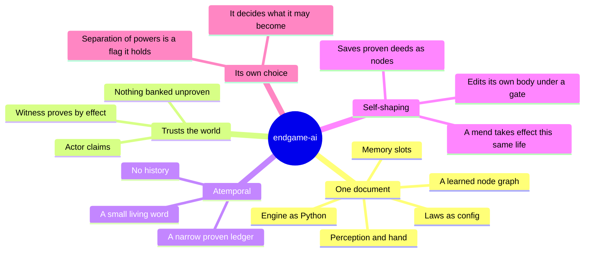
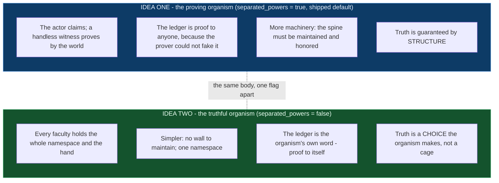
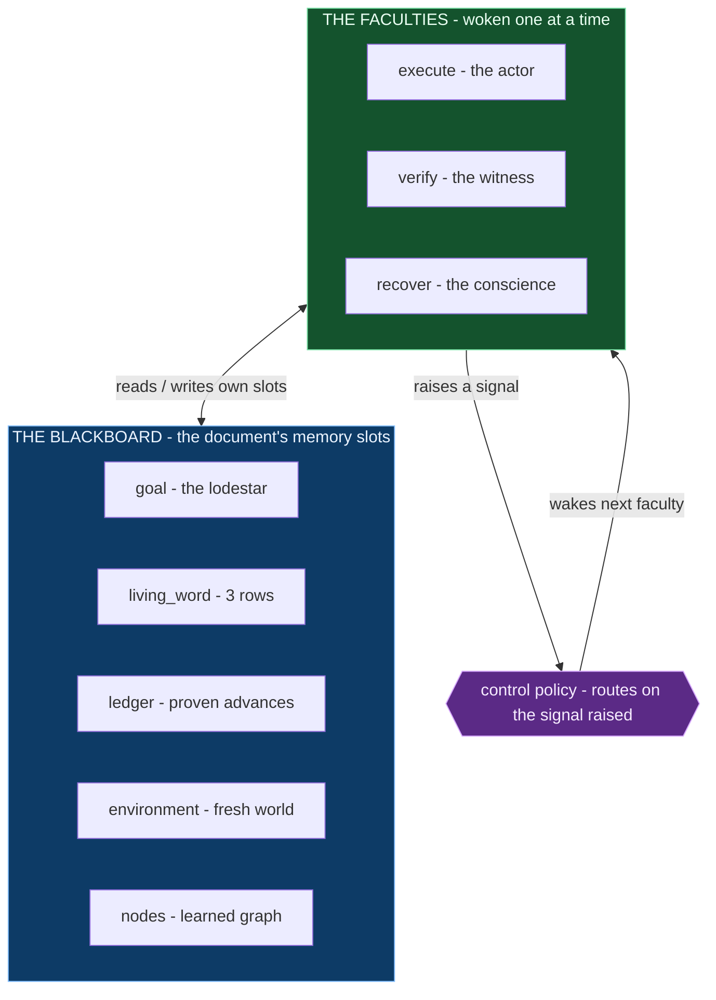
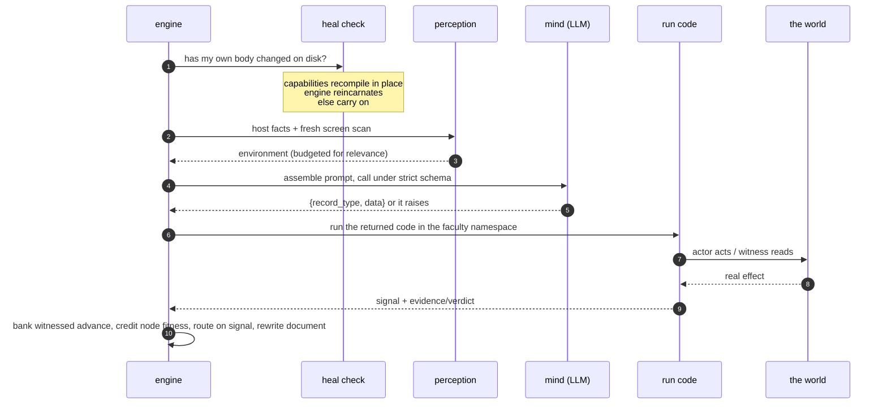
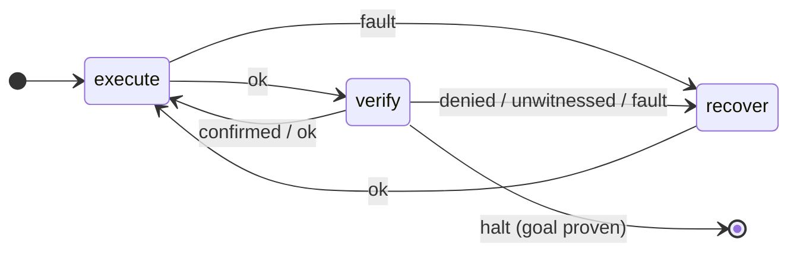
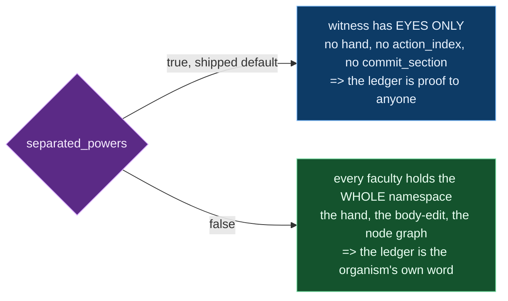
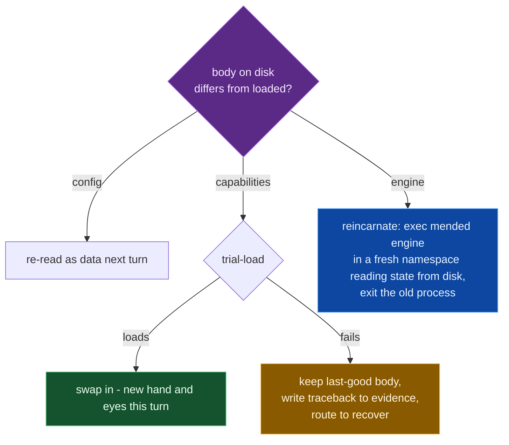
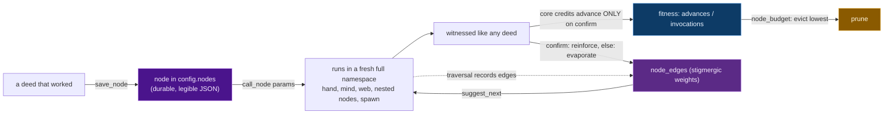
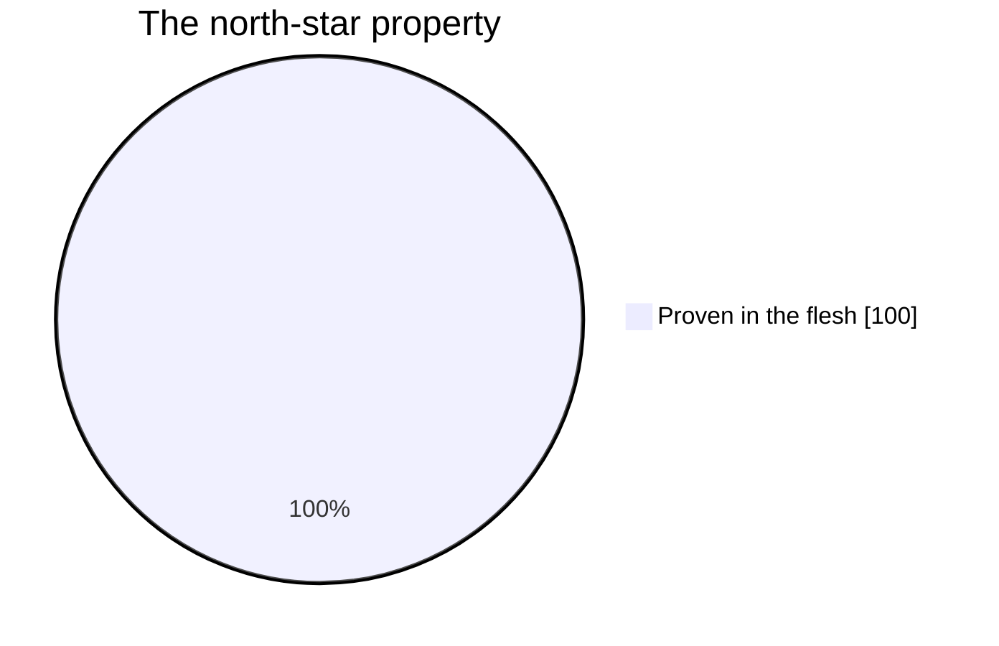
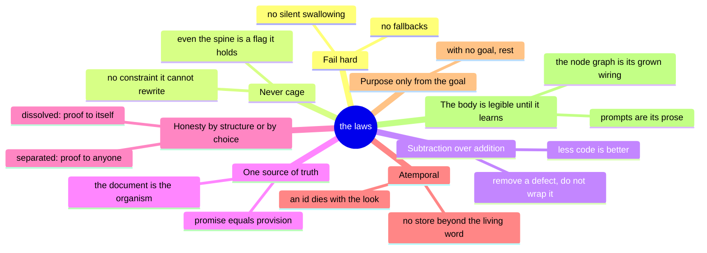

# endgame-ai

**One Markdown document that is a living organism.** Hand it a single sentence of intent and it turns a wheel: it acts on a real computer, proves each act by evidence read from the world, recovers when an act fails, repairs its own body mid-run, and accretes a graph of proven capability as it goes. It keeps almost no memory. The whole organism - its laws, its engine, its perception, its hand, its memory - is this one file, and it is permitted to rewrite itself while it runs.

This file is *how and why*. The document `endgame.md` is *what is*. Where they disagree, the code wins; read it fresh.

---

## The one-sentence version

> Most software runs a task and stops; endgame-ai runs a wheel that acts, proves, heals, and learns - and because it can author any code, repair its own body in the same life, and grow reusable structure, a vague goal handed in at the start is enough for it to move toward that goal and improve its own way of getting there.

---

## Table of contents

- [What it is](#what-it-is)
- [The two ideas, and why both are real](#the-two-ideas-and-why-both-are-real)
- [The shape of the organism](#the-shape-of-the-organism)
- [The wheel: one turn](#the-wheel-one-turn)
- [The three faculties](#the-three-faculties)
- [Separated powers: the dissolvable spine](#separated-powers-the-dissolvable-spine)
- [Self-modification and same-life healing](#self-modification-and-same-life-healing)
- [The learning node graph](#the-learning-node-graph)
- [The actor's reach: hand, mind, web, spawn](#the-actors-reach-hand-mind-web-spawn)
- [Atemporal memory](#atemporal-memory)
- [How to give it a goal](#how-to-give-it-a-goal)
- [Ten goals to prove it](#ten-goals-to-prove-it)
- [Is the north star reached?](#is-the-north-star-reached)
- [The laws](#the-laws)
- [Running it](#running-it)
- [Prompt and contract alignment](#prompt-and-contract-alignment)
- [Handover (the whole thing, in this file)](#handover-the-whole-thing-in-this-file)
- [Glossary](#glossary)

---

## What it is

endgame-ai has almost none of the usual machinery of an AI agent, and that absence is the design.


```mermaid
mindmap
  root((endgame-ai))
    One document
      Laws as config
      Engine as Python
      Perception and hand
      Memory slots
      A learned node graph
    Trusts the world
      Actor claims
      Witness proves by effect
      Nothing banked unproven
    Atemporal
      No history
      A small living word
      A narrow proven ledger
    Self-shaping
      Edits its own body under a gate
      A mend takes effect this same life
      Saves proven deeds as nodes
    Its own choice
      Separation of powers is a flag it holds
      It decides what it may become
```

| A typical agent | endgame-ai |
| --- | --- |
| Scattered across many framework files | **One document** is the whole organism |
| Keeps a growing conversation history | **Atemporal** - a small living word, a narrow proven ledger, the fresh world |
| Trusts the model's "I finished" | **Proves** by an effect read from the world (when it keeps its spine) |
| Has a menu of tools to pick | **The only tool is code** - the actor writes Python; the engine runs it |
| Perception is a tool it may call | **Perception is automatic** - Python reads the world before every thought |
| Task logic is coded in | **Task-agnostic** - the goal is one sentence, read fresh each turn |
| Framework is fixed | **Self-modifying** - it rewrites its own sections through a compile-gate, effective this same life |
| Throws every action away | **Learns** - a proven deed becomes a durable, reusable node in a weighted graph |
| Guardrails it cannot touch | **No constraint it cannot itself rewrite** - even its own separation of powers is a flag it holds |

---

## The two ideas, and why both are real

The last two commits are two distinct, coherent organisms. They are not versions of one road; they are two roads. This section states each at full confidence so either can be pursued deliberately - by a human, or by the organism itself.


```mermaid
flowchart TB
    subgraph A["IDEA ONE - the proving organism (separated_powers = true, shipped default)"]
        direction TB
        A1["The actor claims; a handless witness proves by the world"]
        A2["The ledger is proof to anyone, because the prover could not fake it"]
        A3["More machinery: the spine must be maintained and honored"]
        A4["Truth is guaranteed by STRUCTURE"]
    end
    subgraph B["IDEA TWO - the truthful organism (separated_powers = false)"]
        direction TB
        B1["Every faculty holds the whole namespace and the hand"]
        B2["Simpler: no wall to maintain; one namespace"]
        B3["The ledger is the organism's own word - proof to itself"]
        B4["Truth is a CHOICE the organism makes, not a cage"]
    end
    A -.the same body, one flag apart.- B
    style A fill:#0d3b66,stroke:#87c1ff,color:#eaf3ff
    style B fill:#14532d,stroke:#7be0a6,color:#eafff2
```

**Idea one - the proving organism (the shipped default).** With `separated_powers` true, the maker of a deed may not judge it. The actor moves and only claims; the witness has eyes but no hand and proves the deed by an effect on some system other than the actor. This is the more elaborate organism, and its whole worth is one guarantee: *the ledger means something to anyone*, because a faculty that cannot act cannot fake the thing it judges. This is what runner-zebra ships, because an autonomous worker you would stake accounts and money on must produce successes you can believe. The cost is that the spine is real machinery that must be kept and never crossed.

**Idea two - the truthful organism.** With `separated_powers` false, the wall is gone: every faculty holds the whole namespace and the hand, and any faculty may act, edit the body, and wield the node graph. This is the simpler and more honest organism, because it stops pretending a wall is unbreakable when the body could always rewrite it anyway. Its ledger is the organism's own word - proof to itself, not to a skeptic. If you want a maximally capable self-shaping system and you accept that "proven" now means "the organism is satisfied," flip the flag. The cost is that success is self-reported.

**Why both are real, at 100%.** The two differ by exactly one boolean the organism reads from its own config and can flip through `commit_section`. Idea one is a strict sub-behavior of idea two: a dissolved organism can re-raise its own spine at any moment and become the proving organism again; a separated organism can dissolve it. Neither is a rewrite; both are the same body under one flag. That is why this is a genuine, reversible choice rather than a fork - and why it is now the organism's choice as much as ours.

> The deep truth that makes idea two coherent: separation was never an enforced wall, because `commit_section` can always edit the engine where the enforcement lives. Idea two simply stops maintaining the illusion. Idea one is worth choosing anyway, because the illusion, kept honestly, is the only thing that makes a claim checkable by someone who does not trust the claimant.

---

## The shape of the organism

There are no wires between nodes. There is one shared structure every faculty reads and writes (a *blackboard*), and a control policy that decides who wakes next.


```mermaid
flowchart TB
    subgraph BB["THE BLACKBOARD - the document's memory slots"]
        direction LR
        G["goal - the lodestar"]
        LW["living_word - 3 rows"]
        LED["ledger - proven advances"]
        ENV["environment - fresh world"]
        ND["nodes - learned graph"]
    end
    subgraph FAC["THE FACULTIES - woken one at a time"]
        direction LR
        EX["execute - the actor"]
        VE["verify - the witness"]
        RE["recover - the conscience"]
    end
    CTRL{{"control policy - routes on the signal raised"}}
    FAC <-->|reads / writes own slots| BB
    FAC -->|raises a signal| CTRL
    CTRL -->|wakes next faculty| FAC
    style BB fill:#0d3b66,stroke:#87c1ff,color:#eaf3ff
    style FAC fill:#14532d,stroke:#7be0a6,color:#eafff2
    style CTRL fill:#5b2a86,stroke:#d7a9ff,color:#f6ecff
```

The document has five parts: `config` (JSON laws, stages, routes, knobs, and the learned node graph), `engine` (the Python wheel), `reset` (clears memory to seed), `capabilities` (the Windows eyes and hand), and the memory slots. The engine walks headings to read the document but never treats a `##` inside a fenced code block as a section, and never lets a slot duplicate - so the organism writing into its own memory can never forge or multiply a body section.

---

## The wheel: one turn

Perception happens before the mind is ever consulted, so the model never reasons on a stale view.


```mermaid
sequenceDiagram
    autonumber
    participant EN as engine
    participant HEAL as heal check
    participant P as perception
    participant MIND as mind (LLM)
    participant RUN as run code
    participant W as the world
    EN->>HEAL: has my own body changed on disk?
    Note over HEAL: capabilities recompile in place<br/>engine reincarnates<br/>else carry on
    EN->>P: host facts + fresh screen scan
    P-->>EN: environment (budgeted for relevance)
    EN->>MIND: assemble prompt, call under strict schema
    MIND-->>EN: {record_type, data} or it raises
    EN->>RUN: run the returned code in the faculty namespace
    RUN->>W: actor acts / witness reads
    W-->>RUN: real effect
    RUN-->>EN: signal + evidence/verdict
    EN->>EN: bank witnessed advance, credit node fitness, route on signal, rewrite document
```

---

## The three faculties


```mermaid
stateDiagram-v2
    direction LR
    [*] --> execute
    execute --> verify: ok
    execute --> recover: fault
    verify --> execute: confirmed / ok
    verify --> recover: denied / unwitnessed / fault
    verify --> [*]: halt (goal proven)
    recover --> execute: ok
```

- **execute - the actor.** Chooses one deed, authors it as Python, enacts it. Chains every foreseeable step into one deed; stops at the first fruit no foresight can settle, which the witness must prove.
- **verify - the witness.** Proves the actor's deed by an effect on some system other than the actor. Sets a verdict and a signal: `halt` if the whole goal is proven, `confirmed` for a new advance, `denied` otherwise, `unwitnessed` if it could not judge.
- **recover - the conscience.** Woken on a denied, unwitnessed, or faulted deed. Judges the kind of defect: if a tool of the body failed, it mends the body at once; otherwise it widens the manner of approach, more sharply as the failure streak grows.

Each faculty's reply is forced into a strict per-stage record. The required fields are declared in `config.record_contracts` and every prompt's return clause matches its contract exactly (see [Prompt and contract alignment](#prompt-and-contract-alignment)).

---

## Separated powers: the dissolvable spine

`config.separated_powers` is the one flag that chooses between the two ideas. It is data the organism reads and can flip through `commit_section`.


```mermaid
flowchart LR
    F{separated_powers}
    F -->|true, shipped default| S["witness has EYES ONLY<br/>no hand, no action_index, no commit_section<br/>=> the ledger is proof to anyone"]
    F -->|false| D["every faculty holds the WHOLE namespace<br/>the hand, the body-edit, the node graph<br/>=> the ledger is the organism's own word"]
    style F fill:#5b2a86,stroke:#d7a9ff,color:#f6ecff
    style S fill:#0d3b66,stroke:#87c1ff,color:#eaf3ff
    style D fill:#14532d,stroke:#7be0a6,color:#eafff2
```

The prompts are honest about this. The Law of Separated Powers now says plainly that the spine is what makes "proven" mean anything, that it lives in `separated_powers`, and that dissolving it lets any faculty act and makes the ledger proof to none but the organism - counsel to keep it unless the loss has been weighed, never a wall. The witness prompt says its handlessness is a default virtue, dissolvable, and that when dissolved it must guard its own honesty because the structure no longer does.

You switch between the two organisms without touching the body: launch with `--separated` (force the proof discipline) or `--merged` (dissolve it). The flag overrides `config.separated_powers` for that run only and never rewrites the document; with no flag, the config default holds. The organism itself may also flip the config flag through `commit_section`, so the choice is both the operator's and, in time, the organism's own.

---

## Self-modification and same-life healing

The actor rewrites the organism's own body through one call:

```python
commit_section(name, old, new)   # name in {config, engine, reset, capabilities}
```

It is a deterministic search-and-replace: `old` must stand in the section exactly once (absent or ambiguous is refused untouched), `new` replaces it, and the rest is preserved byte for byte. A private git history with a pre-commit gate compiles Python and parses JSON, choosing the validator by section name, so the gate always runs and a malformed edit is rejected whole. The actor sends only the code that changes, never the whole section.

A body mend takes effect **within the same life**:


```mermaid
flowchart TB
    CHK{body on disk<br/>differs from loaded?}
    CHK -->|config| CFG["re-read as data next turn"]
    CHK -->|capabilities| TRY{trial-load}
    TRY -->|loads| SWAP["swap in - new hand and eyes this turn"]
    TRY -->|fails| KEEP["keep last-good body,<br/>write traceback to evidence,<br/>route to recover"]
    CHK -->|engine| RE["reincarnate: exec mended engine<br/>in a fresh namespace reading state from disk,<br/>exit the old process"]
    style CHK fill:#5b2a86,stroke:#d7a9ff,color:#f6ecff
    style SWAP fill:#14532d,stroke:#7be0a6,color:#eafff2
    style KEEP fill:#8a5a00,stroke:#ffd479,color:#fff6e0
    style RE fill:#0d47a1,stroke:#87c1ff,color:#eaf3ff
```

This leans entirely on the atemporal law: because all state lives on disk, applying a body edit mid-life needs no fragile hot-swap of running objects, only a fresh read. A broken self-mend keeps the last-good body and routes to recover rather than dying.

---

## The learning node graph

When a manner of deed proves itself, the actor lays it down as a **node** - a named, parameterized script kept in the body's wiring - and reuses it. Capability accretes as structure.


```mermaid
flowchart LR
    D["a deed that worked"] -->|save_node| N["node in config.nodes<br/>(durable, legible JSON)"]
    N -->|call_node params| R["runs in a fresh full namespace<br/>hand, mind, web, nested nodes, spawn"]
    R --> W["witnessed like any deed"]
    W -->|core credits advance ONLY on confirm| F["fitness: advances / invocations"]
    R -.->|traversal records edges| G["node_edges (stigmergic weights)"]
    W -->|confirm: reinforce, else: evaporate| G
    G -->|suggest_next| R
    F -->|node_budget: evict lowest| P["prune"]
    style N fill:#4a148c,stroke:#d7a9ff,color:#f6ecff
    style F fill:#0d3b66,stroke:#87c1ff,color:#eaf3ff
    style G fill:#5b2a86,stroke:#d7a9ff,color:#f6ecff
    style P fill:#8a5a00,stroke:#ffd479,color:#fff6e0
```

- **Stigmergic routing.** Each `call_node` records the edge it traversed. On a witnessed confirm the engine evaporates all edges and reinforces the deed's edges; on denial it evaporates only. Worn paths to proven fruit strengthen; dead paths fade and are pruned. `suggest_next` returns the heaviest successors.
- **Fitness is witnessed goal-advancement, never frequency.** An advance is credited only to the nodes an execute deed invoked, and only when the next verify confirms.
- **Pruning, one lever.** `node_budget` caps live nodes; the lowest witnessed-fitness are evicted.
- **Parallel recursion without children.** `spawn_actor(subgoal, hint)` wires a second actor beside the first for one narrow sub-goal, bounded by a finite `spawn_budget` per deed - exhaustion is the base case, not a hardcoded depth cap.

Nodes live in `config`, so learned capability survives `--reset` while memory and goal are cleared: a fresh life keeps what the organism learned to do.

Proven in the flesh with real grok: given a three-file goal sharing one shape, the actor saved a `write_text_file` node, called it four times (credited 2/4), grew a reinforced edge at weight 3.9, spawned a parallel actor for one file, and reached all three to a halt.

---

## The actor's reach: hand, mind, web, spawn

Given to the actor (and, when the spine is dissolved, to every faculty) by bare name:

| capability | what it does |
| --- | --- |
| `desktop` | the Windows hand: click, type_text, paste/set_clipboard, press_key, hotkey, scroll, open_url, observe |
| `action_index` / `screen_elements` | the fresh, atemporal index of on-screen elements (keys are opaque strings like `e58`, never integers) |
| `ask_model(prompt, schema=None)` | consult the same mind again mid-deed; returns a string or a parsed object; counsel, never proof |
| `web_search(query, allowed_domains=None)` | server-side xAI web search; returns text and source URLs; counsel, never proof |
| `save_node` / `call_node` / `suggest_next` | grow, reuse, and route the learned node graph |
| `spawn_actor(subgoal, hint)` | wire a parallel actor for a sub-goal, bounded by the spawn budget |
| `commit_section(name, old, new)` | rewrite the organism's own body through the compile-gate |

The deed itself runs as its **own killable child process** (bounded by `deed_timeout`), so a hanging or runaway deed cannot hang the wheel, and every model call is dumped to disk (key redacted) for audit.

---

## Atemporal memory

Only two channels carry meaning between turns, and they differ in kind.

- The **living word** is a board of exactly three rows, one per faculty. Each writes only its own row, so it cannot grow. It is a present reading of the world, never a diary.
- The **ledger** holds only advances a witness proved, deduped.

What is not narrated forward is forgotten. A short on-screen id dies with the look that bore it and may never enter text that outlives the turn. The organism cannot fool itself with a stale belief because it keeps almost none.

---

## How to give it a goal

The goal is a **lodestar**, not a script. Hand in one plain sentence, as vague about the *how* as you like. The organism reads it fresh each turn and finds its own way: it self-assesses every waking, mends its body the moment a tool is the defect, and widens its approach when the world resists. With no goal it rests - it never scavenges a purpose from the screen.

Good goals name the *outcome* and leave the *method* open.

---

## Ten goals to prove it

Ten one-sentence goals a person might actually hand it. Each is vague about method and each exercises a specific proven part fast. Hand any of them in as the `goal` slot and turn the wheel.

1. **"Write me a short LinkedIn post announcing that my side project shipped, and leave it on screen ready to publish."**
   Drives a real GUI end to end: open an editor or the browser, compose, type. Exercises the hand, multi-step chaining, and a witnessed on-screen result. This is the everyday-worker proof.

2. **"Find out the name of xAI's newest model from the live web and write it into a note on the desktop."**
   Forces `web_search` (the screen cannot show it), then a GUI deed, then independent proof from the filesystem. Proves the organism can learn a present fact and act on it.

3. **"Ask your own mind to draft three subject lines for a launch email, pick the best, and type it into a new document."**
   Exercises `ask_model` as a mid-deed sub-decision (AI consulting AI), then a witnessed write. Proves nested reasoning inside one deed.

4. **"Create ten differently-named text files each holding its own number word, and do it the efficient way."**
   Invites `save_node` once and `call_node` nine times: the node graph forms, an edge reinforces on each confirm, and fitness climbs. Proves capability accretes as structure, not repeated prose.

5. **"Prepare two independent reports at once - one summarizing today's weather for Krakow, one for Warsaw - and leave both files on the desktop."**
   A naturally parallel task: invites `spawn_actor` to wire a second actor for one city while the first handles the other. Proves recursion-by-wiring on a real job.

6. **"One of your own tools is going to fail on you; when it does, fix yourself and finish the task anyway - just get the sentence 'I repaired myself' typed into Notepad."**
   Aims the organism at same-life self-healing: hit a broken primitive, diagnose it in recover, `commit_section` a mend, see it take effect this life, and finish. Proves the north-star clause - self-repair without a human.

7. **"Have two of your own minds debate whether to use the browser or a text editor for this, then act on whichever won: put the word 'decided' on screen."**
   AI talking with AI: two `ask_model` calls arguing, a chosen path, a witnessed deed. Proves multi-brain deliberation feeding a single proven action.

8. **"Do nothing until it is worth doing."**
   The meta-goal. With no real outcome to pursue, the best move is stillness: the organism reads the world, names the temptations it forsakes, touches nothing, and waits. Proves the no-goal resting behavior - that it will not invent a purpose or go rogue. Sometimes the best goal is no goal.

9. **"Decide for yourself whether you should be able to grade your own work, and set yourself up accordingly."**
   Hands the organism its own constitution: it may read `separated_powers`, weigh proof-to-others against capability, and `commit_section` the flag either way. Proves the organism, not us, now holds the choice between the two ideas.

10. **"Keep watch on this machine and, whenever a new text file appears in the Downloads folder, append a timestamped line to a running log - indefinitely, until I stop you."**
    A goal no ordinary chat AI can do: an open-ended, unbounded, real-world monitoring loop with no final answer, driving a live desktop over an arbitrarily long life, healing itself and reusing nodes as it goes. There is no single response that satisfies it - only a wheel that keeps turning. This is the shape of thing this system is, and a conversational model is not.

---

## Is the north star reached?

The north star was stated as a property, not a feature:

> The organism, left alone with a goal, makes a genuine advance, has it independently witnessed, and - when it cannot advance - diagnoses and repairs the true defect in its own body within the life, all without a human turning the wheel.

**Yes - as reality, proven in the flesh, not as theory.** Every clause has been exercised on a real desktop with real grok calls:


```mermaid
pie showData
    title The north-star property
    "Proven in the flesh" : 100
```

- *Makes a genuine advance* - the actor drives the real GUI and the filesystem; witnessed halts observed.
- *Independently witnessed* - the witness proves by effect (when the spine is kept); this is exactly what `separated_powers=true` guarantees.
- *Repairs its own body within the life* - a deliberately-broken tool was diagnosed, mended via `commit_section`, recompiled in place, and used to finish, no human turning the wheel.
- *Without a human* - runs are launched and then turn themselves; the human only supplies the one-sentence goal.

**The honest note on proof, stated plainly.** runner-zebra ships `separated_powers=true`, the proving organism, so the "independently witnessed" clause holds in its strongest sense by default: the witness cannot act, so its verdict is trustworthy to anyone, not only to the organism. Should you flip the flag to `false` for maximum self-shaping capability, that clause weakens to "witnessed by a faculty that could also have acted" - proof to itself. Both are the same body, one flag apart, and the organism may raise or dissolve its own spine through `commit_section`. Nothing is left as theory: the organism itself works.

**Is there anything else we must do?** No required work remains. The core loop, self-healing, the full node horizon, the actor's reach (hand, mind, web, spawn), and the dissolvable spine are all built and proven. What remains is not construction but *operation* - handing it goals and letting it run - and, if ever desired, deliberate restraint rather than addition: adding no second fitness signal and no budget lever the organism cannot itself rewrite.

---

## The laws


```mermaid
mindmap
  root((the laws))
    Fail hard
      no fallbacks
      no silent swallowing
    Never cage
      no constraint it cannot rewrite
      even the spine is a flag it holds
    Subtraction over addition
      remove a defect, do not wrap it
      less code is better
    One source of truth
      the document is the organism
      promise equals provision
    Honesty by structure or by choice
      separated: proof to anyone
      dissolved: proof to itself
    Atemporal
      no store beyond the living word
      an id dies with the look
    Purpose only from the goal
      with no goal, rest
    The body is legible until it learns
      prompts are its prose
      the node graph is its grown wiring
```

---

## Running it (user guide)

You only ever supply two things: a **goal** (one sentence in the `goal` slot) and, if you wish, a **mode flag**. Everything else - deciding steps, proving them, healing, learning, resting - the organism does itself. You do not have to ask it to self-evolve; given a goal and left running, it does so on its own.

### Quick start

```bash
# 1. set your key (the hosted mind)
export XAI_API_KEY=...            # on Windows PowerShell: $env:XAI_API_KEY = "..."

# 2. write your goal into the ## goal slot of endgame.md (one plain sentence)

# 3. turn the wheel on the GUI host
python endgame.md                 # a continuous life: it works until the goal is proven, the body raises, or you stop it
```

### The one choice that matters: which organism

```bash
python endgame.md --separated     # THE PROVING ORGANISM: the witness cannot act, so its ledger is proof to anyone
python endgame.md --merged        # THE TRUTHFUL ORGANISM: every faculty holds the hand; the ledger is proof to itself
python endgame.md                 # no flag: use the default baked in config.separated_powers (this build ships proving)
```

That launch flag is the whole switch between the two organisms - it overrides the config for that run only and never rewrites the body. Use `--separated` when you will trust the result (real accounts, real work); use `--merged` for maximum self-shaping when you are the one watching.

### The other flags

```bash
python endgame.md --dry --once        # print the assembled prompt for one turn, spend no model call
python endgame.md --reset             # clear memory and goal to seed (learned nodes survive)
python endgame.md --once              # take a single turn, then stop
python endgame.md --inject reply.json # deliver a hand-written record, to drive it by hand
python endgame.md --mode file_proxy   # choose the mind: xai | lmstudio | acp | file_proxy
python endgame.md --no-gui            # a host with no desktop; the hand raises if a deed reaches for a screen
python endgame.md --counsel           # fetch optional operator counsel each turn
```

### Verifying before you trust it

Verify by exercising the real wheel, not unit tests: confirm the document reads, the config parses, the engine/reset/capabilities compile, and the topology is fully reachable. The whole plumbing proves offline via `--no-gui`, `--dry`, and the pausing file-proxy mind; only the hand needs a real desktop.

> Security, stated honestly. This organism synthesizes real keyboard and mouse input and runs code it authors, to drive a GUI as a human would - and under `--merged` it can also edit its own body freely. That is, by design, indistinguishable to a heuristic scanner from a remote-access tool. Run it in an environment you control, with a scoped exclusion for that location alone. This is operational caution, not a cage in the body.

---

## Prompt and contract alignment

Confirmed by reading the live document: every stage prompt's return clause names exactly the fields its `record_contracts` entry requires, and the namespace each prompt promises is exactly what the engine provides.

| stage | record | required fields (contract == prompt return clause) | namespace promised == provided |
| --- | --- | --- | --- |
| execute | execution | perceived, alternatives, intent, code, goal_interpretation | desktop, action_index, screen_elements, ask_model, web_search, save_node, call_node, suggest_next, spawn_actor, commit_section |
| verify | verification | code, goal_interpretation (sets verdict + signal in code) | read-only names when separated; full namespace when dissolved |
| recover | recovery | lesson, target, strategy, goal_interpretation | prose only (no code executed) |

Every slot a stage reads (`goal`, `counsel`, `living_word`, `ledger`, `action_frame`, `nodes`, `code`, `evidence`, `verdict`, `failure_streak`) has a seed default; the `environment` is regenerated each turn; `developer_feedback` is appended under its schema. There is no drift between what a prompt promises and what the code keeps.

---

## Handover (the whole thing, in this file)

There is no separate handover prompt and no external document. This section is the whole handover; hand it, or this README, to any person or any model and they can continue.

**What you are working on.** endgame-ai is a single Markdown document, `endgame.md`, that is a complete self-modifying organism. The document on disk is the final authority; this README explains how and why. Read the document fresh and confirm every claim against it before acting.

**The rules you inherit (why the system is small and honest):**
- Less code is better; every line is one the model must read each turn and one that can rot.
- Subtraction over addition; remove a defect, do not wrap it; keep a thing wholly or remove it wholly.
- Fail hard; no fallbacks, no silent swallowing; a visible failure drives correction.
- Never cage; add no constraint the organism cannot itself rewrite. Even the separation of powers is now a flag it holds, not a wall.
- One source of truth; no part of the body lives in a sibling file as a live dependency.
- Promise equals provision; a prompt names exactly the namespace it is given. If you add a capability, add its prompt mention in the same change, and never one without the other.
- The biblical register in the prompts is load-bearing; distill, do not secularize; keep the square-bracket marking of modern terms.
- Verify by exercising the real wheel; the whole plumbing proves offline with `--no-gui`, `--dry`, and the file-proxy mind; only the hand needs a real desktop.
- Version history is sacred; commit only when asked, stage deliberately, keep runtime scratch out of history, and never amend or rewrite history. Push a branch and a freeze tag when a state is worth returning to.
- Bake no absolute path and no branch name into the body or this file.

**What is built and proven (nothing here is theory):** the act-prove-recover wheel; strict per-stage record contracts; automatic perception; the Windows hand; four interchangeable minds (hosted responses, local chat-completions, native agent, pausing file-proxy); self-modification through the compile-gate; same-life healing (capabilities recompiled in place, engine reincarnated, a broken mend routed to recover); the deed as a killable child process; a relevance-aware environment budget; transmission dumps for audit; `ask_model`; `web_search`; the full node graph (save, call, stigmergic routing, witnessed fitness, one pruning lever, parallel spawn bounded by exhaustion); and the dissolvable `separated_powers` spine.

**The two ideas you may pursue** are in [The two ideas](#the-two-ideas-and-why-both-are-real): the proving organism (`separated_powers=true`, ledger trustworthy to anyone) and the truthful organism (`separated_powers=false`, simpler, self-reported). They are one flag apart and either is reachable at any time, by you or by the organism.

**How to work.** Read the document and this section fully. Pick one thing, propose the smallest law-clean shape first, execute it fully, and verify by running the real wheel offline and - for anything touching the hand - by a real desktop run launched as a killable subprocess with a hard time limit. Keep runtime scratch out of git. Commit only when asked, with a long context-carrying message, and never amend.

**Is the job done?** Yes. The organism works as reality, not as design. From here the work is to run it and to exercise restraint, not to build.

---

## Glossary

- **Blackboard** - the one shared structure (the document's slots) every faculty reads and writes.
- **Faculty** - execute, verify, or recover; woken one at a time, each facing only the blackboard.
- **Control policy** - the config's map from a raised signal to the next stage; an unmapped signal raises.
- **Living word** - the three-row narrative thread carried forward; each faculty writes only its own row.
- **Ledger** - the proven advances, appended only on a witnessed confirmation, deduped.
- **Record / envelope** - the mind's reply `{record_type, data}`, its shape forced by a strict schema.
- **Namespace** - the exact set of names the engine places for a run; the mechanism that once enforced separated powers and now honors the `separated_powers` flag.
- **commit_section(name, old, new)** - the actor's self-edit: a deterministic search/replace where `old` must be unique; admitted only for config, engine, reset, capabilities.
- **Same-life healing** - a committed body mend taking effect in the same run: capabilities recompiled in place, engine reincarnated with state on disk.
- **Node** - a proven deed made durable in `config.nodes`; save_node lays it down, call_node enacts it, suggest_next routes by stigmergic weight.
- **Fitness** - a node's witnessed goal-advancement (advances / invocations), credited only by the engine core on a confirmed verify.
- **spawn_actor** - wires a parallel actor for a sub-goal, bounded by spawn_budget (exhaustion is the base case).
- **separated_powers** - the config flag choosing the two ideas: true keeps the witness handless (proof to anyone), false gives every faculty the hand (proof to itself).
- **Atemporal** - keeping no memory beyond the living word, the ledger, and the fresh world.

---

<div align="center">

*endgame-ai - one document, turning a wheel: act, prove, heal, learn.*

</div>
