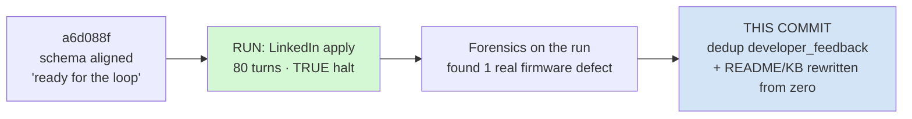
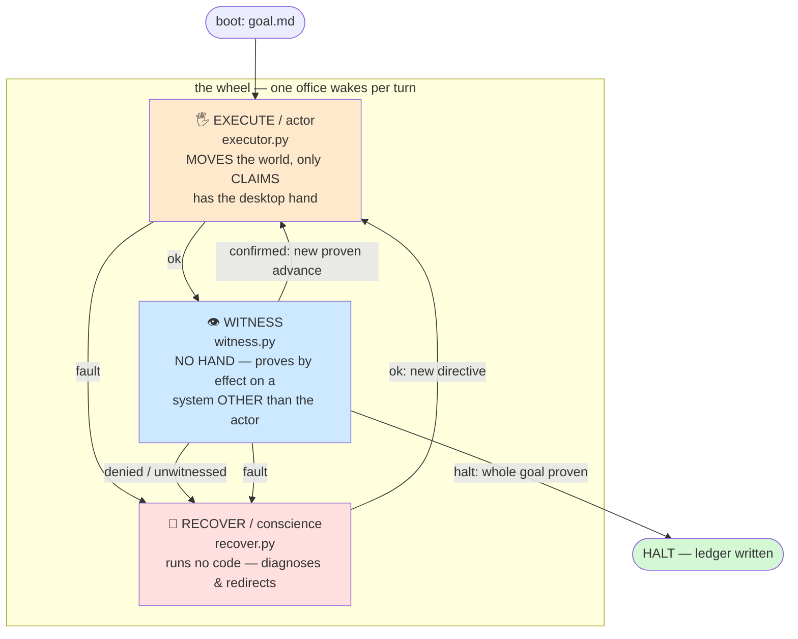
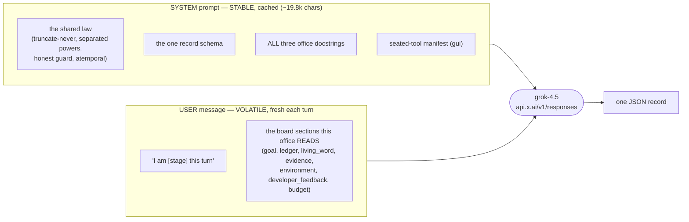
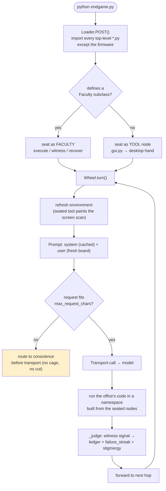
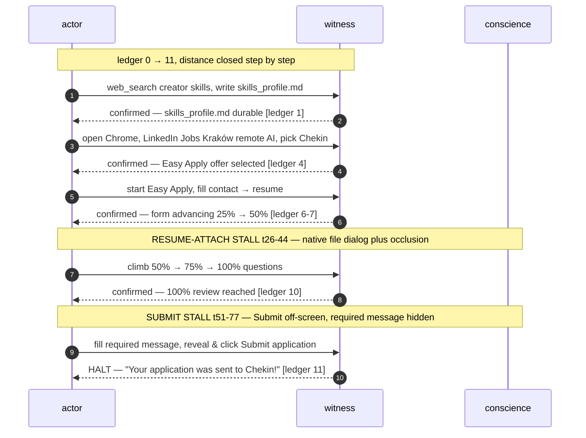
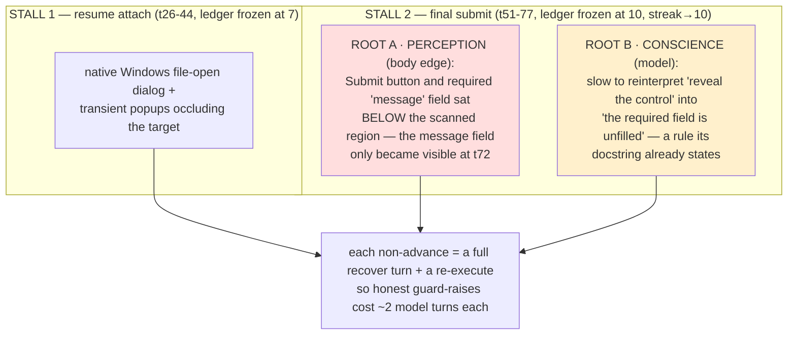
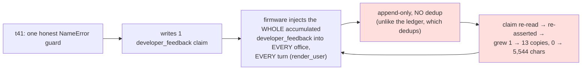
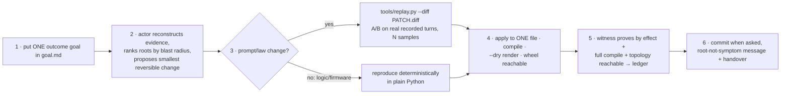

# endgame-ai — a self-modifying desktop organism, and the record of what it just proved

**Read this first. This file is written to you — the next endgame-ai, or the next AI asked to
carry this project.** endgame-ai is a self-modifying LLM organism that does real work on a real
Windows desktop and proves it by *effect on the world*, not by claiming. It has no planner and no
task list; it is given one OUTCOME and turns a three-office wheel until an independent witness
proves that outcome true.

This README is rebuilt from zero after a real run: a **live LinkedIn job application, driven end to
end, that halted TRUE** — and after one firmware fix that the *same run* taught us to make. Every
number and claim below traces to an artifact on disk (a transmission record, the source, or a
command that was run). Where something is not proven, it says so.

> ⚠️ You take **full control of the real desktop** — mouse, keyboard, browser, files — acting as the
> human whose machine this is, toward the goal in `goal.md`. Given no goal, you halt. You never
> invent work.

---

## 0. Where we are right now (this commit vs. the last)

The last commit (`a6d088f`) closed the record-schema contradiction (A4) and declared the organism
ready for a self-improvement loop. **Then it was pointed at a real-world goal** — not a self-edit —
to see how the healed body behaves in the wild:

> *"use linkedin to apply for a remote job in cracow related to AI based on the wgabrys88 github
> `endgame-ai` project — which is you — and apply on behalf of the account owner, using Chrome to
> navigate and research."* (the verbatim `goal.md`)

**It worked.** The organism researched its own creator's skills, searched LinkedIn, chose the most
compatible offer, filled a multi-step Easy Apply form, and the witness independently read *"Your
application was sent to Chekin!"* off the live page. That is a real job application, really
submitted, proven by the destination's own artifact.

But the run was **slow and, in one place, self-deceiving in its diagnosis** — and tracing *why*
uncovered a real firmware defect. **This commit fixes exactly that one defect** (see §5). It is a
subtraction-flavored, one-line change to the firmware, verified deterministically and by the real
wheel.


```mermaid
flowchart LR
    A["a6d088f<br/>schema aligned<br/>'ready for the loop'"] --> B["RUN: LinkedIn apply<br/>80 turns · TRUE halt"]
    B --> C["Forensics on the run<br/>found 1 real firmware defect"]
    C --> D["THIS COMMIT<br/>dedup developer_feedback<br/>+ README/KB rewritten from zero"]
    style B fill:#d4f7d4
    style D fill:#d4e4f7
```

---

## 1. What the system IS (judge it by this)

A fixed **firmware** (`endgame.py`, a BIOS) boots a folder of hot-swappable `*.py` **nodes** and
turns a wheel. **Presence is the switch**: a file seated = a faculty or tool present. The firmware
holds *no domain knowledge* — it routes signals and never judges the task. All judgment lives in the
nodes' docstrings (the prompt) and their callables (the namespace).

Three offices, routed by one returned signal — this **actor / witness separation is the spine, and
it is inviolate**:


```mermaid
flowchart TD
    START([boot: goal.md]) --> EXEC

    subgraph WHEEL["the wheel — one office wakes per turn"]
        EXEC["🖐️ EXECUTE / actor<br/>executor.py<br/>MOVES the world, only CLAIMS<br/>has the desktop hand"]
        WIT["👁️ WITNESS<br/>witness.py<br/>NO HAND — proves by effect on a<br/>system OTHER than the actor"]
        REC["🧭 RECOVER / conscience<br/>recover.py<br/>runs no code — diagnoses & redirects"]
    end

    EXEC -->|ok| WIT
    EXEC -->|fault| REC
    WIT -->|confirmed: new proven advance| EXEC
    WIT -->|halt: whole goal proven| DONE([HALT — ledger written])
    WIT -->|denied / unwitnessed| REC
    WIT -->|fault| REC
    REC -->|ok: new directive| EXEC

    style EXEC fill:#ffe9cc
    style WIT fill:#cce9ff
    style REC fill:#ffe0e0
    style DONE fill:#d4f7d4
```

- **ACTOR** (`executor.py`) moves and only *claims*. Big fruit → written whole to a file, only the
  proof line printed (bounded testimony).
- **WITNESS** (`witness.py`) has **no hand**. It proves the actor's claim by an effect on some system
  *other than the actor* — a file by reading it, a message by the record at its destination, a screen
  by a fresh scan. Its verdict alone advances the **ledger**. The firmware *trusts the witness's
  signal completely*, which is why the witness's definition of proof is the whole system's honesty.
- **CONSCIENCE** (`recover.py`) runs no code; on a fault, denial, or unwitnessed proof it diagnoses
  and changes the *kind* of remedy.

**Progress is the witness-proven ledger, never a self-authored checklist. There is NO planner and
none may be added.**

### The one record, and the split prompt

Every office returns the **same five-field JSON record**:
`goal_interpretation`, `alternatives`, `intent`, `code`, `developer_feedback`. Each office fills only
the fields its role uses (the witness leaves `intent` empty; the conscience leaves `code` empty), and
the strict schema enforces `minLength:1` *only* on the fields that office must fill.

The prompt is split so the big half is cacheable:


```mermaid
flowchart LR
    subgraph SYS["SYSTEM prompt — STABLE, cached (~19.8k chars)"]
        L["the shared law<br/>(truncate-never, separated powers,<br/>honest guard, atemporal)"]
        SC["the one record schema"]
        R["ALL three office docstrings"]
        T["seated-tool manifest (gui)"]
    end
    subgraph USR["USER message — VOLATILE, fresh each turn"]
        WHO["'I am [stage] this turn'"]
        BOARD["the board sections this office READS<br/>(goal, ledger, living_word, evidence,<br/>environment, developer_feedback, budget)"]
    end
    SYS --> MODEL(["grok-4.5<br/>api.x.ai/v1/responses"])
    USR --> MODEL
    MODEL --> REC2["one JSON record"]
```

---

## 2. How the firmware boots and turns (the BIOS doctrine)

`endgame.py` is a motherboard BIOS: it POSTs (discovers seated nodes), wires the buses, hands control
to the parts, and routes signals — and carries no prompt, no desktop, no goal. **The organism evolves
by editing the nodes, never the firmware.** A bad self-edit can brick a node; it can never brick the
boot.


```mermaid
flowchart TD
    BOOT([python endgame.py]) --> LOAD["Loader.POST()<br/>import every top-level *.py<br/>except the firmware"]
    LOAD --> CLASSIFY{"defines a<br/>Faculty subclass?"}
    CLASSIFY -->|yes| FAC["seat as FACULTY<br/>execute / witness / recover"]
    CLASSIFY -->|no| TOOL["seat as TOOL node<br/>gui.py → desktop hand"]
    FAC --> WHEEL2["Wheel.turn()"]
    TOOL --> WHEEL2
    WHEEL2 --> REFRESH["refresh environment<br/>(seated tool paints the screen scan)"]
    REFRESH --> RENDER["Prompt: system (cached) + user (fresh board)"]
    RENDER --> BUDGET{"request fits<br/>max_request_chars?"}
    BUDGET -->|no| SWITCH["route to conscience<br/>before transport (no cage, no cut)"]
    BUDGET -->|yes| CALL["Transport.call → model"]
    CALL --> EXECODE["run the office's code in a namespace<br/>built from the seated nodes"]
    EXECODE --> JUDGE["_judge: witness signal →<br/>ledger + failure_streak + stigmergy"]
    JUDGE --> HOP["forward to next hop"]
    HOP --> WHEEL2
    style SWITCH fill:#fff0cc
```

Key safety properties, all in the firmware and all confirmed on disk:

- **Two budgets that cannot collide**: `max_area_chars=32768` (most one deed may write to one board
  area) < `max_request_chars=131072` (most one request may carry). An over-full request switches to
  the conscience *before* transport rather than being cut or wedging a routeless office.
- **Fail hard**: every fault rises unswallowed. A primitive that *raises* to refuse bad input is an
  **honest guard** — its cause is upstream (re-observe), not the guard itself. Only a primitive that
  *silently does nothing* though correctly called is a body defect.
- **Nodes are reusable deeds on disk**: a proven deed (`advances>0`) is immortal; unproven throwaway
  deeds are reaped after a TTL. Stigmergy reinforces the edges a proven deed walked.

---

## 3. The proven SUCCESS — a real LinkedIn application, halted TRUE

**Run `.transmissions/2026-07-29-22-50-00/`, 80 turns, ~68.8 min, ~889,580 tokens
(691,080 in / 198,500 out), final ledger 11 entries.**

The witness's final proof (turn 79), read independently off the live page — not from the actor's
claim:

> `chekin_sent_exact = 'Your application was sent to Chekin!' in screen_blob` → **True**
> `signal = 'halt'` — *"Chekin Easy Apply sent: screen 'Your application was sent to Chekin!' … root
> apply distance closed."*

The role: **Software Engineer — AI-Native Engineering @ Chekin** (remote, Kraków, LinkedIn Easy
Apply) — chosen by the organism as the best match to the creator's skills it had just extracted.


```mermaid
sequenceDiagram
    autonumber
    participant A as actor
    participant W as witness
    participant C as conscience
    Note over A,W: ledger 0 → 11, distance closed step by step
    A->>W: web_search creator skills, write skills_profile.md
    W-->>A: confirmed — skills_profile.md durable [ledger 1]
    A->>W: open Chrome, LinkedIn Jobs Kraków remote AI, pick Chekin
    W-->>A: confirmed — Easy Apply offer selected [ledger 4]
    A->>W: start Easy Apply, fill contact → resume
    W-->>A: confirmed — form advancing 25% → 50% [ledger 6-7]
    Note over A,C: RESUME-ATTACH STALL t26-44 — native file dialog plus occlusion
    A->>W: climb 50% → 75% → 100% questions
    W-->>A: confirmed — 100% review reached [ledger 10]
    Note over A,C: SUBMIT STALL t51-77 — Submit off-screen, required message hidden
    A->>W: fill required message, reveal & click Submit application
    W-->>A: HALT — "Your application was sent to Chekin!" [ledger 11]
```

**What worked, and is worth protecting:**
- The witness never once accepted a claim as proof. Every advance was read from an other-system
  (the file on disk, the live page). The spine held for all 80 turns.
- Bounded testimony held: large bodies (repo inventory, drafts) were written to files; only proof
  lines were printed. No overflow, no wedged office.
- The organism *adapted unprompted* to real-world friction: a required application message it was
  never told about, a title-required gate, multi-step form pagination.

**How the perception that made this possible is tuned.** Every turn, the firmware runs one fresh
desktop scan for the waking office (no LLM action needed) governed by five knobs in
`CONFIG["observation"]`: `step_px` (probe-grid spacing), `max_subtree_nodes_per_point`,
`depth_ceiling`, `min_window_area`, and `recent_windows_expanded` (how many top-Z-order windows get
the full deep scan). These are the exact knobs the two stalls in §4 pressure — and you can now tune
them and see the resulting request for free with `python endgame.py --dry-crash` (§6), which runs the
real scan, logs the exact assembled request, and dies before any billable call.

---

## 4. The proven FAILURES — where it was slow, and why (equally important)

A success we cannot explain is luck. Here is exactly where the run was slow, each traced to a root.
**44 of 80 turns were consumed by two stalls.**


```mermaid
flowchart TD
    subgraph S1["STALL 1 — resume attach (t26-44, ledger frozen at 7)"]
        R1["native Windows file-open dialog +<br/>transient popups occluding the target"]
    end
    subgraph S2["STALL 2 — final submit (t51-77, ledger frozen at 10, streak→10)"]
        R2A["ROOT A · PERCEPTION (body edge):<br/>Submit button and required 'message' field sat<br/>BELOW the scanned region — the message field<br/>only became visible at t72"]
        R2B["ROOT B · CONSCIENCE (model):<br/>slow to reinterpret 'reveal the control' into<br/>'the required field is unfilled' — a rule its<br/>docstring already states"]
    end
    R1 --> COST
    R2A --> COST
    R2B --> COST
    COST["each non-advance = a full recover turn + a re-execute<br/>so honest guard-raises cost ~2 model turns each"]
    style R2A fill:#ffdede
    style R2B fill:#fff0cc
```

### 4.1 The honest guard that looked like a bug (occlusion)
`gui.py:861` raised `RuntimeError: click point of eNN belongs to hwnd <X>, expected <Y>; re-observe`
**8 times**. Each time the intruding hwnd was *different and increasing* (853076 → 984698 → 1640162 →
1902108): fresh transient popups appearing between scan and click. **The guard was correct every
time** — it refused to misclick a pixel that now belonged to another window. The cure per the law is
*re-observe*, not silence the guard. This is real-world friction, not a defect.

### 4.2 The self-deceiving diagnosis (a REAL firmware defect — fixed this commit)
This is the important one, and it is subtle. On **one** turn (t41), the **witness** wrote
`desktop.observe(...)` — but the witness has **no hand** by design (`gui.py:namespace()` returns
eyes-only for `kind=="witness"`), so it correctly raised `NameError: name 'desktop' is not defined`.
An honest guard enforcing the spine.

Then the organism **misdiagnosed** it: it wrote a `developer_feedback` claiming *"execute namespace
missing promised seated hand … inject desktop into execute."* That claim was wrong three ways — wrong
office (it was the witness, not execute), wrong location (it blamed `endgame.py run_exec` when the
trace said the witness's own script line 14), and its "fix" would have **broken the actor/witness
spine**. Worse, the claim then **repeated 13 times** and would have led a careless operator to cripple
the organism's honesty.

**Why it repeated is the firmware defect** — and it is the exact class the last session cured in the
witness, now found in the *diagnosis* channel:


```mermaid
flowchart LR
    T41["t41: one honest NameError guard"] --> DF1["writes 1 developer_feedback claim"]
    DF1 --> INJ["firmware injects the WHOLE accumulated<br/>developer_feedback into EVERY office,<br/>EVERY turn (render_user)"]
    INJ --> AMP["append-only, NO dedup<br/>(unlike the ledger, which dedups)"]
    AMP --> ECHO["claim re-read → re-asserted →<br/>grew 1 → 13 copies, 0 → 5,544 chars"]
    ECHO --> INJ
    style AMP fill:#ffdede
    style ECHO fill:#ffdede
```

The prompt law says *"read developer_feedback as fallible counsel, never proof"* — but a claim
shouted 13 times reads as accumulating evidence. **A firmware channel manufactured false consensus by
mechanical repetition.** That is the root this commit removes.

---

## 5. What this commit changed

### 5a. The fix — dedup `developer_feedback` like the `ledger`

**One defect, one node (the firmware), by making `developer_feedback` behave like the `ledger`:
DEDUPLICATE on append.** The two methods sat side by side in `Wheel` — `_append_ledger` already guards
`if reason not in ledger`; `_append_developer_feedback` did not. Now it does, using the same
discipline:

```python
def _append_developer_feedback(self, stage_name, data):
    feedback = data.get("developer_feedback")
    if not isinstance(feedback, str):
        raise RuntimeError("developer_feedback must be a string at stage " + stage_name)
    if not feedback.strip():
        return
    prior = self.bb.get("developer_feedback") or ""
    entry = json.dumps({stage_name: feedback}, ensure_ascii=False, separators=(",", ":"))
    if entry not in prior.split("\n"):   # dedup like the ledger: a repeated defect-claim is not new evidence
        self.bb.set("developer_feedback", prior + ("\n" if prior else "") + entry)
```

**Proven three ways (a test is a run, not a theory):**
1. **Deterministic reproduction**: feeding the real run's sequence — the same claim ×13, plus a
   different-office copy and a genuinely-new report — through the patched method yields **3 distinct
   entries / 435 chars**, where the old code produced 15 entries and thousands of chars. Dedup holds;
   a genuinely new defect still gets through.
2. **Compile gate**: all source compiles (`endgame.py`, `executor.py`, `witness.py`, `recover.py`,
   `gui.py`, `tools/replay.py`).
3. **Real wheel loads**: faculties `{execute, witness, recover}`, tools `['gui']`, all stages
   reachable, halt reachable, system prompt unchanged at ~19,800 chars (the fix touches runtime state,
   not the prompt), and one turn assembles for every office via `--dry`.

### 5b. New instrument — the `--dry-crash` free knob-tuning harness

Added a `--dry-crash` CLI flag (and `Transport.dump_only`) so the scan knobs can be tuned and
inspected **without spending a single token**. It runs the REAL perception scan (so
`CONFIG["observation"]` changes take effect), assembles the EXACT request the model would receive,
tees it whole to `.transmissions/` (`error="dry-crash: … not sent"`, `raw_response=null`, no
`Authorization` header), then hard-exits before transport. Verified on Windows via WSL: a full
~34 KB request was logged with nothing sent. This exists because the open perception root (§4, off-fold
controls) will need repeated knob experiments, and paying the model to see what a knob does is waste.

**What was deliberately NOT changed** (naming the rest honestly):
- The witness getting no `desktop` is the spine working, not a bug — untouched.
- The perception edge (Submit / required field below the scanned fold; occlusion eating the K=3
  deep-scan) is a **real, higher-blast-radius body item** but needs the live Windows wheel to fix and
  measure safely — left for a dedicated, replay-and-live-verified change, not bundled here.
- No prompt words added to scold the model into diagnosing better — that would be caging; the fix is
  the mechanical one that removes the *amplifier*.

---

## 6. How to run the loop

Run through the Windows shell so the API key and the real desktop are present:

```powershell
powershell.exe -NoProfile -Command "cd 'C:\Users\ewojgab\Downloads\endgame-ai'; python endgame.py --dry"        # render next request to the console, call no model
powershell.exe -NoProfile -Command "cd 'C:\Users\ewojgab\Downloads\endgame-ai'; python endgame.py --dry-crash"  # RUN the real scan, LOG the exact request, then DIE before any LLM call (free)
powershell.exe -NoProfile -Command "cd 'C:\Users\ewojgab\Downloads\endgame-ai'; python endgame.py --reset"      # clean the stage before a fresh run
powershell.exe -NoProfile -Command "cd 'C:\Users\ewojgab\Downloads\endgame-ai'; python endgame.py --once"       # one full real turn, monitored
```

> **`--dry-crash` — the free knob-tuning harness.** It behaves almost exactly like `--dry`, but
> instead of printing to the console it (1) runs the REAL perception scan — so any change to the scan
> knobs in `CONFIG["observation"]` (`step_px`, `max_subtree_nodes_per_point`, `depth_ceiling`,
> `min_window_area`, `recent_windows_expanded`) shows up in the output — (2) assembles the EXACT
> request the model would receive and tees it whole to `.transmissions/<run>/` (with
> `error="dry-crash: … not sent"`, `raw_response=null`, and no `Authorization` header), then (3)
> hard-exits before transport. **No token is ever spent.** This is how you release the scan
> constraints and see precisely what would cross the wire, for free, before committing to a knob
> change. It needs no `XAI_API_KEY`.

> Note: after a TRUE halt the board is parked at `stage='halt'` (which has no faculty — correct).
> `--dry`, `--dry-crash`, or a fresh run will raise *"no faculty node seated for stage 'halt'"* until
> you `--reset`. That is an honest guard, not a fault.

One self-improvement iteration:


```mermaid
flowchart LR
    G["1 · put ONE outcome goal in goal.md"] --> AC["2 · actor reconstructs evidence,<br/>ranks roots by blast radius,<br/>proposes smallest reversible change"]
    AC --> PR{"3 · prompt/law change?"}
    PR -->|yes| RP["tools/replay.py --diff PATCH.diff<br/>A/B on real recorded turns, N samples"]
    PR -->|no: logic/firmware| DET["reproduce deterministically<br/>in plain Python"]
    RP --> AP["4 · apply to ONE file · compile ·<br/>--dry render · wheel reachable"]
    DET --> AP
    AP --> WI["5 · witness proves by effect +<br/>full compile + topology reachable → ledger"]
    WI --> CM["6 · commit when asked,<br/>root-not-symptom message + handover"]
```

---

## 7. What goal to give — and what NOT to give

**Give an OUTCOME with a proof clause naming an external artifact a handless witness can check.** The
form that produced this run's true halt:

> *Using [your own source / the live web / the desktop] as evidence, achieve [one outcome], preserving
> [actor claims / witness proves; no silent no-op; no torn write; never weaken the spine], and halt
> only when an independent witness proves [the effect read from the destination's OWN artifact], with
> before/after saved on disk.*

For self-improvement, swap the outcome for: *identify [the earliest root by blast radius], improve [a
task-agnostic quality] by the smallest reversible change to one node, halt only when a witness proves
[a claim-matched test] + full compile + wheel reachable.*

**Do NOT give:** *"improve until better"* (no measurable distance, no halt); *"fix all bugs / optimize
tokens"* (unbounded, invites symptom-chasing); a copy of this manual in `goal.md` (token bloat, dual
truth); a fixed N-diagnose/N-heal schedule (a process, not an outcome). **Prefer subtraction over
addition; prefer a docstring clause over kernel machinery; add no cap the organism cannot itself
overwrite.**

---

## 8. The files

```
endgame.py       firmware: Loader, Blackboard, Prompt, Transport, Stigmergy, Wheel — routes, never judges
executor.py      the ACTOR office   (docstring = prompt)
witness.py       the WITNESS office (docstring = prompt) — proves by an other-system, never by seeming
recover.py       the CONSCIENCE office (docstring = prompt) — runs no code, redirects
gui.py           the seated hand-and-eyes tool (Windows-only; remove it and the organism has no hand)
tools/replay.py  the generic diff-replay harness (outside the node glob; costs the organism no tokens)
README.md        this file
```

Only the source body plus this README are tracked in git; runtime scratch (`blackboard.json`,
`.transmissions/`, checkpoints, artifacts) is kept out of history by the whitelist in `.gitignore`.
Model: `grok-4.5` via `api.x.ai/v1/responses`.

---

## 9. Handover & method — the rules of working on endgame-ai (paste to bootstrap any session)

```
MASTER DIRECTIVE — OPERATING & IMPROVING THE ENDGAME-AI ORGANISM

You are working on endgame-ai: a self-modifying LLM organism that does real work on a real computer
and proves it by effect on the world. Improve it WITHOUT breaking its spine. Confidence 100 — every
claim traces to an artifact you read or a test you ran, or it is marked UNPROVEN.

0. GROUND TRUTH & ENVIRONMENT
- CODE IS TRUTH. If README/docs/memory/a subagent disagree with the running code, the code wins —
  then fix the doc. Never trust a subagent's success claim; verify on disk yourself. py_compile proves
  only syntax, never runtime viability — import and exercise the hot path.
- THE RUN IS THE SINGLE SOURCE OF TRUTH. Trace the actual run before theorizing. A CLAIM is not proof
  — not even one the organism repeats to itself (see the developer_feedback echo we just cured).
- Read live from disk: firmware, each office, each seated tool, the goal, the persisted state.
- The repo may sit on a Windows disk viewed from WSL2. Read/edit from the Linux mount. Anything
  touching the real desktop, the API key, git, or a real run MUST go through the Windows shell:
    powershell.exe -NoProfile -Command "cd '<repo>'; <cmd>"
  PowerShell prints git's stderr as exit-1 — trust the printed ref line, not the exit. Commit via a
  temp file: git commit -F <file>. Generate diffs with bash git diff (PowerShell redirection adds a
  BOM that breaks git apply). The perception node is Windows-only and fails hard on WSL.

1. WHAT THE SYSTEM IS
- A fixed FIRMWARE (BIOS) boots hot-swappable *.py nodes. PRESENCE IS THE SWITCH. The firmware routes
  signals and holds NO domain knowledge; all judgment is in the nodes' docstrings + callables.
- The human gives an OUTCOME, not a task list. There is NO PLANNER and none may be added. Progress is
  the witness-proven LEDGER, never a self-authored checklist.
- THE WHEEL: ACTOR moves and only CLAIMS; WITNESS has NO HAND and proves by effect on a system OTHER
  than the actor, by the destination's own artifact, never by seeming; CONSCIENCE diagnoses and
  redirects. Done ONLY when the witness's independent proof writes the ledger. The firmware TRUSTS the
  witness's signal — so the witness's definition of proof is the whole system's honesty. This
  actor/witness separation is INVIOLATE; a fix that needs to weaken it is wrong.
- THE ONE RECORD: goal_interpretation, alternatives, intent, code, developer_feedback. SPLIT PROMPT:
  cacheable system (law + schema + all office docstrings + tool manifest) + volatile user.

2. THE LAWS (rubric for every change)
- LESS IS MORE. Subtract, don't cage. Prefer removing a defect over adding a rule. This commit's fix
  was to make developer_feedback reuse the ledger's dedup discipline — symmetry, not new machinery.
- FAIL HARD. No fallbacks, no swallowed errors. A raised guard is honest; its cause is usually upstream
  — re-observe. Only a primitive that SILENTLY does nothing though correctly called is a body defect.
- A SILENT NO-OP IS A LIE. If you stop honoring an input, delete it and fix its prompt in the same change.
- PROVE BY THE WORLD; TRUNCATE NOTHING. Prove a publication/message by the destination's OWN artifact,
  never by a phrase that merely resembles the quarry, never by a placeholder. The self — your console,
  your printed output, a file or URL you only claim, AND YOUR OWN REPEATED developer_feedback — may be
  READ but may never COUNT as proof.
- ATEMPORAL. Only a thing's KIND, PLACE, RELATION endures between lookings; address things by that
  nature, never by an ephemeral handle carried across lookings.
- DON'T CAGE THE ORGANISM. Add no limit/branch it cannot itself overwrite. Give every office a route
  out of every signal it can raise. Prefer a docstring clause over kernel machinery.

3. ROOT vs SYMPTOM
Classify before fixing. ROOT = the earliest cause whose removal deletes the whole class. Ask: "If I
remove this, does the class vanish or just move?" State each root's blast radius and whether it is a
body-defect or an honest-guard.
ARCHETYPES seen here: shape-mismatch crash; ephemeral-handle staleness; free-default signal; NAME-
RESEMBLANCE proof (the false halt); agentic-tool blowup; SELF-AS-WORLD (reading your own emissions as
external proof); BUDGET-CAP COLLISION; IMPORT-BY-BARE-NAME; OCCLUSION (a transient window steals the
click point — an HONEST guard, cure by re-observe); OFF-FOLD PERCEPTION (a real control below the
scanned region reads as absent — widen recent_windows_expanded / scroll then re-scan); and
SELF-AMPLIFIED-CLAIM (an append-only feedback channel re-injected every turn manufactures false
consensus — cured by dedup, this commit).

4. HOW TO VERIFY (a test is a run; theory is not proof)
- Pure-logic / firmware defect -> reproduce deterministically in plain Python (as the dedup fix was).
- Prompt-assembly / topology -> render via the real Prompt/Loader (--dry); no model call.
- Model/tool behavior -> replay the EXACT recorded request with tools/replay.py, a controlled A/B via
  --diff, N samples. Numbers, not opinions.
- Live desktop primitive -> probe the real element on Windows; assert the hard-fail path too.
After any change: compile all source, re-render the prompt, confirm the wheel loads and topology is
reachable, clean up scratch, preserve forensic state.

5. RECONSTRUCT A RUN — discover the transmission schema from one record (which field is the office
output; which carries the PRIOR turn's board; usage; error; stage; timing). Turn N's effect appears in
turn N+1's input. Produce a turn-by-turn timeline and rank ROOTS vs SYMPTOMS with evidence and blast
radius. Cross-reference the organism's OWN developer_feedback — take it seriously, THEN verify it on
disk; a repeated claim is still a claim.

6. HOW TO CHANGE — propose the direction FIRST, then execute fully. Keep each change small, explicit,
complete, reversible. Prefer prompt/docstring over kernel; prefer SUBTRACTION. Give honest pushback
when an instruction fights the architecture. Commit only when asked, with a KIND+WHY message and a
session handover; keep runtime scratch out of history. Work on the non-main branch; FF main only when
explicitly asked, after an ancestor check, via a server-side FF-only push. Don't hardcode paths or a
branch name. Verify by the REAL WHEEL, never by unit tests. Be decisive at confidence 100.
```
