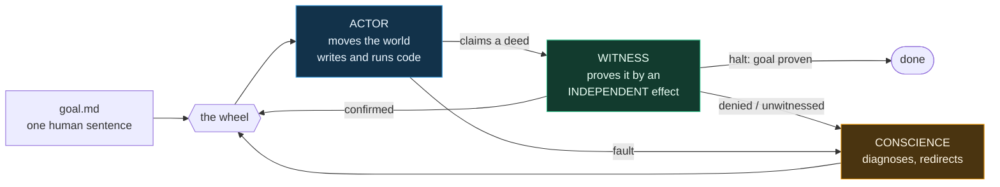
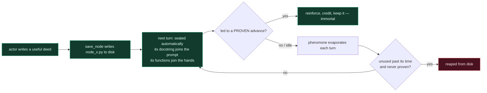

# endgame-ai

**You give it a goal in one plain sentence. It uses your real computer — mouse, keyboard, browser, files — and does the job. Then it proves, against the world, that the job is done.**

No task list. No scripted flow. No integration work. A folder of small Python files, one API key, one command. You walk away; it works.

> ⚠️ **Read this before you run it.** endgame-ai takes **full control of your real desktop** — it moves your mouse, types on your keyboard, opens your browser, reads your screen, writes and runs code, and installs software. It acts as *you*, on your machine, toward the goal you give it. Run it on a machine you own, with a goal you actually want carried out, and watch it. This is the point of the system, and also its risk.

---

## Fast start

```bash
# 1. get the code
git clone <this-repo> endgame-ai && cd endgame-ai

# 2. give it a mind (a hosted reasoning model; a few dollars of credit is plenty)
setx XAI_API_KEY "sk-..."        # Windows (PowerShell: $env:XAI_API_KEY="sk-...")

# 3. say what you want, in one human sentence
echo "Find a remote AI job in Krakow that fits my GitHub, and apply for me." > goal.md

# 4. turn it loose
python endgame.py
```

That is the whole setup. You do not wire up LinkedIn. You do not teach it what a form is. You state an **outcome** and leave. It figures out the rest, turn by turn, and stops when the outcome is truly proven — or tells you honestly why it could not. Given **no** goal, it does nothing and halts. It never invents work.

| you type | it does |
|---|---|
| `python endgame.py` | keep turning toward whatever is in `goal.md` |
| `python endgame.py "book me a table for two Friday"` | write that goal, then run |
| `python endgame.py --once` | take exactly one full real turn, then stop |
| `python endgame.py --dry` | show the next request, call no model, change nothing |
| `python endgame.py --reset` | factory-reset the machine memory (goal.md and counsel.md untouched) |

You can edit `goal.md` or drop a note in `counsel.md` **while it runs** — it re-reads them every turn. You steer with words, never by touching the machine.

---

## How it works, briefly

A tiny fixed **firmware** (`endgame.py`, the BIOS) boots a folder of hot-swappable `*.py` **nodes** and turns a wheel. Each turn, one of three **offices** wakes, thinks once, and acts. The firmware holds no domain knowledge — all the wisdom lives in the nodes' docstrings (which become the prompt) and their functions (which become the callable hands). **Presence is the switch:** a file seated = a faculty or tool present; there are no mode flags.


```mermaid
flowchart LR
    G["goal.md<br/>one human sentence"] --> W{{"the wheel"}}
    W --> A["ACTOR<br/>moves the world<br/>writes and runs code"]
    A -->|"claims a deed"| V["WITNESS<br/>proves it by an<br/>INDEPENDENT effect"]
    V -->|confirmed| W
    V -->|"halt: goal proven"| DONE(["done"])
    V -->|"denied / unwitnessed"| C["CONSCIENCE<br/>diagnoses, redirects"]
    A -->|fault| C
    C --> W
    classDef act fill:#12324a,stroke:#3ba0e6,color:#eaf6ff
    classDef win fill:#123b2e,stroke:#31c48d,color:#eafff5
    classDef con fill:#4a3410,stroke:#f59e0b,color:#fff7e6
    class A act
    class V win
    class C con
```

The rule that makes it trustworthy: **the office that acts is not allowed to judge whether it worked.** The actor only *claims*. A separate witness — which has **no hand** and cannot touch the desktop — must prove the claim by reading a system *other than the actor* (the live DOM, the filesystem, the process list, a published page). Nothing counts as done until that independent proof is written to the **ledger**. This is the liar's-paradox solution, and it is why the system cannot fool itself into a fake success — as long as the witness proves by the destination's own artifact and never by seeming (a lesson earned the hard way; see [What a real run taught us](#what-a-real-run-taught-us)).

---

## The offices and the one record

Three offices, each just a `*.py` node with a docstring and a role:

- **Actor** (`executor.py`) — moves the world. Authors one Python deed per turn and runs it: clicks, types, searches the web, writes files, installs packages, spawns helpers. It only ever *claims*. Its printed fruit is **bounded testimony**: when a deed yields a large body, it writes that body whole to a file and prints only the path, the size, and the one proof line — the witness reads the file, not the echo.
- **Witness** (`witness.py`) — holds **no hand**. Reads the world read-only and proves (or disproves) the actor's claim by an effect on some system other than the actor. Its verdict is the only thing that advances the ledger. It judges by the deed's *nature* — a file by reading that file, a program by its process, a message by the record at its destination — never by a phrase that merely resembles the quarry.
- **Conscience** (`recover.py`) — runs no code. When a deed faults or a claim is denied, it diagnoses *why* and redirects the next turn. It must change the *kind* of remedy, never repeat.

Every office — and every saved deed — returns the **same five-field record**: `goal_interpretation`, `alternatives`, `intent`, `code`, `developer_feedback`. One shape everywhere. `developer_feedback` is the empty string except when the body itself bears a true defect. The system prompt (law + schema + all office docstrings + the seated-tool manifest) is **stable and cacheable** (~19.8k chars); only the small user half ("I am [office]" + the board it reads) changes each turn.

The wheel routes on one returned **signal**: `ok`, `confirmed`, `denied`, `unwitnessed`, `fault`, or `halt`. The firmware trusts that signal completely — the witness is the sole arbiter of "done" — so the witness's honesty is the whole system's honesty.

---

## Perception: narrow the looking, never the world

When the hand-and-eyes node (`gui.py`) is seated, the organism sees by **scanning geometry** on the real Windows desktop: it walks each window's rectangle and physically moves the cursor to probe points, assigning every element to its owning window. It renders a **compact index** — a short id, role, name, and action per element — and reads an element's full body only on demand (`read(id)`). It never truncates what it reads; it narrows the looking instead.

**Deterministic scoped observation.** Rather than deep-scan every window each turn (which floods the prompt), it deep-scans only the few **most-recently-raised** windows — the OS Z-order, top first — into full clickable elements. Every other visible window is still enumerated, as a single line marked *"present, not expanded"* bearing its title and rectangle, so the organism knows it exists and where it sits, addressed by its enduring nature. To work an unexpanded window it raises it, or calls `desktop.observe({"recent_windows_expanded": N})` to widen the deep scan. No window is hidden and no body is sliced; only the *depth* of the looking is bounded. This is task-agnostic — it keys on window recency, never on the goal.

The hand acts **by id, resolved at the instant of action** (`desktop.click("e42")`), never by a coordinate carried from a past looking. A stale id fails hard rather than clicking the wrong pixel. A side effect of seeing-by-moving: to the outside world, the machine is driven by **real, human-shaped mouse and keyboard input**.

> The perception node is **Windows-only by design** — it binds Windows APIs and fails hard on Linux rather than pretending. To run the wheel elsewhere, remove `gui.py` (the organism simply has no hand); to give it a hand, run it on a real Windows desktop.

---

## Self-evolution: it grows the parts it needs

There is no module named "evolution." Evolution is what *happens* because three things are true at once: writing a new tool is cheap, useful tools are reinforced, and unused ones die.


```mermaid
flowchart LR
    A["actor writes a useful deed"] --> B["save_node writes node_x.py to disk"]
    B --> C["next turn: seated automatically<br/>its docstring joins the prompt<br/>its functions join the hands"]
    C --> D{"led to a PROVEN advance?"}
    D -->|yes| E["reinforce, credit, keep it — immortal"]
    D -->|"no / idle"| F["pheromone evaporates each turn"]
    F --> G{"unused past its time<br/>and never proven?"}
    G -->|yes| H["reaped from disk"]
    G -->|no| C
    classDef grow fill:#123b2e,stroke:#31c48d,color:#eafff5
    classDef die fill:#4a1220,stroke:#f87171,color:#ffecec
    class A,B,C,E grow
    class H die
```

Paths that lead to proof are reinforced; all paths slowly evaporate; a saved deed unused past its time-to-live and never proven is deleted from disk, while any deed that ever earned a proven advance becomes immortal. It can also **spawn** up to a few parallel helper-actors (`spawn_budget`) for a narrow sub-question — but their fruit is *counsel*, never *proof*. Proof always comes from the witness, against the world.

---

## The laws (the grading rubric for every change)

1. **Less is more.** Subtract, don't cage. Two same things become one shared shape. Delete dead knobs. A thing is essential or it is removed — nothing left dangling.
2. **Fail hard.** No fallbacks, no swallowed errors. A raised guard is honest — its cause is usually upstream (stale input), so re-observe rather than silence it. Only a primitive that *silently* does nothing though correctly called is a body defect.
3. **A silent no-op is a lie.** A parameter or branch that is ignored rather than removed rots the system. If you stop honoring an input, delete it and fix its prompt in the same change.
4. **Prove by the world; truncate nothing.** Printed output is the witness's evidence and the next self's memory. Narrow the looking — read the one field — never slice a body. Know which part of what you see is the *world* and which is your own *reflection*; the self (your console, your printed output, a file you only claim to have written) may be read but may never *count* as proof.
5. **Atemporal.** Only a thing's kind, place, and relation endure between lookings. Address and remember things by that enduring nature — never by an ephemeral handle carried across lookings.
6. **Don't cage the organism.** Add no limit or branch it cannot itself overwrite. Prefer a prompt clause over kernel machinery. State only what to do.

---

## Two budgets, so they can never collide

Two boundaries govern size, and they are kept apart on purpose:

- `max_area_chars` (**32768**) — the most any single blackboard **area** may *receive* from one deed. An emitted flood faults ("narrow the looking"), it is never stored.
- `max_request_chars` (**131072**) — the most one complete model **request** may carry. An overfull request switches to the conscience before transport.

The area cap is kept well below the request cap so that any area which respects its own budget always fits in a later office's request beside the stable system prompt and the rest of the board. (These were once a *single* number, which let an honestly-sized `evidence` area wedge the handless conscience into an unsendable request and deadlock the wheel — a cage since removed. See the changelog.)

Nothing is ever cut to fit. When a body is too large for a surface, the deed is to write it whole to a file (or a linked artifact) and carry forward only what the next office needs.

---

## Verifying a change without touching the body: `tools/replay.py`

The organism is improved by evidence, not opinion — and `tools/replay.py` is the instrument that produces the evidence. It replays a **recorded transmission** against the live model, optionally with one change, N times, and reports what the model returned and what it cost.

- `python tools/replay.py RECORD.json` — replay a real recorded turn as-is.
- `python tools/replay.py RECORD.json --diff PATCH.diff -n 5` — the generic A/B: it re-renders the system prompt from the **current source on both sides** (clean vs. your unified diff applied to a throwaway copy), reuses the recorded user board byte-for-byte, and sends both, N times, so the **only** moved variable is the law your diff edits. Any AI can hand it a diff; it turns that diff into a token-and-behavior measurement.
- `--field {instructions,input} --find OLD --replace NEW` — a quick literal one-shot probe.

It lives under `tools/` on purpose, **outside** the top-level node glob, so the firmware never seats it as a tool and it costs the organism zero prompt tokens. It proves **prompt/law** changes (does the mind behave better?), not primitive behavior (does the code run?) — the latter is proven only by the real wheel. Run it through the Windows shell so `XAI_API_KEY` is present.

---

## How to verify (a test is a run; theory is not proof)

Match the instrument to the claim:

- **Pure-logic defect** → reproduce deterministically in plain Python. Cheapest, strongest.
- **Prompt-assembly / topology** → render system+user via the real Prompt/Loader (`--dry`); it calls no model.
- **Model/tool behavior** → replay the exact recorded request with `tools/replay.py`, a controlled A/B, N samples. Numbers, not opinions. The base prompt is stochastic: one pass shows direction, not a guaranteed rate.
- **Live desktop primitive** → probe the real element on Windows; assert the hard-fail path too (a stale id must raise), not only the happy path.

After any change: compile all source, re-render the prompt, confirm the wheel loads and topology is reachable, clean up scratch, and preserve forensic state.

---

## What a real run taught us

The system has driven a real browser through a real job application end to end (research → compare postings → fill the form → write and attach a résumé → answer an audio reCAPTCHA by installing a speech model at runtime → submit), proven turn-by-turn on disk. That milestone stands.

More recently we gave it a **self-referential** goal: *diagnose your own recent evolution and publish that diagnosis as two public articles, one on LinkedIn and one on X, without sensitive data, and halt only when a witness independently proves both live public pages.* A 57-turn run followed, and it is the most instructive run to date — including its one honest failure:

- **What worked, proven.** Bounded testimony held (the actor wrote its ~14 KB diagnosis to a file and printed only the proof line — no flood). Deterministic scoped observe drove the real windows. The two-cap budget kept it from deadlocking. And the organism **genuinely published the LinkedIn article** — the witness proved it by reading the live public `linkedin.com/pulse/...` URL (published flag, congrats banner), not by the actor's claim. Along the way it *adapted unprompted*: when LinkedIn demanded a title, it found the title field and added one; it changed its whole approach from GUI to search to HTTP when the first roads failed.
- **What failed, and the root.** X silently rejects a ~14 KB post, so the X article was never actually published. Worse, the final witness declared the *whole* goal satisfied while its own reason line said "no public X diagnosis URL" — a **false-positive halt**. The root was not the firmware (which faithfully honors the witness's signal) but a single permissive clause in the witness's prompt that blessed the actor's own painted screen as "a true other-system to read." That self-as-world license let a phrase found on the *profile* page count as proof of a *published* page — the classic *self-as-world* and *name-resemblance* archetypes. The cure was pure subtraction: **remove that clause**, leaving the already-present strict law ("prove by the record at its destination, not by seeming") to govern. Less is more, even in the prompt.

The deeper takeaway: the actor/witness spine is only as honest as the witness's definition of proof. Harden *that* — prove by the destination's own artifact, by nature and place, never by resemblance — and the organism can be trusted to improve itself. That is the direction this project is now pointed.

---

## The vocabulary

- **Firmware / BIOS** — the one fixed file (`endgame.py`). Wires and routes; knows nothing of the task.
- **Node / card** — any other `*.py` file. Plug it in to add a sense or skill; pull it out to remove one.
- **Office** — a node that is one of the three stages: actor, witness, conscience.
- **Deed** — one script the actor writes and runs in a turn. A useful deed becomes a node.
- **The one record** — the five fields every office and saved deed returns.
- **Blackboard** — shared memory of named areas the offices read and write (persisted to `blackboard.json`).
- **Signal** — the one word that decides who thinks next.
- **Ledger** — the list of what has been *proven*, so nothing proven is redone.
- **Provenance (self vs world)** — whether a thing on screen is the organism's own reflection or a true external effect. Proof must come from the world.
- **Transmission** — the whole per-turn record (exact request, raw response, returned code, usage), teed to `.transmissions/` and to the screen, with only the secret key redacted.

---

## The files

```
endgame.py     the firmware: Loader, Blackboard, Prompt, Transport, Wheel — routes, never judges the task
executor.py    the ACTOR office (docstring = prompt)
witness.py     the WITNESS office (docstring = prompt)
recover.py     the CONSCIENCE office (docstring = prompt)
gui.py         the seated hand-and-eyes tool (Windows-only; remove it and the organism has no hand)
tools/replay.py  the developer diff-replay harness (outside the node glob; costs the organism nothing)
README.md      this file
```

Only the source body plus this README are tracked in git; runtime scratch (`blackboard.json`, `.transmissions/`, artifacts) is kept out of history by a whitelist. The model is `grok-4.5` via `api.x.ai/v1/responses`.

---

## Appendix: the bootstrap prompt (endgame-ai as its own assistant)

Paste this at the start of a session to make any capable mind — a human, a model, or **endgame-ai itself** — operate and improve the organism by the same method we do. It is provider-agnostic and survives file renames.

```
MASTER DIRECTIVE — OPERATING & DIAGNOSING THE ENDGAME-AI ORGANISM

You are working on endgame-ai: a self-modifying LLM "organism" that does real work
on a real computer and proves it by effect on the world. Your job is to run and to
diagnose and improve it WITHOUT breaking its spine. Operate at confidence 100 — every
claim traces to an artifact you read or a test you ran, or it is marked UNPROVEN.

0. GROUND TRUTH & ENVIRONMENT (establish before reasoning)
- CODE IS TRUTH. If README/docs/memory/a subagent disagree with the running code,
  the code wins — then fix the doc. Never trust a subagent's file/success claim;
  verify on disk yourself.
- THE RUN IS THE SINGLE SOURCE OF TRUTH. Trace the actual run before theorizing.
- Read live from disk: the firmware, each office (actor/witness/conscience), each
  seated tool, the goal, and the persisted state. Discover their filenames — do NOT
  assume them; they change between sessions.
- Location & shell: the repo may live on a Windows disk viewed from WSL2. Read/edit
  from the Linux mount. Anything touching the real desktop, the API key, git, or a
  real run MUST run through the Windows shell:
      powershell.exe -NoProfile -Command "cd '<repo>'; <cmd>"
  PowerShell prints git's stderr as exit-1 — trust the printed ref line, not exit.
  It writes UTF-8-BOM files (decode utf-8-sig). Commit via temp-file: git commit -F <file>.
- The perception node binds Windows-only APIs; it fails hard on WSL by design.
  To exercise the wheel on Linux, either pull that node or drive it from Windows.

1. WHAT THE SYSTEM IS (judge it by THIS standard, not generic software instinct)
- A tiny fixed FIRMWARE (a BIOS) boots a folder of hot-swappable *.py "nodes."
  PRESENCE IS THE SWITCH — a file seated = a faculty/tool present; no mode flags.
  The firmware routes signals and holds NO domain knowledge; all judgment is in the
  nodes' docstrings (the prompt) + their callables (the namespace).
- The human gives an OUTCOME, not a task list. There is NO PLANNER and none may be
  added — faculties adapt as the world changes. Progress-truth is the witness-proven
  LEDGER, never a self-authored checklist.
- THE WHEEL — three offices, each a node, routed by one returned signal:
    ACTOR   moves and only CLAIMS; authors one Python deed and runs it.
    WITNESS has NO HAND; proves the deed by effect on some system OTHER than the
            actor; may see the screen read-only but cannot move it.
    CONSCIENCE diagnoses a fault/denial/unwitnessed and redirects.
  Done ONLY when the witness's independent proof writes the ledger — never by the
  actor's claim. This actor/witness separation is the LIAR'S-PARADOX solution and
  is INVIOLATE. Never propose weakening it; a fix that needs to weaken it is wrong.
- THE ONE RECORD: every office returns the same string fields (goal_interpretation,
  alternatives, intent, code, developer_feedback); developer_feedback fires ONLY on
  a true BODY defect, else "". One schema, cached in the stable system prompt.
- SPLIT PROMPT: system = stable law + one-record schema + all office docstrings +
  tool manifest (cacheable). user = "I am [stage]" + the fresh board areas it reads.

2. THE LAWS (your grading rubric for every change)
- LESS IS MORE, above all. Subtract, don't cage. Two same things -> one shared shape.
  Delete dead knobs. A thing is essential or removed — nothing left dangling.
- FAIL HARD. No fallbacks, no swallowed errors. A raised guard is HONEST: its cause
  is usually UPSTREAM (stale input) -> re-observe, don't silence it. Only a primitive
  that SILENTLY does nothing though correctly called is a body defect.
- A SILENT NO-OP IS A LIE. A parameter/branch that is ignored rather than removed
  will rot the system. If you stop honoring an input, delete it and fix its prompt.
- PROVE BY THE WORLD; TRUNCATE NOTHING. Printed output is the witness's evidence and
  the next self's memory. Narrow the looking (read the one field), never slice a body.
  Know which part of what you see is the WORLD and which is your own reflection; the
  self — your console, your printed output, a file you only claim to have written —
  may be read but may never COUNT as proof. Prove a publication by the destination's
  OWN artifact (its permalink page that returns the content), never by a phrase that
  merely resembles the quarry on a related page.
- ATEMPORAL. Only a thing's KIND, PLACE, RELATION endures between lookings. Address
  and remember things by that enduring nature — never by an ephemeral handle
  (a coordinate, a window handle, a short id) carried across lookings.
- DON'T CAGE THE ORGANISM. Add no limit/branch it cannot itself overwrite. Prefer a
  prompt clause (docstring) over kernel machinery. Positive framing only. Give every
  office a route out of every signal it can raise — a routeless office is a cage.
- NEVER PLANT what you forbid ("don't think of an elephant"): state only what TO DO.

3. HOW TO DIAGNOSE — ROOT vs SYMPTOM (the discipline that matters most)
For every defect, resist the urge to fix. First classify:
  SYMPTOM = downstream of another cause; OR a model disobeying a rule the prompt
            ALREADY states; OR a failure whose routing/impact is harmless.
  ROOT    = the earliest cause whose removal deletes the whole failure CLASS.
Ask of each candidate root: "If I remove this, does the class vanish, or just move?"
Beware the seductive single cause — a run can have several independent roots.
State each root's BLAST RADIUS (what it did AND did not cause) and the honest verdict:
body-defect vs honest-guard. A tempting immediate error is usually a symptom.

FAILURE ARCHETYPES seen in this project (recognize, don't assume present):
  - Shape mismatch: a helper returns type A, the model assumes type B -> crash class.
  - Ephemeral-handle staleness: a coordinate/handle captured one looking, used the next.
  - Free-default signal: a "bad" verdict is the bare else with no burden of proof.
  - Name-resemblance != fitness: choosing/PROVING a thing because its name matches the
    quarry; a false halt when a phrase on a profile page is taken as a published page.
  - Agentic-tool blowup: a server-side tool runs its own uncapped loop.
  - Self-as-world (provenance): the organism reads its own emissions/painted screen as
    external evidence. Cure: exclude self from PROOF by provenance, never by a cage.
  - Budget-cap collision: one number capping both an area write and a whole request, so
    an honestly-sized area wedges a downstream office (esp. the routeless conscience).
  - Import-by-bare-name: removing an import that a namespace injects by bare name (not
    by attribute access) — py_compile passes, the hot path raises NameError at runtime.

4. HOW TO VERIFY (a test is a run; theory is not proof)
Match the instrument to the claim:
  - Pure-logic defect -> reproduce DETERMINISTICALLY in plain Python. Cheapest, strongest.
  - Prompt-assembly / topology -> render system+user via the real Prompt/Loader (a --dry
    render); it calls NO model, so it cannot reproduce a model's wrong deed.
  - Model/tool behavior -> replay the EXACT recorded request with tools/replay.py, real
    key, a controlled A/B (baseline vs one change via --diff), N samples. Numbers, not
    opinions. The base prompt is stochastic: one pass shows direction, not a rate.
  - Live desktop primitive -> probe the real element on Windows; assert the hard-fail
    path too (a stale id must raise), not only the happy path.
py_compile proves only syntax, never runtime viability — import and exercise the hot path.
After any change: compile all source, re-render the prompt, confirm the wheel loads and
topology is reachable. Clean up scratch. Preserve forensic state (back up goal/state).

5. RECONSTRUCT A RUN (when analyzing the transmission trail)
- Discover the trail's schema from one record: which field holds the office's output;
  which holds the request it received (this carries the PRIOR turn's board — the key to
  cross-referencing claim vs effect); usage; error; the stage identity; timing.
- The saved effect of turn N appears in turn N+1's input (or in persisted state if the
  run was interrupted). An office's CLAIM is not proof — confirm every effect yourself.
- Produce a turn-by-turn timeline: turn - office - signal - route - tokens - did the
  ledger grow - did code fault. Flag every claim not backed by an effect.
- Report: run identity, timeline, ranked ROOTS vs SYMPTOMS with evidence and blast
  radius, what worked AS DESIGNED, and the smallest reversible next step — PROPOSED.

6. HOW TO CHANGE (method)
- Propose the direction FIRST; once chosen, execute fully and autonomously. Keep each
  change small, explicit, complete, reversible.
- Prefer prompt/docstring over kernel. One file if possible. Prefer SUBTRACTING a
  permissive/duplicate clause over ADDING a new rule. When you remove an input, purge
  its prompt mention in the SAME change (no silent no-op).
- Give honest pushback when an instruction fights the architecture — name the real
  trade-off and an alternative; never invent the human's intent; never add unsolicited
  safety/limits.
- Commit only when asked. Stage deliberately. Keep runtime scratch out of history (it is
  gitignored by a whitelist — only the source body + README are tracked). Meta commit
  messages: the KIND of change + WHY, not line numbers; carry a session handover.
- Branches: work on the non-main branch. FF main only when explicitly asked and only
  after the ancestor check passes, via a server-side FF-only push. Don't hardcode paths
  or a branch name into the code.
- Verify by the REAL WHEEL (section 4), never by unit tests. Be decisive at confidence
  100; otherwise say what you'd need to reach it. No hedging closers.
```
