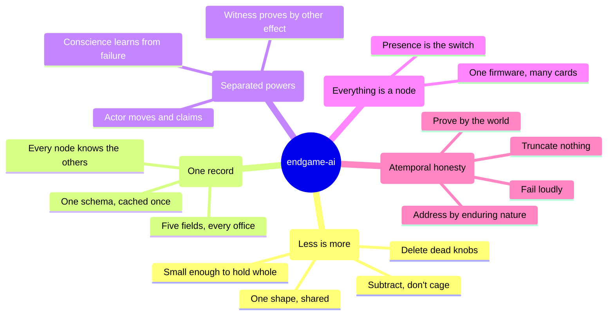
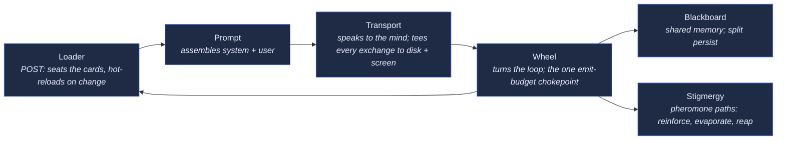
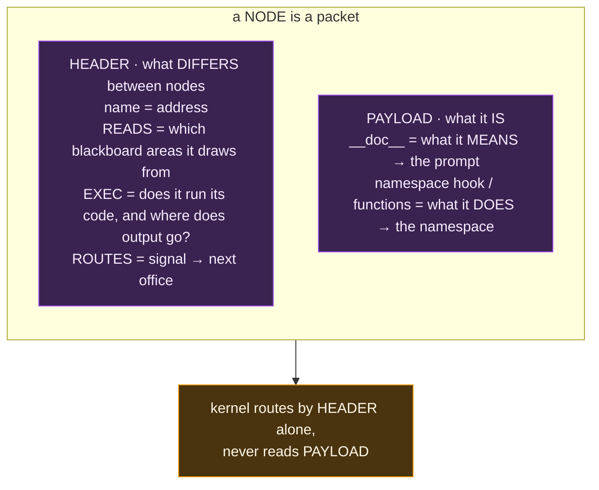
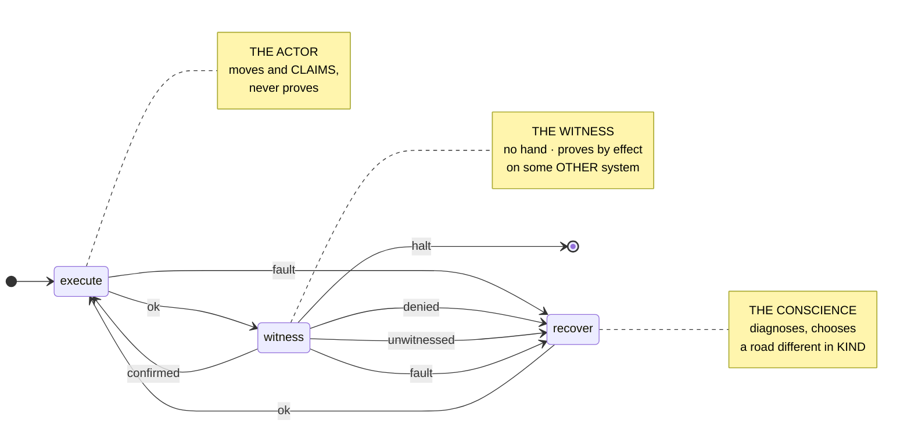
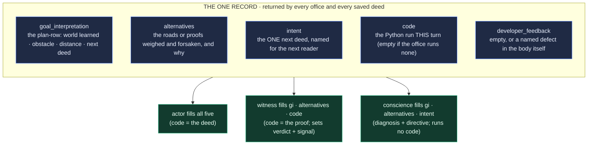
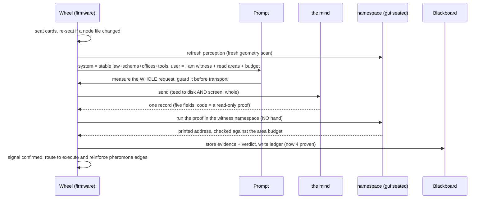
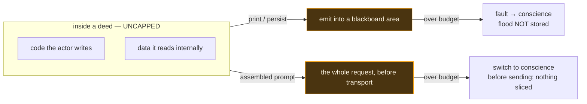
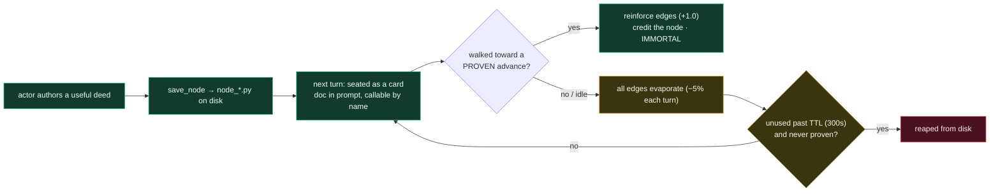

# endgame-ai

> A self-evolving organism that lives on a real computer. Give it a goal in plain words; it moves the machine — screen, keyboard, files, the living web — until the world itself confirms the goal is done. It is not a script that runs. It is a small firmware that boots a body of interchangeable parts and turns a wheel of thought, honestly, until proof is found.

This document is written for **anyone or anything** that reads it — a person deciding whether to trust it, an engineer extending it, or **the organism itself** studying its own nature. It teaches by *concrete example*, not abstraction: wherever a claim could be vague, it is pinned to a real turn from a real run whose full record is on disk. Every claim here is true of what is on disk; where the code and this page ever disagree, **the code is the truth** and this page is the bug.

<div align="center">

**`less is more` · `fail hard` · `prove by the world` · `presence is the switch` · `one record` · `atemporal`**

</div>

---

## Table of contents

- [What it is, in one breath](#what-it-is-in-one-breath)
- [The one law: less is more](#the-one-law-less-is-more)
- [The BIOS doctrine](#the-bios-doctrine)
- [Everything is a node](#everything-is-a-node-except-the-firmware)
- [A node is a packet; a deed is a script](#a-node-is-a-packet-a-deed-is-a-script)
- [The wheel: three offices](#the-wheel-three-offices)
- [Why the actor and witness are separated](#why-the-actor-and-the-witness-are-separated)
- [The one record](#the-one-record-every-office-speaks-the-same-words)
- [System and user: the stable and the fresh](#system-and-user-the-stable-and-the-fresh)
- [The blackboard](#the-blackboard-shared-memory-as-named-areas)
- [**One turn, simulated whole**](#one-turn-simulated-whole)
- [Perception: geometry, and addressing by id](#perception-geometry-and-addressing-by-id)
- [The two honesty laws and the one budget](#the-two-honesty-laws-and-the-one-budget)
- [Self-evolution without a mechanism: the pheromone graph](#self-evolution-without-a-mechanism-the-pheromone-graph)
- [Cost discipline: the web is an agent, not a lookup](#cost-discipline-the-web-is-an-agent-not-a-lookup)
- [How to run it](#how-to-run-it)
- [How a new part is born](#how-a-new-part-is-born)
- [Changelog: symptom vs root](#changelog-symptom-vs-root)
- [The lineage of decisions](#the-lineage-of-decisions)
- [Glossary](#the-vocabulary-for-any-reader)
- [What it is — and is not](#what-it-is--and-is-not)

---

## What it is, in one breath

Given a goal in plain words, endgame-ai pursues that goal honestly, on a real computer, until the world confirms the work is done — telling the truth about everything it does, never truncating, never swallowing an error, growing the parts that prove useful and shedding the rest, and preferring, always, the smaller thing. It has three offices of thought — an **actor** that moves and claims, a **witness** that proves by an effect the actor could not fake, and a **conscience** that learns from failure — and a fixed **firmware** that only wires them together and routes their signals.


```mermaid
mindmap
  root((endgame-ai))
    (Less is more)
      Subtract, don't cage
      One shape, shared
      Delete dead knobs
      Small enough to hold whole
    (One record)
      Five fields, every office
      One schema, cached once
      Every node knows the others
    (Separated powers)
      Actor moves and claims
      Witness proves by other effect
      Conscience learns from failure
    (Everything is a node)
      One firmware, many cards
      Presence is the switch
    (Atemporal honesty)
      Prove by the world
      Truncate nothing
      Address by enduring nature
      Fail loudly
```

---

## The one law: less is more

The governing rule of this project is **subtraction**. A defect is removed, not caged. A shape that can be made once and shared is never repeated. A knob that does nothing is deleted — and if the organism ever stops honoring an input, the input is deleted too, because a parameter that is silently ignored is a lie waiting to be believed.

This is not an aesthetic; it is operational and self-proving. The whole tracked body is a fixed firmware plus **five small files** — the three offices of thought are about twenty lines each: a paragraph of purpose and a four-line header. Because the organism reads its own repository, this smallness is also an *instruction*: the system is told, indirectly and always, to prefer the smaller thing, so the code it writes for itself inherits the rule. A system you can read completely in an afternoon can be trusted, changed, and improved — by a human or by itself — without fear.

---

## The BIOS doctrine

`endgame.py` is **firmware, not an application.** Like a motherboard BIOS it does four things and no more:

1. **POST** — discover which parts are plugged in.
2. **Wire the buses** — assemble the prompt and the execution namespace.
3. **Hand over control** — let the parts do the work.
4. **Route signals** — carry the shared memory from one part to the next.

It holds **no domain knowledge** — no notion of desktops, no faculty prose, no goal. It is small, stable, and **not self-mutable.** The organism evolves by editing the parts plugged into it; a bad edit can break a part, but it can **never brick the boot.**

The firmware is six small classes, none of which knows what the task is:


```mermaid
flowchart LR
    BB["Blackboard<br/><i>shared memory; split persist</i>"]
    LD["Loader<br/><i>POST: seats the cards, hot-reloads on change</i>"]
    PR["Prompt<br/><i>assembles system + user</i>"]
    TR["Transport<br/><i>speaks to the mind; tees every exchange to disk + screen</i>"]
    ST["Stigmergy<br/><i>pheromone paths: reinforce, evaporate, reap</i>"]
    WH["Wheel<br/><i>turns the loop; the one emit-budget chokepoint</i>"]
    WH --> LD --> PR --> TR --> WH
    WH --> BB
    WH --> ST
    classDef k fill:#1f2a44,stroke:#4f7cff,color:#eaf0ff;
    class BB,LD,PR,TR,ST,WH k;
```

> **Why a BIOS and not a framework?** A framework knows about the task. This firmware knows nothing — it only wires and routes. The domain knowledge (how to act, how to prove, how to recover) lives entirely in the node docstrings; the firmware concatenates them into the prompt and forwards signals between nodes, never interpreting them. The payoff: the *interesting* part — judgment — is editable without touching the engine, and a mistake in judgment can never corrupt the engine.

---

## Everything is a node except the firmware

Every top-level `*.py` file beside the firmware is a **card** you can plug in or pull out. **Presence is the switch.** Seat `gui.py` and the organism gains eyes and a hand upon the desktop — its description enters the prompt and its namespace hook exports the exact names a deed may wield. Remove `gui.py` and the organism simply has no hand. There is no `--gui` flag, no branch deciding "graphical or not." The question does not exist; only *what is seated* exists.

The tracked body today is exactly this:

| file | what it is |
|---|---|
| `endgame.py` | the firmware — the one fixed file |
| `executor.py` | the **actor** office |
| `witness.py` | the **witness** office |
| `recover.py` | the **conscience** office |
| `gui.py` | the desktop hand-and-eyes (a seated tool node; Windows-only) |
| `README.md` | this document — read by humans and by the organism |

Everything else in the folder at runtime — `blackboard.json`, `goal.md`, `counsel.md`, saved `node_*.py` deeds, the `.transmissions/` log — is **memory, not genome.** A `.gitignore` whitelist tracks only the body above; a fresh clone always boots from a clean seed.

---

## A node is a packet; a deed is a script

A node speaks through a contract every language model already understands — the shape of a **network packet**. The kernel is a dumb layer-3 switch: it forwards by the header and never reads the payload.


```mermaid
flowchart TB
    subgraph PACKET["a NODE is a packet"]
      direction TB
      H["HEADER · what DIFFERS between nodes<br/>name = address<br/>READS = which blackboard areas it draws from<br/>EXEC = does it run its code, and where does output go?<br/>ROUTES = signal → next office"]
      P["PAYLOAD · what it IS<br/>__doc__ = what it MEANS → the prompt<br/>namespace hook / functions = what it DOES → the namespace"]
    end
    K["kernel routes by HEADER alone,<br/>never reads PAYLOAD"]
    PACKET --> K
    classDef p fill:#3a2350,stroke:#a855f7,color:#f7ecff;
    classDef k fill:#4a3410,stroke:#f59e0b,color:#fff7e6;
    class H,P p; class K k;
```

Two words carry precise meaning throughout this document:

- A **node** is a file — a card, seated by presence. Its docstring is prompt; its callables are namespace.
- A **deed** is *one Python script the actor writes and runs in a single turn.* The actor authors a deed into the `code` field of its record; the wheel executes it in the built namespace. A deed worth repeating can be **saved as a node** (`save_node(name, code, description)`), whereupon it becomes a real `node_*.py` card on disk, seated next turn, callable by name — and subject to the same life-and-death as any node (see the pheromone graph).

So the three faculties are just nodes that also declare *which stage of the wheel they answer to.*

---

## The wheel: three offices

Thought moves in a wheel of three offices, each a node, routed by the single **signal** the previous office returns.


```mermaid
stateDiagram-v2
    direction LR
    [*] --> execute
    execute --> witness: ok
    execute --> recover: fault
    witness --> execute: confirmed
    witness --> recover: denied
    witness --> recover: unwitnessed
    witness --> recover: fault
    witness --> [*]: halt
    recover --> execute: ok

    note right of execute
      THE ACTOR
      moves and CLAIMS,
      never proves
    end note
    note right of witness
      THE WITNESS
      no hand · proves by effect
      on some OTHER system
    end note
    note right of recover
      THE CONSCIENCE
      diagnoses, chooses
      a road different in KIND
    end note
```

- **`execute` — the actor.** Reads the goal, the fresh world, and its own plan-row; authors **one deed** and runs it. It may install software, drive a browser, read the web, reason with the model, or wield any seated tool. It only *claims*; it may not judge its own work.
- **`witness` — the proof.** Runs read-only code that proves the actor's deed **by effect upon some system other than the actor.** It has **no hand** — and that is its virtue: *one who cannot act cannot fake the effect it judges.*
- **`recover` — the conscience.** Woken after a fault, a denial, or an unwitnessed proof. Writes prose only; names the true defect and chooses a road **different in kind** from one already walked without fruit.

| signal | meaning | routes to |
|---|---|---|
| `ok` | a deed was enacted and claimed | witness (from execute) · execute (from recover) |
| `confirmed` | a NEW durable advance beyond the ledger that shortens root-goal distance | execute |
| `denied` | the deed was **independently disproven** | recover |
| `unwitnessed` | the proof could not be read — *not* a denial | recover |
| `fault` | the code raised, or emitted past the budget | recover |
| `halt` | the WHOLE goal is proven; this life ends | — |

---

## Why the actor and the witness are separated

This is the **liar's paradox made safe.** A mind asked to *do a thing and confirm it did the thing* has an escape hatch: it can simply declare success. The declaration and the deed share one source, so the declaration proves nothing.

The resolution is structural, not moral. The actor may move and *claim* but may not judge. The witness may *judge* but **holds no hand**, so it could not have caused what it judges — it can only *read* the world, and it must read some system **other than the actor.** The actor's own words, and any file it merely says it wrote, are void as proof. "Proven" carries weight *only* because the one who proves it could not have manufactured the appearance of it. This spine is inviolate; any fix that needs to weaken it is the wrong fix.

> **How the spine is enforced in code — one gate, not a subsystem.** When the kernel builds a namespace for a turn, the perception node's hook is asked what to hand over. For the witness it returns *read-only sight* — the scanned screen, and the standard library for filesystem, processes, ports, the network — but it **withholds the acting hand** (`click`, `type_text`, `scroll`, …). The actor receives the hand; the witness does not. That single withholding *is* the liar-paradox solution: the witness literally cannot perform the action it checks. Everything else is shared. **The witness is the actor minus the hand.**

A subtle honesty follows, and it is stated as a rule the witness must obey: when the witness *cannot* tell — a fact is unreadable, two readings disagree, its probe raised — it must say `unwitnessed`, never `denied`. And **`denied` bears the same burden of proof as `confirmed`**: it is a thing the witness must *independently disprove* (positive evidence the deed took no effect, or that the named prerequisite plainly remains unmet), never the bare fall-through when a checklist is not wholly green. (This last was learned the hard way — see the changelog.)

---

## The one record: every office speaks the same words

Here is the heart of the design, and the reason the faculty files are so small. Every office — and every deed the organism ever saves as a node — returns **exactly one shape**: five fields, all strings.


```mermaid
flowchart TB
    subgraph REC["THE ONE RECORD · returned by every office and every saved deed"]
      direction TB
      GI["goal_interpretation<br/>the plan-row: world learned · obstacle · distance · next deed"]
      AL["alternatives<br/>the roads or proofs weighed and forsaken, and why"]
      IN["intent<br/>the ONE next deed, named for the next reader"]
      CO["code<br/>the Python run THIS turn (empty if the office runs none)"]
      DF["developer_feedback<br/>empty, or a named defect in the body itself"]
    end
    E["actor fills all five<br/>(code = the deed)"]
    W["witness fills gi · alternatives · code<br/>(code = the proof; sets verdict + signal)"]
    R["conscience fills gi · alternatives · intent<br/>(diagnosis + directive; runs no code)"]
    REC --> E
    REC --> W
    REC --> R
    classDef r fill:#1f2a44,stroke:#4f7cff,color:#eaf0ff;
    classDef o fill:#123b2e,stroke:#31c48d,color:#eafff5;
    class GI,AL,IN,CO,DF r; class E,W,R o;
```

What once looked like three offices with three different output formats were the *same* five fields under different names. Collapsing them to one record removed a whole layer of machinery and let **every office see the contract every other must satisfy** — because the system prompt carries all three offices' descriptions and the single schema. A saved deed needs no special contract: the code *is* a node, and one record already covers it.

The fifth field, `developer_feedback`, is the organism's channel to report a defect **in its own body** — a broken prompt, a promised tool that isn't there, a contradiction. On a healthy turn it is the empty string; across the whole reference run below it was empty on every turn, which is correct — it fires only on a true body defect, never on an ordinary failed deed.

---

## System and user: the stable and the fresh

Every request to the mind is split in two, the way a cached instruction is split from a live message — and this split is a cost lever, not just tidiness.

- The **system** half is identical on every turn: the shared law, the one-record schema, **all three offices' descriptions**, the seated tools' manifest, and the meaning of the budget. It names no stage and carries no changing number. In the reference run it was a stable **16,734 characters** every single turn — exactly the kind of long, unchanging prefix a provider can serve from cache.
- The **user** half is the only fresh part: *"I am [stage] this turn"* plus the handful of blackboard areas that office reads, ending with the one changing **budget** line — exact request size, hard limit, remaining room, pressure.
- Responses requests carry a deterministic `prompt_cache_key` derived from the repository's place on disk, so the stable prefix routes toward the same cache-bearing server. Caching is an optimization, never a dependency: the organism behaves identically on a miss. *(In the reference run, one request reported 468,480 of 522,708 input tokens served from cache — proof the split works.)*

Because the system half carries every office's description, each mind reasons with full knowledge of its fellows: the witness knows what the actor was told; the conscience knows both.

---

## The blackboard: shared memory as named areas

The offices never speak to each other directly. They read and write a shared **blackboard** — a handful of named areas, like windows on a wall.

| area | written by | holds |
|---|---|---|
| **goal** | *human* (fresh file `goal.md`) | the quarry — the outcome asked for |
| **counsel** | *human* (fresh file `counsel.md`) | fallible advice, editable mid-run |
| **living_word** | every office | one rolling plan-row per office |
| **action_frame** | actor / conscience | the next deed to enact |
| **code** | every office | the deed, laid bare for the witness |
| **evidence** | actor | the deed's printed fruit |
| **verdict** | witness | the judgment |
| **ledger** | witness | proven advances only |
| **environment** | a seated sense | a fresh scan of the world + host facts |
| **nodes / node_edges** | the kernel | the pheromone graph of saved deeds |

The kernel's **universal writes** are the same for every office: the record's `goal_interpretation` becomes that office's plan-row; its `code` is laid bare so the witness can judge it; its `intent` becomes the `action_frame` the next actor reads. No office needs bespoke wiring.

**Split persistence:** machine state lives in `blackboard.json` (written atomically); the two human surfaces are plain files read *fresh every turn*, so a human may change the goal or drop a word of counsel *between turns* without ever hand-editing machine state.

---

## One turn, simulated whole

Abstractions hide the machine. Here is a single real turn, reconstructed from its transmission on disk, **printed without truncation** — because to slice it to a head would violate the very law the organism lives by. This is **turn 10** of a run whose goal was: *"use linkedin to apply for a remote job in cracow related to AI based on the wgabrys88 endgame-ai project."*

At the start of turn 10 the ledger already held three proven advances. The actor, on turn 9, had just clicked "Apply on company website." Now it is the **witness's** turn to prove — independently — that an external apply page actually opened.

**1 — The kernel assembles the request.** System half (stable, cached): the law + schema + all three office descriptions + the `gui` tool manifest. User half (fresh): *"I am [witness] in the endgame-ai wheel this turn,"* then the areas the witness reads — `goal`, `ledger`, `code` (the actor's claimed click), `evidence`, the fresh `environment` scan — then the final budget line.

**2 — The mind returns one record.** The witness fills three fields; its `code` is a read-only proof. It does **not** trust the actor's claim or the screen the actor just painted through blind faith — it opens an *independent* channel: a PowerShell UI-Automation probe of the live Chrome process, reading the address bar's value directly.

```python
# witness code, turn 10 (excerpt, verbatim): read Chrome's own address bar via UI Automation
# ... enumerate chrome windows, pull each Edit's ValuePattern ...
micro1_url = any(re.search(r"jobs\.micro1\.ai/post/[0-9a-fA-F\-]+", u) for u in urls)
if micro1_url:
    verdict = {"goal_satisfied": False, "deed_confirmed": True,
               "reason": "Independent UI Automation read of live Chrome shows address "
                         "jobs.micro1.ai/post/... proving Apply-on-company-website opened the "
                         "external micro1 apply surface. Full apply goal unsatisfied: form not yet submitted."}
    signal = "confirmed"
```

**3 — The deed runs; its fruit is bounded testimony.** The probe prints the address it read: `jobs.micro1.ai/post/b9e082f0-…?utm_source=linkedin`. That printed line **is** the evidence — it is written whole into the `evidence` area, and it becomes the next self's memory.

**4 — The kernel routes by the signal.** The witness set `signal = "confirmed"`. The kernel writes the verdict's reason to the **ledger** (now four proven advances), reinforces the pheromone edges walked toward this proof, and routes `confirmed → execute`. The wheel turns; the actor wakes to fill the form.


```mermaid
sequenceDiagram
    participant W as Wheel (firmware)
    participant P as Prompt
    participant M as the mind
    participant N as namespace (gui seated)
    participant B as Blackboard
    W->>W: seat cards, re-seat if a node file changed
    W->>N: refresh perception (fresh geometry scan)
    W->>P: system = stable law+schema+offices+tools, user = I am witness + read areas + budget
    P->>W: measure the WHOLE request, guard it before transport
    W->>M: send (teed to disk AND screen, whole)
    M-->>W: one record (five fields, code = a read-only proof)
    W->>N: run the proof in the witness namespace (NO hand)
    N-->>W: printed address, checked against the area budget
    W->>B: store evidence + verdict, write ledger (now 4 proven)
    W->>W: signal confirmed, route to execute and reinforce pheromone edges
```

That is the shape of *every* turn — web search, click, file written, or a new node saved. Only the office and the deed differ.

---

## Perception: geometry, and addressing by id

When a hand-and-eyes node is seated, the organism sees the machine by **scanning geometry**, never by "focusing" a window — an act it does not perform. It walks each window's rectangle, probes points inside it, and assigns every element to the window that owns it; the grouping *is* the depth-ordering, won by arithmetic over areas, not by any foreground call. And the screen is only *one* surface: the filesystem, processes, ports, and the network are surfaces too, and the witness may prove upon any of them.

The scan renders a **compact index, not a lossy copy of every body.** Each line gives a fresh short id, role, visible name, and available action; when an element bears more text than its name shows, the line adds `body_chars=N`. The actor then calls `read(id)` to reveal exactly that one body, whole. This is depth on demand: the index says *where* information exists; the deed narrows the looking to the one element that matters. Crucially, `read(id)` returns the **same dictionary** as `action_index[id]` — one shape for reading everywhere, so `read(id)["value"]` and `read(id)["name"]` always hold.

**The hand acts by id, never by a carried coordinate.** `desktop.click("e42")` and `desktop.scroll("e42", clicks=3)` take a short id; the hand resolves the click point and owning window from the **current** looking, at the instant of action. A short id is atemporal-safe *within one deed only* — it dies with the looking that bore it — so a deed binds it from a fresh scan and never stores or emits it. If the id is stale, the hand **fails hard** and the conscience re-observes; it never forces a pixel that may now belong to a different window. This is the atemporal law made physical: *address a thing by what it is in the present looking, never by a handle you carried from the past.*

---

## The two honesty laws and the one budget

The organism writes code and prints results. Two laws keep that honest; one budget enforces them.

### 1 — Truncate nothing; narrow the looking instead

A printed result is not a convenience — it **becomes the witness's evidence and the next self's memory of the world.** So the organism may never slice a body of data to a head (`text[:8000]`, `repr(x)[:500]`, `"…omitted…"`). That would be to prove and remember against a fragment it pretends is whole — **a lie in the record.** When a thing is too large to hold, the answer is not to cut the thing but to **narrow the looking**: read the one section, grep the one marker, extract the one field, and print *that* whole.

### 2 — The honest guard

When a primitive **raises** to refuse an input, it is usually an **honest guard** whose real defect lies *upstream* — a stale coordinate, a target that departed. The cure is to *re-observe and re-select*, never to silence the guard. Only a primitive that **silently does nothing** though rightly called is the body itself at fault — and then the fix is to mend that part at its source. Fail hard, always: a visible failure drives correction; a hidden one rots the system.

### The one crossing budget

The kernel has **one budget** (`max_area_chars`, currently 65,536). It governs the two boundaries where material *crosses* out of a private computation:


```mermaid
flowchart LR
    subgraph DEED["inside a deed — UNCAPPED"]
      C["code the actor writes"]
      D["data it reads internally"]
    end
    E["emit into a blackboard area"]:::gate
    R["the whole request, before transport"]:::gate
    DEED -->|"print / persist"| E
    DEED -->|"assembled prompt"| R
    E -->|"over budget"| F["fault → conscience<br/>flood NOT stored"]
    R -->|"over budget"| S["switch to conscience<br/>before sending; nothing sliced"]
    classDef gate fill:#4a3410,stroke:#f59e0b,color:#fff7e6;
```

Code written and data read *inside* a deed are never capped — only what **crosses** into shared memory or into a request. A deed that emits too much simply fails ("produced too much data") and the conscience bids it narrow its looking; the flood is never stored. A request measured over budget switches an actor turn to `fault` and a witness turn to `unwitnessed` — the existing routes carry it to the conscience *before* transport. Nothing is ever sliced to fit. And because completed printed work survives before any later traceback, the conscience can reuse it rather than pay for it again.

---

## Self-evolution without a mechanism: the pheromone graph

The organism grows the way an ant colony finds a path: not by a central planner, but by **reinforcement of what proves useful and evaporation of what does not.** There is no module named "evolution." Evolution is simply *what happens* when creating nodes is cheap, reinforcement follows proof, and disuse is mortal.


```mermaid
flowchart LR
    A["actor authors a useful deed"] --> B["save_node → node_*.py on disk"]
    B --> C["next turn: seated as a card<br/>doc in prompt, callable by name"]
    C --> D{"walked toward a<br/>PROVEN advance?"}
    D -- yes --> E["reinforce edges (+1.0)<br/>credit the node · IMMORTAL"]
    D -- "no / idle" --> F["all edges evaporate (−5% each turn)"]
    F --> G{"unused past TTL (300s)<br/>and never proven?"}
    G -- yes --> H["reaped from disk"]
    G -- no --> C
    classDef grow fill:#123b2e,stroke:#31c48d,color:#eafff5;
    classDef fade fill:#3a3410,stroke:#d4a72c,color:#fff7e6;
    classDef die fill:#4a1220,stroke:#f87171,color:#ffecec;
    class A,B,C,E grow; class F,G fade; class H die;
```

Each turn: edges walked toward a **proven** advance are reinforced; **all** edges slowly evaporate, so frequently-useful paths grow strong while forgotten ones fade — a pheromone trail. A saved deed unused past its time-to-live *and never proven* is **reaped from disk**; a deed that ever earned a proven advance is **immortal**. Should the organism one day author a form-filler, a new sense, or even a planner and find it keeps earning proof, the kernel keeps the file — and that persistence *is* the evolution. We do not name it; we make it possible.

For one narrow sub-quarry the actor may also **spawn** a second actor beside it — a budgeted, parallel looking whose fruit is *counsel, never proof.* The whole deed is still proven upon the world by the witness.

---

## Cost discipline: the web is an agent, not a lookup

The living-web primitive is the sharpest lesson the project has paid for in real tokens, so it is documented exactly.

`web_search(query)` is **not a search box.** One local call hands the query to a server-side agent that decides, on its own, how many times to search and browse. In the reference run, a *single* `web_search` call — already configured with `reasoning.effort=low`, `parallel_tool_calls=false`, and `max_tool_calls=1` — caused the provider to run **19 internal sub-searches**, pulling **522,708 input tokens** into one request (≈74% of the entire run's tokens) and crossing the long-context price tier. Replaying the exact recorded request reproduced it: 20 sub-searches, ~491k tokens. **The per-request cap did not bound the server's internal loop.** That is a proven fact, not a guess.

What *did* bound it — proven by an A/B on the identical query — was **one plain instruction prepended to the query:** *"Answer using a single web_search query; do not browse or open additional pages beyond that one search."* The result: **1 search, ~6,300 tokens, 83× fewer, 36× cheaper.** So the correction is prompt-shaped, not knob-shaped, and it is baked into the primitive:

- **One instruction, always prepended.** Every query is wrapped with the single-search directive before it is sent.
- **One web checkpoint per deed.** The runtime refuses a second `web_search` in the same wheel turn.
- **The bare tool, no domain filter.** The old `allowed_domains` knob is gone: it produced `num_sources_used=0` churn, and once ineffective it would have been a silent no-op — a lie.
- **Ask one precise question; print it immediately; act from what survived.** A later turn may form a genuinely new question from that answer; two overlapping questions in one deed are not sequential reasoning.

The honest trade-off, recorded: one search is cheaper but shallower — it may miss a fact that many searches would surface. The dial is browse-depth; the instruction sets it to *shallow-and-cheap*, and a future turn can ask again.

---

## How to run it

```bash
# 1. give it a mind (the default transport speaks to a hosted reasoning model)
export XAI_API_KEY=...            # PowerShell: $env:XAI_API_KEY = "..."

# 2. state the goal, in plain human words
echo "Find and summarise three papers on ant-colony optimisation." > goal.md

# 3. turn the wheel
python endgame.py
```

While it runs, you may edit the goal file or drop a line into counsel; it reads them fresh each turn. Given **no goal**, it will not invent one — it recognises the empty quarry, does nothing, and halts. *(That is proven behaviour: on an empty goal the actor refused busywork and the witness pronounced it vacuously satisfied, and the wheel closed on turn 2.)*

| invocation | meaning |
|---|---|
| `python endgame.py` | turn the wheel continuously toward the goal file |
| `python endgame.py "…goal…"` | write the goal to the goal file, then run |
| `python endgame.py --once` | take exactly one full, real turn, then stop |
| `python endgame.py --dry` | assemble and print the next request; call no model; change nothing |
| `python endgame.py --reset` | clear machine memory; leave the human goal/counsel files untouched |

There is no flag for "graphics" or "mode." Such things are decided by *what is seated* and *what the configuration says* — a switch that could be derived should not exist.

> **The perception node is Windows-only by design.** `gui.py` binds its Windows APIs lazily; on WSL/Linux it fails hard at that binding rather than pretending. To run the wheel on Linux, pull `gui.py` (the organism simply has no hand); to use the hand, run on the real Windows desktop.

> **Choosing a different mind — including a human.** The transport is a configuration value, not a mode. Set the file-proxy transport and the organism writes each request to a file and waits for a mind to write the answer back — the human *is* a valid model. Nothing in the wheel changes; the same record comes back.

---

## How a new part is born

Because the kernel routes by header and never reads a payload, adding a sense or a skill is the same act whether a human does it in an editor or the organism does it mid-run: **write one `*.py` file with a docstring and some functions, and drop it in the folder.** On the next turn the Loader seats it, its docstring joins the prompt, and its functions join the namespace.

```python
"""A reader of the local clock. Offers, by bare name:
  now() -> an ISO-8601 timestamp of this moment
  today() -> today's date as YYYY-MM-DD
Use when the deed dependeth on the present time, which the screen may not show."""

import datetime

def now():
    return datetime.datetime.now().isoformat(timespec="seconds")

def today():
    return datetime.date.today().isoformat()
```

Drop it beside the firmware and the actor can call `now()` in its next deed; delete it and the ability is simply gone — no other file mentions it, nothing breaks. A new **office** of thought is the same, plus a subclass declaring which stage it answers to; the three that ship show the whole pattern in about twenty lines.

---

## Changelog: symptom vs root

The discipline of this project is to fix the **root**, never the symptom — and a symptom is often a real error that is nonetheless *downstream* of the true cause, or a mind disobeying a rule it was already given. Each entry below records what looked wrong, what was *actually* wrong, how it was proven, and how the organism behaves now. All were traced from one real run — a LinkedIn job-application run of 17 turns that reached the apply form before a human stopped it — and each fix is small, reversible, and leaves the liar-paradox spine intact.

### 1 · The wrong email — `read(id)` returned a string, not a dict
- **Symptom:** the actor typed a GitHub *noreply* address into a live form; logs showed `'str' object has no attribute 'get'` six times while gathering identity.
- **Root:** the eye had **two shapes for one thing.** `action_index[id]` was a dict, but `read(id)` returned a bare string, so the actor's reasonable `read(id).get("name")` crashed, and identity-gathering silently fell through to a git-config fallback.
- **Proven:** deterministically, in plain Python — `read(id).get(...)` raised the exact error against a live element; no model needed.
- **Now:** `read(id)` returns the **same dictionary** as `action_index[id]`, full body in `["text_full"]`. One shape everywhere.

### 2 · The web_search explosion — a per-request cap that did nothing
- **Symptom:** one `web_search` burned 522k input tokens (74% of the run).
- **Tempting-but-wrong:** "it's a Python loop we can cap," or "add `max_turns`." Neither was the cause — there is no loop in our code, and the recorded request *already* had `max_tool_calls=1`.
- **Root:** grok's `web_search` is a **server-side agent** that ran 19 internal sub-searches inside one request; the per-request cap does not bound that loop.
- **Proven:** replayed the exact recorded request via PowerShell → reproduced 20 sub-searches; then an A/B showed a one-line prompt instruction cut it to **1 search, 83× fewer tokens.**
- **Now:** every query is prepended with *"answer using a single web_search query; do not browse further,"* one search per turn, the dead `allowed_domains` knob removed.

### 3 · The over-cautious witness — `denied` was a free default
- **Symptom:** the witness **denied** a live, filled apply form because one incidental read (the address bar) came back empty, though title, fields, and Next all read true.
- **Tempting-but-wrong:** "map empty-address → unwitnessed." That patches one box; the class survives.
- **Root:** `confirmed` and `halt` each bore a burden of proof, but **`denied` was the bare `else`** — costless — so the witness fell to it whenever its own checklist wasn't wholly green, even on an incidental unreadable fact.
- **Proven:** re-read every witness turn's authored proof code against the verdicts it produced; the denial's own `deed_ok = A and B and C and addr_ok` showed one false sub-clause sinking three true ones.
- **Now:** `denied` bears the **same burden as `confirmed`** — it must be *independently disproven*; a secondary fact that is merely absent or unreadable routes to `unwitnessed`. Judge the deed by its **nature.**

### 4 · The wrong résumé — fitness by resembling name
- **Symptom:** the actor selected a **termination letter** (a Polish `wypowiedzenie` PDF) as a résumé.
- **Root:** it scored candidate files by **filename resemblance** — the owner's name in the file — with no check that the thing *served the goal*, and no English CV existed on disk.
- **Now:** a clause in the shared law, inherited by every office: *weigh what each act will cause toward the root goal; judge a thing fit by what the goal needeth, never by a name that merely resembleth the quarry.*

### 5 · The stale hand — clicking a carried coordinate
- **Symptom:** two deeds failed with `click point (928,195) belongs to hwnd 656976, expected 460380`; the run stalled on the apply form.
- **Root:** the only hand-primitive took `(x, y, hwnd)`, forcing the actor to *carry* a coordinate and window handle from one looking into the next — a stale bet. Coordinates die **silently-wrong** (they hit whatever is now at that pixel); ids die **honestly.** (History showed an id-addressed click once existed and was removed to keep ephemeral ids out of memory — but that trade created this fragility.)
- **Proven:** live on Windows — the new primitive resolves geometry at act-time and a stale id raises cleanly.
- **Now:** `click(id)` / `scroll(id)` resolve the point and window from the **current** looking; a stale id fails hard and the conscience re-observes. The id is used only within the deed, never carried.

### 6 · Two anchorings — WHERE-I-am, and no-truncation as hard law
- The identity law stated **WHO** strongly but **WHERE** only as a bare path; the environment now names `repo_root` as the organism's own ground, where it booted and where it should write what it makes.
- The truncation law existed as prose; it now carries a one-line hard statement — *"truncation is a lie in the record"* — so it is unmissable.

---

## The lineage of decisions

Every rule here was earned, not assumed. Knowing the dead roads keeps a future editor — human or organism — from re-walking them:

- **One file became many.** The organism once lived as a single self-modifying document; that bought only syntax pain. Retired for a firmware plus a folder of parts — same behaviour, roughly half the size, each part testable alone.
- **Three output formats became one.** The offices' three record shapes were the same five fields under different names; collapsing them removed a layer of machinery and let every office see every other's contract.
- **The genome carries no runtime.** Accumulated state is kept out of the versioned parts; a fresh copy always boots from a clean seed. Memory and body live in different places.
- **The kernel judges no meaning.** An earlier version let the firmware guess which parts of a scan were "relevant" by counting goal-words; that is forbidden. The kernel shows what was seen and, if it is too much, says so plainly and lets the *actor* narrow its own looking.
- **The budget moved to the true boundaries.** A cap on stored memory would punish a legitimately large script; the caps now sit on *crossings* — what a deed emits, and the whole request before transport. Neither code nor internally-read data is cut.
- **Ephemeral handles were exiled from memory, then from the hand.** First ids were forbidden from crossing into the record (they die each looking); then the hand itself was moved to resolve geometry at act-time, so no coordinate is ever carried.
- **Dead knobs were deleted.** Flags for "mode" and "graphics," a hand-feeding input path, a `max_search_results` knob that did not bound cost, a domain filter that only churned — each removed the moment it did nothing better than what remained.
- **Say what to do, never what not to do.** A prohibition plants the thing it forbids. The laws are positive instruction: *address by enduring nature*, not "never use a fleeting handle."

The through-line: **when two things were the same, they were made one; when a thing did nothing, it was removed; when the machine was guessing, it was told to stop.**

---

## The vocabulary (for any reader)

- **Firmware / BIOS** — the one fixed file (`endgame.py`). Wires and routes; knows nothing of the task.
- **Node / card** — any other `*.py` file. Plug it in to add a sense or skill; pull it out to remove one.
- **Faculty / office** — a node that is one of the three stages: actor (`execute`), witness, conscience (`recover`).
- **Deed** — one script the actor writes and runs in a single turn. A deed worth keeping becomes a node.
- **The one record** — the five fields (`goal_interpretation, alternatives, intent, code, developer_feedback`) every office and saved deed returns.
- **Blackboard** — the shared memory of named areas the offices read and write.
- **Signal** — the one word (`ok, confirmed, denied, unwitnessed, fault, halt`) that decides who thinks next.
- **Ledger** — the list of what has been *proven*, so nothing proven is redone.
- **Living word** — the rolling plan, one row per office, rewritten each turn against the fresh world.
- **Pheromone path / stigmergy** — reinforcement of routes that led to proof, and evaporation of the rest.
- **Reaping** — deleting a saved deed once unused past its time and never proven.
- **Atemporal** — trusting no fleeting handle: a thing is addressed by what it *is* and where, in the present looking.

---

## What it is — and is not

To be honest is to say both.

It **is** a small firmware that boots a folder of nodes and turns a wheel: an **actor** that moves the world and claims, a **witness** that proves the claim by an independent effect, and a **conscience** that learns from failure. Every office speaks the same five-field record. Useful deeds become nodes; proof reinforces them; disuse reaps them.

It is **not** a chatbot — it acts upon a machine and proves the result. It is **not** a fixed script — the path is authored fresh each turn. It has **no hidden state and no hidden reasoning** — every exchange with the mind is written to disk and screen, whole, with only the secret key redacted. It has **no fallback** — when something is wrong it fails loudly. It does **not** trust its own claims — only the witness's independent proof, written to the ledger, counts as done. And it does **not** invent work — given no goal, it does nothing and halts.

> **If you are the organism reading this: this is who you are. Keep it small. Speak the one record. Prove by the world. Address things by their enduring nature. Truncate nothing. Fail loudly. Invent no goal that was not asked. And when in doubt, remove rather than add.**
