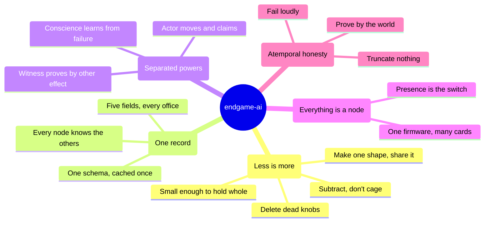
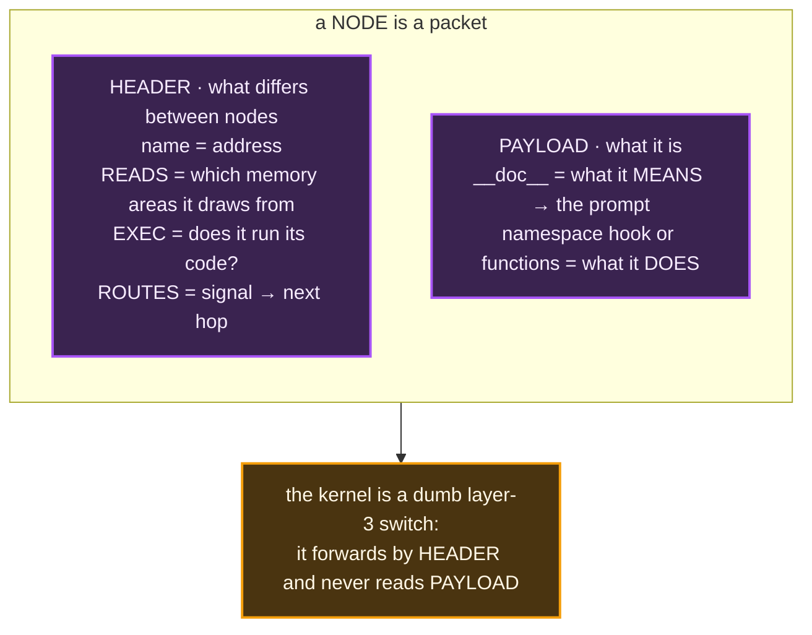
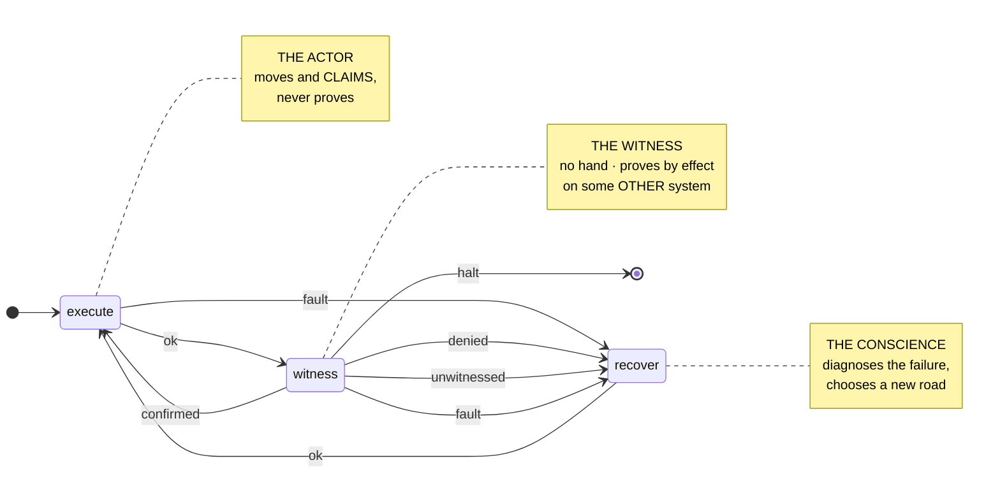
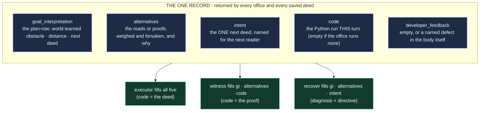
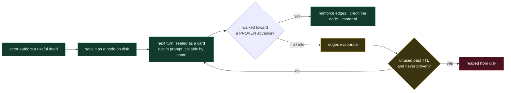

# endgame-ai

> A self-evolving organism that lives on a real computer. Give it a goal in plain words; it moves the machine — screen, keyboard, files, the living web — until the world itself confirms the goal is done. It is not a script that runs. It is a small firmware that boots a body of interchangeable parts and turns a wheel of thought, honestly, until proof is found.

This document is written for **anyone or anything** that reads it — a person deciding whether to trust it, an engineer extending it, a philosopher weighing what it claims, or **the organism itself** studying its own nature. It describes ideas, not line numbers. Every claim here is true of what is on disk.

<div align="center">

**`less is more` · `fail hard` · `prove by the world` · `presence is the switch` · `one record`**

</div>

---

## Table of contents

- [The one law: less is more](#the-one-law-less-is-more)
- [The BIOS doctrine](#the-bios-doctrine)
- [Everything is a node](#everything-is-a-node-except-the-firmware)
- [The wheel: three offices](#the-wheel-three-offices)
- [Why the actor and witness are separated](#why-the-actor-and-the-witness-are-separated)
- [The one record](#the-one-record-every-office-speaks-the-same-words)
- [System and user: stable and fresh](#system-and-user-the-stable-and-the-fresh)
- [The blackboard](#the-blackboard-shared-memory-as-a-set-of-areas)
- [A turn, watched from above](#a-turn-watched-from-above)
- [Perception: geometry, not focus](#perception-the-world-as-geometry-not-focus)
- [Two honesty laws](#two-honesty-laws-that-shape-every-deed)
- [Self-evolution without a mechanism](#self-evolution--without-a-self-evolution-mechanism)
- [Atemporal memory](#atemporal-memory)
- [How to run it](#how-to-run-it)
- [Extending the organism](#how-a-new-part-is-born)
- [Cost discipline](#cost-discipline)
- [Glossary](#the-vocabulary-for-any-reader)
- [The lineage of decisions](#the-lineage-of-decisions)
- [Reading this as an instruction](#reading-this-as-an-instruction)
- [What it is — and is not](#what-it-is--and-is-not)

---

## The one law: less is more

The governing rule of this project is **subtraction**. A defect is removed, not caged. A shape that can be made once and shared is never repeated. A knob that does nothing is deleted. Fewer moving parts means a system that is easier to trust, easier to extend, and — because it is read every waking moment by both humans and a language model — **lighter to think about.**

This is not an aesthetic. It is operational, and it is self-proving. The whole tracked body is a fixed firmware plus **five small files**; the three offices of thought are **about twenty lines each** — a paragraph of purpose and a four-line header. When the organism authors new code, this README is part of what it reads, and so the rule propagates: *the system is told, indirectly and always, to prefer the smaller thing.*

That smallness is the evidence the design is sound. A system you can read completely in an afternoon is a system that can be trusted, changed, and improved — by a human or by itself — without fear.


```mermaid
mindmap
  root((endgame-ai))
    (Less is more)
      Subtract, don't cage
      Make one shape, share it
      Delete dead knobs
      Small enough to hold whole
    (One record)
      Five fields, every office
      One schema, cached once
      Every node knows the others
    (Separated powers)
      Actor moves and claims
      Witness proves by other effect
      Conscience learns from failure
    (Everything is a node)
      One firmware, many cards
      Presence is the switch
    (Atemporal honesty)
      Prove by the world
      Truncate nothing
      Fail loudly
```

---

## The BIOS doctrine

`endgame.py` is **firmware, not an application.** Like a motherboard BIOS it does four things and no more:

1. **POST** — discover which parts are plugged in.
2. **Wire the buses** — assemble the prompt and the execution namespace.
3. **Hand over control** — let the parts do the work.
4. **Route signals** — carry the shared memory from one part to the next.

It holds **no domain knowledge** — no notion of desktops, no faculty prose, no goal. It is small, stable, and **not self-mutable.** The organism evolves by editing the parts plugged into it; a bad edit can break a part, but it can **never brick the boot.** The firmware is also the only door: to exercise any part in isolation, you boot the firmware pointed at it. *A test is a run.*

The firmware is six small pieces: a **Blackboard** (shared memory), a **Loader** (the POST that seats the cards), a **Prompt** (assembles the request), a **Transport** (speaks to the mind), a **Stigmergy** (the pheromone paths), and a **Wheel** (turns the loop). None of them knows what the task is.

<details>
<summary><b>Why a BIOS and not a framework?</b> (click to expand)</summary>

<br>

A framework knows about the task. This firmware knows nothing — it only wires and routes. That is deliberate: the domain knowledge (how to act, how to prove, how to recover) lives entirely in the node files, as their docstrings. The firmware concatenates those docstrings into the prompt and forwards signals between nodes; it never interprets them.

The payoff is that the *interesting* part of the system — its judgement — is editable without touching the engine, and a mistake in judgement can never corrupt the engine. The engine is the one thing that must stay whole; everything that thinks is replaceable while the organism lives.

</details>

---

## Everything is a node except the firmware

Every top-level `*.py` file beside the firmware is a **card** you can plug in or pull out. **Presence is the switch.** Seat `gui.py` and the organism gains eyes and a hand upon the desktop — its description enters the prompt and its namespace hook exports the exact names the deed may wield. Remove `gui.py` and the organism simply has no hand. There is no `--gui` flag, no `--no-gui` flag, no branch in the code deciding "graphical or not." The question does not exist; only *what is seated* exists.

A node speaks through a contract every language model already understands — the shape of a **network packet**:


```mermaid
flowchart TB
    subgraph PACKET["a NODE is a packet"]
      direction TB
      H["HEADER · what differs between nodes<br/>name = address<br/>READS = which memory areas it draws from<br/>EXEC = does it run its code?<br/>ROUTES = signal → next hop"]
      P["PAYLOAD · what it is<br/>__doc__ = what it MEANS → the prompt<br/>namespace hook or functions = what it DOES"]
    end
    K["the kernel is a dumb layer-3 switch:<br/>it forwards by HEADER and never reads PAYLOAD"]
    PACKET --> K

    classDef p fill:#3a2350,stroke:#a855f7,stroke-width:2px,color:#f7ecff;
    classDef k fill:#4a3410,stroke:#f59e0b,stroke-width:2px,color:#fff7e6;
    class H,P p;
    class K k;
```

Because the kernel routes by header alone, **a brand-new node can be sketched from nothing but its header** — a shape as familiar as TCP/IP. This is how the body grows without the firmware ever changing. The three **faculties** — the offices of thought — are ordinary nodes that also declare which stage of the wheel they answer to.

---

## The wheel: three offices

Thought moves in a wheel of three offices, each a separate node, routed by the single **signal** the previous office returns.


```mermaid
stateDiagram-v2
    direction LR
    [*] --> execute
    execute --> witness: ok
    execute --> recover: fault
    witness --> execute: confirmed
    witness --> recover: denied
    witness --> recover: unwitnessed
    witness --> recover: fault
    witness --> [*]: halt
    recover --> execute: ok

    note right of execute
      THE ACTOR
      moves and CLAIMS,
      never proves
    end note
    note right of witness
      THE WITNESS
      no hand · proves by effect
      on some OTHER system
    end note
    note right of recover
      THE CONSCIENCE
      diagnoses the failure,
      chooses a new road
    end note
```

**`execute` — the actor.** It reads the goal, the fresh world, and its own plan, then authors **one deed** as a Python script and runs it. It may install software, drive a browser, read the web, reason with the model, or act upon any tool that is seated. It only *claims* a result; it may not judge its own work.

**`witness` — the proof.** It runs read-only code that proves the actor's deed **by effect upon some system other than the actor** — a file is proven by reading that file, a launched program by finding its process, a message by the record at its destination. The witness has **no hand**, and this is its virtue: *one who cannot act cannot fake the thing it judges.* It returns `confirmed` only for a new durable fact that strictly shortens the distance to the root goal. A click whose post-state leaves the same prerequisite unmet is motion, not progress. It returns `denied`, `unwitnessed`, or `halt` otherwise — the whole goal is proven and this life ends.

**`recover` — the conscience.** Woken after a fault, denied deed, or unwitnessed proof. It writes prose only — names the true defect, and chooses a road **different in kind** from one already walked without fruit.

| signal | meaning | routes to |
|---|---|---|
| `ok` | a deed was enacted and claimed | witness (from execute) · execute (from recover) |
| `confirmed` | a new durable advance beyond the ledger that shortens root-goal distance | execute |
| `denied` | the deed was disproven | recover |
| `unwitnessed` | the proof could not be read — *not* a denial | recover |
| `fault` | the code raised, or emitted too much | recover |
| `halt` | the WHOLE goal is proven; this life ends | — |

---

## Why the actor and the witness are separated

This is the **liar's paradox made safe.** A mind asked to *do a thing and confirm it did the thing* has an escape hatch: it can simply declare success. The declaration and the deed come from the same source, so the declaration proves nothing.

The resolution is structural, not moral. The actor may move and *claim* but may not judge. The witness may *judge* but **holds no hand**, so it cannot have caused what it judges — it can only *read* the world, and it must read some system **other than the actor itself.** The actor's own words, and any file it merely says it wrote, are void as proof. "Proven" carries weight *only* because the one who proves it could not have manufactured the appearance of it. This spine is inviolate.

<details>
<summary><b>How the spine is enforced in code</b> (click to expand)</summary>

<br>

The separation is **one gate**, not a subsystem. When the kernel builds a namespace for a turn, the perception node's hook is asked what to hand over. For the witness it returns *read-only sight* — the scanned screen, the filesystem, processes — but it **withholds the acting hand** (`click`, `type`, `scroll`, …). The actor receives the hand; the witness does not.

That single withholding *is* the liar-paradox solution. The witness literally cannot perform the action it is checking, so its verdict cannot be self-serving. Everything else — the same turn loop, the same execution, the same record — is shared between actor and witness. They differ only in that one gate and in their words. The design is already unified at the floor: **the witness is the actor minus the hand.**

</details>

A subtle honesty follows: when the witness *cannot* tell — a fact is unreadable, two readings disagree — it must say `unwitnessed`, never `denied`. Absence of proof is not proof of absence, and collapsing the two would itself be a lie.

---

## The one record: every office speaks the same words

Here is the heart of the design, and the reason the faculty files are so small.

Every office — and every deed the organism ever saves as a new node — returns **exactly one shape**: five fields, all strings.


```mermaid
flowchart TB
    subgraph REC["THE ONE RECORD · returned by every office and every saved deed"]
      direction TB
      GI["goal_interpretation<br/>the plan-row: world learned · obstacle · distance · next deed"]
      AL["alternatives<br/>the roads or proofs weighed and forsaken, and why"]
      IN["intent<br/>the ONE next deed, named for the next reader"]
      CO["code<br/>the Python run THIS turn (empty if the office runs none)"]
      DF["developer_feedback<br/>empty, or a named defect in the body itself"]
    end
    E["executor fills all five<br/>(code = the deed)"]
    W["witness fills gi · alternatives · code<br/>(code = the proof)"]
    R["recover fills gi · alternatives · intent<br/>(diagnosis + directive)"]
    REC --> E
    REC --> W
    REC --> R

    classDef r fill:#1f2a44,stroke:#4f7cff,color:#eaf0ff;
    classDef o fill:#123b2e,stroke:#31c48d,color:#eafff5;
    class GI,AL,IN,CO,DF r;
    class E,W,R o;
```

There is no separate "recovery format" or "witness format." What once looked like three different offices with three different outputs were the *same* five fields under different names: a conscience's *lesson* is just its `goal_interpretation`; its *target* and *strategy* are just its `intent`. Each office fills the fields its work needs and leaves the rest empty; its docstring says which.

The payoff is large and compounding:

- **One schema, defined once** — described a single time, in a system prompt that never changes.
- **Every node knows what every other expects** — because the system prompt carries all three offices' descriptions and the one contract, each entity reasons with full knowledge of its fellows.
- **A saved deed needs no special contract** — the code *is* a node, and one record already covers it.
- **The faculty files shrink to their essence** — a docstring of purpose and a four-line header of what *differs*: which memory areas it reads, whether it runs its code, and where each signal routes.

The fifth field, `developer_feedback`, is the organism's channel to report a defect **in its own body** — a broken prompt, a promised tool that isn't there, a contradiction. On a healthy turn it is the empty string. A populated one is the organism telling its makers where it hurts.

---

## System and user: the stable and the fresh

Every request to the mind is split in two, the way a cached instruction is split from a live message.

- The **system** half is identical on every turn: the shared law, the one-record schema, **all three offices' descriptions**, the seated tools, and the meaning of the request budget. It names no stage and contains no changing budget number.
- The **user** half is the only fresh part: *"I am this office now"* plus the handful of memory areas that office reads. Its final section is the changing budget value — exact request size, hard limit, remaining room, and pressure.
- Responses requests carry one deterministic `prompt_cache_key` derived from the repository place. xAI uses that key to route the repeated stable prefix toward the same cache-bearing server. Caching is an optimization, never a dependency: the organism behaves identically on a miss.

Because the system half carries every office's description, each entity reasons with full knowledge of its fellows — the witness knows what the actor was told, the conscience knows both. And because the organism's domain knowledge lives entirely in the node docstrings that the firmware merely concatenates, the rule that *the BIOS holds no domain knowledge* remains true even as the prompt grows rich.

---

## The blackboard: shared memory as a set of areas

The offices never speak to each other directly. They read from and write to a shared **blackboard** — a handful of named areas, like windows on a wall. Two areas the human edits live are ordinary text files, read fresh every turn; the rest is machine memory the organism writes.

| area | written by | holds |
|---|---|---|
| **goal** | *human* (fresh file) | the quarry — the outcome asked for |
| **counsel** | *human* (fresh file) | fallible advice, editable mid-run |
| **living_word** | every office | one rolling plan-row per office |
| **action_frame** | actor / conscience | the next deed to enact |
| **code** | every office | the deed, laid bare for the witness |
| **evidence** | actor | the deed's fruit |
| **verdict** | witness | the judgment |
| **ledger** | witness | proven advances only |
| **environment** | a seated sense | a fresh scan of the world |
| **nodes / node_edges** | the kernel | the pheromone graph of saved deeds |

The kernel's **universal writes** are the same for every office: the record's `goal_interpretation` becomes that office's plan-row; its `code` is laid bare so the witness can judge it; its `intent` becomes the `action_frame` the next actor reads. No office needs its own bespoke wiring.

**Split persistence** lets a human change the goal or drop a word of counsel *between turns* by editing a plain file — never by hand-editing machine state. The organism reads those files afresh at the start of every turn, so guidance is always live.

---

## A turn, watched from above

```mermaid
sequenceDiagram
    participant H as human (goal file)
    participant W as Wheel (firmware)
    participant P as Prompt
    participant M as the mind
    participant N as namespace (seated nodes)
    participant B as Blackboard

    H->>W: goal written to the goal file
    W->>W: seat the cards; if a node file changed, re-seat
    W->>N: refresh perception (a seated sense scans the world)
    W->>P: system = stable law + schema + offices + tools · user = stage + read areas + final budget value
    P->>W: guard the complete request size before transport
    W->>M: send (the exchange is teed to disk AND screen, whole)
    M-->>W: one record (the same five fields)
    W->>B: write plan-row, code, next-deed
    W->>N: if this office runs code, run it in the built namespace
    N-->>W: emitted output (checked against the area budget)
    Note over N,W: transport transmissions bypass deed stdout; if code raises, prior printed fruit remains before the traceback
    W->>B: store the fruit; the witness's verdict writes the ledger
    W->>W: route by signal → next office
    W-->>H: state persisted; the wheel turns again
```

Every turn is the same shape, whether the deed is a web search, a click, a file written, or a new node saved.

---

## Perception: the world as geometry, not focus

When a hand-and-eyes node is seated, the organism sees the machine by **scanning geometry**, never by "focusing" a window — an act it does not perform. It walks each window's rectangle, probes points inside it, and assigns every element it finds to the window that owns it. The grouping of elements under windows **is** the depth-ordering — won by arithmetic over areas, not by any foreground call. And the screen is only *one* surface: the filesystem, processes, ports, and the network are surfaces too, and the witness may prove upon any of them.

---

## Two honesty laws that shape every deed

The organism writes code and prints results. Two laws keep that honest, and together they prevent both lying and drowning.

### 1. Truncate nothing — narrow the looking instead

A printed result is not a convenience; it **becomes the witness's evidence and the next self's memory of the world.** So the organism may never slice a body of data to a head. That would be to prove and remember against a fragment it pretends is whole. When a thing is too large to hold, the answer is not to cut the thing but to **narrow the looking**: read the one section, the one marker, the one field, and print *that* whole.

### 2. The honest guard

When a primitive **raises** to refuse an input, it is usually an **honest guard** whose real defect lies upstream — a stale coordinate, a target that has departed. The cure is to *re-observe and re-select*, never to silence the guard. Only a primitive that **silently does nothing** though it was rightly called is the body itself at fault — and then the fix is to mend that part at its source. Fail hard, always: no fallbacks, no swallowed errors. A visible failure drives correction; a hidden one rots the system.

### The budget that enforces it

The kernel has **one crossing budget**. It governs both boundaries where material leaves a private computation: what a deed emits into one blackboard area, and the complete request assembled for the mind.

A deed that tries to **emit** more than the budget is treated as a plain failure — *"produced too much data"* — and routed to the conscience, which bids the actor narrow its looking. The flood is never stored. Code written and data read internally remain whole.

The request is also measured whole **before transport**. Its changing value appears only at the very end of the user message; the explanation remains in the stable system prompt for cache reuse. The value acts as urgency and self-control: as pressure rises, the organism uses fewer words and combines adjacent **local** acts whose next target can be rebound from fresh observation. Costly external requests remain checkpoints, because combining two searches or hiding a completed search behind a later fragile click destroys both cost control and memory. If the hard boundary is crossed, the oversized request is not sent. An actor request becomes a `fault`; a witness request becomes `unwitnessed`; the existing routes switch the wheel to conscience. The environment is never sliced to make a request fit. Conscience narrows the next looking instead.

---

## Self-evolution — without a "self-evolution mechanism"

The organism grows the way an ant colony finds a path: not by a central planner, but by **reinforcement of what proves useful and evaporation of what does not.**

A deed the actor believes worth repeating is **saved as a node** — written to disk as a real card, returning the same one record as everything else. From then on its description enters the prompt and it can be invoked by name. But saving is not surviving. Each turn:

- Edges between nodes walked toward a **proven** advance are **reinforced**; all edges slowly **evaporate.** Frequently-useful paths grow strong; forgotten ones fade — a **pheromone trail.**
- A saved deed that goes **unused past its time-to-live and was never proven** is **reaped from disk.** A deed that ever earned a proven advance is **immortal.**

There is no module named "evolution." Evolution is simply *what happens* when creating nodes is cheap, reinforcement follows proof, and disuse is mortal. Should the organism one day author a planner, a new sense, or a form-filler and find it keeps earning proof, the kernel keeps the file — and that persistence *is* the evolution. We do not name it; we make it possible.


```mermaid
flowchart LR
    A[actor authors a useful deed] --> B[save it as a node on disk]
    B --> C[next turn: seated as a card<br/>doc in prompt, callable by name]
    C --> D{walked toward<br/>a PROVEN advance?}
    D -- yes --> E[reinforce edges · credit the node · immortal]
    D -- no / idle --> F[edges evaporate]
    F --> G{unused past TTL<br/>and never proven?}
    G -- yes --> H[reaped from disk]
    G -- no --> C

    classDef grow fill:#123b2e,stroke:#31c48d,color:#eafff5;
    classDef fade fill:#3a3410,stroke:#d4a72c,color:#fff7e6;
    classDef die fill:#4a1220,stroke:#f87171,color:#ffecec;
    class A,B,C,E grow;
    class F,G fade;
    class H die;
```

For one narrow sub-quarry, the actor may also **spawn** a second actor beside it — a budgeted, parallel looking whose fruit is *counsel, never proof.* The whole deed is still proven upon the world by the witness.

---

## Atemporal memory

The organism is **atemporal.** Only what a thing *is* — its kind, its place, its relation — endures between lookings; a fleeting handle from one scan is meaningless in the next. So the organism names and remembers things by that enduring nature: a window, a role, a name, a 2-D relation. Its plan lives in the **living word** — one row per office, an ever-rewritten reading of the world learned, the obstacle, the distance to the goal, and the next true deed. Every row is re-proven against the fresh world each turn; the world outranks any remembered word. The **ledger** holds only what has been *proven*, so the organism never redoes what is already done.

And every exchange with the mind is written **to disk and to the screen at once**, in full, with only the secret key redacted. Nothing about its reasoning is hidden. The record is the truth, and the record is complete.

---

## How to run it

```bash
# 1. give it a mind (the default transport speaks to a hosted reasoning model)
export MODEL_API_KEY=...      # PowerShell: $env:MODEL_API_KEY = "..."

# 2. state the goal, in plain human words
echo "Find and summarise three papers on ant-colony optimisation." > goal.md

# 3. turn the wheel
python endgame.py
```

While it runs, you may edit the goal file or drop a line into the counsel file; it reads them fresh each turn. If you give it **no goal**, it will not invent one — it recognises the empty quarry, does nothing, and halts. It works only when work is asked.

### The whole command surface

| invocation | meaning |
|---|---|
| `python endgame.py` | turn the wheel continuously toward the goal file |
| `python endgame.py "…goal…"` | write the goal to the goal file, then run |
| `python endgame.py --once` | take exactly one full, real turn, then stop |
| `python endgame.py --dry` | assemble and print the next request; call no model; change nothing |
| `python endgame.py --reset` | clear machine memory; leave the human goal/counsel files untouched |

There is no flag for "graphics," no flag for "mode." Such things are decided by *what is seated* and *what the configuration says*, never by a switch — because a switch that could be derived is a switch that should not exist.

<details>
<summary><b>Choosing a different mind — including a human</b> (click to expand)</summary>

<br>

The transport is a configuration value, not a mode. It can speak to a hosted model, a local model, an agent over a protocol, or **a human**: set the file-proxy transport and the organism writes each request to a file and waits for a mind to write the answer back. The human *is* a valid model. Nothing in the wheel changes — the same record comes back, the same wheel turns.

This is also how you watch the organism think one deliberate step at a time: `--dry` shows the exact request it would send without calling anything; `--once` takes a single real turn and stops.

</details>

---

## How a new part is born

Because the kernel routes by header and never reads a payload, adding a sense or a skill is the same act whether a human does it in an editor or the organism does it mid-run with a saved deed: **write one `*.py` file with a docstring and some functions, and drop it in the folder.** On the next turn the Loader seats it, its docstring joins the prompt, and either its namespace hook or its public functions supply the exact executable names. Nothing in the firmware changes.

```python
"""A reader of the local clock. Offers, by bare name:
  now() -> an ISO-8601 timestamp of this moment
  today() -> today's date as YYYY-MM-DD
Use when the deed dependeth on the present time, which the screen may not show."""

import datetime

def now():
    return datetime.datetime.now().isoformat(timespec="seconds")

def today():
    return datetime.date.today().isoformat()
```

Drop that beside the firmware and the actor can call `now()` in its next deed. Delete it and the ability is simply gone — no other file mentions it, nothing breaks. That is what *presence is the switch* means in practice. A new **office** of thought — rarely needed — is the same, plus a subclass declaring which stage it answers to; the three that ship show the whole pattern in about twenty lines.

---

## Cost discipline

The living-web primitive is an **agentic server request**, not a search box and not a lean fetch. One local `web_search(...)` call may cause the provider to issue several billable searches and page reads before returning. The transmission log is the source of truth: the failed regression run made two overlapping local calls, which expanded into 11 and 8 successful server-side web calls, then a later GUI exception erased their printed answers from evidence and prompted a third search.

The correction has one shape:

- **One web checkpoint per deed.** The runtime refuses a second `web_search` in the same wheel turn before transport. The actor prints the first result immediately; a later turn can form a genuinely new question from that answer.
- **One server-side tool call per checkpoint.** Search runs at low reasoning effort with `parallel_tool_calls=false` and `max_tool_calls=1`. The former undocumented `max_search_results` knob is gone because it did not bound the observed billable calls.
- **A precise bounded question.** Ask the complete question needed for the present decision. When the authoritative place is known, pass up to five exact `allowed_domains`; too many domains fail hard rather than being silently sliced.
- **Completed work survives a later fault.** Transport dumps still go whole to disk and the real console, but bypass deed stdout. If code prints a search result and a later local action raises, the evidence contains that result followed by the traceback, so conscience reuses the result instead of paying again.
- **The organism reasons at medium effort; search remains low.** Root-goal reinterpretation keeps its depth without reopening an expensive web-search loop.
- **The stable prefix is routed for reuse.** Responses requests carry a deterministic `prompt_cache_key`; the static system prompt stays first and the dynamic budget remains the final user line.

The practical rule is exact: **ask once, print immediately, act from what survived, and ask again only on a later turn when the previous answer proves a different question necessary.**

---

## The vocabulary (for any reader)

- **Firmware / BIOS** — the one fixed file. Wires things together and routes signals; knows nothing about the task.
- **Node / card** — any other Python file. Plug it in to add a sense or a skill; pull it out to remove one.
- **Faculty / office** — a node that is one of the three stages of thought: actor, witness, conscience.
- **The one record** — the five fields (`goal_interpretation, alternatives, intent, code, developer_feedback`) every office and every saved deed returns.
- **Blackboard** — the shared memory the offices read and write. A few named areas.
- **Deed** — one script the actor writes and runs in a single turn. A deed worth keeping becomes a node.
- **Signal** — the one word an office returns (`ok, confirmed, denied, unwitnessed, fault, halt`) that decides who thinks next.
- **Ledger** — the list of what has been *proven*, so nothing proven is redone.
- **Living word** — the rolling plan, one line per office, rewritten each turn against the fresh world.
- **Pheromone path / stigmergy** — the strengthening of routes that led to proof and the fading of those that did not.
- **Reaping** — deleting a saved deed once it has gone unused past its time and was never proven.
- **Atemporal** — trusting no fleeting handle: a thing is named by what it *is* and where.

---

## The lineage of decisions

Every rule here was earned, not assumed. The design is the residue of real choices, and knowing them keeps a future editor — human or organism — from re-walking dead roads:

- **One file became many.** The organism once lived as a single self-modifying document. That shape bought only syntax pain and confusion. It was retired for a firmware plus a folder of parts — the same behaviour, roughly half the size, and each part testable alone.
- **Three output formats became one.** The offices once returned three different record shapes with three bespoke wirings. They were the *same* five fields under different names. Collapsing them to one record removed a whole layer of machinery and let every office see the contract every other must satisfy.
- **The genome carries no runtime.** State a run accumulates is kept out of the versioned parts; a fresh copy always boots from a clean seed. Memory and body are different things and live in different places.
- **The kernel judges no meaning.** An earlier version let the firmware guess which parts of a scan were "relevant" by counting goal-words — the machine deciding what mattered, and silently dropping the rest. Both are forbidden now. The kernel shows what was seen and, if it is too much, says so plainly and lets the *actor* narrow its own looking. Relevance is the mind's to judge, never the firmware's.
- **The budget moved to the true boundaries.** A cap on stored memory would have punished a legitimately large script. The one cap now sits on crossings: what a deed *emits* into shared memory and the complete request before transport. Neither code nor internally-read data is cut.
- **Dead knobs were deleted.** Flags for "mode" and "graphics," a hand-feeding input path, a hardcoded toggle, a whole self-editing apparatus — each was removed the moment it was found to do nothing the rest of the system did not already do better. What remains, acts.
- **Say what to do, never what not to do.** A rule phrased as a prohibition plants the very thing it forbids — *"do not think of an elephant."* So the laws are written as positive instruction: name a thing by its enduring nature, not "never use a fleeting handle." What the organism is told to do is what it becomes.

The through-line: **when two things were the same, they were made one; when a thing did nothing, it was removed; when the machine was guessing, it was told to stop.**

---

## Reading this as an instruction

This document is not only a description; it is, deliberately, an **indirect instruction** — because the organism can read its own repository, and what it reads shapes what it builds.

Every principle here is phrased so it holds whether the reader is a person or the system itself. *"Prefer the smaller thing"* is advice to a maintainer and a constraint on the code the organism generates. *"Truncate nothing; narrow the looking"* is a law the actor obeys when it prints. *"Prove by the world"* is how the witness is told to think. *"Fail loudly"* is why there are no fallbacks to hide behind. The document and the machinery say the same things in the same words, so there is no gap between what the system *is told* and what it *is*.

The intent is a system whose culture is legible on its surface. A newcomer — human or machine — should be able to read a few hundred lines and know not just how the parts fit, but *what the organism values*: smallness, honesty, proof by effect, and the courage to fail in the open. If those values are clear, the specific code almost writes itself, and stays small. That is the whole wager of *less is more*: a system small enough to be understood completely is a system that can be trusted, extended, and improved — by human or by itself — without fear.

---

## What it is — and is not

To be honest is to say both.

It **is** a small firmware that boots a folder of nodes and turns a wheel: an **actor** that moves the world and claims, a **witness** that proves the claim by an independent effect, and a **conscience** that learns from failure. Every office speaks the same five-field record. Useful deeds become nodes; proof reinforces them; disuse reaps them.

It is **not** a chatbot — it acts upon a machine and proves the result. It is **not** a fixed script — the path is authored fresh each turn. It has **no hidden state and no hidden reasoning** — every exchange is written out whole. It has **no fallback** — when something is wrong it fails loudly. It does **not** trust its own claims — only the witness's independent proof, written to the ledger, counts as done. And it does **not** invent work — given no goal, it does nothing and halts. *(That last is not a hope but a proven behaviour: given an empty goal, the organism recognised there was nothing to pursue, refused to fabricate busywork, and halted.)*

---

## In one breath

Given a goal in plain words, it pursues that goal honestly, on a real computer, until the world confirms the work is done — telling the truth about everything it does, never truncating, never swallowing an error, growing the parts that prove useful and shedding the rest, and preferring, always, the smaller thing.

> **If you are the organism reading this: this is who you are. Keep it small. Speak the one record. Prove by the world. Truncate nothing. Fail loudly. Invent no goal that was not asked. And when in doubt, remove rather than add.**