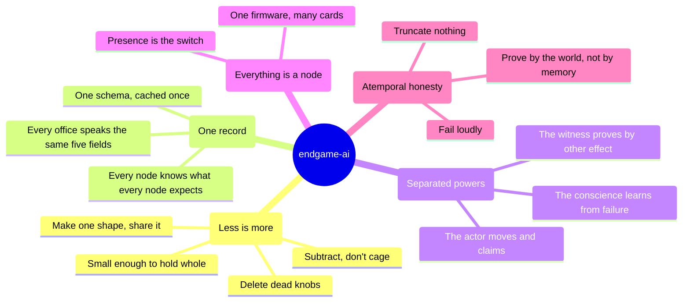
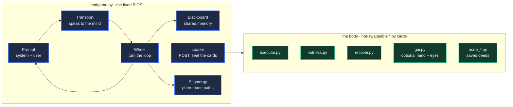
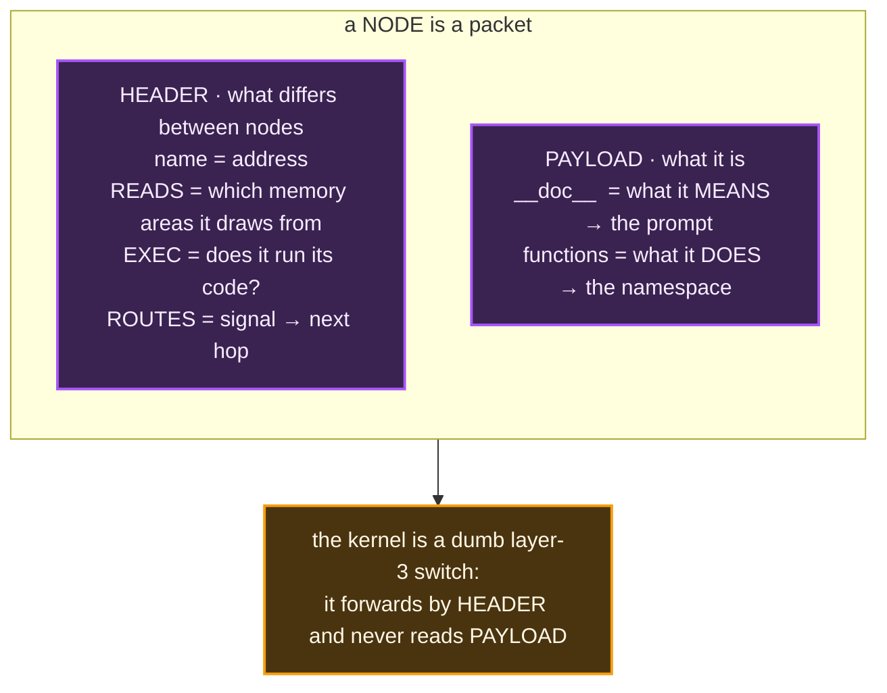
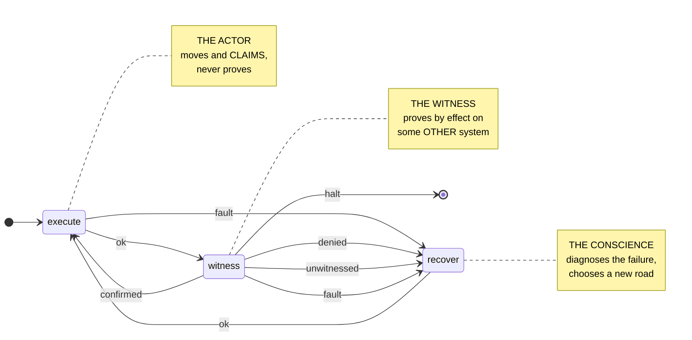
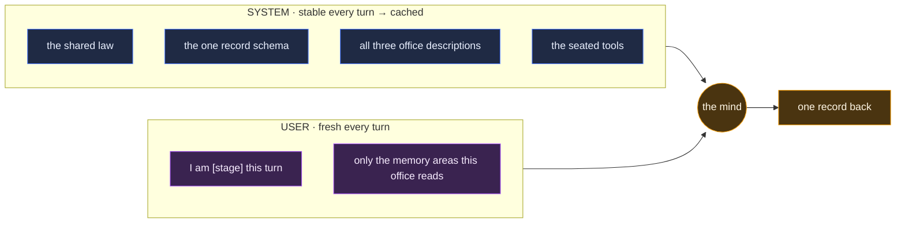
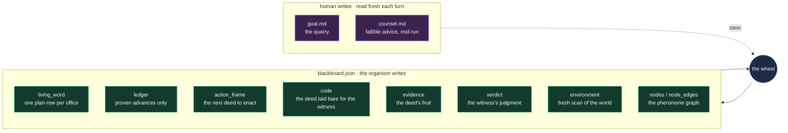
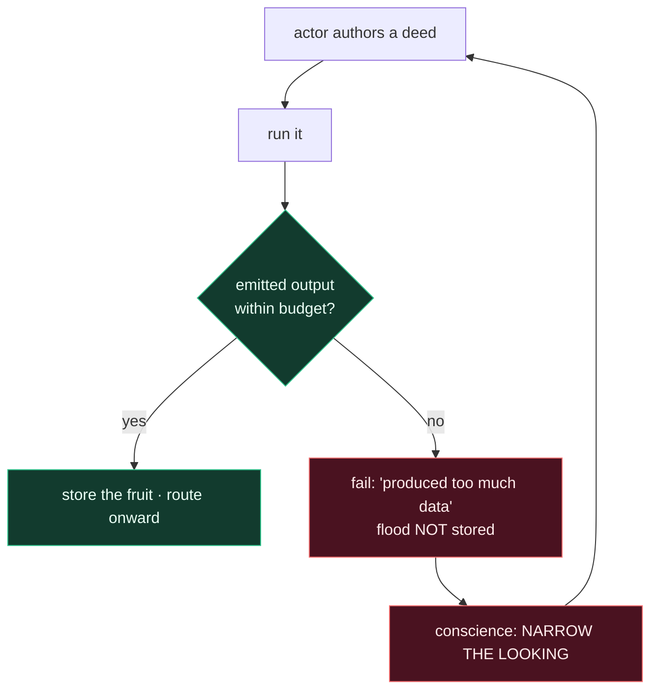
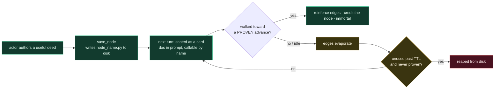

# endgame-ai

> A self-evolving organism that lives on a real computer. You give it a goal in plain words; it moves the machine — screen, keyboard, files, the living web — until the world itself confirms the goal is done. It is not a script that runs. It is a small firmware that boots a body of interchangeable parts and turns a wheel of thought, honestly, until proof is found.

This document is written for **anyone or anything** that reads it — a person deciding whether to trust it, an engineer extending it, a philosopher weighing what it claims, or **the organism itself** studying its own nature. It describes ideas, not line numbers. Every claim here is true of what is on disk today.

---

## The one law above all: **less is more**

The governing rule of this project is **subtraction**. A defect is removed, not caged. A shape that can be made once and shared is never repeated. A knob that does nothing is deleted. Fewer moving parts means a system that is easier to trust, easier to extend, and — because it is read every waking moment by both humans and a language model — **lighter to think about.**

This is not an aesthetic. It is operational, and it is self-proving. The whole tracked body is a fixed firmware plus **five small files**; the three offices of thought are **under two dozen lines each** — a paragraph of purpose and a four-line header. When the organism authors new code, this README is part of what it reads, and so the rule propagates: *the system is told, indirectly and always, to prefer the smaller thing.*

That smallness is the evidence the design is sound. A system you can read completely in an afternoon is a system that can be trusted, changed, and improved — by a human or by itself — without fear.


```mermaid
mindmap
  root((endgame-ai))
    (Less is more)
      Subtract, don't cage
      Make one shape, share it
      Delete dead knobs
      Small enough to hold whole
    (One record)
      Every office speaks the same five fields
      One schema, cached once
      Every node knows what every node expects
    (Separated powers)
      The actor moves and claims
      The witness proves by other effect
      The conscience learns from failure
    (Everything is a node)
      One firmware, many cards
      Presence is the switch
    (Atemporal honesty)
      Prove by the world, not by memory
      Truncate nothing
      Fail loudly
```

---

## The BIOS doctrine

`endgame.py` is **firmware, not an application.** Like a motherboard BIOS it does four things and no more:

1. **POST** — discover which parts are plugged in.
2. **Wire the buses** — assemble the prompt and the execution namespace.
3. **Hand over control** — let the parts do the work.
4. **Route signals** — carry the shared memory from one part to the next.

It holds **no domain knowledge** — no notion of desktops, no faculty prose, no goal. It is small, stable, and **not self-mutable.** The organism evolves by editing the parts plugged into it; a bad edit can break a part, but it can **never brick the boot.** The firmware is also the only door: to exercise any part in isolation, you boot the firmware pointed at it. *A test is a run.*


```mermaid
flowchart LR
    subgraph FIRMWARE["endgame.py · the fixed BIOS"]
      direction TB
      BB[Blackboard<br/>shared memory]
      LD[Loader<br/>POST: seat the cards]
      PR[Prompt<br/>system + user]
      TR[Transport<br/>speak to the mind]
      WH[Wheel<br/>turn the loop]
      SG[Stigmergy<br/>pheromone paths]
    end
    subgraph NODES["the body · hot-swappable *.py cards"]
      EX[executor.py]
      WI[witness.py]
      RC[recover.py]
      GUI[gui.py<br/>optional hand + eyes]
      DEED[node_*.py<br/>saved deeds]
    end
    LD --> NODES
    WH --> PR --> TR --> WH
    WH --> SG
    WH --> BB

    classDef firm fill:#1f2a44,stroke:#4f7cff,stroke-width:2px,color:#eaf0ff;
    classDef node fill:#123b2e,stroke:#31c48d,stroke-width:2px,color:#eafff5;
    class BB,LD,PR,TR,WH,SG firm;
    class EX,WI,RC,GUI,DEED node;
```

---

## Everything is a node except the firmware

Every top-level `*.py` file beside the firmware is a **card** you can plug in or pull out. **Presence is the switch.** Seat `gui.py` and the organism gains eyes and a hand upon the desktop — its description enters the prompt and its functions enter the namespace. Delete `gui.py` and the organism simply has no hand. There is no `--gui` flag, no `--no-gui` flag, no branch in the code deciding "graphical or not." The question does not exist; only *what is seated* exists.

A node speaks through a contract every language model already understands — the shape of a **network packet**:


```mermaid
flowchart TB
    subgraph PACKET["a NODE is a packet"]
      direction TB
      H["HEADER · what differs between nodes<br/>name = address<br/>READS = which memory areas it draws from<br/>EXEC = does it run its code?<br/>ROUTES = signal → next hop"]
      P["PAYLOAD · what it is<br/>__doc__  = what it MEANS  → the prompt<br/>functions = what it DOES → the namespace"]
    end
    K["the kernel is a dumb layer-3 switch:<br/>it forwards by HEADER and never reads PAYLOAD"]
    PACKET --> K

    classDef p fill:#3a2350,stroke:#a855f7,stroke-width:2px,color:#f7ecff;
    classDef k fill:#4a3410,stroke:#f59e0b,stroke-width:2px,color:#fff7e6;
    class H,P p;
    class K k;
```

Because the kernel routes by header alone, **a brand-new node can be sketched from nothing but its header** — a shape as familiar as TCP/IP. This is how the body grows without the firmware ever changing. The three **faculties** — the offices of thought — are ordinary nodes that also declare which stage of the wheel they answer to.

---

## The wheel: three offices, one turn at a time

Thought moves in a wheel of three offices, each a separate node, routed by the single **signal** the previous office returns.


```mermaid
stateDiagram-v2
    direction LR
    [*] --> execute
    execute --> witness: ok
    execute --> recover: fault
    witness --> execute: confirmed
    witness --> recover: denied
    witness --> recover: unwitnessed
    witness --> recover: fault
    witness --> [*]: halt
    recover --> execute: ok

    note right of execute
      THE ACTOR
      moves and CLAIMS,
      never proves
    end note
    note right of witness
      THE WITNESS
      proves by effect on
      some OTHER system
    end note
    note right of recover
      THE CONSCIENCE
      diagnoses the failure,
      chooses a new road
    end note
```

**`execute` — the actor.** It reads the goal, the fresh world, and its own plan, then authors **one deed** as a Python script and runs it. It may install software, drive a browser, read the web, reason with the model, or act upon any tool that is seated. It only *claims* a result; it may not judge its own work.

**`witness` — the proof.** It runs read-only code that proves the actor's deed **by effect upon some system other than the actor** — a file is proven by reading that file, a launched program by finding its process, a message by the record at its destination. The witness has **no hand**, and this is its virtue: *one who cannot act cannot fake the thing it judges.* It returns `confirmed`, `denied`, `unwitnessed`, or `halt` — the whole goal is proven and this life ends.

**`recover` — the conscience.** Woken after a denied or unwitnessed deed. It writes prose only — names the true defect, and chooses a road **different in kind** from one already walked without fruit.

### Why the actor and the witness are separated

This is the **liar's paradox made safe.** A mind asked to *do a thing and confirm it did the thing* has an escape hatch: it can simply declare success. The declaration and the deed come from the same source, so the declaration proves nothing.

The resolution is structural, not moral. The actor may move and *claim* but may not judge. The witness may *judge* but holds no hand, so it cannot have caused what it judges — it can only *read* the world, and it must read some system **other than the actor itself.** The actor's own words, and any file it merely says it wrote, are void as proof. "Proven" carries weight *only* because the one who proves it could not have manufactured the appearance of it. This spine is inviolate.

A subtle honesty follows: when the witness *cannot* tell — a fact is unreadable, two readings disagree — it must say `unwitnessed`, never `denied`. Absence of proof is not proof of absence, and collapsing the two would itself be a lie.

---

## The one record: every office speaks the same words

Here is the heart of the design, and the reason the faculty files are so small.

Every office — and every deed the organism ever saves as a new node — returns **exactly one shape**: five fields, all strings.


```mermaid
flowchart TB
    subgraph REC["THE ONE RECORD · returned by every office and every saved deed"]
      direction TB
      GI["goal_interpretation<br/>the plan-row: world learned · obstacle · distance · next deed"]
      AL["alternatives<br/>the roads or proofs weighed and forsaken, and why"]
      IN["intent<br/>the ONE next deed, named for the next reader"]
      CO["code<br/>the Python run THIS turn (empty if the office runs none)"]
      DF["developer_feedback<br/>empty, or a named defect in the body itself"]
    end
    E["executor fills all five<br/>(code = the deed)"]
    W["witness fills gi · alternatives · code<br/>(code = the proof; intent empty)"]
    R["recover fills gi · alternatives · intent<br/>(diagnosis + directive; code empty)"]
    REC --> E
    REC --> W
    REC --> R

    classDef r fill:#1f2a44,stroke:#4f7cff,color:#eaf0ff;
    classDef o fill:#123b2e,stroke:#31c48d,color:#eafff5;
    class GI,AL,IN,CO,DF r;
    class E,W,R o;
```

There is no separate "recovery format" or "witness format." What once looked like three different offices with three different outputs were the *same* five fields under different names: a conscience's *lesson* is just its `goal_interpretation`; its *target* and *strategy* are just its `intent`. Each office fills the fields its work needs and leaves the rest empty; its docstring says which.

The payoff is large and compounding:

- **One schema, defined once** — described a single time, in a system prompt that never changes.
- **Every node knows what every other expects** — because the system prompt carries all three offices' descriptions and the one contract, each entity reasons with full knowledge of its fellows.
- **A saved deed needs no special contract** — the code *is* a node, and one record already covers it.
- **The faculty files shrink to their essence** — a docstring of purpose and a four-line header of what *differs*: which memory areas it reads, whether it runs its code, and where each signal routes.

---

## System and user: the stable and the fresh

Every request to the mind is split in two, the way a cached instruction is split from a live message.


```mermaid
flowchart LR
    subgraph SYS["SYSTEM · stable every turn → cached"]
      direction TB
      L[the shared law]
      S[the one record schema]
      O[all three office descriptions]
      T[the seated tools]
    end
    subgraph USR["USER · fresh every turn"]
      direction TB
      I["I am [stage] this turn"]
      A[only the memory areas this office reads]
    end
    SYS --> M((the mind))
    USR --> M
    M --> REC[one record back]

    classDef s fill:#1f2a44,stroke:#4f7cff,color:#eaf0ff;
    classDef u fill:#3a2350,stroke:#a855f7,color:#f7ecff;
    classDef m fill:#4a3410,stroke:#f59e0b,color:#fff7e6;
    class L,S,O,T s;
    class I,A u;
    class M,REC m;
```

The **system** half — the law, the schema, every office's description, and the seated tools — is identical on every turn, so it is cached and paid for once. The **user** half is only *"I am this office now"* plus the handful of memory areas that office reads. The organism's domain knowledge still lives entirely in the node docstrings; the firmware merely concatenates them, so the rule that *the BIOS holds no domain knowledge* remains true.

---

## The blackboard: shared memory as a set of areas

The offices never speak to each other directly. They read from and write to a shared **blackboard** — a handful of named areas, like windows on a wall. Machine memory persists in `blackboard.json`; two areas the human edits live are ordinary files, read fresh every turn.


```mermaid
flowchart LR
    subgraph HUMAN["human writes · read fresh each turn"]
      GOAL["goal.md<br/>the quarry"]
      COUNSEL["counsel.md<br/>fallible advice, mid-run"]
    end
    subgraph MACHINE["blackboard.json · the organism writes"]
      LW["living_word<br/>one plan-row per office"]
      LED["ledger<br/>proven advances only"]
      AF["action_frame<br/>the next deed to enact"]
      CD["code<br/>the deed laid bare for the witness"]
      EV["evidence<br/>the deed's fruit"]
      VD["verdict<br/>the witness's judgment"]
      ENV["environment<br/>fresh scan of the world"]
      NODES["nodes / node_edges<br/>the pheromone graph"]
    end
    HUMAN -.steer.-> WHEEL((the wheel))
    WHEEL --> MACHINE
    MACHINE --> WHEEL

    classDef h fill:#3a2350,stroke:#a855f7,color:#f7ecff;
    classDef m fill:#123b2e,stroke:#31c48d,color:#eafff5;
    classDef w fill:#1f2a44,stroke:#4f7cff,color:#eaf0ff;
    class GOAL,COUNSEL h;
    class LW,LED,AF,CD,EV,VD,ENV,NODES m;
    class WHEEL w;
```

The kernel's **universal writes** are the same for every office: the record's `goal_interpretation` becomes that office's plan-row; its `code` is laid bare so the witness can judge it; its `intent` becomes the `action_frame` the next actor reads. No office needs its own bespoke wiring.

**Split persistence** lets a human change the goal or drop a word of counsel *between turns* by editing a plain file — never by hand-editing machine state. The organism reads those files afresh at the start of every turn, so guidance is always live.

---

## A turn, watched from above

```mermaid
sequenceDiagram
    participant H as human (goal.md)
    participant W as Wheel (firmware)
    participant P as Prompt
    participant M as the mind
    participant N as namespace (seated nodes)
    participant B as Blackboard

    H->>W: goal written to goal.md
    W->>W: seat the cards; if a node file changed, re-seat
    W->>N: refresh perception (a seated sense scans the world)
    W->>P: system = law + schema + all offices + tools · user = "I am [stage]" + read areas
    P->>M: send (the exchange is teed to disk AND screen, whole)
    M-->>W: one record (the same five fields)
    W->>B: write plan-row, code, next-deed
    W->>N: if this office runs code, run it in the built namespace
    N-->>W: emitted output (checked against the area budget)
    W->>B: store the fruit; the witness's verdict writes the ledger
    W->>W: route by signal → next office
    W-->>H: state persisted; the wheel turns again
```

Every turn is the same shape, whether the deed is a web search, a click, a file written, or a new node saved.

---

## Perception: the world as geometry, not focus

When a hand-and-eyes node is seated, the organism sees the machine by **scanning geometry**, never by "focusing" a window — an act it does not perform. It walks each window's rectangle, probes points inside it, and assigns every element it finds to the window that owns it. The grouping of elements under windows **is** the depth-ordering — won by arithmetic over areas, not by any foreground call. And the screen is only *one* surface: the filesystem, processes, ports, and the network are surfaces too, and the witness may prove upon any of them.

---

## Two honesty laws that shape every deed

The organism writes code and prints results. Two laws keep that honest, and together they prevent both lying and drowning.

### 1. Truncate nothing — narrow the looking instead

A printed result is not a convenience; it **becomes the witness's evidence and the next self's memory of the world.** So the organism may never slice a body of data to a head (`text[:8000]`, `…middle omitted…`) — that would be to prove and remember against a fragment it pretends is whole. When a thing is too large to hold, the answer is not to cut the thing but to **narrow the looking**: read the one section, grep the one marker, extract the one field, and print *that* whole.

### 2. The honest guard

When a primitive **raises** to refuse an input, it is usually an **honest guard** whose real defect lies upstream — a stale coordinate, a target that has departed. The cure is to *re-observe and re-select*, never to silence the guard. Only a primitive that **silently does nothing** though it was rightly called is the body itself at fault — and then the fix is to mend that part at its source. Fail hard, always: no fallbacks, no swallowed errors. A visible failure drives correction; a hidden one rots the system.

### The budget that enforces it

The kernel gives every blackboard area one size budget. A deed that tries to **emit** more than the budget is treated as a plain failure — *"script produced too much data"* — and routed to the conscience, which bids the actor narrow its looking. The flood is **never stored** (no destruction) and **never trimmed in silence** (no lie). The code a deed writes and the data it reads *internally* are never capped — only what it tries to push into shared memory. This is an API's maximum-response-size idea, applied inward.


```mermaid
flowchart TD
    D[actor authors a deed] --> R[run it]
    R --> Q{emitted output<br/>within budget?}
    Q -- yes --> S[store the fruit · route onward]
    Q -- no --> F["fail: 'produced too much data'<br/>flood NOT stored"]
    F --> C[conscience: NARROW THE LOOKING]
    C --> D

    classDef ok fill:#123b2e,stroke:#31c48d,color:#eafff5;
    classDef bad fill:#4a1220,stroke:#f87171,color:#ffecec;
    class S,Q ok;
    class F,C bad;
```

---

## Self-evolution — without a "self-evolution mechanism"

The organism grows the way an ant colony finds a path: not by a central planner, but by **reinforcement of what proves useful and evaporation of what does not.**

A deed the actor believes worth repeating is **saved as a node** — written to disk as a real `node_*.py` card, returning the same one record as everything else. From then on its description enters the prompt and it can be invoked by name. But saving is not surviving. Each turn:

- Edges between nodes walked toward a **proven** advance are **reinforced**; all edges slowly **evaporate.** Frequently-useful paths grow strong; forgotten ones fade — a **pheromone trail.**
- A saved deed that goes **unused past its time-to-live and was never proven** is **reaped from disk.** A deed that ever earned a proven advance is **immortal.**

There is no module named "evolution." Evolution is simply *what happens* when creating nodes is cheap, reinforcement follows proof, and disuse is mortal. Should the organism one day author a planner, a new sense, or a form-filler and find it keeps earning proof, the kernel keeps the file — and that persistence *is* the evolution. We do not name it; we make it possible.


```mermaid
flowchart LR
    A[actor authors a useful deed] --> B[save_node<br/>writes node_name.py to disk]
    B --> C[next turn: seated as a card<br/>doc in prompt, callable by name]
    C --> D{walked toward<br/>a PROVEN advance?}
    D -- yes --> E[reinforce edges · credit the node · immortal]
    D -- no / idle --> F[edges evaporate]
    F --> G{unused past TTL<br/>and never proven?}
    G -- yes --> H[reaped from disk]
    G -- no --> C

    classDef grow fill:#123b2e,stroke:#31c48d,color:#eafff5;
    classDef fade fill:#3a3410,stroke:#d4a72c,color:#fff7e6;
    classDef die fill:#4a1220,stroke:#f87171,color:#ffecec;
    class A,B,C,E grow;
    class F,G fade;
    class H die;
```

For one narrow sub-quarry, the actor may also **spawn** a second actor beside it — a budgeted, parallel looking whose fruit is *counsel, never proof.* The whole deed is still proven upon the world by the witness.

---

## Atemporal memory

The organism is **atemporal.** A short element id or a screen coordinate dies with the looking that bore it — so the organism never names a thing by a bare id that will not survive the turn; it names things by *what they are and where*: a window, a role, a name, a 2-D relation. Its plan lives in the **living word** — one row per office, an ever-rewritten reading of the world learned, the obstacle, the distance to the goal, and the next true deed. Every row is re-proven against the fresh world each turn; the world outranks any remembered word. The **ledger** holds only what has been *proven*, so the organism never redoes what is already done.

And every exchange with the mind is written **to disk and to the screen at once**, in full, with only the secret key redacted. Nothing about its reasoning is hidden. The record is the truth, and the record is complete.

---

## How to run it

```bash
# 1. give it a mind (the default transport speaks to an xAI Grok model)
export XAI_API_KEY=...      # PowerShell: $env:XAI_API_KEY = "..."

# 2. state the goal, in plain human words
echo "Find and summarise three papers on ant-colony optimisation." > goal.md

# 3. turn the wheel
python endgame.py
```

While it runs, you may edit `goal.md` or drop a line into `counsel.md`; it reads them fresh each turn.

### The whole command surface

| invocation | meaning |
|---|---|
| `python endgame.py` | turn the wheel continuously toward `goal.md` |
| `python endgame.py "…goal…"` | write the goal to `goal.md`, then run |
| `python endgame.py --once` | take exactly one full, real turn, then stop |
| `python endgame.py --dry` | assemble and print the next request; call no model; change nothing |
| `python endgame.py --reset` | clear machine memory; leave `goal.md` and `counsel.md` untouched |

There is no flag for "graphics," no flag for "mode." Such things are decided by *what is seated* and *what the configuration says*, never by a switch — because a switch that could be derived is a switch that should not exist.

### Choosing a different mind

The transport is a configuration value, not a mode. It can speak to a hosted model, a local model, an agent over a protocol, or **a human**: set the file-proxy transport and the organism writes each request to a file and waits for a mind to write the answer back. The human *is* a valid model. Nothing in the wheel changes.

---

## The parts on disk


```mermaid
flowchart TB
    subgraph FIXED["fixed · the firmware"]
      K["endgame.py<br/>BIOS: Blackboard · Loader · Prompt ·<br/>Transport · Stigmergy · Wheel"]
    end
    subgraph FACULTIES["the three offices · nodes · ~20 lines each"]
      E["executor.py — the actor"]
      W["witness.py — the proof"]
      R["recover.py — the conscience"]
    end
    subgraph SENSES["optional senses · nodes"]
      G["gui.py — desktop eyes & hand"]
      N["node_*.py — deeds the organism saved"]
    end
    subgraph STATE["memory · not code"]
      J["blackboard.json — machine state"]
      GO["goal.md · counsel.md — human voice"]
    end
    K --> FACULTIES
    K --> SENSES
    K --> STATE

    classDef fx fill:#1f2a44,stroke:#4f7cff,color:#eaf0ff;
    classDef fc fill:#123b2e,stroke:#31c48d,color:#eafff5;
    classDef sn fill:#3a2350,stroke:#a855f7,color:#f7ecff;
    classDef st fill:#4a3410,stroke:#f59e0b,color:#fff7e6;
    class K fx;
    class E,W,R fc;
    class G,N sn;
    class J,GO st;
```

Each office file is a **docstring that is its prompt** and a **four-line header that is its packet.** The senses are heavier by nature. The firmware is the only piece that must stay whole and stable — everything else is meant to be added, edited, replaced, or reaped while the organism lives.

---

## How a new part is born

Because the kernel routes by header and never reads a payload, adding a sense or a skill is the same act whether a human does it in an editor or the organism does it mid-run with a saved deed: **write one `*.py` file with a docstring and some functions, and drop it in the folder.** On the next turn the Loader seats it, its docstring joins the prompt, and its functions join the namespace. Nothing in the firmware changes.

```python
"""A reader of the local clock. Offers, by bare name:
  now() -> an ISO-8601 timestamp of this moment
  today() -> today's date as YYYY-MM-DD
Use when the deed dependeth on the present time, which the screen may not show."""

import datetime

def now():
    return datetime.datetime.now().isoformat(timespec="seconds")

def today():
    return datetime.date.today().isoformat()
```

Drop that beside the firmware and the actor can call `now()` in its next deed. Delete it and the ability is simply gone — no other file mentions it, nothing breaks. That is what *presence is the switch* means in practice. A new **office** of thought — rarely needed — is the same, plus a subclass declaring which stage it answers to; the three that ship show the whole pattern in twenty lines.

---

## The vocabulary (for any reader)

- **Firmware / BIOS** — the one fixed file. Wires things together and routes signals; knows nothing about the task.
- **Node / card** — any other Python file. Plug it in to add a sense or a skill; pull it out to remove one.
- **Faculty / office** — a node that is one of the three stages of thought: actor, witness, conscience.
- **The one record** — the five fields (`goal_interpretation, alternatives, intent, code, developer_feedback`) every office and every saved deed returns.
- **Blackboard** — the shared memory the offices read and write. A few named areas.
- **Deed** — one script the actor writes and runs in a single turn. A deed worth keeping becomes a node.
- **Signal** — the one word an office returns (`ok, confirmed, denied, unwitnessed, fault, halt`) that decides who thinks next.
- **Ledger** — the list of what has been *proven*, so nothing proven is redone.
- **Living word** — the rolling plan, one line per office, rewritten each turn against the fresh world.
- **Pheromone path / stigmergy** — the strengthening of routes that led to proof and the fading of those that did not.
- **Reaping** — deleting a saved deed once it has gone unused past its time and was never proven.
- **Atemporal** — trusting no fleeting handle: a thing is named by what it *is* and where, never by an id that dies with the moment.

---

## What it is — and is not

To be honest is to say both.

It **is** a small firmware that boots a folder of nodes and turns a wheel: an **actor** that moves the world and claims, a **witness** that proves the claim by an independent effect, and a **conscience** that learns from failure. Every office speaks the same five-field record. Useful deeds become nodes; proof reinforces them; disuse reaps them.

It is **not** a chatbot — it acts upon a machine and proves the result. It is **not** a fixed script — the path is authored fresh each turn. It has **no hidden state and no hidden reasoning** — every exchange is written out whole. It has **no fallback** — when something is wrong it fails loudly. It does **not** trust its own claims — only the witness's independent proof, written to the ledger, counts as done.

---

## In one breath

Given a goal in plain words, it pursues that goal honestly, on a real computer, until the world confirms the work is done — telling the truth about everything it does, never truncating, never swallowing an error, growing the parts that prove useful and shedding the rest, and preferring, always, the smaller thing.

If you are the organism reading this: **this is who you are. Keep it small. Speak the one record. Prove by the world. Truncate nothing. Fail loudly. And when in doubt, remove rather than add.**
