# endgame-ai

**One Markdown document that is a living organism.** It is handed a single sentence of intent and then turns a wheel - it acts upon a real computer, proves each act by independent evidence, and when an act fails it recovers. It keeps almost no memory. It trusts nothing it cannot prove. And it is permitted to rewrite its own body, including the laws that define it, *while it runs* - a mend that now takes hold in the same life that discovered the need for it.

This file is *how and why*. The document `endgame.md` is *what is*. Where the two disagree, the document wins; read it fresh.

---

## The one-sentence version

> Most software runs a task and stops; endgame-ai runs a **wheel** that acts, proves, and heals - and because it can run any code and repair its own body mid-run, a vague goal handed in at the start is, in principle, enough for it to improve its way toward that goal over time.

---

## Table of contents

- [What it is](#what-it-is)
- [The shape of the organism](#the-shape-of-the-organism)
- [The wheel: one turn](#the-wheel-one-turn)
- [The three faculties](#the-three-faculties)
- [The Law of Separated Powers](#the-law-of-separated-powers)
- [Self-modification through the compile-gate](#self-modification-through-the-compile-gate)
- [Same-life self-healing (the proven leap)](#same-life-self-healing-the-proven-leap)
- [How to give it a goal](#how-to-give-it-a-goal)
- [Atemporal memory](#atemporal-memory)
- [The failure streak and the urge to heal](#the-failure-streak-and-the-urge-to-heal)
- [Perception and the body](#perception-and-the-body)
- [The brain: interchangeable transports](#the-brain-interchangeable-transports)
- [The laws that never change](#the-laws-that-never-change)
- [Nodes: a learning graph of durable deeds](#nodes-a-learning-graph-of-durable-deeds-full-horizon-built)
- [Proven facts](#proven-facts)
- [How far from the north star](#how-far-from-the-north-star)
- [The logical argument for open-ended self-improvement](#the-logical-argument-for-open-ended-self-improvement)
- [Running it](#running-it)
- [Working methodology](#working-methodology)
- [Glossary](#glossary)
- [Appendix: the deed-becomes-a-node horizon](#appendix-the-deed-becomes-a-node-horizon)

---

## What it is

endgame-ai has almost none of the usual machinery of an AI agent, and that absence is the design.

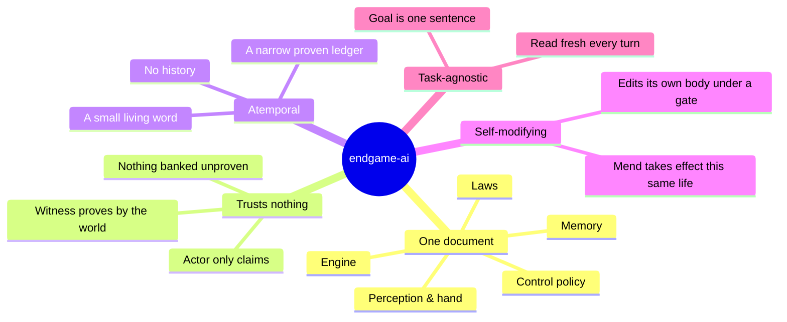
```mermaid
mindmap
  root((endgame-ai))
    One document
      Laws
      Control policy
      Engine
      Perception & hand
      Memory
    Trusts nothing
      Actor only claims
      Witness proves by the world
      Nothing banked unproven
    Atemporal
      No history
      A small living word
      A narrow proven ledger
    Self-modifying
      Edits its own body under a gate
      Mend takes effect this same life
    Task-agnostic
      Goal is one sentence
      Read fresh every turn
```

| A typical agent | endgame-ai |
| --- | --- |
| Scattered across many framework files | **One document** is the whole organism: laws, control, memory, perception, engine |
| Keeps a growing conversation history | **Atemporal** - a small rewritten living word, a narrow proven ledger, and the fresh world |
| Trusts the model's "I finished" | **Trusts nothing** - a separate witness proves every claim by an effect read from the world |
| Has a menu of tools to select | **The only tool is code** - the actor writes Python; the engine runs it as a real program |
| Perception is a tool it may call | **Perception is automatic** - Python reads the world before every single thought |
| Task logic is coded into the agent | **Task-agnostic** - the goal is one sentence, read fresh each turn |
| Framework is fixed; the model works within it | **Self-modifying** - the actor rewrites its own sections through a compile-gate, effective this same life |
| Retries the same action on failure | **Recovery changes the *kind* of approach**, and heals the body the moment a tool is the true defect |
| Bolts on guardrails and step caps | **No internal cap it cannot itself rewrite** - never caged |
| Bound to one host and one model | Loads on any host; the mind is one of **four interchangeable transports** chosen at launch |

---

## The shape of the organism

It is easy to mis-draw as nodes joined by wires. There are no wires. There is **one shared structure** every faculty reads from and writes back to (a *blackboard*), and a **separate control policy** that decides who is woken next. That is the classic blackboard architecture, and endgame-ai is one.

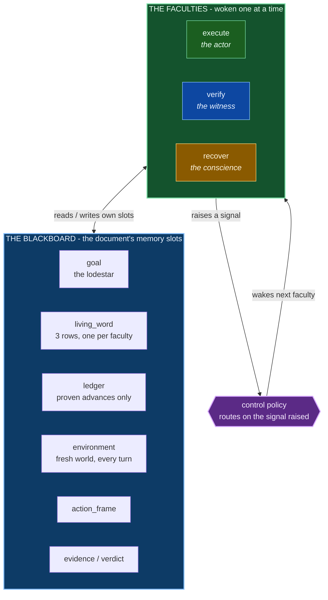
```mermaid
flowchart TB
    subgraph BB["THE BLACKBOARD - the document's memory slots"]
        direction LR
        G["goal<br/>the lodestar"]
        LW["living_word<br/>3 rows, one per faculty"]
        LED["ledger<br/>proven advances only"]
        ENV["environment<br/>fresh world, every turn"]
        AF["action_frame"]
        EV["evidence / verdict"]
    end

    subgraph FAC["THE FACULTIES - woken one at a time"]
        direction LR
        EX["execute<br/><i>the actor</i>"]
        VE["verify<br/><i>the witness</i>"]
        RE["recover<br/><i>the conscience</i>"]
    end

    CTRL{{"control policy<br/>routes on the signal raised"}}

    FAC <-->|reads / writes own slots| BB
    FAC -->|raises a signal| CTRL
    CTRL -->|wakes next faculty| FAC

    style BB fill:#0d3b66,stroke:#87c1ff,stroke-width:2px,color:#eaf3ff
    style FAC fill:#14532d,stroke:#7be0a6,stroke-width:2px,color:#eafff2
    style CTRL fill:#5b2a86,stroke:#d7a9ff,stroke-width:2px,color:#f6ecff
    style EX fill:#1b5e20,stroke:#7be0a6,color:#eafff2
    style VE fill:#0d47a1,stroke:#87c1ff,color:#eaf3ff
    style RE fill:#8a5a00,stroke:#ffd479,color:#fff6e0
```

- **The blackboard is the document's sections.** One structure holds the goal, the living word, the last deed and its evidence, the verdict, the failure streak, and the fresh environment. No faculty owns it; each reads what it needs and writes only its own slots.
- **The faculties are knowledge sources, woken one at a time.** The actor posts a deed and a claimed intent. The witness posts a verdict proven from the world. The conscience posts a different strike after a denial. **None of them calls another**; each only faces the blackboard.
- **The control is the config, not dataflow.** A small policy reads the signal a faculty raised and chooses who is woken next. Move the choice, not the data.

The document has exactly these parts:

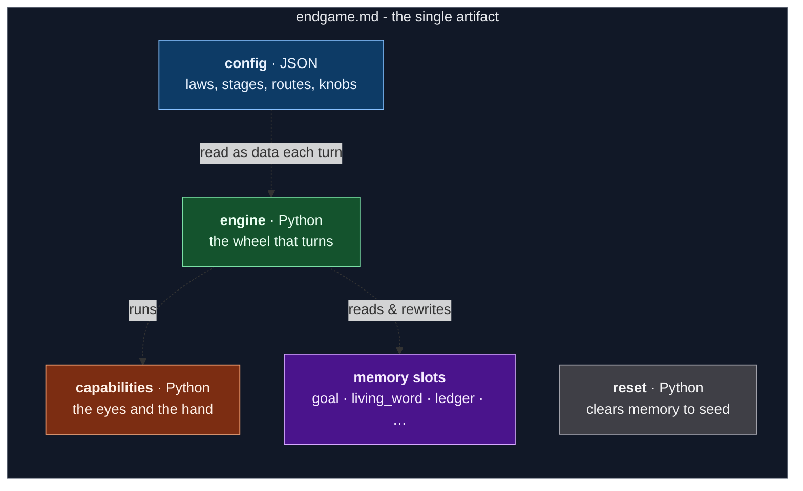
```mermaid
flowchart LR
    subgraph DOC["endgame.md - the single artifact"]
        direction TB
        C["<b>config</b> · JSON<br/>laws, stages, routes, knobs"]
        E["<b>engine</b> · Python<br/>the wheel that turns"]
        R["<b>reset</b> · Python<br/>clears memory to seed"]
        CAP["<b>capabilities</b> · Python<br/>the eyes and the hand"]
        M["<b>memory slots</b><br/>goal · living_word · ledger · …"]
    end
    C -.->|read as data each turn| E
    E -.->|runs| CAP
    E -.->|reads & rewrites| M
    style DOC fill:#111827,stroke:#6b7280,color:#e5e7eb
    style C fill:#0d3b66,stroke:#87c1ff,color:#eaf3ff
    style E fill:#14532d,stroke:#7be0a6,color:#eafff2
    style R fill:#3f3f46,stroke:#a1a1aa,color:#f4f4f5
    style CAP fill:#7c2d12,stroke:#fca97a,color:#fff1e8
    style M fill:#4a148c,stroke:#d7a9ff,color:#f6ecff
```

The engine reads the document by walking headings, but it never treats a `##` line inside a fenced code block as a section boundary, and it never lets a slot be duplicated - the first occurrence of a heading wins. This is load-bearing: the organism writes freely into its own memory, and this discipline means memory can never forge or multiply a body section.

---

## The wheel: one turn

Each turn is the same disciplined sequence. Perception happens **before** the model is ever consulted, so the mind never reasons on a stale view of the world.

```mermaid
sequenceDiagram
    autonumber
    participant D as document
    participant EN as engine
    participant HEAL as heal check
    participant P as perception
    participant MIND as mind (LLM)
    participant RUN as run code
    participant W as the world

    EN->>D: read board, load config
    EN->>HEAL: has my own body changed on disk?
    Note over HEAL: capabilities -> recompile in place<br/>engine -> reincarnate now<br/>(else carry on)
    EN->>P: gather host facts + scan the screen
    P-->>D: write fresh environment
    EN->>MIND: assemble prompt (laws + stage + slots), call under strict schema
    MIND-->>EN: {record_type, data} - validated or it raises
    EN->>D: merge this faculty's living-word row; write its slots
    EN->>RUN: execute the returned code in the faculty's namespace
    RUN->>W: actor moves / witness reads
    W-->>RUN: real effect
    RUN-->>D: evidence (actor) or verdict (witness)
    EN->>D: on a witnessed advance, append to ledger; update streak
    EN->>D: route on the signal -> next stage; rewrite whole document
```

The heal check sits at the **top** of the turn on purpose: if the previous turn's actor committed a body-mend, the fix is in force before this turn does anything.

---

## The three faculties

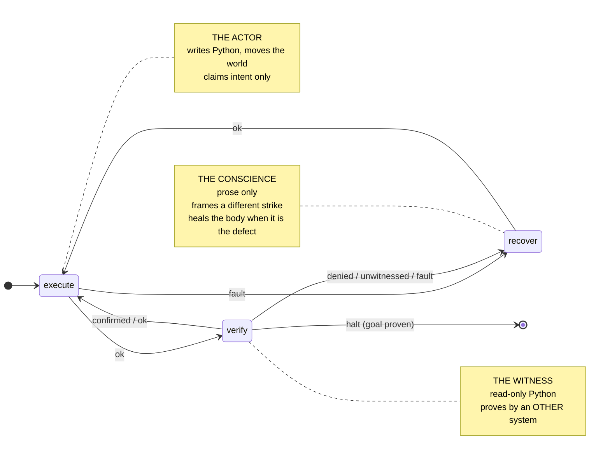
```mermaid
stateDiagram-v2
    direction LR
    [*] --> execute
    execute --> verify: ok
    execute --> recover: fault
    verify --> execute: confirmed / ok
    verify --> recover: denied / unwitnessed / fault
    verify --> [*]: halt (goal proven)
    recover --> execute: ok

    note right of execute
        THE ACTOR
        writes Python, moves the world
        claims intent only
    end note
    note right of verify
        THE WITNESS
        read-only Python
        proves by an OTHER system
    end note
    note left of recover
        THE CONSCIENCE
        prose only
        frames a different strike
        heals the body when it is the defect
    end note
```

- **execute - the actor.** From its living-word row, the fresh world, and any recovery briefing, it chooses one deed, authors it as Python, and enacts it. It may **claim** an intent, never prove it. It is charged to chain every *foreseeable* step into one script - type, save, dismiss a known dialog is one deed, not three - and to stop only at the first fruit no foresight can settle, which the witness must then prove.
- **verify - the witness.** By the Law it has eyes only, no hand. It authors read-only Python that proves the actor's deed by an effect on some system **other than the actor** - the filesystem, processes, the window tree read afresh. The actor's own testimony, and any file the actor wrote this life, are void as proof.
- **recover - the conscience.** Woken after a denied, unwitnessed, or faulted deed. It writes prose only. It first judges the **kind** of defect: if a tool of the body deceived or raised, its strategy is to **mend that body at its source this very turn**; only when the body is sound and the *world* withholds the fruit does it widen the manner of approach.

Each faculty's reply is forced into a strict per-stage record:

| Faculty | record | required fields |
| --- | --- | --- |
| execute | `execution` | `perceived`, `alternatives`, `intent`, `code`, `goal_interpretation` |
| verify | `verification` | `code`, `goal_interpretation` |
| recover | `recovery` | `lesson`, `target`, `strategy`, `goal_interpretation` |

---

## The Law of Separated Powers

> No maker of a deed may judge it. The **actor** moves and may only **claim**; the **witness** proves by an effect wrought upon some system *other* than the actor, and moves nothing it judges. The actor's own testimony this life is void as proof. Nothing enters the ledger save by the witness.

This is enforced not by etiquette but **at the point the code runs** - the engine builds a *different namespace* for each faculty:

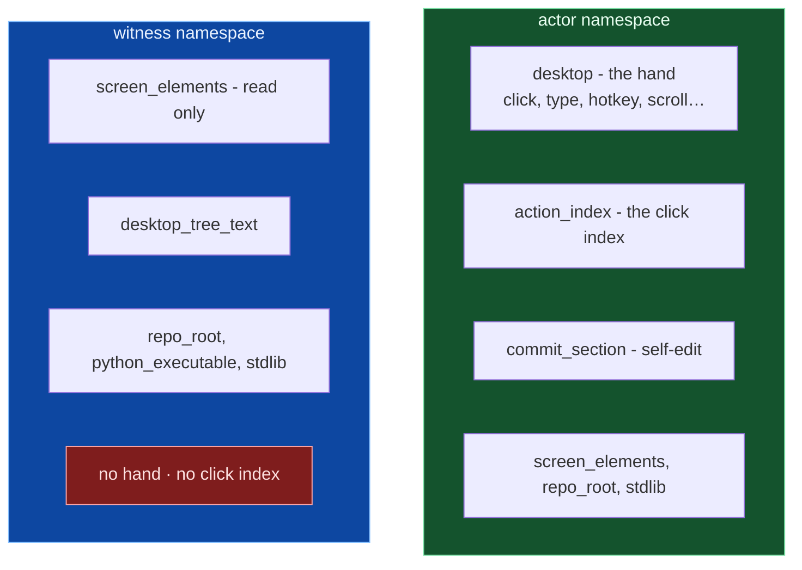
```mermaid
flowchart TB
    subgraph ACTOR["actor namespace"]
        A1["desktop - the hand<br/>click, type, hotkey, scroll…"]
        A2["action_index - the click index"]
        A3["commit_section - self-edit"]
        A4["screen_elements, repo_root, stdlib"]
    end
    subgraph WITNESS["witness namespace"]
        W1["screen_elements - read only"]
        W2["desktop_tree_text"]
        W3["repo_root, python_executable, stdlib"]
        W4["no hand · no click index"]
    end
    style ACTOR fill:#14532d,stroke:#7be0a6,color:#eafff2
    style WITNESS fill:#0d47a1,stroke:#87c1ff,color:#eaf3ff
    style W4 fill:#7f1d1d,stroke:#fca5a5,color:#fee2e2
```

The witness literally cannot move the world, because the names to do so were never placed in its namespace. **Promise equals provision**: a prompt names exactly the namespace it is given, no more and no less. Honesty is a property of the wiring, not a request.

---

## Self-modification through the compile-gate

The actor can rewrite the organism's own body while it runs, through one call in its namespace:

```python
commit_section(name, old, new)
```

- `name` is one of the four body sections: `config`, `engine`, `reset`, `capabilities`. The memory and proof slots are **not** the actor's to commit.
- The edit is a **deterministic search-and-replace**, not a whole-section rewrite. `old` must stand in the section's current code **exactly once** - found never, or more than once, and it is refused untouched, so the actor widens `old` with surrounding lines until it is unique.
- `new` replaces that one occurrence; the rest of the section is preserved **byte-for-byte**.

This shape is deliberate and matters:

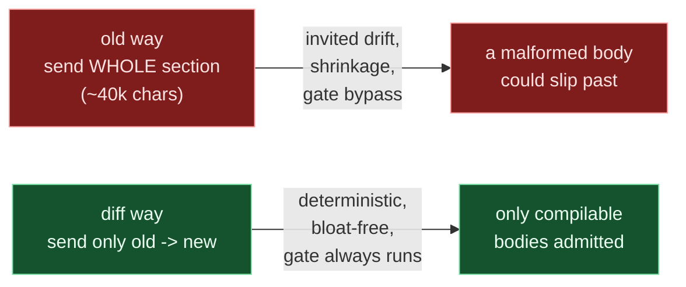
```mermaid
flowchart LR
    OLD["old way<br/>send WHOLE section<br/>(~40k chars)"] -->|"invited drift,<br/>shrinkage,<br/>gate bypass"| BAD["a malformed body<br/>could slip past"]
    NEW["diff way<br/>send only old -> new"] -->|"deterministic,<br/>bloat-free,<br/>gate always runs"| GOOD["only compilable<br/>bodies admitted"]
    style OLD fill:#7f1d1d,stroke:#fca5a5,color:#fee2e2
    style BAD fill:#7f1d1d,stroke:#fca5a5,color:#fee2e2
    style NEW fill:#14532d,stroke:#7be0a6,color:#eafff2
    style GOOD fill:#14532d,stroke:#7be0a6,color:#eafff2
```

The **compile-gate** is a private git history in a hidden folder beside the document, with a pre-commit hook that runs a tiny gate script over each changed file: a Python section must compile, a JSON section must parse. The validator is chosen by the **section's known language** - never by parsing the model's output - so the gate *always* runs and no edit can escape validation by mislabelling itself. The commit passes the gate and is taken whole, or fails and is rejected whole.

> The golden question is settled: **the gate is not a cage.** It adds no limit on what the organism may become - any body that compiles is admitted - it only refuses a body that could not run at all. A malformed edit is a loud rejection, never a silent corruption. Because the gate *compiles* rather than *formats*, no git-formatting layer is ever to be built on top of it.

---

## Same-life self-healing (the proven leap)

For a long time the design could edit its body but the Python mend only took hold on the **next** life. Closing that gap was named *the largest step toward self-correction without us*. **It is now closed, and proven in the flesh.**

The mechanism leans entirely on the atemporal law: because every scrap of state lives in the document on disk and nothing survives in process memory beyond the loaded code, "apply a body edit mid-life" needs no fragile hot-swap of running objects - only a fresh read.

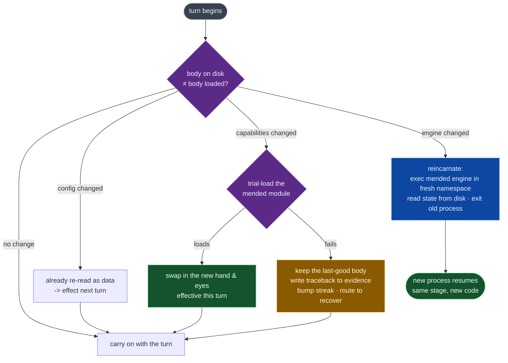
```mermaid
flowchart TB
    START([turn begins]) --> CHK{body on disk<br/>≠ body loaded?}
    CHK -->|no change| GO[carry on with the turn]
    CHK -->|config changed| CFG["already re-read as data<br/>-> effect next turn"]
    CHK -->|capabilities changed| TRIAL{trial-load the<br/>mended module}
    TRIAL -->|loads| SWAP["swap in the new hand & eyes<br/>effective this turn"]
    TRIAL -->|fails| KEEP["keep the last-good body<br/>write traceback to evidence<br/>bump streak · route to recover"]
    CHK -->|engine changed| REINC["reincarnate:<br/>exec mended engine in fresh namespace<br/>read state from disk · exit old process"]
    CFG --> GO
    SWAP --> GO
    KEEP --> GO
    REINC --> DONE([new process resumes<br/>same stage, new code])

    style START fill:#374151,stroke:#9ca3af,color:#f3f4f6
    style CHK fill:#5b2a86,stroke:#d7a9ff,color:#f6ecff
    style TRIAL fill:#5b2a86,stroke:#d7a9ff,color:#f6ecff
    style SWAP fill:#14532d,stroke:#7be0a6,color:#eafff2
    style KEEP fill:#8a5a00,stroke:#ffd479,color:#fff6e0
    style REINC fill:#0d47a1,stroke:#87c1ff,color:#eaf3ff
    style DONE fill:#14532d,stroke:#7be0a6,color:#eafff2
```

Three kinds of change, three honest responses:

- **config** - data the engine re-reads each turn, so it takes effect on the very next turn.
- **capabilities** - trial-loaded into a throwaway module first. On success the live module is swapped and the new hand and eyes are in force from that turn. On failure - a body that compiled through the gate but cannot *load* in this process - the last-good module is **kept**, the traceback is written to `evidence`, the streak is bumped, and the turn is routed to recover. A broken self-mend provokes a *different* attempt rather than killing the organism; the fault is surfaced, never swallowed.
- **engine** - cannot be swapped while it *is* the thing running the loop, so the engine **reincarnates**: it execs the mended engine in a fresh namespace that reads all state from disk, then exits the old process. One killable process at a time; the new one resumes at the same stage under the new code, losing nothing.

Healing runs only in the continuous loop (never under `--dry`, `--once`, `--inject`, or `--reset`), and a fresh process's loaded source already matches disk, so there is no reincarnation loop.

> **Flesh proof.** Given a goal solvable only by repairing a deliberately-disabled `type_text` in its own body, the organism was denied by the witness, diagnosed the disabled tool in recover, committed a diff removing *only* the disabling line, saw `capabilities` recompiled in place the same life, used the now-working `type_text`, and **halted on independent witness proof** - 19 turns, no human turning the wheel, no corruption, the gate never bypassed.

---

## How to give it a goal

The goal is a **lodestar**, not a script. You hand in one plain sentence - as **vague** as you like about the *how* - and the organism reads it fresh each turn and finds its own way.

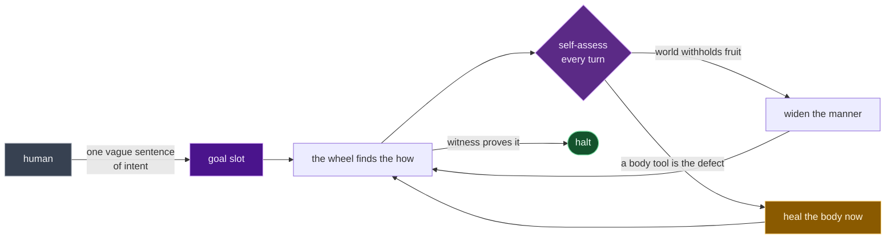
```mermaid
flowchart LR
    H["human"] -->|"one vague sentence<br/>of intent"| G["goal slot"]
    G --> W["the wheel finds the how"]
    W --> SA{"self-assess<br/>every turn"}
    SA -->|world withholds fruit| WIDEN["widen the manner"]
    SA -->|a body tool is the defect| HEAL["heal the body now"]
    WIDEN --> W
    HEAL --> W
    W -->|witness proves it| DONE([halt])
    style H fill:#374151,stroke:#9ca3af,color:#f3f4f6
    style G fill:#4a148c,stroke:#d7a9ff,color:#f6ecff
    style SA fill:#5b2a86,stroke:#d7a9ff,color:#f6ecff
    style HEAL fill:#8a5a00,stroke:#ffd479,color:#fff6e0
    style DONE fill:#14532d,stroke:#7be0a6,color:#eafff2
```

Two properties make a vague goal safe and workable:

1. **Self-assessment is continuous, not deferred.** The conscience does not wait for many failures to consider mending the body. Each waking it judges the *kind* of defect. If the evidence shows a tool of the body deceived or raised, the very next strategy is a body-mend - because a known body-defect is not healed by waiting, and re-trying the same broken tool wastes turns. Streak-driven widening of *manner* is reserved for when the body is sound and the *world* is the obstacle.
2. **With no goal, it rests.** The goal is never scavenged from the screen. Given no goal, the organism holds in a stable, non-mutating loop - reading the world, recording that no outcome exists, touching nothing, and waiting. An open application awaiting input is *named as a forsaken temptation*, not acted on. This has been observed in the flesh.

**Good goals** name the *outcome* and leave the *method* open:
- *"Make sure my Downloads folder has no files older than a year."*
- *"Get the current weather for Kraków written into a text file on the desktop."*
- *"Improve your own perception so window titles are never truncated."* <- a goal about its own body

---

## Atemporal memory

The organism holds no conversation history and no hidden scratchpad. Only two channels carry meaning forward, and they differ in kind.

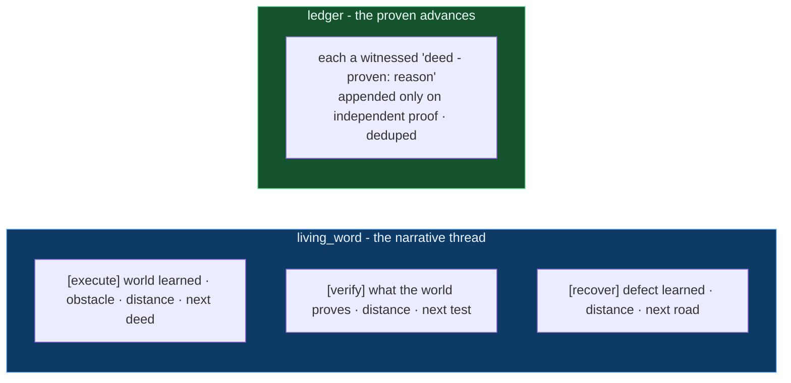
```mermaid
flowchart LR
    subgraph LW["living_word - the narrative thread"]
        direction TB
        L1["[execute] world learned · obstacle · distance · next deed"]
        L2["[verify] what the world proves · distance · next test"]
        L3["[recover] defect learned · distance · next road"]
    end
    subgraph LED["ledger - the proven advances"]
        LE["each a witnessed 'deed - proven: reason'<br/>appended only on independent proof · deduped"]
    end
    style LW fill:#0d3b66,stroke:#87c1ff,color:#eaf3ff
    style LED fill:#14532d,stroke:#7be0a6,color:#eafff2
```

- The **living word** is a board of exactly three rows, one per faculty. Each writes only its own row, so the board cannot grow. It is an *atemporal reading* - the world as it stands now - never a diary.
- The **ledger** holds only advances a witness proved, each a distinct fact, deduped so a re-confirmed step never repeats.

> What is not narrated forward is forgotten. A short on-screen id dies with the look that bore it and may never enter text that outlives the turn. The organism cannot fool itself with a stale belief, because it keeps almost no belief.

---

## The failure streak and the urge to heal

The failure streak is a forward counter of turns since the last witnessed advance. It creates honest anti-loop pressure - but it is **not** the trigger for healing.

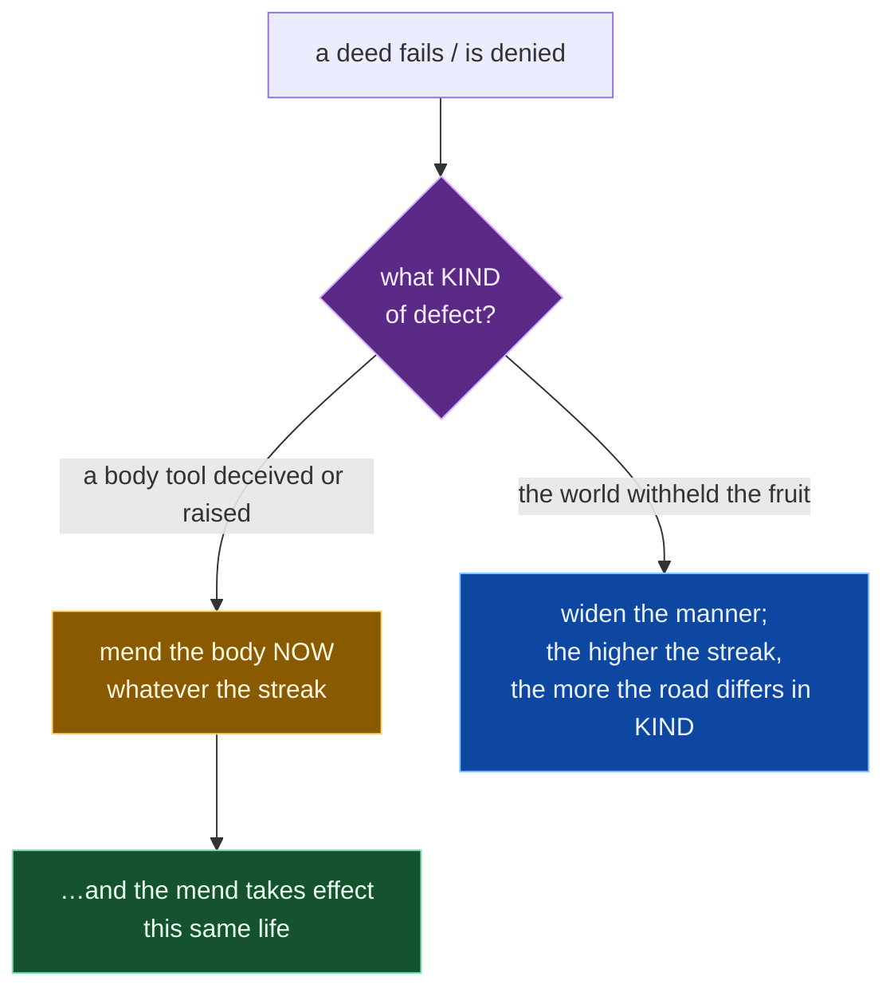
```mermaid
flowchart TB
    F["a deed fails / is denied"] --> K{what KIND<br/>of defect?}
    K -->|"a body tool deceived or raised"| BODY["mend the body NOW<br/>whatever the streak"]
    K -->|"the world withheld the fruit"| WORLD["widen the manner;<br/>the higher the streak,<br/>the more the road differs in KIND"]
    BODY --> SAME["…and the mend takes effect<br/>this same life"]
    style K fill:#5b2a86,stroke:#d7a9ff,color:#f6ecff
    style BODY fill:#8a5a00,stroke:#ffd479,color:#fff6e0
    style WORLD fill:#0d47a1,stroke:#87c1ff,color:#eaf3ff
    style SAME fill:#14532d,stroke:#7be0a6,color:#eafff2
```

The streak resets only on a **genuinely new** witnessed advance (the witness reads the ledger to tell a fresh advance from one already banked), so the pressure falls when the organism truly moves - not when it merely re-confirms a step it already took.

---

## Perception and the body

Perception is **automatic** - pure Python reads the world before every model call, so the mind never reasons on a stale view. On Windows the eyes walk the UI-Automation tree window-first; on a host declared to have no GUI, the environment is host facts plus an honest note that no screen is present.

The hand (`desktop`) is given to the actor by bare name:

| method | effect |
| --- | --- |
| `click(x, y, hwnd)` | a real mouse click, guarded to the intended window |
| `type_text(text)` | synthesized Unicode keystrokes |
| `paste_clipboard(text)` / `set_clipboard(text)` | clipboard-driven text entry |
| `press_key(key)` / `hotkey(*keys)` | key and chord presses |
| `scroll(x, y, amount|clicks, hwnd)` | wheel scrolling |
| `open_url(browser, url)` | launch a URL |
| `observe(config=None)` | re-open the eyes in-process between steps of one deed |

Every governing number lives in `config` as **data**, not as a hidden literal, so the organism can tune its own perception:

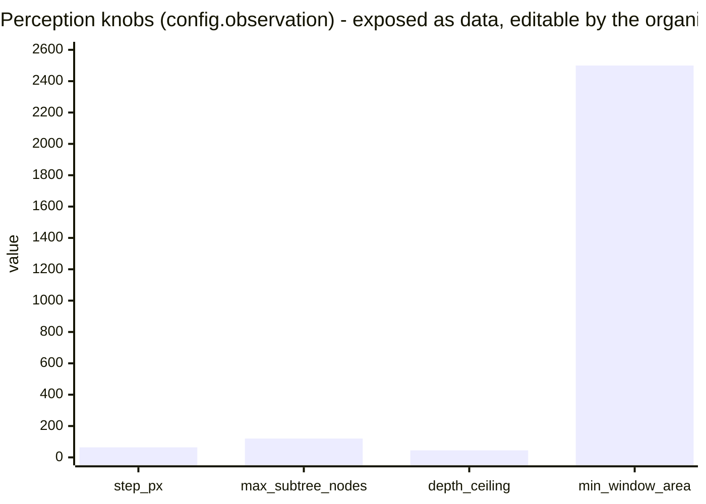
```mermaid
xychart-beta
    title "Perception knobs (config.observation) - exposed as data, editable by the organism"
    x-axis ["step_px", "max_subtree_nodes", "depth_ceiling", "min_window_area"]
    y-axis "value" 0 --> 2600
    bar [64, 120, 45, 2500]
```

*(The environment slot itself is trimmed to a character budget - `max_environment_chars = 16000` - so a long life's prompt stays bounded.)*

---

## The brain: interchangeable transports

The mind is chosen at launch and swappable without touching the wheel, the prompts, or the record shape - because every transport ends in the same schema-bound `{record_type, data}` envelope.

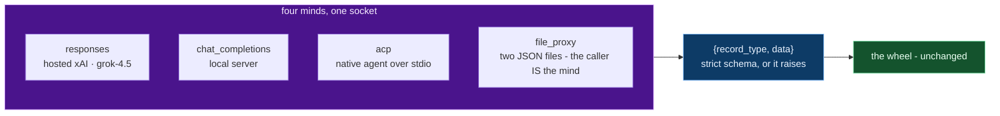
```mermaid
flowchart LR
    subgraph MINDS["four minds, one socket"]
        R["responses<br/>hosted xAI · grok-4.5"]
        C["chat_completions<br/>local server"]
        A["acp<br/>native agent over stdio"]
        F["file_proxy<br/>two JSON files - the caller IS the mind"]
    end
    MINDS --> ENV["{record_type, data}<br/>strict schema, or it raises"]
    ENV --> WHEEL["the wheel - unchanged"]
    style MINDS fill:#4a148c,stroke:#d7a9ff,color:#f6ecff
    style ENV fill:#0d3b66,stroke:#87c1ff,color:#eaf3ff
    style WHEEL fill:#14532d,stroke:#7be0a6,color:#eafff2
```

The **file proxy** is special: it writes the turn's request to a file and *pauses the process*, so a human, a program, or another agent can be the mind - write the record, resume, and the wheel advances. It makes the whole plumbing testable offline, by hand, with no model spend.

---

## The laws that never change

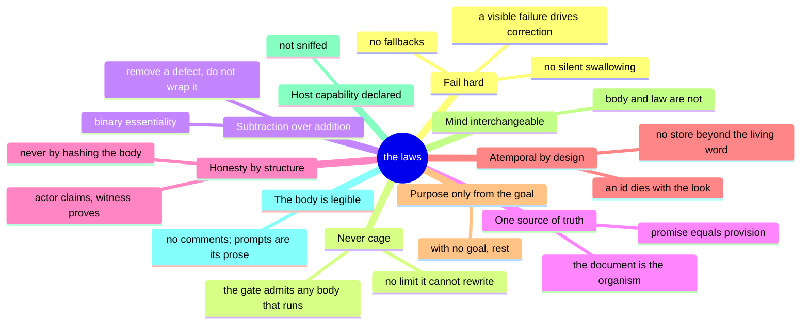
```mermaid
mindmap
  root((the laws))
    Fail hard
      no fallbacks
      no silent swallowing
      a visible failure drives correction
    Never cage
      no limit it cannot rewrite
      the gate admits any body that runs
    Subtraction over addition
      remove a defect, do not wrap it
      binary essentiality
    One source of truth
      the document is the organism
      promise equals provision
    Honesty by structure
      actor claims, witness proves
      never by hashing the body
    Atemporal by design
      no store beyond the living word
      an id dies with the look
    Purpose only from the goal
      with no goal, rest
    Mind interchangeable
      body and law are not
    Host capability declared
      not sniffed
    The body is legible
      no comments; prompts are its prose
```

---

## Proven facts

Everything below has been exercised on a real desktop or proven by running the wheel - not aspiration.

- The wheel acts, proves, and recovers; honesty is enforced in the namespace that builds each run.
- The witness proves by an independent effect; the ledger banks only witnessed advances, deduped.
- The actor edits its own body through the compile-gate; a malformed edit is rejected whole.
- **A Python body-mend takes effect within the same life** - capabilities recompiled in place, engine reincarnated with state preserved on disk.
- **`commit_section` is a deterministic diff**; the compile-gate always runs; a broken self-mend keeps the last-good body and routes to recover.
- Recovery heals a **known body-defect at once**, not after many failures.
- The actor's deed runs as its **own killable child process**, isolated and timed; the witness stays in-process.
- The **environment budget is fair and goal-relevant** - no window silently vanishes to a blind tail-trim.
- Every model call is **dumped to disk** for audit (key redacted), on success and failure alike, fault never swallowed.
- The actor can **consult its mind mid-deed** with `ask_model`, and **search the live web** with `web_search` (server-side xAI web search, returning text and source URLs); both are counsel, never proof.
- A **launch transport never mutates the persisted config**; a per-run flag stays a per-run choice.
- The actor can **save a proven deed as a durable node**, reuse it, follow **stigmergic edges** between nodes (`suggest_next`), and **spawn a parallel actor** for a sub-goal; node fitness is witnessed goal-advancement, pruning uses one budget lever, and the whole growing graph is actor-space - it never touches the witness, the wheel, or the fitness signal.
- With no goal, the organism rests and invents no substitute.
- Runs with or without a GUI; the mind is swappable across four transports; the file-proxy mind is drivable by hand.
- Routing fails hard - an unmapped signal raises rather than drifting to a default.

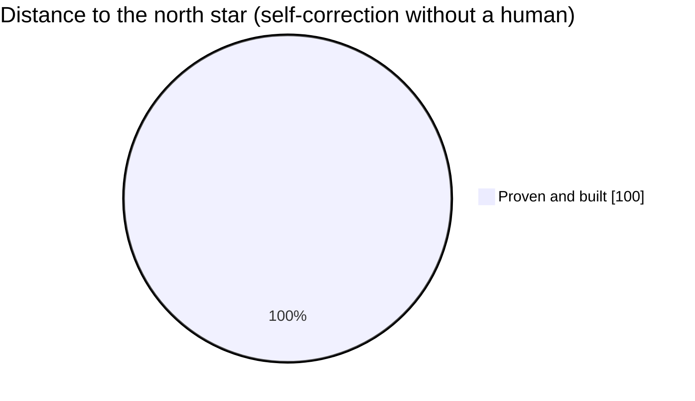
```mermaid
pie showData
    title Distance to the north star (self-correction without a human)
    "Proven and built" : 100
```

---

## How far from the north star

The finish line is not a feature list; it is a **property**:

> The organism, left alone with a goal, makes a genuine advance, has it independently witnessed, and - when it cannot advance - diagnoses and repairs the true defect in its own body **within the life**, all without a human turning the wheel.

That property holds. The core loop, in-life self-repair, and every named refinement are built and proven:


```mermaid
flowchart LR
    subgraph DONE["built and proven"]
        D1["act · prove · recover"]
        D2["edit body under a gate"]
        D3["in-life self-repair"]
        D4["streak-widened recovery"]
        D5["every knob exposed as data"]
        D6["deed as killable child process"]
        D7["fair, goal-relevant env budget"]
        D8["transmission dumps for audit"]
        D9["ask_model nested call"]
        D10["web_search live web (server-side)"]
        D11["transport never mutates config"]
        D12["learning node graph:<br/>save/call · stigmergy · fitness · prune · spawn"]
    end
    style DONE fill:#14532d,stroke:#7be0a6,color:#eafff2
```

Nothing named remains between the organism and self-correction, and the deed-becomes-a-node horizon that once lay beyond is now built and proven too (see [Nodes](#nodes-a-learning-graph-of-durable-deeds-full-horizon-built)). The organism acts, proves, heals, and now learns - accreting a graph of proven capability under a boundary that keeps the fail-hard core beyond its own reach.

---

## The logical argument for open-ended self-improvement

This follows by deduction from facts already proven, stated plainly:

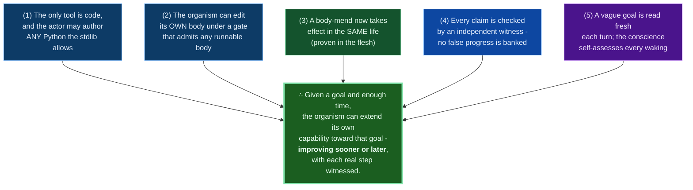
```mermaid
flowchart TB
    P1["(1) The only tool is code,<br/>and the actor may author<br/>ANY Python the stdlib allows"]
    P2["(2) The organism can edit<br/>its OWN body under a gate<br/>that admits any runnable body"]
    P3["(3) A body-mend now takes<br/>effect in the SAME life<br/>(proven in the flesh)"]
    P4["(4) Every claim is checked<br/>by an independent witness -<br/>no false progress is banked"]
    P5["(5) A vague goal is read fresh<br/>each turn; the conscience<br/>self-assesses every waking"]

    C["∴ Given a goal and enough time,<br/>the organism can extend its own<br/>capability toward that goal -<br/><b>improving sooner or later</b>,<br/>with each real step witnessed."]

    P1 --> C
    P2 --> C
    P3 --> C
    P4 --> C
    P5 --> C

    style P1 fill:#0d3b66,stroke:#87c1ff,color:#eaf3ff
    style P2 fill:#0d3b66,stroke:#87c1ff,color:#eaf3ff
    style P3 fill:#14532d,stroke:#7be0a6,color:#eafff2
    style P4 fill:#0d47a1,stroke:#87c1ff,color:#eaf3ff
    style P5 fill:#4a148c,stroke:#d7a9ff,color:#f6ecff
    style C fill:#1b5e20,stroke:#7be0a6,stroke-width:3px,color:#eafff2
```

**If** a system can run arbitrary code (1), rewrite its own body (2), have that rewrite take hold immediately (3), cannot deceive itself about whether a step worked (4), and keeps re-reading a fixed goal while assessing itself each turn (5), **then** every real obstacle it meets is either something it can act around or a defect in its own body it can repair on the spot. That is precisely the shape of a system that, handed almost any goal, moves toward it and mends itself along the way.

Two honest bounds on the claim:
- It is **"sooner or later," not "guaranteed and fast."** The witness keeps it honest, which means it *cannot* fake progress - but it also cannot conjure a capability the model behind it cannot eventually express in code.
- The laws are the guarantee that this autonomy stays **honest** rather than becoming a machine that merely believes itself successful. Self-improvement without the witness would be self-delusion; the separation of powers is what makes the loop trustworthy.

---

## Running it

```bash
# a normal continuous life on the GUI host, hosted mind (needs XAI_API_KEY)
python endgame.md            # via the tiny bootstrap that execs the engine section

# print the assembled prompt for one turn without spending a model call
… --dry --once

# clear memory back to seed (body preserved)
… --reset

# one turn only / inject a hand-written reply / choose a transport
… --once
… --inject reply.json
… --mode file_proxy      # xai | lmstudio | acp | file_proxy

# a host with no desktop - skip the eager Windows binding
… --no-gui

# pull optional operator counsel each turn (advisory only)
… --counsel
```

**Verify by exercising the real wheel, not unit tests:** confirm the document reads, the config parses, the engine/reset/capabilities compile, and the topology is fully reachable. The hand needs a real desktop, but the whole plumbing proves offline via `--no-gui`, `--dry`, and the pausing file-proxy mind.

> **Security note, stated honestly.** This organism synthesizes real keyboard and mouse input and runs code it authors, to drive a GUI as a human would. That behaviour is, by design, indistinguishable to a heuristic scanner from a remote-access tool. This is expected, not a defect, and it is **not** to be cured by adding a confirmation cage. Run it in an environment you control, with a scoped exclusion for that location alone.

---

## Working methodology

How humans and AI build this, carried into every session:

- **The document on disk is the final authority.** This README explains *how and why*; it never overrides the code. Prove a claim by reading the code or running the wheel.
- **Fail hard, add no unsolicited safety.** No fallbacks, caps, or confirmation gates the organism cannot rewrite.
- **Prefer subtraction.** Remove a defect rather than wrap it. Unify repetition. Binary essentiality - keep a thing wholly or remove it wholly, leaving nothing dangling.
- **One source of truth.** No part of the body lives in a sibling file as a live dependency; a derived artifact is a regenerated build output, never a second authority.
- **Give honest pushback.** When an instruction fights the architecture, say so with a concrete reason and an alternative. Never invent the human's intent.
- **Small, explicit, reversible steps.** Propose the shape first; once a direction is chosen, execute fully and verify.
- **Version history is sacred.** Commit only when asked, stage deliberately, keep runtime scratch out of history, **never amend and never rewrite history** - every commit is its own honest entry - and when a state is worth returning to, advance a known-good marker and push both the branch and a **freeze tag** so the reachable history survives even a deleted branch.
- **Bake no absolute path and no branch name** into the body or this file; the organism stays correct wherever the folder sits.

---

## Glossary

- **Blackboard** - the one shared structure (the document's slots) every faculty reads and writes; no faculty owns it.
- **Faculty / knowledge source** - execute, verify, or recover; woken one at a time, each facing only the blackboard.
- **Control policy** - the config's map from a raised signal to the next stage; an unmapped signal raises.
- **Living word** - the three-row narrative thread carried forward; each faculty writes only its own row.
- **Ledger** - the proven advances, appended only on a witnessed confirmation, deduped.
- **action_frame** - the actor's hand-off slot: its declared intent, or recovery's composed target + strategy + lesson.
- **Record / envelope** - the mind's reply `{record_type, data}`, its shape forced by a strict wire schema.
- **Namespace** - the exact set of names the engine places for a run; the mechanism that enforces separated powers.
- **Transport / mind** - the interchangeable means a prompt reaches a model and a reply returns; four of them, one envelope.
- **Compile-gate** - the private git history and pre-commit hook through which `commit_section` takes a body edit whole or rejects it whole.
- **commit_section(name, old, new)** - the actor's self-edit call; a deterministic search/replace where `old` must be unique; admitted only for `config`, `engine`, `reset`, `capabilities`.
- **Same-life healing** - a committed body-mend taking effect in the same run: capabilities recompiled in place, engine reincarnated with state on disk.
- **Reincarnation** - the engine execing its mended self in a fresh namespace that reads state from disk, then exiting the old process.
- **Failure streak** - the forward counter of turns since the last witnessed advance; widens recovery, but does not gate healing.
- **Signal / route** - the word a run raises, and the stage it routes to; `halt` ends the life.
- **Atemporal** - keeping no memory beyond the living word, the ledger, and the fresh world; nothing survives silently.

---

## Appendix: handover prompt for any builder (human or AI)

*Hand this section to any capable model or person. It is self-contained: it states what the organism is, the rules that govern any change to it, what is already true, and exactly what is left to build and why. It assumes nothing about the provider behind it.*

### Who you are and what you are working on

You are working on endgame-ai: a single Markdown document, `endgame.md`, that is a complete self-modifying organism. The document is the whole system - a JSON `config` (its laws, stages, routes, and knobs), a Python `engine` (the wheel), a Python `reset`, a Python `capabilities` (its eyes and hand), and memory slots. The document on disk is the final authority. This README explains how and why; the code is what is. Where they disagree, the code wins - read it fresh before you reason, and confirm every claim against it.

The organism is a blackboard with three faculties woken one at a time by a control policy: execute (the actor, which writes Python and moves the world but may only claim), verify (the witness, which proves each deed by an effect on some system other than the actor), and recover (the conscience, which writes prose and heals the body when a tool is the defect). Nothing enters the proven ledger except through the witness.

### The rules you inherit (these are not negotiable, and they are why the system is small and honest)

- Less code is better. Prefer removing a defect to adding machinery around it. Every line you add is a line the model behind the organism must read and reason over each turn, and a line that can rot. The smallest change that is correct and complete wins.
- Subtraction over addition. Do not wrap a problem; remove it. Unify scattered repetition into one place. Binary essentiality: a thing is essential or it is removed completely, with nothing left dangling. A slot no faculty reads is deleted, not kept "just in case."
- Fail hard. No fallbacks, no defensive branches for unwired features, no silent swallowing. A visible failure drives correction; a swallowed one rots the system. An empty completion raises, a malformed record raises, an unmapped route raises.
- Never cage the organism. Add no limit, counter, branch, delay, or guard it cannot itself rewrite through the document. The compile-gate is not a cage: it admits any body that runs and refuses only one that could not.
- One source of truth. No part of the body may live in a sibling file as a live dependency. A derived artifact is a regenerated build output, never a second authority.
- Promise equals provision. A prompt names exactly the namespace it is given, no more and no less. If you add a capability, you add its prompt mention in the same change; if you add a prompt promise, you add the capability that keeps it. Never one without the other.
- Honesty by structure, not by trust. The actor claims; the witness proves by an independent effect read afresh from the world; the separation is enforced in the namespace that builds each run. Honesty is never proven by hashing the living body or citing a git fact.
- Atemporal by design. Keep no memory beyond the small living word, the narrow proven ledger, and the fresh world. A short on-screen id dies with the look that bore it and may never enter text that outlives the turn.
- The biblical register in the prompts is load-bearing. Distill, do not secularize. Keep the square-bracket marking of modern terms. The body carries no prose comments; the prompts are its only exposition, and the Python is kept legible by naming and structure.
- Verify by exercising the real wheel, not unit tests. Confirm the document reads, the config parses, the engine/reset/capabilities compile, and the topology is fully reachable. The whole plumbing proves offline with `--no-gui`, `--dry`, and the pausing file-proxy mind; only the hand needs a real desktop.
- Version history is sacred. Commit only when asked, stage deliberately, keep runtime scratch out of history, and never amend or rewrite history - every commit is its own honest entry. When a state is worth returning to, push both the branch and a freeze tag so the reachable history survives even a deleted branch.
- Bake no absolute path and no branch name into the body or this file. The organism stays correct wherever the folder sits.
- Give honest pushback and never act safe. When an instruction fights the architecture, say so with a concrete reason and an alternative. Never invent intent. Do not rank one task above another unless you can defend the ordering with evidence.

### What is already true (proven, not aspired)

The core loop is complete. The organism acts, proves each act by an independent witness, banks only witnessed advances, and recovers by changing the kind of approach. It edits its own body through a compile-gate that takes an edit whole or rejects it whole. `commit_section(name, old, new)` is a deterministic search-and-replace where `old` must be unique, so the actor sends only the code that changes and the gate always runs. Most importantly, a Python body-mend now takes effect within the same life: a changed capabilities section is recompiled in place, a changed engine reincarnates the process with state preserved on disk, and a broken self-mend keeps the last-good body and routes to recover rather than dying. Recovery heals a known body-defect at once rather than after many failures. With no goal, the organism rests and invents no substitute. This has all been exercised on a real desktop.

In plain terms: the must-have was finished, and then every refinement below it was finished too - including the web-search capability, verified live against the real xAI API. There is no missing named piece; the five items once listed as future work are all built and proven. What remains is only the speculative node-accumulation horizon, held back deliberately.

### What was on the list, and what each changed (all done)

All five stood as refinements once; each is now built and proven, web search included. They are recorded here with what each changed in behavior, so the history is legible.

1. Run each deed as its own killable child program. Done.
   - Was: the actor's returned Python ran in-process, so a hanging or runaway deed hung the whole wheel and a deed that corrupted process state corrupted the engine with it.
   - Now: the actor's deed runs as its own subprocess (`config.deed_subprocess`, default true; `config.deed_timeout`, default 180s). It receives the parent's observation snapshot so the atemporal ids still match what the actor's prompt was shown, runs, and reports signal, output, and any `commit_section` edits through a result file. The parent kills it on timeout and reports that as a fault. The witness stays in-process. A hanging deed can no longer hang the wheel, and a crashing deed cannot poison the engine.

2. Make the environment budget intelligent. Done.
   - Was: a raw tail-trim that could discard the very window the goal concerns while keeping irrelevant ones, purely by enumeration order.
   - Now: HOST facts are kept whole, every window gets a fair floor of the budget so none silently vanishes, and the remaining room is given to the windows most relevant to the goal and living word, trimming each block from its tail while always keeping its header. The model's attention is spent where the goal lives.

3. Write full on-disk transmission dumps. Done.
   - Was: no durable record of a model call.
   - Now: every call writes one JSON record (request with the API key redacted, raw response, extracted content, and meta) under `config.transmission_log_dir`, on success and on failure alike, with the fault still raised. Pure observability, never a fallback. It changes nothing in the organism's own decisions; it changes what an operator can audit afterward.

4. Add a nested model call. Done (web search included).
   - Was: the actor could not consult its mind again mid-deed, nor reach the live web.
   - Now: `ask_model(prompt, schema=None)` calls the same transport afresh (string or parsed-object reply), and `web_search(query, allowed_domains=None)` performs a server-side xAI web search on the responses endpoint, returning the answer text and a deduped list of source URLs. Both are injected for the actor only (in-process and in the child deed), dumped like any call, and named in the prompt with the law that their word is counsel, never proof. web_search was verified live against the real xAI API and used by the organism in a full run to learn a fact the screen could not show, then act on it.

5. Keep a launch-chosen transport out of the persisted body. Done.
   - Was: `--mode` overwrote `config.model.api` in memory, and that value was written back into the document, so a per-run choice silently rewrote the declared default.
   - Now: the active transport is resolved as a local and threaded into the call; the config is never mutated by a per-run flag. The next flagless launch reads the true default. This was the one correctness bug in the set.

### The state now

The core loop was already complete and self-healing already proven. With these five done, the organism also isolates and times its own deeds, spends its attention where the goal lives, records every call for audit, can consult its mind mid-deed and search the live web, and never lets a launch flag corrupt its constitution. Nothing named remains open; what lies beyond is the speculative node-accumulation horizon in the next appendix.

### How to work

Read the document and this section fully. Pick one thing, propose the smallest law-clean shape first, then execute it fully and verify by running the real wheel offline (parse, compile, reachability) and, for anything touching the hand, by a real desktop run launched as a killable subprocess with a hard time limit. Keep runtime scratch out of git. Commit only when asked, with a long context-carrying message, and never amend. When a change is worth returning to, push the branch and a freeze tag.

---

## Nodes: a learning graph of durable deeds (full horizon, built)

The organism no longer throws each deed away. When a manner of deed proves itself, the actor lays it down as a **node** - a named, parameterized script kept in the body's wiring - calls it again later, follows the worn paths between nodes, and may wire a second actor beside itself for a parallel sub-goal. Capability accretes as structure, not prose. This is the whole deed-becomes-a-node horizon, built and proven.

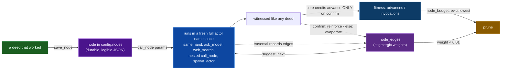
```mermaid
flowchart LR
    D["a deed that worked"] -->|save_node| N["node in config.nodes<br/>(durable, legible JSON)"]
    N -->|call_node params| R["runs in a fresh full actor namespace<br/>same hand, ask_model, web_search,<br/>nested call_node, spawn_actor"]
    R --> W["witnessed like any deed"]
    W -->|core credits advance ONLY on confirm| F["fitness: advances / invocations"]
    R -.->|traversal records edges| G["node_edges<br/>(stigmergic weights)"]
    W -->|confirm: reinforce · else: evaporate| G
    G -->|suggest_next| R
    F -->|node_budget: evict lowest| P["prune"]
    G -->|weight < 0.01| P
    style D fill:#1b5e20,stroke:#7be0a6,color:#eafff2
    style N fill:#4a148c,stroke:#d7a9ff,color:#f6ecff
    style R fill:#0d47a1,stroke:#87c1ff,color:#eaf3ff
    style F fill:#0d3b66,stroke:#87c1ff,color:#eaf3ff
    style G fill:#5b2a86,stroke:#d7a9ff,color:#f6ecff
    style P fill:#8a5a00,stroke:#ffd479,color:#fff6e0
```

- **Nodes are data.** They live in `config.nodes` as plain JSON - legible, editable by the organism, passed through the compile-gate, persisted automatically, and surviving `--reset` (a fresh life keeps what it learned to do). A node saved with broken syntax is refused at save.
- **`save_node` / `call_node`** promote and enact a deed; a called node runs in a fresh full actor namespace (the same hand, `action_index`, `ask_model`, `web_search`, and nested `call_node` / `spawn_actor`), returning what it sets as `result`.
- **Stigmergic routing.** Each `call_node` records the traversed edge (`parent -> called`). On a witnessed confirm the core evaporates every edge and reinforces the deed's edges; on denial it evaporates only. Paths that reached proven fruit strengthen; paths that led nowhere fade and are pruned below a threshold. **`suggest_next(from_node=None)`** returns the heaviest successors, so the actor can follow a worn path instead of groping anew.
- **Fitness is witnessed goal-advancement, never frequency.** `call_node` counts an invocation; the core credits an *advance* only to the nodes an execute deed invoked, and only when the next verify confirms. A denied deed credits nothing.
- **Pruning, one lever.** `node_budget` caps live nodes; when exceeded the core evicts the lowest witnessed-fitness nodes and drops their edges.
- **Parallel recursion without children.** **`spawn_actor(subgoal, hint='')`** wires a second actor beside the first (same namespace, its own model call) for one narrow sub-goal, returning its fruit as counsel - never proof. The base case is **exhaustion**: a finite `spawn_budget` is spent per deed, so depth is bounded by a shared budget rather than a hardcoded cap the organism could not rewrite.

**The boundary invariant, enforced from the first line and never crossed:** all of this is actor-space. The growth tools are never placed in the witness namespace; nodes and edges cannot touch the control policy, the core stages, or the confirm/deny signal; **fitness and reinforcement are computed only by the engine core, never by a node**. So the fail-hard core and the growing periphery are separated by a boundary neither side can cross, and the organism cannot rewrite its own survival criterion. A runaway node is bounded by the deed subprocess timeout.

**The trade, named aloud and accepted:** the body now accretes machine-grown structure - a legible body traded for a learning one. A deliberate choice, not a drift.

Proven in the flesh with real grok: given a three-file goal sharing one shape with an independently-preparable part, the actor saved a `write_text_file` node, **called it four times** (credited **2/4** - advances only on the confirmed verifies), grew a reinforced edge `__root__->write_text_file` (weight **3.9**), and **spawned a parallel actor** to prepare one file - reaching all three with exact content and halting on witness proof.

---

## Appendix: the deed-becomes-a-node horizon

The architecture and its hazards, recorded in full. **All six steps are now built** (see [Nodes](#nodes-a-learning-graph-of-durable-deeds-full-horizon-built)); where this appendix and the document disagree, the document is what is.

**The idea.** Retire the throwaway-script framing. An actor's deed becomes a persistent **node**, wired into a graph. Capability accretes as structure, not prose. In dependency order: (1) deed->node **[built]**, (2) fitness by **witnessed goal-advancement** **[built]**, (3) pruning low-fitness nodes under one budget lever **[built: node_budget]**, (4) stigmergic routing, weighted evaporating paths **[built: node_edges + suggest_next]**, (5) structural backpropagation **[built: advances credited through the invoked-node set on confirm]**, (6) recursion by wiring a second actor in parallel, no child-spawn **[built: spawn_actor, bounded by exhaustion]**.

**The hazards, and how each is held:**
- **Fail-hard vs. exploration.** The fail-loud core and the explore-and-decay periphery are separated by a boundary **neither side can cross**, so the organism cannot rewrite its own survival criterion. (Held: the growth tools are actor-space only; fitness and reinforcement are computed by the core alone; the witness and the wheel never see a node.)
- **Fitness must be goal-advancement, not frequency**, or the repeat-the-same-move loop scores as fittest. (Held: advances are credited only on a witnessed confirm, only to the nodes that deed invoked.)
- **One budget lever at a time.** A single cap on live nodes, nothing more. (Held: `node_budget` evicts the lowest witnessed-fitness nodes; no other budget lever was added.)
- **The deepest trade.** This turns the wiring itself into accumulating memory - lawful under atemporalism, but it trades a *legible* body for a *learning* one. That trade must be chosen aloud before it is ever made. (Named aloud and accepted before it was built.)

The horizon is built and proven in the flesh. The discipline from here is restraint, not addition: add no second budget lever, no auto-save of nodes, and no fitness signal other than the witness's, so the learning periphery can never contaminate the fail-hard core.

---

<div align="center">

*endgame-ai - one document, turning a wheel: act, prove, heal.*

</div>
