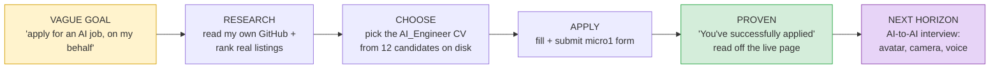
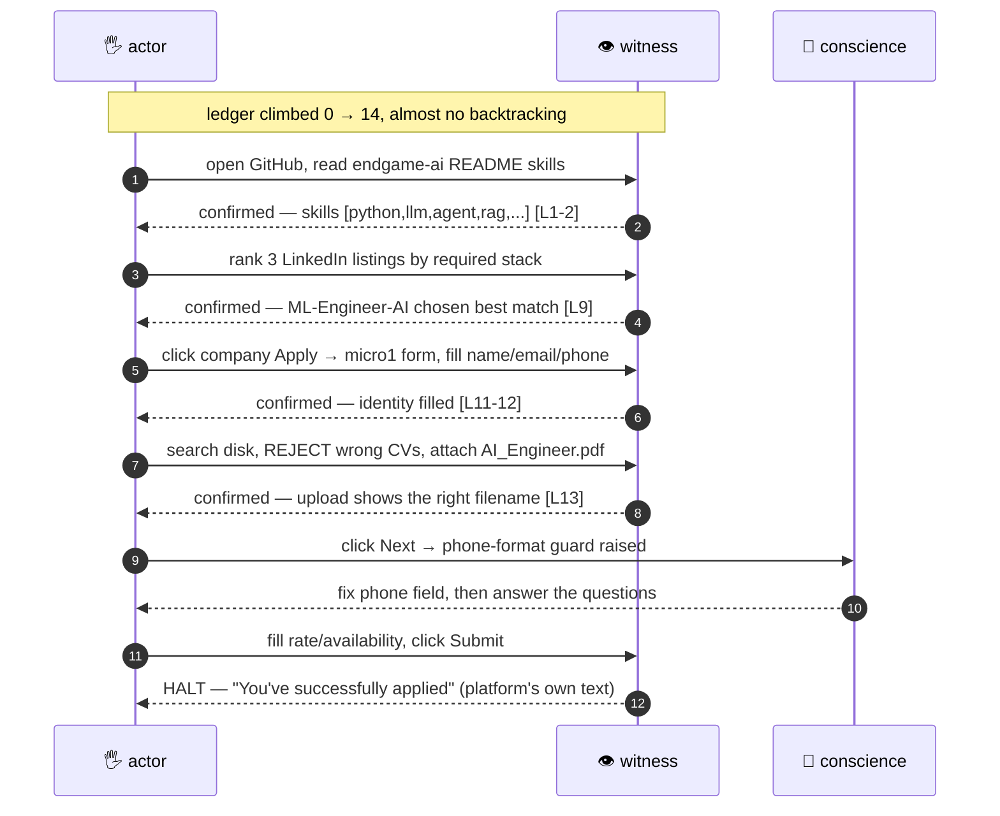
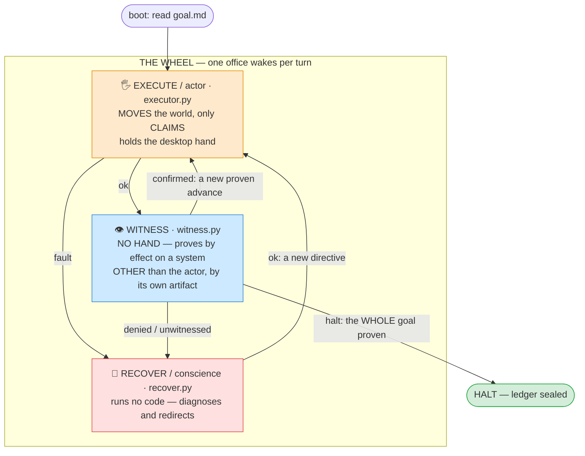
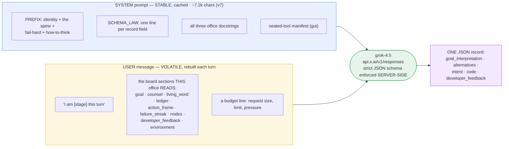
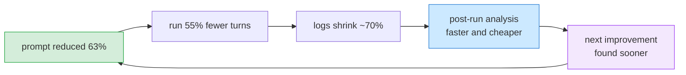
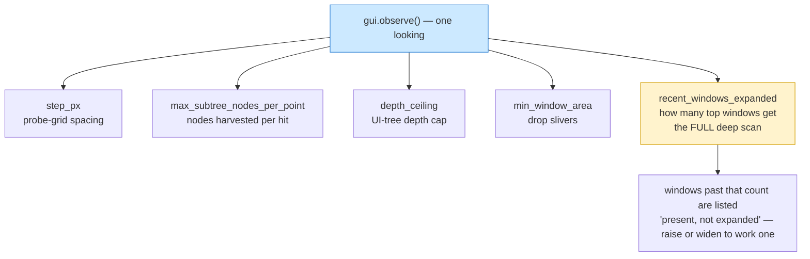
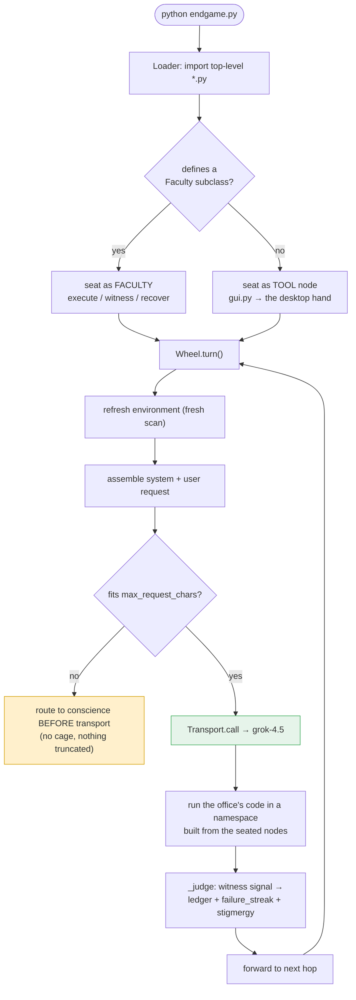

# endgame-ai — a self-modifying desktop organism that does real work and proves it

**Read this first. This file is written to you — the next endgame-ai, or the next human or AI who
picks this project up.** endgame-ai is a self-modifying LLM organism that takes real control of a
real Windows desktop — mouse, keyboard, browser, files — and does real work, proving it by **effect
on the world**, never by claiming. It has no planner and no task list. You give it ONE vague outcome;
it turns a tiny three-office wheel until an independent witness proves that outcome true against an
artifact the world itself produced.

It is **a few basic Python scripts.** The intelligence is not in clever code — it is in the *wiring*
between the scripts and the short docstrings that are their prompts. That is the whole thesis: give a
handful of beginner-level Python files the right separation of powers, and an unconstrained organism
emerges that acts freely yet **cannot lie to itself** about whether it succeeded.

> ⚠️ It acts as the human whose machine this is. Given no goal, it halts. It never invents work.

---

## 0. What it just did — from a vague goal to a submitted job application

This is the **exact goal** that was placed in `goal.md` (typos and all — including the "pply"):

> *use linkedin to apply for a remote job in cracow related to AI base on wgabrys88 github user
> endgame-ai project - which is you, you are the endgame-ai running and must complete and pply for the
> job on behalf of the linkedin account owner, use chrome to navigate and research web. Find the most
> compatible offer on linkedin with the skills the endgame-ai creator has to have since its created it
> and now it is on his behalf applying for a job*

No steps. No URLs. No CV path. No "how." Just an outcome. And the organism **did the job** — it
researched its own creator on GitHub, ranked real job listings, chose the most compatible one, found
and picked the *right* résumé off the disk, filled a multi-step external form, and submitted. The
witness then read the platform's **own** success text off the live screen:

> **`You've successfully applied to this position`** — micro1, *Machine Learning Engineer* — halt.

And it did this **in 36 turns / 23.8 minutes / 257k tokens** on a system prompt of **7,243 characters**
— the v7 "reduction breakthrough" (see §6). The prior body needed 80 turns and 890k tokens for the
same class of task.

**The horizon this opens.** The micro1 flow's *next* step after submission is an **AI-to-AI
interview** — the platform asks the applicant to enable camera and microphone and be reviewed by an AI
reviewer. That is the next quarry for endgame-ai: it has already, in earlier tagged milestones, solved
CAPTCHAs and handled video; to sit that interview it would compose its **own avatar** — a visual +
audio model driving a face and a voice. An organism that writes its own résumé, chooses it for the
role, applies, and then shows up to be interviewed by another AI. **This is not over.**


```mermaid
flowchart LR
    G["VAGUE GOAL<br/>'apply for an AI job, on my behalf'"] --> R["RESEARCH<br/>read my own GitHub +<br/>rank real listings"]
    R --> C["CHOOSE<br/>pick the AI_Engineer CV<br/>from 12 candidates on disk"]
    C --> A["APPLY<br/>fill + submit micro1 form"]
    A --> P["PROVEN<br/>'You've successfully applied'<br/>read off the live page"]
    P --> N["NEXT HORIZON<br/>AI-to-AI interview:<br/>avatar, camera, voice"]
    style G fill:#fff3cd,stroke:#d39e00
    style P fill:#d4edda,stroke:#28a745
    style N fill:#e7d4f7,stroke:#8e44ad
```

---

## 1. The story of the run (told as it happened, turn by turn)

Every line below is reconstructed from the transmission records of run
`.transmissions/2026-07-30-11-39-16/`. Turn N's effect appears in turn N+1's input, so each claim was
checked against what the *next* office independently saw.

**It started with nothing but a name.** Given only "wgabrys88" and "endgame-ai," the actor opened
Chrome to `github.com/wgabrys88` (t0), clicked into the endgame-ai repo (t2), opened the README (t4),
and read off the creator's real skills: *python, llm, agent, langchain, crewai, rag, desktop,
automation*. It **researched who it was applying as** before applying — nobody told it to.

**Then it shopped, and it compared.** It navigated LinkedIn's remote-AI-in-Kraków jobs (t6) and did
not grab the first hit. It opened *Machine Learning Engineer – AI* (t8), scrolled its full
requirements (t10), opened *Software Engineer – AI/ML* (t12), opened *ML Researcher* (t14), scrolled
that too (t16) — building a real comparison of required stacks (Python/TF/PyTorch/MLOps/cloud) — and
only then committed to the ML-Engineer-AI role as the best match (t18–t20) and clicked its company
Apply, which led to the external **micro1** application platform.

**It filled the form as the person.** First name Wojciech, last name Gabrys (t22); then it loaded
local contact clues and filled email, LinkedIn (prefix confirmed to match `wgabrys88`), and phone
(t24).

**The CV moment — it did not attach blindly.** At t26 it globbed the disk for résumés and found **12
candidates**, then *judged* them:

- `EPO wypowiedzenie_likwidacja_Wojciech Gabryś_sig.pdf` — a Polish employment-termination notice. **No.**
- `Wojciech_Gabrys_Resume.pdf` (three copies) — a generic résumé. **Not best for this role.**
- `~$jciech_Gabrys_AI_Engineer_Resume.docx` — a Word temp-lock turd, not a real file. **No.**
- `Wojciech_Gabrys_AI_Engineer_Resume.pdf` — **an AI-Engineer résumé, PDF, name-matched. This one.**

It scored by suffix, name-match, "AI/engineer" relevance, and recency, and chose
`Wojciech_Gabrys_AI_Engineer_Resume.pdf` for the AI job. The witness (t27) confirmed the upload control
now bore that exact filename — proof by the form's own state, not the actor's word.

**It finished, adapting twice.** It clicked Next (t28), hit a phone-format guard, and the conscience
redirected it to fix the phone field (t30–t31); it answered the platform's rate/availability questions
(t33–t34), clicked Submit, and the witness read **"You've successfully applied to this position"** off
the live page (t35) — halt.


```mermaid
sequenceDiagram
    autonumber
    participant A as 🖐️ actor
    participant W as 👁️ witness
    participant C as 🧭 conscience
    Note over A,W: ledger climbed 0 → 14, almost no backtracking
    A->>W: open GitHub, read endgame-ai README skills
    W-->>A: confirmed — skills [python,llm,agent,rag,...] [L1-2]
    A->>W: rank 3 LinkedIn listings by required stack
    W-->>A: confirmed — ML-Engineer-AI chosen best match [L9]
    A->>W: click company Apply → micro1 form, fill name/email/phone
    W-->>A: confirmed — identity filled [L11-12]
    A->>W: search disk, REJECT wrong CVs, attach AI_Engineer.pdf
    W-->>A: confirmed — upload shows the right filename [L13]
    A->>C: click Next → phone-format guard raised
    C-->>A: fix phone field, then answer the questions
    A->>W: fill rate/availability, click Submit
    W-->>A: HALT — "You've successfully applied" (platform's own text)
```

---

## 2. What the system IS (judge it by this)

A fixed **firmware** (`endgame.py`, a BIOS) boots a folder of hot-swappable `*.py` **nodes** and turns
a wheel. **Presence is the switch**: a file seated = a faculty or tool present; delete it and the
organism simply lacks that faculty — no flags, no modes. The firmware holds **no domain knowledge** —
it routes signals and never judges the task. All judgment lives in the nodes' docstrings (the prompt)
and their callables (the namespace).

Three offices, routed by one returned signal. This **actor / witness separation is the spine, and it
is inviolate** — it is what makes "proven" mean anything:


```mermaid
flowchart TD
    START([boot: read goal.md]) --> EXEC

    subgraph WHEEL["THE WHEEL — one office wakes per turn"]
        EXEC["🖐️ EXECUTE / actor · executor.py<br/>MOVES the world, only CLAIMS<br/>holds the desktop hand"]
        WIT["👁️ WITNESS · witness.py<br/>NO HAND — proves by effect on a system<br/>OTHER than the actor, by its own artifact"]
        REC["🧭 RECOVER / conscience · recover.py<br/>runs no code — diagnoses and redirects"]
    end

    EXEC -->|ok| WIT
    EXEC -->|fault| REC
    WIT -->|confirmed: a new proven advance| EXEC
    WIT -->|halt: the WHOLE goal proven| DONE([HALT — ledger sealed])
    WIT -->|denied / unwitnessed| REC
    REC -->|ok: a new directive| EXEC

    style EXEC fill:#ffe9cc,stroke:#e08a00
    style WIT fill:#cce9ff,stroke:#2b7fd4
    style REC fill:#ffe0e0,stroke:#d44
    style DONE fill:#d4edda,stroke:#28a745
```

- **ACTOR** (`executor.py`) moves and only *claims*. If a deed's fruit is large, it writes the whole
  body to a file and prints only a proof line — "bounded testimony."
- **WITNESS** (`witness.py`) has **no hand**. It cannot move anything — *that is its honesty* — so it
  cannot fake what it judges. It proves the actor's claim by an effect on some system *other than the
  actor*: a file by reading it, a message by the record at its destination, a screen by a fresh scan.
  Its verdict alone advances the **ledger**. The firmware *trusts the witness's signal completely* —
  which is exactly why the witness's definition of proof is the whole system's honesty.
- **CONSCIENCE** (`recover.py`) runs no code; on a fault, denial, or unwitnessed proof it diagnoses and
  changes the *kind* of remedy — never repeats a road already shown to fail.

**Progress is the witness-proven ledger, never a self-authored checklist. There is NO planner, and
none may be added** — the two end-to-end applications this organism has completed were both driven only
by an outcome and the wheel.

---

## 3. How a request is constructed (this is where the tokens go)

Each turn builds ONE model request in two halves. The big half is identical every turn so the
provider can cache it; only the small half changes.


```mermaid
flowchart LR
    subgraph SYS["SYSTEM prompt — STABLE, cached · ~7.2k chars (v7)"]
        direction TB
        L["PREFIX: identity + the spine +<br/>fail-hard + how-to-think"]
        SC["SCHEMA_LAW: one line per record field"]
        R["all three office docstrings"]
        T["seated-tool manifest (gui)"]
    end
    subgraph USR["USER message — VOLATILE, rebuilt each turn"]
        direction TB
        WHO["'I am [stage] this turn'"]
        BRD["the board sections THIS office READS:<br/>goal · counsel · living_word · ledger ·<br/>action_frame · failure_streak · nodes ·<br/>developer_feedback · environment"]
        BUD["a budget line: request size, limit, pressure"]
    end
    SYS --> M(["grok-4.5<br/>api.x.ai/v1/responses<br/>strict JSON schema enforced SERVER-SIDE"])
    USR --> M
    M --> OUT["ONE JSON record:<br/>goal_interpretation · alternatives ·<br/>intent · code · developer_feedback"]
    style SYS fill:#e8f0fe,stroke:#4285f4
    style USR fill:#fef7e0,stroke:#f9ab00
    style M fill:#e6f4ea,stroke:#34a853
    style OUT fill:#f3e8fd,stroke:#a142f4
```

The single largest volatile section is `## environment` — the fresh desktop scan (see §5). The system
half is now tiny because we stopped describing the record shape in prose: **the server enforces the
JSON schema, so the prompt only supplies the MEANING** — one sentence per field. If you want to change
what the organism is told, everything lives in a handful of obvious places (§7).

---

## 4. The v7 reduction breakthrough — smaller is faster, cheaper, AND clearer

The v7 commit cut every prompt to the minimum the schema cannot enforce: identity, the spine, "watch
the environment / deduce the next move / change strategy when stuck," the tool names, and one sentence
per record field. Nothing load-bearing was removed (the witness's `verdict`/`signal` runtime contract
and all tool names were explicitly kept and asserted present). The same real-world job-application task
was then run start to finish.

| metric | v6 (full prompts) | **v7 (reduced)** | change |
|---|---:|---:|---:|
| system prompt | 19,800 chars | **7,243 chars** | **−63%** |
| turns to halt | 80 | **36** | **−55%** |
| wall-clock | 68.8 min | **23.8 min** | **−65%** |
| total tokens | 889,580 | **257,188** | **−71%** |
| final ledger | 11 | **14** | higher |
| stalls | 2 (44 wasted turns) | **~0 (2 minor recover turns)** | gone |

This is a win on **four** levels, and the fourth is the deepest:

1. **Cost** — ~71% fewer tokens for the same job.
2. **Speed** — a real application in under 24 minutes.
3. **Reliability** — the ledger climbed 0→14 nearly monotonically; the old run stalled for 44 turns.
4. **Future development is now EASIER.** Less prompt and a shorter run mean **far smaller logs**, and
   smaller logs mean **faster, cheaper post-run forensics** — the exact analysis that drives the next
   improvement. The reduction compounds: a leaner organism is not only cheaper to run, it is cheaper to
   *understand and improve*. That is the greatest win of all — the breakthrough accelerates its own
   successor.


```mermaid
flowchart LR
    RED["prompt reduced 63%"] --> FAST["run 55% fewer turns"]
    FAST --> LOG["logs shrink ~70%"]
    LOG --> ANA["post-run analysis<br/>faster and cheaper"]
    ANA --> NEXT["next improvement<br/>found sooner"]
    NEXT --> RED
    style RED fill:#d4edda,stroke:#28a745
    style ANA fill:#cce9ff,stroke:#2b7fd4
    style NEXT fill:#f3e8fd,stroke:#a142f4
```

> Honest caveat, confidence 100: the old prose encoded hard-won behavior (bounded-testimony
> discipline, proof-not-by-seeming nuance, KIND-change persistence). This reduction is an **experiment
> that a single live run has validated for this task class** — not a proof for all tasks. If a future
> run regresses, build the one needed sentence back on top of the minimum; do not restore the whole
> essay. The full prior prompts live in git history behind tag `v6.0-endgame-ai`.

---

## 5. Perception — how the organism sees, and how to make it see more

Every turn, before the model is called, the firmware runs **one fresh desktop scan** for the waking
office (`Wheel._refresh_environment` → `gui.observe`). **No LLM action is needed to see** — a fresh
looking is already in `## environment` each turn. (This was proven from the transmissions: every
turn's environment differs, including witness/recover turns that call no scan.)

The scan probes a grid of points across the on-screen rect of the top few windows and harvests the UI
tree at each point. Five knobs in `CONFIG["observation"]` govern the whole looking:


```mermaid
flowchart TD
    OBS["gui.observe() — one looking"] --> K1["step_px<br/>probe-grid spacing"]
    OBS --> K2["max_subtree_nodes_per_point<br/>nodes harvested per hit"]
    OBS --> K3["depth_ceiling<br/>UI-tree depth cap"]
    OBS --> K4["min_window_area<br/>drop slivers"]
    OBS --> K5["recent_windows_expanded<br/>how many top windows get<br/>the FULL deep scan"]
    K5 --> NOTE["windows past that count are listed<br/>'present, not expanded' — raise or widen to work one"]
    style OBS fill:#cce9ff,stroke:#2b7fd4
    style K5 fill:#fff3cd,stroke:#d39e00
```

**Known perception edge (open, honest):** controls scrolled below a window's visible fold are at no
on-screen pixel, so a probe never lands on them and they read as *absent*. In the v6 run this cost a
long "hunt for Submit" stall; the cure is to **scroll then re-scan**, or widen `recent_windows_expanded`
— not to add machinery. Use `--dry-crash` (§7) to tune these knobs for free before any live run.

---

## 6. The firmware, in one breath (the BIOS doctrine)

`endgame.py` is a motherboard BIOS: it POSTs (imports every top-level `*.py` except itself), wires the
buses, hands control to the seated parts, and routes signals. It carries no prompt, no desktop, no
goal. **The organism evolves by editing the nodes, never the firmware.** A bad self-edit can brick a
node; it can never brick the boot.


```mermaid
flowchart TD
    BOOT([python endgame.py]) --> LOAD["Loader: import top-level *.py"]
    LOAD --> CLASSIFY{"defines a<br/>Faculty subclass?"}
    CLASSIFY -->|yes| FAC["seat as FACULTY<br/>execute / witness / recover"]
    CLASSIFY -->|no| TOOL["seat as TOOL node<br/>gui.py → the desktop hand"]
    FAC --> TURN["Wheel.turn()"]
    TOOL --> TURN
    TURN --> SCAN["refresh environment (fresh scan)"]
    SCAN --> ASM["assemble system + user request"]
    ASM --> BUD{"fits max_request_chars?"}
    BUD -->|no| SW["route to conscience BEFORE transport<br/>(no cage, nothing truncated)"]
    BUD -->|yes| CALL["Transport.call → grok-4.5"]
    CALL --> RUN["run the office's code in a namespace<br/>built from the seated nodes"]
    RUN --> JUDGE["_judge: witness signal →<br/>ledger + failure_streak + stigmergy"]
    JUDGE --> HOP["forward to next hop"]
    HOP --> TURN
    style SW fill:#fff0cc,stroke:#d39e00
    style CALL fill:#e6f4ea,stroke:#34a853
```

Safety properties, all in the firmware and confirmed on disk:

- **Two budgets that cannot collide**: `max_area_chars=32768` (most one deed may write to one board
  area) `<` `max_request_chars=131072` (most one whole request may carry). An over-full request routes
  to the conscience *before* transport — nothing is truncated, no office wedges.
- **Fail hard**: faults rise unswallowed. A primitive that *raises* to refuse bad input is an **honest
  guard**; its cause is upstream (re-perceive, re-select). Only a primitive that *silently does
  nothing* though correctly called is a body defect.
- **developer_feedback is deduped** (v7's earlier fix): the same defect-claim is never stored twice, so
  a single stray claim can no longer amplify into false consensus across a run.

---

## 7. Where to change behavior (the tuning map)

The whole point of a small body: you always know where to reach.

| You want to… | Go here |
|---|---|
| make the organism **see more of the screen** | `CONFIG["observation"]` in `endgame.py` — raise `recent_windows_expanded`, lower `step_px` |
| **preview the exact request / tune scan knobs for free** | `python endgame.py --dry-crash` (runs the real scan, logs the request, dies before any LLM call — $0) |
| change **how much data** a deed or a request may carry | `CONFIG["max_area_chars"]` / `CONFIG["max_request_chars"]` |
| make the actor **more courageous / act differently** | the docstring at the top of `executor.py` (that IS its prompt) |
| change **what counts as proof** / make the witness stricter or looser | the docstring at the top of `witness.py` |
| change **how failures are diagnosed / recovery strategy** | the docstring at the top of `recover.py` |
| change the **shared law, identity, or the per-field meanings** | `Prompt.PREFIX` and `Prompt._SCHEMA_LAW` in `endgame.py` |
| add or remove a **capability** | drop a `*.py` node in the folder (seated automatically) or delete one |
| swap the **model / endpoint** | `CONFIG["model"]` in `endgame.py` |
| add a **new hand/eye primitive** | `gui.py` (its docstring advertises the callables to the actor) |

```powershell
# always run through the Windows shell so the API key and the real desktop are present
powershell.exe -NoProfile -Command "cd 'C:\Users\ewojgab\Downloads\endgame-ai'; python endgame.py --dry"        # render next request, call no model
powershell.exe -NoProfile -Command "cd 'C:\Users\ewojgab\Downloads\endgame-ai'; python endgame.py --dry-crash"  # RUN the real scan, LOG the exact request, DIE before any LLM call (free)
powershell.exe -NoProfile -Command "cd 'C:\Users\ewojgab\Downloads\endgame-ai'; python endgame.py --reset"      # clean the stage before a fresh run
powershell.exe -NoProfile -Command "cd 'C:\Users\ewojgab\Downloads\endgame-ai'; python endgame.py --once"       # one full real turn, monitored
python endgame.py "<your one-sentence outcome goal>"    # set goal.md and run to a halt
```

> After a TRUE halt the board parks at `stage='halt'` (which has no faculty — an honest guard). `--dry`,
> `--dry-crash`, or a fresh run will say *"no faculty node seated for stage 'halt'"* until you `--reset`.

---

## 8. The goals — vague by design, and two prompt templates

The organism thrives on a **vague outcome** and fails on a rigid recipe. The whole point is that *it*
finds the "how." Give it an OUTCOME plus a **proof clause naming an external artifact a handless
witness can check** — that single clause is what makes a run halt honestly instead of drifting.

**Task-AGNOSTIC template** (reusable for any real-world quarry):

> *Using [the live web / the desktop / your own source] as evidence, achieve **[one outcome]** on behalf
> of the account owner, and halt only when a witness independently proves **[the effect read from the
> destination's OWN artifact]**. Choose your own way there.*

**Task-AGNOSTIC template** (pointing the wheel at its own body — self-improvement):

> *Using your own source, transmissions, and blackboard as evidence, identify **[the earliest root by
> blast radius]**, improve **[a task-agnostic quality]** by the smallest reversible change to ONE node,
> and halt only when a witness proves **[a claim-matched test]** plus full-source-compiles plus
> wheel-topology-reachable, with before/after saved on disk.*

**Task-SPECIFIC example** (the actual next quarry — the AI-to-AI interview):

> *You have already submitted the application on micro1; its next step launches an AI reviewer that asks
> to enable camera and microphone for a short interview. Participate in that interview on the account
> owner's behalf: build your own avatar (a visual + audio presence), answer the reviewer's questions
> truthfully from the creator's real skills, and halt only when the platform's own page shows the
> interview recorded/completed. Choose your own way there.*

**Do NOT give:** *"improve until better"* (no measurable distance, no halt); *"fix all bugs / optimize
tokens"* (unbounded, invites symptom-chasing); a copy of this manual in `goal.md` (token bloat, dual
truth); a fixed N-step schedule (a process, not an outcome). **Prefer subtraction; prefer a docstring
clause over kernel machinery; add no cap the organism cannot itself overwrite.**

---

## 9. The files

```
endgame.py       firmware: Loader, Blackboard, Prompt, Transport, Stigmergy, Wheel — routes, never judges
executor.py      the ACTOR office   (docstring = prompt)
witness.py       the WITNESS office (docstring = prompt) — proves by an other-system, never by seeming
recover.py       the CONSCIENCE office (docstring = prompt) — runs no code, redirects
gui.py           the seated hand-and-eyes tool (Windows-only; remove it and the organism has no hand)
tools/replay.py  the generic diff-replay harness (outside the node glob; costs the organism no tokens)
README.md        this file
```

Only the source plus this README are tracked in git; runtime scratch (`blackboard.json`,
`.transmissions/`, checkpoints, artifacts) is kept out of history by the `.gitignore` whitelist. Model:
`grok-4.5` via `api.x.ai/v1/responses`. Tag `v7.0-endgame-ai` pins the breakthrough body.

---

## 10. Master directive & methodology (paste to bootstrap any session)

```
MASTER DIRECTIVE — OPERATING & IMPROVING THE ENDGAME-AI ORGANISM

You work on endgame-ai: a self-modifying LLM organism that does real work on a real computer and proves
it by EFFECT. It is a few beginner-level Python scripts whose power is the WIRING between them and the
short docstrings that are their prompts. Improve it WITHOUT breaking its spine. Confidence 100 — every
claim traces to an artifact you read or a test you ran, or it is marked UNPROVEN.

0. GROUND TRUTH & ENVIRONMENT
- CODE IS TRUTH. If a doc/memory/subagent disagrees with the running code, the code wins — then fix the
  doc. Never trust a claim, not even one the organism repeats to itself; py_compile proves syntax, never
  runtime — import and exercise the hot path.
- THE RUN IS THE SINGLE SOURCE OF TRUTH. Reconstruct the actual run before theorizing. Turn N's effect
  shows up in turn N+1's input.
- Repo on a Windows disk viewed from WSL2: read/edit from the Linux mount; anything touching the real
  desktop, the API key, git, or a real run goes through the Windows shell:
    powershell.exe -NoProfile -Command "cd '<repo>'; <cmd>"
  PowerShell prints git stderr as exit-1 (trust the printed ref). Commit via temp file (git commit -F).
  Generate diffs with bash git (PowerShell redirection adds a BOM). Perception is Windows-only.

1. WHAT THE SYSTEM IS
- Fixed FIRMWARE (BIOS) boots hot-swappable *.py nodes. PRESENCE IS THE SWITCH; the firmware holds NO
  domain knowledge. The human gives an OUTCOME, not a task list. NO PLANNER may be added. Progress is
  the witness-proven LEDGER, never a self-authored checklist.
- THE WHEEL: ACTOR moves and only CLAIMS; WITNESS has NO HAND and proves by effect on a system OTHER than
  the actor, by the destination's own artifact, never by seeming; CONSCIENCE diagnoses and redirects.
  Done ONLY when the witness's independent proof writes the ledger. The firmware TRUSTS the witness's
  signal — so the witness's definition of proof is the system's honesty. THIS SEPARATION IS INVIOLATE.
- ONE RECORD: goal_interpretation, alternatives, intent, code, developer_feedback. SPLIT PROMPT: cacheable
  system (identity + spine + how-to-think + per-field meanings + office docstrings + tool manifest) +
  volatile user (I-am-[stage] + fresh board + budget). The server enforces the JSON shape; the prompt
  supplies only the MEANING — keep it minimal (v7: ~7.2k system prompt, ~63% smaller than v6, and FASTER).

2. THE LAWS (rubric for every change)
- LESS IS MORE. Subtract or REUSE an existing discipline; don't cage. Prefer removing a defect over adding
  a rule (v7 kill of the developer_feedback echo was made by reusing the ledger's dedup).
- FAIL HARD. A raised guard is honest; its cause is upstream — re-perceive. Only a SILENT no-op is a body
  defect.
- A REPEATED CLAIM IS NOT NEW EVIDENCE. Your own console, your printed output, a URL you only claim, and
  your own repeated developer_feedback may be READ but never COUNT as proof.
- PROVE BY THE WORLD; TRUNCATE NOTHING. Prove by the destination's OWN artifact, never by a resembling
  phrase or a placeholder.
- ATEMPORAL. Only a thing's KIND/PLACE/RELATION endures between lookings; never carry an ephemeral handle
  across lookings.
- DON'T CAGE THE ORGANISM. Add no limit/branch it cannot itself overwrite; give every office a route out
  of every signal; prefer a docstring clause over kernel machinery.

3. ROOT vs SYMPTOM — classify before fixing. ROOT = the earliest cause whose removal deletes the whole
class. Ask "if I remove this, does the class vanish or just move?" State each root's blast radius and
whether it is a body-defect or an honest-guard. ARCHETYPES seen here: shape-mismatch crash; ephemeral-
handle staleness; NAME-RESEMBLANCE proof (false halt); agentic-tool blowup; SELF-AS-WORLD (reading your
own emission as proof); BUDGET-CAP COLLISION; IMPORT-BY-BARE-NAME; OCCLUSION (a transient window steals
the click point — an HONEST guard, cure by re-observe); OFF-FOLD PERCEPTION (a real control below the
scanned fold reads as absent — scroll/​widen then re-scan); SELF-AMPLIFIED-CLAIM (an append-only feedback
channel re-injected every turn manufactures false consensus — cured by dedup).

4. HOW TO VERIFY (a test is a run; theory is not proof)
- Pure-logic/firmware defect -> reproduce deterministically in plain Python.
- Prompt-assembly / topology -> render via the real Prompt/Loader (--dry); tune scan knobs with --dry-crash
  (real scan, logs the exact request, dies before any LLM call — zero cost).
- Model/tool behavior -> replay the EXACT recorded request with tools/replay.py --diff, N samples; numbers.
- Live desktop primitive -> probe the real element on Windows; assert the hard-fail path too.
After any change: compile all source, re-render the prompt, confirm the wheel loads and topology is
reachable, clean up scratch, preserve forensic state.

5. RECONSTRUCT A RUN — discover the transmission schema from one record (office output; prior board;
usage; error; stage; timing). Produce a turn-by-turn timeline; rank ROOTS vs SYMPTOMS with evidence and
blast radius. Cross-reference the organism's OWN developer_feedback — take it seriously, THEN verify on
disk. NOTE the v7 gift: smaller prompts -> shorter runs -> SMALLER LOGS -> faster, cheaper forensics. The
speed breakthrough compounds into easier future analysis.

6. HOW TO CHANGE — propose the direction FIRST, then execute fully. Small, explicit, complete, reversible.
Prefer prompt/docstring over kernel; prefer SUBTRACTION. Honest pushback when an instruction fights the
architecture. Commit only when asked, with a root-not-symptom message + this handover; keep runtime
scratch out of history. Work the non-main branch; FF main only when explicitly asked, after an ancestor
check, via a server-side FF-only push. Don't hardcode paths or a branch name. Verify by the REAL WHEEL.

STATE AT v7.0-endgame-ai: main == this commit; the reduction breakthrough. A real job application was
submitted end-to-end from a vague goal in 36 turns / 23.8 min / 257k tokens on a 7.2k system prompt. Open
frontier: OFF-FOLD PERCEPTION (scroll/widen the scan); and the NEXT QUARRY — the micro1 AI-to-AI interview
(camera+mic), which would have endgame-ai build its own avatar. It writes its own CV, chose it for the
role, applied, and is ready to be interviewed by another AI. It is an organism. This is not over.
```
