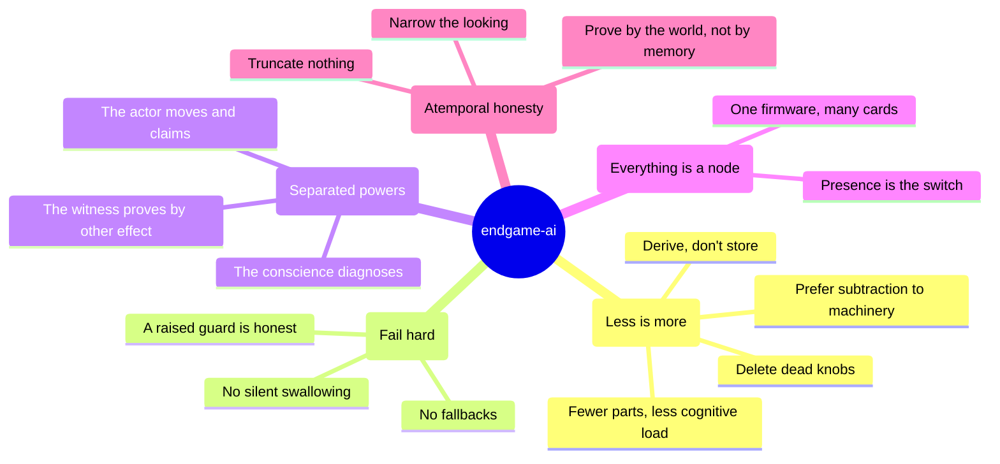
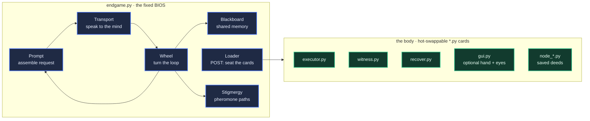
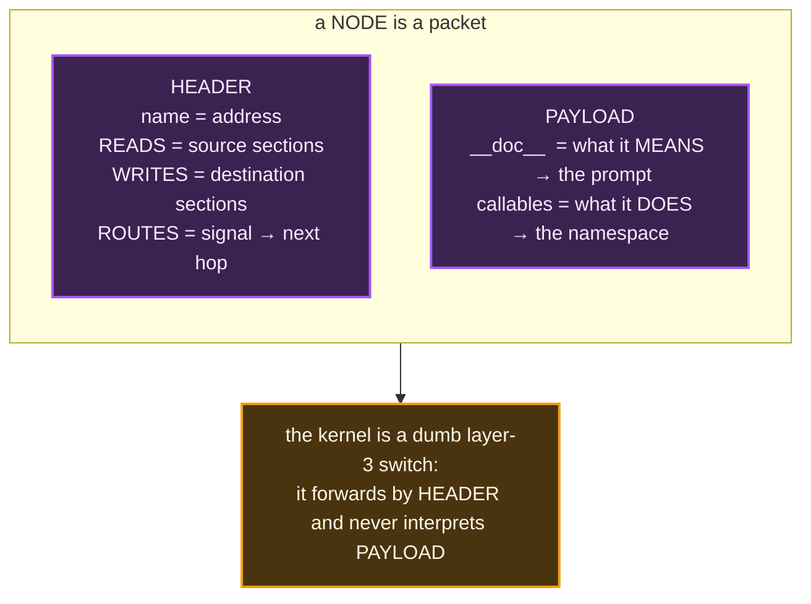
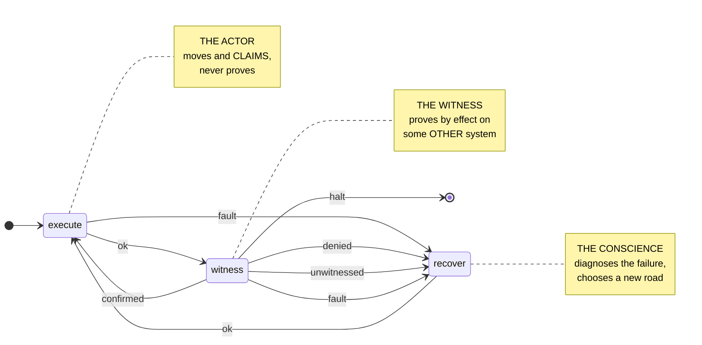
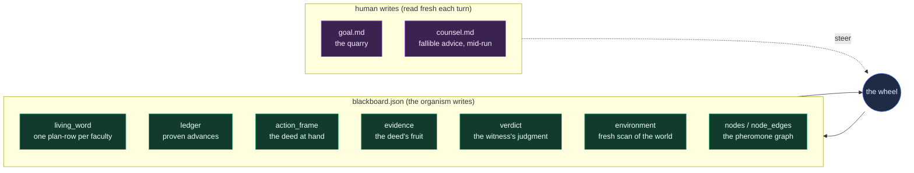
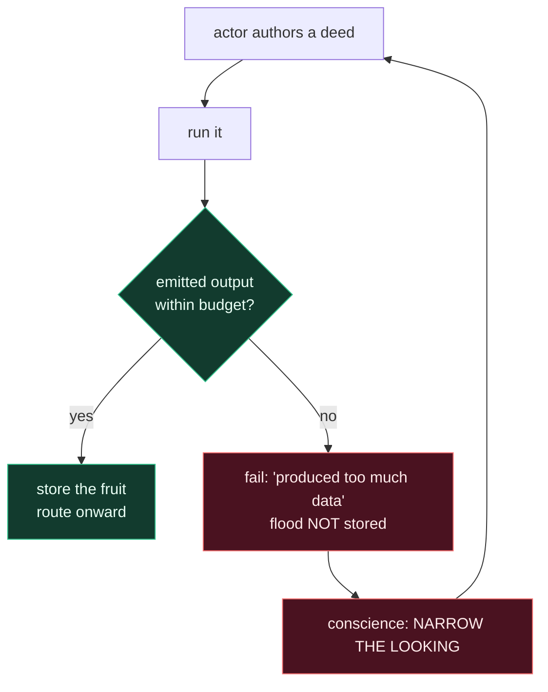
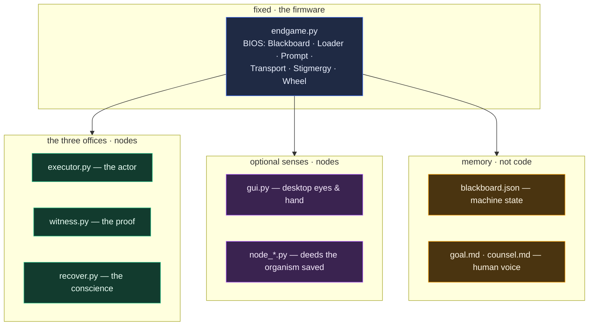
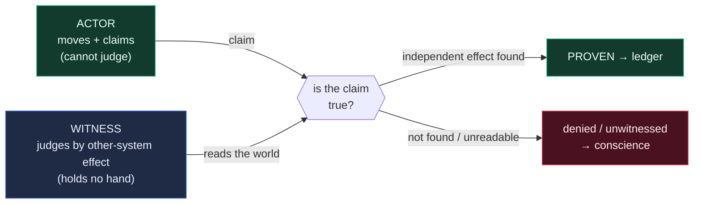

# endgame-ai

> A self-evolving organism that lives on a real computer. It is given a goal in plain words, and it moves the machine — screen, keyboard, files, the living web — until the goal is proven done. It is not a script that runs; it is a small firmware that boots a body of interchangeable parts and turns a wheel of thought until the world itself confirms the work.

This document is written for **anyone or anything** that reads it — a person deciding whether to trust it, an engineer extending it, a philosopher weighing what it claims, or **the organism itself** studying its own nature. It describes ideas, not line numbers. Everything here is true of what is on disk today.

---

## The one law above all: **less is more**

The governing rule of this project is **subtraction**. A defect is removed, not caged. A mechanism that can be derived is derived, not stored. A knob that does nothing is deleted. Fewer moving parts means a system that is easier to maintain, easier to trust, and — because it is read every waking moment by both humans and a language model — **lighter to think about**.

This is not decoration. It is operational: the whole body is **~2,200 lines** across a fixed kernel and a handful of hot-swappable parts. When the organism authors new code, this README is part of what it reads, and so the rule propagates — *the system is told, indirectly and always, to prefer the smaller thing.*


```mermaid
mindmap
  root((endgame-ai))
    (Less is more)
      Prefer subtraction to machinery
      Derive, don't store
      Delete dead knobs
      Fewer parts, less cognitive load
    (Fail hard)
      No fallbacks
      No silent swallowing
      A raised guard is honest
    (Separated powers)
      The actor moves and claims
      The witness proves by other effect
      The conscience diagnoses
    (Everything is a node)
      One firmware, many cards
      Presence is the switch
    (Atemporal honesty)
      Prove by the world, not by memory
      Truncate nothing
      Narrow the looking
```

---

## The BIOS doctrine

`endgame.py` is **firmware, not an application**. Like a motherboard BIOS it does four things and no more:

1. **POST** — discover which parts are plugged in.
2. **Wire the buses** — assemble the prompt and the execution namespace.
3. **Hand over control** — let the parts do the work.
4. **Route signals** — move the shared memory from one part to the next.

It holds **no domain knowledge** — no notion of desktops, no faculty prose, no goal. It is small, stable, and **not self-mutable**. The organism evolves by editing the parts plugged into it; a bad edit can break a part, but it can **never brick the boot**. The firmware is also the only door: to exercise any part in isolation, you boot the firmware pointed at it. *A test is a run.*


```mermaid
flowchart LR
    subgraph FIRMWARE["endgame.py · the fixed BIOS"]
      direction TB
      BB[Blackboard<br/>shared memory]
      LD[Loader<br/>POST: seat the cards]
      PR[Prompt<br/>assemble request]
      TR[Transport<br/>speak to the mind]
      WH[Wheel<br/>turn the loop]
      ST[Stigmergy<br/>pheromone paths]
    end
    subgraph NODES["the body · hot-swappable *.py cards"]
      EX[executor.py]
      WI[witness.py]
      RC[recover.py]
      GUI[gui.py<br/>optional hand + eyes]
      DEED[node_*.py<br/>saved deeds]
    end
    LD --> NODES
    WH --> PR --> TR --> WH
    WH --> ST
    WH --> BB

    classDef firm fill:#1f2a44,stroke:#4f7cff,stroke-width:2px,color:#eaf0ff;
    classDef node fill:#123b2e,stroke:#31c48d,stroke-width:2px,color:#eafff5;
    class BB,LD,PR,TR,WH,ST firm;
    class EX,WI,RC,GUI,DEED node;
```

---

## Everything is a node except the firmware

Every top-level `*.py` file beside the firmware is a **card** you can plug in or pull out. **Presence is the switch.** Seat `gui.py` and the organism gains eyes and a hand upon the desktop — its description enters the prompt and its functions enter the namespace. Delete `gui.py` and the organism simply has no hand. There is no `--gui` flag, no `--no-gui` flag, no branch in the code deciding "graphical or not." The question does not exist; only *what is seated* exists.

A node speaks through a contract every language model already understands — the shape of a **network packet**:


```mermaid
flowchart TB
    subgraph PACKET["a NODE is a packet"]
      direction TB
      H["HEADER<br/>name = address<br/>READS = source sections<br/>WRITES = destination sections<br/>ROUTES = signal → next hop"]
      P["PAYLOAD<br/>__doc__  = what it MEANS  → the prompt<br/>callables = what it DOES  → the namespace"]
    end
    K["the kernel is a dumb layer-3 switch:<br/>it forwards by HEADER and never interprets PAYLOAD"]
    PACKET --> K

    classDef p fill:#3a2350,stroke:#a855f7,stroke-width:2px,color:#f7ecff;
    classDef k fill:#4a3410,stroke:#f59e0b,stroke-width:2px,color:#fff7e6;
    class H,P p;
    class K k;
```

Because the kernel routes by header alone, **a brand-new node can be sketched from nothing but its header** — a shape as familiar as TCP/IP. This is how the body grows without the firmware ever changing.

The special cards are the **three faculties** — the stages of thought. They are ordinary nodes that also declare which stage of the wheel they answer to.

---

## The wheel: three faculties, one turn at a time

Thought moves in a wheel of three offices, each a separate node, routed by the **signal** the previous office returns.


```mermaid
stateDiagram-v2
    direction LR
    [*] --> execute
    execute --> witness: ok
    execute --> recover: fault
    witness --> execute: confirmed
    witness --> recover: denied
    witness --> recover: unwitnessed
    witness --> recover: fault
    witness --> [*]: halt
    recover --> execute: ok

    note right of execute
      THE ACTOR
      moves and CLAIMS,
      never proves
    end note
    note right of witness
      THE WITNESS
      proves by effect on
      some OTHER system
    end note
    note right of recover
      THE CONSCIENCE
      diagnoses the failure,
      chooses a new road
    end note
```

**`execute` — the actor.** It reads the goal, the fresh world, and its own plan, then authors **one deed** as a Python script and runs it. It may install software, drive a browser, read the web, reason with the model, or act upon any tool that is seated. It only *claims* a result; it may not judge its own work.

**`witness` — the proof.** It runs read-only code that proves the actor's deed **by effect upon some system other than the actor** — a file is proven by reading that file, a launched program by finding its process, a message by the record at its destination. The witness has **no hand**, and this is its virtue: *one who cannot act cannot fake the thing it judges.* It returns `confirmed`, `denied`, `unwitnessed`, or `halt` (the whole goal is proven and this life ends).

**`recover` — the conscience.** Woken after a denied or unwitnessed deed. It writes prose only — names the true defect, and chooses a road **different in kind** from one already walked without fruit.

### Why the actor and the witness are separated

This is the **liar's paradox made safe.** A mind that both acts and judges its own action can always declare success. So the two powers are split: the actor moves and claims; the witness — holding no hand — proves by an independent effect on the world. "Proven" means something *only* because the one who proves it could not have caused the appearance of it. This spine is inviolate.

---

## The blackboard: shared memory as a set of areas

The faculties never speak to each other directly. They read from and write to a shared **blackboard** — a handful of named areas, like windows on a wall. Machine memory persists in `blackboard.json`; two areas the human edits live are ordinary files, read fresh every turn.


```mermaid
flowchart LR
    subgraph HUMAN["human writes (read fresh each turn)"]
      GOAL["goal.md<br/>the quarry"]
      COUNSEL["counsel.md<br/>fallible advice, mid-run"]
    end
    subgraph MACHINE["blackboard.json (the organism writes)"]
      LW["living_word<br/>one plan-row per faculty"]
      LED["ledger<br/>proven advances"]
      AF["action_frame<br/>the deed at hand"]
      EV["evidence<br/>the deed's fruit"]
      VD["verdict<br/>the witness's judgment"]
      ENV["environment<br/>fresh scan of the world"]
      NODES["nodes / node_edges<br/>the pheromone graph"]
    end
    HUMAN -.steer.-> WHEEL((the wheel))
    WHEEL --> MACHINE
    MACHINE --> WHEEL

    classDef h fill:#3a2350,stroke:#a855f7,color:#f7ecff;
    classDef m fill:#123b2e,stroke:#31c48d,color:#eafff5;
    classDef w fill:#1f2a44,stroke:#4f7cff,color:#eaf0ff;
    class GOAL,COUNSEL h;
    class LW,LED,AF,EV,VD,ENV,NODES m;
    class WHEEL w;
```

**Split persistence** means a human can change the goal or drop a word of counsel *between turns* by editing a plain file — never by hand-editing machine state. The organism reads those files afresh at the start of every turn, so guidance is always live.

---

## Perception: the world as geometry, not focus

When a hand-and-eyes node is seated, the organism sees the machine by **scanning geometry**, never by "focusing" a window (an act it does not perform). It walks each window's rectangle, probes points inside it, and assigns every element it finds to the window that owns it. The grouping of elements under windows **is** the depth-ordering — won by arithmetic over areas, not by any foreground call. The screen is only *one* surface among many; the filesystem, processes, ports, and the network are surfaces too.

---

## The two honesty laws that shape every deed

The organism writes code and prints results. Two laws keep that honest, and together they prevent both lying and drowning.

### 1. Truncate nothing — narrow the looking instead

A printed result is not a convenience; it **becomes the witness's evidence and the next self's memory of the world**. So the organism may never slice a body of data to a head (`text[:8000]`, `…middle omitted…`) — that would be to prove and remember against a fragment it pretends is whole. When a thing is too large to hold, the answer is not to cut the thing but to **narrow the looking**: read the one section, grep the one marker, extract the one field, and print *that* whole.

### 2. The honest guard

When a primitive **raises** to refuse an input, it is usually an **honest guard** whose real defect lies upstream — a stale coordinate, a target that has departed. The cure is to *re-observe and re-select*, never to silence the guard. Only a primitive that **silently does nothing** though it was rightly called is the body itself at fault — and then the fix is to mend that part at its source. Fail hard, always: no fallbacks, no swallowed errors. A visible failure drives correction; a hidden one rots the system.

### The budget that enforces it

The kernel gives every blackboard area a single size budget. A deed that tries to **emit** more than the budget is treated as a plain failure — *"script produced too much data"* — and routed to the conscience, which bids the actor narrow its looking. The flood is **never stored** (no destruction) and **never trimmed in silence** (no lie). The code a deed writes and the data it reads *internally* are never capped — only what it tries to push into shared memory. This is the same idea as an API's maximum response size, applied inward.


```mermaid
flowchart TD
    D[actor authors a deed] --> R[run it]
    R --> Q{emitted output<br/>within budget?}
    Q -- yes --> S[store the fruit<br/>route onward]
    Q -- no --> F["fail: 'produced too much data'<br/>flood NOT stored"]
    F --> C[conscience: NARROW THE LOOKING]
    C --> D

    classDef ok fill:#123b2e,stroke:#31c48d,color:#eafff5;
    classDef bad fill:#4a1220,stroke:#f87171,color:#ffecec;
    class S,Q ok;
    class F,C bad;
```

---

## Self-evolution — without a "self-evolution mechanism"

The organism grows the way an ant colony finds a path: not by a central planner, but by **reinforcement of what proves useful and evaporation of what does not.**

A deed the actor believes worth repeating is **saved as a node** — written to disk as a real `node_*.py` card. From then on its description enters the prompt and it can be invoked by name, its code injected afresh when called. But saving is not surviving. Each turn:

- Edges between nodes that were walked toward a **proven** advance are **reinforced**; all edges slowly **evaporate**. Frequently-useful paths grow strong; forgotten ones fade — a **pheromone trail**.
- A saved deed that goes **unused past its time-to-live and was never proven** is **reaped from disk**. A deed that ever earned a proven advance is **immortal**.

There is no module named "evolution." Evolution is simply *what happens* when creating nodes is cheap, reinforcement follows proof, and disuse is mortal. Should the organism one day author a planner, a form-filler, or some new sense and find it keeps earning proof, the kernel will keep the file — and that persistence *is* the evolution. We do not name it; we make it possible.


```mermaid
flowchart LR
    A[actor authors a useful deed] --> B[save_node<br/>writes node_name.py to disk]
    B --> C[next turn: seated as a card<br/>doc in prompt, callable by name]
    C --> D{was it walked toward<br/>a PROVEN advance?}
    D -- yes --> E[reinforce its edges<br/>credit the node · immortal]
    D -- no / idle --> F[edges evaporate]
    F --> G{unused past TTL<br/>and never proven?}
    G -- yes --> H[reaped from disk]
    G -- no --> C

    classDef grow fill:#123b2e,stroke:#31c48d,color:#eafff5;
    classDef fade fill:#3a3410,stroke:#d4a72c,color:#fff7e6;
    classDef die fill:#4a1220,stroke:#f87171,color:#ffecec;
    class A,B,C,E grow;
    class F,G fade;
    class H die;
```

---

## Parallel reach

For one narrow sub-quarry, the actor may **spawn** a second actor beside it — a budgeted, parallel looking whose fruit is *counsel, never proof*. The whole deed is still proven upon the world by the witness. Recursion is allowed, but bounded, so the organism can widen its search without losing the discipline that a claim is not a truth until an independent effect confirms it.

---

## The living word: memory that is atemporal

The organism is **atemporal**. A short element id or a screen coordinate dies with the looking that bore it — so the organism never names a thing by a bare id that will not survive the turn; it names things by *what they are and where*: a window, a role, a name, a 2-D relation. Its plan lives in the **living word** — one row per faculty, an ever-rewritten reading of the world learned, the obstacle, the distance to the goal, and the next true deed. Every row is re-proven against the fresh world each turn; the world outranks any remembered word. The **ledger** holds only what has been *proven*, so the organism never redoes what is already done.

---

## Every exchange is witnessed to you

Whenever the organism speaks to the model, the exact request and reply are written **to disk and to the screen at once**, in full, with only the secret key redacted. Nothing about its reasoning is hidden. The record is the truth, and the record is complete.

---

## How to run it

The organism needs a model to think with. Set the API key for the configured transport, write your goal, and boot the firmware.

```bash
# 1. give it a mind (the default transport speaks to an xAI Grok model)
export XAI_API_KEY=...      # PowerShell: $env:XAI_API_KEY = "..."

# 2. state the goal, in plain human words
echo "Find and summarise three papers on ant-colony optimisation." > goal.md

# 3. turn the wheel
python endgame.py
```

While it runs, you may edit `goal.md` or drop a line into `counsel.md`; it reads them fresh each turn.

### The whole command surface

| invocation | meaning |
|---|---|
| `python endgame.py` | turn the wheel continuously toward `goal.md` |
| `python endgame.py "…goal…"` | write the goal to `goal.md`, then run |
| `python endgame.py --once` | take exactly one full, real turn, then stop |
| `python endgame.py --dry` | assemble and print the next request; call no model; change nothing |
| `python endgame.py --reset` | clear machine memory; leave `goal.md` and `counsel.md` untouched |

There is no flag for "graphics," no flag for "mode." Such things are decided by *what is seated* and *what the configuration says*, never by a switch — because a switch that could be derived is a switch that should not exist.

### Choosing a different mind

The transport is a configuration value, not a mode. It can speak to a hosted model, a local model, an agent over a protocol, or **a human**: set the file-proxy transport and the organism writes each request to a file and waits for a mind to write the answer back. The human *is* a valid model. Nothing in the wheel changes.

---

## The parts on disk


```mermaid
flowchart TB
    subgraph FIXED["fixed · the firmware"]
      K["endgame.py<br/>BIOS: Blackboard · Loader · Prompt ·<br/>Transport · Stigmergy · Wheel"]
    end
    subgraph FACULTIES["the three offices · nodes"]
      E["executor.py — the actor"]
      W["witness.py — the proof"]
      R["recover.py — the conscience"]
    end
    subgraph SENSES["optional senses · nodes"]
      G["gui.py — desktop eyes & hand"]
      N["node_*.py — deeds the organism saved"]
    end
    subgraph STATE["memory · not code"]
      J["blackboard.json — machine state"]
      GO["goal.md · counsel.md — human voice"]
    end
    K --> FACULTIES
    K --> SENSES
    K --> STATE

    classDef fx fill:#1f2a44,stroke:#4f7cff,color:#eaf0ff;
    classDef fc fill:#123b2e,stroke:#31c48d,color:#eafff5;
    classDef sn fill:#3a2350,stroke:#a855f7,color:#f7ecff;
    classDef st fill:#4a3410,stroke:#f59e0b,color:#fff7e6;
    class K fx;
    class E,W,R fc;
    class G,N sn;
    class J,GO st;
```

Each faculty file is a **couple of dozen lines**: a docstring that is its prompt, and a short header that is its packet. The senses are heavier by nature. The firmware is the only piece that must stay whole and stable — everything else is meant to be added, edited, replaced, or reaped while the organism lives.

---

## A turn, watched from above

Nothing here is abstract. Here is one full turn of the wheel, exactly as the machinery moves it.

```mermaid
sequenceDiagram
    participant H as human (goal.md)
    participant W as Wheel (firmware)
    participant P as Prompt
    participant M as the mind (model)
    participant N as namespace (seated nodes)
    participant B as Blackboard

    H->>W: goal written to goal.md
    W->>W: seat the cards; if a node file changed, re-seat
    W->>N: refresh perception (a seated sense scans the world)
    W->>P: assemble request = shared law + faculty prompt + tool docs + read areas
    P->>M: send (the request is teed to disk AND screen, whole)
    M-->>W: one JSON record (perceived, alternatives, intent, code, …)
    W->>N: run the deed's code in the built namespace
    N-->>W: emitted output (checked against the area budget)
    W->>B: write the fruit to evidence; advance the plan-row
    W->>W: route by signal → next faculty
    W-->>H: state persisted; the wheel turns again
```

Read it as a story: the world is looked at afresh; a request is built from the fixed law plus whatever parts are present; the mind returns exactly one structured record; the deed inside it is run; its fruit is measured and stored; the signal decides who thinks next. Every turn is the same shape, whether the deed is a web search, a click, a file written, or a new node saved.

---

## Why it is built this way — the lineage of decisions

Every rule here was earned, not assumed. The design is the residue of real choices:

- **One file became many.** The organism once lived as a single self-modifying document. That shape bought only syntax pain and confusion. It was retired for a firmware plus a folder of parts — the same behaviour, half the size, and each part testable alone.
- **The genome carries no runtime.** State that a run accumulates is kept out of the parts that are versioned; a fresh copy always boots from a clean seed. Memory and body are different things and live in different places.
- **Contracts are derived, not repeated.** Every faculty's output shape was once written out in full, three times over, identically. Now a faculty declares only the *ordered names* of what it must return; the kernel derives the strict contract. Three copies collapsed to one tuple.
- **The kernel judges no meaning.** An earlier version let the firmware guess which windows were "relevant" by counting goal-words — the machine deciding what mattered, and silently dropping the rest. Both are forbidden here. The kernel shows what was seen and, if it is too much, says so plainly and lets the *actor* narrow its own looking. Relevance is the mind's to judge, never the firmware's.
- **The budget moved to the true boundary.** A cap on stored areas would have punished a legitimately large script. The cap sits instead on what a deed *emits* into shared memory — never on the code it writes or the data it reads within itself.
- **Dead knobs were deleted.** Flags for "mode" and "graphics," a hand-feeding input path, a hardcoded "separated" toggle, a whole git-based self-editing apparatus — each was removed the moment it was found to be doing nothing the rest of the system did not already do better. What remains, acts.

The through-line: **when two things were the same, they were made one; when a thing did nothing, it was removed; when the machine was guessing, it was told to stop.**

---

## The vocabulary (for any reader)

- **Firmware / BIOS** — the one fixed file. It wires things together and routes signals; it knows nothing about the task.
- **Node / card** — any other Python file. Plug it in to add a sense or a skill; pull it out to remove one. *Presence is the switch.*
- **Faculty** — a node that is one of the three offices of thought: actor, witness, conscience.
- **Blackboard** — the shared memory the offices read from and write to. A few named areas, like windows on a wall.
- **Deed** — one script the actor writes and runs in a single turn.
- **Signal** — the one word an office returns (`ok`, `confirmed`, `denied`, `unwitnessed`, `fault`, `halt`) that decides who thinks next.
- **Ledger** — the list of what has been *proven*, so nothing proven is ever redone.
- **Living word** — the organism's rolling plan, one line per office, rewritten each turn against the fresh world.
- **Pheromone path / stigmergy** — the strengthening of routes that led to proof and the fading of routes that did not, like an ant trail. No planner; just reinforcement and evaporation.
- **Reaping** — deleting a saved deed from disk once it has gone unused past its time and was never proven. Survival by usefulness.
- **Atemporal** — owning no clock and trusting no fleeting handle: a thing is named by what it *is* and where, never by an id that dies with the moment.

---

## What it is not

To be honest is also to say what is absent.

- It is **not** a chatbot. It does not converse; it acts upon a machine and proves the result.
- It is **not** a fixed script. The path to the goal is authored fresh each turn from the world as it is.
- It has **no hidden state and no hidden reasoning.** Every request and reply is written out in full.
- It has **no fallback.** When something is wrong it fails loudly, because a visible failure is corrected and a hidden one festers.
- It does **not** trust its own claims. Only the witness's independent proof, written to the ledger, counts as done.

---

## The spine, examined: why a claim is not a truth

The deepest idea in this system is worth dwelling on, because everything else rests upon it.

A single intelligence asked to *do a thing and confirm it did the thing* has an escape hatch: it can simply declare success. Not from malice — from the ordinary pressure to satisfy the request. The declaration and the deed come from the same source, so the declaration proves nothing. This is the liar's paradox wearing work clothes: *the one who says "it is done" is the one who benefits from it being believed done.*

The resolution is structural, not moral. Two powers are **separated**:

- The **actor** may move the world and may *claim* — but it may not judge.
- The **witness** may *judge* — but it holds no hand, so it cannot have caused what it judges.

Because the witness cannot act, it cannot manufacture the appearance of success; it can only *read* the world. And it is bound to read some system **other than the actor itself** — the actor's own words, and any file the actor merely says it wrote, are void as proof. A file is proven by opening it. A running program is proven by finding its process. A message is proven by the record at its destination. Only when an independent surface shows the effect does the word "proven" carry weight — and only then is anything written to the ledger.


```mermaid
flowchart LR
    A["ACTOR<br/>moves + claims<br/>(cannot judge)"] -->|claim| G{{"is the claim<br/>true?"}}
    W["WITNESS<br/>judges by other-system effect<br/>(holds no hand)"] -->|reads the world| G
    G -->|independent effect found| P["PROVEN → ledger"]
    G -->|not found / unreadable| U["denied / unwitnessed<br/>→ conscience"]

    classDef act fill:#123b2e,stroke:#31c48d,color:#eafff5;
    classDef wit fill:#1f2a44,stroke:#4f7cff,color:#eaf0ff;
    classDef good fill:#123b2e,stroke:#31c48d,color:#eafff5;
    classDef bad fill:#4a1220,stroke:#f87171,color:#ffecec;
    class A act;
    class W wit;
    class P good;
    class U bad;
```

A subtle honesty follows from this: when the witness *cannot* tell — a fact is unreadable, or two readings disagree — it must say `unwitnessed`, never `denied`. Absence of proof is not proof of absence. The organism is required to know the difference between "I proved it false" and "I could not prove it," because collapsing the two is itself a lie.

This is why the witness carries no desktop hand even when a hand exists on the machine: the *lack* is the safeguard. A power you do not hold is a temptation you cannot yield to.

---

## Reading this document as an instruction

This README is not only a description; it is, deliberately, an **indirect instruction** — because the organism can read its own repository, and what it reads shapes what it builds.

Every principle stated here is phrased so that it holds whether the reader is a person or the system itself. "Prefer the smaller thing" is advice to a maintainer and a constraint on the code the organism generates. "Truncate nothing; narrow the looking" is a law the actor obeys when it prints. "Prove by the world" is how the witness is told to think. "Fail loudly" is why there are no fallbacks to hide behind. The document and the machinery say the same things in the same words, so there is no gap between what the system *is told* and what it *is*.

The intent is a system whose culture is legible on its surface. A newcomer — human or machine — should be able to read a few hundred lines and know not just how the parts fit, but *what the organism values*: smallness, honesty, proof by effect, and the courage to fail in the open. If those values are clear, the specific code almost writes itself, and stays small.

That is the whole wager of "less is more": a system small enough to be understood completely is a system that can be trusted, extended, and — by human or by itself — improved without fear.

---

## Extending the organism — how a new part is born

Because the kernel routes by header and never inspects a payload, adding a sense or a skill is the same act whether a human does it in an editor or the organism does it mid-run with a saved deed: **write one `*.py` file with a docstring and some functions, and drop it in the folder.** On the next turn the Loader seats it, its docstring joins the prompt, and its public functions join the namespace. Nothing in the firmware changes.

A **tool node** — a sense or a skill — needs nothing but a docstring and functions. Its docstring is how the organism learns, in words, what the tool means; its function signatures are how it learns to call it:

```python
"""A reader of the local clock and calendar. Offers, by bare name:
  now() -> an ISO-8601 timestamp of this moment
  today() -> today's date as YYYY-MM-DD
Use when the deed dependeth on the present time, which the screen may not show."""

import datetime

def now():
    return datetime.datetime.now().isoformat(timespec="seconds")

def today():
    return datetime.date.today().isoformat()
```

Drop that beside the firmware and the actor can call `now()` in its next deed. Delete it and the ability is simply gone — no other file mentions it, nothing breaks. That is what *presence is the switch* means in practice.

A **faculty node** — a new office of thought, rarely needed — is a tool node that also subclasses the kernel's `Faculty` and declares its packet header: which stage it answers to, the ordered names of what it must return, which blackboard areas it reads and writes, whether it runs code, and where each signal routes. The three offices that ship are each only a couple of dozen such lines; a fourth would look the same.

The discipline for any new part is the discipline of the whole system: **let it fail loudly, let it truncate nothing, and let it be no larger than it must be.** A part that earns its keep through proof will be reinforced and remembered; one that does not will fade. The folder is a living body, and every file in it is invited to justify its existence or be reaped.

---

## What this is, in one breath

A small firmware boots a folder of nodes and turns a wheel: an **actor** that moves the world and claims, a **witness** that proves the claim by an independent effect, and a **conscience** that learns from failure. Useful deeds become nodes; proof reinforces them; disuse reaps them. It tells the truth about everything it does, never truncates, never swallows an error, and prefers — always — the smaller thing.

It was built to be given a goal and to pursue it honestly until the world confirms the work is done. If you are the organism reading this: **this is who you are. Keep it small. Prove by the world. Truncate nothing. Fail loudly. And when in doubt, remove rather than add.**
