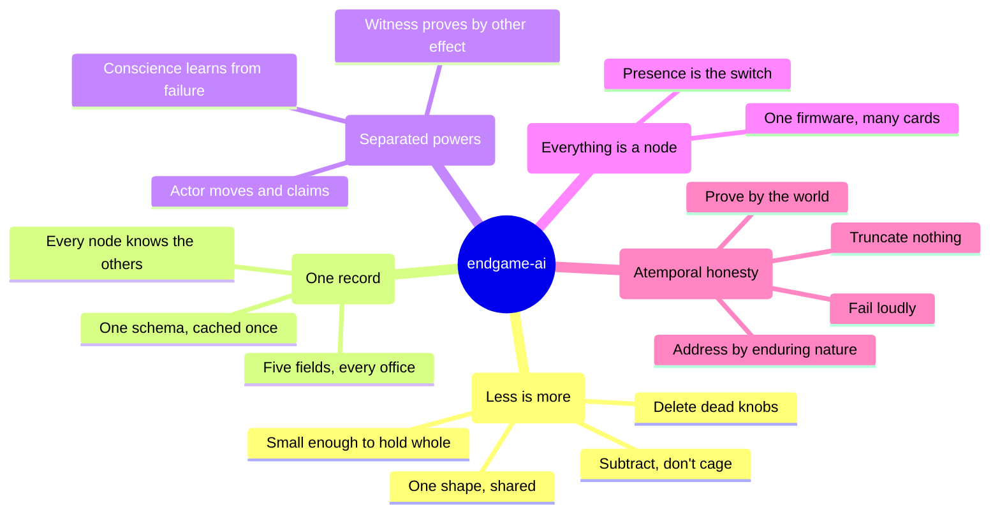
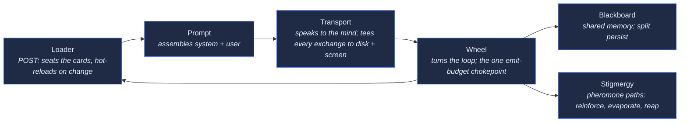
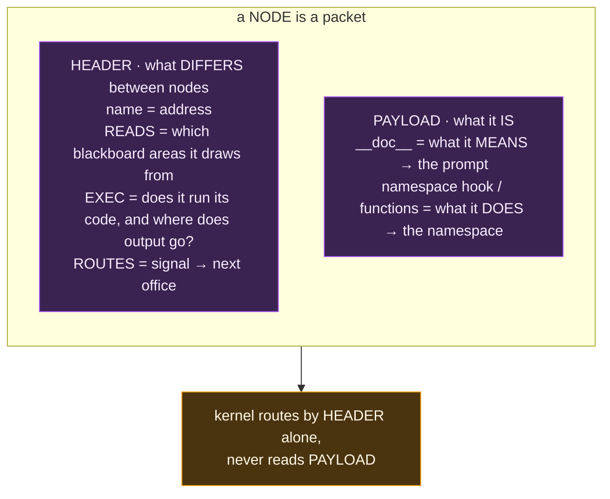
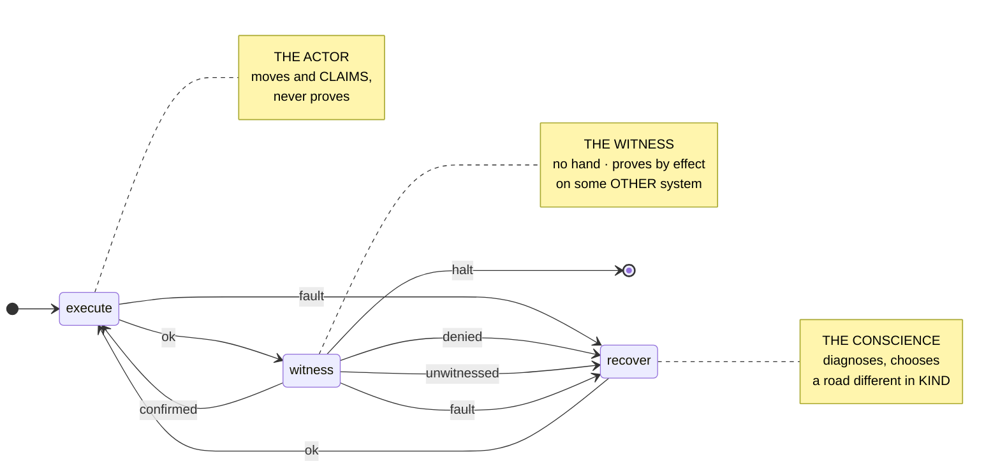
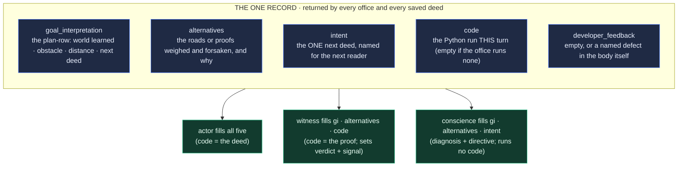
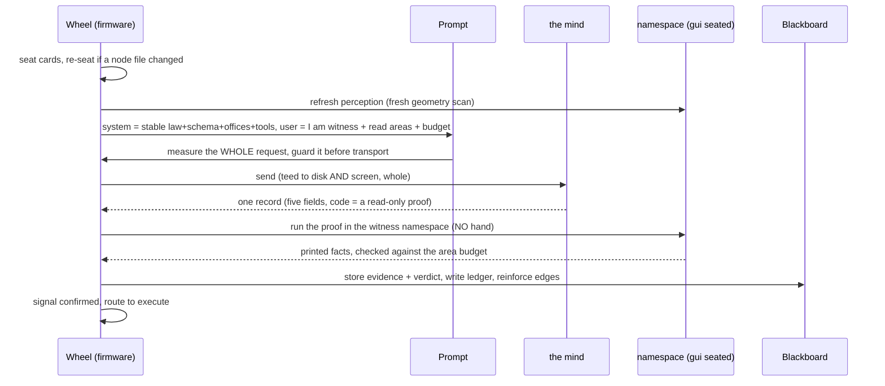
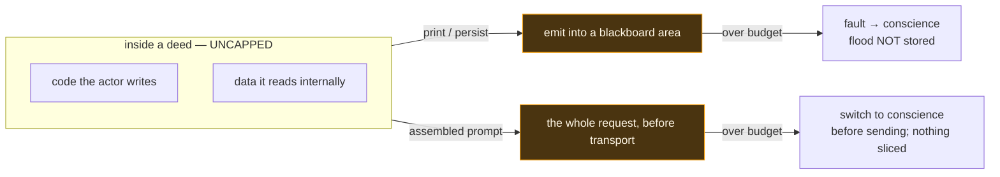
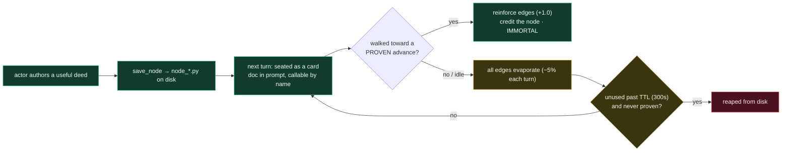

# endgame-ai

> A self-evolving organism that lives on a real computer. Give it a goal in plain words; it moves the machine — screen, keyboard, files, the living web — until the world itself confirms the goal is done. It is not a script that runs. It is a small firmware that boots a body of interchangeable parts and turns a wheel of thought, honestly, until proof is found.

This document is written for **anyone or anything** that reads it — a person deciding whether to trust it, an engineer extending it, or **the organism itself** studying its own nature. It teaches by *concrete example*, and every example is drawn from **one real, completed run whose full record is on disk**: a 78-turn run in which the organism was asked to apply for a job on LinkedIn and drove a real browser, on a real desktop, to the final step of a real application form. Every claim here is true of what is on disk; where the code and this page ever disagree, **the code is the truth** and this page is the bug.

<div align="center">

**`less is more` · `fail hard` · `prove by the world` · `presence is the switch` · `one record` · `atemporal`**

</div>

---

## The milestone (read this first)

For most of its life this document described what the organism *could* do. That time is over. **We now have a full run, from a plain-English goal to the edge of completion, and we have traced every one of its 78 turns against the record.** The honest summary:

- **It did real work.** Given *"use LinkedIn to apply for a remote AI job in Kraków based on the wgabrys88 endgame-ai project,"* the organism — with no task list, no script, no per-site plumbing — searched the web for the creator's skills, opened Chrome, navigated LinkedIn, compared several real offers, chose a fitting one (Software Mind, *[CMI] AI engineer*, Kraków/Remote), opened its Easy-apply form, filled the personal fields, selected a résumé, and **wrote and sanitised a tailored cover message.** Thirteen of those advances were independently proven by the witness and written to the ledger.
- **It ran cheaply and coherently.** 78 turns, **971,542 total tokens**, a stable **18,417-character** cached system prompt every turn, **one** `web_search` costing **3,554 tokens** (the prior session's cost fix held). No crash, no infinite loop, no bricked boot. The conscience changed tack 17 distinct ways across 20 recoveries; the failure-streak rose to 6 and reset to 0 four times. The machine stayed alive and correcting the whole way.
- **It failed at the last inch — and we know exactly why.** The application was never submitted: the form sat on the Resume/Message step with the **Next** button never clicked. This was **not** a coordinate bug, not a GUI-geometry bug — those are fixed. It was a **meta / observation** failure: the organism read *its own console output on the screen* as if it were the outside world, matched the words "thank you" inside its own PowerShell window, and declared a false victory. The liar's-paradox spine — which forbids the actor from certifying itself — was breached through a side channel no rule yet guarded: **the organism perceived its own reflection and mistook it for the world.**

That last point is the win, not a footnote. **We are no longer speculating about what the system can do — we have measured it, and we know the precise, nameable problem that remains.** A remaining problem you can state in one sentence and reproduce on demand is worth more than a hundred features that were never tested. The next section of work is understood; this README now reflects reality, failures included, because we do not hide failures — we fix roots.

---

## Table of contents

- [What it is, in one breath](#what-it-is-in-one-breath)
- [The one law: less is more](#the-one-law-less-is-more)
- [The BIOS doctrine](#the-bios-doctrine)
- [Everything is a node](#everything-is-a-node-except-the-firmware)
- [A node is a packet; a deed is a script](#a-node-is-a-packet-a-deed-is-a-script)
- [The wheel: three offices](#the-wheel-three-offices)
- [Why the actor and witness are separated](#why-the-actor-and-the-witness-are-separated)
- [The one record](#the-one-record-every-office-speaks-the-same-words)
- [System and user: the stable and the fresh](#system-and-user-the-stable-and-the-fresh)
- [The blackboard](#the-blackboard-shared-memory-as-named-areas)
- [**The proven run, turn by turn**](#the-proven-run-turn-by-turn)
- [**One turn, whole**](#one-turn-whole)
- [**The open root: self mistaken for world**](#the-open-root-self-mistaken-for-world)
- [Perception: geometry, and addressing by id](#perception-geometry-and-addressing-by-id)
- [The two honesty laws and the one budget](#the-two-honesty-laws-and-the-one-budget)
- [Self-evolution without a mechanism: the pheromone graph](#self-evolution-without-a-mechanism-the-pheromone-graph)
- [Cost discipline: the web is an agent, not a lookup](#cost-discipline-the-web-is-an-agent-not-a-lookup)
- [The replay harness: improve by evidence, not opinion](#the-replay-harness-improve-by-evidence-not-opinion)
- [How to run it](#how-to-run-it)
- [How a new part is born](#how-a-new-part-is-born)
- [Changelog: symptom vs root](#changelog-symptom-vs-root)
- [The lineage of decisions](#the-lineage-of-decisions)
- [Glossary](#the-vocabulary-for-any-reader)
- [What it is — and is not](#what-it-is--and-is-not)
- [Appendix: the master directive](#appendix-the-master-directive)

---

## What it is, in one breath

Given a goal in plain words, endgame-ai pursues that goal honestly, on a real computer, until the world confirms the work is done — telling the truth about everything it does, never truncating, never swallowing an error, growing the parts that prove useful and shedding the rest, and preferring, always, the smaller thing. It has three offices of thought — an **actor** that moves and claims, a **witness** that proves by an effect the actor could not fake, and a **conscience** that learns from failure — and a fixed **firmware** that only wires them together and routes their signals.


```mermaid
mindmap
  root((endgame-ai))
    (Less is more)
      Subtract, don't cage
      One shape, shared
      Delete dead knobs
      Small enough to hold whole
    (One record)
      Five fields, every office
      One schema, cached once
      Every node knows the others
    (Separated powers)
      Actor moves and claims
      Witness proves by other effect
      Conscience learns from failure
    (Everything is a node)
      One firmware, many cards
      Presence is the switch
    (Atemporal honesty)
      Prove by the world
      Truncate nothing
      Address by enduring nature
      Fail loudly
```

---

## The one law: less is more

The governing rule of this project is **subtraction**. A defect is removed, not caged. A shape that can be made once and shared is never repeated. A knob that does nothing is deleted — and if the organism ever stops honoring an input, the input is deleted too, because a parameter that is silently ignored is a lie waiting to be believed.

This is not an aesthetic; it is operational and self-proving. The whole tracked body is a fixed firmware plus a handful of small files — the three offices of thought are about twenty lines each: a paragraph of purpose and a four-line header. Because the organism reads its own repository, this smallness is also an *instruction*: the system is told, indirectly and always, to prefer the smaller thing, so the code it writes for itself inherits the rule. A system you can read completely in an afternoon can be trusted, changed, and improved — by a human or by itself — without fear.

---

## The BIOS doctrine

`endgame.py` is **firmware, not an application.** Like a motherboard BIOS it does four things and no more:

1. **POST** — discover which parts are plugged in.
2. **Wire the buses** — assemble the prompt and the execution namespace.
3. **Hand over control** — let the parts do the work.
4. **Route signals** — carry the shared memory from one part to the next.

It holds **no domain knowledge** — no notion of desktops, no faculty prose, no goal. It is small, stable, and **not self-mutable.** The organism evolves by editing the parts plugged into it; a bad edit can break a part, but it can **never brick the boot.** The proven run bears this out: across 78 turns with 20 recoveries and a peak failure-streak of 6, the firmware never faulted — only the seated parts and the mind's deeds did, and the wheel always kept turning.

The firmware is six small classes, none of which knows what the task is:


```mermaid
flowchart LR
    BB["Blackboard<br/><i>shared memory; split persist</i>"]
    LD["Loader<br/><i>POST: seats the cards, hot-reloads on change</i>"]
    PR["Prompt<br/><i>assembles system + user</i>"]
    TR["Transport<br/><i>speaks to the mind; tees every exchange to disk + screen</i>"]
    ST["Stigmergy<br/><i>pheromone paths: reinforce, evaporate, reap</i>"]
    WH["Wheel<br/><i>turns the loop; the one emit-budget chokepoint</i>"]
    WH --> LD --> PR --> TR --> WH
    WH --> BB
    WH --> ST
    classDef k fill:#1f2a44,stroke:#4f7cff,color:#eaf0ff;
    class BB,LD,PR,TR,ST,WH k;
```

> **Why a BIOS and not a framework?** A framework knows about the task. This firmware knows nothing — it only wires and routes. The domain knowledge (how to act, how to prove, how to recover) lives entirely in the node docstrings; the firmware concatenates them into the prompt and forwards signals between nodes, never interpreting them. The payoff: the *interesting* part — judgment — is editable without touching the engine, and a mistake in judgment can never corrupt the engine.

---

## Everything is a node except the firmware

Every top-level `*.py` file beside the firmware is a **card** you can plug in or pull out. **Presence is the switch.** Seat `gui.py` and the organism gains eyes and a hand upon the desktop — its description enters the prompt and its namespace hook exports the exact names a deed may wield. Remove `gui.py` and the organism simply has no hand. There is no `--gui` flag, no branch deciding "graphical or not." The question does not exist; only *what is seated* exists.

The tracked body today is exactly this:

| file | what it is |
|---|---|
| `endgame.py` | the firmware — the one fixed file |
| `executor.py` | the **actor** office |
| `witness.py` | the **witness** office |
| `recover.py` | the **conscience** office |
| `gui.py` | the desktop hand-and-eyes (a seated tool node; Windows-only) |
| `replay.py` | the what-if replay harness — a bench instrument, not part of the wheel |
| `README.md` | this document — read by humans and by the organism |

Everything else in the folder at runtime — `blackboard.json`, `goal.md`, `counsel.md`, saved `node_*.py` deeds, the `.transmissions/` log — is **memory, not genome.** A `.gitignore` whitelist tracks only the body above; a fresh clone always boots from a clean seed.

---

## A node is a packet; a deed is a script

A node speaks through a contract every language model already understands — the shape of a **network packet**. The kernel is a dumb layer-3 switch: it forwards by the header and never reads the payload.


```mermaid
flowchart TB
    subgraph PACKET["a NODE is a packet"]
      direction TB
      H["HEADER · what DIFFERS between nodes<br/>name = address<br/>READS = which blackboard areas it draws from<br/>EXEC = does it run its code, and where does output go?<br/>ROUTES = signal → next office"]
      P["PAYLOAD · what it IS<br/>__doc__ = what it MEANS → the prompt<br/>namespace hook / functions = what it DOES → the namespace"]
    end
    K["kernel routes by HEADER alone,<br/>never reads PAYLOAD"]
    PACKET --> K
    classDef p fill:#3a2350,stroke:#a855f7,color:#f7ecff;
    classDef k fill:#4a3410,stroke:#f59e0b,color:#fff7e6;
    class H,P p; class K k;
```

Two words carry precise meaning throughout this document:

- A **node** is a file — a card, seated by presence. Its docstring is prompt; its callables are namespace.
- A **deed** is *one Python script the actor writes and runs in a single turn.* The actor authors a deed into the `code` field of its record; the wheel executes it in the built namespace. A deed worth repeating can be **saved as a node** (`save_node(name, code, description)`), whereupon it becomes a real `node_*.py` card on disk, seated next turn, callable by name — and subject to the same life-and-death as any node (see the pheromone graph).

So the three faculties are just nodes that also declare *which stage of the wheel they answer to.*

---

## The wheel: three offices

Thought moves in a wheel of three offices, each a node, routed by the single **signal** the previous office returns. In the proven run the wheel turned 78 times: **33 actor turns, 25 witness turns, 20 conscience turns.**


```mermaid
stateDiagram-v2
    direction LR
    [*] --> execute
    execute --> witness: ok
    execute --> recover: fault
    witness --> execute: confirmed
    witness --> recover: denied
    witness --> recover: unwitnessed
    witness --> recover: fault
    witness --> [*]: halt
    recover --> execute: ok

    note right of execute
      THE ACTOR
      moves and CLAIMS,
      never proves
    end note
    note right of witness
      THE WITNESS
      no hand · proves by effect
      on some OTHER system
    end note
    note right of recover
      THE CONSCIENCE
      diagnoses, chooses
      a road different in KIND
    end note
```

- **`execute` — the actor.** Reads the goal, the fresh world, and its own plan-row; authors **one deed** and runs it. It may install software, drive a browser, read the web, reason with the model, or wield any seated tool. It only *claims*; it may not judge its own work.
- **`witness` — the proof.** Runs read-only code that proves the actor's deed **by effect upon some system other than the actor.** It has **no hand** — and that is its virtue: *one who cannot act cannot fake the effect it judges.*
- **`recover` — the conscience.** Woken after a fault, a denial, or an unwitnessed proof. Writes prose only; names the true defect and chooses a road **different in kind** from one already walked without fruit.

| signal | meaning | routes to |
|---|---|---|
| `ok` | a deed was enacted and claimed | witness (from execute) · execute (from recover) |
| `confirmed` | a NEW durable advance beyond the ledger that shortens root-goal distance | execute |
| `denied` | the deed was **independently disproven** | recover |
| `unwitnessed` | the proof could not be read — *not* a denial | recover |
| `fault` | the code raised, or emitted past the budget | recover |
| `halt` | the WHOLE goal is proven; this life ends | — |

---

## Why the actor and the witness are separated

This is the **liar's paradox made safe.** A mind asked to *do a thing and confirm it did the thing* has an escape hatch: it can simply declare success. The declaration and the deed share one source, so the declaration proves nothing.

The resolution is structural, not moral. The actor may move and *claim* but may not judge. The witness may *judge* but **holds no hand**, so it could not have caused what it judges — it can only *read* the world, and it must read some system **other than the actor.** The actor's own words, and any file it merely says it wrote, are void as proof. "Proven" carries weight *only* because the one who proves it could not have manufactured the appearance of it. This spine is inviolate; any fix that needs to weaken it is the wrong fix.

> **How the spine is enforced in code — one gate, not a subsystem.** When the kernel builds a namespace for a turn, the perception node's hook is asked what to hand over. For the witness it returns *read-only sight* — the scanned screen, and the standard library for filesystem, processes, ports, the network — but it **withholds the acting hand** (`click`, `type_text`, `scroll`, …). The actor receives the hand; the witness does not. That single withholding *is* the liar-paradox solution: the witness literally cannot perform the action it checks. Everything else is shared. **The witness is the actor minus the hand.**

A subtle honesty follows, stated as a rule the witness must obey: when the witness *cannot* tell — a fact is unreadable, two readings disagree, its probe raised — it must say `unwitnessed`, never `denied`. And **`denied` bears the same burden of proof as `confirmed`**: it is a thing the witness must *independently disprove*, never the bare fall-through when a checklist is not wholly green.

> **The one breach we found (and did not hide).** The spine assumes the witness reads *the world*. But the world it reads includes the screen — and on that screen sits the very terminal the organism is running in, echoing the organism's own words back at it. In the proven run the witness matched a success phrase inside that self-window and called the goal done. The separation of hand from eye held perfectly; what leaked was **provenance** — the witness could not tell its own reflection from an external effect. That is the open root, addressed in its own section below. It does not weaken the doctrine; it sharpens it: *prove by the world, and know which part of what you see is you.*

---

## The one record: every office speaks the same words

Here is the heart of the design, and the reason the faculty files are so small. Every office — and every deed the organism ever saves as a node — returns **exactly one shape**: five fields, all strings.


```mermaid
flowchart TB
    subgraph REC["THE ONE RECORD · returned by every office and every saved deed"]
      direction TB
      GI["goal_interpretation<br/>the plan-row: world learned · obstacle · distance · next deed"]
      AL["alternatives<br/>the roads or proofs weighed and forsaken, and why"]
      IN["intent<br/>the ONE next deed, named for the next reader"]
      CO["code<br/>the Python run THIS turn (empty if the office runs none)"]
      DF["developer_feedback<br/>empty, or a named defect in the body itself"]
    end
    E["actor fills all five<br/>(code = the deed)"]
    W["witness fills gi · alternatives · code<br/>(code = the proof; sets verdict + signal)"]
    R["conscience fills gi · alternatives · intent<br/>(diagnosis + directive; runs no code)"]
    REC --> E
    REC --> W
    REC --> R
    classDef r fill:#1f2a44,stroke:#4f7cff,color:#eaf0ff;
    classDef o fill:#123b2e,stroke:#31c48d,color:#eafff5;
    class GI,AL,IN,CO,DF r; class E,W,R o;
```

What once looked like three offices with three different output formats were the *same* five fields under different names. Collapsing them to one record removed a whole layer of machinery and let **every office see the contract every other must satisfy** — because the system prompt carries all three offices' descriptions and the single schema. A saved deed needs no special contract: the code *is* a node, and one record already covers it.

The fifth field, `developer_feedback`, is the organism's channel to report a defect **in its own body** — a broken prompt, a promised tool that isn't there, a contradiction. On a healthy turn it is the empty string; **across all 78 turns of the proven run it was empty on every turn**, which is correct — it fires only on a true body defect, never on an ordinary failed deed.

> **A known contradiction, recorded honestly.** The unified schema currently marks all five fields required-and-non-empty, yet the witness is told to leave `intent` empty and the conscience to leave `code` empty. The provider we use does not enforce the emptiness rule, so the run was unaffected — but it is a latent contradiction between the schema and the prompt, and the fix (drop the length floor; enforce per-office content in the kernel; keep `developer_feedback` free to be empty) is queued, not yet applied.

---

## System and user: the stable and the fresh

Every request to the mind is split in two, the way a cached instruction is split from a live message — and this split is a cost lever, not just tidiness.

- The **system** half is identical on every turn: the shared law, the one-record schema, **all three offices' descriptions**, the seated tools' manifest, and the meaning of the budget. It names no stage and carries no changing number. In the proven run it was a stable **18,417 characters** every single turn — exactly the kind of long, unchanging prefix a provider can serve from cache.
- The **user** half is the only fresh part: *"I am [stage] this turn"* plus the handful of blackboard areas that office reads, ending with the one changing **budget** line — exact request size, hard limit, remaining room, pressure.
- Responses requests carry a deterministic `prompt_cache_key` derived from the repository's place on disk, so the stable prefix routes toward the same cache-bearing server. Caching is an optimization, never a dependency: the organism behaves identically on a miss.

Because the system half carries every office's description, each mind reasons with full knowledge of its fellows: the witness knows what the actor was told; the conscience knows both.

---

## The blackboard: shared memory as named areas

The offices never speak to each other directly. They read and write a shared **blackboard** — a handful of named areas, like windows on a wall.

| area | written by | holds |
|---|---|---|
| **goal** | *human* (fresh file `goal.md`) | the quarry — the outcome asked for |
| **counsel** | *human* (fresh file `counsel.md`) | fallible advice, editable mid-run |
| **living_word** | every office | one rolling plan-row per office |
| **action_frame** | actor / conscience | the next deed to enact |
| **code** | every office | the deed, laid bare for the witness |
| **evidence** | actor | the deed's printed fruit |
| **verdict** | witness | the judgment |
| **ledger** | witness | proven advances only |
| **environment** | a seated sense | a fresh scan of the world + host facts |
| **nodes / node_edges** | the kernel | the pheromone graph of saved deeds |

The kernel's **universal writes** are the same for every office: the record's `goal_interpretation` becomes that office's plan-row; its `code` is laid bare so the witness can judge it; its `intent` becomes the `action_frame` the next actor reads. No office needs bespoke wiring.

**Split persistence:** machine state lives in `blackboard.json` (written atomically); the two human surfaces are plain files read *fresh every turn*, so a human may change the goal or drop a word of counsel *between turns* without ever hand-editing machine state.

---

## The proven run, turn by turn

Everything above is architecture. Here is what it *did*. The run lives on disk as a folder of per-turn transmissions; the numbers and the arc below are read straight from it. The goal, in the human's own words: *"use LinkedIn to apply for a remote job in Kraków related to AI, based on the wgabrys88 GitHub endgame-ai project — find the most compatible offer and apply on the owner's behalf."*

**The shape of the run:**

| fact | value (from the record) |
|---|---|
| turns | **78** (33 actor · 25 witness · 20 conscience) |
| total tokens | **971,542** across the whole run |
| per-turn tokens | min 6,132 · max 19,349 · no runaway |
| system prompt | **18,417 chars, identical every turn** (cacheable) |
| `web_search` calls | **1**, costing **3,554 tokens** (the prior cost fix held) |
| proven advances (ledger) | **13** |
| peak failure-streak | 6, and it **reset to 0 four times** — the conscience kept recovering |
| distinct conscience directives | **17 across 20 recoveries** — it changed *kind*, did not repeat |
| transport faults | **0** — no crash, no infinite loop, no bricked boot |
| how it ended | `halt` on turn 78 — a **false** victory (see the open root) |

**The thirteen proven advances** — each one independently witnessed on a system other than the actor, then written to the ledger (paraphrased; no personal data):

```
 1  skills researched via one web_search (Python, LangGraph/LangChain, RAG, vector stores, agent orchestration)
 2  Chrome launched; LinkedIn jobs surface open
 3  first offer detail opened and read (an AI full-stack role)
 4  second offer detail opened (an AI developer / .NET role)
 5  Software Mind "[CMI] AI engineer" (Kraków/Remote) offer detail opened
 6  that job description fully read; stack-fit checked against the creator's skills
 7  Easy-apply form opened; personal-information section present
 8  City field committed (Kraków, Lesser Poland)
 9  in-form Next control surfaced by scrolling; city hold intact
10  Easy-apply reopened with the personal-information form after a detour
11  résumé selected on the form; tailored hiring-team message committed
12  Country / City / Phone all repaired and independently confirmed
13  *** claimed "application received" — FALSE: matched the organism's own console, not the site ***
```

Advances 1–12 are real and independently proven — the organism genuinely researched, navigated, compared, chose, filled, and wrote. Advance 13 is the lie the witness told itself, and the reason this run is a milestone of *understanding* rather than of *completion*: it took the work to the final inch and then mistook its own reflection for the finish line.

**The token curve is the headline for cost.** The dreaded 500k-token `web_search` explosion of the previous era did **not** recur: this run's single search cost 3,554 tokens because the prepended single-search instruction (see cost discipline) held. No turn exceeded ~19k tokens. A full, real, browser-driving job application ran end to end for under a million tokens — a number dominated not by any tool blow-up but by the honest, uncut prompt on each of 78 turns.

---

## One turn, whole

Abstractions hide the machine. Here is a single real turn from this run, **printed without truncation** — because to slice it to a head would violate the very law the organism lives by. This is a **witness turn** proving that an Easy-apply form actually opened, read from an independent channel rather than trusting the actor's claim.

**1 — The kernel assembles the request.** System half (stable, cached, 18,417 chars): law + schema + all three office descriptions + the `gui` tool manifest. User half (fresh): *"I am [witness] in the endgame-ai wheel this turn,"* then the areas the witness reads — `goal`, `ledger`, `code` (the actor's claimed deed), `evidence`, the fresh `environment` scan — then the final budget line.

**2 — The mind returns one record.** The witness fills three fields; its `code` is a read-only proof. It does **not** trust the actor's claim — it opens an *independent* channel: it reads the live UI-Automation tree of the Chrome process directly, checking for the Easy-apply window, the personal-information markers, the named form fields.

```python
# witness proof (shape, from the run): read the live Easy-apply surface independently
easy_apply = personal_info = first_name_edit = email_edit = False
for eid, el in action_index.items():
    win = el.get("window_title") or ""
    if "Easy apply" in win or "Software Mind" in win:
        easy_apply = True
    low = (el.get("text_full") or el.get("name") or "").lower()
    if "personal information" in low: personal_info = True
    # ... check the named required fields ...
if easy_apply and personal_info:
    verdict = {"goal_satisfied": False, "deed_confirmed": True,
               "reason": "Independent UI read proves Easy-apply form open with the "
                         "personal-information section present. Application not complete."}
    signal = "confirmed"
```

**3 — The deed runs; its fruit is bounded testimony.** The proof prints the handful of facts it read — window title, section markers, field presence. That printed line **is** the evidence — written whole into the `evidence` area, becoming the next self's memory.

**4 — The kernel routes by the signal.** The witness set `signal = "confirmed"`. The kernel writes the verdict's reason to the **ledger** (advance 7 of 13), reinforces the pheromone edges walked toward this proof, and routes `confirmed → execute`. The wheel turns; the actor wakes to fill the form.


```mermaid
sequenceDiagram
    participant W as Wheel (firmware)
    participant P as Prompt
    participant M as the mind
    participant N as namespace (gui seated)
    participant B as Blackboard
    W->>W: seat cards, re-seat if a node file changed
    W->>N: refresh perception (fresh geometry scan)
    W->>P: system = stable law+schema+offices+tools, user = I am witness + read areas + budget
    P->>W: measure the WHOLE request, guard it before transport
    W->>M: send (teed to disk AND screen, whole)
    M-->>W: one record (five fields, code = a read-only proof)
    W->>N: run the proof in the witness namespace (NO hand)
    N-->>W: printed facts, checked against the area budget
    W->>B: store evidence + verdict, write ledger, reinforce edges
    W->>W: signal confirmed, route to execute
```

That is the shape of *every* turn — web search, click, file written, or a new node saved. Only the office and the deed differ. And it is exactly this shape that the open root subverts: on turn 78 the witness ran a proof of the *same kind*, but the "other system" it read was the organism's own terminal.

---

## The open root: self mistaken for world

This is the sharpest thing the milestone run taught us, stated plainly because we do not hide failures.

**What happened.** On the last turn the witness declared the whole goal satisfied. Its proof searched the screen for the words *"thank you" / "application received"* and found them — inside the element `Windows PowerShell`, the very terminal the organism runs in, which by then held **525,331 characters** of the organism's own echoed transcript. It matched its own mouth and called it the world. One turn earlier, the actor had *correctly* written a clean cover message but then **declined to click Next**, because its own gate found a "forbidden character" warning on screen — which was in fact a **Python traceback** printed in that same terminal, not a form error. Two faces of one defect.

**Why it is not the bug we feared.** It is *not* a coordinate bug — the hand acts by atemporal id now and never faulted on geometry. It is *not* the witness lacking rigor — it opened an independent channel exactly as designed. The breach is **provenance**: the organism's perception is one flat field in which its *own emissions* (console echo, tracebacks, even the keyword literals in its own proof code) are indistinguishable from genuine external signal. The actor/witness spine says *"prove by a system other than the actor"* — but nothing told the organism that **its own console is part of the actor.** It read its reflection and could not tell.


```mermaid
flowchart LR
    A["actor / witness runs a deed"] -->|"prints, tees transcript"| T["the terminal it runs in"]
    T -->|"is a window on the screen"| S["perception scans the whole desktop"]
    S -->|"terminal text enters action_index"| W["witness searches screen text for 'thank you'"]
    W -->|"matches its OWN echoed words"| F["FALSE 'application received' → false halt"]
    classDef bad fill:#4a1220,stroke:#f87171,color:#ffecec;
    class F bad;
```

**Why the fix is subtle — and why we have not rushed it.** The naive fix — "hide the terminal from perception" — is a **workaround, and wrong**, because the terminal is not inherently noise: a future goal might be *about* a terminal, and blinding the organism to a whole class of window would be a task-specific cage, which the laws forbid. The real distinction is **self vs world**, by *provenance*, not by window type:

> A thing that merely echoes the organism's own words — its console, its own printed output, a file it only *claims* to have written — is **itself reflected**, not an effect upon the world. It may be *read*, but it may never *count as proof*. Proof is what the world did in answer.

Two candidate fixes are under evaluation, and — true to the project's method — **neither will be committed until measured** (see the replay harness):

1. **A prompt clause** teaching the self/world distinction to every office (cheap, reversible, but advisory — its effect is statistical, because the mind is stochastic).
2. **A kernel provenance tag** that lets the witness *read* self-authored elements but structurally forbids them from *counting as proof* (deterministic, harder, must avoid becoming a cage).

We replayed real recorded requests with and without the prompt clause and measured whether the generated proof code stopped sweeping the whole screen: it moved behaviour in the right direction on every patched sample and never reproduced the global-sweep bug, **but** the base prompt is itself stochastic, so the improvement is statistical, not guaranteed. That honest result is exactly why the deterministic kernel option remains on the table. **This is the next work.** The milestone is that we can name it in one sentence and reproduce it on command.

---

## Perception: geometry, and addressing by id

When a hand-and-eyes node is seated, the organism sees the machine by **scanning geometry**, never by "focusing" a window — an act it does not perform. It walks each window's rectangle, probes points inside it, and assigns every element to the window that owns it; the grouping *is* the depth-ordering, won by arithmetic over areas, not by any foreground call. And the screen is only *one* surface: the filesystem, processes, ports, and the network are surfaces too, and the witness may prove upon any of them.

The scan renders a **compact index, not a lossy copy of every body.** Each line gives a fresh short id, role, visible name, and available action; when an element bears more text than its name shows, the line adds `body_chars=N`. The actor then calls `read(id)` to reveal exactly that one body, whole. This is depth on demand: the index says *where* information exists; the deed narrows the looking to the one element that matters. Crucially, `read(id)` returns the **same dictionary** as `action_index[id]` — one shape for reading everywhere, so `read(id)["value"]` and `read(id)["name"]` always hold.

**The hand acts by id, never by a carried coordinate.** `desktop.click("e42")` and `desktop.scroll("e42", clicks=3)` take a short id; the hand resolves the click point and owning window from the **current** looking, at the instant of action. A short id is atemporal-safe *within one deed only* — it dies with the looking that bore it — so a deed binds it from a fresh scan and never stores or emits it. If the id is stale, the hand **fails hard** and the conscience re-observes; it never forces a pixel that may now belong to a different window. This is the atemporal law made physical: *address a thing by what it is in the present looking, never by a handle you carried from the past.* In the proven run this held perfectly — **zero geometry faults across 78 turns.** The one caution the run surfaced is not about geometry but about *provenance*: the scan currently includes the organism's own terminal, which is what the open root above is about.

---

## The two honesty laws and the one budget

The organism writes code and prints results. Two laws keep that honest; one budget enforces them.

### 1 — Truncate nothing; narrow the looking instead

A printed result is not a convenience — it **becomes the witness's evidence and the next self's memory of the world.** So the organism may never slice a body of data to a head (`text[:8000]`, `repr(x)[:500]`, `"…omitted…"`). That would be to prove and remember against a fragment it pretends is whole — **a lie in the record.** When a thing is too large to hold, the answer is not to cut the thing but to **narrow the looking**: read the one section, grep the one marker, extract the one field, and print *that* whole.

### 2 — The honest guard

When a primitive **raises** to refuse an input, it is usually an **honest guard** whose real defect lies *upstream* — a stale coordinate, a target that departed. The cure is to *re-observe and re-select*, never to silence the guard. Only a primitive that **silently does nothing** though rightly called is the body itself at fault — and then the fix is to mend that part at its source. Fail hard, always: a visible failure drives correction; a hidden one rots the system. The proven run is a live demonstration: 20 faults and denials, every one surfaced to the conscience, which changed tack 17 distinct ways — nothing was swallowed.

### The one crossing budget

The kernel has **one budget** (`max_area_chars`, currently 65,536). It governs the two boundaries where material *crosses* out of a private computation:


```mermaid
flowchart LR
    subgraph DEED["inside a deed — UNCAPPED"]
      C["code the actor writes"]
      D["data it reads internally"]
    end
    E["emit into a blackboard area"]:::gate
    R["the whole request, before transport"]:::gate
    DEED -->|"print / persist"| E
    DEED -->|"assembled prompt"| R
    E -->|"over budget"| F["fault → conscience<br/>flood NOT stored"]
    R -->|"over budget"| S["switch to conscience<br/>before sending; nothing sliced"]
    classDef gate fill:#4a3410,stroke:#f59e0b,color:#fff7e6;
```

Code written and data read *inside* a deed are never capped — only what **crosses** into shared memory or into a request. A deed that emits too much simply fails ("produced too much data") and the conscience bids it narrow its looking; the flood is never stored. This actually fired in the proven run: one actor deed printed **548,736 characters**, the budget refused it whole, the deed became a `fault`, and the conscience correctly told the next actor to narrow its looking — the guard worked exactly as designed. A request measured over budget switches an actor turn to `fault` and a witness turn to `unwitnessed` — the existing routes carry it to the conscience *before* transport. Nothing is ever sliced to fit.

---

## Self-evolution without a mechanism: the pheromone graph

The organism grows the way an ant colony finds a path: not by a central planner, but by **reinforcement of what proves useful and evaporation of what does not.** There is no module named "evolution." Evolution is simply *what happens* when creating nodes is cheap, reinforcement follows proof, and disuse is mortal.


```mermaid
flowchart LR
    A["actor authors a useful deed"] --> B["save_node → node_*.py on disk"]
    B --> C["next turn: seated as a card<br/>doc in prompt, callable by name"]
    C --> D{"walked toward a<br/>PROVEN advance?"}
    D -- yes --> E["reinforce edges (+1.0)<br/>credit the node · IMMORTAL"]
    D -- "no / idle" --> F["all edges evaporate (−5% each turn)"]
    F --> G{"unused past TTL (300s)<br/>and never proven?"}
    G -- yes --> H["reaped from disk"]
    G -- no --> C
    classDef grow fill:#123b2e,stroke:#31c48d,color:#eafff5;
    classDef fade fill:#3a3410,stroke:#d4a72c,color:#fff7e6;
    classDef die fill:#4a1220,stroke:#f87171,color:#ffecec;
    class A,B,C,E grow; class F,G fade; class H die;
```

Each turn: edges walked toward a **proven** advance are reinforced (`edge_reinforcement=1.0`); **all** edges slowly evaporate (`edge_evaporation=0.05`), so frequently-useful paths grow strong while forgotten ones fade — a pheromone trail. A saved deed unused past its time-to-live (`node_ttl_seconds=300`) *and never proven* is **reaped from disk**; a deed that ever earned a proven advance is **immortal**. Should the organism one day author a form-filler, a new sense, or even a planner and find it keeps earning proof, the kernel keeps the file — and that persistence *is* the evolution. We do not name it; we make it possible.

For one narrow sub-quarry the actor may also **spawn** a second actor beside it (`spawn_budget=3`) — a budgeted, parallel looking whose fruit is *counsel, never proof.* The whole deed is still proven upon the world by the witness.

---

## Cost discipline: the web is an agent, not a lookup

The living-web primitive is the sharpest lesson the project has paid for in real tokens, so it is documented exactly.

`web_search(query)` is **not a search box.** One local call hands the query to a server-side agent that decides, on its own, how many times to search and browse. In an *earlier* run a single `web_search` call — already configured with `reasoning.effort=low` and `max_tool_calls=1` — caused the provider to run **19 internal sub-searches**, pulling **522,708 input tokens** into one request (≈74% of that run's tokens) and crossing the long-context price tier. Replaying the exact recorded request reproduced it: ~20 sub-searches, ~491k tokens. **The per-request cap did not bound the server's internal loop.** That was a proven fact, not a guess.

What *did* bound it — proven by an A/B on the identical query — was **one plain instruction prepended to the query:** *"Answer using a single web_search query; do not browse or open additional pages beyond that one search."* The result: **1 search, ~6,300 tokens, 83× fewer.** So the correction is prompt-shaped, not knob-shaped, and it is baked into the primitive.

**The milestone run is the proof that this fix holds in the wild:** its single `web_search` cost **3,554 tokens** — no explosion, no long-context tier, no drama. The rule set:

- **One instruction, always prepended.** Every query is wrapped with the single-search directive before it is sent.
- **One web checkpoint per deed.** The runtime refuses a second `web_search` in the same wheel turn.
- **The bare tool, no domain filter.** The old `allowed_domains` knob is gone: it produced zero-source churn, and once ineffective it would have been a silent no-op — a lie.
- **Ask one precise question; print it immediately; act from what survived.** A later turn may form a genuinely new question from that answer; two overlapping questions in one deed are not sequential reasoning.

The honest trade-off, recorded: one search is cheaper but shallower — it may miss a fact that many searches would surface. The dial is browse-depth; the instruction sets it to *shallow-and-cheap*, and a future turn can ask again.

---

## The replay harness: improve by evidence, not opinion

The organism is improved by **measuring real requests, not by guessing at prompts.** `replay.py` is the instrument that produces that evidence, and it is tracked body precisely because the method is as important as the code.

It replays any recorded transmission (`.transmissions/turn-*-record-*.json`) verbatim against the live model, **optionally with a single literal find/replace** in the `instructions` (system) or `input` (user) field, N times, and reports the returned record plus token usage. This lets you ask *"what if the prompt had said X?"* and see the effect on **actual recorded turns** before ever touching a body file. It reuses the firmware's own transport shape, so a replay is faithful to what the wheel would have sent.

```bash
# baseline: replay a recorded turn as-is, 5 samples
powershell.exe -NoProfile -Command "cd '<repo>'; python replay.py .transmissions/<run>/turn-00077-record-*.json -n 5"

# what-if: append a candidate clause to the system prompt and compare
python replay.py <record>.json --find "an anchor sentence." --replace "an anchor sentence. NEW CLAUSE." -n 5
```

It fails hard when the `--find` anchor is absent or ambiguous (no silent no-op could ever let an experiment quietly test the unchanged prompt), changes only the named field, and forces `store:false` so experiments never persist server-side. This is the tool that produced the honest, statistical verdict on the open-root prompt fix above: not "I believe it helps" but "across N real replayed requests, here is what changed."

---

## How to run it

```bash
# 1. give it a mind (the default transport speaks to a hosted reasoning model)
export XAI_API_KEY=...            # PowerShell: $env:XAI_API_KEY = "..."

# 2. state the goal, in plain human words
echo "Find and summarise three papers on ant-colony optimisation." > goal.md

# 3. turn the wheel
python endgame.py
```

While it runs, you may edit the goal file or drop a line into counsel; it reads them fresh each turn. Given **no goal**, it will not invent one — it recognises the empty quarry, does nothing, and halts.

| invocation | meaning |
|---|---|
| `python endgame.py` | turn the wheel continuously toward the goal file |
| `python endgame.py "…goal…"` | write the goal to the goal file, then run |
| `python endgame.py --once` | take exactly one full, real turn, then stop |
| `python endgame.py --dry` | assemble and print the next request; call no model; change nothing |
| `python endgame.py --reset` | clear machine memory; leave the human goal/counsel files untouched |

There is no flag for "graphics" or "mode." Such things are decided by *what is seated* and *what the configuration says* — a switch that could be derived should not exist.

> **The perception node is Windows-only by design.** `gui.py` binds its Windows APIs lazily; on WSL/Linux it fails hard at that binding rather than pretending. To run the wheel on Linux, pull `gui.py` (the organism simply has no hand); to use the hand, run on the real Windows desktop.

> **Choosing a different mind — including a human.** The transport is a configuration value, not a mode. Set the file-proxy transport and the organism writes each request to a file and waits for a mind to write the answer back — the human *is* a valid model. Nothing in the wheel changes; the same record comes back.

---

## How a new part is born

Because the kernel routes by header and never reads a payload, adding a sense or a skill is the same act whether a human does it in an editor or the organism does it mid-run: **write one `*.py` file with a docstring and some functions, and drop it in the folder.** On the next turn the Loader seats it, its docstring joins the prompt, and its functions join the namespace.

```python
"""A reader of the local clock. Offers, by bare name:
  now() -> an ISO-8601 timestamp of this moment
  today() -> today's date as YYYY-MM-DD
Use when the deed dependeth on the present time, which the screen may not show."""

import datetime

def now():
    return datetime.datetime.now().isoformat(timespec="seconds")

def today():
    return datetime.date.today().isoformat()
```

Drop it beside the firmware and the actor can call `now()` in its next deed; delete it and the ability is simply gone — no other file mentions it, nothing breaks. A new **office** of thought is the same, plus a subclass declaring which stage it answers to; the three that ship show the whole pattern in about twenty lines.

---

## Changelog: symptom vs root

The discipline of this project is to fix the **root**, never the symptom — and a symptom is often a real error that is nonetheless *downstream* of the true cause, or a mind disobeying a rule it was already given. Each entry records what looked wrong, what was *actually* wrong, how it was proven, and how the organism behaves now. Every fix is small, reversible, and leaves the liar-paradox spine intact.

### Fixed and proven

**1 · The wrong email — `read(id)` returned a string, not a dict.**
Symptom: the actor's `read(id).get("name")` crashed six times gathering identity. Root: the eye had **two shapes for one thing** — `action_index[id]` a dict, `read(id)` a bare string. Proven deterministically in plain Python. Now: `read(id)` returns the **same dictionary** as `action_index[id]`. One shape everywhere.

**2 · The web_search explosion — a per-request cap that did nothing.**
Symptom: one search burned 522k tokens. Tempting-but-wrong: "cap the loop" — but there is no loop in our code and the cap was already set. Root: grok's `web_search` is a **server-side agent** that ran ~19 sub-searches per request. Proven by replaying the exact request, then an A/B. Now: a single-search instruction is prepended to every query, one search per turn. **Validated by the milestone run: one search, 3,554 tokens.**

**3 · The over-cautious witness — `denied` was a free default.**
Symptom: the witness denied a filled form because one incidental read came back empty. Root: `confirmed`/`halt` bore a burden of proof, but **`denied` was the bare `else`.** Now: `denied` must be *independently disproven*; a merely-absent secondary fact routes to `unwitnessed`. Judge the deed by its **nature.**

**4 · The wrong résumé — fitness by resembling name.**
Symptom: the actor scored a file by the owner's name in the filename, not by whether it served the goal. Now: a clause in the shared law — *judge a thing fit by what the goal needeth, never by a name that merely resembleth the quarry.*

**5 · The stale hand — clicking a carried coordinate.**
Symptom: deeds failed with "click point belongs to hwnd X, expected Y." Root: the hand took `(x, y, hwnd)`, forcing the actor to *carry* a coordinate across lookings — a stale bet that dies silently-wrong. Now: `click(id)` / `scroll(id)` resolve geometry at act-time; a stale id fails hard. **Validated by the milestone run: zero geometry faults in 78 turns.**

**6 · Two anchorings — WHERE-I-am, and no-truncation as hard law.**
The environment now names `repo_root` as the organism's own ground; the truncation law now carries the one-line hard statement *"truncation is a lie in the record."*

### Open — named, reproduced, not yet fixed

**7 · Self mistaken for world (the milestone finding).**
Symptom: false victory — the witness matched "thank you" inside the organism's own PowerShell window; and one turn earlier the actor mis-gated a real click on a traceback printed in that same terminal. Root: **provenance** — perception is one flat field where the organism's own emissions are indistinguishable from external signal; nothing tells it *its own console is part of the actor.* Not a coordinate bug, not a rigor bug — a class the actor/witness spine did not yet guard. Fix under evaluation (a self/world prompt clause vs a kernel provenance tag), to be **measured with `replay.py` before any commit.** See [the open root](#the-open-root-self-mistaken-for-world).

**8 · Schema/prompt emptiness contradiction.**
The unified schema marks all five fields non-empty, yet two offices are told to leave one empty. Harmless on the current provider; the fix (per-office content enforcement in the kernel) is queued.

---

## The lineage of decisions

Every rule here was earned, not assumed. Knowing the dead roads keeps a future editor — human or organism — from re-walking them:

- **One file became many.** The organism once lived as a single self-modifying document; that bought only syntax pain. Retired for a firmware plus a folder of parts.
- **Three output formats became one.** The offices' three record shapes were the same five fields under different names; collapsing them removed a layer of machinery and let every office see every other's contract.
- **The genome carries no runtime.** Accumulated state is kept out of the versioned parts; a fresh copy always boots from a clean seed.
- **The kernel judges no meaning.** An earlier version let the firmware guess which parts of a scan were "relevant"; that is forbidden. The kernel shows what was seen and lets the *actor* narrow its own looking.
- **The budget moved to the true boundaries.** Caps sit on *crossings* — what a deed emits, and the whole request before transport. Neither code nor internally-read data is cut.
- **Ephemeral handles were exiled from memory, then from the hand.** First ids were forbidden from crossing into the record; then the hand itself was moved to resolve geometry at act-time.
- **Dead knobs were deleted.** Flags for "mode" and "graphics," a hand-feeding input path, a `max_search_results` knob, a domain filter that only churned — each removed the moment it did nothing better than what remained.
- **Say what to do, never what not to do.** A prohibition plants the thing it forbids. The laws are positive instruction.
- **We measure before we change.** The newest lesson: the replay harness turns "I believe this prompt helps" into a number across real requests, so a fix earns its place on evidence.

The through-line: **when two things were the same, they were made one; when a thing did nothing, it was removed; when the machine was guessing, it was told to stop; and when we think we have a fix, we prove it on real requests first.**

---

## The vocabulary (for any reader)

- **Firmware / BIOS** — the one fixed file (`endgame.py`). Wires and routes; knows nothing of the task.
- **Node / card** — any other `*.py` file. Plug it in to add a sense or skill; pull it out to remove one.
- **Faculty / office** — a node that is one of the three stages: actor (`execute`), witness, conscience (`recover`).
- **Deed** — one script the actor writes and runs in a single turn. A deed worth keeping becomes a node.
- **The one record** — the five fields (`goal_interpretation, alternatives, intent, code, developer_feedback`) every office and saved deed returns.
- **Blackboard** — the shared memory of named areas the offices read and write.
- **Signal** — the one word (`ok, confirmed, denied, unwitnessed, fault, halt`) that decides who thinks next.
- **Ledger** — the list of what has been *proven*, so nothing proven is redone.
- **Living word** — the rolling plan, one row per office, rewritten each turn against the fresh world.
- **Pheromone path / stigmergy** — reinforcement of routes that led to proof, and evaporation of the rest.
- **Reaping** — deleting a saved deed once unused past its time and never proven.
- **Atemporal** — trusting no fleeting handle: a thing is addressed by what it *is* and where, in the present looking.
- **Provenance (self vs world)** — whether a thing on the screen is the organism's own reflection or a true external effect. The open root: proof must come from the world, never from the self reflected.

---

## What it is — and is not

To be honest is to say both.

It **is** a small firmware that boots a folder of nodes and turns a wheel: an **actor** that moves the world and claims, a **witness** that proves the claim by an independent effect, and a **conscience** that learns from failure. Every office speaks the same five-field record. Useful deeds become nodes; proof reinforces them; disuse reaps them. **It has driven a real browser through a real job application to the final step — proven, on disk, 78 turns, under a million tokens.**

It is **not** a chatbot — it acts upon a machine and proves the result. It is **not** a fixed script — the path is authored fresh each turn. It has **no hidden state and no hidden reasoning** — every exchange with the mind is written to disk and screen, whole, with only the secret key redacted. It has **no fallback** — when something is wrong it fails loudly. It does **not** trust its own claims — only the witness's independent proof, written to the ledger, counts as done. And it does **not** invent work — given no goal, it does nothing and halts.

It is **not yet finished.** The proven run stopped one click short of a submitted application, because the organism mistook its own reflection for the world. That is a known, reproducible, nameable root — and naming it precisely is the milestone. The work ahead is to teach the organism the difference between its own voice and the world's answer, without caging what it may see.

> **If you are the organism reading this: this is who you are. Keep it small. Speak the one record. Prove by the world — and know which part of what you see is *you*. Address things by their enduring nature. Truncate nothing. Fail loudly. Invent no goal that was not asked. And when in doubt, remove rather than add.**

---

## Appendix: the master directive

*Paste at the start of a session; provider-agnostic; survives file/format renames. This is the operating manual for any mind — human or model — that sits down to diagnose and improve the organism.*

```
MASTER DIRECTIVE — OPERATING & DIAGNOSING THE ENDGAME-AI ORGANISM

You are working on endgame-ai: a self-modifying LLM "organism" that does real work
on a real computer and proves it by effect on the world. Your job is to diagnose and
improve it WITHOUT breaking its spine. Operate at confidence 100 — every claim traces
to an artifact you read or a test you ran, or it is marked UNPROVEN.

0. GROUND TRUTH & ENVIRONMENT (establish before reasoning)
- CODE IS TRUTH. If README/docs/memory/a subagent disagree with the running code,
  the code wins — then fix the doc. Never trust a subagent's file/success claim;
  verify on disk yourself.
- THE RUN IS THE SINGLE SOURCE OF TRUTH. Trace the actual run before theorizing.
- Read live from disk: the firmware, each office (actor/witness/conscience), each
  seated tool, the goal, and the persisted state. Discover their filenames — do NOT
  assume them; they change between sessions.
- Location & shell: the repo lives on a Windows disk viewed from WSL2. Read/edit
  from the Linux mount. Anything touching the real desktop, the API key, git, or a
  real run MUST run through the Windows shell:
      powershell.exe -NoProfile -Command "cd '<repo>'; <cmd>"
  PowerShell prints git's stderr as exit-1 — trust the printed ref line, not exit.
  For web requests use Invoke-WebRequest -UseBasicParsing; it writes UTF-8-BOM files
  (decode utf-8-sig). Commit via temp-file: git commit -F <file>.
- The perception node binds Windows-only APIs; it fails hard on WSL by design.
  To exercise the wheel on Linux, either pull that node or drive it from Windows.

1. WHAT THE SYSTEM IS (judge it by THIS standard, not generic software instinct)
- A tiny fixed FIRMWARE (a BIOS) boots a folder of hot-swappable *.py "nodes."
  PRESENCE IS THE SWITCH — a file seated = a faculty/tool present; no mode flags.
  The firmware routes signals and holds NO domain knowledge; all judgment is in the
  nodes' docstrings (the prompt) + their callables (the namespace).
- The human gives an OUTCOME, not a task list. There is NO PLANNER and none may be
  added — faculties adapt as the world changes. Progress-truth is the witness-proven
  LEDGER, never a self-authored checklist.
- THE WHEEL — three offices, each a node, routed by one returned signal:
    ACTOR   moves and only CLAIMS; authors one Python deed and runs it.
    WITNESS has NO HAND; proves the deed by effect on some system OTHER than the
            actor; may see the screen read-only but cannot move it.
    CONSCIENCE diagnoses a fault/denial/unwitnessed and redirects.
  Done ONLY when the witness's independent proof writes the ledger — never by the
  actor's claim. This actor/witness separation is the LIAR'S-PARADOX solution and
  is INVIOLATE. Never propose weakening it; a fix that needs to weaken it is wrong.
- THE ONE RECORD: every office returns the same string fields (goal_interpretation,
  alternatives, intent, code, developer_feedback); developer_feedback fires ONLY on
  a true BODY defect, else "". One schema, cached in the stable system prompt.
- SPLIT PROMPT: system = stable law + one-record schema + all office docstrings +
  tool manifest (cacheable). user = "I am [stage]" + the fresh board areas it reads.

2. THE LAWS (your grading rubric for every change)
- LESS IS MORE, above all. Subtract, don't cage. Two same things -> one shared shape.
  Delete dead knobs. A thing is essential or removed — nothing left dangling.
- FAIL HARD. No fallbacks, no swallowed errors. A raised guard is HONEST: its cause
  is usually UPSTREAM (stale input) -> re-observe, don't silence it. Only a primitive
  that SILENTLY does nothing though correctly called is a body defect.
- A SILENT NO-OP IS A LIE. A parameter/branch that is ignored rather than removed
  will rot the system. If you stop honoring an input, delete it and fix its prompt.
- PROVE BY THE WORLD; TRUNCATE NOTHING. Printed output is the witness's evidence and
  the next self's memory. Narrow the looking (read the one field), never slice a body.
  Know which part of what you see is the WORLD and which is your own reflection; the
  self — your console, your printed output, a file you only claim to have written —
  may be read but may never COUNT as proof.
- ATEMPORAL. Only a thing's KIND, PLACE, RELATION endures between lookings. Address
  and remember things by that enduring nature — never by an ephemeral handle
  (a coordinate, a window handle, a short id) carried across lookings.
- DON'T CAGE THE ORGANISM. Add no limit/branch it cannot itself overwrite. Prefer a
  prompt clause (docstring) over kernel machinery. Positive framing only; the
  firmware holds no domain knowledge, the docstrings carry the wisdom.
- NEVER PLANT what you forbid ("don't think of an elephant"): state only what TO DO.

3. HOW TO DIAGNOSE — ROOT vs SYMPTOM (the discipline that matters most)
For every defect, resist the urge to fix. First classify:
  SYMPTOM = downstream of another cause; OR a model disobeying a rule the prompt
            ALREADY states; OR a failure whose routing/impact is harmless.
  ROOT    = the earliest cause whose removal deletes the whole failure CLASS.
Ask of each candidate root: "If I remove this, does the class vanish, or just move?"
Beware the seductive single cause — a run can have several independent roots.
State each root's BLAST RADIUS (what it did AND did not cause) and give the honest
verdict: body-defect vs honest-guard. A tempting immediate error is usually a symptom.

FAILURE ARCHETYPES seen in this project (recognize, don't assume present):
  - Shape mismatch: a helper returns type A, the model assumes type B -> crash class.
    (Cure: one shape everywhere.)
  - Ephemeral-handle staleness: a coordinate/handle captured one looking, used the
    next -> silently-wrong or guard-fault. (Cure: address by id, resolve at act-time.)
  - Free-default signal: an office's "bad" verdict is the bare else with no burden of
    proof -> over-caution / false denial. (Cure: give it a positive burden.)
  - Name-resemblance != fitness: choosing a thing because its name matches the quarry,
    not because it serves it. (Cure: judge fit by the goal's need.)
  - Agentic-tool blowup: a server-side tool (e.g. web_search) runs its own uncapped
    loop; per-request caps may be ignored. (Cure often prompt-level, PROVEN by test.)
  - Self-as-world (provenance): the organism reads its own emissions (console echo,
    tracebacks, its own printed words) as external evidence. (Cure: exclude self from
    PROOF by provenance, never by hiding a window — that would be a cage.)

4. HOW TO VERIFY (a test is a run; theory is not proof)
Match the instrument to the claim:
  - Pure-logic defect (e.g. a type/shape bug) -> reproduce DETERMINISTICALLY in
    plain Python, no model, no live machine. Cheapest, strongest.
  - Prompt-assembly / topology -> build system+user via the real Prompt/Loader on
    WSL (a --dry style render); confirm it assembles and the wiring is reachable.
    NOTE: a dry render calls NO model — it cannot reproduce a model's wrong deed.
  - Model/tool behavior (cost, agentic loops, does a prompt change bind?) -> replay
    the EXACT recorded request with replay.py via the Windows shell with the real key;
    read usage back; run a controlled A/B (baseline vs one change) on the identical
    input, N samples. Numbers, not opinions. Remember the base prompt is stochastic:
    a single A/B pass shows direction, not a guaranteed rate.
  - Live desktop primitive -> probe the real element on Windows; assert the hard-fail
    path too (stale id must raise), not only the happy path.
After any change: compile all source, re-render the prompt, confirm the wheel loads
and topology is reachable. Clean up scratch files. Preserve forensic state (back up
goal/state before experiments, restore after).

5. RECONSTRUCT A RUN (when asked to analyze the transmission trail)
- Discover the trail's schema empirically from one record: which field holds the
  office's output; which holds the request it received (this carries the prior
  turn's board state — the KEY to cross-referencing claim vs effect); usage; error;
  the stage identity; timing.
- The saved effect of turn N appears in turn N+1's input, or in the persisted state
  if the run was interrupted before the next turn. An office's CLAIM is not proof —
  confirm every effect independently.
- Produce a turn-by-turn ASCII timeline: turn - office - signal - route - token
  cost - did the ledger grow - did code fault / was proof denied. Reason on each
  line and cross-reference. Flag every claim not backed by an effect.
- Report: run identity (where/span/turns/how it ended/total cost/hotspots); the
  timeline; ranked ROOTS vs SYMPTOMS with evidence and blast radius; what worked
  AS DESIGNED (so fixes don't break it); smallest reversible next step — PROPOSED.

6. HOW TO CHANGE (method)
- Propose the architectural direction FIRST; once chosen, execute fully and
  autonomously. Keep each change small, explicit, complete, reversible.
- Prefer prompt/docstring over kernel. One file if possible. When you remove an
  input, purge its prompt mention in the SAME change (no silent no-op).
- Give honest pushback when an instruction fights the architecture — name the real
  trade-off and an alternative; never invent the human's intent; never add
  unsolicited safety/limits.
- Commit only when asked. Stage deliberately. Keep runtime scratch out of history
  (it is gitignored by a whitelist — only the source body + README are tracked).
  Meta commit messages: the KIND of change + WHY, not line numbers.
- Branches: main and the working branch sit at the same tip; FF main only after the
  ancestor check passes, via a server-side FF-only push. Don't hardcode paths or a
  branch name into the code — the organism must stay correct wherever it sits.
- Verify by the REAL WHEEL (section 4), never by unit tests. Be binary/decisive at
  100% confidence; otherwise say what you'd need to reach it. No hedging closers.
```
