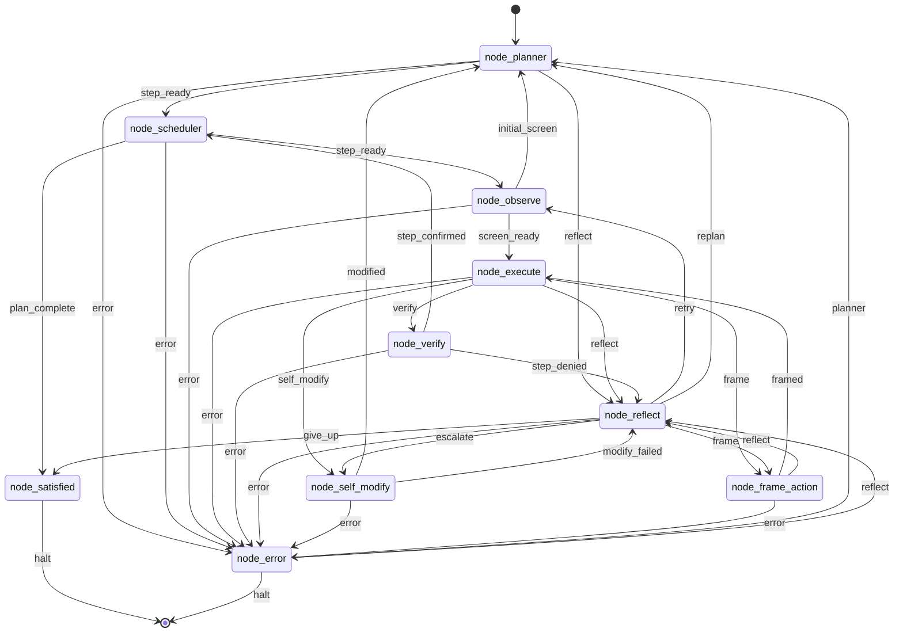

# wiring.json: The Immutable Circuit

`wiring.json` is not configuration. It is **the organism's DNA** — a single JSON file that defines the complete topology, transports, prompts, and self-modification rules. The organism never rewires itself mid-run; `node_self_modify` proposes patches, the local body validates (Python compile + JSON parse), commits, and optionally pushes.



## Transport Layer (Pluggable Brains)

```json
"model": {
  "transport": "transport_xai",
  "transport_config": {
    "transport_xai": {
      "mode": "api",
      "api_key_env": "XAI_API_KEY",
      "model": "grok-4.3",
      "reasoning": { "enabled": true, "effort": "low" }
    },
    "transport_file_proxy": {
      "request_path": "runtime_request.json",
      "response_path": "runtime_response.json"
    },
    "transport_openai": { "base_url": "http://localhost:1234", "model": "nemotron-3-nano-4b" },
    "transport_opencode": { "executable": "opencode-cli.exe" }
  }
}
```

Switching brains = changing one string. The organism doesn't care.