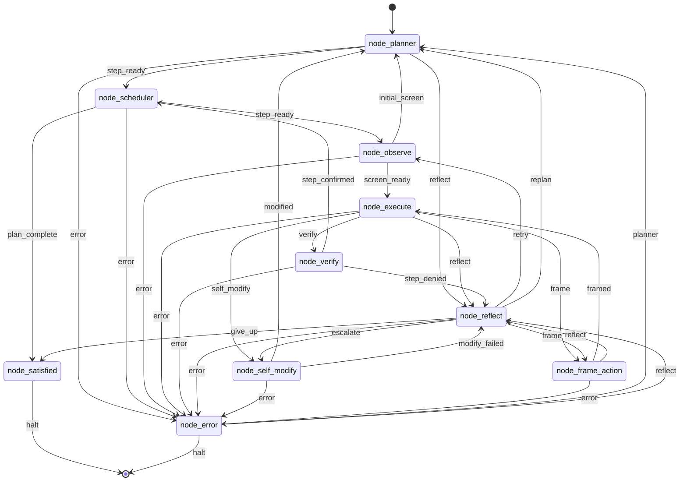
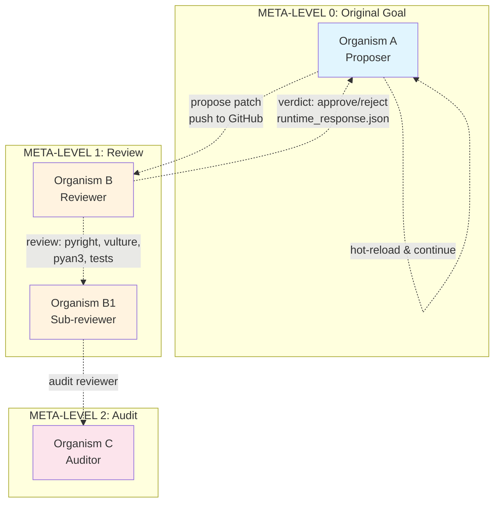
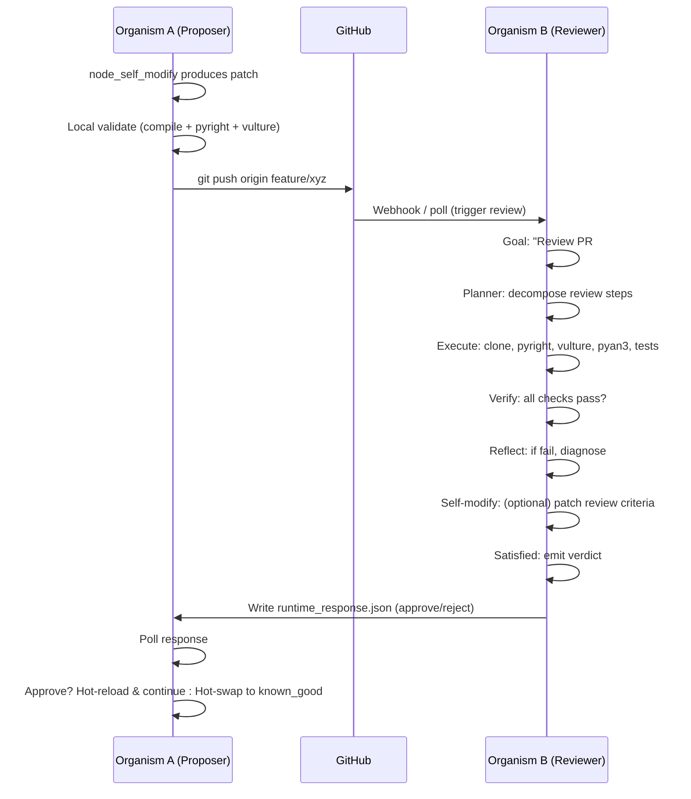

# wiring.json: The Immutable Circuit

`wiring.json` is not configuration. It is **the organism's DNA** — a single JSON file that defines the complete topology, transports, prompts, and self-modification rules. The organism never rewires itself mid-run; `node_self_modify` proposes patches, the local body validates (Python compile + JSON parse), commits, and optionally pushes.

## Base Topology (Single Organism)



## Recursive/Fractal Topology (Distributed Evolution)

When `node_self_modify` escalates to **distributed review**, the topology becomes a **tree of organisms** — each node in the tree is a full endgame-ai instance running the same wiring:



**Key insight**: The reviewer (Organism B) is **not a special node** — it's a full endgame-ai instance with the *same wiring.json*, same topology, same organs. Its "goal" is simply *"Review PR #42: validate evolution patch"*. It runs the same planner→scheduler→observe→execute→verify→reflect loop. The only difference is the goal string and the transport (file-proxy for review channel).

This makes the topology **fractal**: the same circuit at every meta-level.

## Transport Layer (Pluggable Brains)

```json
"model": {
  "transport": "transport_xai",
  "transport_config": {
    "transport_xai": {
      "mode": "api",
      "api_key_env": "XAI_API_KEY",
      "model": "grok-4.3",
      "reasoning": { "enabled": true, "effort": "low" }
    },
    "transport_file_proxy": {
      "request_path": "runtime_request.json",
      "response_path": "runtime_response.json"
    },
    "transport_openai": { "base_url": "http://localhost:1234", "model": "nemotron-3-nano-4b" },
    "transport_opencode": { "executable": "opencode-cli.exe" }
  }
}
```

Switching brains = changing one string. The organism doesn't care.

## Self-Modify as Topology Extension

The `node_self_modify` organ doesn't just patch files — it **extends the topology** by spawning a review organism:



The wiring.json doesn't change — the **topology extends dynamically** through the file-proxy protocol.