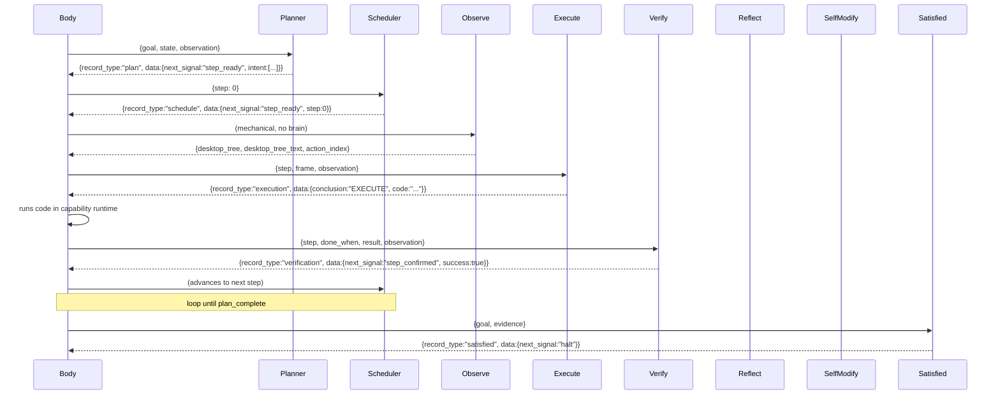

# 4. The Organ Loop: One Bus, One Signal

## Bus Contract

Every organ receives **one typed record** and emits **exactly one JSON record** whose `data.next_signal` is the only value the body routes on. Organs never call each other directly.



## Organ Roles

| Organ | Brain | Role |
|-------|-------|------|
| `node_planner` | ✅ | Decomposes goal into verifiable steps |
| `node_scheduler` | ❌ | Mechanical: advances to next step |
| `node_observe` | ❌ | Mechanical: whole-screen UIA scan |
| `node_execute` | ✅ | Writes Python code, runs in capability runtime |
| `node_verify` | ✅ | Judges step success from fresh observation only |
| `node_reflect` | ✅ | Diagnoses failure, routes: retry/replan/frame/escalate/give_up |
| `node_self_modify` | ✅ | Produces git-native evolution patches |
| `node_satisfied` | ✅ | Halts when goal complete or honest give-up |

## Capability Runtime (Injected into Execute)

```python
{
  "click_node": click_node,      # click_node("W1E2")
  "read_node": read_node,        # read_node("W1E4")
  "scroll_node": scroll_node,    # scroll_node("W2E3", -3)
  "action_nodes": action_nodes,  # filter by action type
  "pyautogui": pag,              # coordinate fallback
  "subprocess", "ctypes", "os", "sys", "json", "re", "time",
  "pathlib", "math", "random", "types",
  "wiring_limit", "repo_root", "topology_mermaid",
  "state", "wiring", "goal", "last", "fresh_observation",
  "desktop_tree_text", "action_index"
}
```

No sandbox. Full Python. The body trusts the brain.