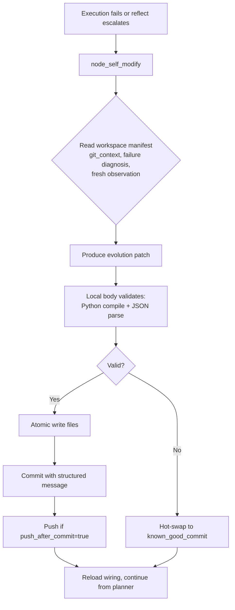

# 6. Self-Modification: Git-Native Evolution

## The Self-Modify Organ

When the organism hits a wall (missing capability, broken contract, bad prompt), `node_self_modify` doesn't workaround — it **evolves the repository**.



## Patch Schema (Enforced)

```json
{
  "record_type": "git_evolution_patch",
  "data": {
    "summary": "Unify short IDs everywhere, remove node_by_id fallback",
    "rationale": "Single lookup path via action_index keyed by short_id...",
    "read_files": ["core_nodes.py", "core_observation.py", "wiring.json"],
    "file_writes": [
      {"path": "core_nodes.py", "content": "..."},
      {"path": "core_observation.py", "content": "..."}
    ],
    "file_deletes": [],
    "wiring_patches": [
      {"op": "set", "path": "model.transport", "value": "transport_xai"}
    ],
    "commands": [
      {"command": "python -m pyright core_nodes.py", "shell": false}
    ],
    "expected_validation": "pyright clean, organism runs 5 ticks without error"
  }
}
```

## Safety Mechanisms

- **Read-before-write**: Must declare `read_files` for every touched existing file
- **Core file protection**: Cannot delete `core_*.py` or `wiring.json`
- **Rollback on failure**: Snapshots restored automatically
- **Hot-swap to known good**: `wiring.json`'s `known_good_commit` is the escape hatch
- **Atomic writes**: Temp file + `os.replace`

## The Goal Is the Memory

No vector DB. No embeddings. The **goal string** — fixed for the run — is the atemporal narrative. Each organ receives it. Each patch references it. The organism *tells itself the story of what it's doing* across ticks. Self-modification updates the story by updating the code that enacts it.