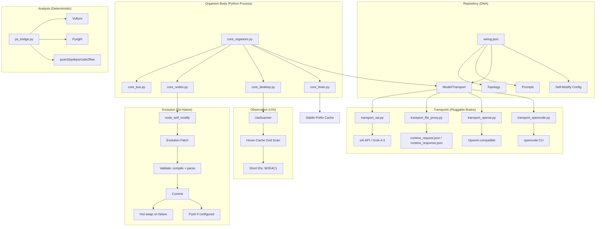

# 10. Quick Start & Meta Summary

## Run It

```bash
# Clone
git clone https://github.com/your-org/endgame-ai
cd endgame-ai

# Set XAI_API_KEY for Grok-4.3 (or use file_proxy)
$env:XAI_API_KEY = "xai-..."

# Run with a goal
python -m core_organism "Open Notepad and write 'hello world'" --max-ticks 20
```

## File Proxy Mode (No API Key)

```json
// wiring.json
"model": { "transport": "transport_file_proxy" }
```

```bash
python -m core_organism "your goal" --max-ticks 10
# Organism writes runtime_request.json
# YOU write runtime_response.json (act as the brain)
# Organism reads, continues
```

## Architecture in One Diagram



## The Vision Realized

**endgame-ai is the bridge.**

| Before | After |
|--------|-------|
| "AI automates desktop" | Universal substrate: any intelligence ↔ any Windows |
| Hardcoded LLM | `wiring.json` swaps brains in one line |
| Skills/MCP/Tools | File protocol: write JSON, read JSON |
| Persistent memory | Goal = atemporal narrative memory |
| Sandboxed | No sandbox. Full Python. Trust the brain. |
| Single agent | Multi-agent: human, AI, endgame-ai instances |

## Contributing

1. Run `python ps_bridge.py vulture . 80` — delete dead code
2. Run `python ps_bridge.py pyright .` — fix type errors
3. Run `python ps_bridge.py pyan3 . --dot --file deps.dot` — visualize imports
4. Edit `wiring.json` to change behavior (no code changes needed)
5. Self-modify: give the organism a goal to improve itself

The organism *is* the development environment. It evolves itself via GitHub. You just give it goals.

---

**We're cooking.** The bridge is built. The protocol is live. The organism is running. Now we give it better goals and watch it build the rest.